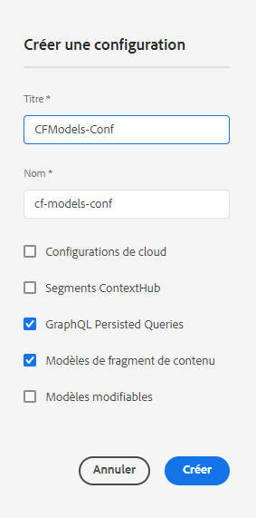

# Fragments de contenu - Explorateur de configurations {#content-fragments-configuration-browser}

Découvrez comment activer certaines fonctionnalités de fragments de contenu dans l’explorateur de configurations afin d’exploiter AEM puissantes fonctionnalités de diffusion sans interface utilisateur.

## Activation de la fonctionnalité de fragments de contenu pour votre instance {#enable-content-fragment-functionality-instance}

Avant d’utiliser les fragments de contenu, vous devez utiliser l’**Explorateur de configurations** pour activer les éléments suivants :

* **Modèles de fragment de contenu** - obligatoire
* **Requêtes persistantes GraphQL** - facultatif

>[!CAUTION]
>
>Si vous n’activez pas les **modèles de fragment de contenu** :
>
>* L’option **Créer** ne sera pas disponible pour la création de modèles.
>* vous ne pourrez pas [sélectionner la configuration Sites pour créer le point d’entrée ](/help/assets/content-fragments/graphql-api-content-fragments.md#enabling-graphql-endpoint) associé.

Pour activer la fonctionnalité de fragments de contenu, vous devez :

* activer l’utilisation de la fonctionnalité de fragments de contenu par le biais de l’explorateur de configurations ;
* appliquer la configuration à votre dossier de ressources.

### Activation de la fonctionnalité de fragments de contenu dans l’explorateur de configurations {#enable-content-fragment-functionality-in-configuration-browser}

Pour [utiliser certaines fonctionnalités de fragments de contenu,](#creating-a-content-fragment-model) vous **devez** commencer par les activer par le biais de l’**explorateur de configurations** :

>[!NOTE]
>
>Pour plus de détails, voir également [Explorateur de configurations :](/help/implementing/developing/introduction/configurations.md#using-configuration-browser).

>[!CAUTION]
>
>L’utilisation des sous-configurations (les configurations imbriquées dans une configuration) n’est pas prise en charge avec les fragments de contenu.

1. Accédez à **Outils**, **Général**, puis ouvrez l’**Explorateur de configurations**.

1. Utilisez le bouton **Créer** pour ouvrir la boîte de dialogue.

   1. Spécifiez un **Titre**.
   1. Pour activer leur utilisation, sélectionnez
      * **Modèles de fragment de contenu**
      * **Requêtes persistantes GraphQL**

      

1. Sélectionnez **Créer** pour enregistrer la définition.

<!-- 1. Select the location appropriate to your website. -->

### Application de la configuration à votre dossier de ressources {#apply-the-configuration-to-your-assets-folder}

Lorsque la configuration **global** est activée pour la fonctionnalité de fragments de contenu, elle s’applique à tout dossier Assets.

Pour utiliser d’autres configurations (c’est-à-dire à l’exclusion de la version globale) avec un dossier de ressources comparable, vous devez définir la connexion. Pour ce faire, utilisez **Configuration** sous l’onglet **Services cloud** des **Propriétés du dossier** du dossier approprié.

