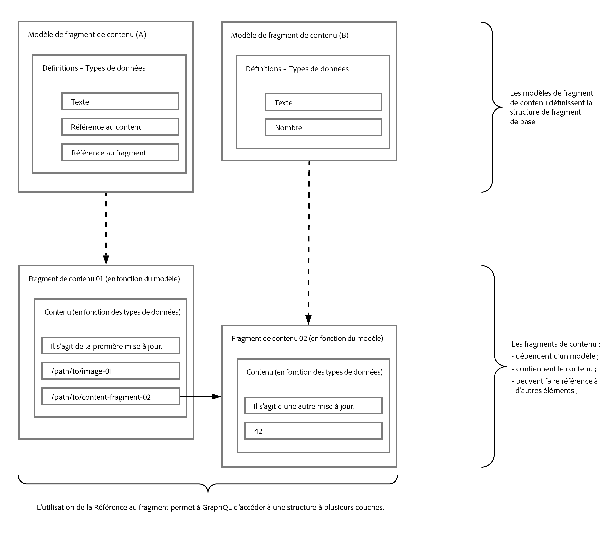

# Diffusion de contenu découplée à l’aide de fragments de contenu avec GraphQL {#headless-content-delivery-using-content-fragments-with-graphQL}

Avec les fragments de contenu et l’API GraphQL, vous pouvez utiliser Adobe Experience Manager (AEM) as a Cloud Service en tant que système de gestion de contenu (CMS) découplé.

Les fragments de contenu d’AEM peuvent être utilisées conjointement avec l’API AEM GraphQL (une implémentation personnalisée, basée sur GraphQL standard), pour fournir du contenu découplé structuré à utiliser dans vos applications. La possibilité de personnaliser une seule requête d’API vous permet de récupérer et de diffuser le contenu spécifique que vous souhaitez rendre, ou avez besoin de rendre (comme réponse à la requête d’API unique).

>[!NOTE]
>
>Voir également :
>
>* [Que désigne l’expression « Headless » ?](/help/headless/what-is-headless.md) pour une présentation des concepts et de la terminologie Headless.
>
>* [Headless et AEM](/help/headless/introduction.md) pour une présentation du Headless Development d’AEM Sites as a Cloud Service.

>[!NOTE]
>
>GraphQL est actuellement utilisé dans deux scénarios (distincts) dans Adobe Experience Manager (AEM) as a Cloud Service :
>
>* [AEM Commerce utilise les données d’une plateforme commerciale via GraphQL.](/help/commerce-cloud/cif-storefront/integrating/magento.md)
>* [AEM Content Fragments de contenu fonctionnent conjointement avec l’API AEM GraphQL (une implémentation personnalisée, basée sur GraphQL standard) pour fournir un contenu structuré à utiliser dans vos applications](/help/headless/graphql-api/content-fragments.md).

## CMS découplé {#headless-cms}

Un système de gestion de contenu découplé, ou CMS découplé, est un système de gestion de contenu (CMS) back-end uniquement créé dès le départ comme un référentiel de contenu qui rend le contenu accessible via une API pour l’afficher sur n’importe quel appareil.

En termes de création de fragments de contenu dans AEM, cela signifie que :

* Vous pouvez utiliser les fragments de contenu pour créer du contenu qui n’est pas principalement destiné à être publié directement (1:1) sur des pages formatées.

* Le contenu de vos fragments de contenu est structuré d’une manière prédéterminée, selon les modèles de fragments de contenu. Cela simplifie l’accès à vos applications qui poursuivront le traitement de votre contenu.

## GraphQL – Présentation {#graphql-overview}

GraphQL est :

* « *...un langage de requête pour les API et un environnement d’exécution pour répondre à ces requêtes avec vos données existantes* ».

  Voir [GraphQL.org](https://graphql.org)

L’[API AEM GraphQL](#aem-graphql-api) permet d’effectuer des requêtes (complexes) sur vos [fragments de contenu](/help/assets/content-fragments/content-fragments.md) ; chaque requête étant conforme à un type de modèle spécifique. Le contenu renvoyé peut alors être utilisé par vos applications.

## API AEM GraphQL {#aem-graphql-api}

Une implémentation personnalisée de l’API GraphQL standard a été développée pour Adobe Experience as a Cloud Experience. Consultez [API AEM GraphQL à utiliser avec des fragments de contenu](/help/headless/graphql-api/content-fragments.md) pour plus d’informations.

L’implémentation de l’API AEM GraphQL repose sur les [bibliothèques Java GraphQL](https://graphql.org/code/#java).

## Fragments de contenu à utiliser avec l’API AEM GraphQL {#content-fragments-use-with-aem-graphql-api}

[Les fragments de contenu](#content-fragments) peuvent servir de base à GraphQL pour les requêtes AEM car :

* Ils permettent de concevoir, créer, traiter et publier du contenu indépendant des pages.
* Les [modèles de fragments de contenu](#content-fragments-models) fournissent la structure requise au moyen de types de données définis.
* La [Référence du fragment](#fragment-references), disponible lors de la définition d’un modèle, peut être utilisée pour définir des couches supplémentaires de structure.

### Fragments de contenu {#content-fragments}

Les fragments de contenu :

* contiennent du contenu structuré ;

* reposent sur un [modèle de fragment de contenu](#content-fragments-models), qui prédéfinit la structure pour le fragment résultant.

### Modèles de fragment de contenu {#content-fragments-models}

Ces [modèles de fragment de contenu](/help/assets/content-fragments/content-fragments-models.md) :

* Sont utilisés pour générer les [Schémas](https://graphql.org/learn/schema/), une fois **Activés**.

* fournissent les types de données et les champs requis pour GraphQL ; garantissent que votre application ne demande que ce qui est possible et reçoive ce qui est attendu.

* Le type de données **[Références de fragments](#fragment-references)** peut être utilisé dans votre modèle pour faire référence à un autre fragment de contenu et introduit ainsi des niveaux de structure supplémentaires.

### Références à un fragment {#fragment-references}

La **[référence à un fragment](/help/assets/content-fragments/content-fragments-models.md#fragment-reference-nested-fragments)** :

* est particulièrement intéressante en lien avec GraphQL ;

* est un type de données spécifique qui peut être utilisé lors de la définition d’un modèle de fragment de contenu ;

* Fait référence à un autre fragment, en fonction d’un modèle de fragment de contenu spécifique.

* Permet de récupérer des données structurées.

   * Lorsqu’elle est définie comme **référence à sources multiples**, plusieurs sous-fragments peuvent être référencés (récupérés) par le fragment principal.

### Prévisualisation JSON {#json-preview}

Pour faciliter la conception et le développement de vos modèles de fragments de contenu, vous pouvez prévisualiser la [sortie JSON](/help/assets/content-fragments/content-fragments-json-preview.md).

## Apprendre à utiliser GraphQL avec AEM – Exemple de contenu et de requêtes {#learn-graphql-with-aem-sample-content-queries}

Voir [Utilisation de GraphQL avec AEM – Exemple de contenu et de requêtes](/help/headless/graphql-api/sample-queries.md) pour une présentation de l’utilisation de l’API AEM GraphQL.

## Tutoriel – Prise en main d’AEM découplé et de GraphQL

Vous cherchez un tutoriel pratique ? Consultez le tutoriel complet [Prise en main d’AEM Headless et de GraphQL](https://experienceleague.adobe.com/docs/experience-manager-learn/getting-started-with-aem-headless/graphql/overview.html?lang=fr) illustrant comment créer et exposer du contenu à l’aide des API GraphQL d’AEM et consommé par une application externe, dans un scénario CMS découplé.
