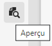
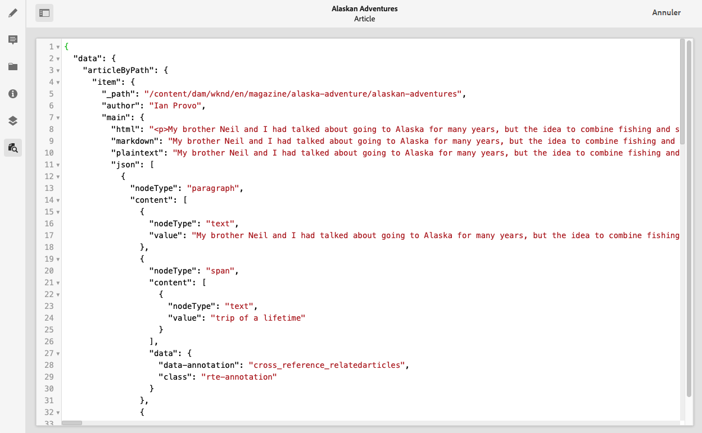

# Aperçu – Représentation JSON {#preview-json-representation}

Au cours du développement de modèles pour les fragments de contenu dans le cadre de votre mise en œuvre AEM découplée, vous souhaiterez éventuellement voir l’exemple de sortie JSON pour un fragment de contenu, basé sur un modèle. Vous pourrez ainsi, par exemple, avoir une idée de l’aspect du résultat final. Cela peut s’avérer utile lors de la validation de la structure JSON du modèle, avec peut-être un exemple de contenu par type de données.

>[!NOTE]
>
>Les fragments de contenu sont une fonctionnalité de sites, mais sont stockés sous la forme **Ressources**.
>
>Il existe deux éditeurs pour la création de fragments de contenu. Bien que la fonctionnalité de base soit la même, il existe des différences. Cette section décrit l’éditeur d’origine, principalement accessible à partir de la console **Assets**. Pour plus d’informations sur le nouvel éditeur, voir la documentation Sites, [Fragments de contenu - Création](/help/sites-cloud/administering/content-fragments/authoring.md), (principalement accessible à partir de la console **Fragments de contenu**).

Utilisation de l’icône **Aperçu** :

Vous pouvez afficher la représentation JSON du fragment actif. Par exemple :

<!--
**Copy URL** lets you copy to clipboard the URL for either author or publish.
-->