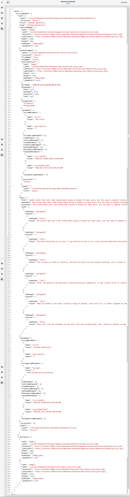

# Prévisualisation - Représentation JSON {#preview-json-representation}

>[!CAUTION]
>
>L’AEM API GraphQL, pour Content Fragment Diffusion, sera disponible début 2021.
>
>La documentation correspondante est déjà disponible à des fins de prévisualisation.

Lors du développement des modèles pour les fragments de contenu, vous pouvez vue l’exemple de sortie JSON pour un fragment de contenu, selon un modèle. Par exemple, pour avoir une idée de l’aspect de la sortie finale. Cela peut s’avérer utile lors de la validation de la structure JSON du modèle, avec peut-être un exemple de contenu par type de données.

Utilisation de l&#39;icône **Prévisualisation** :

Vous pouvez vue la représentation JSON du fragment actif. Par exemple :

