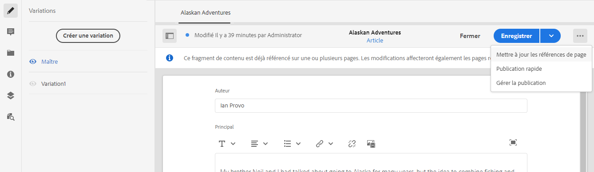

# Gérer des fragments de contenu {#managing-content-fragments}

Découvrez comment utiliser la console Assets pour gérer vos fragments de contenu AEM, que ce soit pour la base de votre contenu découplé ou pour la création de pages.

Après avoir défini vos [modèles de fragment de contenu](#creating-a-content-model), vous pouvez les utiliser pour [créer vos fragments de contenu](#creating-a-content-fragment).

L’[éditeur de fragment de contenu](#opening-the-fragment-editor) fournit différents [modes](#modes-in-the-content-fragment-editor) vous permettant :

* de [modifier du](#editing-the-content-of-your-fragment) contenu et de [gérer des variations ;](#creating-and-managing-variations-within-your-fragment)
* [d’annoter votre fragment ;](/help/assets/content-fragments/content-fragments-variations.md#annotating-a-content-fragment)
* [d’associer du contenu à votre fragment ;](#associating-content-with-your-fragment)
* [de configurer des métadonnées ;](#viewing-and-editing-the-metadata-properties-of-your-fragment)
* [d’affcher l’arborescence de la structure ;](/help/assets/content-fragments/content-fragments-structure-tree.md)
* [de générer un aperçu de la représentation JSON.](/help/assets/content-fragments/content-fragments-json-preview.md)

>[!NOTE]
>
>Il est possible d’utiliser les fragments de contenu comme suit :
>
>* lors de la création de pages ; voir [Création de pages avec des fragments de contenu](/help/sites-cloud/authoring/fragments/content-fragments.md).
>* pour la [Diffusion de contenu découplé utilisant des fragments de contenu avec GraphQL](/help/assets/content-fragments/content-fragments-graphql.md).

>[!NOTE]
>
>Les fragments de contenu sont une fonctionnalité de sites, mais sont stockés sous la forme **Ressources**.
>
>Ils sont désormais principalement gérés avec la console **[Fragments de contenu](/help/sites-cloud/administering/content-fragments/overview.md#content-fragments-console)** mais ils peuvent toujours être gérés à partir de la console **Ressources**. Cette section traite de la gestion à partir de la console **Ressources**.
>
>Il existe deux éditeurs pour créer des fragments de contenu ; bien que la fonctionnalité de base soit la même, il existe quelques différences. Cette section couvre l’éditeur d’origine, accessible principalement à partir de la console **Assets**. Voir la documentation Sites, [Fragments de contenu - Création](/help/sites-cloud/administering/content-fragments/authoring.md), pour plus d’informations sur le nouvel éditeur (principalement accessible à partir de la console **Fragments de contenu**). Les deux éditeurs comportent un bouton bascule dans la barre d’outils supérieure pour fournir un accès rapide à l’autre éditeur.

## Créer des fragments de contenu {#creating-content-fragments}

### Création d’un modèle de contenu {#creating-a-content-model}

Les [modèles de fragments de contenu](/help/assets/content-fragments/content-fragments-models.md) peuvent être activés et créés, avant de créer des fragments de contenu avec le contenu structuré.

### Création d’un fragment de contenu {#creating-a-content-fragment}

La méthode de création d’un fragment de contenu est la suivante :

1. Accédez au dossier **Ressources** dans lequel vous souhaitez créer le fragment.
1. Pour ouvrir l’assistant, sélectionnez **Créer**, puis **Fragment de contenu**.
1. La première étape de l’assistant nécessite de spécifier la base du nouveau fragment.

   * [Modèle](/help/assets/content-fragments/content-fragments-models.md) : utilisé pour créer un fragment qui nécessite du contenu structuré, par exemple, le modèle **Adventure**.

      * Tous les modèles disponibles s’affichent.

   Après la sélection, cliquez ou appuyez sur **Suivant** pour continuer.

   

1. Dans l’étape **Propriétés**, spécifiez :

   * **De base**

      * **Titre**

        Titre du fragment.

        Obligatoire.

      * **Description**

      * **Balises**

   * **Avancé**

      * **Nom**

        Nom utilisé pour former l’URL.

        Obligatoire, il est dérivé automatiquement du titre, mais il peut être modifié.

1. Sélectionnez **Créer** pour terminer l’action, puis **ouvrez** le fragment en mode d’édition ou revenez à la console en sélectionnant **Terminé**.

   >[!NOTE]
   >En mode **Liste** de la console, vous pouvez mettre à jour les **Paramètres d’affichage** pour activer la colonne **Modèle de fragment de contenu**.

## Actions pour un fragment de contenu dans la console de ressources {#actions-for-a-content-fragment-assets-console}

Dans la console **Ressources**, vous pouvez exécuter diverses actions pour vos fragments de contenu :

* Dans la barre d’outils, une fois le fragment sélectionné, toutes les actions appropriées sont disponibles :
* Comme [actions rapides](/help/sites-cloud/authoring/basic-handling.md#quick-actions) ; un sous-ensemble d’actions disponibles pour les cartes de fragments individuelles.

Sélectionnez le fragment pour afficher la barre d’outils avec les actions applicables :

* **Retraiter les éléments**
* **Créer**
* **Télécharger**

   * Enregistrez le fragment sous forme d’un fichier ZIP. Vous pouvez indiquer si vous souhaitez inclure des éléments, des variations ou des métadonnées.

* **Passage en caisse**
* **Propriétés**

   * Permet d’afficher ou de modifier les métadonnées du fragment, ou les deux.

* **Modifier**

   * Permet [d’ouvrir le fragment afin d’en modifier le contenu](/help/assets/content-fragments/content-fragments-variations.md) ainsi que ses variations, contenu, métadonnées et éléments associés.

* **Publication rapide**
* **Gérer la publication**
* **Gérer les balises**
* **À la collection**
* **Copier** (et **coller**)
* **Déplacer**
* **Supprimer**

>[!NOTE]
>
>La plupart de ces actions sont [standard pour Assets](/help/assets/manage-digital-assets.md) et/ou l’[application de bureau AEM](https://helpx.adobe.com/fr/experience-manager/desktop-app/aem-desktop-app.html).

## Ouverture de l’éditeur de fragments {#opening-the-fragment-editor}

Pour ouvrir votre fragment à des fins de modification :

>[!CAUTION]
>
>Pour modifier un fragment de contenu, vous devez disposer des [autorisations appropriées](/help/implementing/developing/extending/content-fragments-customizing.md#asset-permissions). Si vous rencontrez des problèmes, contactez votre administration système.

1. Utilisez la console **Ressources** afin de naviguer jusqu’à l’emplacement de votre fragment de contenu.
1. Ouvrez le fragment à modifier, en effectuant l’une des opérations suivantes :

   * Cliquer/appuyer sur le fragment ou le lien du fragment (cela dépend de l’affichage de la console).
   * Sélectionnez le fragment, puis cliquez sur **Modifier** dans la barre d’outils.

1. L’éditeur de fragment s’ouvre. Apportez les modifications nécessaires :

   

1. Après avoir apporté vos modifications, cliquez sur **Enregistrer**, **Enregistrer et fermer** ou **Fermer** selon les besoins.

   >[!NOTE]
   >
   >**Enregistrer et fermer** est disponible par le biais de la liste déroulante **Enregistrer**.

   >[!NOTE]
   >
   >Les options **Enregistrer et fermer** et **Fermer** vous font quitter l’éditeur. Pour plus d’informations sur le fonctionnement des différentes options avec les fragments de contenu, voir [Enregistrer, Fermer et Versions](#save-close-and-versions).

## Modes et actions dans l’éditeur de fragment de contenu {#modes-actions-content-fragment-editor}

L’éditeur de fragments de contenu comporte différents modes et actions.

### Modes dans l’éditeur de fragment de contenu {#modes-in-the-content-fragment-editor}

Naviguez entre les différents modes en utilisant les icônes du panneau latéral :

* Variations : [Modification du contenu](#editing-the-content-of-your-fragment) et [Gestion des variations](#creating-and-managing-variations-within-your-fragment)

* [Annotations](/help/assets/content-fragments/content-fragments-variations.md#annotating-a-content-fragment)
* [Contenu associé](#associating-content-with-your-fragment)
* [Métadonnées](#viewing-and-editing-the-metadata-properties-of-your-fragment)
* [Arborescence de la structure](/help/assets/content-fragments/content-fragments-structure-tree.md)
* [Aperçu](/help/assets/content-fragments/content-fragments-json-preview.md)

### Barre d’outils d’actions dans l’éditeur de fragment de contenu {#toolbar-actions-in-the-content-fragment-editor}

Certaines fonctions de la barre d’outils supérieure sont disponibles dans différents modes :

* Un message s’affiche si le fragment est déjà référencé dans une page de contenu. Vous pouvez **Fermer** le message.

* Le panneau latéral peut être masqué/affiché en appuyant sur l’icône **Activer/désactiver le panneau latéral**.

* Sous le nom du fragment, vous pouvez voir le nom du [Modèle de fragment de contenu](/help/assets/content-fragments/content-fragments-models.md) utilisé pour créer le fragment actif :

   * Le nom est également un lien servant à ouvrir l’éditeur de modèles.

* Voir le statut du fragment, par exemple, les informations relatives à la date et à l’heure de création, de modification ou de publication. Le statut est également codé par couleur :

   * **Nouveau** : gris
   * **Version préliminaire** : bleu
   * **Publié** : vert
   * **Modifié** : orange
   * **Désactivé** : rouge

* Un bouton permet d’**Essayer un nouvel éditeur** en ouvrant directement l’*nouvel* [Éditeur de fragment de contenu](/help/sites-cloud/administering/content-fragments/authoring.md) accessible via la console [Fragments de contenu](/help/sites-cloud/administering/content-fragments/overview.md#content-fragments-console).

  >[!WARNING]
  >
  >Le nouvel éditeur s’ouvre dans le même onglet. Il n’est pas recommandé d’ouvrir les deux éditeurs en même temps.

* **Enregistrer** permet d’accéder à l’option **Enregistrer et fermer**.

* La liste déroulante marquée des trois points (**...**) donne accès à des actions supplémentaires :
   * **Mettre à jour les références de page**
      * Cette option met à jour toutes les références de la page.
   * **[Publication rapide](#publishing-and-referencing-a-fragment)**
   * **[Gérer la publication](#publishing-and-referencing-a-fragment)**

<!--
This updates any page references and ensures that the Dispatcher is flushed as required. -->

## Enregistrer, Fermer et Versions {#save-close-and-versions}

>[!NOTE]
>
>Les versions peuvent également être [créées, comparées et rétablies à partir de la chronologie](/help/assets/content-fragments/content-fragments-managing.md#timeline-for-content-fragments).

L’éditeur possède différentes options :

* **Enregistrer** et **Enregistrer et fermer**

   * **Enregistrer** enregistrera les dernières modifications et vous resterez dans l’éditeur.
   * **Enregistrer et fermer** enregistrer les dernières modifications et vous permet de quitter l’éditeur.

  >[!CAUTION]
  >
  >Pour modifier un fragment de contenu, vous devez disposer des [autorisations appropriées](/help/implementing/developing/extending/content-fragments-customizing.md#asset-permissions). Si vous rencontrez des problèmes, contactez votre administration système.

  >[!NOTE]
  >
  >Pour rester dans l’éditeur, il suffit d’apporter une série de modifications avant d’enregistrer.

  >[!CAUTION]
  >
  >En plus de simplement enregistrer vos modifications, ces actions mettent également à jour les références éventuelles et s’assurent que le Dispatcher est nettoyé si nécessaire. Le traitement de ces modifications peut prendre du temps. Ce délai peut avoir un impact sur les performances d’un système volumineux/complexe/lourdement chargé.
  >
  >Prenez cela en compte lorsque vous cliquez sur **Enregistrer et fermer**. Rouvrez aussitôt l’éditeur de fragments afin d’apporter d’autres modifications et de les enregistrer.

* **Fermer**

  Quitte l’éditeur sans enregistrer les dernières modifications (c’est-à-dire celles effectuées depuis la dernière fois que vous avez cliqué sur **Enregistrer**).

Lorsque vous modifiez votre fragment de contenu, AEM crée automatiquement des versions pour que le contenu précédent puisse être restauré si vous annulez les modifications (en cliquant sur **Fermer** sans enregistrer) :

1. Lorsqu’un fragment de contenu est ouvert pour modification, AEM vérifie l’existence d’un jeton basé sur les cookies indiquant s’il existe une *session de modification* :

   1. Si le jeton est trouvé, le fragment est considéré comme faisant partie de la session de modification existante.
   2. Si le jeton n’est *pas* disponible et que l’utilisateur ou l’utilisatrice commence à modifier le contenu, une version est créée et un jeton est envoyé au client pour cette nouvelle session de modification, où il est enregistré dans un cookie.

2. Lors d’une session de modification *active*, le contenu en cours de modification est automatiquement enregistré toutes les 600 secondes (par défaut).

   >[!NOTE]
   >
   >L’intervalle d’enregistrement automatique est configurable à l’aide du mécanisme `/conf`.
   >
   >Valeur par défaut, voir :
   >  `/libs/settings/dam/cfm/jcr:content/autoSaveInterval`

3. Si l’utilisateur choisit d’annuler la modification, la version créée au début de la session de modification est restaurée et le jeton est supprimé afin de mettre fin à la session de modification.
4. Si l’utilisateur choisit d’**enregistrer** les modifications apportées, les éléments/variations mis à jour sont conservés et le jeton est supprimé pour mettre fin à la session de modification.

## Modification du contenu du fragment {#editing-the-content-of-your-fragment}

Une fois que vous avez ouvert le fragment, vous pouvez utiliser l’onglet [Variations](/help/assets/content-fragments/content-fragments-variations.md) pour créer votre contenu.

## Création et gestion de variations dans un fragment {#creating-and-managing-variations-within-your-fragment}

Une fois que vous avez créé le contenu maître, vous pouvez créer et gérer des [Variations](/help/assets/content-fragments/content-fragments-variations.md) de ce contenu.

## Association de contenu au fragment {#associating-content-with-your-fragment}

Vous pouvez également [associer du contenu](/help/assets/content-fragments/content-fragments-assoc-content.md) à un fragment. Vous fournissez ainsi une connexion afin que les ressources (les images, par exemple) puissent (éventuellement) être utilisées avec le fragment lorsqu’il est ajouté à une page de contenu.

## Afficher et modifier des métadonnées (propriétés) du fragment {#viewing-and-editing-the-metadata-properties-of-your-fragment}

Vous pouvez afficher et modifier les propriétés d’un fragment à l’aide de l’onglet [Métadonnées](/help/assets/content-fragments/content-fragments-metadata.md).

## Chronologie pour les fragments de contenu {#timeline-for-content-fragments}

Outre les options standard, la [Chronologie](/help/assets/manage-digital-assets.md#timeline) fournit les informations et les actions spécifiques aux fragments de contenu :

* Affichage d’informations sur les versions, les commentaires et les annotations
* Actions pour les versions

   * **[Revenir à cette version](#reverting-to-a-version)** (sélectionner un fragment existant, puis une version spécifique)

   * **[Comparer à actuel](#comparing-fragment-versions)** (sélectionner un fragment existant, puis une version spécifique)

   * Ajouter une **étiquette** et/ou un **commentaire** (sélectionner un fragment existant, puis une version spécifique)

   * **Enregistrer comme version** (sélectionner un fragment existant, puis la flèche vers le haut située en bas du journal)

* Actions pour les annotations

   * **Supprimer**

>[!NOTE]
>
>Les commentaires sont les suivants :
>
>* Fonctionnalité standard de toutes les ressources
>* Créé dans le journal
>* Lié à la ressource de fragment
>
>Les annotations (pour les fragments de contenu) sont les suivantes :
>
>* Entré dans l’éditeur de fragments
>* Spécifique à un segment de texte sélectionné dans le fragment
>
>Les commentaires saisis dans le nouvel [éditeur de fragment de contenu](/help/sites-cloud/administering/content-fragments/authoring.md#commenting-on-your-fragment) ne s’affichent pas non plus.

Par exemple :

## Comparaison des versions de fragments {#comparing-fragment-versions}

L’action **Comparer avec la version actuelle** est disponible à partir du [Journal](/help/assets/content-fragments/content-fragments-managing.md#timeline-for-content-fragments) après avoir sélectionné une version spécifique.

Cette action ouvre :

* la version **actuelle** (la plus récente) (à gauche) ;

* la version sélectionnée **v&lt;*x.y*>** (à droite).

Ces dernières sont affichées dans des versions côte à côte dans lesquelles :

* les différences sont mises en surbrillance ;

   * le texte supprimé est en rouge ;
   * le texte inséré est en vert ;
   * le texte remplacé est en bleu.

* L’icône Plein écran vous permet d’ouvrir l’une des versions seule puis de basculer à nouveau sur la vue parallèle.
* Vous pouvez **rétablir** la version spécifique
* **Terminé** vous ramène à la console.

>[!NOTE]
>
>Vous ne pouvez pas modifier le contenu d’un fragment lors de la comparaison de fragments.

## Restauration vers une version spécifique   {#reverting-to-a-version}

Vous pouvez rétablir une version spécifique de votre fragment :

* Directement à partir du [Journal](/help/assets/content-fragments/content-fragments-managing.md#timeline-for-content-fragments).

  Sélectionnez la version requise, puis l’action **Revenir à cette version**.

* Lors de la [comparaison d’une version à la version actuelle](/help/assets/content-fragments/content-fragments-managing.md#comparing-fragment-versions), vous pouvez **restaurer** la version sélectionnée.

## Publication et référencement d’un fragment {#publishing-and-referencing-a-fragment}

>[!CAUTION]
>
>Si votre fragment est basé sur un modèle, vous devez vous assurer que le [modèle a été publié](/help/assets/content-fragments/content-fragments-models.md#publishing-a-content-fragment-model).
>
>Si vous publiez un fragment de contenu pour lequel le modèle n’a pas encore été publié, une liste de sélection l’indique. Elle précise également que le modèle est publié avec le fragment.

Les fragments de contenu doivent être publiés pour être utilisés dans l’environnement de publication. Pour ce faire, utilisez la fonctionnalité Assets standard :

* [Publication rapide](/help/assets/manage-publication.md#quick-publish)
* [Gérer la publication](/help/assets/manage-publication.md#manage-publication)

Vous pouvez y accéder des façons suivantes :

* Après la création, en utilisant les actions [disponibles dans la console de ressources](#actions-for-a-content-fragment-assets-console).
* Dans l’[éditeur de fragment de contenu](#toolbar-actions-in-the-content-fragment-editor).

De plus, lorsque vous [publiez une page qui utilise ce fragment](/help/sites-cloud/authoring/fragments/content-fragments.md#publishing), celui-ci est répertorié dans les références de la page.

>[!CAUTION]
>
>Une fois qu’un fragment a été publié et/ou référencé, AEM affiche un avertissement lorsqu’un auteur ouvre à nouveau ce fragment en mode d’édition. Il s’agit de signaler que les modifications apportées au fragment seront également répercutées sur les pages référencées.

## Suppression d’un fragment {#deleting-a-fragment}

Pour supprimer un fragment :

1. Dans la console **Assets**, naviguez jusqu’à l’emplacement du fragment de contenu.
2. Sélectionnez le fragment.

   >[!NOTE]
   >
   >L’action **Supprimer** n’est pas proposée comme action rapide.

3. Sélectionnez **Supprimer** dans la barre d’outils.
4. Confirmez l’action **Supprimer**.

   >[!CAUTION]
   >
   >Si le fragment est déjà référencé dans une page, un message d’avertissement vous demande de confirmer que vous souhaitez poursuivre et **forcer la suppression**. Le fragment et son composant de fragment de contenu sont supprimés de toutes les pages de contenu.
