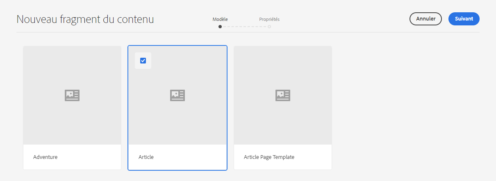
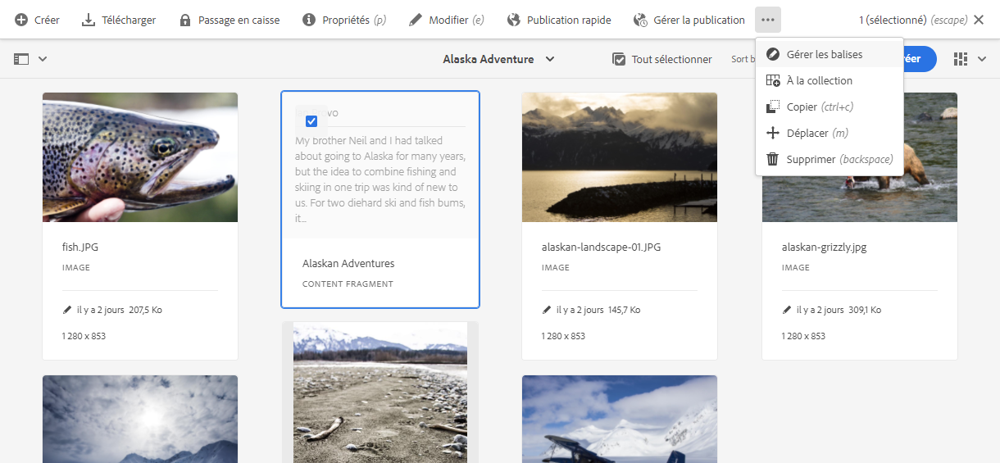
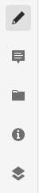
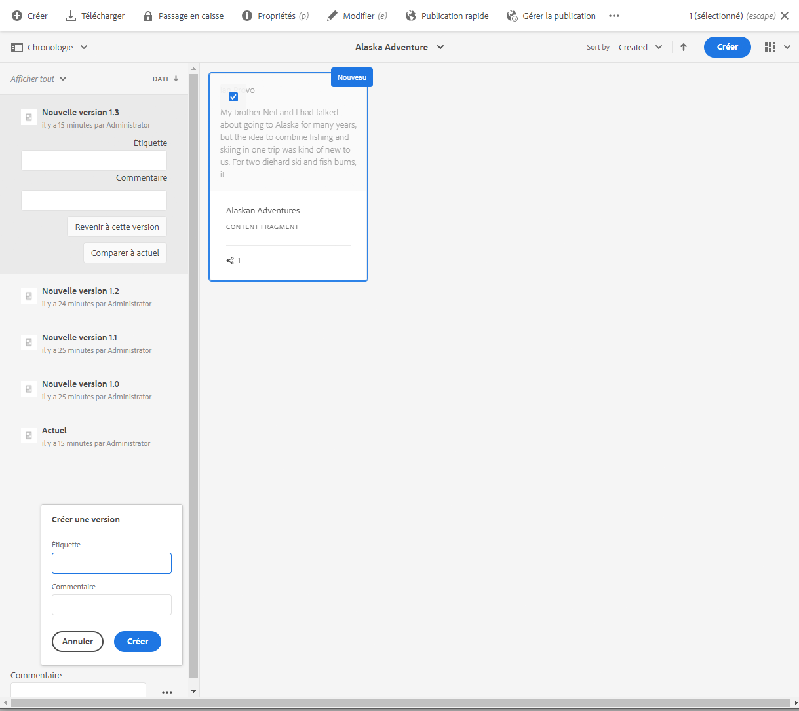
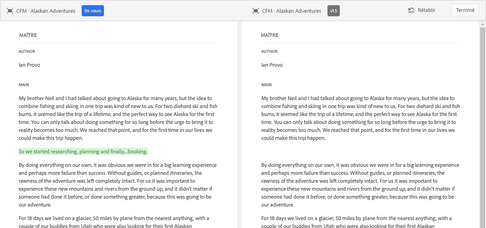

# Gestion des fragments de contenu{#managing-content-fragments}

Les fragments de contenu sont stockés en tant que **Ressources**, et ils sont donc principalement gérés par l’intermédiaire de la console **Ressources**.

>[!NOTE]
>
>Les fragments de contenu sont ensuite utilisés avec les pages de création ; voir [Création de page avec des fragments de contenu](/help/sites-cloud/authoring/fundamentals/content-fragments.md).

## Création de fragments de contenu   {#creating-content-fragments}

### Création d’un modèle de contenu {#creating-a-content-model}

Les [modèles de fragments de contenu](/help/assets/content-fragments/content-fragments-models.md) peuvent être activés et créés, avant de créer des fragments de contenu avec le contenu structuré.

>[!NOTE]
>
>Voir Développement de fragments de contenu pour plus d’informations sur les modèles ; utilisés pour les fragments de contenu simples.

<!--
>[!NOTE]
>
>See [Developing Content Fragments](/help/sites-developing/customizing-content-fragments.md) for further information on templates; used for simple content fragments.
-->

### Création d’un fragment de contenu {#creating-a-content-fragment}

La méthode de création de fragments de contenu est (fondamentalement) la même pour les fragments simples et structurés :

1. Accédez au dossier de **ressources** dans lequel vous souhaitez créer le fragment.
2. Pour ouvrir l’assistant, sélectionnez **Créer**, puis **Fragment de contenu**.
3. La première étape de l’assistant nécessite que vous spécifiiez la base du nouveau fragment.

   * Cela peut être :

      * un modèle, par exemple, un **Fragment simple** ;<!-- [Template](/help/sites-developing/content-fragment-templates.md) - for example **Simple Fragment** -->

      * un [modèle](/help/assets/content-fragments/content-fragments-models.md) utilisé pour créer un fragment qui nécessite du contenu structuré, par exemple, le modèle **Airports**.
   * Tous les modèles disponibles sont affichés.
   Après la sélection, cliquez ou appuyez sur **Suivant** pour continuer.

   

4. Dans l’étape **Propriétés**, spécifiez :

   * **De base**

      * **Titre**

         Titre du fragment.

         Obligatoire.

      * **Description**

      * **Balises**
   * **Avancé**

      * **Nom**

         Nom utilisé pour former l’URL.

         Obligatoire, il sera dérivé automatiquement du titre, mais il peut être modifié.

5. Sélectionnez **Créer** pour terminer l’action, puis **ouvrez** le fragment en mode d’édition ou revenez à la console en sélectionnant **Terminé**.

## Actions pour un fragment de contenu {#actions-for-a-content-fragment}

Dans la console **Ressources**, différentes actions sont disponibles pour vos fragments de contenu, soit :

* dans la barre d’outils : une fois le fragment sélectionné, toutes les actions appropriées sont disponibles ;
* sous forme d’[actions rapides](/help/sites-cloud/authoring/getting-started/basic-handling.md#quick-actions) : un sous-ensemble d’actions disponibles pour les différentes cartes de fragments.

Sélectionnez le fragment pour afficher la barre d’outils avec les actions applicables :

* **Créer**
* **Téléchargement**

   * Enregistrez le fragment sous forme d’un fichier ZIP. Vous pouvez indiquer si vous souhaitez inclure des éléments, des variations ou des métadonnées.

* **Passage en caisse**
* **Propriétés**

   * Permet d’afficher et/ou de modifier les métadonnées du fragment.

* **Modifier**

   * Permet [d’ouvrir le fragment afin d’en modifier le contenu](/help/assets/content-fragments/content-fragments-variations.md) ainsi que ses variations, contenu, métadonnées et éléments associés.

* **Gérer les balises**
* **À la collection**

   * Ajoutez le fragment à une collection.
   * Ceci peut également être réalisé [en associant une collection au fragment](/help/assets/content-fragments/content-fragments-assoc-content.md#adding-associated-content).

* **Copier**/**Coller**

* **Déplacer**
* **Publication rapide**
* **Gérer la publication**
* **Supprimer**

>[!NOTE]
>
>La plupart de ces actions sont [standard pour Assets](/help/assets/manage-digital-assets.md) et/ou l’[application de bureau AEM](https://helpx.adobe.com/fr/experience-manager/desktop-app/aem-desktop-app.html).

## Ouverture de l’éditeur de fragments {#opening-the-fragment-editor}

Pour ouvrir votre fragment à des fins de modification :

<!--
>[!CAUTION]
>
>To edit a content fragment you need [the appropriate permissions](/help/sites-developing/customizing-content-fragments.md#asset-permissions). Please contact your system administrator if you are experiencing issues.
-->

>[!CAUTION]
>
>Pour modifier un fragment de contenu, vous devez disposer des autorisations appropriées. Si vous rencontrez des problèmes, contactez votre administrateur système.

1. Utilisez la console **Assets** afin de naviguer jusqu’à l’emplacement de votre fragment de contenu.
2. Ouvrez le fragment en mode édition, en effectuant l’une des opérations suivantes :

   * Cliquez/appuyez sur le fragment ou le lien de fragment (selon l’affichage console).
   * Sélectionnez le fragment, puis cliquez sur **Modifier** dans la barre d’outils.
   L’éditeur de fragment s’ouvre alors :

   

   >[!NOTE]
   >
   >1. Un message s’affiche si le fragment est déjà référencé dans une page de contenu.
      >
      >
      >

   2. Le panneau latéral peut être masqué/affiché en appuyant sur l’icône **Activer/désactiver le panneau latéral**.

3. Naviguez parmi les trois modes à l’aide des icônes du panneau latéral :

   * Variations : [ Modification du contenu](#editing-the-content-of-your-fragment) et [Gestion des variations](#creating-and-managing-variations-within-your-fragment)

   * [Annotations](/help/assets/content-fragments/content-fragments-variations.md#annotating-a-content-fragment)
   * [Contenu associé](#associating-content-with-your-fragment)
   * [Métadonnées](#viewing-and-editing-the-metadata-properties-of-your-fragment)
   

4. Après avoir effectué les modifications, utilisez **Enregistrer** ou **Annuler** selon le cas.

   >[!NOTE]
   >
   >Les options **Enregistrer** et **Annuler** ont pour effet de fermer l’éditeur. Reportez-vous à [Enregistrer, Annuler et Versions](#save-cancel-and-versions) pour obtenir des informations complètes sur la façon dont les options fonctionnent sur les fragments de contenu.

## Enregistrer, Annuler et Versions   {#save-cancel-and-versions}

>[!NOTE]
>
>Les versions peuvent également être [créées, comparées et rétablies à partir de la chronologie](/help/assets/content-fragments/content-fragments-managing.md#timeline-for-content-fragments).

L’éditeur possède deux options :

* **Enregistrer**

   Enregistre les dernières modifications et quitte l’éditeur.

   >[!CAUTION]
   >
   >Pour modifier un fragment de contenu, vous devez disposer des autorisations appropriées. Si vous rencontrez des problèmes, contactez votre administrateur système.

   <!-- 
  >[!CAUTION]
  >
  >To edit a content fragment you need [the appropriate permissions](/help/sites-developing/customizing-content-fragments.md#asset-permissions). Please contact your system administrator if you are experiencing issues. 
  -->

   >[!NOTE]
   >
   >Pour rester dans l’éditeur, il suffit d’apporter une série de modifications avant de sélectionner **Enregistrer**.

   >[!CAUTION]
   >
   >En plus de simplement enregistrer vos modifications, l’option **Enregistrer** met à jour les références éventuelles et s’assure que le Dispatcher est nettoyé si nécessaire. Le traitement de ces modifications peut prendre un certain temps. Cela peut donc avoir un impact sur les performances d’un système étendu/complexe/fortement chargé.
   >
   >
   >Veuillez en tenir compte lorsque vous exécutez **Enregistrer**, puis rouvrez aussitôt l’éditeur de fragments afin d’apporter d’autres modifications et de les enregistrer.

* **Annuler**

   Ferme l’éditeur sans enregistrer les dernières modifications.

Lorsque vous modifiez votre fragment de contenu, AEM crée automatiquement des versions pour que le contenu précédent puisse être restauré si vous **annulez** les modifications :

1. Lorsqu’un fragment de contenu est ouvert pour modification, AEM vérifie l’existence d’un jeton basé sur les cookies indiquant s’il existe une *session de modification* :

   1. Si ce jeton est trouvé, le fragment est considéré comme faisant partie de la session de modification existante.
   2. Si le jeton *n’est pas* disponible et que l’utilisateur commence à modifier le contenu, une version est créée et un jeton est envoyé au client pour cette nouvelle session de modification, où il est enregistré dans un cookie.

2. Lors d’une session de modification *active*, le contenu en cours de modification est automatiquement enregistré toutes les 600 secondes (par défaut).

   >[!NOTE]
   >
   >L’intervalle d’enregistrement automatique est configurable à l’aide du mécanisme `/conf`.
   >
   >Valeur par défaut, voir :
   >  `/libs/settings/dam/cfm/jcr:content/autoSaveInterval`

3. Si l’utilisateur choisit d’**annuler** la modification, la version créée au début de la session de modification est restaurée et le jeton est supprimé afin de mettre fin à la session de modification.
4. Si l’utilisateur choisit d’**enregistrer** les modifications apportées, les éléments/variations mis à jour sont conservés et le jeton est supprimé pour mettre fin à la session de modification.

## Modification du contenu du fragment {#editing-the-content-of-your-fragment}

Une fois que vous avez ouvert le fragment, vous pouvez utiliser l’onglet [Variations](/help/assets/content-fragments/content-fragments-variations.md) pour créer votre contenu.

## Création et gestion de variations dans un fragment   {#creating-and-managing-variations-within-your-fragment}

Une fois que vous avez créé le contenu maître, vous pouvez créer et gérer des [Variations](/help/assets/content-fragments/content-fragments-variations.md) de ce contenu.

## Association de contenu au fragment   {#associating-content-with-your-fragment}

Vous pouvez également [associer du contenu](/help/assets/content-fragments/content-fragments-assoc-content.md) à un fragment. Cela fournit une liaison pour que les ressources (c’est-à-dire les images) puissent éventuellement être utilisées avec le fragment lorsqu’il est ajouté à une page de contenu.

## Affichage et modification des métadonnées (propriétés) du fragment   {#viewing-and-editing-the-metadata-properties-of-your-fragment}

Vous pouvez afficher et modifier les propriétés d’un fragment à l’aide de l’onglet [Métadonnées](/help/assets/content-fragments/content-fragments-metadata.md).

## Chronologie pour les fragments de contenu   {#timeline-for-content-fragments}

Outre les options standard, la [Chronologie](/help/assets/manage-digital-assets.md#timeline) fournit les informations et les actions spécifiques aux fragments de contenu :

* Affichage des informations sur les versions, commentaires et annotations
* Actions pour les versions

   * **[Revenir à cette version](#reverting-to-a-version)**(sélectionner un fragment existant, puis une version spécifique)

   * **[Comparer à actuel](#comparing-fragment-versions)**(sélectionner un fragment existant, puis une version spécifique)

   * Ajouter un **libellé** et/ou un **commentaire** (sélectionner un fragment existant, puis une version spécifique)

   * **Enregistrer comme version** (sélectionner un fragment existant, puis la flèche du haut au bas de la chronologie)

* Actions pour les annotations

   * **Supprimer**

>[!NOTE]
Les commentaires :
* Une fonctionnalité standard pour toutes les ressources
* Réalisés dans la chronologie
* Liés à la ressource de fragment

Les annotations (pour les fragments de contenu) sont :
* Entrées dans l’éditeur de fragments
* Spécifiques à un segment de texte sélectionné au sein du fragment

Par exemple :

## Comparaison des versions de fragments {#comparing-fragment-versions}

L’action de **comparer à la version actuelle** est disponible dans la [chronologie](/help/assets/content-fragments/content-fragments-managing.md#timeline-for-content-fragments) après avoir sélectionné une version spécifique.

Cette opération va ouvrir :

* la version **actuelle** (la plus récente) (à gauche) ;

* la version sélectionnée **v&lt;*x.y*>** (à droite).

Elles seront affichées côte à côte, où :

* Les différences sont mises en surbrillance.

   * Le texte supprimé est en rouge
   * Le texte inséré est en vert
   * Le texte remplacé est en bleu

* L’icône en plein écran permet d’ouvrir l’une ou l’autre version seule, puis de revenir en mode parallèle.
* Vous pouvez **restaurer** à la version spécifique
* **Terminé** vous ramène à la console

>[!NOTE]
Vous ne pouvez pas modifier le contenu du fragment lors de la comparaison des fragments.

## Restauration vers une version spécifique {#reverting-to-a-version}

Vous pouvez restaurer vers une version spécifique de votre fragment :

* Directement à partir de la [chronologie](/help/assets/content-fragments/content-fragments-managing.md#timeline-for-content-fragments).

   Sélectionnez la version requise, puis l’action **Revenir à cette version**.

* Lors de la [comparaison d’une version à la version actuelle](/help/assets/content-fragments/content-fragments-managing.md#comparing-fragment-versions), vous pouvez **restaurer** la version sélectionnée.

## Publication et référencement d’un fragment {#publishing-and-referencing-a-fragment}

>[!CAUTION]
Si votre fragment est basé sur un modèle, vous devez vous assurer que le [modèle a été publié](/help/assets/content-fragments/content-fragments-models.md#publishing-a-content-fragment-model).
Si vous publiez un fragment de contenu pour lequel le modèle n’a pas encore été publié, une liste de sélection indique cela, ainsi que le fait que le modèle sera publié avec le fragment.

Les fragments de contenu doivent être publiés pour être utilisés dans l’environnement de publication. Ils peuvent être publiés :

* Une fois créés, depuis la console **Ressources**.
* Lorsque vous [publiez une page qui utilise le fragment](/help/sites-cloud/authoring/fundamentals/content-fragments.md#publishing), celui-ci est répertorié dans les références de la page.

>[!CAUTION]
Une fois qu’un fragment a été publié et/ou référencé, AEM affiche un avertissement lorsqu’un auteur ouvre à nouveau ce fragment en mode d’édition. Il s’agit de signaler que les modifications apportées au fragment seront également répercutées sur les pages référencées.

## Suppression d’un fragment {#deleting-a-fragment}

Pour supprimer un fragment :

1. Dans la console **Ressources**, naviguez jusqu’à l’emplacement de votre fragment de contenu.
2. Sélectionnez le fragment.

   >[!NOTE]
   L’action **Supprimer** n’est pas proposée comme action rapide.

3. Sélectionnez **Supprimer** dans la barre d’outils.
4. Confirmez l’action **Supprimer**.

   >[!CAUTION]
   Si le fragment est déjà référencé dans une page, un message d’avertissement vous demande de confirmer que vous souhaitez poursuivre et **forcer la suppression**. Le fragment et son composant de fragment de contenu seront supprimés de toutes les pages de contenu.
