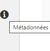
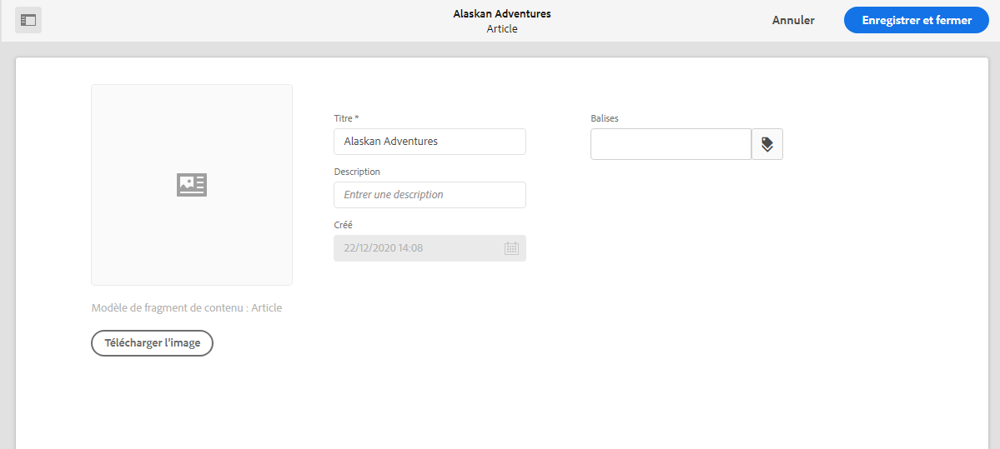

# Métadonnées   – Propriétés des fragments{#metadata-fragment-properties}

## Modification des propriétés/métadonnées {#editing-properties-meta-data}

Vous pouvez afficher et modifier les métadonnées (propriétés) des fragments de contenu :

1. Dans la console **Ressources**, naviguez jusqu’à l’emplacement de votre fragment de contenu.
2. Vous pouvez :

   * Sélectionnez [**Afficher les propriétés **pour ouvrir les boîtes de dialogue](/help/assets/manage-digital-assets.md#editing-properties). Une fois la collection ouverte pour consultation, vous pouvez également la modifier.
   * Ouvrez[ le fragment de contenu à modifier](/help/assets/content-fragments/content-fragments-managing.md#opening-the-fragment-editor), puis sélectionnez **Métadonnées** dans le panneau latéral.
   

3. L’onglet **De base** fournit des options que vous pouvez afficher ou modifier :

   * Une miniature, pour laquelle vous pouvez **télécharger une image** 
   * **Titre**
   * **Description**
   * **Balises**
   * Créé (affichage uniquement)
   
