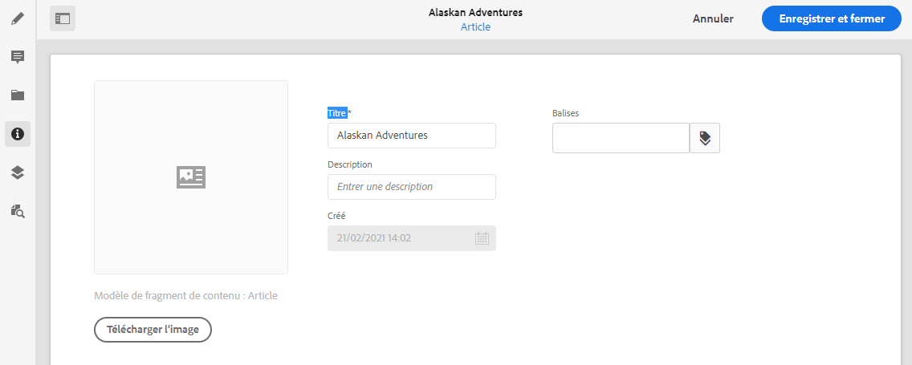

# Métadonnées – propriétés des fragments {#metadata-fragment-properties}

Découvrez comment afficher et modifier les propriétés de métadonnées des fragments de contenu dans AEM pour ajuster votre contenu découplé.

>[!NOTE]
>
>Les fragments de contenu sont une fonctionnalité de sites, mais sont stockés sous la forme **Ressources**.
>
>Il existe deux éditeurs pour la création de fragments de contenu. Bien que la fonctionnalité de base soit la même, il existe des différences. Cette section décrit l’éditeur d’origine, principalement accessible à partir de la console **Assets**. Pour plus d’informations sur le nouvel éditeur, voir la documentation Sites, [Fragments de contenu - Création](/help/sites-cloud/administering/content-fragments/authoring.md), (principalement accessible à partir de la console **Fragments de contenu**).

## Modification des propriétés/métadonnées {#editing-properties-meta-data}

Vous pouvez afficher et modifier les métadonnées (propriétés) des fragments de contenu :

1. Dans la console **Assets**, naviguez jusqu’à l’emplacement du fragment de contenu.
2. Vous pouvez effectuer les actions suivantes :

   * Sélectionnez [**Afficher les propriétés** pour ouvrir les boîtes de dialogue](/help/assets/manage-digital-assets.md#editing-properties). Une fois la collection ouverte pour consultation, vous pouvez également la modifier.
   * Ouvrez le fragment de contenu à modifier, puis sélectionnez **Métadonnées** dans le panneau latéral.

   

3. L’onglet **De base** fournit des options que vous pouvez afficher ou modifier :

   * Une miniature, pour laquelle vous pouvez **charger une image**
   * Le **modèle de fragment de contenu** indique le modèle utilisé pour créer le fragment actif.
   * **Titre**
   * **Description**
   * **Balises**
      * Les [balises](/help/sites-cloud/authoring/sites-console/tags.md) sont particulièrement puissantes lors de l’organisation de vos fragments, car elles peuvent être utilisées pour la classification et la taxonomie du contenu. Les balises peuvent être utilisées dans le but de rechercher du contenu (par balises) et d’appliquer des opérations en bloc.
Par exemple, vous pouvez baliser les fragments pertinents en tant que « lancement de Noël » pour ne les parcourir que sous forme de sous-ensemble, ou les copier pour les utiliser avec un autre lancement futur dans un nouveau dossier.

        >[!NOTE]
        >
        >Vous pouvez également ajouter des **balises** lors de la [création de contenu de variation](/help/assets/content-fragments/content-fragments-variations.md#authoring-your-content) et de la [création de variations](/help/assets/content-fragments/content-fragments-variations.md#creating-a-variation).

   * **Créé** (affichage uniquement).

   Par exemple :
   
