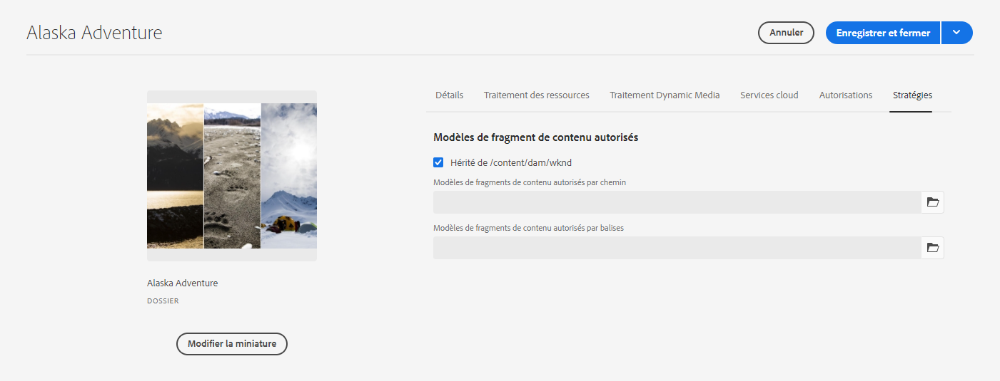

# Modèles de fragment de contenu {#content-fragment-models}

Les modèles de fragment de contenu définissent la structure du contenu pour vos [fragments de contenu](/help/assets/content-fragments/content-fragments.md).

Pour utiliser des modèles de fragments de contenu, procédez comme suit :

1. [Activez la fonctionnalité Modèle de fragment de contenu pour votre instance](/help/assets/content-fragments/content-fragments-configuration-browser.md).
1. [Créez](#creating-a-content-fragment-model) et [configurez](#defining-your-content-fragment-model) vos modèles de fragments de contenu.
1. [Activez les modèles de fragments de contenu ](#enabling-disabling-a-content-fragment-model) à utiliser pour la création de fragments de contenu.
1. [Autorisez vos modèles de fragments de contenu sur les ](#allowing-content-fragment-models-assets-folder) dossiers Ressources requis en configurant  **des stratégies**.

## Création d’un modèle de fragment de contenu {#creating-a-content-fragment-model}

1. Accédez à **Outils**, **Ressources**, puis ouvrez les **modèles de fragment de contenu**.
1. Accédez au fichier adapté votre [configuration](/help/assets/content-fragments/content-fragments-configuration-browser.md).
1. Utilisez le bouton **Créer** pour ouvrir l’assistant.

   >[!CAUTION]
   >
   >Si[ l’utilisation des modèles de contenu du fragment n’a pas été activée](/help/assets/content-fragments/content-fragments-configuration-browser.md), l’option **Créer** n’est pas disponible.

1. Spécifiez le **Titre du modèle**. Vous pouvez également ajouter **Balises**, **Description**, et sélectionner **Activer le modèle** à [activer le modèle](#enabling-disabling-a-content-fragment-model) si nécessaire.

   

1. Utilisez le bouton **Créer** pour enregistrer le modèle vide. Un message indique que l’action a réussi. Vous pouvez alors sélectionner **Ouvrir** pour publier immédiatement le modèle ou **Terminé** pour revenir à la console.

## Définition de votre modèle de fragment de contenu  {#defining-your-content-fragment-model}

Le modèle de fragment de contenu définit effectivement la structure des fragments de contenu résultants à l’aide d’une sélection de **[Types de données](#data-types)**. Grâce à l’éditeur de modèles, vous pouvez ajouter des instances de types de données, puis les configurer pour créer les champs requis :

>[!CAUTION]
>
>La modification d’un modèle de fragment de contenu existant peut avoir un impact sur les fragments dépendants.

1. Accédez à **Outils**, **Ressources**, puis ouvrez les **modèles de fragment de contenu**.

1. Accédez au dossier contenant votre modèle de fragment de contenu.
1. Ouvrez le modèle requis pour l’**édition**. Utilisez l’action rapide ou sélectionnez le modèle puis l’action dans la barre d’outils.

   Une fois ouvert, l’éditeur de modèles affiche :

   * à gauche : les champs déjà définis 
   * à droite : les **types de données** disponibles pour la création des champs (et les **propriétés** à utiliser une fois les champs créés).

   >[!NOTE]
   >
   >Lorsqu’un champ est **obligatoire**, le **libellé** indiqué dans le volet de gauche est signalé par un astérisque (*****).

   

1. **Pour ajouter un champ**

   * Faites glisser un type de données à l’emplacement souhaité pour un champ:

      

   * Une fois qu’un champ a été ajouté au modèle, le panneau de droite affiche les **propriétés** qui peuvent être définies pour ce type de données spécifique. Vous pouvez définir ce qui est obligatoire pour ce champ.

      * De nombreuses propriétés s’expliquent d’elles-mêmes. Pour plus d’informations, voir [Propriétés](#properties).
      * Si vous entrez une **étiquette de champ**, le **nom de propriété** est automatiquement renseigné. S’il est vide, il peut être mis à jour manuellement par la suite.

      Par exemple :

      


1. **Pour supprimer un champ**

   Sélectionnez le champ, puis cliquez/appuyez sur l’icône représentant une corbeille. Vous serez alors invité à confirmer l’opération.

   

1. Ajoutez tous les champs obligatoires et définissez les propriétés connexes, le cas échéant. Par exemple :

   

1. Sélectionnez **Enregistrer** pour conserver la définition.

## Types de données {#data-types}

Une sélection de types de données est disponible pour la définition de votre modèle :

* **Une seule ligne de texte**
   * Ajoutez un ou plusieurs champs d’une seule ligne de texte ; il est possible de définir la longueur maximale.
* **Plusieurs lignes de texte**
   * Zone de texte pouvant contenir du texte enrichi, du texte brut ou du texte Markdown.
* **Nombre**
   * Ajoutez un ou plusieurs champs numériques
* **Booléen**
   * Ajoutez une case à cocher booléenne
* **Date et heure**
   * Ajoutez une date et/ou une heure
* **Énumération**
   * Ajoutez un ensemble de cases à cocher, de boutons radio ou de champs déroulants
* **Balises**
   * Permet aux auteurs de fragments d’accéder à des zones de balises et de les sélectionner.
* **Référence de contenu**
   * Fait référence à d’autres contenus, tous types confondus ; peut être utilisée pour [créer du contenu imbriqué](#using-references-to-form-nested-content).
* **Référence du fragment**
   * Références à d&#39;autres fragments de contenu ; peut être utilisé pour [créer du contenu imbriqué](#using-references-to-form-nested-content)
   * Le type de données peut être configuré pour permettre aux auteurs de fragments de :
      * Modifiez directement le fragment référencé.
      * Créer un fragment de contenu, en fonction du modèle approprié
* **Objet JSON**
   * Permet à l’auteur du fragment de contenu de saisir la syntaxe JSON dans les éléments correspondants d’un fragment.
      * Permettre aux AEM de stocker directement JSON que vous avez copié/collé à partir d’un autre service.
      * Le fichier JSON est transmis et généré sous la forme JSON dans GraphQL.
      * Inclut la mise en surbrillance de la syntaxe JSON, la saisie semi-automatique et la mise en surbrillance des erreurs dans l’éditeur de fragments de contenu.

## Propriétés {#properties}

De nombreuses propriétés s’expliquent d’elles-mêmes. Pour certaines propriétés, les détails supplémentaires sont les suivants :

* **Rendu comme**
Les différentes options permettant de réaliser/rendre le champ dans un fragment. Il est ainsi souvent possible de définir si l’auteur verra une seule instance du champ ou s’il sera autorisé à créer plusieurs instances.

* **Libellé du champ**
La saisie d’un 
**libellé de champ** génère automatiquement un **nom de propriété**, qui peut ensuite être mis à jour manuellement, si nécessaire.

* **Validation**
La validation de base est disponible par le biais de mécanismes tels que la propriété **Requis**. Certains types de données comportent des champs de validation supplémentaires. Voir [Validation](#validation) pour plus de détails.

* Pour le type données **texte multiligne**, il est possible de définir le **type par défaut** en tant que :

   * **Texte enrichi**
   * **Texte (Markdown)**
   * **Texte brut**

   Si elle n’est pas spécifiée, la valeur par défaut **Texte enrichi** est utilisée pour ce champ.

   La modification du **type par défaut** dans un modèle de fragment de contenu prend effet uniquement sur un fragment de contenu existant et lié après l’ouverture et l’enregistrement du fragment dans l’éditeur.

* **Le**
contenu unique (pour le champ spécifique) doit être unique dans tous les fragments de contenu créés à partir du modèle actuel.

   Elle permet de s’assurer que les auteurs de contenu ne peuvent pas répéter le contenu déjà ajouté dans un autre fragment du même modèle.

   Par exemple, un champ **Texte d’une seule ligne** appelé `Country` dans le modèle de fragment de contenu ne peut pas avoir la valeur `Japan` dans deux fragments de contenu dépendants. Un avertissement sera émis lorsque la deuxième instance sera tentée.

   >[!NOTE]
   L&#39;unicité est assurée par racine de langue.

   >[!NOTE]
   Les variations peuvent avoir la même valeur *unique* que les variations du même fragment, mais pas la même valeur que celle utilisée dans toute variation d’autres fragments.

* ****
TranslatableSi vous cochez la case &quot;Translatable&quot; dans un champ de l&#39;éditeur de modèles des FC,

   * Assurez-vous que le nom de propriété du champ est ajouté dans la configuration de traduction, contexte `/content/dam/<tenant>`, s’il n’est pas déjà présent.
   * Pour GraphQL : définissez une propriété `<translatable>` sur `yes` dans le champ Fragment de contenu, afin d’autoriser le filtre de requête GraphQL pour la sortie JSON avec uniquement du contenu convertible.

* Voir **[Référence sur les fragments (Fragments imbriqués)](#fragment-reference-nested-fragments)** pour plus d’informations sur ce type de données spécifique et ses propriétés.

## Validation {#validation}

Différents types de données incluent désormais la possibilité de définir les exigences de validation lorsque le contenu est saisi dans le fragment résultant :

* **Une seule ligne de texte**
   * Comparaison avec une expression régulière prédéfinie (regex).
* **Nombre**
   * Vérification de valeurs spécifiques.
* **Référence de contenu**
   * Testez des types de contenu spécifiques.
   * Seuls les fichiers de taille de fichier spécifiée ou inférieure peuvent être référencés.
   * Seules les images d’une plage prédéfinie de largeur et/ou de hauteur (en pixels) peuvent être référencées.
* **Référence du fragment**
   * Testez un modèle de fragment de contenu spécifique.

<!--
  * Only predefined file types can be referenced.
  * No more than the predefined number of assets can be referenced. 
  * No more than the predefined number of fragments can be referenced.
-->

## Utilisation de références pour le contenu imbriqué du formulaire {#using-references-to-form-nested-content}

Les fragments de contenu peuvent former du contenu imbriqué à l’aide de l’un des types de données suivants :

* **[Référence de contenu](#content-reference)**
   * Fournit une référence simple à un autre contenu ; de tout type.
   * Peut être configuré pour une ou plusieurs références (dans le fragment résultant).

* **[Référence](#fragment-reference-nested-fragments)**  sur les fragments (fragments imbriqués)
   * Réalise d’autres fragments, en fonction des modèles spécifiques spécifiés.
   * Permet d’inclure/de récupérer des données structurées.

      >[!NOTE]
      Cette méthode présente un intérêt particulier en conjonction avec [Diffusion de contenu sans en-tête utilisant des fragments de contenu avec GraphQL](/help/assets/content-fragments/content-fragments-graphql.md).
   * Peut être configuré pour une ou plusieurs références (dans le fragment résultant).

>[!NOTE]
AEM dispose d&#39;une protection récurrente pour :
* Références du contenu
Cela empêche l’utilisateur d’ajouter une référence au fragment actif. Cela peut conduire à une boîte de dialogue vide du sélecteur de référence aux fragments.

* Références de fragments dans GraphQL
Si vous créez une requête profonde qui renvoie plusieurs fragments de contenu référencés les uns par les autres, elle renvoie la valeur null en première occurrence.


### Référence de contenu {#content-reference}

La référence de contenu vous permet de générer du contenu à partir d’une autre source ; par exemple, image ou fragment de contenu.

Outre les propriétés standard, vous pouvez spécifier les éléments suivants :

* Le **chemin racine** pour tout contenu référencé.
* Types de contenu pouvant être référencés.
* Limites relatives aux tailles de fichier.
* Limitations d&#39;image.
   <!-- Check screenshot - might need update -->
   

### Référence du fragment (fragments imbriqués) {#fragment-reference-nested-fragments}

La référence au fragment fait référence à un ou plusieurs fragments de contenu. Cette fonctionnalité présente un intérêt particulier lors de la récupération de contenu pour une utilisation dans votre application, car elle vous permet de récupérer des données structurées avec plusieurs calques.

Par exemple :

* Un modèle définissant les détails d&#39;un employé ; il s&#39;agit notamment :
   * Référence au modèle qui définit l&#39;employeur (société)

```xml
type EmployeeModel {
    name: String
    firstName: String
    company: CompanyModel
}

type CompanyModel {
    name: String
    street: String
    city: String
}
```

>[!NOTE]
Cela présente un intérêt particulier en conjonction avec [Diffusion de contenu sans en-tête utilisant des fragments de contenu avec GraphQL](/help/assets/content-fragments/content-fragments-graphql.md).

Outre les propriétés standard, vous pouvez définir les éléments suivants :

* **Afficher comme**:

   * **multichamp**  : l’auteur du fragment peut créer plusieurs références, individuelles ou

   * **référence**  de fragment : permet à l’auteur du fragment de sélectionner une référence unique à un fragment.

* **Modèle**
TypePlusieurs modèles peuvent être sélectionnés. Lors de la création du fragment de contenu, tous les fragments référencés doivent avoir été créés à l’aide de ces modèles.

* **Chemin d&#39;**
accès racineIndique un chemin d&#39;accès racine pour tout fragment référencé.

* **Autoriser la création de fragments**

   Cela permet à l’auteur du fragment de créer un nouveau fragment en fonction du modèle approprié.

   * **fragmentation référence**  : permet à l’auteur du fragment de créer un composite en sélectionnant plusieurs fragments.

   <!-- Check screenshot - might need update -->
   

>[!NOTE]
Un mécanisme de protection contre les récidives est en place. Il interdit à l’utilisateur de sélectionner le fragment de contenu actif dans la référence au fragment. Cela peut conduire à une boîte de dialogue vide du sélecteur de référence aux fragments.
Il existe également une protection récurrente pour les références de fragments dans GraphQL. Si vous créez une requête profonde entre deux fragments de contenu qui se référencent, elle renvoie la valeur null.

## Activation ou désactivation d’un modèle de fragment de contenu {#enabling-disabling-a-content-fragment-model}

Pour un contrôle total de l’utilisation de vos modèles de fragments de contenu, ils contiennent un état que vous pouvez définir.

### Activation d’un modèle de fragment de contenu {#enabling-a-content-fragment-model}

Une fois qu’un modèle a été créé, il doit être activé pour :

* Être disponible afin d’être sélectionné lors de la création d’un fragment de contenu.
* Pouvoir être référencé à partir d’un modèle de fragment de contenu.
* Être disponible pour GraphQL ; le schéma est ensuite généré.

Pour activer un modèle marqué comme :

* **Brouillon** : nouveau (jamais activé).
* **Désactivé** : a été spécifiquement désactivé.

Vous utilisez l’option **Activer** de l’une des manières suivantes :

* La barre d’outils supérieure, lorsque le modèle concerné est sélectionné.
* L’action rapide correspondante (placez le pointeur de la souris sur le modèle concerné).


### Désactivation d’un modèle de fragment de contenu {#disabling-a-content-fragment-model}

Un modèle peut également être désactivé afin que :

* Le modèle ne soit plus disponible comme base pour la création de *nouveaux* fragments de contenu.
* Toutefois :
   * Le schéma GraphQL continue à être généré et peut toujours être interrogé (pour éviter tout impact sur l’API JSON).
   * Tout fragment de contenu basé sur le modèle peut toujours être interrogé et renvoyé à partir du point d’entrée GraphQL.
* Le modèle ne peut plus être référencé, mais les références existantes sont conservées intactes et peuvent toujours être interrogées et renvoyées à partir du point d’entrée GraphQL.

Pour désactiver un modèle marqué comme **Activé**, utilisez l’option **Désactiver** de l’une des deux manières suivantes :

* La barre d’outils supérieure, lorsque le modèle concerné est sélectionné.
* L’action rapide correspondante (placez le pointeur de la souris sur le modèle concerné).


## Autorisation de modèles de fragments de contenu dans votre dossier Ressources {#allowing-content-fragment-models-assets-folder}

Pour mettre en oeuvre la gouvernance du contenu, vous pouvez configurer **Stratégies** sur le dossier Ressources afin de contrôler quels modèles de fragment de contenu sont autorisés pour la création de fragments dans ce dossier.

>[!NOTE]
Le mécanisme est similaire à [l’autorisation de modèles de page](/help/sites-cloud/authoring/features/templates.md#allowing-a-template-author) pour une page et ses enfants, dans les propriétés avancées d’une page.

Pour configurer les **stratégies** pour les **modèles de fragments de contenu autorisés** :

1. Recherchez et ouvrez **Propriétés** pour le dossier Ressources requis.

1. Ouvrez l&#39;onglet **Stratégies**, où vous pouvez configurer :

   * **Hérité de`<folder>`**

      Les stratégies sont automatiquement héritées lors de la création de dossiers enfants ; la stratégie peut être reconfigurée (et l’héritage rompu) si des sous-dossiers doivent autoriser des modèles différents du dossier parent.

   * **Modèles de fragments de contenu autorisés par chemin**

      Plusieurs modèles peuvent être autorisés.

   * **Modèles de fragments de contenu autorisés par balise**

      Plusieurs modèles peuvent être autorisés.
   

1. **** Enregistrez les modifications.

Les modèles de fragment de contenu autorisés pour un dossier sont résolus comme suit :
* **Stratégies** pour les **modèles de fragments de contenu autorisés**.
* S’il est vide, essayez de déterminer la stratégie à l’aide des règles d’héritage.
* Si la chaîne d&#39;héritage ne produit pas de résultat, examinez la configuration **Cloud Services** pour ce dossier (également directement et ensuite par héritage).
* Si aucun des éléments ci-dessus ne fournit de résultats, il n’existe aucun modèle autorisé pour ce dossier.

## Suppression d’un modèle de fragment de contenu {#deleting-a-content-fragment-model}

>[!CAUTION]
La suppression d’un modèle de fragment de contenu peut avoir un impact sur les fragments dépendants.

Pour supprimer un modèle de fragment de contenu :

1. Accédez à **Outils**, **Ressources**, puis ouvrez les **modèles de fragment de contenu**.

1. Accédez au dossier contenant votre modèle de fragment de contenu.
1. Sélectionnez votre modèle, puis utilisez l’option **de suppression** de la barre d’outils.

   >[!NOTE]
   Si le modèle est référencé, un avertissement s’affiche. Prenez alors les mesures qui s’imposent.

## Publication d’un modèle de fragment de contenu   {#publishing-a-content-fragment-model}

Les modèles de fragment de contenu doivent être publiés avant ou pendant la publication des fragments de contenu dépendants.

Pour publier un modèle de fragment de contenu :

1. Accédez à **Outils**, **Ressources**, puis ouvrez les **modèles de fragment de contenu**.

1. Accédez au dossier contenant votre modèle de fragment de contenu.
1. Sélectionnez votre modèle, puis l’option de **publication** dans la barre d’outils.
L’état publié sera indiqué dans la console.

   >[!NOTE]
   Si vous publiez un fragment de contenu pour lequel le modèle n’a pas encore été publié, une liste de sélection indique cela, ainsi que le fait que le modèle sera publié avec le fragment.

## Annulation de la publication d’un modèle de fragment de contenu {#unpublishing-a-content-fragment-model}

Les modèles de fragment de contenu peuvent être annulés s’ils ne sont référencés par aucun fragment.

Pour annuler la publication d’un modèle de fragment de contenu :

1. Accédez à **Outils**, **Ressources**, puis ouvrez les **modèles de fragment de contenu**.

1. Accédez au dossier contenant votre modèle de fragment de contenu.
1. Sélectionnez votre modèle, puis l’option **Annuler la publication** dans la barre d’outils.
L’état publié sera indiqué dans la console.
