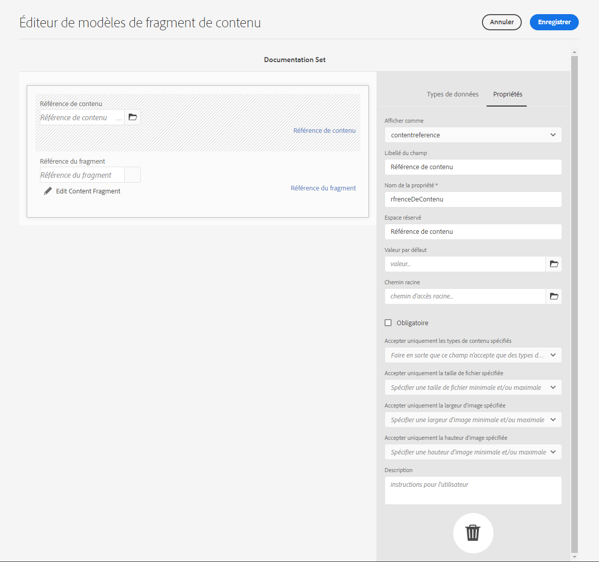
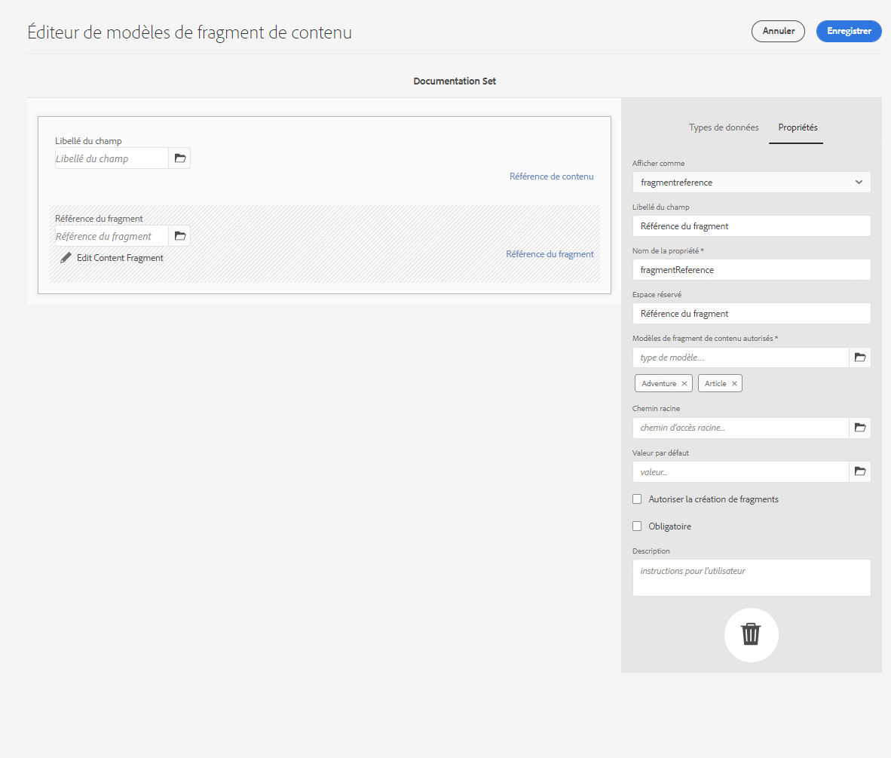
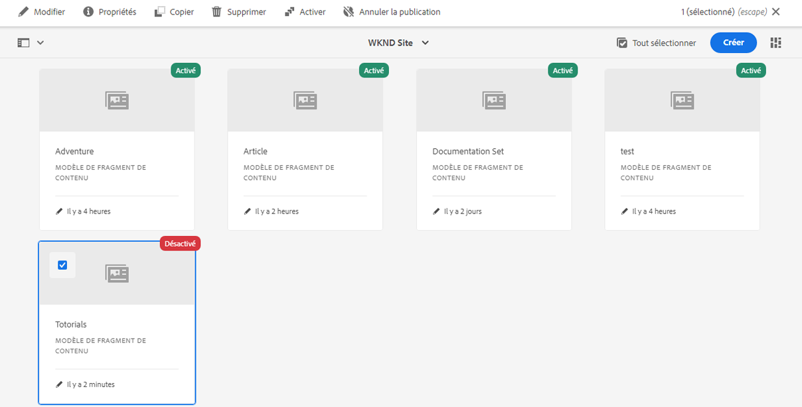
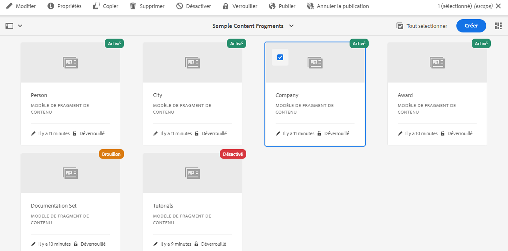

# Modèles de fragment de contenu {#content-fragment-models}

<!--
>[!CAUTION]
>
>Certain features for Content Fragments will be released in early 2021.
>
>The related documentation is already available for preview purposes.
>
>Please see the [Release Notes](/help/release-notes/release-notes-cloud/release-notes-current.md) for further details.
-->

>[!CAUTION]
>
>L’AEM API GraphQL, pour Content Fragment Diffusion, sera disponible début 2021.
>
>La documentation correspondante est déjà disponible à des fins de prévisualisation.

Les modèles de fragment de contenu définissent la structure du contenu pour vos[ fragments de contenu](/help/assets/content-fragments/content-fragments.md).

Pour utiliser des modèles de fragments de contenu, procédez comme suit :

1. [Activer la fonctionnalité Modèle de fragment de contenu pour votre instance](/help/assets/content-fragments/content-fragments-configuration-browser.md)
1. [Créez](#creating-a-content-fragment-model) et  [configurez](#defining-your-content-fragment-model) vos modèles de fragments de contenu
1. [Activez vos ](#enabling-disabling-a-content-fragment-model) modèles de fragments de contenu à utiliser lors de la création de fragments de contenu pour la création de fragments de contenu.

## Création d’un modèle de fragment de contenu {#creating-a-content-fragment-model}

1. Accédez à **Outils**, **Ressources**, puis ouvrez les **modèles de fragment de contenu**.
1. Accédez au fichier adapté votre [configuration](/help/assets/content-fragments/content-fragments-configuration-browser.md).
1. Utilisez le bouton **Créer** pour ouvrir l’assistant.

   >[!CAUTION]
   >
   >Si[ l’utilisation des modèles de contenu du fragment n’a pas été activée](/help/assets/content-fragments/content-fragments-configuration-browser.md), l’option **Créer** n’est pas disponible.

1. Spécifiez le **Titre du modèle**. Vous pouvez également ajouter **Balises** et **Description** si nécessaire.

   

1. Utilisez le bouton **Créer** pour enregistrer le modèle vide. Un message indique que l’action a réussi. Vous pouvez alors sélectionner **Ouvrir** pour publier immédiatement le modèle ou **Terminé** pour revenir à la console.

## Définition de votre modèle de fragment de contenu    {#defining-your-content-fragment-model}

Le modèle de fragment de contenu définit efficacement la structure des fragments de contenu résultants à l’aide d’une sélection de **[Types de données](#data-types)**. A l’aide de l’éditeur de modèles, vous pouvez ajouter des instances des types de données, puis les configurer pour créer les champs requis :

>[!CAUTION]
>
>La modification d’un modèle de fragment de contenu existant peut avoir un impact sur les fragments dépendants.

1. Accédez à **Outils**, **Ressources**, puis ouvrez les **modèles de fragment de contenu**.

1. Accédez au dossier contenant votre modèle de fragment de contenu.
1. Ouvrez le modèle requis pour l’**édition**. Utilisez l’action rapide ou sélectionnez le modèle puis l’action dans la barre d’outils.

   Une fois ouvert, l’éditeur de modèles affiche :

   * à gauche : les champs déjà définis 
   * à droite : les **types de données** disponibles pour la création des champs (et les **propriétés** à utiliser une fois les champs créés).

   >[!NOTE]
   >
   >Lorsqu’un champ est **obligatoire**, le **libellé** indiqué dans le volet de gauche est signalé par un astérisque (*****).

1. **Pour ajouter un champ**

   * Faites glisser un type de données requis vers l’emplacement requis pour un champ.

   * Une fois qu’un champ a été ajouté au modèle, le panneau de droite affiche les **propriétés** qui peuvent être définies pour ce type de données spécifique. Vous pouvez définir ce qui est obligatoire pour ce champ.
De nombreuses propriétés s’expliquent d’elles-mêmes. Pour plus d’informations, voir [Propriétés](#properties).

1. **Pour supprimer un champ**

   Sélectionnez le champ, puis cliquez/appuyez sur l’icône représentant une corbeille. Vous serez alors invité à confirmer l’opération.

1. Ajoutez tous les champs obligatoires et définissez les propriétés connexes, le cas échéant.

1. Sélectionnez **Enregistrer** pour conserver la définition.

<!--
## Defining your Content Fragment Model {#defining-your-content-fragment-model}

The content fragment model effectively defines the structure of the resulting content fragments using a selection of **[Data Types](#data-types)**. Using the model editor you can add instances of the data types, then configure them to create the required fields:

>[!CAUTION]
>
>Editing an existing content fragment model can impact dependent fragments.

1. Navigate to **Tools**, **Assets**, then open **Content Fragment Models**.

1. Navigate to the folder holding your content fragment model.
1. Open the required model for **Edit**; use either the quick action, or select the model and then the action from the toolbar.

   Once open the model editor shows:

    * left: fields already defined
    * right: **Data Types** available for creating fields (and **Properties** for use once fields have been created)

   >[!NOTE]
   >
   >When a field as **Required**, the **Label** indicated in the left pane will be marked with an asterix (**&#42;**).

   

1. **To Add a Field**

    * Drag a required data type to the required location for a field:

      

    * Once a field has been added to the model, the right panel will show the **Properties** that can be defined for that particular data type. Here you can define what is required for that field. 
      Many properties are self-explanatory, for additional details see [Properties](#properties).
      For example:

      

1. **To Remove a Field**

   Select the required field, then click/tap the trash-can icon. You will be asked to confirm the action.

   

1. Add all required fields, and define the related properties, as required. For example:

   

1. Select **Save** to persist the definition.
-->

## Types de données {#data-types}

Une sélection de types de données est disponible pour la définition de votre modèle :

* **Une seule ligne de texte**
   * Ajouter un ou plusieurs champs d’une seule ligne de texte ; la longueur maximale peut être définie
* **Plusieurs lignes de texte**
   * Zone de texte qui peut être de type texte enrichi, texte ordinaire ou annotation
* **Nombre**
   * Ajouter un ou plusieurs champs numériques
* **Booléen**
   * Ajouter une case à cocher booléenne
* **Date et heure**
   * Ajouter une date et/ou une heure
* **Énumération**
   * Ajouter un ensemble de cases à cocher, de boutons radio ou de champs déroulants
* **Balises**
   * Permet aux auteurs de fragments d’accéder à des zones de balises et de les sélectionner.
* **Référence de contenu**
   * les références d&#39;autres contenus, de tout type ; peut être utilisé pour [créer du contenu imbriqué](#using-references-to-form-nested-content)

<!--
* **Fragment Reference**
  * References other content fragments; can be used to [create nested content](#using-references-to-form-nested-content)
  * The data type can be configured to allow fragment authors to:
    * Edit the referenced fragment directly.
    * Create a new content fragment, based on the appropriate model  
* **JSON Object**
  * Allows the content fragment author to enter JSON syntax into the corresponding elements of a fragment. 
    * To allow AEM to store direct JSON that you have copy/pasted from another service.
    * The JSON will be passed through, and output as JSON in GraphQL.
    * Includes JSON syntax-highlighting, auto-complete and error-highlighting in the content fragment editor.
-->

## Propriétés {#properties}

De nombreuses propriétés s’expliquent d’elles-mêmes. Pour certaines propriétés, les détails supplémentaires sont les suivants :

* **Rendu**
en tant queLes différentes options permettant de réaliser/rendre le champ dans un fragment. Cela vous permet souvent de définir si l’auteur verra une seule instance du champ ou s’il sera autorisé à créer plusieurs instances.

* **Libellé**
de champSaisir un 
**L’** étiquette du champ génère automatiquement un nom **de** propriété, qui peut ensuite être mis à jour manuellement si nécessaire.

* **La validation**
ValidationBasic est disponible par des mécanismes tels que la propriété  **** Requiredproperty. Certains types de données comportent des champs de validation supplémentaires. Voir [Validation](#validation) pour plus de détails.

* Pour le type données **texte multiligne**, il est possible de définir le **type par défaut** en tant que :

   * **Texte enrichi**
   * **Texte (Markdown)**
   * **Texte brut**

   Si elle n’est pas spécifiée, la valeur par défaut **Texte enrichi** est utilisée pour ce champ.

   La modification du **type par défaut** dans un modèle de fragment de contenu prend effet uniquement sur un fragment de contenu existant et lié après l’ouverture et l’enregistrement du fragment dans l’éditeur.

<!--
* **Translatable**
  Checking the "Translatable" checkbox on a field in CF model editor will

  * Ensure the field's property name is added in translation config, context `/content/dam/<tenant>`, if not already present. 
  * For GraphQL: set a `<translatable>` property on the Content Fragment field to `yes`, to allow GraphQL query filter for JSON output with only translatable content.

* See **[Fragment Reference (Nested Fragments)](#fragment-reference-nested-fragments)** for more details about that specific data type and its properties.
-->

## Validation {#validation}

Divers types de données incluent désormais la possibilité de définir les exigences de validation pour le moment où le contenu est saisi dans le fragment résultant :

* **Une seule ligne de texte**
   * Comparaison avec un regex prédéfini.
* **Nombre**
   * Recherchez des valeurs spécifiques.

<!--
* **Content Reference**
  * Test for specific types of content.
  * Only images within a predefined range of width and height (in pixels) can be referenced. 
  * Only assets of specified file size or smaller can be referenced. 
  * Only predefined file types can be referenced.
  * No more than the predefined number of assets can be referenced. 
  * No more than the predefined number of fragments can be referenced.
* **Fragment Reference**
  * Test for a specific content fragment model.
-->

<!--
## Using References to form Nested Content {#using-references-to-form-nested-content}

Content Fragments can form nested content, using either of the following data types:

* **[Content Reference](#content-reference)**
  * Provides a simple reference to other content; of any type.
  * Can be configured for a one or multiple references (in the resulting fragment).

* **[Fragment Reference](#fragment-reference-nested-fragments)** (Nested Fragments)
  * References other fragments, dependent on the specific models specified.
  * Allows you to include/retrieve structured data.
    >[!NOTE]
    >
    >This method is of particular interest in conjunction with [Headless Content Delivery using Content Fragments with GraphQL](/help/assets/content-fragments/content-fragments-graphql.md).
  * Can be configured for one or multiple references (in the resulting fragment)..

>[!NOTE]
>
>AEM has a recurrence protection for:
>
>* Content References
>  This prevents the user from adding a reference to the current fragment. This may lead to an empty Fragment Reference picker dialog.
>
>* Fragment References in GraphQL 
>  If you create a deep query that returns multiple Content Fragments referenced by each another, it will return null at first occurence.

### Content Reference {#content-reference}

The Content Reference allows you to render content from another source; for example, image or content fragment.

In addition to standard properties you can specify:

* The **Root Path** for any referenced content.
* The content types that can be referenced.
* Limitations for file sizes.
* Image restraints.
-->

<!-- Check screenshot - might need update

   
-->

<!--
### Fragment Reference (Nested Fragments) {#fragment-reference-nested-fragments}

The Fragment Reference references one, or more, content fragments. This feature of particular interest when retrieving content for use in your app, as it allows you to retrieve structured data with multiple layers.

For example:

* A model defining details for an employee; these include:
  * A reference to the model that defines the employer (company)

```xml
type EmployeeModel {
    name: String
    firstName: String
    company: CompanyModel
}

type CompanyModel {
    name: String
    street: String
    city: String
}
```

>[!NOTE]
>
>This is of particular interest in conjunction with [Headless Content Delivery using Content Fragments with GraphQL](/help/assets/content-fragments/content-fragments-graphql.md).

In addition to standard properties you can define:

* **Render As**:

  * **multifield** - the fragment author can create multiple, individual, references

  * **fragmentreference** - allows the fragment author to select a single reference to a fragment

* **Model Type**
  Multiple models can be selected. When authoring the Content Fragment any referenced fragments must have been created using these models.

* **Root Path**
  This specifies a root path for any fragments referenced.

* **Allow Fragment Creation**

  This will allow the fragment author to create a new fragment based on the appropriate model.
-->

<!--
  * **fragmentreferencecomposite** - allows the fragment author to build a composite, by selecting multiple fragments
-->

<!-- Check screenshot - might need update

   
-->

<!--
>[!NOTE]
>
>A recurrence protection mechanism is in place. It prohibits the user from selecting the current Content Fragment in the Fragment Reference. This may lead to an empty Fragment Reference picker dialog.
>
>There is also a recurrence protection for Fragment References in GraphQL. If you create a deep query across two Content Fragments that reference each other, it will return null.
-->

## Activation ou désactivation d&#39;un modèle de fragment de contenu {#enabling-disabling-a-content-fragment-model}

Pour un contrôle total de l’utilisation de vos modèles de fragments de contenu, ils disposent d’un état que vous pouvez définir.

### Activation d’un modèle de fragment de contenu {#enabling-a-content-fragment-model}

Une fois qu&#39;un modèle a été créé, il doit être activé afin qu&#39;il :

* Est disponible pour la sélection lors de la création d’un fragment de contenu.
* Peut être référencé à partir d’un modèle de fragment de contenu.
* est disponible pour GraphQL ; le schéma est donc généré.

Pour activer un modèle marqué comme :

* **Version préliminaire**  : mew (jamais activé).
* **Désactivé**  : a été spécifiquement désactivé.

Vous utilisez l&#39;option **Activer** de l&#39;une des manières suivantes :

* La barre d&#39;outils supérieure, lorsque le modèle requis est sélectionné.
* Action rapide correspondante (placez le pointeur de la souris sur le modèle requis).



### Désactivation d’un modèle de fragment de contenu {#disabling-a-content-fragment-model}

Un modèle peut également être désactivé afin que :

* Le modèle n’est plus disponible comme base pour la création de *nouveaux* fragments de contenu.
* Toutefois:
   * Le schéma GraphQL continue à être généré et peut toujours être interrogé (afin d’éviter d’affecter l’API JSON).
   * Tout fragment de contenu basé sur le modèle peut toujours être interrogé et renvoyé à partir du point de terminaison GraphQL.
* Le modèle ne peut plus être référencé, mais les références existantes sont conservées intactes et peuvent toujours être interrogées et renvoyées à partir du point de terminaison GraphQL.

Pour désactiver un modèle marqué comme **Activé**, utilisez l&#39;option **Désactiver** de l&#39;une des deux options suivantes :

* La barre d&#39;outils supérieure, lorsque le modèle requis est sélectionné.
* Action rapide correspondante (placez le pointeur de la souris sur le modèle requis).



## Suppression d’un modèle de fragment de contenu {#deleting-a-content-fragment-model}

>[!CAUTION]
La suppression d’un modèle de fragment de contenu peut avoir un impact sur les fragments dépendants.

Pour supprimer un modèle de fragment de contenu :

1. Accédez à **Outils**, **Ressources**, puis ouvrez les **modèles de fragment de contenu**.

1. Accédez au dossier contenant votre modèle de fragment de contenu.
1. Sélectionnez votre modèle, puis utilisez l’option **de suppression** de la barre d’outils.

   >[!NOTE]
   Si le modèle est référencé, un avertissement s’affiche. Prenez alors les mesures qui s’imposent.

## Publication d’un modèle de fragment de contenu    {#publishing-a-content-fragment-model}

Les modèles de fragment de contenu doivent être publiés avant ou pendant la publication des fragments de contenu dépendants.

Pour publier un modèle de fragment de contenu :

1. Accédez à **Outils**, **Ressources**, puis ouvrez les **modèles de fragment de contenu**.

1. Accédez au dossier contenant votre modèle de fragment de contenu.
1. Sélectionnez votre modèle, puis l’option de **publication** dans la barre d’outils.
L&#39;état publié sera indiqué dans la console.

   >[!NOTE]
   Si vous publiez un fragment de contenu pour lequel le modèle n’a pas encore été publié, une liste de sélection indique cela, ainsi que le fait que le modèle sera publié avec le fragment.

## Annulation de la publication d&#39;un modèle de fragment de contenu {#unpublishing-a-content-fragment-model}

Les modèles de fragments de contenu peuvent être annulés s’ils ne sont référencés par aucun fragment.

Pour annuler la publication d’un modèle de fragment de contenu :

1. Accédez à **Outils**, **Ressources**, puis ouvrez les **modèles de fragment de contenu**.

1. Accédez au dossier contenant votre modèle de fragment de contenu.
1. Sélectionnez votre modèle, puis **Annuler la publication** dans la barre d’outils.
L&#39;état publié sera indiqué dans la console.
