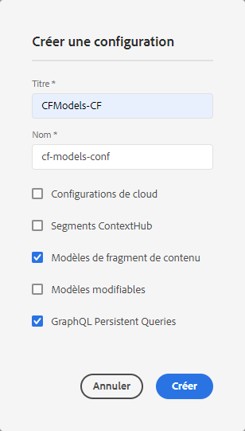
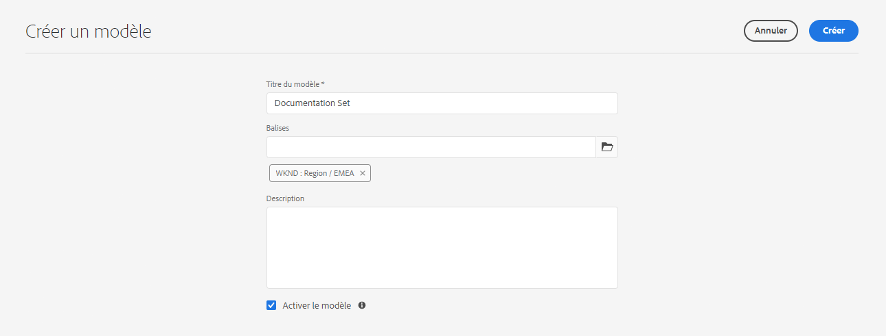
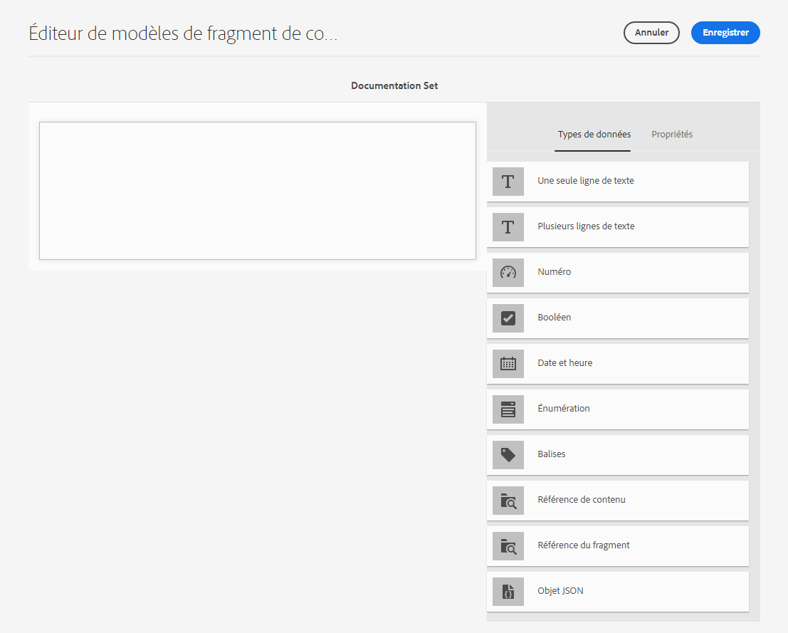
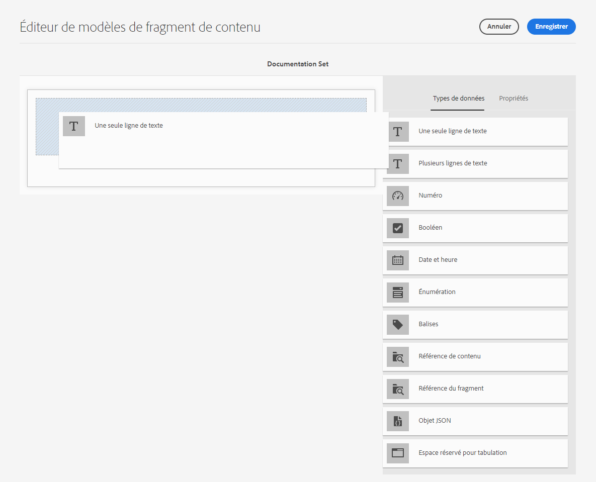
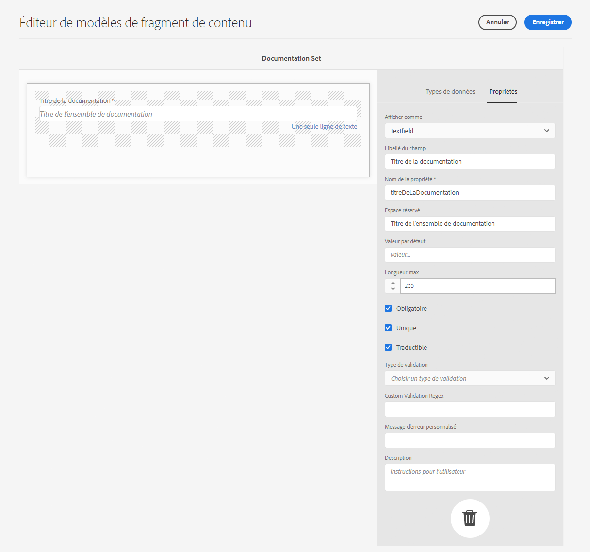
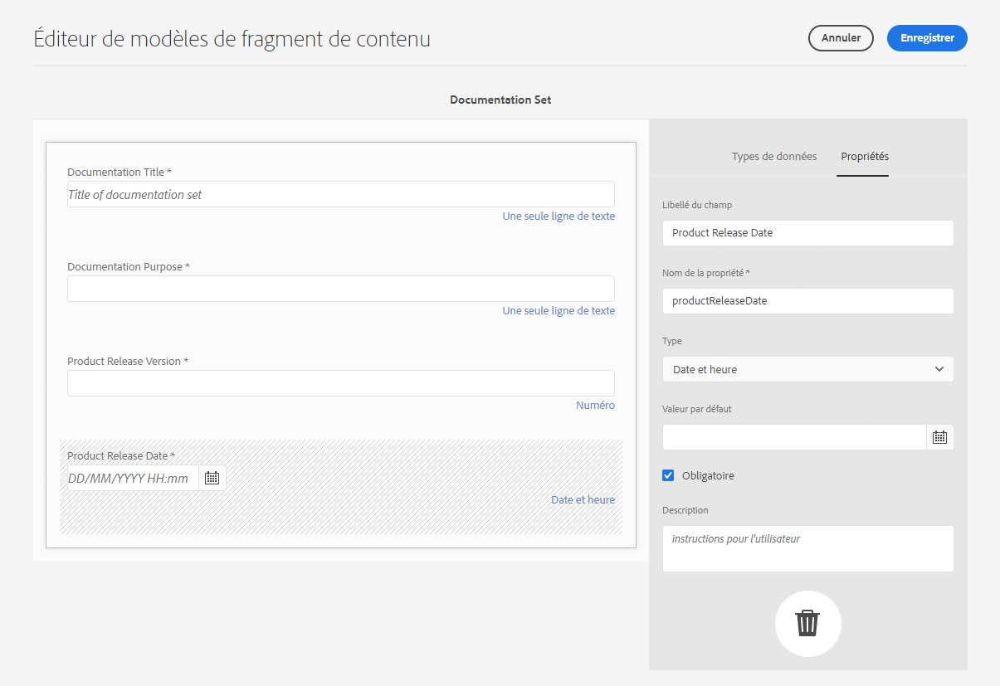

# Modèles de fragment de contenu{#content-fragment-models}

Les modèles de fragment de contenu définissent la structure du contenu pour vos[ fragments de contenu](/help/assets/content-fragments/content-fragments.md).

## Activation des modèles de fragment de contenu {#enable-content-fragment-models}

>[!CAUTION]
>
>Si vous n’activez pas **les modèles de fragment de contenu**, l’option **Créer** n’est pas disponible pour la création de modèles.

Pour activer les modèles de fragment de contenu, vous devez :

* activer l’utilisation des modèles de fragment de contenu dans Configuration Manager ;
* appliquer la configuration à votre dossier de ressources ;

### Activation des modèles de fragment de contenu dans Configuration Manager {#enable-content-fragment-models-in-configuration-manager}

Pour [créer un nouveau modèle de fragment de contenu](#creating-a-content-fragment-model), vous **devez** d’abord activer ces modèles à l’aide du gestionnaire de configuration :

1. Navigate to **Tools**, **General**, then open the **Configuration Browser**.
2. Sélectionnez l’emplacement approprié pour votre site web.
3. Use **Create** to open the dialog, where you:

   1. Spécifiez un **Titre**.
   2. Select **Content Fragment Models** to enable their use.
   

4. Select **Create** to save the definition.

### Application de la configuration à votre dossier de ressources {#apply-the-configuration-to-your-assets-folder}

Lorsque la configuration **global** est activée pour les modèles de fragment de contenu, tous les modèles que les utilisateurs créent peuvent être utilisés dans n’importe quel dossier de ressources.

Pour utiliser d’autres configurations (c’est-à-dire à l’exclusion de la version globale) avec un dossier de ressources comparable, vous devez définir la connexion. This is done by selecting the appropriate **Configuration** in the **Cloud Services** tab of the **Folder Properties** of the appropriate folder.

## Création d’un modèle de fragment de contenu {#creating-a-content-fragment-model}

1. Navigate to **Tools**, **Assets**, then open **Content Fragment Models**.
1. Accédez au fichier adapté votre [configuration](#enable-content-fragment-models).
1. Utilisez le bouton **Créer** pour ouvrir l’assistant.

   >[!CAUTION]
   >
   >Si[ l’utilisation des modèles de contenu du fragment n’a pas été activée](#enable-content-fragment-models), l’option **Créer** n’est pas disponible.

1. Spécifiez le **Titre du modèle**. Vous pouvez également ajouter une **description** si nécessaire.

   

1. Utilisez le bouton **Créer** pour enregistrer le modèle vide. Un message indique que l’action a réussi. Vous pouvez alors sélectionner **Ouvrir** pour publier immédiatement le modèle ou **Terminé** pour revenir à la console.

## Définition de votre modèle de fragment de contenu {#defining-your-content-fragment-model}

Le modèle de fragment de contenu définit la structure des fragments de contenu qui en résultent. À l’aide de l’éditeur de modèles, vous pouvez ajouter et configurer les champs obligatoires :

>[!CAUTION]
>
>La modification d’un modèle de fragment de contenu existant peut avoir un impact sur les fragments dépendants.

1. Navigate to **Tools**, **Assets**, then open **Content Fragment Models**.

1. Accédez au dossier contenant votre modèle de fragment de contenu.
1. Ouvrez le modèle requis pour l’**édition**. Utilisez l’action rapide ou sélectionnez le modèle puis l’action dans la barre d’outils.

   Une fois ouvert, l’éditeur de modèles affiche :

   * à gauche : les champs déjà définis 
   * right: **Data Types** available for creating fields (and **Properties** for use once fields have been created)
   >[!NOTE]
   >
   >Lorsqu’un champ est **obligatoire**, le **libellé** indiqué dans le volet de gauche est signalé par un astérisque (*****).

   

1. **Pour ajouter un champ**

   * Faites glisser un type de données à l’emplacement souhaité pour un champ :
   

   * Une fois qu’un champ a été ajouté au modèle, le panneau de droite affiche les **propriétés** qui peuvent être définies pour ce type de données spécifique. Vous pouvez définir ce qui est obligatoire pour ce champ. Par exemple :
   

   >[!NOTE]
   Pour le type données **texte multiligne**, il est possible de définir le **type par défaut** en tant que :
   * **Texte enrichi** ;
   * **Texte (Markdown)** ;
   * **Texte brut**.
   Si elle n’est pas spécifiée, la valeur par défaut **Texte enrichi** est utilisée pour ce champ.
   La modification du **type par défaut** dans un modèle de fragment de contenu prend effet uniquement sur un fragment de contenu existant et lié après l’ouverture et l’enregistrement du fragment dans l’éditeur.

1. **Pour supprimer un champ**

   Sélectionnez le champ, puis cliquez/appuyez sur l’icône représentant une corbeille. Vous serez alors invité à confirmer l’opération.

   

1. After adding all required fields, and defining the properties, use **Save** to persist the definition. Par exemple :

   

## Suppression d’un modèle de fragment de contenu {#deleting-a-content-fragment-model}

>[!CAUTION]
La suppression d’un modèle de fragment de contenu peut avoir un impact sur les fragments dépendants.

Pour supprimer un modèle de fragment de contenu :

1. Navigate to **Tools**, **Assets**, then open **Content Fragment Models**.

1. Accédez au dossier contenant votre modèle de fragment de contenu.
1. Sélectionnez votre modèle, puis utilisez l’option **de suppression** de la barre d’outils.

   >[!NOTE]
   Si le modèle est référencé, un avertissement s’affiche. Prenez alors les mesures qui s’imposent.

## Publication d’un modèle de fragment de contenu {#publishing-a-content-fragment-model}

Les modèles de fragment de contenu doivent être publiés avant ou pendant la publication des fragments de contenu dépendants.

Pour publier un modèle de fragment de contenu :

1. Navigate to **Tools**, **Assets**, then open **Content Fragment Models**.

1. Accédez au dossier contenant votre modèle de fragment de contenu.
1. Sélectionnez votre modèle, puis l’option de **publication** dans la barre d’outils.

   >[!NOTE]
   Si vous publiez un fragment de contenu pour lequel le modèle n’a pas encore été publié, une liste de sélection indique cela, ainsi que le fait que le modèle sera publié avec le fragment.
