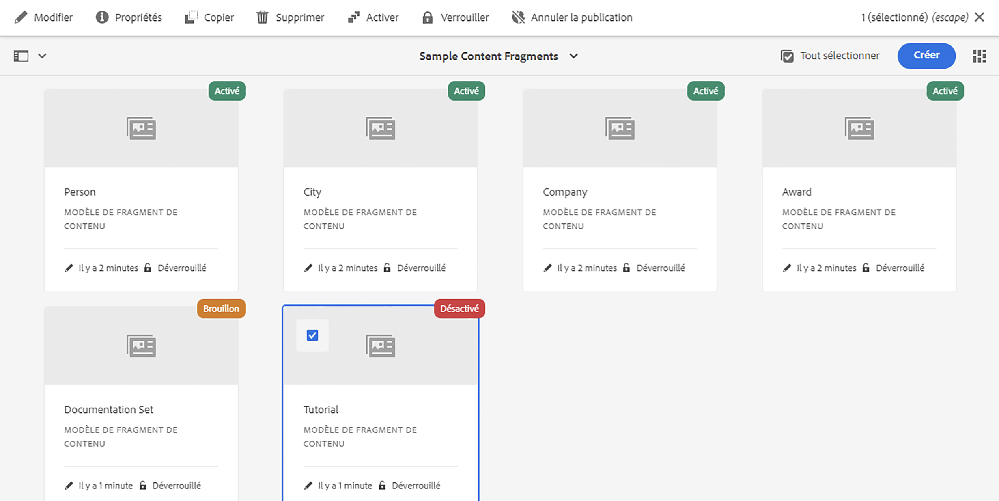
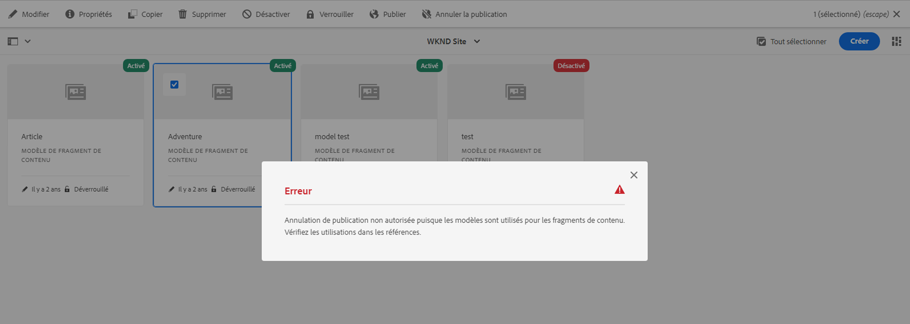
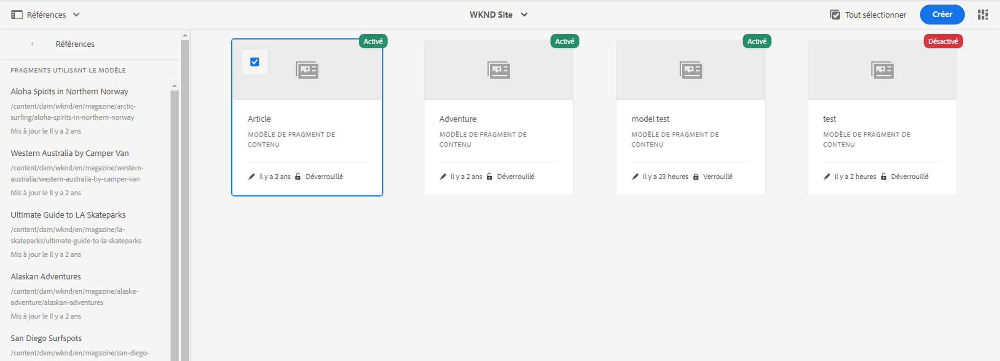
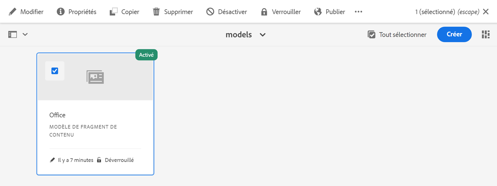
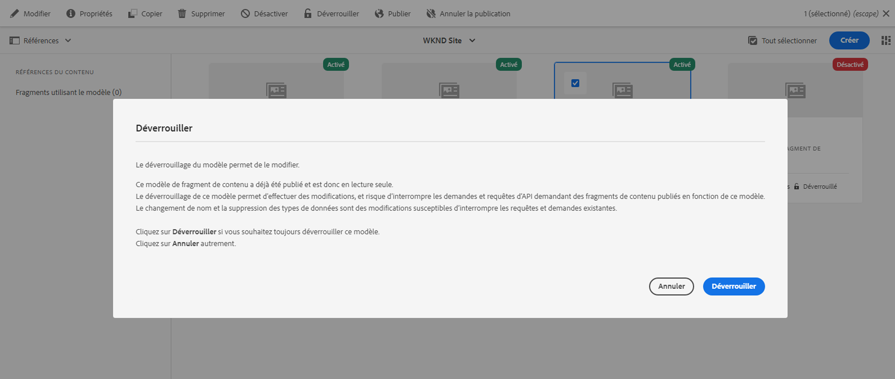
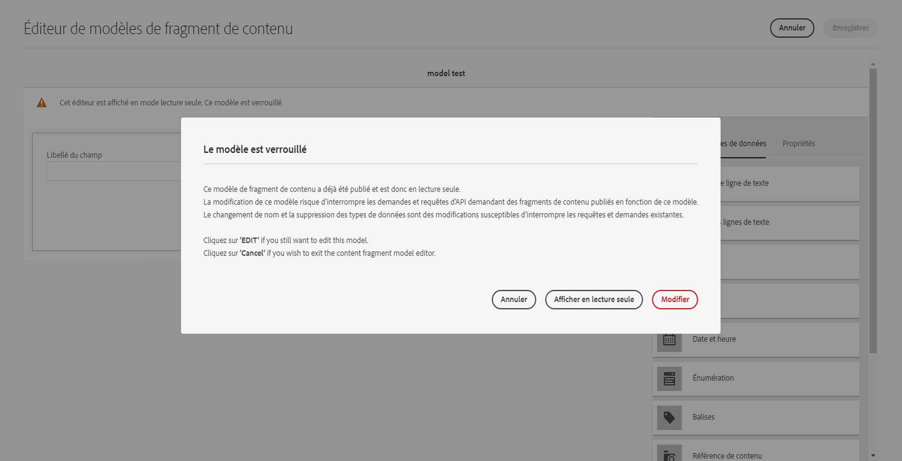
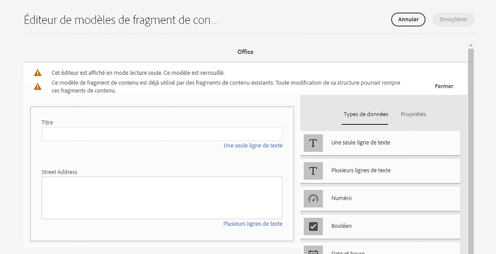
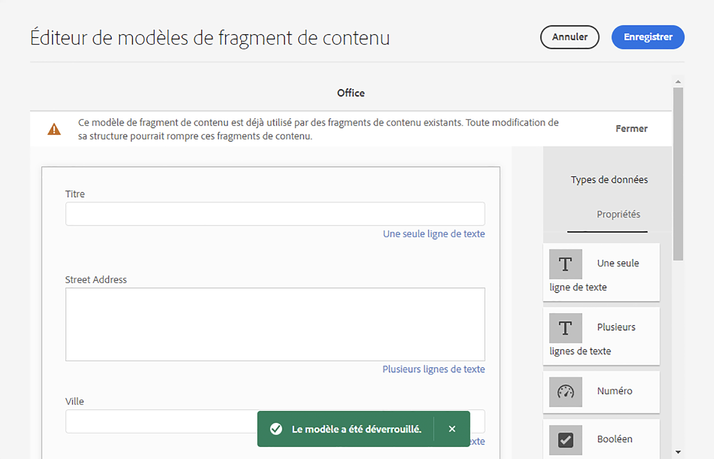

# Modèles de fragment de contenu {#content-fragment-models}

Les modèles de fragment de contenu d’AEM définissent la structure du contenu de vos [fragments de contenu](/help/assets/content-fragments/content-fragments.md) et servent de base à votre contenu découplé.

Pour utiliser des modèles de fragments de contenu, procédez comme suit :

1. [Activez la fonctionnalité Modèle de fragment de contenu pour votre instance.](/help/assets/content-fragments/content-fragments-configuration-browser.md)
1. [Créez](#creating-a-content-fragment-model) et [configurez](#defining-your-content-fragment-model) vos modèles de fragments de contenu.
1. [Activez vos modèles de fragment de contenu](#enabling-disabling-a-content-fragment-model) à utiliser lors de la création de fragments de contenu.
1. [Autorisez vos modèles de fragments de contenu sur les dossiers de ressources requis](#allowing-content-fragment-models-assets-folder) en configurant des **politiques**.

>[!NOTE]
>
>Les fragments de contenu sont une fonctionnalité de sites, mais sont stockés sous la forme **Ressources**.
>
>Les fragments de contenu et les modèles de fragment de contenu sont désormais principalement gérés avec la console **[Fragments de contenu](/help/sites-cloud/administering/content-fragments/overview.md#content-fragments-console)**, bien que les fragments de contenu puissent toujours être gérés à partir de la console **Assets** et les modèles de fragment de contenu à partir de la console **Outils**. Cette section traite de la gestion à partir des consoles **Assets** et **Tools**.

>[!NOTE]
>
>Si un modèle a été créé avec le [nouvel éditeur de modèles](/help/sites-cloud/administering/content-fragments/content-fragment-models.md) vous devez toujours utiliser cet éditeur pour le modèle.
>
>Si vous ouvrez ensuite le modèle avec cet éditeur de modèles (d’origine), le message suivant s’affiche :
>
>* « Un schéma d’interface utilisateur personnalisé est configuré pour ce modèle. L’ordre des champs affichés dans cette interface utilisateur peut ne pas correspondre au schéma d’interface utilisateur. Pour afficher les champs alignés avec le schéma d’interface utilisateur, vous devez passer au nouvel éditeur de fragment de contenu. »

## Création d’un modèle de fragment de contenu {#creating-a-content-fragment-model}

1. Accédez à **Outils**, **Général**, puis ouvrez les **modèles de fragment de contenu**.
1. Accédez au dossier adapté à votre [configuration, ou sous-configuration](/help/assets/content-fragments/content-fragments-configuration-browser.md).
1. Utilisez **Créer** pour ouvrir l’assistant.

   >[!CAUTION]
   >
   >Si l’[utilisation des modèles de contenu du fragment n’a pas été activée](/help/assets/content-fragments/content-fragments-configuration-browser.md), l’option **Créer** n’est pas disponible.

1. Spécifiez le **Titre du modèle**.
Vous pouvez également définir différentes propriétés ; par exemple, ajouter **Balises**, une **Description** et sélectionner **Activer le modèle** pour [activer le modèle](#enabling-disabling-a-content-fragment-model) si nécessaire.

   >[!NOTE]
   >
   >Pour plus d’informations sur le **Modèle d’URL d’aperçu par défaut** voir [&#x200B; Modèle de fragment de contenu - Propriétés](#content-fragment-model-properties).

   

1. Utilisez **Créer** pour enregistrer le modèle vide. Un message indique le succès de l’action. Vous pouvez sélectionner **Ouvrir** pour modifier immédiatement le modèle ou **Terminé** pour revenir à la console.

## Définition de votre modèle de fragment de contenu {#defining-your-content-fragment-model}

Le modèle de fragment de contenu définit effectivement la structure des fragments de contenu résultants à l’aide d’une sélection de **[Types de données](#data-types)**. Grâce à l’éditeur de modèles, vous pouvez ajouter des instances de types de données, puis les configurer pour créer les champs requis :

>[!CAUTION]
>
>La modification d’un modèle de fragment de contenu existant peut avoir un impact sur les fragments dépendants.

1. Accédez à **Outils**, **Général**, puis ouvrez les **modèles de fragment de contenu**.

1. Accédez au dossier contenant votre modèle de fragment de contenu.
1. Ouvrez le modèle requis en vue de le **Modifier** ; utilisez l’action rapide ou sélectionnez le modèle, puis l’action dans la barre d’outils.

   Une fois ouvert, l’éditeur de modèles affiche :

   * à gauche : les champs déjà définis
   * à droite : les **types de données** disponibles pour la création des champs (et les **propriétés** à utiliser une fois les champs créés).
   * haut : une option pour essayer le [nouvel éditeur](/help/sites-cloud/administering/content-fragments/content-fragment-models.md)

   >[!NOTE]
   >
   >Lorsqu’un champ est **obligatoire**, le **libellé** indiqué dans le volet de gauche est signalé par un astérisque (**&#42;**).


1. **Pour ajouter un champ**

   * Faites glisser un type de données à l’emplacement souhaité pour un champ :

     

   * Une fois qu’un champ a été ajouté au modèle, le panneau de droite affiche les **propriétés** qui peuvent être définies pour ce type de données spécifique. Vous pouvez définir ce qui est obligatoire pour ce champ.

      * De nombreuses propriétés s’expliquent d’elles-mêmes. Pour plus d’informations, voir [Propriétés](#properties).
      * Si vous entrez un **libellé de champ**, le **nom de propriété** est automatiquement renseigné. S’il est vide, il peut être mis à jour manuellement par la suite.

        >[!CAUTION]
        >
        >Lors de la mise à jour manuelle de la propriété **Nom de la propriété** pour un type de données, notez que les noms ne doivent contenir que des caractères A-Z, a-z, 0-9 et le trait de soulignement « _ » comme caractère spécial.
        >
        >Si les modèles créés dans des versions antérieures d’AEM contiennent des caractères interdits, supprimez ou modifiez ces caractères.

     Par exemple :

     

1. **Pour supprimer un champ**

   Sélectionnez le champ requis, puis l’icône de corbeille. Le système vous invite à confirmer l’action.

   

1. Ajoutez tous les champs obligatoires et définissez les propriétés connexes, le cas échéant. Par exemple :

   

1. Sélectionnez **Enregistrer** pour conserver la définition.

## Types de données {#data-types}

Une sélection de types de données est disponible pour la définition de votre modèle :

* **Une seule ligne de texte**
   * Ajouter un champ pour une seule ligne de texte ; la longueur maximale peut être définie
   * Le champ peut être configuré pour permettre aux auteurs de fragments de créer de nouvelles instances du champ

* **Plusieurs lignes de texte**
   * Zone de texte pouvant contenir du texte enrichi, du texte brut ou du texte Markdown.
   * Le champ peut être configuré pour permettre aux auteurs de fragments de créer de nouvelles instances du champ

  >[!NOTE]
  >
  >Que la zone de texte soit du texte enrichi, du texte brut ou Markdown, est définie dans le modèle par la propriété **Type par défaut**.
  >
  >Ce format ne peut pas être modifié à partir de l’[éditeur de fragment de contenu](/help/sites-cloud/administering/content-fragments/authoring.md), mais uniquement à partir du modèle.

* **Nombre**
   * Ajouter un champ numérique
   * Le champ peut être configuré pour permettre aux auteurs de fragments de créer de nouvelles instances du champ

* **Booléen**
   * Ajoutez une case à cocher booléenne

* **Date et heure**
   * Ajouter un champ de date et/ou d’heure

* **Énumération**
   * Ajouter un ensemble de champs Case à cocher, Bouton radio ou Liste déroulante
      * Vous pouvez spécifier les options disponibles pour l’auteur du fragment

* **Balises**
   * Permet aux auteurs de fragments d’accéder à des zones de balises et de les sélectionner.

* **Référence du fragment**
   * Fait référence à d’autres fragments de contenu ; peut être utilisé pour [créer du contenu imbriqué](#using-references-to-form-nested-content)
   * Le type de données peut être configuré pour permettre aux auteurs de fragments de procéder aux opérations suivantes :
      * Modifier directement le fragment référencé.
      * Créer un fragment de contenu basé sur le modèle approprié
      * Création de nouvelles instances du champ
   * La référence spécifie le chemin d’accès à la ressource référencée ; par exemple, `/content/dam/path/to/resource`

* **Référence de fragment (UUID)**
   * Fait référence à d’autres fragments de contenu ; peut être utilisé pour [créer du contenu imbriqué](#using-references-to-form-nested-content)
   * Le type de données peut être configuré pour permettre aux auteurs de fragments de procéder aux opérations suivantes :
      * Modifier directement le fragment référencé.
      * Créer un fragment de contenu basé sur le modèle approprié
      * Création de nouvelles instances du champ
   * Dans l’éditeur, la référence spécifie le chemin d’accès à la ressource référencée. En interne, la référence est conservée en tant qu’identifiant universel unique (UUID) qui référence la ressource.
      * Vous n’avez pas besoin de connaître l’UUID ; dans l’éditeur de fragments, vous pouvez accéder au fragment requis

  >[!NOTE]
  >
  >Les UUID sont spécifiques au référentiel. Si vous utilisez l’[outil de copie de contenu](/help/implementing/developing/tools/content-copy.md) pour copier des fragments de contenu, les UUID sont recalculés dans l’environnement cible.

* **Référence de contenu**
   * Fait référence à d’autres contenus, tous types confondus ; peut être utilisée pour [créer du contenu imbriqué](#using-references-to-form-nested-content).
   * Si une image est référencée, vous pouvez choisir d’afficher une miniature.
   * Le champ peut être configuré pour permettre aux auteurs de fragments de créer de nouvelles instances du champ
   * La référence spécifie le chemin d’accès à la ressource référencée ; par exemple, `/content/dam/path/to/resource`

* **Référence de contenu (UUID)**
   * Fait référence à d’autres contenus, tous types confondus ; peut être utilisée pour [créer du contenu imbriqué](#using-references-to-form-nested-content).
   * Si une image est référencée, vous pouvez choisir d’afficher une miniature.
   * Le champ peut être configuré pour permettre aux auteurs de fragments de créer de nouvelles instances du champ
   * Dans l’éditeur, la référence spécifie le chemin d’accès à la ressource référencée. En interne, la référence est conservée en tant qu’identifiant universel unique (UUID) qui référence la ressource.
      * Vous n’avez pas besoin de connaître l’UUID ; dans l’éditeur de fragments, vous pouvez accéder à la ressource requise

  >[!NOTE]
  >
  >Les UUID sont spécifiques au référentiel. Si vous utilisez l’[outil de copie de contenu](/help/implementing/developing/tools/content-copy.md) pour copier des fragments de contenu, les UUID sont recalculés dans l’environnement cible.

* **Objet JSON.**
   * Permet à l’auteur du fragment de contenu de saisir la syntaxe JSON dans les éléments correspondants d’un fragment.
      * Permettre à AEM de stocker directement JSON que vous avez copié/collé à partir d’un autre service.
      * Le fichier JSON est transmis et généré sous la forme JSON dans GraphQL.
      * Inclut la mise en surbrillance de la syntaxe JSON, la saisie automatique et la mise en surbrillance des erreurs dans l’éditeur de fragment de contenu.

* **Espace réservé pour tabulation**
   * Permet l’introduction d’onglets à utiliser lors de la modification du contenu du fragment de contenu.
      * Elles s’affichent sous forme de séparateurs dans l’éditeur de modèles et séparent les sections de la liste des types de données de contenu. Chaque instance représente le début d’un nouvel onglet.
      * Dans l’éditeur de fragments, chaque instance s’affiche sous la forme d’un onglet.

     >[!NOTE]
     >
     >Ce type de données est uniquement utilisé à des fins de mise en forme. Il est ignoré par le schéma GraphQL AEM.

## Propriétés {#properties}

De nombreuses propriétés s’expliquent d’elles-mêmes. Pour certaines propriétés, les détails supplémentaires sont les suivants :

* **Nom de la propriété**

  Lors de la mise à jour manuelle de cette propriété pour un type de données, notez que les noms **ne doivent** contenir *que* les caractères A-Z, a-z, 0-9 et le trait de soulignement « _ » comme caractère spécial.

  >[!CAUTION]
  >
  >Si les modèles créés dans des versions antérieures d’AEM contiennent des caractères interdits, supprimez ou modifiez ces caractères.

* **Rendu comme**
Les différentes options permettant de réaliser/rendre le champ dans un fragment. Souvent, cette propriété vous permet de définir si l’auteur voit une seule instance du champ ou s’il est autorisé à créer plusieurs instances. Lorsque le **champ multiple** est utilisé, vous pouvez définir le nombre minimal et maximal d’éléments. Voir [Validation](#validation) pour plus de détails.

* **Libellé du champ**
La saisie d’un **Libellé du champ** génère automatiquement un **Nom de la propriété**, qui peut ensuite être mis à jour manuellement si nécessaire.

* **Validation**
La validation de base est disponible par le biais de mécanismes tels que la propriété **Requis**. Certains types de données comportent des champs de validation supplémentaires. Voir [Validation](#validation) pour plus de détails.

* Pour le type données **texte multiligne**, il est possible de définir le **type par défaut** en tant que :

   * **Texte enrichi**
   * **Texte (Markdown)**
   * **Texte brut**

  Si elle n’est pas spécifiée, la valeur par défaut **Texte enrichi** est utilisée pour ce champ.

  La modification du **type par défaut** dans un modèle de fragment de contenu prend effet uniquement sur un fragment de contenu existant et lié après l’ouverture et l’enregistrement du fragment dans l’éditeur.

* **Unique**
Le contenu (du champ spécifique) doit être unique dans tous les fragments de contenu créés à l’aide du modèle actuel.

  Cette propriété permet de s’assurer que les auteurs de contenu ne peuvent pas répéter le contenu déjà ajouté dans un autre fragment du même modèle.

  Par exemple, un champ **Une seule ligne de texte** appelé `Country` dans le modèle de fragment de contenu ne peut pas avoir la valeur `Japan` dans deux fragments de contenu dépendants. Un avertissement est émis en cas de tentative concernant la deuxième instance.

  >[!NOTE]
  >
  >L’unicité est assurée par la racine de langue.

  >[!NOTE]
  >
  >Les variations peuvent avoir la même valeur *unique* que les variations du même fragment, mais pas la même valeur que celle utilisée dans une variation d’autres fragments.

  >[!CAUTION]
  >
  >Si vous souhaitez utiliser MSM (qui crée des copies de fragments de contenu), toute contrainte **unique** doit être supprimée de tous les types de données utilisés dans les modèles de fragment de contenu respectifs.

* Consultez la section **[Référence de contenu](#content-reference)** pour plus d’informations sur ce type de données spécifique et ses propriétés.

* Voir la section **[Référence du fragment (Fragments imbriqués)](#fragment-reference-nested-fragments)** pour plus d’informations sur ce type de données spécifique et ses propriétés.

* **Traduisible**

  Activez la case à cocher **Traduisible** dans un champ de l’éditeur de modèle de fragment de contenu pour :

   * vous assurer que le nom de la propriété du champ est ajouté à la configuration de traduction, `/content/dam/<sites-configuration>` de contexte, s’il n’est pas déjà présent ;
   * Pour GraphQL : définir une propriété `<translatable>` dans le champ Fragment de contenu sur `yes` afin d’autoriser le filtre de requête GraphQL pour la sortie JSON avec du contenu traduisible uniquement.

## Validation {#validation}

Différents types de données incluent désormais la possibilité de définir les exigences de validation lorsque le contenu est saisi dans le fragment résultant :

* **Une seule ligne de texte**
   * Comparaison avec une expression régulière prédéfinie (regex).
* **Nombre**
   * Vérification de valeurs spécifiques.
* **Référence de contenu**
   * Test de types de contenu spécifiques.
   * Seuls peuvent être référencés des fichiers de taille de fichier spécifiée ou inférieure.
   * Seules peuvent être référencées les images d’une plage prédéfinie de largeur et/ou de hauteur (en pixels).
* **Référence du fragment**
   * Test d’un modèle de fragment de contenu spécifique.
* **Nombre minimum d’éléments** / **Nombre maximum d’éléments**

  Les champs qui ont été définis comme un **champ multiple** (défini avec **Rendre en tant que**) ont les options suivantes :

   * **Nombre minimum d’éléments**
   * **Nombre maximal d’éléments**

  Ils sont validés :

   * La valeur maximale est validée dans l’[éditeur de fragment de contenu d’origine](/help/assets/content-fragments/content-fragments-variations.md).
   * Les deux sont validés dans l’[éditeur de fragment de contenu](/help/sites-cloud/administering/content-fragments/authoring.md).

## Utilisation de références pour former un contenu imbriqué {#using-references-to-form-nested-content}

Les fragments de contenu peuvent former du contenu imbriqué à l’aide de l’un des types de données suivants :

* [Référence de contenu](#content-reference)
   * Fournit une référence simple à un autre contenu, quel que soit son type.
   * Fournis par les types de données :
      * **Référence de contenu** - Basé sur un chemin d’accès
      * **Référence de contenu (UUID)** basée sur UUID
   * Peut être configuré pour une ou plusieurs références (dans le fragment résultant).

* [Référence du fragment](#fragment-reference-nested-fragments) (fragments imbriqués)
   * Fait référence à d’autres fragments, en fonction des modèles spécifiques spécifiés.
   * Fournis par les types de données :
      * **Référence de fragment** - Basé sur un chemin d’accès
      * **Référence de fragment (UUID)** basée sur UUID
   * Permet d’inclure/récupérer des données structurées.

     >[!NOTE]
     >
     >Cette méthode est particulièrement intéressante lorsque vous utilisez [diffusion de contenu découplée à l’aide de fragments de contenu avec GraphQL](/help/sites-cloud/administering/content-fragments/content-delivery-with-graphql.md).

   * Peut être configuré pour une ou plusieurs références (dans le fragment résultant).

>[!NOTE]
>
>Voir [Mettre à niveau vos fragments de contenu pour les références UUID](/help/headless/graphql-api/uuid-reference-upgrade.md) pour plus d’informations sur la référence de contenu/fragment et la référence de contenu/fragment (UUID), et mettre à niveau vers les types de données basés sur UUID.

>[!NOTE]
>
>AEM dispose d’une protection de récurrence pour :
>
>* Références du contenu
>  &#x200B;>  Cela empêche l’utilisateur d’ajouter une référence au fragment actif. Cette approche peut conduire à une boîte de dialogue vide dans le sélecteur de référence du fragment.
>
>* Références de fragment dans GraphQL
>  &#x200B;>  Si vous créez une requête profonde qui renvoie plusieurs fragments de contenu référencés les uns par les autres, elle renvoie la valeur « null » lors de la première occurrence.

### Référence de contenu {#content-reference}

Les types de données **Référence de contenu** et **Référence de contenu (UUID)** vous permettent d’effectuer le rendu d’un contenu provenant d’une autre source, par exemple une image, une page ou un fragment d’expérience.

Outre les propriétés standard, vous pouvez spécifier les éléments suivants :

* Le **chemin racine** pour tout contenu référencé
* Types de contenu pouvant être référencés
* Limites relatives aux tailles de fichier
* Si une image est référencée :
   * Afficher la miniature
   * Limites de hauteur et de largeur pour l’image


### Référence du fragment (fragments imbriqués) {#fragment-reference-nested-fragments}

Les types de données **Référence du fragment** et **Référence du fragment (UUID)** peuvent référencer un ou plusieurs fragments de contenu. Cette fonctionnalité est particulièrement intéressante lors de la récupération de contenu à utiliser dans votre application, car elle vous permet de récupérer des données structurées avec plusieurs calques.

Par exemple :

* Un modèle définissant les détails d’un employé. Il s’agit notamment des éléments suivants :
   * Référence au modèle qui définit l’employeur (entreprise)

```xml
type EmployeeModel {
    name: String
    firstName: String
    company: CompanyModel
}

type CompanyModel {
    name: String
    street: String
    city: String
}
```

>[!NOTE]
>
>Cette méthode présente un intérêt particulier en conjonction avec la [Diffusion de contenu découplé utilisant des fragments de contenu à l’aide de GraphQL](/help/assets/content-fragments/content-fragments-graphql.md).

Outre les propriétés standard, vous pouvez définir les éléments suivants :

* **Afficher comme** :

   * **multifield** : l’auteur du fragment peut créer plusieurs références individuelles

   * **fragmentreference** : permet à l’auteur du fragment de sélectionner une référence unique à un fragment.

* **Type de modèle**
Il est possible de sélectionner plusieurs modèles. Lors de la création du fragment de contenu, tous les fragments référencés doivent avoir été créés à l’aide de ces modèles.

* **Chemin racine**
Indique un chemin racine pour tout fragment référencé.

* **Autoriser la création de fragments**

  Cette propriété permet à la personne chargée de la création du fragment de créer un fragment en fonction du modèle approprié.

   * **fragmentreferencecomposite** : permet à l’auteur du fragment de créer un composite en sélectionnant plusieurs fragments.

  

>[!NOTE]
>
>Un mécanisme de protection de récurrence est en place. Il interdit à l’utilisateur de sélectionner le fragment de contenu actif dans la référence au fragment. L’approche peut conduire à une boîte de dialogue vide du sélecteur de référence du fragment.
>
>Il existe également une protection de récurrence pour les références de fragments dans GraphQL. Si vous créez une requête profonde entre deux fragments de contenu qui se référencent mutuellement, elle renvoie la valeur « null ».

## Modèle de fragment de contenu – Propriétés {#content-fragment-model-properties}

Vous pouvez modifier les **propriétés** d’un modèle de fragment de contenu :

* **De base**
   * **Titre du modèle**
   * **Balises**
   * **Description**
   * **Télécharger l’image**
   * **Modèle d’URL d’aperçu par défaut**

     >[!NOTE]
     >
     >Il n’est utilisé que par le *nouvel* éditeur de fragment de contenu. Voir [Modèles de fragment de contenu](/help/sites-cloud/administering/content-fragments/content-fragment-models.md#content-fragment-model-properties) pour plus d’informations.


## Activation ou désactivation d’un modèle de fragment de contenu {#enabling-disabling-a-content-fragment-model}

Pour un contrôle total de l’utilisation de vos modèles de fragments de contenu, ils contiennent un état que vous pouvez définir.

### Activation d’un modèle de fragment de contenu {#enabling-a-content-fragment-model}

Lorsqu’un modèle est créé, il doit être activé de sorte qu’il :

* Peut être sélectionné lors de la création d’un fragment de contenu.
* Pouvoir être référencé à partir d’un modèle de fragment de contenu.
* Être disponible pour GraphQL ; le schéma est ensuite généré.

Pour activer un modèle marqué comme :

* **Brouillon** : nouveau (jamais activé).
* **Désactivé** : a été spécifiquement désactivé.

Vous utilisez l’option **Activer** de l’une des manières suivantes :

* La barre d’outils supérieure, lorsque le modèle concerné est sélectionné.
* L’action rapide correspondante (placez le pointeur de la souris sur le modèle concerné).



### Désactivation d’un modèle de fragment de contenu {#disabling-a-content-fragment-model}

Un modèle peut également être désactivé afin que :

* Le modèle ne soit plus disponible comme base pour la création de *nouveaux* fragments de contenu.
* Toutefois :
   * Le schéma GraphQL continue à être généré et peut toujours être interrogé (pour éviter tout impact sur l’API JSON).
   * Tout fragment de contenu basé sur le modèle peut toujours être interrogé et renvoyé à partir du point d’entrée GraphQL.
* Le modèle ne peut plus être référencé, mais les références existantes sont conservées intactes et peuvent toujours être interrogées et renvoyées à partir du point d’entrée GraphQL.

Pour désactiver un modèle marqué comme **Activé**, utilisez l’option **Désactiver** de l’une des deux manières suivantes :

* La barre d’outils supérieure, lorsque le modèle concerné est sélectionné.
* L’action rapide correspondante (placez le pointeur de la souris sur le modèle concerné).


## Autorisation de modèles de fragments de contenu dans votre dossier de ressources {#allowing-content-fragment-models-assets-folder}

Pour mettre en œuvre une gouvernance du contenu, vous pouvez configurer des **Politiques** sur le dossier de ressources pour contrôler les modèles de fragment de contenu autorisés pour la création de fragments dans ce dossier.

>[!NOTE]
>
>Le mécanisme est similaire à [l’autorisation de modèles de page](/help/sites-cloud/authoring/page-editor/templates.md#allowing-a-template-author) pour une page et ses enfants, dans les propriétés avancées d’une page.

Pour configurer les **politiques** des **modèles de fragments de contenu autorisés** :

1. Recherchez et ouvrez les **Propriétés** pour le dossier de ressources requis.

1. Ouvrez l’onglet **Politiques** pour configurer les éléments suivants :

   * **Hérité de`<folder>`**

     Les politiques sont automatiquement héritées lors de la création de dossiers enfants ; il peut se produire une reconfiguration de la politique (et une rupture de l’héritage) si des sous-dossiers doivent autoriser des modèles différents du dossier parent.

   * **Modèles de fragments de contenu autorisés par chemin**

     Il est possible d’autoriser plusieurs modèles.

   * **Modèles de fragments de contenu autorisés par balise**

     Il est possible d’autoriser plusieurs modèles.

   

1. **Enregistrez** les modifications.

Les modèles de fragment de contenu autorisés pour un dossier sont résolus comme suit :

* **Politiques** pour les **modèles de fragments de contenu autorisés**.
* Si elles sont absentes, essayez de déterminer la politique à l’aide des règles d’héritage.
* Si la chaîne d’héritage ne produit pas de résultat, examinez la configuration de **Services cloud** pour ce dossier (directement dans un premier temps, puis par héritage).
* Si aucun des éléments ci-dessus ne donne de résultats, il n’existe aucun modèle autorisé pour ce dossier.

## Suppression d’un modèle de fragment de contenu {#deleting-a-content-fragment-model}

>[!CAUTION]
>
>La suppression d’un modèle de fragment de contenu peut avoir un impact sur les fragments dépendants.

Pour supprimer un modèle de fragment de contenu :

1. Accédez à **Outils**, **Général**, puis ouvrez les **Modèles de fragment de contenu**.

1. Accédez au dossier contenant votre modèle de fragment de contenu.
1. Sélectionnez votre modèle, puis l’option **Supprimer** dans la barre d’outils.

   >[!NOTE]
   >
   >Si le modèle est référencé, un avertissement s’affiche. Agissez de manière appropriée.

## Publication d’un modèle de fragment de contenu {#publishing-a-content-fragment-model}

Les modèles de fragment de contenu doivent être publiés avant ou pendant la publication des fragments de contenu dépendants.

Pour publier un modèle de fragment de contenu :

1. Accédez à **Outils**, **Général**, puis ouvrez les **Modèles de fragment de contenu**.

1. Accédez au dossier contenant votre modèle de fragment de contenu.
1. Sélectionnez votre modèle, puis l’option de **publication** dans la barre d’outils.
Le statut publié est indiqué dans la console.

   >[!NOTE]
   >
   >Si vous publiez un fragment de contenu pour lequel le modèle n’a pas encore été publié, une liste de sélection l’indique, ainsi que le fait que le modèle est publié avec le fragment.

## Dépublication d’un modèle de fragment de contenu {#unpublishing-a-content-fragment-model}

Les modèles de fragment de contenu peuvent être dépubliés s’ils ne sont référencés par aucun fragment.

Pour dépublier un modèle de fragment de contenu :

1. Accédez à **Outils**, **Général**, puis ouvrez les **Modèles de fragment de contenu**.

1. Accédez au dossier contenant votre modèle de fragment de contenu.
1. Sélectionnez votre modèle, puis l’option **Dépublier** dans la barre d’outils.
L’état publié est indiqué dans la console.

Si vous essayez de dépublier un modèle actuellement utilisé par un ou plusieurs fragments, un avertissement d’erreur vous en informe :



Le message vous invite à vérifier le panneau [Références](/help/sites-cloud/authoring/basic-handling.md#references) pour en savoir plus :



## Modèles de fragment de contenu (publiés) verrouillés {#locked-published-content-fragment-models}

Cette fonctionnalité fournit une gouvernance pour les modèles de fragment de contenu qui ont été publiés.

### La difficulté {#the-challenge}

* Les modèles de fragment de contenu déterminent le schéma des requêtes GraphQL dans AEM.

   * Les schémas GraphQL AEM sont créés dès qu’un modèle de fragment de contenu est créé. Ils peuvent exister dans les environnements de création et de publication.

   * Les schémas en environnement de publication sont les plus critiques, car ils fournissent les bases de la diffusion en direct du contenu de fragment de contenu au format JSON.

* Des problèmes peuvent survenir lorsque des modèles de fragment de contenu sont modifiés. Cela signifie que le schéma change, ce qui peut à son tour affecter les requêtes GraphQL existantes.

* L’ajout de nouveaux champs à un modèle de fragment de contenu ne doit (généralement) avoir aucun effet négatif. Toutefois, la modification de champs de données existants (par exemple, le nom) ou la suppression de définitions de champ rompt les requêtes GraphQL existantes lorsqu’elles interrogent ces champs.

### Les exigences {#the-requirements}

* Sensibiliser les utilisateurs aux risques liés à la modification de modèles déjà utilisés pour la diffusion de contenu en direct, c’est-à-dire des modèles qui ont été publiés.

* Éviter également toute modification imprévue.

L’un ou l’autre peut causer une interruption des requêtes si les modèles modifiés sont republiés.

### La solution {#the-solution}

Pour résoudre ces problèmes, les modèles de fragment de contenu sont *verrouillés* en mode LECTURE SEULE pour l’auteur dès leur publication. Ce verrouillage est indiqué par la mention **Verrouillé** :



Lorsque le modèle est **Verrouillé** (en mode LECTURE SEULE ), vous pouvez voir le contenu et la structure des modèles, mais vous ne pouvez pas les modifier.

Vous pouvez gérer les modèles **verrouillés** à partir de la console ou de l’éditeur de modèles :

* Console

  Dans la console, vous pouvez gérer le mode LECTURE SEULE avec les actions **Déverrouiller** et **Verrouiller** dans la barre d’outils :

  

   * Vous pouvez **Déverrouiller** un modèle pour activer les modifications.

     Si vous sélectionnez **Déverrouiller**, un avertissement s’affiche et vous devez confirmer l’action **Déverrouiller** :
     

     Vous pouvez ensuite ouvrir le modèle pour le modifier.

   * Vous pouvez également **Verrouiller** le modèle par la suite.
   * La republication du modèle le rebascule immédiatement en mode **Verrouillé** (LECTURE SEULE).

* Éditeur de modèles

   * Lorsque vous ouvrez un modèle verrouillé, vous recevez un avertissement et trois actions s’affichent : **Annuler**, **Afficher en lecture seule**, **Modifier** :

     

   * Si vous sélectionnez **Afficher en lecture seule**, vous pouvez voir le contenu et la structure du modèle :

     

   * Si vous sélectionnez **Modifier**, vous pouvez modifier et enregistrer vos mises à jour :

     

     >[!NOTE]
     >
     >Un avertissement peut toujours s’afficher en haut de l’écran, mais seulement lorsque le modèle est déjà utilisé par les fragments de contenu existants.

   * **Annuler** vous ramène à la console.
