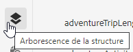
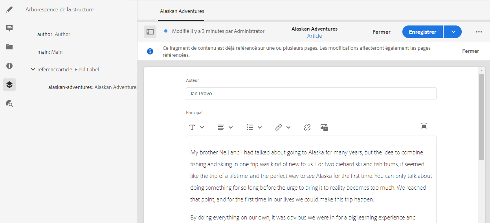

# Arborescence de la structure du fragment de contenu {#content-fragment-structure-tree}

Utilisez la fonction Arborescence de structure de l’éditeur de fragments de contenu dans AEM pour mieux comprendre votre contenu, en particulier pour une diffusion sans interface.

>[!NOTE]
>
>Les fragments de contenu sont une fonctionnalité de sites, mais sont stockés sous la forme **Ressources**.
>
>Il existe deux éditeurs pour la création de fragments de contenu. Bien que la fonctionnalité de base soit la même, il existe des différences. Cette section décrit l’éditeur d’origine, principalement accessible à partir de la console **Assets**. Pour plus d’informations sur le nouvel éditeur, voir la documentation Sites, [Fragments de contenu - Création](/help/sites-cloud/administering/content-fragments/authoring.md), (principalement accessible à partir de la console **Fragments de contenu**).

Dans l’éditeur de fragments de contenu, vous pouvez sélectionner l’icône d’arborescence de structure :

Cette opération ouvre une représentation de la structure du fragment dans le volet de gauche. Vous pouvez ainsi parcourir et atteindre les fragments référencés. La sélection d’une référence ouvre ce fragment en vue de le modifier.

>[!NOTE]
>
>À l’aide des chemins de navigation du panneau principal, vous pouvez revenir à votre point de départ.

