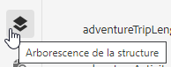
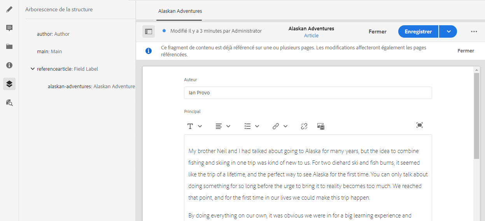

# Arborescence de la structure du fragment de contenu {#content-fragment-structure-tree}

Utilisez la fonction Arborescence de structure de l’éditeur de fragment de contenu dans AEM pour mieux comprendre votre contenu, en particulier pour une diffusion découplée.

>[!NOTE]
>
>Les fragments de contenu sont une fonctionnalité de sites, mais sont stockés sous la forme **Ressources**.
>
>Il existe deux éditeurs pour créer des fragments de contenu ; bien que la fonctionnalité de base soit la même, il existe quelques différences. Cette section couvre l’éditeur d’origine, accessible principalement à partir de la console **Assets**. Voir la documentation Sites, [Fragments de contenu - Création](/help/sites-cloud/administering/content-fragments/authoring.md), pour plus d’informations sur le nouvel éditeur (principalement accessible à partir de la console **Fragments de contenu**).

Dans l’éditeur de fragments de contenu, vous pouvez sélectionner l’icône d’arborescence de structure :

Cette opération ouvre une représentation de la structure du fragment dans le volet de gauche. Vous pouvez ainsi parcourir et atteindre les fragments référencés. La sélection d’une référence ouvre ce fragment en vue de le modifier.

>[!NOTE]
>
>À l’aide des chemins de navigation du panneau principal, vous pouvez revenir à votre point de départ.

