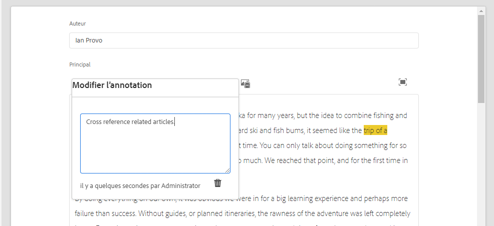

# Variations – création de contenu de fragment{#variations-authoring-fragment-content}

Les [variations](/help/assets/content-fragments/content-fragments.md#constituent-parts-of-a-content-fragment) sont une fonction importante des fragments de contenu AEM car elles permettent de créer et de modifier des copies du contenu maître pour une utilisation sur des canaux spécifiques ou dans des cas spécifiques, ce qui rend la diffusion de votre contenu découplé encore plus flexible.

À partir de l’onglet **Variations**, vous pouvez :

* [saisir le contenu](#authoring-your-content) de votre fragment ;
* [créer et gérer les variations](#managing-variations) du contenu **maître** ;

effectuer diverses autres actions selon le type de données que vous modifiez, par exemple :

* [Insertion de ressources visuelles dans votre fragment](#inserting-assets-into-your-fragment) (images)

* Sélectionner entre [Texte enrichi](#rich-text), [Texte brut](#plain-text) et [Markdown](#markdown) pour modification

* [Chargement du contenu](#uploading-content)

* [Affichage des statistiques clés](#viewing-key-statistics) (à propos du texte sur plusieurs lignes)

* [Création d’un résumé de texte](#summarizing-text)

* [Synchronisation des variations avec le contenu maître](#synchronizing-with-master)

>[!CAUTION]
>
>Une fois qu’un fragment a été publié et/ou référencé, AEM affiche un avertissement lorsqu’un auteur ouvre à nouveau ce fragment en mode d’édition. Il s’agit de signaler que les modifications apportées au fragment seront également répercutées sur les pages référencées.

## Création de contenu {#authoring-your-content}

Lorsque vous ouvrez votre fragment de contenu pour le modifier, la variable **Variations** est ouvert par défaut. Ici, vous pouvez créer le contenu, par Principal ou toute variante que vous avez. Le fragment structuré contient différents champs, avec divers types de données, qui ont été définis dans le modèle de contenu.

Par exemple :

Vous pouvez :

* Apportez des modifications à votre contenu directement dans l’onglet **Variations**. Chaque type de données fournit différentes options de modification, par exemple :

   * Pour les champs **Plusieurs lignes de texte**, vous pouvez également ouvrir l’[éditeur plein écran](#full-screen-editor) pour :

      * sélectionner le [format](#formats) ;
      * voir davantage d’options de modification (pour le format [Texte enrichi](#rich-text)) ;
      * accéder à un éventail d’[actions](#actions).

   * Pour les champs **Référence de fragment**, l’option [Modifier le fragment de contenu](#fragment-references-edit-content-fragment) peut être disponible, selon la définition du modèle.

* Attribuez des **Balises** à la variation actuelle. Les balises peuvent être ajoutées, mises à jour et supprimées.

   * Les [balises](/help/sites-cloud/authoring/features/tags.md) sont particulièrement puissantes lors de l’organisation de vos fragments, car elles peuvent être utilisées pour la classification et la taxonomie du contenu. Les balises peuvent être utilisées dans le but de rechercher du contenu (par balises) et d’appliquer des opérations en bloc.

      * Les recherches d’une balise renvoient le fragment avec la variation balisée en surbrillance.
      * Vous pouvez également utiliser les balises de variation pour regrouper des variations pour un profil de réseau de diffusion de contenu (CDN) spécifique (pour la mise en cache CDN), au lieu d’utiliser le nom de la variation.

     Par exemple, vous pouvez baliser les fragments pertinents en tant que « lancement de Noël » pour ne les parcourir que sous forme de sous-ensemble, ou les copier pour les utiliser avec un autre lancement futur dans un nouveau dossier.

  >[!NOTE]
  >
  >Vous pouvez également ajouter des **balises** (à la variation **principale**) dans le cadre des [métadonnées](/help/assets/content-fragments/content-fragments-metadata.md).

* [Créez et gérez les variations](#managing-variations) du contenu **principal**.

### Éditeur plein écran {#full-screen-editor}

Lors de la modification d’un champ de plusieurs lignes de texte, vous pouvez ouvrir l’éditeur plein écran ; appuyez ou cliquez dans le texte, puis sélectionnez l’icône d’action suivante :

L’éditeur de texte s’ouvre alors en plein écran :

L’éditeur de texte en plein écran fournit :

* Accès à divers [actions](#actions)
* Selon le [format](#formats), options de mise en forme supplémentaires ([Texte enrichi](#rich-text))

### Actions {#actions}

Les actions suivantes sont également disponibles (pour tous les [formats](#formats)) lorsque l’éditeur plein écran (c’est-à-dire pour le texte sur plusieurs lignes) est ouvert :

* Sélection du [format](#formats) ([Texte enrichi](#rich-text), [Texte brut](#plain-text) ou [Texte (Markdown](#markdown)))

* [Chargement du contenu](#uploading-content)

* [Affichage des statistiques de texte](#viewing-key-statistics)

* [Synchronisation avec le gabarit](#synchronizing-with-master) (lors de la modification d’une variation)

* [Création d’un résumé de texte](#summarizing-text)

### Formats {#formats}

Les options de modification du texte sur plusieurs lignes dépendent du format sélectionné :

* [Texte enrichi](#rich-text)
* [Texte brut](#plain-text)
* [Texte (Markdown)](#markdown)

Le format peut être sélectionné dans l’éditeur plein écran.

### Texte enrichi {#rich-text}

La modification de texte enrichi permet de mettre en forme :

* Gras
* Italique
* Souligné
* Alignement : gauche, centre et droite
* Liste à puces
* Liste numérotée
* Retrait : augmenter, diminuer
* Création/suppression d’hyperliens
* Coller le texte/à partir de Word
* Insérer un tableau
* Style de paragraphe : paragraphe et en-tête 1/2/3
* [Insérer une ressource](#inserting-assets-into-your-fragment)
* Ouvrez l’éditeur plein écran où les options de mise en forme suivantes sont disponibles :
   * Rechercher
   * Rechercher/remplacer
   * Vérificateur orthographique
   * [Annotations](/help/assets/content-fragments/content-fragments-variations.md#annotating-a-content-fragment)
* [Insérer un fragment de contenu](#inserting-content-fragment-into-your-fragment) ; disponible lorsque votre champ **Plusieurs lignes de texte** est configuré avec l’option **Autoriser la référence de fragment** activée.

Les [actions](#actions) sont également accessibles à partir de l’éditeur plein écran.

### Texte brut {#plain-text}

Le texte brut permet de saisir du contenu de manière rapide, sans formatage ni Markdown. Vous pouvez également ouvrir l’éditeur plein écran pour accomplir d’autres [actions](#actions).

>[!CAUTION]
>
>Si vous sélectionnez **Texte brut**, vous risquez de perdre le formatage, les annotations et/ou les fichiers que vous avez insérés dans du **texte enrichi** ou dans **Markdown**.

### Texte (Markdown) {#markdown}

>[!NOTE]
>
>Pour plus d’informations, voir [Markdown](/help/assets/content-fragments/content-fragments-markdown.md) documentation.

Vous pouvez ainsi mettre en forme votre texte à l’aide de Markdown. Vous pouvez définir :

* Titres
* Paragraphes et sauts de ligne
* Liens
* Images
* Blocs de citations
* Listes
* Accent
* Blocs de code
* Échappements par barre oblique inverse

Vous pouvez également ouvrir l’éditeur plein écran pour accomplir d’autres [actions](#actions).

>[!CAUTION]
>
>Si vous basculez entre **Texte enrichi** et **Texte (Markdown)**, des effets inattendus peuvent apparaître avec les Blocs de citations et Blocs de code, dans la mesure où le traitement de ces deux formats peut être différent.

### Références à un fragment {#fragment-references}

Si le modèle de fragment de contenu contient des références à un fragment, les auteurs de fragments peuvent disposer d’options disponibles supplémentaires :

* [Modifier le fragment de contenu](#fragment-references-edit-content-fragment)
* [Nouveau fragment du contenu](#fragment-references-new-content-fragment)

#### Modifier le fragment de contenu {#fragment-references-edit-content-fragment}

L’option **Modifier le fragment de contenu** ouvre ce fragment dans un nouvel onglet de l’éditeur (dans le même onglet du navigateur).

Si vous sélectionnez à nouveau l’onglet d’origine (par exemple, **Little Pony Inc.**), cet onglet secondaire se ferme (dans ce cas, **Adam Smith**).

#### Nouveau fragment du contenu {#fragment-references-new-content-fragment}

L’option **Nouveau fragment de contenu** vous permet de créer un fragment complètement nouveau. Pour ce faire, une variante de l’assistant de création de fragment de contenu s’ouvre dans l’éditeur.

Vous pouvez alors créer un fragment en procédant comme suit :

1. naviguez jusqu’au dossier requis et sélectionnez-le ;
1. sélectionnez **Suivant** ;
1. spécifiez les propriétés ; par exemple le **Titre** ;
1. sélectionnez **Créer** ;
1. et sélectionnez enfin :
   1. **Terminer** pour retourner au fragment original tout en référençant le nouveau fragment ;
   1. ou **Ouvrir** pour référencer le nouveau fragment et l’ouvrir pour modification dans un nouvel onglet du navigateur.

### Affichage des statistiques clés {#viewing-key-statistics}

Lorsque l’éditeur plein écran est ouvert, l’action **Statistiques de texte** affiche différentes informations au sujet du texte.

Par exemple :

### Chargement de contenu {#uploading-content}

Pour simplifier le processus de création de fragments de contenu, vous pouvez charger du texte préparé dans un éditeur externe et l’ajouter directement au fragment.

### Résumé de texte {#summarizing-text}

Le résumé de texte est conçu pour aider les utilisateurs à réduire la longueur de leur texte à un nombre prédéfini de mots tout en conservant les éléments clés et la signification globale.

>[!NOTE]
>
>À un niveau plus technique, le système conserve les phrases qu’il évalue comme ayant le *meilleur rapport de densité et d’unicité des informations* selon des algorithmes spécifiques.

>[!CAUTION]
>
>Le fragment de contenu doit posséder un dossier de langue valide (code ISO) en tant qu’ancêtre ; celui-ci permet de déterminer le modèle de langue à utiliser.
>
>Par exemple, `en/` comme dans le chemin d’accès suivant :
>
>  `/content/dam/my-brand/en/path-down/my-content-fragment`

>[!CAUTION]
>
L’anglais est disponible par défaut.
>
D’autres langues sont disponibles en tant que modules de modèle de langue à partir de Distribution logicielle :
>
* [Français (fr)](https://experience.adobe.com/#/downloads/content/software-distribution/en/aem.html?lang=fr?package=/content/software-distribution/en/details.html?lang=fr/content/dam/aem/public/adobe/packages/cq630/product/smartcontent-model-fr)
* [Allemand (de)](https://experience.adobe.com/#/downloads/content/software-distribution/en/aem.html?lang=fr?package=/content/software-distribution/en/details.html?lang=fr/content/dam/aem/public/adobe/packages/cq630/product/smartcontent-model-de)
* [Italien (it)](https://experience.adobe.com/#/downloads/content/software-distribution/en/aem.html?package=/content/software-distribution/en/details.html/content/dam/aem/public/adobe/packages/cq630/product/smartcontent-model-it)
* [Espagnol (es)](https://experience.adobe.com/#/downloads/content/software-distribution/en/aem.html?lang=fr?package=/content/software-distribution/en/details.html?lang=fr/content/dam/aem/public/adobe/packages/cq630/product/smartcontent-model-es)
>

1. Sélectionner **Principal** ou la variation requise.
1. Ouvrez l’éditeur plein écran.

1. Sélectionnez **Résumer le texte** dans la barre d’outils.

   

1. Indiquez le nombre cible de mots et sélectionnez **Début**:
1. Le texte original s’affiche côte à côte avec la synthèse proposée :

   * Toutes les phrases à éliminer sont surlignées en rouge, avec un coup publicitaire.
   * Cliquez sur une phrase en surbrillance pour la conserver dans le contenu résumé.
   * Cliquez sur une phrase non mise en surbrillance pour l’éliminer.

1. Sélectionnez **Résumer** pour confirmer les modifications.

1. Le texte original s’affiche côte à côte avec la synthèse proposée :

   * Toutes les phrases à éliminer sont surlignées en rouge, avec un coup publicitaire.
   * Cliquez sur une phrase en surbrillance pour la conserver dans le contenu résumé.
   * Cliquez sur une phrase non mise en surbrillance pour l’éliminer.
   * Les statistiques de synthèse s’affichent : **Réel** et **Cible**-
   * Vous pouvez **prévisualiser** les modifications.

   

### Annotation d’un fragment de contenu {#annotating-a-content-fragment}

Pour annoter un fragment :

1. Sélectionner **Principal** ou la variation requise.

1. Ouvrez l’éditeur plein écran.

1. L’icône **Annoter** est disponible dans la barre d’outils supérieure. Vous pouvez sélectionner du texte si nécessaire.

   

1. Une boîte de dialogue s’ouvre. Vous pouvez y saisir votre annotation.

   

1. Sélectionnez **Appliquer** dans la boîte de dialogue.

   

   Si l’annotation a été appliquée au texte sélectionné, ce texte reste en surbrillance.

   

1. Fermez l’éditeur plein écran, les annotations restent en surbrillance. Si cette option est sélectionnée, une boîte de dialogue apparaît pour vous permettre de modifier encore l’annotation.

1. Sélectionnez **Enregistrer**.

1. Fermez l’éditeur plein écran, les annotations restent en surbrillance. Si cette option est sélectionnée, une boîte de dialogue apparaît pour vous permettre de modifier encore l’annotation.

   

### Affichage, modification et suppression d’annotations {#viewing-editing-deleting-annotations}

Les annotations :

* Sont mise en surbrillance sur le texte, en mode plein écran et en mode normal de l’éditeur. Les détails complets d’une annotation peuvent ensuite être affichés, modifiés et/ou supprimés, en cliquant sur le texte mis en surbrillance, ce qui rouvrira la boîte de dialogue.

  >[!NOTE]
  >
  Un sélecteur en liste déroulante est fourni si plusieurs annotations ont été appliquées à une partie du texte.

* Lorsque vous supprimez tout le texte auquel l’annotation a été appliquée, cette dernière est également supprimée.

* Peuvent être répertoriées et supprimées en sélectionnant l’onglet **Annotations** dans l’éditeur de fragments.

  

* Peuvent être affichées et supprimées dans la [chronologie](/help/assets/content-fragments/content-fragments-managing.md#timeline-for-content-fragments) pour le fragment sélectionné.

### Insertion de ressources dans votre fragment {#inserting-assets-into-your-fragment}

Pour simplifier le processus de création de fragments de contenu, vous pouvez ajouter directement des [Ressources](/help/assets/manage-digital-assets.md) (images) au fragment.

Elles sont ajoutées à la séquence de paragraphes du fragment sans mise en forme ; le formatage peut être effectué lorsque la variable [fragment utilisé/référencé sur une page](/help/sites-cloud/authoring/fundamentals/content-fragments.md).

>[!CAUTION]
>
Ces ressources ne peuvent pas être déplacées ni supprimées sur une page de référence ; ce type d’opération doit être effectué dans l’éditeur de fragment.
>
Toutefois, la mise en forme de la ressource (par exemple, sa taille) doit être effectuée dans l’[éditeur de page](/help/sites-cloud/authoring/fundamentals/content-fragments.md). La représentation de la ressource dans l’éditeur de fragment est uniquement destinée à la création du flux de contenu.

>[!NOTE]
>
Il existe différentes méthodes pour ajouter des [images](/help/assets/content-fragments/content-fragments.md#fragments-with-visual-assets) au fragment et/ou à la page.

1. Placez le curseur à l’endroit où vous souhaitez ajouter l’image.
1. Utilisez l’icône **Insérer une ressource** pour ouvrir la boîte de dialogue de recherche.

   

1. Dans la boîte de dialogue, vous pouvez effectuer l’une des opérations suivantes :

   * Accéder à la ressource souhaitée dans la gestion des actifs numériques (DAM)
   * Rechercher la ressource dans la gestion des actifs numériques (DAM)

   Une fois la ressource localisée, sélectionnez-la en cliquant sur la miniature.

1. Utilisez **Sélectionner** pour ajouter le fichier au système de paragraphes de votre fragment de contenu à l’emplacement actuel.

   >[!CAUTION]
   >
   Si, après l’ajout d’un fichier, vous modifiez le format en :
   * **Texte brut**: la ressource est complètement perdue du fragment.
   * **Markdown** : le fichier ne sera pas visible, mais il sera toujours présent lorsque vous reviendrez au **texte enrichi**.

### Insertion d’un fragment de contenu dans votre fragment {#inserting-content-fragment-into-your-fragment}

Pour faciliter la création de fragments de contenu, vous pouvez également ajouter un autre fragment de contenu à votre fragment.

Elles sont ajoutées comme référence, à l’emplacement actuel dans votre fragment.

>[!NOTE]
>
Cette option est disponible lorsque l’option **Autoriser la référence de fragment** est activée pour votre champ **Plusieurs lignes de texte**.

>[!CAUTION]
>
Ces ressources ne peuvent pas être déplacées ni supprimées sur une page de référence ; ce type d’opération doit être effectué dans l’éditeur de fragment.
>
Toutefois, la mise en forme de la ressource (par exemple, sa taille) doit être effectuée dans l’[éditeur de page](/help/sites-cloud/authoring/fundamentals/content-fragments.md). La représentation de la ressource dans l’éditeur de fragment est uniquement destinée à la création du flux de contenu.

>[!NOTE]
>
Il existe différentes méthodes pour ajouter des [images](/help/assets/content-fragments/content-fragments.md#fragments-with-visual-assets) au fragment et/ou à la page.

1. Placez le curseur à l’endroit où vous souhaitez ajouter le fragment.
1. Utilisez l’icône **Insérer un fragment de contenu** pour ouvrir la boîte de dialogue de recherche.

   

1. Dans la boîte de dialogue, vous pouvez effectuer l’une des opérations suivantes :

   * accéder au fragment requis dans le dossier Ressources ;
   * rechercher le fragment.

   Une fois la ressource souhaitée localisée, sélectionnez-la en cliquant sur la miniature.

1. Utilisez **Sélectionner** pour ajouter une référence au fragment de contenu sélectionné à votre fragment de contenu actuel (à l’emplacement actuel).

   >[!CAUTION]
   >
   Si, après avoir ajouté une référence à un autre fragment, vous modifiez le format en :
   * **Texte brut**: la référence est complètement perdue du fragment.
   * **Marquage** : la référence restera intégrée au fragment.

## Gestion des variations {#managing-variations}

### Création d’une variation {#creating-a-variation}

Les variations vous permettent de prendre la variable **Principal** le contenu et le varier en fonction de l’objectif (si nécessaire).

Pour créer une variation :

1. Ouvrez votre fragment et assurez-vous que le panneau latéral est visible.
1. Sélectionnez **Variations** dans la barre d’icônes du panneau latéral.
1. Sélectionner **Créer une variation**.
1. Une boîte de dialogue s’ouvre. Spécifiez le **titre** et la **description** correspondant à la nouvelle variante.
1. Sélectionner **Ajouter**; le fragment **Principal** est copié dans la nouvelle variation, qui est désormais ouverte pour [édition](#editing-a-variation).

   >[!NOTE]
   >
   Lors de la création d’une variation, c’est toujours le **Maître** qui est copié et non pas la variation ouverte.

   >[!NOTE]
   >
   Lorsque vous créez une variation, toutes les **balises** actuellement affectées à la variation **principale** sont copiées dans la nouvelle variation.

### Modifier une variation {#editing-a-variation}

Vous pouvez apporter des modifications au contenu de la variation après l’une des opérations suivantes :

* [Création de la variation](#creating-a-variation).
* Ouvrez un fragment existant, puis sélectionnez la variation requise dans le panneau latéral.

### Modification du nom d’une variation {#renaming-a-variation}

Pour renommer une variation existante :

1. Ouvrez votre fragment et sélectionnez **Variations** dans le panneau latéral.
1. Sélectionnez la variation requise.
1. Sélectionnez **Renommer** dans le menu déroulant **Actions**.

1. Saisissez le nouveau **Titre** et/ou la nouvelle **Description** dans la boîte de dialogue qui s’affiche.

1. Confirmez le **Renommer** action.

>[!NOTE]
>
Cela affecte uniquement la variation **Titre**.

### Suppression d’une variation {#deleting-a-variation}

Pour supprimer une variation existante :

1. Ouvrez votre fragment et sélectionnez **Variations** dans le panneau latéral.
1. Sélectionnez la variation requise.
1. Sélectionnez **Supprimer** dans le menu déroulant **Actions**.

1. Confirmez l’action **Supprimer** dans la boîte de dialogue.

>[!NOTE]
>
Vous ne pouvez pas supprimer le **Maître**.

### Synchronisation avec le maître {#synchronizing-with-master}

Le **Maître** fait partie intégrante d’un fragment de contenu et, par définition, il contient la copie maître du contenu, tandis que les variations contiennent les versions individuelles et personnalisées de ce contenu. Lorsque le maître est mis à jour, il est possible que ces modifications soient également liées aux variations et qu’elles doivent, par conséquent, être appliquées à celles-ci.

Lors de la modification d’une variation, vous avez accès à l’action de synchronisation de l’élément actif de la variation avec le Principal. Vous pouvez ainsi copier automatiquement les modifications apportées au Principal dans la variation requise.

>[!CAUTION]
>
La synchronisation n’est disponible que pour copier les modifications *du **Maître**dans la variation*.
>
Seul l’élément actif de la variation est synchronisé.
>
La synchronisation fonctionne uniquement sur le type de données **Plusieurs lignes de texte**.
>
Le transfert des modifications n’est pas proposé *entre une variation et le **Maître***.

1. Ouvrez votre fragment de contenu dans l’éditeur de fragments. Assurez-vous que la variable **Principal** a été modifié.

1. Sélectionnez une variation spécifique, puis l’action de synchronisation appropriée à partir de :

   * du menu déroulant du sélecteur **Actions** – **Synchroniser l’élément actif avec le gabarit** ;

     

   * de la barre d’outils de l’éditeur plein écran – **Synchroniser avec le gabarit**.

     

1. Principal et variation s’affichent côte à côte :

   * le contenu ajouté figure en vert (ajouté à la variation) ;
   * le contenu supprimé (de la variation) figure en rouge.
   * le texte remplacé apparaît en bleu

   

1. Sélectionner **Synchroniser**, la variation est mise à jour et affichée.
