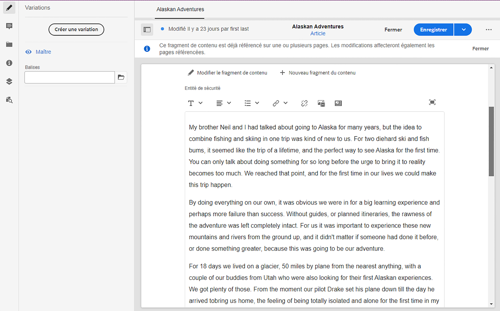
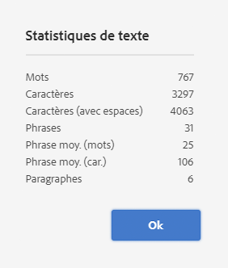
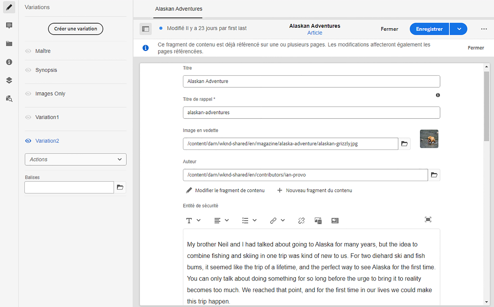

# Variations – création de contenu de fragment{#variations-authoring-fragment-content}

<!--
>[!CAUTION]
>
>Certain features for Content Fragments will be released in early 2021.
>
>The related documentation is already available for preview purposes.
>
>Please see the [Release Notes](/help/release-notes/release-notes-cloud/release-notes-current.md) for further details.
-->

Les [variations](/help/assets/content-fragments/content-fragments.md#constituent-parts-of-a-content-fragment) sont une fonction importante des fragments de contenu, car elles permettent de créer et de modifier des copies du contenu maître pour une utilisation sur des canaux spécifiques et/ou dans des cas spécifiques.

À partir de l’onglet **variations**, vous pouvez :

* [saisir le contenu](#authoring-your-content) de votre fragment ;,
* [Créez et gérez ](#managing-variations) des variantes du  **** contenu maître,
* Voir le nom du [modèle de fragment de contenu](/help/assets/content-fragments/content-fragments-models.md) utilisé pour créer le fragment ; s’affiche dans la barre d’outils supérieure, sous le nom du fragment.

Vous pouvez effectuer diverses autres actions selon le type de données que vous modifiez ; par exemple :

* [Insertion de ressources visuelles dans votre fragment](#inserting-assets-into-your-fragment) (images)

* Sélection entre [Texte enrichi](#rich-text), [Texte brut](#plain-text) et [Texte (Markdown)](#markdown) pour la modification

* [Chargement du contenu](#uploading-content)

* [Affichage des statistiques clés](#viewing-key-statistics) (à propos du texte sur plusieurs lignes)

* [Création d’un résumé de texte](#summarizing-text)

* [Synchronisation des variations avec le contenu maître](#synchronizing-with-master)

>[!CAUTION]
>
>Une fois qu’un fragment a été publié et/ou référencé, AEM affiche un avertissement lorsqu’un auteur ouvre à nouveau ce fragment en mode d’édition. Il s’agit de signaler que les modifications apportées au fragment seront également répercutées sur les pages référencées.

## Création de contenu {#authoring-your-content}

Lorsque vous ouvrez votre fragment de contenu pour le modifier, l’onglet **Variations** est ouvert par défaut. Vous pouvez y saisir le contenu, pour le maître ou toutes les variations de votre choix. Le fragment structuré contient divers champs, de différents types de données, qui ont été définis dans le modèle de contenu.

Vous pouvez :

* effectuer des modifications directement dans l’onglet **Variations** ;

   * chaque type de données propose différentes options de modification

* pour les champs **Texte à plusieurs lignes**, vous pouvez également ouvrir l&#39;[éditeur en plein écran](#full-screen-editor) pour :

   * sélectionner le [format](#formats) ;
   * voir davantage d’options de modification (pour le format [Texte enrichi](#rich-text)) ;
   * accéder à un éventail d’[actions](#actions).

<!--
For example:

-->

### Éditeur plein écran {#full-screen-editor}

Lors de la modification d’un champ de texte multiligne, vous pouvez ouvrir l’éditeur en plein écran ; appuyez ou cliquez dans le texte réel, puis sélectionnez l’icône d’action suivante :

<!--
This will open the full screen text editor:

-->

L’éditeur de texte en plein écran fournit les éléments suivants :

* l’accès à diverses [actions](#actions) ;
* selon le [format](#formats), des options de mise en forme supplémentaires ([texte enrichi](#rich-text)).

### Actions   {#actions}

Les actions suivantes sont également disponibles (pour tous les [formats](#formats)) lorsque l’éditeur plein écran (c’est-à-dire pour le texte sur plusieurs lignes) est ouvert :

* Sélection du [format](#formats) ([Texte enrichi](#rich-text), [Texte brut](#plain-text) ou [Texte (Markdown](#markdown)))

* [Chargement du contenu](#uploading-content)

* [Affichage des statistiques de texte](#viewing-key-statistics)

* [Synchronisation avec le gabarit](#synchronizing-with-master) (lors de la modification d’une variation)

* [Création d’un résumé de texte](#summarizing-text)

### Formats {#formats}

Les options de modification du texte sur plusieurs lignes dépendent du format sélectionné :

* [Texte enrichi](#rich-text)
* [Texte brut](#plain-text)
* [Texte (Markdown)](#markdown)

Le format peut être sélectionné dans l’éditeur plein écran.

### Texte enrichi {#rich-text}

L’édition de texte enrichi vous permet les mises en forme suivantes :

* Gras
* Italique
* Souligné
* Alignement : gauche, centre et droite
* Liste à puces
* Liste numérotée
* Retrait : augmentation et réduction
* Créer/rompre des liens hypertexte
* Coller le texte/à partir de Word
* Insérer un tableau
* Style de paragraphe : paragraphe et en-tête 1/2/3
* [Insérer une ressource](#inserting-assets-into-your-fragment)
* Ouvrez l’éditeur plein écran où les options de mise en forme suivantes sont disponibles :
   * Rechercher
   * Rechercher/remplacer
   * Vérificateur d’orthographe
   * [Annotations](/help/assets/content-fragments/content-fragments-variations.md#annotating-a-content-fragment)

<!--
* [Insert Content Fragment](#inserting-content-fragment-into-your-fragment)
-->

Les [actions](#actions) sont également accessibles à partir de l’éditeur plein écran.

### Texte brut {#plain-text}

Le texte brut permet de saisir du contenu de manière rapide, sans formatage ni Markdown. Vous pouvez également ouvrir l’éditeur plein écran pour accomplir d’autres [actions](#actions).

>[!CAUTION]
>
>Si vous sélectionnez **Texte brut**, vous risquez de perdre le formatage, les annotations et/ou les fichiers que vous avez insérés dans du **texte enrichi** ou dans **Markdown**.

### Texte (Markdown) {#markdown}

>[!NOTE]
>
>Pour plus d’informations, voir la documentation relative à [Markdown](/help/assets/content-fragments/content-fragments-markdown.md).

Cela vous permet de mettre en forme le texte à l’aide de Markdown. Vous pouvez définir :

* En-têtes
* Paragraphes et sauts de ligne
* Liens
* Images
* Blocs de citations
* Listes
* Accent
* Blocs de code
* Échappements par barre oblique inverse

Vous pouvez également ouvrir l’éditeur plein écran pour accomplir d’autres [actions](#actions).

>[!CAUTION]
>
>Si vous basculez entre **Texte enrichi** et **Texte (Markdown)**, des effets inattendus peuvent apparaître avec les Blocs de citations et Blocs de code, dans la mesure où le traitement de ces deux formats peut être différent.

<!--
### Fragment References {#fragment-references}

If the Content Fragment Model contains Fragment References, your fragment authors may have additional options:

* [Edit Content Fragment](#fragment-references-edit-content-fragment)
* [New Content Fragment](#fragment-references-new-content-fragment)

#### Edit Content Fragment {#fragment-references-edit-content-fragment}

The option **Edit Content Fragment** will open
a new browser tab, with the content fragment open in the content fragment editor.

#### New Content Fragment {#fragment-references-new-content-fragment}

The option **New Content Fragment** will allow you to create a completely new fragment. To achieve this a variation of the create content fragment wizard will open in the editor. 

You will then be able to create a new fragment by:

1. Navigating to, and selecting the required folder.
1. Selecting **Next**.
1. Specifying properties; for example **Title**.
1. Selecting **Create**.
1. Finally:
   1. **Done** will return (to the original fragment) and reference the new fragment.
   1. **Open** will reference the new fragment as well as opening the new fragment, for editing, in a new browser tab.
-->

### Affichage des statistiques clés {#viewing-key-statistics}

Lorsque l’éditeur plein écran est ouvert, l’action **Statistiques de texte** affiche différentes informations au sujet du texte.

Par exemple :

### Chargement de contenu {#uploading-content}

Pour simplifier le processus de création de fragments de contenu, vous pouvez transférer du texte préparé dans un éditeur externe et l’ajouter directement au fragment.

### Résumé de texte {#summarizing-text}

Le résumé de texte est conçu pour aider les utilisateurs à réduire la longueur de leur texte à un nombre prédéfini de mots tout en conservant les éléments clés et la signification globale.

>[!NOTE]
>
>À un niveau plus technique, le système conserve les phrases qu’il évalue comme ayant le *meilleur rapport de densité et d’unicité des informations* selon des algorithmes spécifiques.

>[!CAUTION]
>
>Le fragment de contenu doit posséder un dossier de langue valide (code ISO) en tant qu’ancêtre ; celui-ci permet de déterminer le modèle de langue à utiliser.
>
>Par exemple, `en/` comme dans le chemin d’accès suivant :
>
>  `/content/dam/my-brand/en/path-down/my-content-fragment`

>[!CAUTION]
L’anglais est disponible par défaut.
D’autres langues sont disponibles en tant que modules de modèle de langues dans Package Share :
* [Français (fr)](https://www.adobeaemcloud.com/content/marketplace/marketplaceProxy.html?packagePath=/content/companies/public/adobe/packages/cq630/product/smartcontent-model-fr)
* [Allemand (de)](https://www.adobeaemcloud.com/content/marketplace/marketplaceProxy.html?packagePath=/content/companies/public/adobe/packages/cq630/product/smartcontent-model-de)
* [Italien (it)](https://www.adobeaemcloud.com/content/marketplace/marketplaceProxy.html?packagePath=/content/companies/public/adobe/packages/cq630/product/smartcontent-model-it)
* [Espagnol (es)](https://www.adobeaemcloud.com/content/marketplace/marketplaceProxy.html?packagePath=/content/companies/public/adobe/packages/cq630/product/smartcontent-model-es)

1. Sélectionnez **Maître** ou la variante requise.
1. Ouvrez l’éditeur plein écran.

1. Sélectionnez **Résumer le texte** dans la barre d’outils.

   

1. Spécifiez le nombre de mots cible et sélectionnez **Démarrer** :
1. Le texte d’origine s’affiche à côté du résumé proposé :

   * Toutes les phrases à éliminer sont biffées en rouge.
   * Cliquez sur n’importe quelle phrase en surbrillance pour la conserver dans le contenu résumé.
   * Cliquez sur n’importe quelle phrase qui ne figure pas en surbrillance pour l’éliminer.

1. Sélectionnez **Résumer** pour confirmer les modifications.

<!--
1. The original text is displayed side-by-side with the proposed summarization:

    * Any sentences to be eliminated are highlighted in red, with strike-through.
    * Click on any highlighted sentence to keep it in the summarized content.
    * Click on any non-highlighted sentence to have it eliminated.

   
-->

### Annotation d’un fragment de contenu {#annotating-a-content-fragment}

Pour annoter un fragment :

1. Sélectionnez **Maître** ou la variante requise.
1. Ouvrez l’éditeur plein écran.
1. L&#39;icône **Annoter** est disponible dans la barre d&#39;outils supérieure. Vous pouvez sélectionner du texte si nécessaire.

1. Une boîte de dialogue s’ouvre. Vous pouvez y saisir votre annotation.

   

1. Sélectionnez **Appliquer** dans la boîte de dialogue.

   

   Si l&#39;annotation a été appliquée au texte sélectionné, ce texte reste en surbrillance.

   

1. Fermez l’éditeur plein écran, les annotations sont toujours mises en surbrillance. Si cette option est sélectionnée, une boîte de dialogue s’ouvre pour vous permettre de modifier davantage l’annotation.

1. Sélectionnez **Enregistrer**.

<!--
1. The **Annotate** icon is available in the top toolbar. You can seelect some text if required.

   
-->

<!--
1. Close the full-screen editor, annotations are still highlighted. If selected, a dialog will open so that you can edit the annotation further.

   

-->

### Affichage, modification et suppression d’annotations {#viewing-editing-deleting-annotations}

Les annotations :

* Sont mise en surbrillance sur le texte, en mode plein écran et en mode normal de l’éditeur. Les détails complets d’une annotation peuvent être affichés, modifiés et/ou supprimés en cliquant sur le texte mis en surbrillance, ce qui rouvre la boîte de dialogue.

   >[!NOTE]
   Un sélecteur en liste déroulante est fourni si plusieurs annotations ont été appliquées à une partie du texte.

* Lorsque vous supprimez tout le texte auquel l’annotation a été appliquée, cette dernière est également supprimée.

* Peuvent être répertoriées et supprimées en sélectionnant l’onglet **Annotations** dans l’éditeur de fragments.

* Peuvent être affichées et supprimées dans la [chronologie](/help/assets/content-fragments/content-fragments-managing.md#timeline-for-content-fragments) pour le fragment sélectionné.

<!--
* Can be listed, and deleted, by selecting the **Annotations** tab in the fragment editor.

  
-->

### Insertion de ressources dans votre fragment {#inserting-assets-into-your-fragment}

Pour simplifier le processus de création de fragments de contenu, vous pouvez ajouter directement des [Ressources](/help/assets/manage-digital-assets.md) (images) au fragment.

Elles seront ajoutées à la séquence de paragraphes du fragment sans aucune mise en forme ; la mise en forme peut être effectuée lorsque le [fragment est utilisé/référencé sur une page](/help/sites-cloud/authoring/fundamentals/content-fragments.md).

>[!CAUTION]
Ces ressources ne peuvent pas être déplacées ni supprimées sur une page de référence ; ce type d’opération doit être effectué dans l’éditeur de fragment.
Toutefois, la mise en forme de la ressource (par exemple, sa taille) doit être effectuée dans l’[éditeur de page](/help/sites-cloud/authoring/fundamentals/content-fragments.md). La représentation de la ressource dans l’éditeur de fragment est uniquement destinée à la création du flux de contenu.

>[!NOTE]
Il existe différentes méthodes pour ajouter des [images](/help/assets/content-fragments/content-fragments.md#fragments-with-visual-assets) au fragment et/ou à la page.

1. Placez le curseur à l’endroit où vous souhaitez ajouter l’image.
1. Utilisez l’icône **Insérer une ressource** pour ouvrir la boîte de dialogue de recherche.

   

1. Dans la boîte de dialogue, vous pouvez effectuer l’une des opérations suivantes :

   * Accéder à la ressource souhaitée dans la gestion des actifs numériques
   * Rechercher la ressource dans la gestion des actifs numériques

   Une fois la ressource souhaitée localisée, sélectionnez-la en cliquant sur la miniature.

1. Utilisez **Sélectionner** pour ajouter le fichier au système de paragraphes de votre fragment de contenu à l’emplacement actuel.

   >[!CAUTION]
   Si, après l’ajout d’un fichier, vous modifiez le format en :
   * **Texte brut** : le fichier sera complètement perdu du fragment.
   * **Markdown** : le fichier ne sera pas visible, mais il sera toujours présent lorsque vous reviendrez au **texte enrichi**.

<!--
### Inserting a Content Fragment into your Fragment {#inserting-content-fragment-into-your-fragment}

To ease the process of authoring content fragments you can also add another Content Fragment to your fragment.

They will be added as a reference, in your current location in your fragment.
-->

<!--
>[!CAUTION]
>
>These assets cannot be moved or deleted on a referencing page, this must be done in the fragment editor.
>
>However, formatting of the asset (e.g. size) must be done in the [page editor](/help/sites-cloud/authoring/fundamentals/content-fragments.md). The representation of the asset in the fragment editor is purely for authoring the content flow.

>[!NOTE]
>
>There are various methods of adding [images](/help/assets/content-fragments/content-fragments.md#fragments-with-visual-assets) to the fragment and/or page.
-->

<!--
1. Position the cursor at the position you want to add the fragment.
1. Use the **Insert Content Fragment** icon to open the search dialog.

   

1. In the dialog you can either:

    * navigate to the required fragment in the Assets folder
    * search for the fragment

   Once located, select the required fragment by clicking on the thumbnail.

1. Use **Select** to add a reference to the selected Content Fragment to your current content fragment (at the current location).

   >[!CAUTION]
   >
   >If, after adding an reference to another fragment, you change format to:
   >* **Plain Text**: the reference will be completely lost from the fragment.
   >* **Markdown**: the reference will remain.
-->

## Gestion des variations   {#managing-variations}

### Création d’une variation {#creating-a-variation}

Les variations permettent de faire varier le contenu **Maître** en fonction de vos besoins, le cas échéant.

Pour créer une variation, procédez comme suit :

1. Ouvrez votre fragment et assurez-vous que le panneau latéral est visible.
1. Sélectionnez **Variations** dans la barre d’icônes du panneau latéral.
1. Sélectionnez **Créer une variation**.
1. Une boîte de dialogue s’ouvre. Spécifiez le **titre** et la **description** correspondant à la nouvelle variante.
1. Sélectionnez **Ajouter** et le **Gabarit**[ du fragment sera copié dans la nouvelle variation, qui est maintenant ouverte pour modification](#editing-a-variation).

   >[!NOTE]
   Lors de la création d’une variation, c’est toujours le **Maître** qui est copié et non pas la variation ouverte.

### Modification d’une variation   {#editing-a-variation}

Vous pouvez apporter des modifications au contenu de la variation après avoir :

* [Créé votre variation](#creating-a-variation).
* Ouvert un fragment existant, puis sélectionné la variation requise dans le panneau latéral.

### Modification du nom d’une variation {#renaming-a-variation}

Pour renommer une variation existante :

1. Ouvrez votre fragment et sélectionnez **Variations** dans le panneau latéral.
1. Sélectionnez la variation requise.
1. Sélectionnez **Renommer** dans le menu déroulant **Actions**.

1. Saisissez le nouveau **Titre** et/ou la nouvelle **Description** dans la boîte de dialogue qui s’affiche.

1. Confirmez l’action **Renommer**.

>[!NOTE]
Cette opération concerne uniquement le **Titre** de la variation.

### Suppression d’une variation   {#deleting-a-variation}

Pour supprimer une variation existante :

1. Ouvrez votre fragment et sélectionnez **Variations** dans le panneau latéral.
1. Sélectionnez la variation requise.
1. Sélectionnez **Supprimer** dans le menu déroulant **Actions**.

1. Confirmez l’action **Supprimer** dans la boîte de dialogue.

>[!NOTE]
Vous ne pouvez pas supprimer le **Maître**.

### Synchronisation avec le maître {#synchronizing-with-master}

Le **Maître** fait partie intégrante d’un fragment de contenu et, par définition, il contient la copie maître du contenu, tandis que les variations contiennent les versions individuelles et personnalisées de ce contenu. Lorsque le Maître est mis à jour, il est possible que ces modifications soient également liées aux variations et qu’elles doivent, par conséquent, être appliquées à celles-ci.

Lors de la modification d’une variation, vous pouvez accéder à l’action de synchronisation de l’élément actuel de la variation avec le maître. Vous pouvez ainsi copier automatiquement les modifications apportées au Maître sur la variation requise.

>[!CAUTION]
La synchronisation n’est disponible que pour copier les modifications *du **Maître**dans la variation*.
Seul l’élément actuel de la variation est synchronisé.
La synchronisation fonctionne uniquement sur le type de données **Plusieurs lignes de texte**.
Le transfert des modifications n’est pas proposé *entre une variation et le **Maître***.

1. Ouvrez votre fragment de contenu dans l’éditeur de fragments. Assurez-vous que le **Maître** a été modifié.
1. Sélectionnez une variation spécifique, puis l’action de synchronisation appropriée à partir soit :

   * du menu déroulant du sélecteur **Actions** – **Synchroniser l’élément actif avec le gabarit** ;

   * de la barre d’outils de l’éditeur plein écran – **Synchroniser avec le gabarit**.

      

1. Le maître et la variation seront affichés côte à côte :

   * le contenu ajouté figure en vert  (ajouté à la variation) ;
   * le contenu supprimé (de la variation) figure en rouge.
   * le texte remplacé apparaît en bleu

   

1. Sélectionnez **Synchroniser**. La variation est alors mise à jour et affichée.

<!--
1. Select a specific variation, then the appropriate synchronization action from either:

   * the **Actions** drop down selector - **Sync current element with master**

      

   * the toolbar of the full-screen editor - **Sync with master**

      

1. Master and the variation will be shown side-by-side:

   * green indicates content added (to the variation)
   * red indicates content removed (from the variation)
   * blue indicates replaced text

   

1. Select **Synchronize**, the variation will updated and shown.

-->