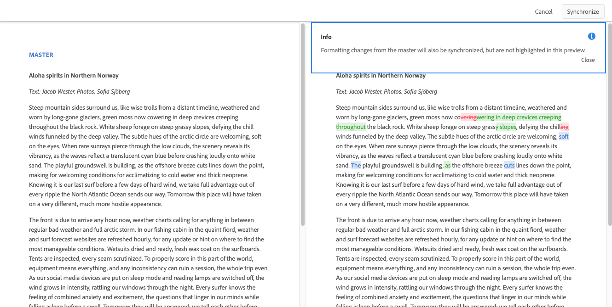

# Variations – création de contenu de fragment{#variations-authoring-fragment-content}

Les [variations](/help/assets/content-fragments/content-fragments.md#constituent-parts-of-a-content-fragment) sont une fonction importante des fragments de contenu, car elles permettent de créer et de modifier des copies du contenu maître pour une utilisation sur des canaux spécifiques et/ou dans des cas spécifiques.

À partir de l’onglet **variations**, vous pouvez :

* [saisir le contenu](#authoring-your-content) de votre fragment ;
* [créer et gérer les variations](#managing-variations) du contenu **maître**.

Vous pouvez effectuer diverses autres actions selon le type de données que vous modifiez ; par exemple :

* [Insertion de ressources visuelles dans votre fragment](#inserting-assets-into-your-fragment) (images)

* Sélection entre [Texte enrichi](#rich-text), [Texte brut](#plain-text) et [Texte (Markdown)](#markdown) pour la modification

* [Transfert du contenu](#uploading-content)

* [Affichage des statistiques clés](#viewing-key-statistics) (à propos du texte sur plusieurs lignes)

* [Création d’un résumé de texte](#summarizing-text)

* [Synchronisation des variations avec le contenu maître](#synchronizing-with-master)

>[!CAUTION]
>
>Une fois qu’un fragment a été publié et/ou référencé, AEM affiche un avertissement lorsqu’un auteur ouvre à nouveau ce fragment en mode d’édition. Il s’agit de signaler que les modifications apportées au fragment seront répercutées sur les pages référencées.

## Création de contenu {#authoring-your-content}

Lorsque vous ouvrez votre fragment de contenu pour le modifier, l’onglet **Variations** est ouvert par défaut. Vous pouvez y saisir le contenu, pour le maître ou toutes les variations de votre choix. Vous pouvez :

* effectuer des modifications directement dans l’onglet **Variations** ;
* ouvrir l’[éditeur plein écran](#full-screen-editor) afin de :

   * sélectionner le [format](#formats) ;
   * voir davantage d’options de modification (pour le format [Texte enrichi](#rich-text)) ;

   * accéder à un éventail d’[actions.](#actions)

Par exemple :

* Modification d’un fragment simple

   Un fragment simple se compose d’un champ de texte multiligne (les ressources visuelles peuvent être ajoutées à partir de l’éditeur plein écran).

   

* Modification d’un fragment avec du contenu structuré

   Un fragment structuré contient différents champs, avec divers types de données, qui ont été définis dans le modèle de contenu. L’[éditeur plein écran](#full-screen-editor) est disponible pour tous les champs à plusieurs lignes.

   

### Éditeur plein écran {#full-screen-editor}

Lors de la modification d’un champ de texte multiligne, vous pouvez ouvrir l’éditeur en plein écran ; appuyez ou cliquez dans le texte réel, puis sélectionnez l’icône d’action suivante :

L’éditeur plein écran fournit :

* l’accès à diverses [actions](#actions) ;
* selon le [format](#formats), des options de mise en forme supplémentaires ([texte enrichi](#rich-text)).

### Actions {#actions}

Les actions suivantes sont également disponibles (pour tous les [formats](#formats)) lorsque l’éditeur plein écran (c’est-à-dire pour le texte sur plusieurs lignes) est ouvert :

* Sélection du [format](#formats) ([Texte enrichi](#rich-text), [Texte brut](#plain-text) ou [Texte (Markdown](#markdown))).

* [Téléchargement du contenu](#uploading-content)

* [Annotez](/help/assets/content-fragments/content-fragments-variations.md#annotating-a-content-fragment) votre texte

* [Insertion de ressources visuelles dans votre fragment](#inserting-assets-into-your-fragment) (images)

* [Affichage des statistiques de texte](#viewing-key-statistics)

* [Synchronisation avec le maître](#synchronizing-with-master) (lors de la modification d’une variation)

* [Création d’un résumé de texte](#summarizing-text)

### Formats {#formats}

Les options de modification du texte sur plusieurs lignes dépendent du format sélectionné :

* [Texte enrichi](#rich-text)
* [Texte brut](#plain-text)
* [Texte (Markdown)](#markdown)

Le format peut être sélectionné dans l’éditeur plein écran.

### Texte enrichi {#rich-text}

L’édition de texte enrichi vous permet les mises en forme suivantes :

* Gras
* Italique
* Souligné
* Alignement : gauche, centre et droite
* Liste à puces
* Liste numérotée
* Retrait : augmentation et réduction
* Créer/rompre des liens hypertexte
* Ouvrez l’éditeur plein écran où les options de mise en forme suivantes sont disponibles :

   * Coller le texte/à partir de Word
   * Insérer un tableau
   * Style de paragraphe : paragraphe et en-tête 1/2/3 
   * [Insérer des ressources visuelles](#inserting-assets-into-your-fragment)
   * Rechercher
   * Rechercher/remplacer
   * Vérificateur d’orthographe
   * [Annotations](/help/assets/content-fragments/content-fragments-variations.md#annotating-a-content-fragment)

Les [actions](#actions) sont également accessibles à partir de l’éditeur plein écran.

### Texte brut {#plain-text}

Le texte brut permet de saisir du contenu de manière rapide, sans formatage ni Markdown. Vous pouvez également ouvrir l’éditeur plein écran pour accomplir d’autres [actions](#actions).

>[!CAUTION]
>
>Si vous sélectionnez **Texte brut**, vous risquez de perdre la mise en forme, le texte (Markdown) et/ou les ressources que vous avez insérés dans **Texte enrichi** ou **Texte (Markdown)**.

### Texte (Markdown){#markdown}

>[!NOTE]
>
>Pour plus d’informations, voir la documentation relative à [Markdown](/help/assets/content-fragments/content-fragments-markdown.md).

Cela vous permet de mettre en forme le texte à l’aide de Markdown. Vous pouvez définir :

* En-têtes
* Paragraphes et sauts de ligne
* Liens
* Images
* Blocs de citations
* Listes
* Accentuation
* Blocs de code
* Échappements par barre oblique inverse

Vous pouvez également ouvrir l’éditeur plein écran pour accomplir d’autres [actions](#actions).

>[!CAUTION]
>
>If you switch between **Rich Text** and **Markdown** you might experience unexpected effects with Block Quotes and Code Blocks, as these two formats can have differences in how they are handled.

### Affichage des statistiques clés {#viewing-key-statistics}

Lorsque l’éditeur plein écran est ouvert, l’action **Statistiques de texte** affiche différentes informations au sujet du texte.

Par exemple :

### Téléchargement de contenu {#uploading-content}

Pour simplifier le processus de création de fragments de contenu, vous pouvez transférer du texte préparé dans un éditeur externe et l’ajouter directement au fragment. 

### Résumé de texte {#summarizing-text}

Le résumé de texte est conçu pour aider les utilisateurs à réduire la longueur de leur texte à un nombre prédéfini de mots tout en conservant les éléments clés et la signification globale.

>[!NOTE]
>
>On a more technical level the system keeps the sentences which it rates as providing the *best ratio of information density and uniqueness* according to specific algorithms.

>[!CAUTION]
>
>Le fragment de contenu doit avoir un dossier de langue valide (code ISO) comme ancêtre ; il est utilisé pour déterminer le modèle de langue à utiliser.
>
>For example, `en/` as in the following path:
>
>  `/content/dam/my-brand/en/path-down/my-content-fragment`

>[!CAUTION]
L’anglais est disponible par défaut.
D’autres langues sont disponibles en tant que modules de modèle de langues dans Package Share :
* [Français (fr)](https://www.adobeaemcloud.com/content/marketplace/marketplaceProxy.html?packagePath=/content/companies/public/adobe/packages/cq630/product/smartcontent-model-fr)
* [Allemand (de)](https://www.adobeaemcloud.com/content/marketplace/marketplaceProxy.html?packagePath=/content/companies/public/adobe/packages/cq630/product/smartcontent-model-de)
* [Italien (it)](https://www.adobeaemcloud.com/content/marketplace/marketplaceProxy.html?packagePath=/content/companies/public/adobe/packages/cq630/product/smartcontent-model-it)
* [Espagnol (es)](https://www.adobeaemcloud.com/content/marketplace/marketplaceProxy.html?packagePath=/content/companies/public/adobe/packages/cq630/product/smartcontent-model-es)

1. Sélectionnez **Maître** ou la variante requise.
2. Ouvrez l’éditeur plein écran.

3. Sélectionnez **Résumer le texte** dans la barre d’outils.

   

4. Spécifiez le nombre de mots cible et sélectionnez **Démarrer** :
5. Le texte d’origine s’affiche à côté du résumé proposé :

   * Toutes les phrases à éliminer sont biffées en rouge.
   * Cliquez sur n’importe quelle phrase en surbrillance pour la conserver dans le contenu résumé.
   * Cliquez sur n’importe quelle phrase qui ne figure pas en surbrillance pour l’éliminer.
   

6. Select **Summarize** to confirm the changes.

### Annotation d’un fragment de contenu {#annotating-a-content-fragment}

Pour annoter un fragment :

1. Sélectionnez **Maître** ou la variante requise.
1. Ouvrez l’éditeur plein écran.
1. Sélectionnez du texte. L’icône **Annoter** devient disponible.

   

1. Une boîte de dialogue s’ouvre. Vous pouvez y saisir votre annotation.

1. Fermez l’éditeur plein écran et **enregistrez** le fragment.

### Affichage, modification et suppression d’annotations {#viewing-editing-deleting-annotations}

Les annotations :

* Sont mise en surbrillance sur le texte, en mode plein écran et en mode normal de l’éditeur. Les détails complets d’une annotation peuvent être affichés, modifiés et/ou supprimés en cliquant sur le texte mis en surbrillance, ce qui rouvre la boîte de dialogue.

   >[!NOTE]
   Un sélecteur en liste déroulante est fourni si plusieurs annotations ont été appliquées à une partie du texte.

* Lorsque vous supprimez tout le texte auquel l’annotation a été appliquée, l’annotation est également supprimée.

* Peuvent être répertoriées et supprimées en sélectionnant l’onglet **Annotations** dans l’éditeur de fragments.

   

* Peuvent être affichées et supprimées dans la [chronologie](/help/assets/content-fragments/content-fragments-managing.md#timeline-for-content-fragments) pour le fragment sélectionné.

### Insertion de ressources dans votre fragment {#inserting-assets-into-your-fragment}

To ease the process of authoring content fragments you can add [Assets](/help/assets/manage-digital-assets.md) (images) directly to the fragment.

Elles seront ajoutées à la séquence de paragraphes du fragment sans aucune mise en forme ; la mise en forme peut être effectuée lorsque le [fragment est utilisé/référencé sur une page](/help/sites-cloud/authoring/fundamentals/content-fragments.md).

>[!CAUTION]
Ces ressources ne peuvent pas être déplacées ni supprimées sur une page de référence ; ce type d’opération doit être effectué dans l’éditeur de fragment.
Toutefois, la mise en forme de la ressource (par exemple, sa taille) doit être effectuée dans l’[éditeur de page](/help/sites-cloud/authoring/fundamentals/content-fragments.md). La représentation de la ressource dans l’éditeur de fragment est uniquement destinée à la création du flux de contenu.

>[!NOTE]
Il existe différentes méthodes pour ajouter des [images](/help/assets/content-fragments/content-fragments.md#fragments-with-visual-assets) au fragment et/ou à la page.

1. Placez le curseur à l’endroit où vous souhaitez ajouter l’image.
2. Use the **Insert Asset** icon to open the search dialog.

   

3. Dans la boîte de dialogue, vous pouvez effectuer l’une des opérations suivantes :

   * Accéder à la ressource souhaitée dans la gestion des actifs numériques
   * Rechercher la ressource dans la gestion des actifs numériques
   Une fois la ressource souhaitée localisée, sélectionnez-la en cliquant sur la miniature.

4. Utilisez **Sélectionner** pour ajouter la ressource au système de paragraphe de votre fragment de contenu à la position actuelle.

   >[!CAUTION]
   Si, après avoir ajouté une ressource, vous définissez le format sur :
   * **Texte brut** : la ressource est complètement effacée du fragment.
   * **Texte (Markdown)** : la ressource n’est pas visible, mais elle est toujours présente lorsque vous revenez au paramètre **Texte enrichi**.

## Gestion des variations {#managing-variations}

### Création d’une variation {#creating-a-variation}

Les variations permettent de faire varier le contenu **Maître** en fonction de vos besoins, le cas échéant.

Pour créer une variation, procédez comme suit :

1. Ouvrez votre fragment et assurez-vous que le panneau latéral est visible.
1. Select **Variations** from the icon bar in the side panel.
1. Sélectionnez **Créer une variation**.
1. Une boîte de dialogue s’ouvre alors. Indiquez le **Titre** et la **Description** de la nouvelle variation.
1. Sélectionnez **Ajouter** et le **Maître**[ du fragment sera copié dans la nouvelle variation, qui est maintenant ouverte pour modification](#editing-a-variation).

   >[!NOTE]
   Lors de la création d’une variation, c’est toujours le **Maître** qui est copié et non pas la variation ouverte.

### Modification d’une variation {#editing-a-variation}

Vous pouvez apporter des modifications au contenu de la variation après avoir :

* [Créé votre variation](#creating-a-variation).
* Ouvert un fragment existant, puis sélectionné la variation requise dans le panneau latéral.

### Modification du nom d’une variation {#renaming-a-variation}

Pour renommer une variation existante :

1. Open your fragment and select **Variations** from the side panel.
1. Sélectionnez la variation requise.
1. Select **Rename** from the **Actions** drop down.

1. Enter the new **Title** and/or **Description** in the resulting dialog box.

1. Confirmez l’action **Renommer**.

>[!NOTE]
Cette opération concerne uniquement le **Titre** de la variation.

### Suppression d’une variation {#deleting-a-variation}

Pour supprimer une variation existante :

1. Open your fragment and select **Variations** from the side panel.
1. Sélectionnez la variation requise.
1. Select **Delete** from the **Actions** drop down.

1. Confirmez l’action **Supprimer** dans la boîte de dialogue.

>[!NOTE]
You cannot delete **Master**.

### Synchronisation avec le Maître {#synchronizing-with-master}

Le **Maître** fait partie intégrante d’un fragment de contenu et, par définition, il contient la copie maître du contenu, tandis que les variantes contiennent les versions individuelles et personnalisées de ce contenu. Lorsque le Maître est mis à jour, il est possible que ces modifications soient également liées aux variations et qu’elles doivent, par conséquent, être appliquées à celles-ci.

Lors de la modification d’une variation, vous pouvez accéder à l’action de synchronisation de l’élément actuel de la variation avec le maître. Vous pouvez ainsi copier automatiquement les modifications apportées au Maître sur la variation requise.

>[!CAUTION]
La synchronisation permet seulement de copier les modifications *du **Maître**vers la variation*.
Seul l’élément actuel de la variation est synchronisé.
La synchronisation fonctionne uniquement sur le type de données texte **** multiligne.
Le transfert des modifications n’est pas proposé entre *entre une variante et le **Maître ***.

1. Ouvrez votre fragment de contenu dans l’éditeur de fragments. Assurez-vous que le **Maître** a été modifié.
1. Sélectionnez une variation spécifique, puis l’action de synchronisation appropriée à partir soit :

   * the **Actions** drop down selector - **Sync current element with master**

   * de la barre d’outils de l’éditeur plein écran – **Synchroniser avec le gabarit**.

1. Le Maître et la variation seront affichés côte à côte :

   * le contenu ajouté figure en vert  (ajouté à la variation) ;
   * le contenu supprimé (de la variation) figure en rouge.
   * bleu indique le texte remplacé
   

1. Sélectionnez **Synchroniser**. La variation est alors mise à jour et affichée.
