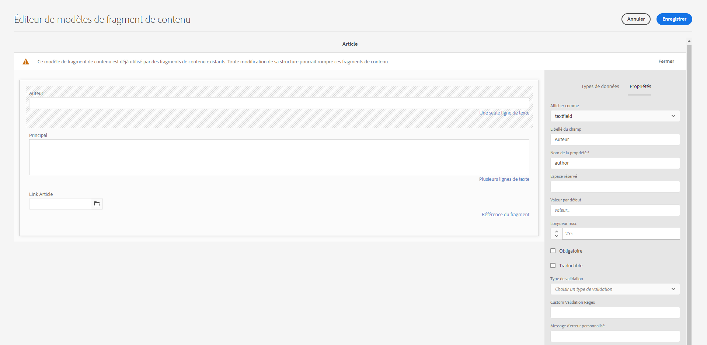

# aem API GraphQL à utiliser avec les fragments de contenu {#graphql-api-for-use-with-content-fragments}

>[!CAUTION]
>
>L’AEM API GraphQL, pour Content Fragment Diffusion, sera disponible début 2021.
>
>La documentation correspondante est déjà disponible à des fins de prévisualisation.

L’API Adobe Experience Manager en tant que Cloud Service (AEM) GraphQL utilisée avec Content Fragments repose principalement sur l’API GraphQL Open Source standard.

L’utilisation de l’API GraphQL dans AEM permet la diffusion efficace des fragments de contenu aux clients JavaScript dans les implémentations CMS sans affichage :

* Éviter les demandes d&#39;API itératives comme avec REST,
* veiller à ce que la diffusion soit limitée aux exigences spécifiques,
* Permet la diffusion en bloc de ce qui est exactement nécessaire pour le rendu en réponse à une seule requête d’API.

## API GraphQL {#graphql-api}

*&quot;GraphQL est un langage et une spécification de requête de données développé en interne par Facebook en 2012 avant d&#39;être ouvert au public en 2015. Il offre une alternative aux architectures basées sur le REST dans le but d&#39;accroître la productivité des développeurs et de minimiser les quantités de données transférées. GraphQL est utilisé en production par des centaines d&#39;organisations de toutes tailles...&quot;* Voir [GraphQL Foundation](https://foundation.graphql.org/).

Pour plus d’informations sur l’API GraphQL, voir les sections suivantes (entre autres ressources) :

* [graphql.org](https://graphql.org) :

   * [Présentation de GraphQL](https://graphql.org/learn)

   * [Spécification GraphQL](http://spec.graphql.org/)

* [graphql.com](https://graphql.com) :

   * [Guides](https://www.graphql.com/guides/)

   * [Tutoriels](https://www.graphql.com/tutorials/)

   * [Études de cas](https://www.graphql.com/case-studies/)

La valeur GraphQL pour l’implémentation AEM est basée sur la bibliothèque Java GraphQL standard. Voir :

* [graphQL.org - Java](https://graphql.org/code/#java)

* [Java GraphQL sur GitHub](https://github.com/graphql-java)

## Interface GraphiQL {#graphiql-interface}

L&#39;API Graph d&#39;AEM inclut une implémentation de l&#39;interface [GraphiQL](https://graphql.org/learn/serving-over-http/#graphiql) standard. Cela vous permet de saisir directement et de tester les requêtes.

Par exemple :

* `http://localhost:4502/content/graphiql.html`

Il fournit des fonctionnalités telles que la mise en surbrillance de la syntaxe, la saisie semi-automatique et la suggestion automatique, ainsi qu’un historique et une documentation en ligne :


## Cas d’utilisation pour les Environnements d’auteur et de publication {#use-cases-author-publish-environments}

Les cas d’utilisation peuvent dépendre du type d’AEM en tant qu’environnement Cloud Service :

* Environnement de publication ; utilisé pour :
   * Données de requête pour l’application JS (cas d’utilisation standard)

* Environnement auteur ; utilisé pour :
   * Données de requête à des &quot;fins de gestion de contenu&quot; :
      * GraphQL en AEM en tant que Cloud Service est actuellement une API en lecture seule.
      * L’API REST peut être utilisée pour les opérations CR(u)D.

## Génération de schéma {#schema-generation}

GraphQL est une API fortement typée, ce qui signifie que les données doivent être clairement structurées et organisées par type.

La spécification GraphQL fournit une série de directives sur la création d&#39;une API robuste pour interroger les données sur une certaine instance. Pour ce faire, un client doit récupérer le [Schéma](#schema-generation), qui contient tous les types nécessaires pour une requête.

Pour les fragments de contenu, les schémas GraphQL (structure et types) sont basés sur [Modèles de fragments de contenu](/help/assets/content-fragments/content-fragments-models.md) et leurs types de données.

Par exemple, si un utilisateur a créé un modèle de fragment de contenu appelé `Article`, AEM génère l’objet `article` de type `ArticleModel`. Les champs de ce type correspondent aux champs et aux types de données définis dans le modèle.

1. Un modèle de fragment de contenu :

   

1. Schéma GraphQL correspondant (sortie de la documentation automatique GraphiQL) :
   

   Cela montre que le type généré `ArticleModel` contient plusieurs [champs](#fields).

   * Trois d&#39;entre eux ont été contrôlés par l&#39;utilisateur : `author`, `main` et `linked_article`.

   * Les autres champs ont été automatiquement ajoutés par AEM et représentent des méthodes utiles pour fournir des informations sur un certain fragment de contenu ; dans cet exemple, `_path`, `_metadata`, `_variations`. Ces [champs d&#39;assistance](#helper-fields) sont marqués par un `_` précédent pour distinguer ce qui a été défini par l&#39;utilisateur de ce qui a été généré automatiquement.

1. Après qu’un utilisateur a créé un fragment de contenu basé sur le modèle d’article, il peut être interrogé via GraphQL. Pour obtenir des exemples, reportez-vous à la section [Exemples de Requêtes](/help/assets/content-fragments/content-fragments-graphql-samples.md#graphql-sample-queries) (basée sur un modèle de structure de fragment de contenu [utilisé avec GraphQL](/help/assets/content-fragments/content-fragments-graphql-samples.md#content-fragment-structure-graphql)).

Dans GraphQL pour AEM, le schéma est flexible. Cela signifie qu’il est généré automatiquement chaque fois qu’un modèle de fragment de contenu est créé, mis à jour ou supprimé. Les caches de schéma de données sont également actualisés lorsque vous mettez à jour un modèle de fragment de contenu.

Le service Sites GraphQL écoute (en arrière-plan) toutes les modifications apportées à un modèle de fragment de contenu. Lorsque des mises à jour sont détectées, seule cette partie du schéma est régénérée. Cette optimisation permet de gagner du temps et de garantir la stabilité.

Par exemple, si vous :

1. Installez un package contenant `Content-Fragment-Model-1` et `Content-Fragment-Model-2` :

   1. Les types GraphQL pour `Model-1` et `Model-2` seront générés.

1. Modifiez ensuite `Content-Fragment-Model-2` :

   1. Seul le type `Model-2` GraphQL sera mis à jour.

   1. Alors que `Model-1` restera le même.

>[!NOTE]
>
>Il est important de le noter si vous souhaitez effectuer des mises à jour en masse sur les modèles de fragments de contenu via l’api REST, ou autrement.

Le schéma est desservi par le même point de terminaison que les requêtes GraphQL, le client gérant le fait que le schéma est appelé avec l&#39;extension `GQLschema`. Par exemple, l’exécution d’une requête simple `GET` sur `/content/graphql/endpoint.GQLschema` entraîne la sortie du schéma avec le type de contenu : `text/x-graphql-schema;charset=iso-8859-1`.

## Champs {#fields}

Dans le schéma, il y a des champs individuels, de deux catégories de base :

* Champs que vous générez.

   Une sélection de [types de champs](#field-types) est utilisée pour créer des champs en fonction de la configuration du modèle de fragment de contenu. Les noms des champs proviennent du champ **Nom de la propriété** du **Type de données**.

   * Il existe également la propriété **Render As** à prendre en compte, car les utilisateurs peuvent configurer certains types de données ; par exemple, en tant que texte d’une seule ligne ou de plusieurs champs.

* GraphQL pour AEM génère également un certain nombre de [champs d&#39;aide](#helper-fields).

   Elles servent à identifier un fragment de contenu ou à obtenir plus d’informations sur ce fragment.

### Types de champ {#field-types}

GraphQL pour AEM prend en charge une liste de types. Tous les types de données de modèle de fragment de contenu pris en charge et les types GraphQL correspondants sont représentés :

| Modèle de fragment de contenu - Type de données | Type GraphQL | Description |
|--- |--- |--- |
| Une seule ligne de texte | Chaîne [Chaîne] |  Utilisé pour les chaînes simples telles que les noms d’auteur, les noms d’emplacement, etc. |
| Texte multiligne | Chaîne |  Utilisé pour la sortie de texte, tel que le corps d’un article |
| Nombre |  Flottant, [Float] | Utilisé pour afficher le nombre à virgule flottante et les nombres réguliers |
| Booléen |  Booléen |  Utilisé pour afficher les cases à cocher → simples instructions vrai/faux |
| Date et heure | Calendrier |  Utilisé pour afficher la date et l’heure au format ISO 8086 |
| Énumération |  Chaîne |  Utilisé pour afficher une option à partir d&#39;une liste d&#39;options définies lors de la création du modèle |
|  Balises |  [Chaîne] |  Utilisé pour afficher une liste de chaînes représentant les balises utilisées dans AEM |
| Référence de contenu |  Chaîne |  Utilisé pour afficher le chemin vers un autre fichier dans AEM |
| Référence du fragment |  *Type de modèle* |  Utilisé pour référencer un autre fragment de contenu d&#39;un certain type de modèle, défini lors de la création du modèle |

### Champs de l&#39;assistance {#helper-fields}

Outre les types de données des champs générés par l’utilisateur, GraphQL pour AEM génère également un certain nombre de champs *aide* afin d’identifier un fragment de contenu ou de fournir des informations supplémentaires sur un fragment de contenu.

#### Chemin {#path}

Le champ de chemin est utilisé comme identificateur dans GraphQL. Il représente le chemin d’accès de la ressource Fragment de contenu dans le référentiel AEM. Nous l’avons choisi comme identifiant d’un fragment de contenu, car il :

* est unique dans AEM,
* peut être facilement récupéré.

Le code suivant affiche les chemins de tous les fragments de contenu créés à partir du modèle de fragment de contenu `Person`.

```xml
{
  persons {
    items {
      _path
    }
  }
}
```

Pour récupérer un fragment de contenu unique d’un type spécifique, vous devez également déterminer d’abord son chemin d’accès. par exemple:

```xml
{
    person(_path="/content/dam/path/to/fragment/john-doe") {
        _path
        name
        first-name
    }
}
```

Voir [Exemple de Requête - Un fragment de ville unique](/help/assets/content-fragments/content-fragments-graphql-samples.md#sample-single-city-fragment).

#### Métadonnées {#metadata}

Par le biais de GraphQL, AEM expose également les métadonnées d’un fragment de contenu. Les métadonnées sont les informations qui décrivent un fragment de contenu, comme le titre d’un fragment de contenu, le chemin d’accès à la miniature, la description d’un fragment de contenu, la date de création, entre autres.

Etant donné que les métadonnées sont générées par l’éditeur de Schéma et que, à ce titre, elles ne comportent pas de structure spécifique, le type `TypedMetaData` GraphQL a été implémenté pour exposer les métadonnées d’un fragment de contenu. `TypedMetaData` expose les informations regroupées selon les types scalaires suivants :

| Field (Champ) |
|--- |
| `stringMetadata:[StringMetadata]!` |
| `stringArrayMetadata:[StringArrayMetadata]!` |
| `intMetadata:[IntMetadata]!` |
| `intArrayMetadata:[IntArrayMetadata]!` |
| `floatMetadata:[FloatMetadata]!` |
| `floatArrayMetadata:[FloatArrayMetadata]!` |
| `booleanMetadata:[BooleanMetadata]!` |
| `booleanArrayMetadata:[booleanArrayMetadata]!`  |
| `calendarMetadata:[CalendarMetadata]!` |
| `calendarArrayMetadata:[CalendarArrayMetadata]!` |

Chaque type scalaire représente soit une paire nom-valeur unique, soit un tableau de paires nom-valeur, où la valeur de cette paire est du type dans lequel elle a été regroupée.

Par exemple, si vous souhaitez récupérer le titre d’un fragment de contenu, nous savons que cette propriété est une propriété String, de sorte que nous requêtes toutes les métadonnées String :

Pour requête des métadonnées :

```xml
{
  person(_path: "/content/dam/path/to/fragment/john-doe") {
    _path
    _metadata {
      stringMetadata {
        name
        value
      }
    }
  }
}
```

Vous pouvez vue tous les types GraphQL de métadonnées si vous vue le schéma Generated GraphQL. Tous les types de modèle ont le même `TypedMetaData`.

>[!NOTE]
>
>**Différence entre les métadonnées normales et les métadonnées de tableau**
>Gardez à l’esprit que `StringMetadata` et `StringArrayMetadata` se rapportent tous deux à ce qui est stocké dans le référentiel et non à la façon dont vous les récupérez.
>
>Par exemple, en appelant le champ `stringMetadata`, vous recevriez un tableau de toutes les métadonnées stockées dans le référentiel sous la forme `String` et si vous appelez `stringArrayMetadata`, vous recevriez un tableau de toutes les métadonnées stockées dans le référentiel sous la forme `String[]`.

Voir [Exemple de Requête de métadonnées - Liste des métadonnées pour les prix intitulés GB](/help/assets/content-fragments/content-fragments-graphql-samples.md#sample-metadata-awards-gb).

#### Variations {#variations}

Le champ `_variations` a été implémenté pour simplifier l’interrogation des variations d’un fragment de contenu. Par exemple :

```xml
{
  person(_path: "/content/dam/path/to/fragment/john-doe") {
    _variations
  }
}
```

Voir [Exemple de Requête - Toutes les villes avec une variante nommée ](/help/assets/content-fragments/content-fragments-graphql-samples.md#sample-cities-named-variation).

<!--
## Security Considerations {#security-considerations}
-->

## Variables GraphQL {#graphql-variables}

GraphQL permet de placer des variables dans la requête. Pour plus d’informations, voir la documentation [GraphQL pour GraphiQL](https://graphql.org/learn/queries/#variables).

Par exemple, pour obtenir tous les fragments de contenu de type `Article` présentant une variation spécifique, vous pouvez spécifier la variable `variation` dans GraphiQL :


```xml
### query
query GetArticlesByVariation($variation: String!) {
    articles(variation: $variation) {
        items {
            _path
            author
        }
    }
}
 
### in query variables
{
    "variation": "uk"
}
```

## Directives GraphQL {#graphql-directives}

Dans GraphQL, il existe une possibilité de modifier la requête en fonction de variables, appelées directives GraphQL.

Par exemple, vous pouvez inclure le champ `adventurePrice` dans une requête pour tous les `AdventureModels`, en fonction d&#39;une variable `includePrice`.


```xml
query getAdventureByType($includePrice: Boolean!) {
  adventures {
    items {
      adventureType
      adventurePrice @include(if: $includePrice)
    }
  }
}
 
### in query variables
{
    "includePrice": true
}
```

## Requêtes persistantes (mise en cache) {#persisted-queries-caching}

Après avoir préparé une requête avec une requête de POST, elle peut être exécutée avec une requête de GET qui peut être mise en cache par des caches HTTP ou un CDN.

Cela est nécessaire car les requêtes POST ne sont généralement pas mises en cache et si vous utilisez GET avec la requête comme paramètre, il existe un risque important que le paramètre devienne trop volumineux pour les services et intermédiaires HTTP.

Vous trouverez ci-dessous les étapes nécessaires à la persistance d’une requête donnée :

>[!NOTE]
>Avant cela, les **Requêtes de persistance GraphQL** doivent être activées, pour la configuration appropriée. Voir [Activer la fonctionnalité de fragment de contenu dans l’explorateur de configuration](/help/assets/content-fragments/content-fragments-configuration-browser.md#enable-content-fragment-functionality-in-configuration-browser) pour plus d’informations.

1. Préparez la requête en la plaçant dans la nouvelle URL de point de terminaison `/graphql/persist.json/<config>/<persisted-label>`.

   Par exemple, créez une requête persistante :

   ```xml
   $ curl -X PUT \
       -H 'authorization: Basic YWRtaW46YWRtaW4=' \
       -H "Content-Type: application/json" \
       "http://localhost:4502/graphql/persist.json/wknd/plain-article-query" \
       -d \
   '{
     articleList {
       items{
           _path
           author
           main {
               json
           }
       }
     }
   }'
   ```

1. À ce stade, vérifiez la réponse.

   Par exemple, recherchez la réussite :

   ```xml
   {
     "action": "create",
     "configurationName": "wknd",
     "name": "plain-article-query",
     "shortPath": "/wknd/plain-article-query",
     "path": "/conf/wknd/settings/graphql/persistentQueries/plain-article-query"
   }
   ```

1. Vous pouvez ensuite réexécuter la requête conservée en recherchant l’URL `/graphql/execute.json/<shortPath>`.

   Par exemple, utilisez la requête persistante :

   ```xml
   $ curl -X GET \
       http://localhost:4502/graphql/execute.json/wknd/plain-article-query
   ```

1. Mettez à jour une requête persistante de POSTing vers un chemin de requête existant.

   Par exemple, utilisez la requête persistante :

   ```xml
   $ curl -X POST \
       -H 'authorization: Basic YWRtaW46YWRtaW4=' \
       -H "Content-Type: application/json" \
       "http://localhost:4502/graphql/persist.json/wknd/plain-article-query" \
       -d \
   '{
     articleList {
       items{
           _path
           author
           main {
               json
           }
         referencearticle {
           _path
         }
       }
     }
   }'
   ```

1. Créez une requête ordinaire enveloppée.

   Par exemple :

   ```xml
   $ curl -X PUT \
       -H 'authorization: Basic YWRtaW46YWRtaW4=' \
       -H "Content-Type: application/json" \
       "http://localhost:4502/graphql/persist.json/wknd/plain-article-query-wrapped" \
       -d \
   '{ "query": "{articleList { items { _path author main { json } referencearticle { _path } } } }"}'
   ```

1. Créez une requête ordinaire encapsulée avec le contrôle de cache.

   Par exemple :

   ```xml
   $ curl -X PUT \
       -H 'authorization: Basic YWRtaW46YWRtaW4=' \
       -H "Content-Type: application/json" \
       "http://localhost:4502/graphql/persist.json/wknd/plain-article-query-max-age" \
       -d \
   '{ "query": "{articleList { items { _path author main { json } referencearticle { _path } } } }", "cache-control": { "max-age": 300 }}'
   ```

1. Créez une requête persistante avec des paramètres :

   Par exemple :

   ```xml
   $ curl -X PUT \
       -H 'authorization: Basic YWRtaW46YWRtaW4=' \
       -H "Content-Type: application/json" \
       "http://localhost:4502/graphql/persist.json/wknd/plain-article-query-parameters" \
       -d \
   'query GetAsGraphqlModelTestByPath($apath: String!, $withReference: Boolean = true) {
     articleByPath(_path: $apath) {
       item {
         _path
           author
           main {
           plaintext
           }
           referencearticle @include(if: $withReference) {
           _path
           }
         }
       }
     }'
   ```

1. Exécution d’une requête avec des paramètres.

   Par exemple :

   ```xml
   $ curl -X POST \
       -H 'authorization: Basic YWRtaW46YWRtaW4=' \
       -H "Content-Type: application/json" \
       "http://localhost:4502/graphql/execute.json/wknd/plain-article-query-parameters;apath=%2fcontent2fdam2fwknd2fen2fmagazine2falaska-adventure2falaskan-adventures;withReference=false"
   
   $ curl -X GET \
       "http://localhost:4502/graphql/execute.json/wknd/plain-article-query-parameters;apath=%2fcontent2fdam2fwknd2fen2fmagazine2falaska-adventure2falaskan-adventures;withReference=false"
   ```

1. Pour exécuter la requête lors de la publication, l’arborescence persistante associée doit être répliquée.

   * Utilisation d&#39;un POST pour la réplication :

      ```xml
      $curl -X POST   http://localhost:4502/bin/replicate.json \
        -H 'authorization: Basic YWRtaW46YWRtaW4=' \
        -F path=/conf/wknd/settings/graphql/persistentQueries/plain-article-query \
        -F cmd=activate
      ```

   * Utilisation d’un package :
      1. Créez une définition de package.
      1. Incluez la configuration (par exemple, `/conf/wknd/settings/graphql/persistentQueries`).
      1. Créez le module.
      1. Répliquez le package.
   * Utilisation de l&#39;outil de réplication/distribution.
      1. Accédez à l’outil Distribution.
      1. Sélectionnez l&#39;activation de l&#39;arborescence pour la configuration (par exemple, `/conf/wknd/settings/graphql/persistentQueries`).
   * Utilisation d’un processus (via la configuration du lanceur de processus) :
      1. Définissez une règle de lancement de processus pour exécuter un modèle de processus qui répliquerait la configuration sur différents événements (par exemple, créer, modifier, entre autres).


1. Une fois que la configuration de la requête est publiée, les mêmes principes s’appliquent, en utilisant simplement le point de terminaison de publication.

   >[!NOTE]
   >
   >Pour un accès anonyme, le système suppose que l’ACL permet à &quot;tout le monde&quot; d’avoir accès à la configuration de la requête.
   >
   >Si ce n&#39;est pas le cas, il ne pourra pas s&#39;exécuter.

   >[!NOTE]
   >
   >Les points-virgules (&quot;;&quot;) des URL doivent être codés.
   >
   >Par exemple, comme dans la demande d’exécution d’une requête persistante :
   >
   >
   ```xml
   >curl -X GET \ "http://localhost:4502/graphql/execute.json/wknd/plain-article-query-parameters%3bapath=%2fcontent2fdam2fwknd2fen2fmagazine2falaska-adventure2falaskan-adventures;withReference=false"
   >```

## Interrogation du point de terminaison GraphQL à partir d&#39;un site Web externe {#query-graphql-endpoint-from-external-website}

>[!NOTE]
>
>Pour un aperçu détaillé de la politique de partage des ressources CORS dans AEM voir [Comprendre le partage des ressources entre Origines (CORS)](https://experienceleague.adobe.com/docs/experience-manager-learn/foundation/security/understand-cross-origin-resource-sharing.html?lang=en#understand-cross-origin-resource-sharing-(cors)).

Pour autoriser un site Web tiers à consommer la sortie JSON, une stratégie CORS doit être configurée dans le référentiel Git client. Pour ce faire, vous devez ajouter un fichier de configuration CORS OSGi approprié pour le point de terminaison souhaité. Cette configuration doit spécifier un nom de site Web approuvé (ou regex) pour lequel l&#39;accès doit être accordé.

* Accès au point de terminaison GraphQL :

   * alloworigine : [votre domaine] ou alloworiginregexp : [votre domaine regex]
   * méthodes prises en charge : [POST]
   * allowedpaths : [&quot;/apps/graphql-enablement/content/endpoint.gql(/persisted) ?&quot;]

* Accès au point de terminaison des requêtes persistantes GraphQL :

   * alloworigine : [votre domaine] ou alloworiginregexp : [votre domaine regex]
   * méthodes prises en charge : [GET]
   * allowedpaths : [&quot;/graphql/execute.json/.*&quot;]

>[!CAUTION]
>
>Il incombe au client de :
>
>* accorder uniquement l’accès aux domaines approuvés
>* n’utilisez pas la syntaxe de caractère générique [*] ; qui expose les points de terminaison GraphQL au monde entier.


## Filtrage {#filtering}

Vous pouvez également utiliser le filtrage dans vos requêtes GraphQL pour renvoyer des données spécifiques.

Le filtrage utilise une syntaxe basée sur des opérateurs logiques et des expressions.

Pour consulter des exemples, reportez-vous à :

* détails de [GraphQL pour les extensions AEM](/help/assets/content-fragments/content-fragments-graphql-samples.md#graphql-some-extensions)

* [Exemple de contenu et de ](/help/assets/content-fragments/content-fragments-graphql-samples.md#content-fragment-structure-graphql) structure préparé pour une utilisation dans des exemples de requêtes

* [Exemples de Requêtes utilisant cet exemple de contenu et de structure](/help/assets/content-fragments/content-fragments-graphql-samples.md#graphql-sample-queries-sample-content-fragment-structure)

* [Exemples de Requêtes basées sur le projet WKND](/help/assets/content-fragments/content-fragments-graphql-samples.md#sample-queries-using-wknd-project)

## Autorisations {#permission}

Les autorisations sont celles requises pour accéder aux ressources.

<!-- to be addressed later -->

<!-- 
## Authentication {#authentication}
-->

<!-- to be addressed later -->

<!-- 
## Caching {#caching}
-->

<!-- to be addressed later -->

<!--
## Sorting {#sorting}
-->

<!-- to be addressed later -->

<!--
## Paging {#paging}
-->

## Points de fin {#end-points}

Le point de terminaison est le chemin utilisé pour accéder à GraphQL pour AEM. En utilisant ce chemin, vous (ou votre application) pouvez :

* accéder au schéma GraphQL,
* envoyer vos requêtes GraphQL,
* recevez les réponses (à vos requêtes GraphQL).

Pour avoir accès aux servlets GraphQL dans AEM, vous devez configurer un point de terminaison. Ceci inclut également deux configurations OSGi.

1. Servlet de schéma Sling qui répond aux demandes de récupération du schéma GraphQL :

   

   * **Les sélecteurs** (`sling.servlet.selectors`) doivent rester vides.

   * **Types**  de ressources(`sling.servlet.resourceTypes`) Définissez le type de ressource que la servlet GraphQL doit écouter.
Par exemple :
      `graphql-enablement/components/endpoint`.

   * **Méthodes** (`sling.servlet.methods^)

      méthode HTTP que la servlet doit écouter ; généralement `GET`.

   * **Extensions** (`sling.servlet.extensions`)

      Spécifiez l’extension à laquelle le servlet Schéma doit répondre. Dans ce cas, il est `GQLschema`, pour être compatible avec les spécifications GraphQL.

2. La servlet qui répond aux requêtes graphiques :

   

   * **Les sélecteurs** (`sling.servlet.selectors`) doivent rester vides.

   * **Type**  de ressource(`sling.servlet.resourceTypes`) Type de ressource auquel la servlet GraphQL doit répondre.
Par exemple, `graphql-enablement/components/endpoint`.

   * **Méthodes** (`sling.servlet.methods`) Méthodes HTTP auxquelles la servlet GraphQL doit répondre, généralement  `GET` et  `POST`et.

   * **Extensions** (`sling.servlet.extensions`) Extension permettant d’écouter les requêtes GraphQL, généralement  `gql`.

3. Vous devez maintenant créer un point de terminaison - un noeud de sling:resourceType défini dans ces configurations.
Par exemple, pour créer un point de terminaison pour récupérer le Schéma GraphQL, créez un nouveau noeud sous `/apps/<my-site>/graphql` :

   * Nom : `endpoint`
   * Type de Principal : `nt:unstructured`
   * sling:resourceType: `graphql-enablement/components/endpoint`

## FAQ {#faqs}

Questions soulevées :

1. **Q** : &quot;*En quoi l&#39;API GraphQL pour AEM est-elle différente de l&#39;API Requête Builder ?*&quot;

   * **A** : &quot;*L’offre de l’API GraphQL  un contrôle total sur la sortie JSON et est une norme du secteur pour interroger du contenu.
AEM prévoit d&#39;investir dans l&#39;API AEM GraphQL.*&quot;

## Didacticiel - Pour commencer avec AEM sans en-tête et GraphQL {#tutorial}

Vous recherchez un didacticiel pratique ? Consultez [Prise en main de AEM didacticiel sans en-tête et GraphQL](https://experienceleague.adobe.com/docs/experience-manager-learn/getting-started-with-aem-headless/graphql/overview.html) de bout en bout illustrant comment créer et exposer du contenu à l’aide des API GraphQL d’AEM et consommé par une application externe, dans un scénario CMS sans en-tête.