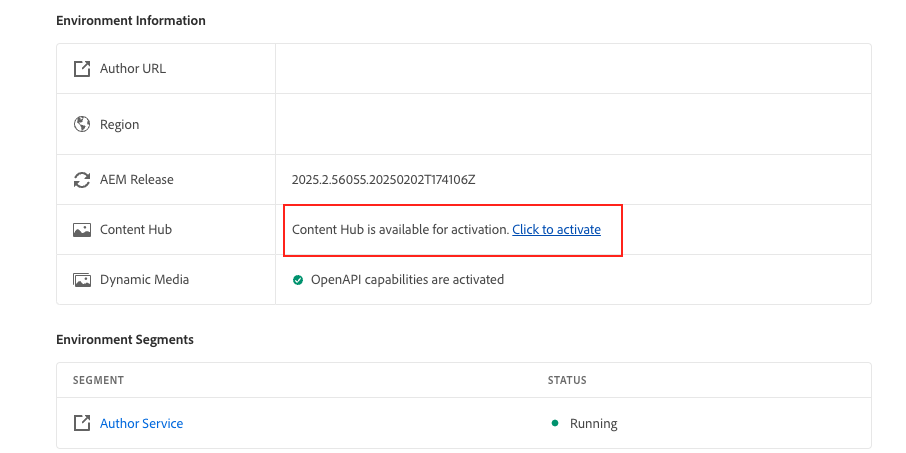
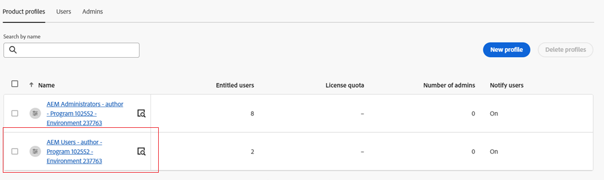

# Déployer Content Hub {#deploy-content-hub}

Content Hub est disponible dans le cadre de Experience Manager Assets as a Cloud Service pour démocratiser l’accès au contenu de marque pour les organisations et leurs partenaires commerciaux.

Les ressources marquées comme Approuvées sur Experience Manager Assets as a Cloud Service sont disponibles pour la distribution de ressources sur Content Hub.

Cet article fournit un workflow de bout en bout pour fournir aux utilisateurs un accès à Content Hub, y compris les variations de privilèges en fonction de leurs besoins.

Regardez cette vidéo pour savoir comment activer Content Hub pour Experience Manager Assets :

>[!VIDEO](https://video.tv.adobe.com/v/3472918/?learn=on){transcript=true}

Les variantes des privilèges sur Content Hub incluent :

* [Utilisateurs de Content Hub ](#onboard-content-hub-users) : accédez aux ressources approuvées par la marque sur le portail Content Hub.

* [Administrateurs Content Hub ](#onboard-content-hub-administrator) : accès à l’[interface utilisateur de configuration](/help/assets/configure-content-hub-ui-options.md) sur Content Hub, en plus d’accéder aux ressources approuvées par la marque, de charger des ressources vers Content Hub et d’intégrer Adobe Express pour modifier les images (si vous disposez de droits Adobe Express).

* [Utilisateurs de Content Hub avec des droits d’ajout de ressources ](#onboard-content-hub-users-add-assets) : possibilité de [charger des ressources vers Content Hub](/help/assets/upload-brand-approved-assets.md) en plus d’accéder aux ressources approuvées par la marque sur le portail Content Hub.

* [Les utilisateurs de Content Hub disposant de droits pour remixer les ressources dans de nouvelles variantes ](#onboard-content-hub-users-remix-assets) : [Intégration d’Adobe Express](/help/assets/edit-images-content-hub.md) (si vous disposez de droits Adobe Express) en plus d’accéder aux ressources approuvées par la marque sur le portail Content Hub.

* [Utilisateurs Experience Manager Assets ](#experience-manager-assets-users) : possibilité d’approuver des ressources sur Experience Manager Assets as a Cloud Service pour les rendre disponibles sur Content Hub.

>[!NOTE]
>
>Vous pouvez accéder à Content Hub et l’utiliser avec un maximum de 250 utilisateurs Content Hub Limited pour Assets Ultimate et 50 utilisateurs Content Hub pour Assets Prime. Contactez votre représentant Adobe si vous avez des questions supplémentaires.

Le tableau suivant résume les types d’utilisateurs Content Hub disponibles, les privilèges dont ils disposent et les profils de produit requis pour obtenir ces privilèges :

| Rôle utilisateur | Utilisateurs de Content Hub | Utilisateurs de Content Hub autorisés à ajouter des ressources | Utilisateurs de Content Hub autorisés à remixer des ressources | Administrateurs Content Hub |
|---------------|----------|----------|-------------------------|---|
| **Fonctionnalités** |  |  |  |  |
| Accéder aux ressources approuvées par la marque sur le portail Content Hub | ✓ | ✓ | ✓ | ✓ |
| Chargement de ressources à partir du portail Content Hub | − | ✓ | ✓ | ✓ |
| Utilisation de l’intégration Adobe Express pour modifier les images | − | − | ✓ | − |
| Accès à l’interface utilisateur de configuration de Content Hub | − | − | − | ✓ |
| **L’utilisateur ou l’utilisatrice doit se trouver dans ces profils de produit (Admin Console)** |  |  |  |  |
| AEM > Instance de diffusion > Utilisateurs et utilisatrices limités dans AEM Assets | ✓ | ✓ | ✓ | ✓ |
| AEM > Instance de création de production > Utilisateurs AEM | − | ✓ | ✓ | − |
| AEM > Instance de création de production > Administration AEM | − | − | − | ✓ |
| Adobe Express | − | − | ✓ | − |
| **Informations supplémentaires** | Voir [Utilisateurs de Content Hub](#onboard-content-hub-users) | Voir [Utilisateurs de Content Hub avec des droits d’ajout de ressources](#onboard-content-hub-users-add-assets) | Voir [Utilisateurs de Content Hub avec des droits pour remixer les ressources vers de nouvelles variations](#onboard-content-hub-users-remix-assets) | Voir [Administrateurs Content Hub](#onboard-content-hub-administrator) |

>[!NOTE]
>
>Les utilisateurs de [Experience Manager Assets](#experience-manager-assets-users) peuvent approuver des ressources dans un environnement Experience Manager Assets as a Cloud Service afin de les rendre disponibles sur Content Hub. Ces utilisateurs doivent être ajoutés au profil de produit AEM > Instance de création de production > Utilisateurs AEM à l’aide d’Admin Console.

## Étape 1 : activer Content Hub pour Experience Manager Assets à l’aide de Cloud Manager {#enable-content-hub}

Pour accéder au portail Content Hub, les administrateurs doivent d’abord activer Content Hub pour Experience Manager Assets as a Cloud Service à l’aide de Cloud Manager.

### Autorisations {#permissions-edit-program}

Vous devez disposer du rôle Propriétaire de l’entreprise pour modifier les programmes dans Cloud Manager. Pour plus d’informations, voir [Modifier des programmes](/help/implementing/cloud-manager/getting-access-to-aem-in-cloud/editing-programs.md).

Pour activer Content Hub pour Experience Manager Assets :

1. Connectez-vous à Cloud Manager. Veillez à sélectionner la bonne organisation lors de la connexion. Le Cloud Manager répertorie tous vos programmes.

1. Accédez au programme Experience Manager Assets as a Cloud Service, cliquez sur l’icône Plus d’options (...) et sélectionnez **[!UICONTROL Modifier le programme]**.

   

1. Dans la boîte de dialogue [!UICONTROL Modifier le programme], sélectionnez l’onglet **[!UICONTROL Solutions et modules complémentaires]**.

1. Développez **[!UICONTROL Assets]** puis sélectionnez **[!UICONTROL Content Hub]**.
   

   >[!NOTE]
   >
   >Si l’option **[!UICONTROL Mettre à jour]** n’est pas activée après avoir sélectionné Content Hub, vérifiez que vous avez spécifié les paramètres d’activation du programme.

1. Cliquez sur **[!UICONTROL Mettre à jour]**.

Content Hub est désormais activé pour Experience Manager Assets as a Cloud Service. Après l’activation de Content Hub dans un environnement de production, vous ne pouvez pas le désactiver en libre-service.

Si vous découvrez Experience Manager Assets, cliquez sur **[!UICONTROL Ajouter un programme]** puis fournissez les détails du programme (Nom du programme, Configuration pour la production) et cliquez sur **[!UICONTROL Continuer]**. Vous pouvez ensuite sélectionner **[!UICONTROL Assets]** et **[!UICONTROL Content Hub]** dans l’onglet **[!UICONTROL Solutions et modules complémentaires]**.

### Activation de Content Hub pour les environnements inférieurs {#enable-content-hub-lower-environments}

Les crédits Content Hub suivants sont disponibles en fonction de la licence AEM Assets :

* Assets Ultimate : 3 crédits Content Hub

* Assets Prime : 1 crédit Content Hub

* Clients Assets as a Cloud Service existants : 1 crédit Content Hub

Vous utilisez un crédit pour activer Content Hub sur chaque environnement, tel que la production, le développement ou l’évaluation.

Pour activer Content Hub pour les environnements inférieurs :

1. [Activez Content Hub pour Experience Manager Assets à l’aide de Cloud Manager](#enable-content-hub).

1. Cliquez sur la carte du programme pour afficher la liste des environnements disponibles (Production, Développement ou Évaluation).

1. Cliquez sur l’environnement à activer. La section **[!UICONTROL Content Hub]** affiche `Content Hub is available for activation`.

   

1. Cliquez sur **[!UICONTROL Cliquez pour activer]**. Cliquez de nouveau sur **[!UICONTROL Activer]** pour confirmer.

   Content Hub est activé pour l’environnement sélectionné.

### Instance de Content Hub et profil de produit sur Admin Console{#content-hub-instance-product-profile}

Après [activation de Content Hub pour Assets as a Cloud Service à l’aide de Cloud Manager](#enable-content-hub), une nouvelle instance est créée dans AEM Assets as a Cloud Service sur Admin Console avec `delivery` comme suffixe :

>[!NOTE]
>
>Si vous avez configuré Content Hub avant le 14 août 2024, la nouvelle instance est créée avec `contenthub` comme suffixe.

Notez qu’il n’y a aucun `author` ni `publish` dans le nom de l’instance pour Content Hub.

Cliquez sur le nom de l’instance pour afficher le profil de produit Content Hub.

>[!NOTE]
>
>Si vous avez configuré Content Hub avant le 14 août 2024, le profil de produit Content Hub a `contenthub` mentionné après `Limited Users` au lieu de `delivery`.

## Étape 2 : intégration d’un administrateur Content Hub {#onboard-content-hub-administrator}

Les administrateurs et administratrices de Content Hub peuvent accéder à l’[interface utilisateur de configuration](/help/assets/configure-content-hub-ui-options.md) sur Content Hub, en plus d’accéder aux ressources approuvées par la marque, de charger des ressources vers Content Hub et d’intégrer Adobe Express pour modifier les images (si vous disposez de droits Adobe Express).

Pour intégrer l’administrateur Content Hub :

1. [Accédez au profil de produit utilisateur Content Hub et cliquez dessus](#content-hub-instance-product-profile).

1. Cliquez sur **[!UICONTROL Ajouter des utilisateurs]** pour ajouter des utilisateurs ou des groupes d’utilisateurs au profil de produit.

1. Cliquez sur **[!UICONTROL Enregistrer]** pour enregistrer les modifications.

1. Après avoir ajouté l’utilisateur au profil de produit Content Hub, accédez aux profils de produit Experience Manager Assets en cliquant sur le nom du produit AEM as a Cloud Service dans la liste des produits sur Admin Console.

1. Cliquez sur l’instance d’auteur d’exploitation pour AEM as a Cloud Service :
   

   Admin Console affiche deux profils de produit pour AEM as a Cloud Service : Administrateurs et Utilisateurs.
1. Cliquez sur le profil de produit Administrateurs et cliquez sur **[!UICONTROL Ajouter des utilisateurs]** pour ajouter l’utilisateur au profil de produit.
   

1. Cliquez sur **[!UICONTROL Enregistrer]** pour enregistrer les modifications.

## Étape 3 : intégration des utilisateurs Content Hub {#onboard-content-hub-users}

Les utilisateurs de Content Hub peuvent accéder aux ressources disponibles sur le portail, mais ne peuvent pas ajouter de nouvelles ressources ni modifier des ressources existantes.

Pour intégrer des utilisateurs Content Hub :

1. [Accédez au profil de produit utilisateur Content Hub et cliquez dessus](#content-hub-instance-product-profile).

1. Cliquez sur **[!UICONTROL Ajouter des utilisateurs]** pour ajouter des utilisateurs ou des groupes d’utilisateurs au profil de produit.

1. Cliquez sur **[!UICONTROL Enregistrer]** pour enregistrer les modifications.

Ces utilisateurs peuvent désormais accéder aux ressources disponibles sur le portail Content Hub.

>[!NOTE]
>
>Vous pouvez utiliser toutes les fonctionnalités d’entreprise avancées, telles que la synchronisation avec des fournisseurs d’identité externes.

### Comment accéder à Content Hub ? {#access-content-hub}

Pour accéder à Content Hub, procédez comme suit :

* Accédez à Content Hub à l’aide du lien suivant :

  `https://experience.adobe.com/#/assets/contenthub`

* Connectez-vous à `experience.adobe com` et cliquez sur **[!UICONTROL Experience Manager Assets Content Hub]** disponible dans la section **[!UICONTROL Accès rapide]** :
  

* Connectez-vous à `experience.adobe com` et cliquez sur **[!UICONTROL Experience Manager Assets Content Hub]** disponible dans le sélecteur de produits :
  

### Désactiver les notifications par e-mail aux utilisateurs {#disable-email-notifications}

Si les administrateurs doivent désactiver les notifications par e-mail envoyées aux utilisateurs lorsqu’ils sont ajoutés au profil de produit Content Hub :

Cliquez sur l’icône de recherche adjacente au nom du profil de produit et désactivez le bouton (bascule) **[!UICONTROL Notifier les utilisateurs par e-mail]**.

## Étape 4 : intégration des utilisateurs Content Hub avec des droits d’ajout de ressources (facultatif) {#onboard-content-hub-users-add-assets}

Les utilisateurs de Content Hub autorisés à ajouter des ressources peuvent [charger de nouvelles ressources approuvées par la marque dans Content Hub](/help/assets/upload-brand-approved-assets.md).

Pour intégrer des utilisateurs Content Hub avec des droits d’ajout d’utilisateurs :

1. [Après avoir ajouté l’utilisateur au profil de produit Content Hub](#onboard-content-hub-users) accédez aux profils de produit Experience Manager Assets en cliquant sur le nom du produit AEM as a Cloud Service dans la liste des produits sur Admin Console.

1. Cliquez sur l’instance d’auteur d’exploitation pour AEM as a Cloud Service :
   

   Admin Console affiche deux profils de produit pour AEM as a Cloud Service : Administrateurs et Utilisateurs.
1. Cliquez sur le profil de produit Utilisateurs et cliquez sur **[!UICONTROL Ajouter des utilisateurs]** pour ajouter l’utilisateur au profil de produit.
   

1. Cliquez sur **[!UICONTROL Enregistrer]** pour enregistrer les modifications.

## Étape 4 : intégration des utilisateurs de Content Hub avec des droits pour remixer les ressources vers de nouvelles variations (facultatif) {#onboard-content-hub-users-remix-assets}

Les utilisateurs de Content Hub autorisés à remixer des ressources dans de nouvelles variantes peuvent [modifier des ressources existantes à l’aide d’Adobe Express et enregistrer la ressource dans le référentiel](/help/assets/edit-images-content-hub.md). La modification de ressources à l’aide d’Adobe Express n’est disponible que si l’utilisateur dispose de droits Adobe Express.

Pour intégrer des utilisateurs Content Hub avec les droits nécessaires pour remixer les ressources à de nouvelles variations :

1. [Après avoir ajouté l’utilisateur au profil de produit Content Hub](#onboard-content-hub-users) accédez aux profils de produit Experience Manager Assets en cliquant sur le nom du produit AEM as a Cloud Service dans la liste des produits sur Admin Console.

1. Cliquez sur l’instance d’auteur d’exploitation pour AEM as a Cloud Service :
   

   Admin Console affiche deux profils de produit pour AEM as a Cloud Service : Administrateurs et Utilisateurs.
1. Cliquez sur le profil de produit Utilisateurs et cliquez sur **[!UICONTROL Ajouter des utilisateurs]** pour ajouter l’utilisateur au profil de produit.
   

1. Cliquez sur **[!UICONTROL Enregistrer]** pour enregistrer les modifications.

## Utilisateurs de Experience Manager Assets {#experience-manager-assets-users}

Les utilisateurs de Experience Manager Assets peuvent approuver des ressources sur AEM as a Cloud Service afin qu’elles soient disponibles sur Content Hub.

Pour configurer les utilisateurs de Experience Manager Assets :

1. Accédez aux profils de produit Experience Manager Assets en cliquant sur le nom du produit AEM as a Cloud Service dans la liste des produits sur Admin Console.

1. Cliquez sur l’instance d’auteur d’exploitation pour AEM as a Cloud Service :
   

   Admin Console affiche deux profils de produit pour AEM as a Cloud Service : Administrateurs et Utilisateurs.
1. Cliquez sur le profil de produit Utilisateurs et cliquez sur **[!UICONTROL Ajouter des utilisateurs]** pour ajouter l’utilisateur au profil de produit.
   

1. Cliquez sur **[!UICONTROL Enregistrer]** pour enregistrer les modifications.

   >[!NOTE]
   >
   > Vous n&#39;avez pas besoin d&#39;être ajouté au profil de produit [Content Hub](#onboard-content-hub-users) pour les utilisateurs de Experience Manager Assets.

## Activer Content Hub pour les clients Assets as a Cloud Service existants {#enable-content-hub-exisitng-cs-customers}

Les clients Assets as a Cloud Service existants ont 250 utilisateurs Content Hub Limited inclus dans la licence. Pour activer Content Hub, procédez comme suit :

1. [Activez Content Hub pour Experience Manager Assets à l’aide de Cloud Manager](#enable-content-hub).

1. [Intégration d’utilisateurs Content Hub Limited](#onboard-content-hub-users). Ces utilisateurs peuvent accéder aux ressources disponibles sur le portail, mais ne peuvent pas ajouter de nouvelles ressources ni modifier des ressources existantes.

1. Si les utilisateurs doivent ajouter des ressources au portail Content Hub, ajoutez-les au profil de produit `AEM Users`. Pour plus d’informations, voir [Intégration d’utilisateurs Content Hub avec les droits d’ajout de ressources](#onboard-content-hub-users-add-assets).

1. Si les utilisateurs doivent accéder à l’interface utilisateur de configuration de Content Hub, ajoutez-les au profil de produit `AEM Administrators`. Pour plus d’informations, voir [Intégration d’un administrateur Content Hub](#onboard-content-hub-administrator).

Si les utilisateurs n’obtiennent pas les privilèges appropriés même après les avoir ajoutés aux profils de produit appropriés, contactez votre représentant Adobe.

## Questions fréquemment posées {#faqs-deploy-content-hub}

### Comment les utilisateurs accèdent-ils à Content Hub et quels privilèges peuvent être attribués ?

Les utilisateurs peuvent être ajoutés à Content Hub via le Adobe Admin Console en les affectant au profil de produit approprié pour Content Hub.

Les privilèges suivants sont disponibles pour les utilisateurs :

* Les utilisateurs de Content Hub peuvent accéder aux ressources approuvées par la marque sur le portail Content Hub.

* Les administrateurs et administratrices de Content Hub ont accès à l’interface utilisateur de configuration de Content Hub, ainsi qu’aux ressources approuvées par la marque, au chargement de ressources vers Content Hub et à l’intégration d’Adobe Express pour modifier les images (si vous disposez de droits Adobe Express).

* Les utilisateurs de Content Hub disposant de droits d’ajout de ressources peuvent charger des ressources dans Content Hub et accéder aux ressources approuvées par la marque sur le portail Content Hub.

* Les utilisateurs de Content Hub disposant de droits pour le remix des ressources ont accès à Adobe Express (si vous disposez de droits Adobe Express) en plus d’accéder aux ressources approuvées par la marque sur le portail Content Hub.

### Quels sont les différents profils de produit disponibles pour différents types d’utilisateurs sur Content Hub ?

Les profils de produit sont disponibles pour différents types d’utilisateurs sur Content Hub :

* Utilisateurs de Content Hub : utilisateurs limités d’AEM Assets

* Administrateurs Content Hub : Utilisateurs limités AEM Assets + Administrateurs AEM

* Utilisateurs de Content Hub disposant des droits d’ajout de ressources : AEM Assets Utilisateurs limités + Utilisateurs d’AEM

* Utilisateurs de Content Hub disposant de droits pour le remix des ressources : AEM Assets Utilisateurs limités + Utilisateurs d’AEM

### Comment les administrateurs peuvent-ils activer Content Hub pour leur entreprise ?

Les administrateurs doivent se connecter à Cloud Manager, sélectionner (ou créer) leur programme, activer Assets et Content Hub sous l’onglet Solutions et modules complémentaires et mettre à jour le programme. Cela crée une instance Content Hub dans le Adobe Admin Console où l’accès utilisateur peut être géré.

### Combien d’utilisateurs de Content Hub Limited sont inclus dans AEM Assets ? {#content-hub-limited-users-with-aem-assets}

[Assets Ultimate](/help/assets/assets-ultimate-overview.md) et Assets as a Cloud Service comprennent chacun 250 utilisateurs Content Hub Limited, tandis que [Assets Prime](/help/assets/assets-prime.md) comprend 50 utilisateurs Content Hub Limited.

### Combien de crédits Content Hub sont disponibles avec ma licence AEM Assets ?

Le nombre de crédits Content Hub disponibles dépend de votre licence AEM Assets :

* Assets Ultimate comprend trois crédits Content Hub.

* Assets Prime comprend un crédit Content Hub.

* Les clients Assets as a Cloud Service existants reçoivent un crédit Content Hub.

### Comment les crédits Content Hub sont-ils utilisés ?

Un crédit Content Hub est utilisé pour chaque environnement pour lequel Content Hub est activé. Par exemple, l’activation de Content Hub dans les environnements de production, de développement et d’évaluation nécessite trois crédits.

### Puis-je activer Content Hub dans les environnements inférieurs ?

Oui. Vous pouvez activer Content Hub dans les environnements inférieurs tels que le développement ou l’évaluation, à condition que vous disposiez de crédits Content Hub disponibles. Chaque environnement inférieur activé consomme un crédit.

### Comment puis-je avoir les droits d’accès aux ressources approuvées sur Content Hub ?

Les utilisateurs de Content Hub peuvent accéder aux ressources approuvées par la marque sur le portail Content Hub. Vous devez être ajouté au profil de produit Utilisateurs limités d’AEM pour être un utilisateur Content Hub.

### Comment puis-je avoir les droits de charger des ressources sur Content Hub ?

Les utilisateurs de Content Hub disposant de droits d’ajout de ressources peuvent charger des ressources dans Content Hub et accéder aux ressources approuvées par la marque sur le portail Content Hub. Vous devez être ajouté aux profils de produit Utilisateurs limités AEM et Utilisateurs AEM pour être un utilisateur Content Hub disposant des droits d’ajout de ressources.

### Comment puis-je avoir les droits d’accès à l’interface utilisateur de configuration sur Content Hub ?

Les administrateurs et administratrices de Content Hub ont accès à l’interface utilisateur de configuration de Content Hub, ainsi qu’aux ressources approuvées par la marque, au chargement de ressources vers Content Hub et à l’intégration d’Adobe Express pour modifier les images (si vous disposez de droits Adobe Express). Vous devez être ajouté aux profils de produit Utilisateurs limités AEM et Administrateurs AEM pour être administrateur Content Hub.

### Comment puis-je avoir les droits de modifier des images à l’aide d’Adobe Express sur Content Hub ?

Les utilisateurs de Content Hub disposant de droits pour le remix des ressources ont accès à Adobe Express (si vous disposez de droits Adobe Express) en plus d’accéder aux ressources approuvées par la marque sur le portail Content Hub. Vous devez être ajouté aux profils de produit Utilisateurs limités d’AEM et Utilisateurs d’AEM pour être un utilisateur de Content Hub disposant des droits de mixage des ressources.

