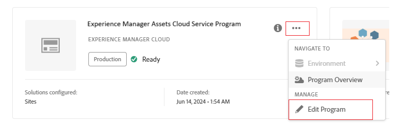

# Déploiement de Content Hub {#deploy-content-hub}

Content Hub est disponible dans le cadre de Experience Manager Assets as a Cloud Service pour démocratiser l’accès au contenu de marque pour les organisations et leurs partenaires commerciaux.

Les ressources marquées comme approuvées as a Cloud Service Experience Manager Assets sont disponibles pour la distribution des ressources sur Content Hub.

Cet article fournit un processus de bout en bout pour fournir aux utilisateurs un accès Content Hub, y compris les variantes d’autorisations en fonction de leurs besoins.

Les variations de privilèges sur Content Hub incluent :

* [Consommateurs de ressources](#onboard-content-hub-consumer-users): accédez aux ressources approuvées par la marque sur le portail Content Hub.

* [Administrateurs](#onboard-content-hub-administrator): accès au [Interface utilisateur de configuration](/help/assets/configure-content-hub-ui-options.md) sur Content Hub en plus du consommateur de ressources avec des droits d’envoi.

* [Consommateurs de ressources disposant de droits d’envoi](#onboard-content-hub-consumer-users-submission-rights): capacité à [chargement de ressources vers Content Hub](/help/assets/upload-brand-approved-assets.md) et [Intégration d’Adobe Express](/help/assets/edit-images-content-hub.md) en plus d’accéder aux ressources approuvées par la marque sur le portail Content Hub.

* [distributeurs de ressources](#content-hub-asset-distributors): possibilité d’approuver les ressources as a Cloud Service Experience Manager Assets pour les rendre disponibles sur Content Hub.

## Étape 1 : Activation de Content Hub pour Experience Manager Assets à l’aide de Cloud Manager {#enable-content-hub}

Pour accéder au portail Content Hub, les administrateurs doivent d’abord activer Content Hub pour Experience Manager Assets as a Cloud Service à l’aide de Cloud Manager. Procédez comme suit :

1. Connectez-vous à Cloud Manager. Assurez-vous de sélectionner la bonne organisation lors de la connexion. Le Cloud Manager répertorie tous vos programmes.

1. Accédez au programme Experience Manager Assets as a Cloud Service, cliquez sur l’icône Autres options (...) et sélectionnez **[!UICONTROL Modifier le programme]**.

   

1. Sur le [!UICONTROL Modifier le programme] , sélectionnez **[!UICONTROL Solutions et modules complémentaires]** .

1. Développer **[!UICONTROL Assets]** et sélectionnez **[!UICONTROL Content Hub]**.
   

1. Cliquez sur **[!UICONTROL Mettre à jour]**.

Content Hub est désormais activé pour Experience Manager Assets as a Cloud Service.

Si vous découvrez Experience Manager Assets, cliquez sur **[!UICONTROL Ajout d’un programme]** puis fournissez les détails du programme (nom du programme, configurer pour la production) et cliquez sur **[!UICONTROL Continuer]**. Vous pouvez ensuite sélectionner **[!UICONTROL Assets]** et **[!UICONTROL Content Hub]** dans le **[!UICONTROL Solutions et modules complémentaires]** .

### Instance Content Hub et profil de produit sur Admin Console{#content-hub-instance-product-profile}

Après [Activation de Content Hub pour Assets as a Cloud Service à l’aide de Cloud Manager](#enable-content-hub), une nouvelle instance est créée dans AEM Assets as a Cloud Service Admin Console avec `contenthub` comme suffixe :

Notez qu’il n’existe pas de `author` ou `publish` dans le nom de l’instance pour Content Hub.

Cliquez sur le nom de l’instance pour afficher le profil de produit Content Hub.

## Étape 2 : administrateur Content Hub intégré {#onboard-content-hub-administrator}

Les administrateurs de Content Hub peuvent ajouter des ressources à Content Hub et peuvent également définir la variable [Options de configuration](/help/assets/configure-content-hub-ui-options.md) pour d’autres utilisateurs de votre entreprise.

Pour intégrer l’administrateur Content Hub :

1. [Accédez au profil de produit utilisateur Content Hub et cliquez dessus.](#content-hub-instance-product-profile).

1. Cliquez sur **[!UICONTROL Ajout d’utilisateurs]** pour ajouter des utilisateurs ou des groupes d’utilisateurs au profil de produit.

1. Cliquez sur **[!UICONTROL Enregistrer]** pour enregistrer les modifications.

1. Après avoir ajouté l’utilisateur au profil de produit Content Hub, accédez aux profils de produit Experience Manager Assets en cliquant sur le nom du produit AEM as a Cloud Service dans la liste des produits sur Admin Console.

1. Cliquez sur l’instance d’auteur de production pour AEM as a Cloud Service :
   

   Admin Console affiche deux profils de produit pour AEM as a Cloud Service : Administrateurs et Utilisateurs.
1. Cliquez sur le profil de produit Administrateurs , puis sur **[!UICONTROL Ajout d’utilisateurs]** pour ajouter l’utilisateur au profil de produit.
   

1. Cliquez sur **[!UICONTROL Enregistrer]** pour enregistrer les modifications.

## Étape 3 : Intégration des utilisateurs consommateurs de ressources Content Hub {#onboard-content-hub-consumer-users}

Les utilisateurs consommateurs de Content Hub peuvent accéder aux ressources disponibles sur le portail, mais ne peuvent pas ajouter de nouvelles ressources ni modifier des ressources existantes.

Pour intégrer des utilisateurs clients à Content Hub :

1. [Accédez au profil de produit utilisateur Content Hub et cliquez dessus.](#content-hub-instance-product-profile).

1. Cliquez sur **[!UICONTROL Ajout d’utilisateurs]** pour ajouter des utilisateurs ou des groupes d’utilisateurs au profil de produit.

1. Cliquez sur **[!UICONTROL Enregistrer]** pour enregistrer les modifications.

Ces utilisateurs peuvent désormais accéder aux ressources disponibles sur le portail Content Hub.

>[!NOTE]
>
>Vous pouvez utiliser toutes les fonctionnalités avancées de l’entreprise, telles que la synchronisation avec des fournisseurs d’identité externes.

Après avoir ajouté les utilisateurs appropriés à l’aide d’Admin Console, les utilisateurs peuvent accéder à Content Hub à l’aide du lien suivant :

`https://experience.adobe.com/#/assets/contenthub`

### Désactivation des notifications par e-mail aux utilisateurs {#disable-email-notifications}

Si les administrateurs doivent désactiver les notifications électroniques envoyées aux utilisateurs lorsqu’ils sont ajoutés au profil de produit Content Hub :

Cliquez sur l’icône de recherche en regard du nom du profil de produit et désactivez la variable **[!UICONTROL Notifier les utilisateurs par courrier électronique]** bascule.

## Étape 4 : Intégration des utilisateurs consommateurs de ressources Content Hub avec des autorisations d’envoi (facultatif) {#onboard-content-hub-consumer-users-submission-rights}

Les utilisateurs consommateurs de ressources Content Hub disposant d’autorisations d’envoi peuvent :

* [Chargement de nouvelles ressources approuvées par la marque dans Content Hub](/help/assets/upload-brand-approved-assets.md).

* [Modifier des ressources existantes à l’aide d’Adobe Express et enregistrer la ressource dans le référentiel](/help/assets/edit-images-content-hub.md). La modification de ressources à l’aide d’Adobe Express n’est disponible que si l’utilisateur dispose de droits d’Adobe Express.

Pour intégrer un utilisateur client Content Hub disposant de droits d’envoi :

1. [Après l’ajout de l’utilisateur au profil de produit Content Hub](#onboard-content-hub-consumer-users), accédez aux profils de produit Experience Manager Assets en cliquant sur le nom du produit AEM as a Cloud Service dans la liste des produits sur Admin Console.

1. Cliquez sur l’instance d’auteur de production pour AEM as a Cloud Service :
   

   Admin Console affiche deux profils de produit pour AEM as a Cloud Service : Administrateurs et Utilisateurs.
1. Cliquez sur le profil de produit Utilisateurs , puis sur **[!UICONTROL Ajout d’utilisateurs]** pour ajouter l’utilisateur au profil de produit.
   

1. Cliquez sur **[!UICONTROL Enregistrer]** pour enregistrer les modifications.

## distributeurs de ressources Content Hub {#content-hub-asset-distributors}

Les distributeurs de ressources peuvent approuver les ressources sur AEM as a Cloud Service afin qu’elles soient disponibles sur Content Hub.

Pour configurer le rôle de distributeur de ressources :

1. Accédez aux profils de produit Experience Manager Assets en cliquant sur le nom du produit AEM as a Cloud Service dans la liste des produits sur Admin Console.

1. Cliquez sur l’instance d’auteur de production pour AEM as a Cloud Service :
   

   Admin Console affiche deux profils de produit pour AEM as a Cloud Service : Administrateurs et Utilisateurs.
1. Cliquez sur le profil de produit Utilisateurs , puis sur **[!UICONTROL Ajout d’utilisateurs]** pour ajouter l’utilisateur au profil de produit.
   

1. Cliquez sur **[!UICONTROL Enregistrer]** pour enregistrer les modifications.

   >[!NOTE]
   >
   > Vous n’avez pas besoin d’être ajouté à la variable [Profil de produits Content Hub](#onboard-content-hub-consumer-users) pour le rôle de distribution des ressources.

