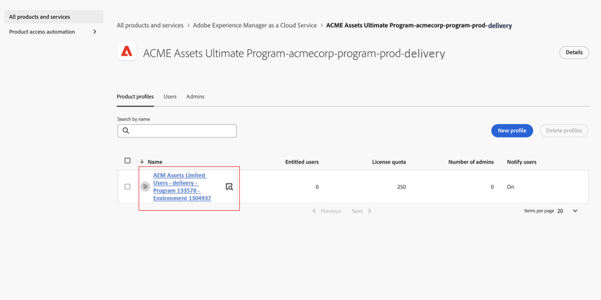

# Déployer Content Hub {#deploy-content-hub}

| [Bonnes pratiques de recherche](/help/assets/search-best-practices.md) | [Bonnes pratiques relatives aux métadonnées](/help/assets/metadata-best-practices.md) | [Hub de contenus](/help/assets/product-overview.md) | [Fonctionnalités Dynamic Media avec OpenAPI](/help/assets/dynamic-media-open-apis-overview.md) | [Documentation de développement pour AEM Assets](https://developer.adobe.com/experience-cloud/experience-manager-apis/) |
| ------------- | --------------------------- |---------|----|-----|

>[!AVAILABILITY]
>
>Le guide Content Hub est désormais disponible au format PDF. Téléchargez l’intégralité du guide et utilisez l’assistant Adobe Acrobat AI pour répondre à vos requêtes.
>
>[!BADGE PDF de guide Content Hub]{type=Informative url="https://helpx.adobe.com/content/dam/help/en/experience-manager/aem-assets/content-hub.pdf"}

Content Hub est disponible dans le cadre de Experience Manager Assets as a Cloud Service pour démocratiser l’accès au contenu de marque pour les organisations et leurs partenaires commerciaux.

Les ressources marquées comme approuvées as a Cloud Service Experience Manager Assets sont disponibles pour la distribution des ressources sur Content Hub.

Cet article fournit un processus de bout en bout pour fournir aux utilisateurs un accès Content Hub, y compris les variantes d’autorisations en fonction de leurs besoins.

Les variations de privilèges sur Content Hub incluent :

* [Utilisateurs de Content Hub](#onboard-content-hub-users) : accédez aux ressources approuvées de marque sur le portail Content Hub.

* [Administrateurs Content Hub](#onboard-content-hub-administrator) : accès à l’ [interface utilisateur de configuration](/help/assets/configure-content-hub-ui-options.md) sur Content Hub en plus d’accéder aux ressources approuvées par la marque, de charger des ressources vers Content Hub, de l’intégration d’Adobe Express pour modifier des images (si vous avez des droits d’Adobe Express).

* [Utilisateurs Content Hub autorisés à ajouter des ressources](#onboard-content-hub-users-add-assets) : possibilité de [ charger des ressources vers Content Hub](/help/assets/upload-brand-approved-assets.md) en plus d’accéder aux ressources approuvées par la marque sur le portail Content Hub.

* [Utilisateurs de Content Hub autorisés à remixer des ressources vers de nouvelles variations](#onboard-content-hub-users-remix-assets) : [Intégration d’Adobe Express](/help/assets/edit-images-content-hub.md) (si vous disposez de droits d’Adobe Express) en plus d’accéder aux ressources approuvées par la marque sur le portail Content Hub.

* [Utilisateurs de Experience Manager Assets](#experience-manager-assets-users) : possibilité d’approuver les ressources as a Cloud Service Experience Manager Assets pour les rendre disponibles sur Content Hub.

Le tableau suivant récapitule les types d’utilisateurs Content Hub disponibles, les privilèges dont ils disposent et les profils de produit requis pour obtenir ces privilèges :

| Rôle utilisateur | Utilisateurs de Content Hub | Utilisateurs de Content Hub disposant des droits d’ajout de ressources | Utilisateurs de Content Hub disposant des droits pour le remix de ressources | Administrateurs Content Hub |
|---------------|----------|----------|-------------------------|---|
| **Fonctionnalités** |
| Accès aux ressources approuvées par la marque sur le portail Content Hub | ✓ | ✓ | ✓ | ✓ |
| Chargement de ressources à partir du portail Content Hub | − | ✓ | ✓ | ✓ |
| Utilisation de l’intégration Adobe Express pour modifier des images | − | − | ✓ | − |
| Accès à l’interface utilisateur de configuration de Content Hub | − | − | − | ✓ |
| **L’utilisateur doit se trouver dans ces profils de produit (Admin Console)** |
| AEM > Instance de diffusion > Utilisateurs limités dans AEM Assets | ✓ | ✓ | ✓ | ✓ |
| AEM > Instance d’auteur de production > Utilisateurs AEM | − | ✓ | ✓ | − |
| AEM > Instance d’auteur de production > AEM administrateurs | − | − | − | ✓ |
| Adobe Express | − | − | ✓ | − |
| **Plus d’informations** | Voir [Utilisateurs de Content Hub](#onboard-content-hub-users) | Voir [Utilisateurs Content Hub autorisés à ajouter des ressources](#onboard-content-hub-users-add-assets) | Voir [Utilisateurs de Content Hub autorisés à remixer des ressources vers de nouvelles variations](#onboard-content-hub-users-remix-assets) | Voir [Administrateurs Content Hub](#onboard-content-hub-administrator) |

>[!NOTE]
>
Les [utilisateurs de Experience Manager Assets](#experience-manager-assets-users) peuvent approuver des ressources dans un environnement as a Cloud Service Experience Manager Assets pour les rendre disponibles sur Content Hub. Ces utilisateurs doivent être ajoutés à AEM > Instance d’auteur de production > AEM profil de produit Utilisateurs à l’aide d’Admin Console.

## Étape 1 : Activation de Content Hub pour Experience Manager Assets à l’aide de Cloud Manager {#enable-content-hub}

Pour accéder au portail Content Hub, les administrateurs doivent d’abord activer Content Hub pour Experience Manager Assets as a Cloud Service à l’aide de Cloud Manager. Procédez comme suit :

1. Connectez-vous à Cloud Manager. Assurez-vous de sélectionner la bonne organisation lors de la connexion. Le Cloud Manager répertorie tous vos programmes.

1. Accédez au programme Experience Manager Assets as a Cloud Service, cliquez sur l’icône Plus d’options (...) et sélectionnez **[!UICONTROL Modifier le programme]**.

   

1. Dans la boîte de dialogue [!UICONTROL Modifier le programme], sélectionnez l’onglet **[!UICONTROL Solutions &amp; Add-ons]** .

1. Développez **[!UICONTROL Assets]** et sélectionnez **[!UICONTROL Content Hub]**.
   

   >[!NOTE]
   >
   Si **[!UICONTROL Update]** n’est pas activé pour vous après avoir sélectionné Content Hub, assurez-vous que vous avez spécifié les paramètres d’activation pour le programme.

1. Cliquez sur **[!UICONTROL Mettre à jour]**.

Content Hub est désormais activé pour Experience Manager Assets as a Cloud Service. Après avoir activé Content Hub dans un environnement de production, vous ne pouvez pas le désactiver en libre-service.

>[!NOTE]
>
Vous pouvez accéder à Content Hub et l’utiliser avec jusqu’à 250 utilisateurs de Content Hub. Contactez votre représentant Adobe si vous avez d’autres questions.

Si vous découvrez Experience Manager Assets, cliquez sur **[!UICONTROL Ajouter un programme]**, puis fournissez les détails du programme (nom du programme, configurer pour la production) et cliquez sur **[!UICONTROL Continuer]**. Vous pouvez ensuite sélectionner **[!UICONTROL Assets]** et **[!UICONTROL Content Hub]** dans l’onglet **[!UICONTROL Solutions &amp; Add-ons]** .

### Instance Content Hub et profil de produit sur Admin Console{#content-hub-instance-product-profile}

Après [l’activation de Content Hub pour Assets as a Cloud Service à l’aide de Cloud Manager](#enable-content-hub), une nouvelle instance est créée dans l’Admin Console as a Cloud Service AEM Assets avec `delivery` comme suffixe :

>[!NOTE]
>
Si vous avez configuré Content Hub avant le 14 août 2024, la nouvelle instance est créée avec `contenthub` comme suffixe.

Notez qu’il n’y a pas `author` ou `publish` dans le nom d’instance pour Content Hub.

Cliquez sur le nom de l’instance pour afficher le profil de produit Content Hub.

>[!NOTE]
>
Si vous avez configuré Content Hub avant le 14 août 2024, le profil de produit Content Hub a `contenthub` mentionné après `Limited Users` au lieu de `delivery`.

## Étape 2 : administrateur Content Hub intégré {#onboard-content-hub-administrator}

Les administrateurs de Content Hub peuvent accéder à l’[ interface utilisateur de configuration](/help/assets/configure-content-hub-ui-options.md) sur Content Hub en plus d’accéder aux ressources approuvées par la marque, de charger des ressources vers Content Hub, de l’intégration d’Adobe Express pour modifier des images (si vous disposez de droits d’Adobe Express).

Pour intégrer l’administrateur Content Hub :

1. [Accédez au profil de produit utilisateur Content Hub ](#content-hub-instance-product-profile) et cliquez dessus.

1. Cliquez sur **[!UICONTROL Ajouter des utilisateurs]** pour ajouter des utilisateurs ou des groupes d’utilisateurs au profil de produit.

1. Cliquez sur **[!UICONTROL Enregistrer]** pour enregistrer les modifications.

1. Après avoir ajouté l’utilisateur au profil de produit Content Hub, accédez aux profils de produit Experience Manager Assets en cliquant sur le nom du produit AEM as a Cloud Service dans la liste des produits sur Admin Console.

1. Cliquez sur l’instance d’auteur de production pour AEM as a Cloud Service :
   

   Admin Console affiche deux profils de produit pour AEM as a Cloud Service : Administrateurs et Utilisateurs.
1. Cliquez sur le profil de produit Administrateurs et cliquez sur **[!UICONTROL Ajouter des utilisateurs]** pour ajouter l’utilisateur au profil de produit.
   

1. Cliquez sur **[!UICONTROL Enregistrer]** pour enregistrer les modifications.

## Étape 3 : utilisateurs Content Hub intégrés {#onboard-content-hub-users}

Les utilisateurs de Content Hub peuvent accéder aux ressources disponibles sur le portail, mais ne peuvent pas ajouter de nouvelles ressources ni modifier des ressources existantes.

Pour intégrer des utilisateurs Content Hub :

1. [Accédez au profil de produit utilisateur Content Hub ](#content-hub-instance-product-profile) et cliquez dessus.

1. Cliquez sur **[!UICONTROL Ajouter des utilisateurs]** pour ajouter des utilisateurs ou des groupes d’utilisateurs au profil de produit.

1. Cliquez sur **[!UICONTROL Enregistrer]** pour enregistrer les modifications.

Ces utilisateurs peuvent désormais accéder aux ressources disponibles sur le portail Content Hub.

>[!NOTE]
>
Vous pouvez utiliser toutes les fonctionnalités avancées de l’entreprise, telles que la synchronisation avec des fournisseurs d’identité externes.

### Comment accéder à Content Hub ? {#access-content-hub}

Content Hub est accessible de différentes manières :

* Accédez à Content Hub à l’aide du lien suivant :

  `https://experience.adobe.com/#/assets/contenthub`

* Connectez-vous à `experience.adobe com` et cliquez sur **[!UICONTROL Experience Manager Assets Content Hub]** disponible dans la section **[!UICONTROL Accès rapide]** :
  

* Connectez-vous à `experience.adobe com` et cliquez sur **[!UICONTROL Experience Manager Assets Content Hub]** disponible dans le sélecteur de produits :
  

### Désactivation des notifications par e-mail aux utilisateurs {#disable-email-notifications}

Si les administrateurs doivent désactiver les notifications électroniques envoyées aux utilisateurs lorsqu’ils sont ajoutés au profil de produit Content Hub :

Cliquez sur l’icône de recherche en regard du nom du profil de produit et désactivez le bouton d’activation/désactivation **[!UICONTROL Notifier les utilisateurs par email]** .

## Étape 4 : Intégration des utilisateurs de Content Hub avec les droits d’ajout de ressources (facultatif) {#onboard-content-hub-users-add-assets}

Les utilisateurs Content Hub autorisés à ajouter des ressources peuvent [charger de nouvelles ressources approuvées par la marque dans Content Hub](/help/assets/upload-brand-approved-assets.md).

Pour intégrer des utilisateurs Content Hub disposant de droits d’ajout d’utilisateurs :

1. [Après avoir ajouté l’utilisateur au profil de produit Content Hub](#onboard-content-hub-users), accédez aux profils de produit Experience Manager Assets en cliquant sur le nom de produit AEM as a Cloud Service dans la liste des produits sur Admin Console.

1. Cliquez sur l’instance d’auteur de production pour AEM as a Cloud Service :
   

   Admin Console affiche deux profils de produit pour AEM as a Cloud Service : Administrateurs et Utilisateurs.
1. Cliquez sur le profil de produit Utilisateurs et cliquez sur **[!UICONTROL Ajouter des utilisateurs]** pour ajouter l’utilisateur au profil de produit.
   

1. Cliquez sur **[!UICONTROL Enregistrer]** pour enregistrer les modifications.

## Étape 4 : Intégration des utilisateurs de Content Hub avec les droits de remix de ressources vers de nouvelles variations (facultatif) {#onboard-content-hub-users-remix-assets}

Les utilisateurs de Content Hub ayant les droits de remix assets to new variations peuvent [modifier des ressources existantes à l’aide d’Adobe Express et enregistrer la ressource dans le référentiel](/help/assets/edit-images-content-hub.md). La modification de ressources à l’aide d’Adobe Express n’est disponible que si l’utilisateur dispose de droits d’Adobe Express.

Pour intégrer des utilisateurs Content Hub autorisés à remixer des ressources vers de nouvelles variations :

1. [Après avoir ajouté l’utilisateur au profil de produit Content Hub](#onboard-content-hub-users), accédez aux profils de produit Experience Manager Assets en cliquant sur le nom de produit AEM as a Cloud Service dans la liste des produits sur Admin Console.

1. Cliquez sur l’instance d’auteur de production pour AEM as a Cloud Service :
   

   Admin Console affiche deux profils de produit pour AEM as a Cloud Service : Administrateurs et Utilisateurs.
1. Cliquez sur le profil de produit Utilisateurs et cliquez sur **[!UICONTROL Ajouter des utilisateurs]** pour ajouter l’utilisateur au profil de produit.
   

1. Cliquez sur **[!UICONTROL Enregistrer]** pour enregistrer les modifications.

## Utilisateurs de Experience Manager Assets {#experience-manager-assets-users}

Les utilisateurs de Experience Manager Assets peuvent approuver les ressources dans AEM as a Cloud Service afin qu’elles soient disponibles dans Content Hub.

Pour configurer les utilisateurs de Experience Manager Assets :

1. Accédez aux profils de produit Experience Manager Assets en cliquant sur le nom du produit AEM as a Cloud Service dans la liste des produits sur Admin Console.

1. Cliquez sur l’instance d’auteur de production pour AEM as a Cloud Service :
   

   Admin Console affiche deux profils de produit pour AEM as a Cloud Service : Administrateurs et Utilisateurs.
1. Cliquez sur le profil de produit Utilisateurs et cliquez sur **[!UICONTROL Ajouter des utilisateurs]** pour ajouter l’utilisateur au profil de produit.
   

1. Cliquez sur **[!UICONTROL Enregistrer]** pour enregistrer les modifications.

   >[!NOTE]
   >
   Vous n’avez pas besoin d’être ajouté au [profil de produit Content Hub](#onboard-content-hub-users) pour les utilisateurs de Experience Manager Assets.
