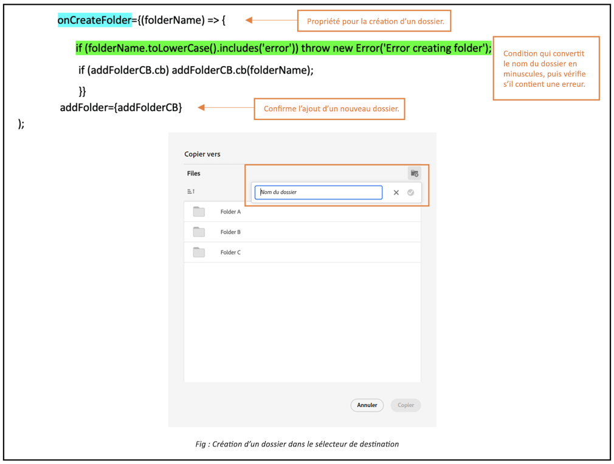

# Sélecteur de destination micro-front {#Overview}

Le sélecteur de destination Micro-Frontend fournit une interface utilisateur dans votre application qui s’intègre facilement à la variable [!DNL Experience Manager Assets as a Cloud Service] référentiel. Vous pouvez rechercher ou parcourir le dossier approprié dans le [!DNL Experience Manager Assets as a Cloud Service] et chargez des ressources à partir de votre application.

L’interface utilisateur de Micro-Frontend est mise à disposition dans votre expérience d’application à l’aide du package Sélecteur de destination. Toutes les mises à jour du package sont automatiquement importées et le dernier sélecteur de destination déployé se charge automatiquement dans votre application.


Le sélecteur de destination offre de nombreux avantages, tels que :

* Facile à intégrer avec n’importe quelle application Adobe ou autre qu’Adobe utilisant la bibliothèque JavaScript Vanilla.
* Facile à gérer, car les mises à jour du package du sélecteur de destination sont automatiquement déployées vers le sélecteur de destination disponible pour votre application. Aucune mise à jour n’est requise dans votre application pour télécharger les dernières modifications.
* Facilité de personnalisation, car il existe des propriétés qui contrôlent l’affichage du sélecteur de destination dans votre application.
* Recherche de texte intégral pour accéder rapidement aux dossiers où charger des ressources à partir de votre application.
* Possibilité de créer des dossiers, de les trier par ordre croissant ou décroissant, puis de les afficher en mode Liste, Grille, Galerie ou Cascade.

Le but de cet article est de montrer comment utiliser le sélecteur de destination avec une [!DNL Adobe] application sous Shell unifié ou lorsque vous avez déjà généré un imsToken pour l’authentification. Dans cet article, ces workflows sont appelés flux non-SUSI.

Effectuez les tâches suivantes pour intégrer et utiliser le sélecteur de destination avec votre [!DNL Experience Manager Assets as a Cloud Service] référentiel :

* [Intégration du sélecteur de destination à l’aide de Vanilla JS](#integration-with-vanilla-js)
* [Définition des propriétés d’affichage du sélecteur de destination](#destination-selector-properties)
* [Utilisation du sélecteur de destination](#using-destination-selector)

## Intégration du sélecteur de destination à l’aide de Vanilla JS {#integration-with-vanilla-js}

Vous pouvez intégrer n’importe quelle application [!DNL Adobe] ou autre qu’Adobe avec [!DNL Experience Manager Assets] as a [!DNL Cloud Service] et sélectionner des ressources dans l’application.

L’intégration est effectuée en important le package Sélecteur de destination et en se connectant à Assets as a Cloud Service à l’aide de la bibliothèque JavaScript Vanilla. Vous devez modifier une `index.html` ou tout fichier approprié dans votre application vers -
* Définition des détails d’authentification
* Accès au référentiel Assets as a Cloud Service
* Configuration des propriétés d’affichage du sélecteur de destination

Vous pouvez effectuer une authentification sans définir certaines des propriétés IMS, si :

* Vous intégrez une application [!DNL Adobe] sur [Unified Shell](https://experienceleague.adobe.com/docs/experience-manager-cloud-service/content/overview/aem-cloud-service-on-unified-shell.html?lang=fr).
* Un jeton IMS est déjà généré pour l’authentification.

## Prérequis {#prerequisites}

Définissez les conditions préalables dans le fichier `index.html` ou un fichier similaire dans l’implémentation de votre application pour définir les détails d’authentification permettant d’accéder au référentiel [!DNL Experience Manager Assets] as a [!DNL Cloud Service]. Les prérequis sont les suivants :
* imsOrg
* imsToken
* apikey

## Installation {#installation}

Le sélecteur de destination est disponible via le réseau de diffusion de contenu ESM (par exemple, [esm.sh](https://esm.sh/)/[skypack](https://www.skypack.dev/)) et [UMD](https://github.com/umdjs/umd) version.

Dans les navigateurs utilisant la **version UMD** (recommandé) :

```
<script src="https://experience.adobe.com/solutions/CQ-assets-selectors/assets/resources/assets-selectors.js"></script>

<script>
  const { renderDestinationSelector } = PureJSSelectors;
</script>
```

Dans les navigateurs avec la prise en charge `import maps` à l’aide de la **version du réseau CDN ESM** :

```
<script type="module">
  import { DestinationSelector } from 'https://experience.adobe.com/solutions/CQ-assets-selectors/assets/resources/@assets/selectors/index.js'
</script>
```

Dans la fédération de modules Deno/Webpack à l’aide de la **version du réseau CDN ESM** :

```
import { DestinationSelector } from 'https://experience.adobe.com/solutions/CQ-assets-selectors/assets/resources/@assets/selectors/index.js'
```

### Destination sélectionnée {#selected-destination}

Le sélecteur de destination reçoit un rappel de `onItemSelect`, `onTreeToggleItem`, ou `onTreeSelectionChange` avec le répertoire sélectionné contenant l’objet (répertoire, image, etc.).

**Syntaxe du schéma**

```
interface SelectedDestination {
  id: string;
  children: SelectedDestination[];
  'repo:repositoryId': string;
  'dc:format': string;
  'repo:assetClass': string;
  'storage:directoryType': string;
  'storage:region': string;
  'repo:name': string;
  'repo:path': string;
  'repo:ancestors': string[];
  'repo:createDate': string;
  'storage:assignee':

  { type: string; id: string; }
  ;
  'repo:assetId': string;
  'aem:published': boolean;
  'repo:createdBy': string;
  'repo:state': string;
  'repo:id': string;
  'repo:modifyDate': string;
  _page:

  { orderBy: string; count: number; };
}
```

Le tableau suivant décrit certaines des propriétés importantes de la destination sélectionnée.

| Propriété | Type | Explication |
|---|---|---|
| *repo:repositoryId* | chaîne | Identifiant unique du référentiel dans lequel la ressource est stockée. |
| *repo:id* | chaîne | Identifiant unique de la ressource. |
| *repo:assetClass* | chaîne | Classification de la ressource (par exemple, image ou vidéo, document). |
| *repo:name* | chaîne | Nom de la ressource, y compris l’extension de fichier. |
| *repo:size* | nombre | Taille de la ressource en octets. |
| *repo:path* | chaîne | Emplacement de la ressource dans le référentiel. |
| *repo:ancestors* | `Array<string>` | Tableau d’éléments ancêtres de la ressource dans le référentiel. |
| *repo:state* | chaîne | État actuel de la ressource dans le référentiel (par exemple, active, supprimée, etc.). |
| *repo:createdBy* | chaîne | L’utilisateur, l’utilisatrice ou le système qui a créé la ressource. |
| *repo:createDate* | chaîne | Date et heure de création de la ressource. |
| *repo:modifiedBy* | chaîne | L’utilisateur, l’utilisatrice ou le système qui a modifié la ressource pour la dernière fois. |
| *repo:modifyDate* | chaîne | Date et heure de la dernière modification de la ressource. |
| *dc:format* | chaîne | Format de la ressource. |
| *_page* | orderBy : string; count : number; | Inclut le numéro de page du document. |

Pour obtenir la liste complète des propriétés et des exemples détaillés, consultez la page [Exemple de code de sélecteur de destination](https://github.com/adobe/aem-assets-selectors-mfe-examples).

### Exemple pour le flux non-SUSI {#non-ims-vanilla}

Cet exemple montre comment utiliser le sélecteur de destination avec un flux non SUSI lors de l’exécution d’une [!DNL Adobe] application sous Shell unifié ou lorsque vous avez déjà `imsToken` générés pour l’authentification.

Incluez le package du sélecteur de destination dans votre code à l’aide de la variable `script` , comme illustré dans _lignes 6 à 15_ de l’exemple ci-dessous. Une fois le script chargé, la variable `PureJSSelectors` la variable globale est disponible. Définition du sélecteur de destination [properties](#destination-selector-properties) comme illustré dans _lignes 16 à 23_. Les propriétés `imsOrg` et `imsToken` sont toutes deux requises pour l’authentification dans un flux non-SUSI. La propriété `handleSelection` sert à gérer les ressources sélectionnées. Pour effectuer le rendu du sélecteur de destination, appelez la fonction `renderDestinationSelector` fonction comme indiqué dans _ligne 17_. Le sélecteur de destination s’affiche dans la `<div>` élément de conteneur, comme indiqué dans _lignes 21 et 22_.

En suivant ces étapes, vous pouvez utiliser le sélecteur de destination avec un flux non SUSI dans votre [!DNL Adobe] application.

```html {line-numbers="true"}
<!DOCTYPE html>
<html>
<head>
    <title>Destination Selector</title>
    <script src="https://experience.adobe.com/solutions/CQ-assets-selectors/assets/resources/assets-selectors.js"></script>
    <script>
        // get the container element in which we want to render the DestinationSelector component
        const container = document.getElementById('destination-selector-container');
        // imsOrg and imsToken are required for authentication in non-SUSI flow
        const destinationSelectorProps = {
            imsOrg: 'example-ims@AdobeOrg',
            imsToken: "example-imsToken",
            apiKey: "example-apiKey-associated-with-imsOrg",
            handleSelection: (assets: SelectedAssetType[]) => {},
        };
        // Call the `renderDestinationSelector` available in PureJSSelectors globals to render DestinationSelector
        PureJSSelectors.renderDestinationSelector(container, destinationselectorprops);
    </script>
</head>

<body>
    <div id="destination-selector-container" style="height: calc(100vh - 80px); width: calc(100vw - 60px); margin: -20px;">
    </div>
</body>

</html>
```

Par exemple, visite détaillée [Exemple de code de sélecteur de destination](https://github.com/adobe/aem-assets-selectors-mfe-examples).

## Utilisation des propriétés du sélecteur de destination {#destination-selector-properties}

Vous pouvez utiliser les propriétés du sélecteur de destination pour personnaliser la manière dont le sélecteur de destination est rendu. Le tableau suivant répertorie les propriétés que vous pouvez utiliser pour personnaliser et utiliser le sélecteur de destination :

| Propriété | Type | Requis | Valeur par défaut | Description |
|---|---|---|---|---|
| *imsOrg* | chaîne | Oui | | Identifiant Adobe Identity Management System (IMS) attribué lors de l’approvisionnement de [!DNL Adobe Experience Manager] en tant que [!DNL Cloud Service] pour votre organisation. La variable `imsOrg` clé est requise pour vous authentifier si l’organisation à laquelle vous accédez se trouve sous Adobe IMS ou non. |
| *imsToken* | chaîne | Non | | Jeton de support IMS utilisé pour l’authentification. `imsToken` n’est pas nécessaire si vous utilisez le flux SUSI. Cependant, il est requis si vous utilisez le flux non SUSI. |
| *apiKey* | chaîne | Non | | Clé d’API utilisée pour accéder au service AEM Discovery. `apiKey` n’est pas nécessaire si vous utilisez le flux SUSI. Toutefois, il est requis dans un flux non SUSI. |
| *rootPath* | chaîne | Non | /content/dam/ | Chemin du dossier à partir duquel le sélecteur de destination affiche vos ressources. `rootPath` peut également être utilisé sous la forme d’encapsulation. Par exemple, étant donné le chemin suivant, `/content/dam/marketing/subfolder/`, le sélecteur de destination ne vous permet pas de parcourir les dossiers parents, mais affiche uniquement les dossiers enfants. |
| *hasMore* | booléen | Non | | Lorsque l’application dispose de davantage de contenu à afficher, vous pouvez utiliser cette propriété pour ajouter un chargeur chargeant le contenu afin de le rendre visible dans l’application. Il s’agit d’un indicateur indiquant que le chargement du contenu est en cours. |
| *orgName* | booléen | Non | | Il s’agit du nom de l’organisation (probablement orgID) associé à AEM |
| *initRepoID* | chaîne | Non | | Il s’agit du chemin d’accès du référentiel de ressources que vous souhaitez utiliser dans une vue initiale par défaut. |
| *onCreateFolder* | chaîne | Non | | La variable `onCreateFolder` permet d’ajouter une icône qui ajoute un nouveau dossier dans l’application. |
| *onConfirm* | chaîne | Non | | Il s’agit d’un rappel lorsque vous appuyez sur le bouton de confirmation. |
| *confirmDisabled* | chaîne | Non | | Cette propriété contrôle le bouton de confirmation. |
| *viewType* | chaîne | Non | | La variable `viewType` sert à spécifier les vues que vous utilisez pour afficher les ressources. |
| *viewTypeOptions* | chaîne | Non | | Cette propriété est liée à `viewType` . vous pouvez spécifier une ou plusieurs vues pour afficher les ressources. Les options viewType disponibles sont les suivantes : Mode Liste, Mode Grille, Mode Galerie, Mode Cascade et Affichage Arborescence. |
| *itemNameFormatter* | chaîne | Non | | Cette propriété vous permet de mettre en forme le nom de l’élément. |
| *i18nSymbols* | `Object<{ id?: string, defaultMessage?: string, description?: string}>` | Non |  | Si les traductions prêtes à l’emploi ne sont pas suffisantes pour répondre aux besoins de votre application, vous pouvez exposer une interface par laquelle vous pouvez transmettre vos propres valeurs localisées et personnalisées via la propriété `i18nSymbols`. Le transfert d’une valeur par le biais de cette interface remplace les traductions fournies par défaut par les vôtres.  Pour effectuer le remplacement, vous devez transmettre un objet [Descripteur de message](https://formatjs.io/docs/react-intl/api/#message-descriptor) valide à la clé de `i18nSymbols` que vous voulez remplacer. |
| *inlineAlertSetup* | chaîne | Non | | Il ajoute un message d’alerte à transmettre à l’application. Par exemple, ajouter un message d’alerte indiquant que Vous n’êtes pas autorisé à accéder à ce dossier. |
| *intl* | Objet | Non | | Le sélecteur de destination fournit des traductions par défaut prêtes à l’emploi. Vous pouvez sélectionner la langue de traduction en fournissant une chaîne de paramètres régionaux valide via la propriété `intl.locale`. Par exemple : `intl={{ locale: "es-es" }}` </br></br>. Les chaînes de paramètres régionaux prises en charge suivent la norme [ISO 639 - Codes](https://www.iso.org/fr/iso-639-language-codes.html) pour la représentation des noms des normes linguistiques. </br></br> Liste des paramètres régionaux pris en charge : anglais (en-us, par défaut), espagnol (es-es), allemand (de-de), français (fr-FR), italien (it-it), japonais (ja-jp), coréen (ko-kr), portugais (pt-br), chinois (traditionnel, zh-cn), chinois (Taïwan, zh-tw). |

## Exemples d’utilisation des propriétés du sélecteur de destination {#usage-examples}

Vous pouvez définir le sélecteur de destination [properties](#destination-selector-properties) dans le `index.html` pour personnaliser l’affichage du sélecteur de destination dans votre application.

### Exemple 1 : création d’un dossier dans le sélecteur de destination

Le sélecteur de destination vous permet de créer un dossier où charger, déplacer ou copier des ressources à cet emplacement.



### Exemple 2 : spécification du type de vue du sélecteur de destination

Le sélecteur de destination affiche un large éventail de ressources dans quatre modes différents, notamment en mode Liste, Grille, Galerie et Cascade. Pour spécifier le type de vue par défaut, vous pouvez utiliser `viewType` . La variable `viewTypeOptions` est utilisée avec la propriété `viewType` pour indiquer d’autres types de vue afin que d’autres options de type de vue puissent être affichées dans une liste déroulante. Un seul argument peut être utilisé si vous ne souhaitez afficher qu’une seule option.


### Exemple 3 : initialisation du chemin d’accès du dossier de ressources

Utilisez la variable `path` pour définir le nom du dossier qui s’affiche automatiquement lors du rendu du sélecteur de destination.


## Utilisation du sélecteur de destination {#using-destination-selector}

Une fois que le sélecteur de destination est configuré et que vous êtes authentifié pour utiliser le sélecteur de destination avec votre [!DNL Adobe Experience Manager] as a [!DNL Cloud Service] , vous pouvez sélectionner des ressources ou effectuer d’autres opérations pour rechercher vos ressources dans le référentiel.


* **A**: [Barre de recherche](#search-bar)
* **B**: [Tri](#sorting)
* **C** : [ressources](#assets-repo)
* **D**: [Ajouter un suffixe ou un préfixe](#add-suffix-or-prefix)
* **E**: [Créer un dossier](#create-new-folder)
* **F**: [Affichage](#types-of-view)
* **G**: [Infos](#info)
* **h**: [Sélectionner un dossier](#select-folder)

### Barre de recherche {#search-bar}

Le sélecteur de destination vous permet d’effectuer une recherche de texte intégral des ressources dans le référentiel sélectionné. Par exemple, si vous saisissez le mot-clé `wave` dans la barre de recherche, toutes les ressources qui contiennent le mot-clé `wave` dans l’une des propriétés de métadonnées s’affichent.

### Tri {#sorting}

Vous pouvez trier les ressources du sélecteur de destination par nom, dimension ou taille d’une ressource. Vous pouvez également trier les ressources par ordre croissant ou décroissant.

### Référentiel de ressources {#assets-repo}

Le sélecteur de destination vous permet également d’afficher les données du référentiel de votre choix disponibles dans l’application AEM. Vous pouvez utiliser `repositoryID` pour initialiser le chemin du dossier de destination que vous souhaitez afficher à la première instance du sélecteur de destination.

### Ajouter un suffixe ou un préfixe {#add-suffix-or-prefix}

Il s’agit d’un exemple de la fonction `optionsFormSetup` . Vous pouvez l’utiliser pour confirmer la sélection. Elle est transmise sur la page `onConfirm` .

### Créez un nouveau dossier {#create-new-folder}

Il vous permet de créer un dossier dans le dossier de destination de votre [!DNL Adobe Experience Manager] as a [!DNL Cloud Service].

### Types de vues {#types-of-view}

Le sélecteur de destination vous permet d’afficher la ressource dans quatre vues différentes :

* ** [!UICONTROL Vue Liste]** : la vue Liste affiche les fichiers et dossiers défilables dans une seule colonne.
* ** [!UICONTROL Vue grille]** : la vue Grille affiche les fichiers et dossiers défilables dans une grille de lignes et de colonnes.
* ** [!UICONTROL Vue Galerie]** : la vue Galerie affiche les fichiers ou les dossiers dans une liste horizontale centrée et verrouillée.
* ** [!UICONTROL Vue Cascade]** : la vue Cascade affiche les fichiers ou les dossiers sous la forme d’un pont.

### Infos {#info}

L’icône d’informations ou d’informations vous permet d’afficher les métadonnées de la ressource sélectionnée. Il comprend divers détails tels que les dimensions, la taille, la description, le chemin, la date de modification et la date de création. Les informations de métadonnées sont fournies lors du chargement ou de la copie ou de la création d’une ressource.

### Sélectionner un dossier {#select-folder}

Le bouton Sélectionner un dossier permet de sélectionner des ressources pour effectuer diverses opérations associées à [properties](#destination-selector-properties) sur le sélecteur de destination.