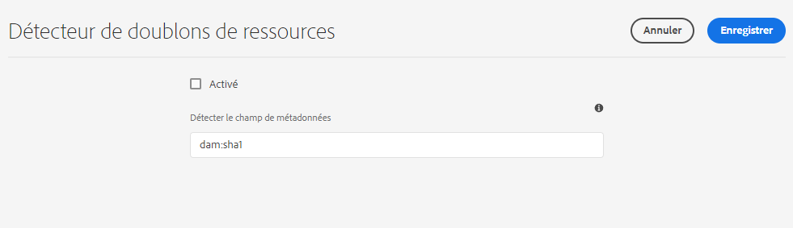

# Détection des ressources en double {#detect-duplicate-assets}

| Version | Lien de l’article |
| -------- | ---------------------------- |
| AEM 6.5 | [Cliquez ici](https://experienceleague.adobe.com/docs/experience-manager-65/assets/managing/duplicate-detection.html?lang=en) |
| AEM as a Cloud Service | Cet article |

Si un utilisateur DAM charge une ou plusieurs ressources qui existent déjà dans le référentiel, [!DNL Experience Manager] détecte la duplication et en informe l’utilisateur. La détection des doublons est désactivée par défaut, car elle peut avoir un impact sur les performances en fonction de la taille du référentiel et du nombre de ressources chargées.

Pour activer cette fonction :

1. Accédez à **[!UICONTROL Outils > Ressources > Configurations des ressources]**.

1. Cliquez sur **[!UICONTROL Détecteur de doublons de ressources]**.

1. Dans la [!UICONTROL page Détecteur de doublons de ressources], cliquez sur **[!UICONTROL Activé]**.

   La valeur `dam:sha1` pour Détecter le champ de métadonnées garantit que les ressources en double sont détectées même si les noms de fichier sont différents.

1. Cliquez sur **[!UICONTROL Enregistrer]**.

   

>[!NOTE]
>
>Si vous avez configuré le détecteur de duplication à l’aide `/apps/example/config.author/com.adobe.cq.assetcompute.impl.assetprocessor.AssetDuplicationDetector.cfg.json` fichier de configuration (configuration OSGi), vous pouvez continuer à l’utiliser. Cependant, Adobe recommande d’utiliser la nouvelle méthode .

Une fois activé, Experience Manager envoie des notifications de ressources en double vers la boîte de réception Experience Manager. Il s’agit d’un résultat global correspondant à plusieurs doublons. Les utilisateurs peuvent choisir de supprimer les ressources en fonction des résultats.

>[!NOTE]
>
>Lorsque vous chargez des ressources vers le référentiel, Experience Manager détecte la duplication et vous informe des 100 premières ressources en double.

**Voir également**

* [Traduire les ressources](/help/assets/translate-assets.md)
* [API HTTP Assets](/help/assets/mac-api-assets.md)
* [Formats de fichiers pris en charge par Assets](/help/assets/file-format-support.md)
* [Rechercher des ressources](/help/assets/search-assets.md)
* [Ressources connectées](/help/assets/use-assets-across-connected-assets-instances.md)
* [Rapports de ressources](/help/assets/asset-reports.md)
* [Schémas de métadonnées](/help/assets/metadata-schemas.md)
* [Télécharger des ressources](/help/assets/download-assets-from-aem.md)
* [Gestion des métadonnées](/help/assets/manage-metadata.md)
* [Gérer les modèles Dynamic Media](/help/assets/dynamic-media/manage-dynamic-media-templates.md)
* [Gérer les rapports](/help/assets/manage-reports-assets-view.md)
* [Facettes de recherche](/help/assets/search-facets.md)
* [Gérer les collections](/help/assets/manage-collections.md)
* [Import des métadonnées en bloc](/help/assets/metadata-import-export.md)
* [Publier des ressources sur AEM et Dynamic Media](/help/assets/publish-assets-to-aem-and-dm.md)
