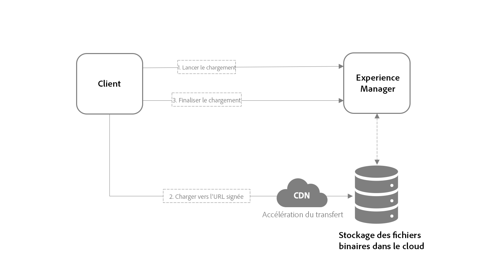

# Assets as a Cloud Service APIs {#assets-cloud-service-apis}

<!-- 
Give a list of and overview of all reference information available.
* New upload method
* Javadocs
* Assets HTTP API documented at [https://helpx.adobe.com/experience-manager/6-5/assets/using/mac-api-assets.html](https://helpx.adobe.com/experience-manager/6-5/assets/using/mac-api-assets.html)

-->

## Transfert de ressources {#asset-upload-technical}

Experience Manager en tant que service cloud offre une nouvelle méthode de téléchargement des ressources vers le référentiel : le transfert binaire direct vers le cloud binaire  le. Cette section présente son aperçu technique.

### Présentation du téléchargement binaire direct {#overview-binary-upload}

L’algorithme de haut niveau pour télécharger un fichier binaire est le suivant :

1. Envoyez une requête HTTP informant AEM de l’intention de télécharger un nouveau binaire.
1. Publiez le contenu du binaire sur un ou plusieurs URI fournis par la demande d’initialisation.
1. Envoyez une requête HTTP pour informer le serveur que le contenu du binaire a bien été téléchargé.



Les différences importantes par rapport aux versions antérieures d’AEM sont les suivantes :

* Les binaires ne passent pas par AEM, qui se contente maintenant de coordonner le processus de téléchargement avec le cloud binaire  le  configuré pour le déploiement
* Le de cloud binaire   est dirigé par un réseau Content (CDN, Edge Network), qui rapproche le point de fin de transfert du client, ce qui contribue à améliorer les performances de transfert et l’expérience utilisateur, en particulier pour les équipes distribuées qui téléchargent des ressources.

Cette approche doit permettre une gestion plus évolutive et plus performante des transferts de ressources.

> !![NOTE]
Pour consulter le code client qui implémente cette approche, reportez-vous à la bibliothèque open source [aem-upload](https://github.com/adobe/aem-upload)

### Lancer le transfert {#initiate-upload}

La première étape consiste à envoyer une requête HTTP POST au dossier dans lequel la ressource doit être créée ou mise à jour ; incluez le sélecteur `.initiateUpload.json` pour indiquer que la requête doit commencer un téléchargement binaire. Par exemple, le chemin d’accès au dossier dans lequel le fichier doit être créé est `/assets/folder`:

```
POST https://[aem_server]/content/dam/assets/folder.initiateUpload.json
````

Le type de contenu du corps de la requête doit être des données `application/x-www-form-urlencoded` de formulaire, contenant les champs suivants :

* `(string) fileName`: Requis. Nom du fichier tel qu’il apparaîtra dans l’instance.
* `(number) fileSize`: Requis. Longueur totale, en octets, du binaire à télécharger.

Notez qu’une seule requête peut être utilisée pour lancer des téléchargements pour plusieurs binaires, tant que chaque binaire contient les champs obligatoires.

En cas de succès, la requête répondra avec un code d’état 201 et un corps contenant des données JSON au format suivant :

```
{
    "completeURI": "(string)",
    "folderPath": (string)",
    "files": [
        {
            "fileName": "(string)",
            "mimeType": "(string)",
            "uploadToken": "(string)",
            "uploadURIs": [
                "(string)"
            ]
        }
    ]
}
````

* `(string) completeURI`: URI qui doit être appelé lorsque le téléchargement du binaire est terminé. Il peut s’agir d’un URI absolu ou relatif, et les clients doivent pouvoir gérer l’un ou l’autre. Par exemple, la valeur peut être `"https://author.acme.com/content/dam.completeUpload.json"` ou `"/content/dam.completeUpload.json"` (voir Téléchargement [complet](#complete-upload)).
* `(string) folderPath`: Chemin d’accès complet au dossier dans lequel le fichier binaire est téléchargé.
* `(array) (files)`: d’éléments dont la longueur et l’ordre correspondent à la longueur et à l’ordre du d’informations binaires fournies dans la demande de lancement.
* `(string) fileName`: Nom du binaire correspondant, tel qu’il est fourni dans la demande de lancement. Cette valeur doit être incluse dans la requête complète.
* `(string) mimeType`: Type MIME du binaire correspondant, tel qu’il est fourni dans la requête de lancement in. Cette valeur doit être incluse dans la requête complète.
* `(string) uploadToken`: Jeton de téléchargement pour le binaire correspondant. Cette valeur doit être incluse dans la requête complète.
* `(array) uploadURIs`: de chaînes dont les valeurs sont des URI complets vers lesquels le contenu du binaire doit être téléchargé (voir [Téléchargement du binaire](#upload-binary)).
* `(number) minPartSize`: Longueur minimale, en octets, des données pouvant être fournies à l’un des URI de téléchargement, s’il existe plusieurs URI.
* `(number) maxPartSize`: Longueur maximale, en octets, des données pouvant être fournies à l’un des URI de téléchargement, s’il existe plusieurs URI.

### Télécharger le fichier binaire {#upload-binary}

La sortie du déclenchement d’un transfert comprend une ou plusieurs valeurs URI de transfert. Si plusieurs URI sont fournis, il est de la responsabilité du client de &quot;diviser&quot; le binaire en parties et de POST chaque partie, dans l&#39;ordre, à chaque URI, dans l&#39;ordre. Tous les URI doivent être utilisés et chaque partie doit être supérieure à la taille minimale et inférieure à la taille maximale spécifiée dans la réponse de lancement. Ces requêtes seront traitées par les noeuds de bord CDN pour accélérer le transfert des binaires.

Pour ce faire, il est possible de calculer la taille de la pièce en fonction du nombre d’URI de téléchargement fournis par l’API. Exemple supposant que la taille totale du fichier binaire est de 20 000 octets et que le nombre d’URI de téléchargement est de 2 :

* Calculez la taille d’une pièce en divisant la taille totale par le nombre d’URI : 20 000 / 2 = 10 000
* La plage d’octets POST est comprise entre 0 et 9 999 du binaire et correspond au premier URI du des URI de téléchargement
* La plage d’octets POST est comprise entre 10 000 et 19 999 entre le binaire et le second URI dans le des URI de téléchargement

En cas de succès, le serveur répond à chaque requête avec un code d’ `201` état.

### Fin du téléchargement {#complete-upload}

Une fois toutes les parties d’un fichier binaire téléchargées, l’étape finale consiste à envoyer une requête HTTP POST à l’URI complet fourni par les données d’initialisation. Le type de contenu du corps de la requête doit être des données de formulaire/application`x-www-form-urlencoded` , contenant les champs suivants :

* `(string) fileName`: Requis. Nom de la ressource, tel que fourni par les données de début.
* `(string) mimeType`: Requis. Type de contenu HTTP du binaire, tel qu’il a été fourni par les données d’initiation.
* `(string) uploadToken`: Requis. Jeton de téléchargement pour le fichier binaire, tel que fourni par les données d’initiation.
* `(bool) createVersion`: Facultatif. S’il existe déjà une ressource portant le nom spécifié et si elle est vraie, l’instance crée une nouvelle version de la ressource.
* `(string) versionLabel`: Facultatif. Si une nouvelle version est créée, le libellé qui sera associé à la version.
* `(string) versionComment`: Facultatif. Si une nouvelle version est créée, les commentaires qui seront associés à la version.
* `(bool) replace`: Facultatif : Si la valeur est true et qu’un fichier portant le nom spécifié existe déjà, l’instance supprime le fichier, puis le recrée.

>!![NOTE]
>
> Si l’actif existe déjà et que vous ne spécifiez ni createVersion ni replace, l’instance met à jour la version actuelle de l’actif avec le nouveau binaire.

Tout comme le processus de lancement, les données de requête complètes peuvent contenir des informations pour plusieurs fichiers.

Le processus de téléchargement d’un fichier binaire n’est pas effectué tant que l’URL complète n’est pas appelée pour le fichier. Même si le fichier binaire d’un fichier est entièrement téléchargé, le fichier ne sera pas traité par l’instance tant que son processus de téléchargement n’est pas terminé.

En cas de réussite, le serveur répond par un code d’ `200` état.

### Bibliothèque de transfert Open Source {#open-source-upload-library}

Pour en savoir plus sur les algorithmes de téléchargement ou pour créer vos propres scripts et outils de téléchargement, Adobe fournit des bibliothèques et des outils Open Source comme point de départ :

* [Bibliothèque Open Source aem-upload](https://github.com/adobe/aem-upload)
* [Outil de ligne de commande Open Source](https://github.com/adobe/aio-cli-plugin-aem)

### API de transfert de ressources obsolètes {#deprecated-asset-upload-api}

<!-- #ENGCHECK review / update the list of deprecated APIs below -->

>[!NOTE]
Pour Experience Manager en tant que service Cloud, seules les nouvelles API de téléchargement sont prises en charge. Les API d’Experience Manager 6.5 sont obsolètes.

Les méthodes liées au téléchargement ou à la mise à jour de ressources ou de rendus (tout transfert binaire) sont obsolètes dans les API suivantes :

* [API HTTP AEM Assets](mac-api-assets.md)
* `AssetManager` API Java, comme `AssetManager.createAsset(..)`

>[!MORELIKETHIS]
* [Bibliothèque Open Source aem-upload](https://github.com/adobe/aem-upload)
* [Outil de ligne de commande Open Source](https://github.com/adobe/aio-cli-plugin-aem)


##  de traitement et de post-traitement des ressources {#post-processing-workflows}

La plupart du traitement des ressources est exécuté en fonction de la configuration du **[!UICONTROL de]** traitement par des microservices [de](asset-microservices-configure-and-use.md#get-started-using-asset-microservices)ressources et ne nécessite pas d’extensions de développeur.

Pour la configuration du processus de post-traitement,  AEM standard avec des extensions (par exemple, des étapes personnalisées peuvent être utilisées). Consultez la sous-section suivante pour comprendre quelles étapes de flux de travail peuvent être utilisées dans le  de post-traitement des ressources.

### Étapes du flux de travail dans le processus de post-traitement {#post-processing-workflows-steps}

>[!NOTE]
Cette section s’applique principalement aux clients qui effectuent une mise à jour vers AEM en tant que service Cloud à partir des versions précédentes d’AEM.

En raison d’un nouveau modèle de déploiement introduit avec Experience Manager en tant que service Cloud, certaines étapes de flux de travaux utilisées dans le `DAM Update Asset` flux de travaux avant l’introduction de microservices de ressources peuvent ne plus être prises en charge pour les  de post-traitement. Notez que la plupart d’entre elles sont remplacées par une configuration et une utilisation beaucoup plus simples des microservices de ressources.

Voici un  de modèles de flux de travaux techniques et de leur niveau de prise en charge dans AEM as a Cloud Service :

### Etapes de processus prises en charge {#supported-workflow-steps}

Les étapes de processus suivantes sont prises en charge dans le service Cloud.

* `com.day.cq.dam.similaritysearch.internal.workflow.process.AutoTagAssetProcess`
* `com.day.cq.dam.core.impl.process.CreateAssetLanguageCopyProcess`
* `com.day.cq.wcm.workflow.process.CreateVersionProcess`
* `com.day.cq.dam.similaritysearch.internal.workflow.smarttags.StartTrainingProcess`
* `com.day.cq.dam.similaritysearch.internal.workflow.smarttags.TransferTrainingDataProcess`
* `com.day.cq.dam.core.impl.process.TranslateAssetLanguageCopyProcess`
* `com.day.cq.dam.core.impl.process.UpdateAssetLanguageCopyProcess`
* `com.adobe.cq.workflow.replication.impl.ReplicationWorkflowProcess`
* `com.day.cq.dam.core.impl.process.DamUpdateAssetWorkflowCompletedProcess`

### Modèles non pris en charge ou remplacés {#unsupported-replaced-models}

Les modèles de processus techniques suivants sont remplacés par des microservices de ressources ou la prise en charge n’est pas disponible.

* `com.day.cq.dam.core.impl.process.DamMetadataWritebackWorkflowCompletedProcess`
* `com.day.cq.dam.core.process.DeleteImagePreviewProcess`
* `com.day.cq.dam.s7dam.common.process.DMEncodeVideoWorkflowCompletedProcess`
* `com.day.cq.dam.core.process.GateKeeperProcess`
* `com.day.cq.dam.core.process.AssetOffloadingProcess`
* `com.day.cq.dam.core.process.MetadataProcessorProcess`
* `com.day.cq.dam.core.process.XMPWritebackProcess`
* `com.adobe.cq.dam.dm.process.workflow.DMImageProcess`
* `com.day.cq.dam.s7dam.common.process.S7VideoThumbnailProcess`
* `com.day.cq.dam.scene7.impl.process.Scene7UploadProcess`
* `com.day.cq.dam.s7dam.common.process.VideoProxyServiceProcess`
* `com.day.cq.dam.s7dam.common.process.VideoThumbnailDownloadProcess`
* `com.day.cq.dam.s7dam.common.process.VideoUserUploadedThumbnailProcess`
* `com.day.cq.dam.core.process.CreatePdfPreviewProcess`
* `com.day.cq.dam.core.process.CreateWebEnabledImageProcess`
* `com.day.cq.dam.video.FFMpegThumbnailProcess`
* `com.day.cq.dam.core.process.ThumbnailProcess`
* `com.day.cq.dam.cameraraw.process.CameraRawHandlingProcess`
* `com.day.cq.dam.core.process.CommandLineProcess`
* `com.day.cq.dam.pdfrasterizer.process.PdfRasterizerHandlingProcess`
* `com.day.cq.dam.core.process.AddPropertyWorkflowProcess`
* `com.day.cq.dam.core.process.CreateSubAssetsProcess`
* `com.day.cq.dam.core.process.DownloadAssetProcess`
* `com.day.cq.dam.word.process.ExtractImagesProcess`
* `com.day.cq.dam.word.process.ExtractPlainProcess`
* `com.day.cq.dam.video.FFMpegTranscodeProcess`
* `com.day.cq.dam.ids.impl.process.IDSJobProcess`
* `com.day.cq.dam.indd.process.INDDMediaExtractProcess`
* `com.day.cq.dam.indd.process.INDDPageExtractProcess`
* `com.day.cq.dam.core.impl.lightbox.LightboxUpdateAssetProcess`
* `com.day.cq.dam.pim.impl.sourcing.upload.process.ProductAssetsUploadProcess`
* `com.day.cq.dam.core.process.ScheduledPublishBPProcess`
* `com.day.cq.dam.core.process.ScheduledUnPublishBPProcess`
* `com.day.cq.dam.core.process.SendDownloadAssetEmailProcess`
* `com.day.cq.dam.core.impl.process.SendTransientWorkflowCompletedEmailProcess`

<!-- PPTX source: slide in add-assets.md - overview of direct binary upload section of 
https://adobe-my.sharepoint.com/personal/gklebus_adobe_com/_layouts/15/guestaccess.aspx?guestaccesstoken=jexDC5ZnepXSt6dTPciH66TzckS1BPEfdaZuSgHugL8%3D&docid=2_1ec37f0bd4cc74354b4f481cd420e07fc&rev=1&e=CdgElS
-->
