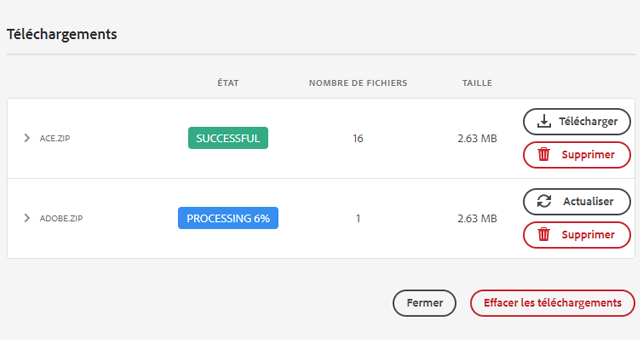

# Télécharger des ressources depuis [!DNL Adobe Experience Manager] {#download-assets-from-aem}

<table>
    <tr>
        <td>
            <sup style= "background-color:#008000; color:#FFFFFF; font-weight:bold"><i>Nouveau</i></sup> <a href="/help/assets/dynamic-media/dm-prime-ultimate.md"><b>Dynamic Media Prime et Ultimate</b></a>
        </td>
        <td>
            <sup style= "background-color:#008000; color:#FFFFFF; font-weight:bold"><i>Nouveau</i></sup> <a href="/help/assets/assets-ultimate-overview.md"><b>AEM Assets Ultimate</b></a>
        </td>
        <td>
            <sup style= "background-color:#008000; color:#FFFFFF; font-weight:bold"><i>Nouvelle</i></sup> <a href="/help/assets/integrate-aem-assets-edge-delivery-services.md"><b>Intégration d’AEM Assets à Edge Delivery Services</b></a>
        </td>
        <td>
            <sup style= "background-color:#008000; color:#FFFFFF; font-weight:bold"><i>Nouveau</i></sup> <a href="/help/assets/aem-assets-view-ui-extensibility.md"><b>Extensibilité de l’interface utilisateur</b></a>
        </td>
          <td>
            <sup style= "background-color:#008000; color:#FFFFFF; font-weight:bold"><i>Nouveau</i></sup> <a href="/help/assets/dynamic-media/enable-dynamic-media-prime-and-ultimate.md"><b>Activation de Dynamic Media Prime et Ultimate</b></a>
        </td>
    </tr>
    <tr>
        <td>
            <a href="/help/assets/search-best-practices.md"><b>Bonnes pratiques de recherche</b></a>
        </td>
        <td>
            <a href="/help/assets/metadata-best-practices.md"><b>Bonnes pratiques relatives aux métadonnées</b></a>
        </td>
        <td>
            <a href="/help/assets/product-overview.md"><b>Hub de contenus</b></a>
        </td>
        <td>
            <a href="/help/assets/dynamic-media-open-apis-overview.md"><b>Fonctionnalités Dynamic Media avec OpenAPI</b></a>
        </td>
        <td>
            <a href="https://developer.adobe.com/experience-cloud/experience-manager-apis/"><b>Documentation de développement pour AEM Assets</b></a>
        </td>
    </tr>
</table>

| Version | Lien de l’article |
| -------- | ---------------------------- |
| AEM 6.5 | [Cliquez ici](https://experienceleague.adobe.com/docs/experience-manager-65/assets/managing/download-assets-from-aem.html?lang=fr) |
| AEM as a Cloud Service | Cet article |

Vous pouvez télécharger des ressources, dont des rendus statiques et dynamiques. Vous pouvez également envoyer des liens vers des ressources par courrier électronique, directement depuis [!DNL Adobe Experience Manager Assets]. Les ressources téléchargées sont regroupées dans un fichier ZIP. <!-- The compressed ZIP file has a maximum file size of 1 GB for the export job. A maximum of 500 total assets per export job are allowed. -->

<!--
>[!NOTE]
>
>Recipients of emails must be members of the `dam-users` group to access the ZIP download link in the email message. To be able to download the assets, the members must have permissions to launch workflows that trigger downloading of assets.
-->

Les types de ressources suivants ne peuvent pas être téléchargés : visionneuses d’images, visionneuses à 360°, visionneuses de supports variés et visionneuses de carrousel.

Vous pouvez télécharger des ressources à partir d’Experience Manager à l’aide des méthodes suivantes :

<!-- * [Link Share](#link-share-download) -->

* [Interface utilisateur d’Experience Manager](#download-assets)
* [Asset Share Commons](https://adobe-marketing-cloud.github.io/asset-share-commons/)
* [Brand Portal](https://experienceleague.adobe.com/docs/experience-manager-brand-portal/using/introduction/brand-portal.html?lang=fr)
* [Appli de bureau](https://experienceleague.adobe.com/docs/experience-manager-desktop-app/using/using.html?lang=fr#download-assets)

## Télécharger des ressources à l’aide de l’interface [!DNL Experience Manager]  {#download-assets}

Experience Manager optimise l’expérience de téléchargement en fonction de la quantité et de la taille des ressources. Les fichiers plus petits sont téléchargés en temps réel depuis l’interface utilisateur. [!DNL Experience Manager] télécharge directement les requêtes de ressources uniques pour le fichier original au lieu de compresser les ressources uniques dans une archive ZIP afin de permettre des téléchargements plus rapides. Experience Manager prend en charge les téléchargements volumineux avec des requêtes asynchrones. Les requêtes de téléchargement dʼune taille supérieure à 100 Go sont divisées en plusieurs archives ZIP, dʼune taille maximale de 100 Go chacune.

Par défaut, [!DNL Experience Manager] déclenche une notification dans la [[!DNL Experience Manager] Boîte de réception](/help/sites-cloud/authoring/inbox.md) lorsque qu’une archive de téléchargement est générée.


### Activer les notifications par e-mail pour les téléchargements volumineux {#enable-emails-for-large-downloads}

Les téléchargements asynchrones sont déclenchés dans l’un des cas suivants :

* S’il y a plus de dix ressources
* Si la taille de téléchargement est supérieure à 100 Mo
* Si la préparation du téléchargement prend plus de 30 secondes

Bien que le téléchargement asynchrone s’exécute sur le serveur principal, l’utilisateur peut continuer à explorer et à travailler dans Experience Manager. Outre les notifications dans la boîte de réception d’Experience Manager, Experience Manager peut également envoyer des e-mails pour avertir l’utilisateur ou l’utilisatrice de la fin du processus de téléchargement. Pour activer cette fonctionnalité, les administrateurs et administratrices peuvent configurer le service e-mail en [configurant une connexion au serveur SMTP](https://experienceleague.adobe.com/docs/experience-manager-cloud-service/content/implementing/developing/development-guidelines.html?lang=fr#sending-email).

Une fois que le service de messagerie est configuré, les administrateurs et les utilisateurs peuvent activer les notifications par e-mail provenant de l’interface Experience Manager.

Pour activer les notifications par e-mail :

1. Connectez-vous à [!DNL Experience Manager Assets].
1. Cliquez sur l’icône utilisateur dans le coin supérieur droit, puis sur **[!UICONTROL Mes préférences]** pour afficher la fenêtre Préférences utilisateur.
1. Sélectionnez la case à cocher **[!UICONTROL Notifications par e-mail du téléchargement de ressources]** et cliquez sur **[!UICONTROL Accepter]**.

   


Pour télécharger des ressources, procédez comme suit :

1. Dans l’interface utilisateur d’[!DNL Experience Manager], cliquez sur **[!UICONTROL Ressources]** > **[!UICONTROL Fichiers]**.
1. Accédez aux ressources à télécharger. Sélectionnez le dossier ou une ou plusieurs ressources qu’il contient. Dans la barre d’outils, cliquez sur **[!UICONTROL Télécharger]**.

   ![Options disponibles lors du téléchargement de ressources à partir d’[!DNL Experience Manager Assets]](/help/assets/assets/asset-download1.png)

1. Dans la boîte de dialogue Télécharger, sélectionnez les options de téléchargement de votre choix.

   | Option de téléchargement | Description |
   |---|---|
   | **[!UICONTROL Créer un dossier distinct pour chaque ressource]** | Sélectionnez cette option pour créer un dossier pour chaque ressource contenant tous les rendus téléchargés de la ressource. Si cette option n’est pas sélectionnée, chaque ressource (et ses rendus s’ils sont sélectionnés pour le téléchargement) est contenue dans le dossier parent de l’archive générée. |
   | **[!UICONTROL E-mail]** | Sélectionnez cette option pour envoyer une notification par e-mail (contenant un lien vers votre téléchargement) à un autre utilisateur. Le destinataire doit être membre du groupe `dam-users`. Les modèles standard d’email sont disponibles aux emplacements suivants :<ul><li>`/libs/settings/dam/workflow/notification/email/downloadasset`.</li><li>`/libs/settings/dam/workflow/notification/email/transientworkflowcompleted`.</li></ul> Les modèles que vous personnalisez lors du déploiement sont disponibles aux emplacements suivants : <ul><li>`/apps/settings/dam/workflow/notification/email/downloadasset`.</li><li>`/apps/settings/dam/workflow/notification/email/transientworkflowcompleted`.</li></ul>Vous pouvez stocker des modèles personnalisés spécifiques au client à ces emplacements :<ul><li>`/conf/<tenant_specific_config_root>/settings/dam/workflow/notification/email/downloadasset`.</li><li>`/conf/<tenant_specific_config_root>/settings/dam/workflow/notification/email/transientworkflowcompleted`.</li></ul> |
   | **[!UICONTROL Ressource(s)]** | Sélectionnez cette option pour télécharger la ressource dans son format d’origine.<br>L’option Sous-ressources est disponible si la ressource d’origine comporte des sous-ressources. |
   | **[!UICONTROL Rendu(s)]** | Un rendu est une représentation binaire d’une ressource. Les ressources possèdent une représentation principale, à savoir celle du fichier téléchargé. Elles peuvent avoir un nombre illimité de représentations. <br> Avec cette option, vous pouvez sélectionner les rendus que vous souhaitez télécharger. Les rendus disponibles dépendent de la ressource que vous avez sélectionnée. |
   | **[!UICONTROL Recadrages intelligents]** | Sélectionnez cette option pour télécharger tous les rendus de recadrage intelligent de la ressource sélectionnée depuis [!DNL Experience Manager]. Un fichier zip contenant les rendus de recadrage intelligent est créé et téléchargé sur votre ordinateur local. |
   | **[!UICONTROL Rendu(s) dynamique(s)]** | Sélectionnez cette option pour générer une série de rendus alternatifs en temps réel. Lorsque vous sélectionnez cette option, vous sélectionnez également les rendus à créer dynamiquement dans la liste [Paramètre d’image prédéfini](/help/assets/dynamic-media/image-presets.md). <br>De plus, vous pouvez sélectionner la taille, l’unité de mesure, le format, l’espace colorimétrique, la résolution, ainsi que les éventuels modificateurs d’image (pour inverser l’image, par exemple). Cette option n’est disponible que si vous avez activé [!DNL Dynamic Media]. |

1. Dans la boîte de dialogue, cliquez sur **[!UICONTROL Télécharger]**.

   Si vous avez demandé à être averti en cas de téléchargement volumineux, vous recevrez un e-mail dans votre boîte de réception contenant une URL de téléchargement pour le dossier zip archivé. Cliquez sur le lien de téléchargement présent dans l’e-mail pour télécharger l’archive zip.

   

   Vous pouvez également consulter la notification dans votre boîte de réception [!DNL Experience Manager].

   

## Télécharger des ressources partagées à l’aide du partage de liens {#link-share-download}

Le partage de ressources au moyen d’un lien est très pratique pour le mettre à disposition des personnes intéressées sans avoir besoin de se connecter à [!DNL Assets]. Consultez la section [Fonctionnalité de partage de liens](/help/assets/share-assets.md#sharelink).

Lorsque les utilisateurs téléchargent des ressources à partir de liens partagés, [!DNL Assets] utilise un service asynchrone qui offre des téléchargements plus rapides et ininterrompus. Les ressources à télécharger sont placées en file d’attente en arrière-plan dans une boîte de réception dans les archives ZIP de taille de fichier gérable. Pour les téléchargements plus volumineux, le téléchargement est scindé en fichiers de 100 Go.

La [!UICONTROL boîte de réception de téléchargement] affiche l’état du traitement de chaque archive. Une fois le traitement terminé, vous pouvez télécharger les archives à partir de la boîte de réception.



## Activation du servlet de téléchargement de ressources {#enable-asset-download-servlet}

Le servlet par défaut d’[!DNL Experience Manager] permet aux utilisateurs et utilisatrices authentifiés d’émettre arbitrairement des requêtes de téléchargement simultanées de grande taille afin de créer des fichiers ZIP de ressources. La préparation des téléchargements peut avoir des conséquences sur les performances ou peut même surcharger le serveur et le réseau. Pour atténuer ces risques potentiels de déni de service, le composant OSGi `AssetDownloadServlet` est désactivé par défaut pour les instances de publication. Si vous n’avez pas besoin de la fonction de téléchargement sur les instances d’auteur, désactivez le servlet sur l’auteur.

Pour autoriser le téléchargement de DAM à partir de votre gestion des ressources numériques (par exemple, lors de l’utilisation d’Asset Share Commons ou une autre mise en œuvre de type portail), activez manuellement la servlet via une configuration OSGi. Adobe recommande de définir la taille de téléchargement autorisée aussi basse que possible, sans pour autant affecter les exigences de téléchargement quotidiennes. Une valeur élevée peut avoir une incidence sur les performances.

1. Créez un dossier avec une convention de nommage qui cible le mode d’exécution de publication, à savoir `config.publish` :

   `/apps/<your-app-name>/config.publish`

1. Dans le dossier de configuration, créez un fichier de type `nt:file` nommé `com.day.cq.dam.core.impl.servlet.AssetDownloadServlet.config`.
1. Remplissez `com.day.cq.dam.core.impl.servlet.AssetDownloadServlet.config` avec les éléments suivants. Définit une taille maximale (en octets) pour le téléchargement en tant que valeur de `asset.download.prezip.maxcontentsize`. L’exemple ci-dessous configure la taille maximale du téléchargement ZIP pour qu’il ne dépasse pas 100 Ko.

   ```java
   enabled=B"true"
   asset.download.prezip.maxcontentsize=I"102400"
   ```

## Désactivation du servlet de téléchargement de ressources {#disable-asset-download-servlet}

Si vous n’avez pas besoin de la fonctionnalité de téléchargement, désactivez le servlet pour éviter tout risque de déni de service. Le `Asset Download Servlet` peut être désactivé sur les instances d’auteur et de publication d’[!DNL Experience Manager] en mettant à jour la configuration du Dispatcher afin de bloquer toute demande de téléchargement de ressources. Le servlet peut également être désactivé manuellement par l’intermédiaire de la console OSGi.

1. Pour bloquer les requêtes de téléchargement de ressources via une configuration de Dispatcher, modifiez la configuration `dispatcher.any` et ajoutez une nouvelle règle à la [section /filter](https://experienceleague.adobe.com/docs/experience-manager-dispatcher/using/configuring/dispatcher-configuration.html?lang=fr#configuring).

   `/0100 { /type "deny" /url "*.assetdownload.zip/assets.zip*" }`

## Rendu OnTime ou OffTime {#on-off-time-rendition}

Pour activer le service `OnOffTimeAssetAccessFilter`, vous devez créer une configuration OSGi. Ce service permet de bloquer l’accès aux rendus et aux métadonnées en plus de la ressource elle-même en fonction des paramètres d’heure d’activation/de désactivation. La configuration OSGi doit être fournie à des fins d’`com.day.cq.dam.core.impl.servlet.OnOffTimeAssetAccessFilter`. Suivez les étapes ci-dessous :

1. Dans le code de votre projet dans Git, créez un fichier de configuration à l’adresse `/apps/system/config/com.day.cq.dam.core.impl.servlet.OnOffTimeAssetAccessFilter.cfg.json`. Le fichier doit contenir `{}` comme contenu, ce qui signifie une configuration OSGi vide pour le composant OSGi correspondant. Cette action active le service.
1. Déployez votre code, y compris cette nouvelle configuration, via [!DNL Cloud Manager].
1. Une fois déployés, les rendus et les métadonnées sont accessibles en fonction des paramètres d’heure d’activation/de désactivation des ressources. Si la date ou l’heure actuelle est antérieure à l’heure d’activation ou postérieure à l’heure de désactivation, un message d’erreur s’affiche.
Pour plus d’informations sur l’ajout d’une configuration OSGi vide, consultez ce [guide](https://experienceleague.adobe.com/docs/experience-manager-cloud-service/content/implementing/deploying/configuring-osgi.html?lang=fr).

## Conseils et restrictions {#tips-limitations}

* Si vous téléchargez un dossier vide, [!DNL Experience Manager] transmet un message de réussite concernant la création d’une archive ZIP, mais l’archive n’est pas créée.

**Voir également**

* [Traduire les ressources](translate-assets.md)
* [API HTTP Assets](mac-api-assets.md)
* [Formats de fichiers pris en charge par Assets](file-format-support.md)
* [Rechercher des ressources](search-assets.md)
* [Ressources connectées](use-assets-across-connected-assets-instances.md)
* [Rapports de ressources](asset-reports.md)
* [Schémas de métadonnées](metadata-schemas.md)
* [Gestion des métadonnées](manage-metadata.md)
* [Facettes de recherche](search-facets.md)
* [Gérer les collections](manage-collections.md)
* [Import des métadonnées en bloc](metadata-import-export.md)
* [Publier des ressources sur AEM et Dynamic Media](/help/assets/publish-assets-to-aem-and-dm.md)

>[!MORELIKETHIS]
>
>* [Téléchargement de ressources protégées par DRM](drm.md)
>* [Télécharger des ressources à l’aide de l’appli de bureau Experience Manager sur un poste de travail Windows ou Mac](https://experienceleague.adobe.com/docs/experience-manager-desktop-app/using/using.html?lang=fr)
>* [Télécharger des ressources à l’aide d’Adobe Assets Link depuis les applications Adobe Creative Cloud prises en charge](https://helpx.adobe.com/fr/enterprise/using/manage-assets-using-adobe-asset-link.html)
