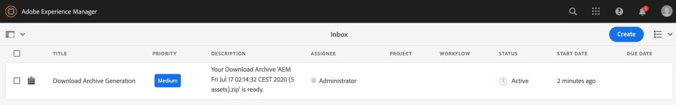

# Téléchargement de ressources depuis [!DNL Adobe Experience Manager] {#download-assets-from-aem}

Vous pouvez télécharger des ressources, dont des rendus statiques et dynamiques. Vous pouvez également envoyer des liens vers des ressources par courrier électronique, directement depuis [!DNL Adobe Experience Manager Assets]. Les ressources téléchargées sont compressées dans un fichier ZIP. <!-- The compressed ZIP file has a maximum file size of 1 GB for the export job. A maximum of 500 total assets per export job are allowed. -->

>[!NOTE]
>
>Les destinataires du courrier électronique doivent être membres du groupe `dam-users` pour accéder au lien de téléchargement ZIP contenu dans le message. Pour télécharger les ressources, ils doivent disposer des autorisations de lancement des workflows qui déclenchent le téléchargement.

Les types de ressources Visionneuses d’images, Visionneuses à 360°, Visionneuses de supports variés et Visionneuses de carrousel ne peuvent pas être téléchargés.

Vous pouvez télécharger des ressources Experience Manager à l’aide des méthodes suivantes :

<!-- * [Link Share](#link-share-download) -->

* [Interface utilisateur d’Experience Manager](#download-assets)
* [Asset Share Commons](https://adobe-marketing-cloud.github.io/asset-share-commons/)
* [Brand Portal](https://experienceleague.adobe.com/docs/experience-manager-brand-portal/using/introduction/brand-portal.html?lang=fr)
* [Appli de bureau](https://experienceleague.adobe.com/docs/experience-manager-desktop-app/using/using.html?lang=fr#download-assets)

## Téléchargement de ressources à l’aide de l’interface [!DNL Experience Manager] {#download-assets}

Le service de téléchargement asynchrone fournit un framework permettant le téléchargement transparent de ressources de grande taille. Les fichiers plus petits sont téléchargés en temps réel depuis l’interface utilisateur. [!DNL Experience Manager] ne archive pas les téléchargements de ressources uniques où le fichier d’origine est téléchargé. Cette fonctionnalité permet des téléchargements plus rapides. Les fichiers volumineux sont téléchargés de manière asynchrone et [!DNL Experience Manager] sont avertis de la fin par le biais de notifications dans la boîte de réception. Voir [comprendre [!DNL Experience Manager] Boîte de réception](/help/sites-cloud/authoring/getting-started/inbox.md).



*Figure : Notification de téléchargement via la boîte de réception d’[!DNL Experience Manager].*

Les téléchargements asynchrones sont déclenchés dans l’un ou l’autre des cas suivants :

* S’il y a plus de 10 ressources ou plus de 100 Mo à télécharger.
* Si la préparation du téléchargement prend plus de 30 secondes.

Pour télécharger des ressources, procédez comme suit :

1. Dans l’interface utilisateur d’[!DNL Experience Manager], cliquez sur **[!UICONTROL Ressources]** > **[!UICONTROL Fichiers]**.
1. Accédez aux ressources à télécharger. Sélectionnez le dossier ou une ou plusieurs ressources qu’il contient. Dans la barre d’outils, cliquez sur **[!UICONTROL Télécharger]**.

   ![Options disponibles lors du téléchargement de ressources à partir d’[!DNL Experience Manager Assets]](/help/assets/assets/asset-download1.png)

   *Figure : Options de la boîte de dialogue Télécharger.*

1. Dans la boîte de dialogue de téléchargement, sélectionnez les options de téléchargement de votre choix.

   | Option de téléchargement | Description |
   |---|---|
   | **[!UICONTROL Créer un dossier distinct pour chaque ressource]** | Sélectionnez cette option pour inclure chaque ressource que vous téléchargez (y compris les ressources dans des dossiers enfants imbriqués sous le dossier parent de la ressource) dans un dossier sur votre ordinateur local. Lorsque cette option *n’est pas* sélectionnée, par défaut, la hiérarchie de dossiers est ignorée et toutes les ressources sont téléchargées dans un dossier de votre ordinateur local. |
   | **[!UICONTROL Courrier électronique]** | Sélectionnez cette option pour envoyer une notification par email au destinataire. Les modèles standard d’email sont disponibles aux emplacements suivants :<ul><li>`/libs/settings/dam/workflow/notification/email/downloadasset`.</li><li>`/libs/settings/dam/workflow/notification/email/transientworkflowcompleted`.</li></ul> Les modèles que vous personnalisez lors du déploiement sont disponibles aux emplacements suivants : <ul><li>`/apps/settings/dam/workflow/notification/email/downloadasset`.</li><li>`/apps/settings/dam/workflow/notification/email/transientworkflowcompleted`.</li></ul>Vous pouvez stocker des modèles personnalisés spécifiques au client à ces emplacements :<ul><li>`/conf/<tenant_specific_config_root>/settings/dam/workflow/notification/email/downloadasset`.</li><li>`/conf/<tenant_specific_config_root>/settings/dam/workflow/notification/email/transientworkflowcompleted`.</li></ul> |
   | **[!UICONTROL Ressource(s)]** | Sélectionnez cette option pour télécharger la ressource dans son format d’origine sans aucun rendu.<br>L’option Sous-ressources est disponible si la ressource d’origine comporte des sous-ressources. |
   | **[!UICONTROL Rendu(s)]** | Un rendu est une représentation binaire d’une ressource. Les ressources possèdent une représentation principale, à savoir celle du fichier transféré. Elles peuvent avoir un nombre illimité de représentations. <br> Avec cette option, vous pouvez sélectionner les rendus que vous souhaitez télécharger. Les rendus disponibles dépendent de la ressource que vous avez sélectionnée. |
   | **[!UICONTROL Recadrages intelligents]** | Sélectionnez cette option pour télécharger tous les rendus de recadrage intelligent de la ressource sélectionnée depuis [!DNL Experience Manager]. Un fichier zip contenant les rendus de recadrage intelligent est créé et téléchargé sur votre ordinateur local. |
   | **[!UICONTROL Rendu(s) dynamique(s)]** | Sélectionnez cette option pour générer une série de rendus alternatifs en temps réel. Lorsque vous sélectionnez cette option, vous sélectionnez également les rendus à créer dynamiquement dans la liste [Paramètre d’image prédéfini](/help/assets/dynamic-media/image-presets.md). <br>De plus, vous pouvez sélectionner la taille, l’unité de mesure, le format, l’espace colorimétrique, la résolution, ainsi que les éventuels modificateurs d’image (pour inverser l’image, par exemple). Cette option n’est disponible que si vous avez activé [!DNL Dynamic Media]. |

1. Dans la boîte de dialogue, cliquez sur **[!UICONTROL Télécharger]**.

<!-- TBD: Commenting from May release because the feature is moved to June release 2021.6.0.
## Download assets shared using link sharing {#link-share-download}

Sharing assets using a link is a convenient way to make it available to interested people without them having to first log in to [!DNL Assets]. To generate a URL to share assets, use the [Link Share functionality](/help/assets/share-assets.md#sharelink). 

When users download assets from shared links, [!DNL Assets] uses an asynchronous service that offers faster and and uninterrupted downloads. The assets to be downloaded are queued in the background in an inbox into ZIP archives of manageable file size. For very large downloads, the download is chunked into files of 100 GB in size.

The inbox displays the processing status of each archive. Once the processing is complete, you can download the archives from the inbox.


-->

## Activation du servlet de téléchargement de ressources {#enable-asset-download-servlet}

Le servlet par défaut d’[!DNL Experience Manager] permet aux utilisateurs authentifiés d’émettre des demandes de téléchargement simultanées de grande taille et de taille arbitraire afin de créer des fichiers ZIP de ressources. La préparation des téléchargements peut avoir des conséquences sur les performances ou peut même surcharger le serveur et le réseau. Pour atténuer ces risques potentiels de déni de service, le composant OSGi `AssetDownloadServlet` est désactivé par défaut pour les instances de publication. Si vous n’avez pas besoin de la fonction de téléchargement sur les instances d’auteur, désactivez le servlet sur l’auteur.

Pour permettre le téléchargement de fichiers depuis votre DAM (par exemple, lorsque vous utilisez un élément comme Asset Share Commons ou une autre implémentation de type portail), activez manuellement le servlet via une configuration OSGi. Adobe recommande de définir la taille de téléchargement autorisée sur la valeur la plus basse possible sans affecter les exigences de téléchargement au quotidien. Une valeur élevée peut avoir une incidence sur les performances.

1. Créez un dossier avec une convention d’affectation de noms qui cible le mode d’exécution de publication, à savoir `config.publish` :

   `/apps/<your-app-name>/config.publish`

1. Dans le dossier de configuration, créez un fichier de type `nt:file` nommé `com.day.cq.dam.core.impl.servlet.AssetDownloadServlet.config`.
1. Remplissez `com.day.cq.dam.core.impl.servlet.AssetDownloadServlet.config` avec les éléments suivants. Définit une taille maximale (en octets) pour le téléchargement en tant que valeur de `asset.download.prezip.maxcontentsize`. L’exemple ci-dessous configure la taille maximale du téléchargement ZIP pour qu’il ne dépasse pas 100 Ko.

   ```java
   enabled=B"true"
   asset.download.prezip.maxcontentsize=I"102400"
   ```

## Désactivation du servlet de téléchargement de ressources {#disable-asset-download-servlet}

Si vous n’avez pas besoin de la fonctionnalité de téléchargement, désactivez le servlet pour éviter tout risque de déni de service. La fonction `Asset Download Servlet` peut être désactivée sur les instances [!DNL Experience Manager] d’auteur et de publication en mettant à jour la configuration du Dispatcher afin de bloquer toute demande de téléchargement de ressources. Le servlet peut également être désactivé manuellement par l’intermédiaire de la console OSGi.

1. Pour bloquer les requêtes de téléchargement de ressources via une configuration de Dispatcher, modifiez la configuration `dispatcher.any` et ajoutez une nouvelle règle à la [section /filter](https://experienceleague.adobe.com/docs/experience-manager-dispatcher/using/configuring/dispatcher-configuration.html?lang=fr#configuring).

   `/0100 { /type "deny" /url "*.assetdownload.zip/assets.zip*" }`

>[!MORELIKETHIS]
>
>* [Téléchargement de ressources protégées par DRM](drm.md)
* [Téléchargement de ressources à l’aide de l’appli de bureau Experience Manager sur un poste de travail Windows ou Mac](https://helpx.adobe.com/fr/experience-manager/desktop-app/aem-desktop-app.html)
* [Téléchargement de ressources à l’aide d’Adobe Assets Link depuis les applications Adobe Creative Cloud prises en charge](https://helpx.adobe.com/fr/enterprise/using/manage-assets-using-adobe-asset-link.html)

