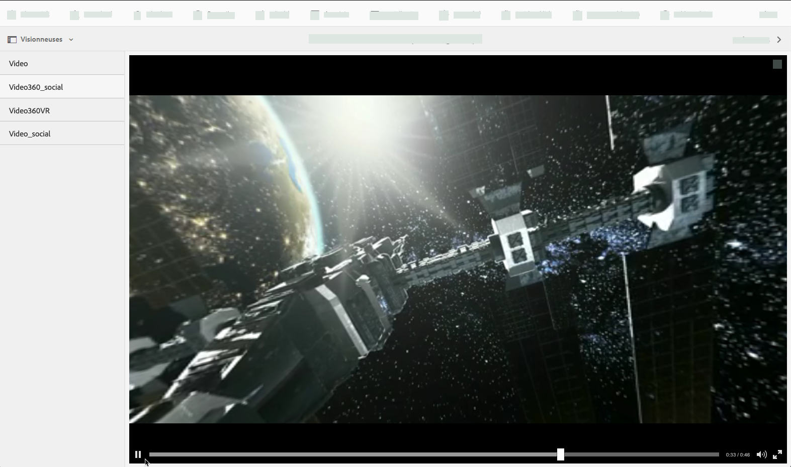
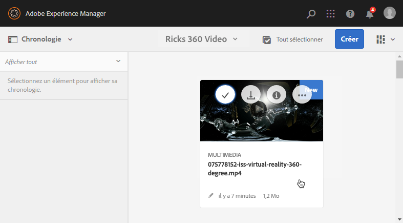
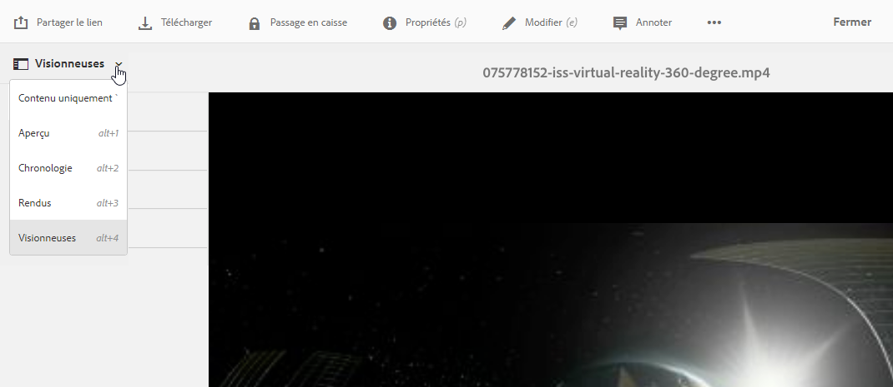
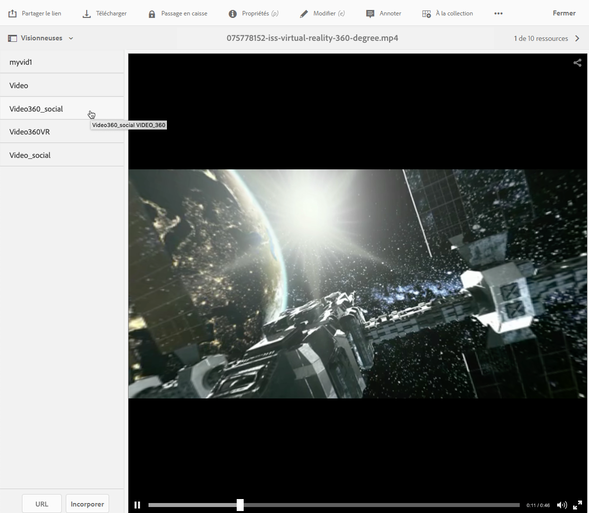
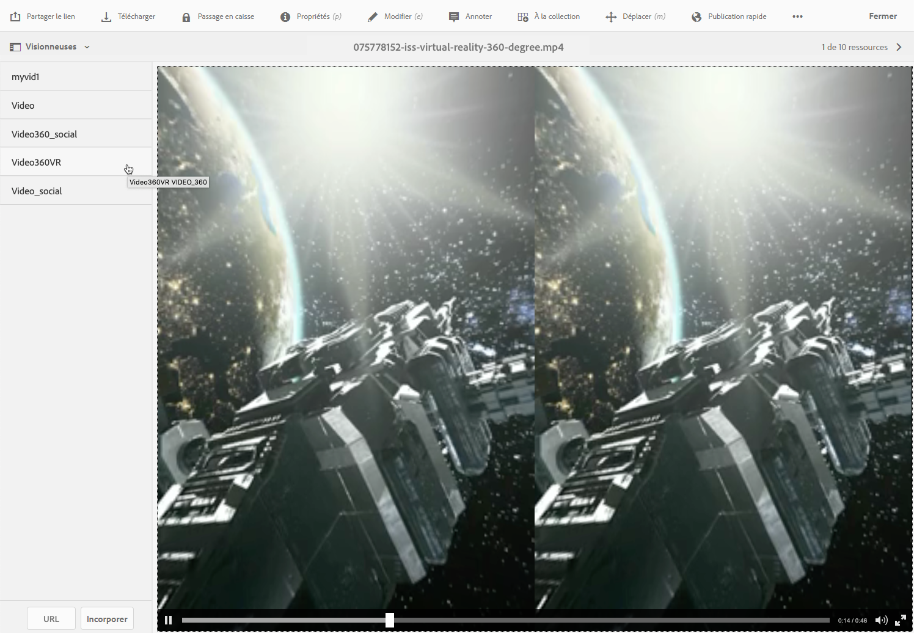

# Vidéo 360/VR {#vr-video}

<table>
    <tr>
        <td>
            <i>Nouveau</i> <a href="/help/assets/dynamic-media/dm-prime-ultimate.md"><b>Dynamic Media Prime et Ultimate</b></a>
        </td>
        <td>
            <i>Nouveau</i> <a href="/help/assets/assets-ultimate-overview.md"><b>AEM Assets Ultimate</b></a>
        </td>
        <td>
            <i>Nouvelle</i> <a href="/help/assets/integrate-aem-assets-edge-delivery-services.md"><b>Intégration d’AEM Assets à Edge Delivery Services</b></a>
        </td>
        <td>
            <i>Nouveau</i> <a href="/help/assets/aem-assets-view-ui-extensibility.md"><b>Extensibilité de l’interface utilisateur</b></a>
        </td>
          <td>
            <i>Nouveau</i> <a href="/help/assets/dynamic-media/enable-dynamic-media-prime-and-ultimate.md"><b>Activation de Dynamic Media Prime et Ultimate</b></a>
        </td>
    </tr>
    <tr>
        <td>
            <a href="/help/assets/search-best-practices.md"><b>Bonnes pratiques de recherche</b></a>
        </td>
        <td>
            <a href="/help/assets/metadata-best-practices.md"><b>Bonnes pratiques relatives aux métadonnées</b></a>
        </td>
        <td>
            <a href="/help/assets/product-overview.md"><b>Hub de contenus</b></a>
        </td>
        <td>
            <a href="/help/assets/dynamic-media-open-apis-overview.md"><b>Fonctionnalités Dynamic Media avec OpenAPI</b></a>
        </td>
        <td>
            <a href="https://developer.adobe.com/experience-cloud/experience-manager-apis/"><b>Documentation de développement pour AEM Assets</b></a>
        </td>
    </tr>
</table>

Les vidéos à 360° enregistrent une vue dans toutes les directions au même moment. Elles sont tournées à l’aide d’une caméra omnidirectionnelle ou d’un ensemble de caméras. Lors de la lecture sur un écran plat, l’utilisateur contrôle l’angle de vue ; la lecture sur les appareils mobiles applique généralement les commandes gyroscopiques intégrées.

Dynamic Media inclut une prise en charge native de la diffusion de ressources vidéo 360. Par défaut, aucune configuration supplémentaire n’est nécessaire pour l’affichage ou la lecture. Vous diffusez une vidéo 360 avec des extensions vidéo standard telles que .mp4, .mkv et .mov. Le codec le plus courant est H.264.

Vous pouvez utiliser la visionneuse vidéo 360/VR pour effectuer le rendu d’une vidéo équirectangulaire. Le résultat est une expérience de visualisation immersive d’une pièce, d’un bien immobilier, d’un lieu, d’un paysage, d’une procédure médicale, etc.

L’audio spatial n’est actuellement pas pris en charge ; si l’audio est mixé en stéréo, la balance (G/D) ne change pas lorsque le client change l’angle de vue de la caméra.

Voir [Utilisation de vidéos 360 Dynamic Media et d’une miniature vidéo personnalisée avec AEM Assets](https://experienceleague.adobe.com/docs/experience-manager-learn/assets/dynamic-media/dynamic-media-360-video-custom-thumbnail-feature-video-use.html?lang=fr#dynamic-media).

Voir également [Gestion des paramètres prédéfinis de visionneuse](/help/assets/dynamic-media/managing-viewer-presets.md).

## Vidéo 360 en action {#video-in-action}

Sélectionnez [Station spatiale 360](https://s7d1.scene7.com/s7viewers/html5/Video360Viewer.html?asset=Viewers/space_station_360-AVS) pour ouvrir une fenêtre de navigateur et visionner une vidéo à 360°. Pendant la lecture vidéo, faites glisser le pointeur vers un nouvel emplacement pour modifier l’angle de vue.

*Image vidéo de la station spatiale 360*

## Vidéo 360/VR et Adobe Premiere Pro {#vr-video-and-adobe-premiere-pro}

Vous pouvez utiliser Adobe Premier Pro pour visualiser et modifier des séquences vidéo 360/VR. Par exemple, vous pouvez placer correctement des logos et du texte dans une scène et appliquer des effets et des transitions conçus spécifiquement pour les médias équirectangulaires.

Voir [Modification de la vidéo 360/VR](https://helpx.adobe.com/fr/premiere-pro/how-to/edit-360-vr-video.html).

## Chargement de ressources pour une utilisation avec la visionneuse de vidéos 360 {#uploading-assets-for-use-with-the-video-viewer}

Les ressources vidéo 360 chargées dans [!DNL Experience Manager] sont considérées comme des fichiers **multimédias** sur une page de ressource, tout comme une ressource vidéo normale.

*Ressource vidéo 360 chargée et affichée en mode Carte. La ressource est considérée comme multimédia.*

**Chargement de ressources pour une utilisation avec la visionneuse de vidéos 360 :**

1. Créez un dossier dédié à votre ressource vidéo 360.
1. [Appliquez un profil de vidéo adaptative au dossier](/help/assets/dynamic-media/video-profiles.md#applying-a-video-profile-to-folders).

   Les exigences du rendu de contenu vidéo 360 sont plus élevées pour la résolution vidéo source et pour la résolution des rendus codée que pour le contenu vidéo standard.

   Vous pouvez utiliser le profil de vidéo adaptative prêt à l’emploi qui est déjà fourni avec Dynamic Media. Toutefois, cela aboutira à une qualité de la vidéo 360 visiblement inférieure à celle que vous obtiendriez pour une vidéo standard encodée, avec les mêmes paramètres rendus avec une visionneuse vidéo standard. Par conséquent, si une vidéo 360 de qualité supérieure est requise, procédez comme suit :

   * Idéalement, votre contenu vidéo 360 d’origine a l’une des résolutions suivantes :

      * 1080p – 1920 x 1080, connu sous le nom de résolution Full HD ou FHD ou,
      * 2160p – 3840 x 2160, connu sous le nom de résolution 4K, UHD ou Ultra HD. Cette résolution d’affichage importante est le plus souvent utilisée sur les téléviseurs et moniteurs d’ordinateur Premium. La résolution 2160p est souvent appelée « 4K », car la largeur est proche de 4 000 pixels. En d’autres termes, elle offre quatre fois plus de pixels que la résolution 1080p.

   * [Créez un profil de vidéo adaptative personnalisé](/help/assets/dynamic-media/video-profiles.md#creating-a-video-encoding-profile-for-adaptive-streaming) avec des rendus de qualité supérieure. Par exemple, vous pouvez créer un profil de vidéo adaptative qui contient les trois paramètres suivants :

      * Width=auto; Height=720; Bit rate=2500 kbps
      * Width=auto; Height=1080; Bit rate=5000 kbps
      * Width=auto; Height=1440; Bit rate=6600 kbps

   * Traitez le contenu vidéo 360 dans un dossier destiné exclusivement aux ressources vidéo 360.

   Cette approche impose des exigences plus élevées au réseau et au CPU de l’utilisateur.

1. [Chargez votre vidéo dans le dossier](/help/assets/manage-video-assets.md#upload-and-preview-video-assets).

<!--

## Overriding the default aspect ratio of 360 videos  {#overriding-the-default-aspect-ratio-of-videos}

For an uploaded asset to qualify as a 360 video that you intend to use with the 360 Video viewer, the asset must have an aspect ratio of 2.

By default, AEM detects video as "360" if its aspect ratio (width/height) is 2.0. If you are an Administrator, you can override the default aspect ratio setting of 2 by setting the optional `s7video360AR` property in CRXDE Lite at the following:

* `/conf/global/settings/cloudconfigs/dmscene7/jcr:content`

  * **Property type**: Double
  * **Value**: floating-point aspect ratio, default 2.0.

After you set this property, it takes effect immediately on both existing videos and newly uploaded videos.

The aspect ratio applies to 360 video assets for the asset details page and the [Video 360 Media WCM component](/help/assets/dynamic-media/adding-dynamic-media-assets-to-pages.md#dynamic-media-components).

Start by uploading 360 Videos.

-->

## Aperçu d’une vidéo 360 {#previewing-video}

Vous pouvez utiliser l’option de prévisualisation pour déterminer comment les clients voient votre vidéo 360 et vous assurer qu’elle se comporte comme prévu.

Voir également [Modification de paramètres de visionneuse prédéfinis](/help/assets/dynamic-media/managing-viewer-presets.md#editing-viewer-presets).

Lorsque vous êtes satisfait de la vidéo 360, vous pouvez la publier.

Voir [Incorporation de la visionneuse de vidéos ou d’images dans une page web](/help/assets/dynamic-media/embed-code.md).
Voir [Liaison d’URL à une application web](/help/assets/dynamic-media/linking-urls-to-yourwebapplication.md). La méthode de liaison basée sur une URL n’est pas possible si votre contenu interactif contient des liens avec des URL relatives, en particulier des liens vers des pages [!DNL Experience Manager Sites].
Reportez-vous à la section [Ajout de ressources Dynamic Media aux pages](/help/assets/dynamic-media/adding-dynamic-media-assets-to-pages.md).

**Prévisualisation de vidéos 360:**

1. Dans **[!UICONTROL Assets]**, accédez à une vidéo 360 que vous avez créée. Pour l’ouvrir en mode prévisualisation, sélectionnez la ressource vidéo 360.

   

   Pour prévisualiser la vidéo, sélectionnez la ressource vidéo 360.

1. Dans la page d’aperçu, dans le coin supérieur gauche de la page, sélectionnez le menu déroulant puis sélectionnez **[!UICONTROL Visionneuses]**.

   

   Dans la liste des visionneuses, sélectionnez **[!UICONTROL Video360_social]**, puis effectuez l’une des opérations suivantes :

   * Pour modifier l’angle d’affichage de la scène statique, faites glisser le pointeur sur la vidéo.
   * Pour commencer la lecture, sélectionnez le bouton **[!UICONTROL Lecture]** de la vidéo. Pendant la lecture de la vidéo, faites glisser le pointeur sur la vidéo pour modifier l’angle de visionnage.

   *Capture d’écran d’une vidéo 360.*

   * Dans la liste des visionneuses, sélectionnez **[!UICONTROL Video360VR]**.

     Une vidéo de réalité virtuelle (VR) est un contenu vidéo immersif accessible grâce à un casque de réalité virtuelle. À l’instar des vidéos ordinaires, vous créez une vidéo de réalité virtuelle au début, lorsqu’elle est en cours d’enregistrement ou capturée à l’aide de caméras à 360°.

   
   *Capture d’écran d’une vidéo 360 VR.*

1. Dans le coin supérieur droit de la page, sélectionnez **[!UICONTROL Fermer]**.

## Publication d’une vidéo 360 {#publishing-video}

Pour utiliser la vidéo 360, vous devez la publier. La publication d’une vidéo 360 active l’URL et le code intégré. Elle publie également la vidéo 360 sur le cloud Dynamic Media intégré au CDN pour un débit évolutif et performant.

Voir [Publication de ressources Dynamic Media](/help/assets/dynamic-media/publishing-dynamicmedia-assets.md) pour savoir comment publier des vidéos 360.
Voir aussi [Incorporation de la visionneuse de vidéos ou d’images dans une page web](/help/assets/dynamic-media/embed-code.md).
Voir aussi [Liaison d’URL à une application web](/help/assets/dynamic-media/linking-urls-to-yourwebapplication.md). La méthode de liaison basée sur une URL n’est pas possible si votre contenu interactif contient des liens avec des URL relatives, en particulier des liens vers des pages [!DNL Experience Manager Sites].
Voir aussi [Ajout de ressources Dynamic Media aux pages](/help/assets/dynamic-media/adding-dynamic-media-assets-to-pages.md).
