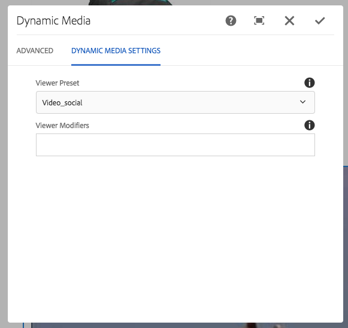

# Ajout de ressources Dynamic Media aux pages{#adding-dynamic-media-assets-to-pages}

Pour ajouter la fonction de média dynamique aux ressources que vous utilisez sur des sites web, vous pouvez ajouter le composant **Dynamic Media**, **Interactive Media**, **Panoramic Media**, ou **Video 360 Media** directement à la page. Pour ce faire, vous devez activer le mode Mise en page et activer les composants Dynamic Media. Vous pouvez alors ajouter ces composants à la page et ajouter des ressources au composant. Les composants Dynamic Media sont intelligents : ils détectent si vous ajoutez une image ou une vidéo et les options de configuration disponibles changent en conséquence.

Vous ajoutez directement des ressources de contenu multimédia dynamique à la page si vous utilisez AEM comme gestion de contenu Web. Si vous utilisez un système de gestion de contenu web tiers, vous devez [lier](/help/assets/dynamic-media/linking-urls-to-yourwebapplication.md) ou [incorporer](/help/assets/dynamic-media/embed-code.md) vos ressources. Pour obtenir un site web tiers réactif, voir [Diffusion d’images optimisées pour un site réactif](/help/assets/dynamic-media/responsive-site.md).

>[!NOTE]
>
>Vous devez publier les ressources avant de les ajouter aux pages d’AEM. Voir [Publication de ressources Dynamic Media](/help/assets/dynamic-media/publishing-dynamicmedia-assets.md).

## Ajout d’un composant Dynamic Media à une page {#adding-a-dynamic-media-component-to-a-page}

L’ajout d’un composant Dynamic Media, Interactive Media, Panoramic Media ou Video 360 Media à une page est identique à l’ajout d’un composant sur n’importe quelle page. Les composants Dynamic Media sont décrits dans les sections suivantes.

**Ajout d’un composant Dynamic Media à une page**

1. Dans AEM, ouvrez la page où vous souhaitez ajouter le composant Dynamic Media.
1. In the left pane, tap the **[!UICONTROL Components]** icon, then filter for Dynamic Media.

   Si aucun composant Contenu multimédia dynamique n’est disponible, vous devez activer ou activer les composants Contenu multimédia dynamique. Voir [Modification des modèles - Auteurs](/help/sites-cloud/authoring/features/templates.md) de modèles pour plus d’informations.

   

1. Faites glisser un composant **[!UICONTROL Dynamic Media]** et déposez-le à l’emplacement souhaité sur la page.

   Dans l’exemple ci-dessous, le composant **[!UICONTROL Video 360 Media]** est utilisé.

   

1. Placez le pointeur de la souris directement sur le composant. Lorsque le composant est entouré d’une zone bleue, appuyez une fois pour afficher la barre d’outils du composant. Tap the **[!UICONTROL Configuration (wrench)]** icon.

   

1. En fonction du composant Média dynamique que vous avez déposé sur la page, une boîte de dialogue de configuration s’ouvre. [Définissez les options du composant](/help/assets/dynamic-media/adding-dynamic-media-assets-to-pages.md#dynamic-media-components) selon vos besoins.

   L’exemple ci-dessous illustre la boîte de dialogue du composant Dynamic Media **[!UICONTROL Video 360 Media]** et les options disponibles dans la liste déroulante des paramètres prédéfinis de la visionneuse.

   

   Composant Dynamic Media Video 360 Media.

1. Lorsque vous avez terminé, près du coin supérieur droit de la boîte de dialogue, cochez la case pour enregistrer vos modifications.

## Localisation des composants Dynamic Media {#localizing-dynamic-media-components}

Vous pouvez rechercher les composants Dynamic Media de deux façons :

* Within a web page in Sites, open **[!UICONTROL Properties]** and select the **[!UICONTROL Advanced]** tab. Choisissez la langue souhaitée pour la localisation.

   

* Depuis le sélecteur de site, sélectionnez la page ou le groupe de pages souhaité. Tap **[!UICONTROL Properties]** and select the **[!UICONTROL Advanced]** tab. Choisissez la langue souhaitée pour la localisation.

   >[!NOTE]
   >
   >Please note that not all languages available in the **[!UICONTROL Language]** menu currently have tokens assigned.

## Composants de média dynamique disponibles {#dynamic-media-components}

Les composants Dynamic Media sont disponibles lorsque vous appuyez sur l’icône **[!UICONTROL Composants]**. Ensuite, choisissez le filtre **[!UICONTROL Dynamic Media]**.

Les composants Dynamic Media disponibles comprennent les suivants :

* **** Média dynamique : s’utilise pour les actifs tels que les images, les vidéos, les eCatalogs et les visionneuses à 360°.
* **[!UICONTROL Contenu multimédia]** interactif : à utiliser pour toutes les ressources interactives, telles que les vidéos interactives, les images interactives ou les visionneuses de carrousel.
* **[!UICONTROL Média]** panoramique - A utiliser pour les fichiers d&#39;image panoramique ou d&#39;image panoramique VR.
* **[!UICONTROL Vidéo 360 Media]** - Utilisation pour les fichiers vidéo 360 et 360 VR.

>[!NOTE]
>
>Ces composants ne sont pas disponibles par défaut et doivent être rendus disponibles via l’éditeur de modèles avant utilisation. Une fois les composants disponibles dans l’éditeur de modèles, vous pouvez les ajouter à votre page comme vous le feriez avec tout autre composant AEM.

### Composant : Contenu multimédia dynamique {#dynamic-media-component}

Le composant Contenu multimédia dynamique est intelligent. Selon que vous ajoutez une image ou une vidéo, vous disposez de différentes options. Le composant prend en charge les paramètres d’image prédéfinis, ainsi que les visionneuses d’images telles que les visionneuses d’images, les visionneuses à 360°, les visionneuses de médias mixtes et le contenu vidéo. En outre, le lecteur est réactif : la taille de l’écran change automatiquement en fonction de la taille de l’écran. Toutes les visionneuses sont des visionneuses HTML5.

>[!NOTE]
>
>Si votre page Web comporte les éléments suivants :
>
>* Plusieurs instances du composant Dynamic Media utilisé sur la même page.
>* Chaque instance utilise le même type d’actif.
>
>
Prenez en compte le fait que l’affectation d’un paramètre prédéfini de visionneuse différent à chaque composant Dynamic Media de cette page n’est pas prise en charge.
>
>Vous pouvez toutefois utiliser le même paramètre prédéfini de visionneuse pour tous les composants Dynamic Media qui utilisent des éléments du même type, dans la page.

Si vous ajoutez le composant Dynamic Media et si l’option **[!UICONTROL Paramètres de média dynamique]** est vide ou s’il est impossible d’ajouter correctement une ressource, vérifiez les points suivants :

* L’image possède un fichier pyramid tiff. Les images importées avant l’activation de Dynamic Media ne possèdent pas de fichier pyramid tiff.

#### En cas d’utilisation d’images {#when-working-with-images}

Le composant Dynamic Media permet d’ajouter des images dynamiques, notamment des visionneuses d’images, à 360 ° et de supports variés. Vous pouvez effectuer un zoom avant et arrière, faire pivoter une image dans une visionneuse à 360 °ou sélectionner une image dans un autre type de visionneuse.

Vous pouvez également configurer directement dans le composant les paramètres prédéfinis de la visionneuse ou de l’image ou le format de l’image. Pour rendre une image réactive, vous pouvez définir les points d’arrêt ou appliquer un paramètre prédéfini d’image réactive.

You can edit the following Dynamic Media Settings by tapping the **[!UICONTROL Edit]** icon in the component and then **[!UICONTROL Dynamic Media Settings]**.

>[!NOTE]
>
>Par défaut, le composant d’image Dynamic Media est adaptatif. Si vous souhaitez lui donner une taille fixe, définissez-la sous l’onglet **[!UICONTROL Avancé]** du composant, grâce aux options **[!UICONTROL Largeur]** et **[!UICONTROL Hauteur]**.

* **[!UICONTROL Paramètre prédéfini]** de la visionneuse (Viewer preset): sélectionnez un paramètre prédéfini existant dans le menu déroulant. Si le paramètre prédéfini de visionneuse que vous recherchez n’est pas visible, vous devrez le rendre visible. Voir Gestion des paramètres prédéfinis de visionneuse. Si vous utilisez un paramètre prédéfini d’image, vous ne pouvez pas sélectionner de paramètre prédéfini de visionneuse, et inversement.

   Il s’agit de la seule option disponible si vous affichez des visionneuses d’images, à 360° ou de supports variés. Les paramètres prédéfinis de visionneuse sont également dynamiques : seuls les paramètres pertinents s’affichent.

* **[!UICONTROL Modificateurs]** de la visionneuse : les modificateurs de la visionneuse prennent la forme d’une paire nom=valeur avec un délimiteur &amp; et vous permettent de modifier les visionneuses comme indiqué dans le Guide de référence des visionneuses. An example of a viewer modifier is `posterimage=img.jpg&caption=text.vtt,1` which sets a different image for the video thumbnail and associates a closed caption/subtitle file with the video.

* **[!UICONTROL Paramètre]** d’image prédéfini (Image preset): sélectionnez un paramètre d’image prédéfini existant dans le menu déroulant. Si le paramètre prédéfini d’image que vous recherchez n’est pas visible, vous devrez le rendre visible. Voir Gestion des paramètres d’image prédéfinis. Si vous utilisez un paramètre prédéfini d’image, vous ne pouvez pas sélectionner de paramètre prédéfini de visionneuse, et inversement.

   Cette option n’est pas disponible si vous affichez des visionneuses d’images, à 360 ° ou de supports variés.

* **[!UICONTROL Modificateurs]** d’image : vous pouvez appliquer des effets d’image en fournissant des commandes d’image supplémentaires. Ces commandes sont décrites dans les sections Paramètres prédéfinis d’image et Command reference (Référence de commande).

   Cette option n’est pas disponible si vous affichez des visionneuses d’images, à 360 ° ou de supports variés.

* **[!UICONTROL Points d’arrêt]**: si vous utilisez ce fichier sur un site réactif, vous devez ajouter les points d’arrêt d’image. Les points d’arrêt d’image doivent être séparés par des virgules (,). Cette option fonctionne lorsqu’il n’existe aucune valeur de hauteur ou largeur définie dans un paramètre d’image prédéfini.

   Cette option n’est pas disponible si vous affichez des visionneuses d’images, à 360 ° ou de supports variés.

   You can edit the following Advanced Settings by tapping **[!UICONTROL Edit]** in the component.

* **[!UICONTROL Titre]**(Title): permet de modifier le titre de l&#39;image.

* **[!UICONTROL Texte]** de remplacement (Alt Text): ajoutez un titre à l&#39;image pour les utilisateurs dont les graphiques sont désactivés.

   Cette option n’est pas disponible si vous affichez des visionneuses d’images, à 360 ° ou de supports variés.

* **[!UICONTROL URL, Ouvrir dans]**: vous pouvez définir un fichier pour ouvrir un lien. Définissez l’URL, puis dans le champ Ouvrir dans, indiquez si vous souhaitez l’ouvrir dans la même fenêtre ou une nouvelle fenêtre.

   Cette option n’est pas disponible si vous affichez des visionneuses d’images, à 360 ° ou de supports variés.

* **[!UICONTROL Largeur]**(Width): entrez une valeur en pixels si vous souhaitez que l&#39;image ait une taille fixe. Si cette valeur n’est pas renseignée, le fichier est adaptatif.

* **[!UICONTROL Hauteur]**(Height): entrez une valeur en pixels si vous souhaitez que l&#39;image ait une taille fixe. Si cette valeur n’est pas renseignée, le fichier est adaptatif.

#### En cas d’utilisation de vidéos {#when-working-with-video}

Utilisez le composant Contenu multimédia dynamique pour ajouter de la vidéo dynamique à vos pages Web. Lorsque vous modifiez le composant, vous pouvez choisir d’utiliser un paramètre prédéfini de la visionneuse de vidéos pour lire la vidéo sur la page.

You can edit the following Dynamic Media Settings by clicking **[!UICONTROL Edit]** in the component.

>[!NOTE]
>
>Par défaut le composant vidéo Dynamic Media est adaptatif. If you want to make it a fixed size, set it in the component with the **[!UICONTROL Width]** and **[!UICONTROL Height]** in the **[!UICONTROL Advanced]** tab.

* **[!Paramètre** prédéfini de visionneuse UICONTROL—Sélectionnez un paramètre prédéfini de visionneuse de vidéos existant dans le menu déroulant. Si le paramètre prédéfini de visionneuse que vous recherchez n’est pas visible, vous devrez le rendre visible. Voir Gestion des paramètres prédéfinis de visionneuse.

* **[!Modificateurs** de visionneuse UICONTROL—Les modificateurs de visionneuse prennent la forme d’une paire nom=valeur avec un délimiteur &amp; et vous permettent de modifier les visionneuses comme indiqué dans le Guide de référence des visionneuses Adobe. An example of a viewer modifier is `posterimage=img.jpg&caption=text.vtt,1`

   Avec les modificateurs de visionneuse, vous pouvez, par exemple, effectuer les opérations suivantes :

   * Associez un fichier de sous-titrage à une vidéo : [légende](https://docs.adobe.com/content/help/en/dynamic-media-developer-resources/library/viewers-aem-assets-dmc/video/command-reference-url-video/r-html5-video-viewer-url-caption.html)
   * Associez un fichier de navigation à une vidéo : [navigation](https://docs.adobe.com/content/help/en/dynamic-media-developer-resources/library/viewers-aem-assets-dmc/video/command-reference-url-video/r-html5-video-viewer-url-navigation.html)
   You can edit the following Advanced Settings by clicking **[!UICONTROL Edit]** in the component.

* **[!Titre** UICONTROL—Modifiez le titre de la vidéo.

* **[!UICONTROL Largeur]**(Width): entrez une valeur en pixels si vous souhaitez que l&#39;image ait une taille fixe. Si cette valeur n’est pas renseignée, le fichier est adaptatif.

* **[!UICONTROL Hauteur]**(Height): entrez une valeur en pixels si vous souhaitez que l&#39;image ait une taille fixe. Si cette valeur n’est pas renseignée, le fichier est adaptatif.

#### Lorsque vous utilisez le recadrage intelligent {#when-working-with-smart-crop}

Utilisez le composant Contenu multimédia dynamique pour ajouter des fichiers d’image de recadrage dynamique à vos pages Web. Lorsque vous modifiez le composant, vous pouvez choisir d’utiliser un paramètre prédéfini de la visionneuse de vidéos pour lire la vidéo sur la page.

Reportez-vous à la page [Utilisation du recadrage dynamique avec le média dynamique AEM Assets](https://docs.adobe.com/content/help/en/experience-manager-learn/assets/dynamic-media/smart-crop-feature-video-use.html)

Voir aussi [Profils d’image](/help/assets/dynamic-media/image-profiles.md).

You can edit the following Dynamic Media Setting by clicking **[!UICONTROL Edit]** in the component.

>[!NOTE]
>
>Par défaut, le composant d’image Dynamic Media est adaptatif. Si vous souhaitez lui donner une taille fixe, définissez-la sous l’onglet **[!UICONTROL Avancé]** du composant, grâce aux options **[!UICONTROL Largeur]** et **[!UICONTROL Hauteur]**.

* **[!UICONTROL Modificateurs]** d’image : vous pouvez appliquer des effets d’image en fournissant des commandes d’image supplémentaires. Ces commandes sont décrites dans les sections Paramètres prédéfinis d’image et Command reference (Référence de commande).

   Cette option n’est pas disponible si vous affichez des visionneuses d’images, à 360 ° ou de supports variés.

   You can edit the following Advanced Settings by clicking **[!UICONTROL Edit]** in the component.

* **[!UICONTROL Activer la correspondance]** des proportions: correspond au format de l&#39;image d&#39;origine lorsque vous sélectionnez un rendu de recadrage dynamique.

* **[!UICONTROL Titre]**(Title): modifiez le titre de l&#39;image de recadrage dynamique.

* **[!UICONTROL Texte]** de remplacement (Alt Text): ajoutez un titre à l&#39;image de recadrage dynamique pour les utilisateurs dont les graphiques sont désactivés.

   Cette option n’est pas disponible si vous affichez des visionneuses d’images, à 360 ° ou de supports variés.

* **[!UICONTROL URL, Ouvrir dans]**: vous pouvez définir un fichier pour ouvrir un lien. Définissez l’URL, puis dans le champ Ouvrir dans, indiquez si vous souhaitez l’ouvrir dans la même fenêtre ou une nouvelle fenêtre.

   Cette option n’est pas disponible si vous affichez des visionneuses d’images, à 360 ° ou de supports variés.

* **[!UICONTROL Largeur]**(Width): entrez une valeur en pixels si vous souhaitez que l&#39;image ait une taille fixe. Si cette valeur n’est pas renseignée, le fichier est adaptatif.

* **[!UICONTROL Hauteur]**(Height): entrez une valeur en pixels si vous souhaitez que l&#39;image ait une taille fixe. Si cette valeur n’est pas renseignée, le fichier est adaptatif.

### Composant : Média interactif {#interactive-media-component}

Le composant Interactive Media est destiné aux ressources présentant des éléments interactifs tels que des zones réactives ou des zones cliquables. Si vous disposez d’une image interactive, d’une vidéo interactive ou d’une bannière de carrousel, utilisez le composant **[!UICONTROL Interactive Media]**.

Le composant Interactive Media est intelligent. Selon que vous ajoutez une image ou une vidéo, vous disposez de différentes options. En outre, le lecteur est réactif : la taille de l’écran change automatiquement en fonction de la taille de l’écran. Toutes les visionneuses sont des visionneuses HTML5.

>[!NOTE]
>
>Si votre page Web comporte les éléments suivants :
>
>* Plusieurs instances du composant Interactive Media utilisé sur la même page.
>* Chaque instance utilise le même type d’actif.
>
>
Prenez en compte le fait que l’affectation d’un paramètre prédéfini de visionneuse différent à chaque composant Interactive Media de cette page n’est pas prise en charge.
>
>Vous pouvez toutefois utiliser le même paramètre prédéfini de visionneuse pour tous les composants Interactive Media qui utilisent des éléments du même type, dans la page.

You can edit the following **[!UICONTROL General]** settings by tapping **[!UICONTROL Edit]** in the component.

* **[!UICONTROL Paramètre prédéfini]** de la visionneuse (Viewer preset): sélectionnez un paramètre prédéfini existant dans le menu déroulant. Si le paramètre prédéfini de visionneuse que vous recherchez n’est pas visible, vous devrez le rendre visible. Les paramètres de visionneuse prédéfinis doivent être publiés avant de pouvoir être utilisés. Voir Gestion des paramètres prédéfinis de visionneuse.

* **[!UICONTROL Titre]**(Title): permet de modifier le titre de la vidéo.

* **[!UICONTROL Largeur]**(Width): entrez une valeur en pixels si vous souhaitez que l&#39;image ait une taille fixe. Si cette valeur n’est pas renseignée, le fichier est adaptatif.

* **[!UICONTROL Hauteur]**(Height): entrez une valeur en pixels si vous souhaitez que l&#39;image ait une taille fixe. Si cette valeur n’est pas renseignée, le fichier est adaptatif.

   Vous pouvez modifier les paramètres **[!UICONTROL Ajouter au panier]** ci-après en cliquant sur **[!UICONTROL Modifier]** dans le composant.

* **[!UICONTROL Afficher le fichier]** du produit: par défaut, cette valeur est sélectionnée. La ressource de produit affiche une image du produit telle que définie dans le module Commerce. Désactivez la case pour ne pas afficher la ressource de produit.

* **[!UICONTROL Afficher le prix]** du produit: par défaut, cette valeur est sélectionnée. Le prix du produit affiche le prix de l’élément tel qu’il est défini dans le module Commerce. Désactivez la case pour ne pas afficher le prix du produit.

* **[!UICONTROL Afficher le formulaire]** de produit: par défaut, cette valeur n&#39;est pas sélectionnée. Le formulaire de produit contient toutes les variantes de produit, telles que la taille et la couleur. Désactivez la case pour ne pas afficher les variantes de produit.

### Composant : Média panoramique {#panoramic-media-component}

Le composant de média panoramique est destiné aux ressources qui sont des images panoramiques sphériques. Ces images fournissent une expérience d’affichage à 360° d’une pièce, d’une propriété, d’un lieu ou d’un paysage. Pour qu’une image soit un panorama sphérique, elle doit posséder l’une ou l’autre des propriétés suivantes, ou les deux :

* Un rapport d’aspect de 2:1.
* Avec les mots-clés `equirectangular` ou (`spherical` + `panorama`) ou (`spherical` + `panoramic`). Voir [Utilisation des balises](/help/sites-cloud/authoring/features/tags.md).

Both the aspect ratio and keyword criteria apply to panoramic assets for the asset details page and the **[!UICONTROL Panoramic Media]** WCM component.

>[!NOTE]
>
>Si votre page Web comporte les éléments suivants :
>
>* Multiple instances of the **[!UICONTROL Panoramic Media]** component being used on the same page.
>* Chaque instance utilise le même type d’actif.
>
>
Be aware that assigning a different viewer preset to each **[!UICONTROL Panoramic Media]** component on that page is not supported.
>
>Vous pouvez toutefois utiliser le même paramètre prédéfini de visionneuse pour tous les composants de média panoramique qui utilisent des éléments du même type, dans la page.

You can edit the following setting by tapping **[!UICONTROL Configure]** in the component.

* **[!UICONTROL Paramètre prédéfini]** de la visionneuse (Viewer Preset): sélectionnez une visionneuse existante dans le menu déroulant Paramètre prédéfini de la visionneuse.

Si le paramètre prédéfini de la visionneuse que vous recherchez n’est pas visible, vérifiez qu’il est publié. Vous devez publier les paramètres prédéfinis de la visionneuse avant que vous puissiez les utiliser. Voir [Gestion des paramètres prédéfinis de visionneuse](/help/assets/dynamic-media/managing-viewer-presets.md).

### Composant : Média vidéo 360 {#video-media-component}

Use the **[!UICONTROL Video 360 Media]** component to render equirectangular video on your web page for an immersive viewing experience of a room, property, location, landscape, or medical procedure.

Lors de la lecture sur un écran plat, l’utilisateur contrôle l’angle de vue ; la lecture sur les appareils mobiles utilise généralement les commandes gyroscopiques intégrées.

La visionneuse inclut une prise en charge native de la diffusion de ressources vidéo 360. Par défaut, aucune configuration supplémentaire n’est nécessaire pour l’affichage ou la lecture. Vous diffusez une vidéo 360 avec des extensions vidéo standard telles que .mp4, .mkv et .mov. Le codec le plus courant est H.264.

You can edit the following setting by tapping **[!UICONTROL Configure]** in the component.

* **[!UICONTROL Paramètre prédéfini]** de la visionneuse (Viewer Preset): sélectionnez une visionneuse existante dans le menu déroulant Paramètre prédéfini de la visionneuse. Utilisez Video360VR pour les utilisateurs finaux qui utilisent des lunettes de réalité virtuelle. Inclut les commandes de lecture vidéo de base et les fonctions de réseaux sociaux. Utilisez Video360_social, qui inclut les commandes de lecture vidéo de base. Le rendu vidéo est effectué en mode stéréo. Le contrôle manuel du point de vue est désactivé, mais la commande gyroscopique est activée. Il n’existe aucune fonction de réseaux sociaux.

Si le paramètre prédéfini de la visionneuse que vous recherchez n’est pas visible, vérifiez qu’il est publié. Vous devez publier les paramètres prédéfinis de la visionneuse avant que vous puissiez les utiliser. Voir [Gestion des paramètres prédéfinis de visionneuse](/help/assets/dynamic-media/managing-viewer-presets.md).

### Utilisation de HTTP/2 pour la diffusion de ressources Dynamic Media {#using-http-to-delivery-dynamic-media-assets}

HTTP/2 est le nouveau protocole web qui améliore la manière dont les serveurs et les navigateurs communiquent. Il permet un transfert rapide d’informations et réduit la puissance de traitement nécessaire. Les ressources Dynamic Media peuvent désormais être diffusées sur HTTP/2, un protocole qui garantit de meilleurs temps de réponse et de chargement.

Voir [Diffusion du contenu sur HTTP/2](/help/assets/dynamic-media/http2faq.md) pour tout savoir sur l’utilisation du protocole HTTP/2 avec votre compte Dynamic Media.

>[!MORELIKETHIS]
>
>* [Utilisation du lecteur vidéo dans AEM Dynamic Media](https://docs.adobe.com/content/help/en/experience-manager-learn/assets/dynamic-media/dynamic-media-video-player-feature-video-use.html)
>* [Utilisation de la vidéo interactive avec AEM Dynamic Media](https://docs.adobe.com/content/help/en/experience-manager-learn/assets/dynamic-media/dynamic-media-interactive-video-feature-video-use.html)
>* [Présentation de Asset Viewer avec AEM Dynamic Media](https://docs.adobe.com/content/help/en/experience-manager-learn/assets/dynamic-media/dynamic-media-viewer-feature-video-understand.html)
>* [Utilisation de miniatures vidéo personnalisées avec AEM Dynamic Media](https://docs.adobe.com/content/help/en/experience-manager-learn/assets/dynamic-media/dynamic-media-video-thumbnails-feature-video-use.html)
>* [Explication de la gestion des couleurs avec AEM Dynamic Media](https://docs.adobe.com/content/help/en/experience-manager-learn/assets/dynamic-media/dynamic-media-color-management-technical-video-setup.html)
>* [Utilisation de l’accentuation des images avec AEM Dynamic Media](https://docs.adobe.com/content/help/en/experience-manager-learn/assets/dynamic-media/dynamic-media-image-sharpening-feature-video-use.html)

