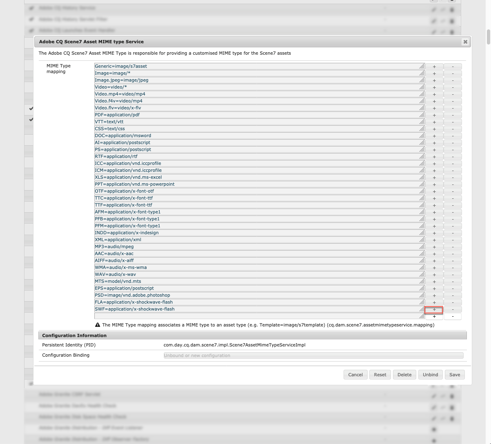

# Configuration de Dynamic Media {#configuring-dynamic-media-scene-mode}

Si vous utilisez Adobe Experience Manager configuré pour différents environnements, par exemple pour le développement, l’évaluation et la production en direct, vous devez configurer les services Dynamic Media Cloud pour chacun de ces environnements.

## Architecture diagram of Dynamic Media {#architecture-diagram-of-dynamic-media-scene-mode}

Le diagramme d’architecture suivant décrit le fonctionnement de Contenu multimédia dynamique.

Avec la nouvelle architecture, AEM est responsable des fichiers originaux et des synchronisations avec Dynamic Media pour le traitement et la publication des ressources :

1. Lorsque le fichier original est transféré dans AEM, il est répliqué vers Dynamic Media. À ce stade, Dynamic Media gère l’intégralité du traitement des ressources et de la génération du rendu, comme le codage vidéo et les variantes dynamiques d’une image.
1. Une fois les rendus générés, AEM peut accéder de manière sécurisée aux rendus Dynamic Media distants et en afficher un aperçu (aucune donnée binaire n’est renvoyée à l’instance AEM).
1. Une fois que le contenu est prêt à être publié et approuvé, il déclenche l’envoi du contenu par le service Dynamic Media vers les serveurs de diffusion et le contenu en cache du réseau CDN.


<!-- OBSOLETE CONTENT

## (Optional) Migrating Dynamic Media presets and configurations from 6.3 to 6.5 Zero Downtime {#optional-migrating-dynamic-media-presets-and-configurations-from-to-zero-downtime}

If you are upgrading AEM Dynamic Media from 6.3 to 6.4 or 6.5 (which now includes the ability for zero downtime deployments), you are required to run the following curl command to migrate all your presets and configurations from `/etc` to `/conf` in CRXDE Lite.

>[!NOTE]
>
>If you run your AEM instance in compatibility mode--that is, you have the compatibility packaged installed--you do not need to run these commands.

For all upgrades, either with or without the compatibility package, you can copy the default, out-of-the-box viewer presets that originally came with Dynamic Media by running the following Linux curl command:

`curl -u admin:admin -X POST https://<server_address>:<server_port>/libs/settings/dam/dm/presets/viewer.pushviewerpresets.json`

To migrate any custom viewer presets and configurations that you have created from `/etc` to `/conf`, run the following Linux curl command:

`curl -u admin:admin -X POST https://<server_address>:<server_port>/libs/settings/dam/dm/presets.migratedmcontent.json`

-->

## Configuring Dynamic Media Cloud Service {#configuring-dynamic-media-cloud-services}

**Avant de configurer le service** Dynamic Media Cloud : Après avoir reçu votre courrier électronique de mise en service avec les informations d’identification de Contenu multimédia dynamique, vous devez vous [connecter](https://www.adobe.com/marketing-cloud/experience-manager/scene7-login.html) à Contenu multimédia dynamique classique pour modifier votre mot de passe. Le mot de passe fourni dans l’e-mail de mise en service est généré par le système et il est attribué uniquement de manière temporaire. Il est important que vous mettiez à jour le mot de passe afin que le service cloud Dynamic Media soit configuré avec les informations d’identification correctes.

Pour configurer les Services cloud Dynamic Media :

1. Dans AEM, appuyez sur le logo AEM pour accéder à la console de navigation globale.
1. Sur le côté gauche de la console, sous l’en-tête **[!UICONTROL Outils]** , appuyez sur Services **[!UICONTROL Cloud > Configuration]** de médias dynamiques.
1. Sur la page Navigateur de configuration Dynamic Media, dans le volet de gauche, appuyez sur **[!UICONTROL global]** (n’appuyez pas sur l’icône de dossier située à gauche de **[!UICONTROL global]** ou ne la sélectionnez pas), puis appuyez sur **[!UICONTROL Créer]**.
1. Sur la page Créer une configuration Dynamic Media, saisissez un titre, l’adresse e-mail du compte Dynamic Media et un mot de passe, puis sélectionnez votre région. Ces informations vous sont fournies par Adobe dans l’e-mail de mise en service. Veuillez contacter le support si vous ne l’avez pas reçu.
1. Cliquez sur **[!UICONTROL Connexion à Dynamic Media]**.

   >[!NOTE]
   >
   >Une fois que vous avez reçu le courrier électronique de mise en service avec les informations d’identification Dynamic Media, [connectez-vous](https://www.adobe.com/marketing-cloud/experience-manager/scene7-login.html) à Dynamic Media Classic pour modifier votre mot de passe. Le mot de passe fourni dans le courrier électronique de mise en service est généré par le système et il est attribué uniquement de manière temporaire. Il est important que vous mettiez à jour le mot de passe afin que le service cloud Dynamic Media soit configuré avec les informations d’identification correctes.

1. Une fois la connexion établie, définissez les options suivantes :

   * **[!UICONTROL Entreprise]** : nom du compte Dynamic Media. Il est possible que vous disposiez de plusieurs comptes Dynamic Media pour différentes sous-marques et divisions ou différents environnements de test/production.

   * **[!UICONTROL Chemin d’accès au dossier racine de l’entreprise]**

   * **[!UICONTROL Publier les ressources]** : l’option **[!UICONTROL Immédiatement]** signifie que lorsque des ressources sont téléchargées, le système les ingère et fournit instantanément l’URL/l’incorporation. Aucune intervention n’est nécessaire de la part de l’utilisateur pour publier des ressources. The option **[!UICONTROL Upon Activation]** (default) means that you need to explicitly publish the asset first before a URL/Embed link is provided.

   * **[!UICONTROL Serveur d’aperçu sécurisé]** : permet de définir le chemin URL de votre serveur d’aperçu des rendus sécurisé. En d’autres termes, une fois les rendus générés, AEM peut accéder de manière sécurisée aux rendus Dynamic Media distants et en afficher un aperçu (aucune donnée binaire n’est renvoyée à l’instance AEM).
À moins que vous ayez pris des dispositions spéciales pour utiliser le serveur de votre propre entreprise ou un serveur spécial, Adobe Systems vous conseille de conserver ce paramètre tel que spécifié.

   * **[!UICONTROL Synchroniser tout le contenu]** - Sélectionné par défaut. Désélectionnez cette option si vous souhaitez inclure ou exclure des fichiers de la synchronisation avec le contenu multimédia dynamique. La désélection de cette option vous permet de choisir l’un des deux modes de synchronisation de Contenu multimédia dynamique suivants :

   * **[!UICONTROL Mode de synchronisation de média dynamique]**
      * **[!UICONTROL Activé par défaut]** : la configuration s’applique par défaut à tous les dossiers, sauf si vous marquez un dossier spécifique à exclure. <!-- you can then deselect the folders that you do not want the configuration applied to.-->
      * **[!UICONTROL Désactivé par défaut]** : la configuration n’est appliquée à aucun dossier tant que vous ne marquez pas explicitement un dossier sélectionné pour synchronisation avec Contenu multimédia dynamique.
Pour marquer un dossier sélectionné en vue de sa synchronisation avec Contenu multimédia dynamique, ouvrez la page Propriétés de votre dossier de ressources. Appuyez sur l’onglet **[!UICONTROL Détails]** , puis dans la liste déroulante Mode **[!UICONTROL de synchronisation des médias]** dynamiques, choisissez l’une des trois options suivantes, puis enregistrez **[!UICONTROL Enregistrer]**.
         * **[!UICONTROL Hérité]** - Aucune valeur de synchronisation explicite sur le dossier ; au lieu de cela, le dossier hérite de la valeur de synchronisation de l’un de ses dossiers ancêtres ou du mode par défaut dans la configuration du cloud. L’état détaillé pour l’héritage s’affiche par le biais d’une info-bulle.
         * **[!UICONTROL Activer pour les sous-dossiers]** : incluez tout dans cette sous-arborescence pour la synchronisation avec Contenu multimédia dynamique. Les paramètres propres au dossier remplacent le mode par défaut dans la configuration du cloud.
         * **[!UICONTROL Désactivé pour les sous-dossiers]** : excluez tous les éléments de cette sous-arborescence de la synchronisation vers Contenu multimédia dynamique.
   >[!NOTE]
   >
   >Il n’existe aucune prise en charge du contrôle de version dans les médias dynamiques. Par ailleurs, l’activation différée s’applique uniquement si **[!UICONTROL Publier les ressources]** est défini sur **[!UICONTROL Lors de l’activation]** sur la page Modifier la configuration Dynamic Media, puis uniquement jusqu’à la première activation de la ressource.
   >
   >
   >Une fois qu’une ressource est activée, toutes les mises à jour sont immédiatement publiées en direct sur la livraison S7.

   

1. Appuyez sur **[!UICONTROL Enregistrer]**.
1. Pour afficher l’aperçu du contenu Dynamic Media en toute sécurité avant qu’il ne soit modifié, vous aurez besoin de placer en liste blanche l’instance d’auteur AEM à connecter à Dynamic Media :

   * Log on to your Dynamic Media Classic account: [https://www.adobe.com/marketing-cloud/experience-manager/scene7-login.html](https://www.adobe.com/marketing-cloud/experience-manager/scene7-login.html). Vos informations d’identification et de connexion vous ont été communiquées par Adobe au moment de la configuration. Si vous ne disposez pas de ces informations, contactez l’assistance technique.
   * On the navigation bar near the top right of the page, click **[!UICONTROL Setup > Application Setup > Publish Setup > Image Server]**.

   * On the Image Server Publish page, in the Publish Context drop-down list, select **[!UICONTROL Test Image Serving]**.
   * For the Client Address Filter, tap **[!UICONTROL Add]**.
   * Cochez la case permettant d’activer l’adresse, puis saisissez l’adresse IP de l’instance d’auteur AEM (et non l’IP du Dispatcher).
   * Cliquez sur **[!UICONTROL Enregistrer]**.

Vous avez maintenant terminé la configuration de base ; vous êtes prêt à utiliser Contenu multimédia dynamique.

If you want to further customize your configuration, you can optionally complete any of the tasks under [Configuring Advanced Settings in Dynamic Media](#optional-configuring-advanced-settings-in-dynamic-media-scene-mode).

## (Optional) Configuring Advanced Settings in Dynamic Media{#optional-configuring-advanced-settings-in-dynamic-media-scene-mode}

If you want to further customize the configuration and setup of Dynamic Media, or optimize its performance, you can complete one or more of the following *optional* tasks:

* [Configuration et configuration des paramètres de Contenu multimédia dynamique](#optional-setup-and-configuration-of-dynamic-media-scene-mode-settings)
* [(Facultatif) Réglage des performances de Contenu multimédia dynamique](#optional-tuning-the-performance-of-dynamic-media-scene-mode)

<!--

* [(Optional) Filtering assets for replication](#optional-filtering-assets-for-replication)

-->

### (Optional) Setup and configuration of Dynamic Media settings {#optional-setup-and-configuration-of-dynamic-media-scene-mode-settings}

Utilisez l’interface utilisateur de Dynamic Media Classic (Scene7) pour apporter des modifications à vos paramètres de Contenu multimédia dynamique.

Some of the tasks above require that you log into Dynamic Media Classic (Scene7) here: [https://www.adobe.com/marketing-cloud/experience-manager/scene7-login.html](https://www.adobe.com/marketing-cloud/experience-manager/scene7-login.html)

Les tâches d’installation et de configuration incluent :

* [Configuration de la publication pour Image Server](#publishing-setup-for-image-server)
* [Configuration des paramètres généraux d’application](#configuring-application-general-settings)
* [Configuration de la gestion des couleurs](#configuring-color-management)
* [Configuration du traitement des ressources](#configuring-asset-processing)
* [Ajout de types MIME personnalisés pour les formats non pris en charge](#adding-custom-mime-types-for-unsupported-formats)
* [Création de paramètres prédéfinis d’ensemble par lot pour générer automatiquement des visionneuses d’images et des visionneuses à 360°](#creating-batch-set-presets-to-auto-generate-image-sets-and-spin-sets)

#### Configuration de la publication pour Image Server {#publishing-setup-for-image-server}

Les paramètres de configuration de la publication déterminent comment les ressources sont diffusées par défaut à partir de Dynamic Media. Si aucun paramètre n’est spécifié, Dynamic Media diffuse une ressource selon les paramètres par défaut définis dans Configuration de la publication. Par exemple, une requête de diffusion d’image qui ne comporte pas d’attribut de résolution produit une image avec le paramètre de résolution d’objet par défaut.

Pour définir la configuration de la publication : dans Dynamic Media Classic, cliquez sur **[!UICONTROL Configuration > Configuration de l’application > Configuration de la publication > Image Server]**.

L’écran Image Server permet de définir les paramètres par défaut pour la diffusion des images. Voir l’écran de l’interface utilisateur pour la description de chaque paramètre.

* **[!UICONTROL Attributs]** de requête : ces paramètres imposent des limites aux images qui peuvent être diffusées à partir du serveur.
* **[!UICONTROL Attributs de requête par défaut]** : ces paramètres concernent l’aspect par défaut des images.
* **[!UICONTROL Attributs de miniature courants]** : ces paramètres concernent l’aspect par défaut des images miniatures.
* **[!UICONTROL Valeurs par défaut des champs]** de catalogue : ces paramètres concernent la résolution et le type de miniature par défaut des images.
* **[!UICONTROL Attributs]** de gestion des couleurs : ces paramètres déterminent les profils de couleurs ICC utilisés.
* **[!UICONTROL Attributs]** de compatibilité : ce paramètre permet de traiter les paragraphes de début et de fin des calques de texte comme dans la version 3.6 pour une compatibilité descendante.
* **[!UICONTROL Prise en charge]** de la localisation : ces paramètres vous permettent de gérer plusieurs attributs de paramètres régionaux. Ils vous permettent également de définir une chaîne de mappage de paramètres régionaux afin de définir les langues à prendre en charge pour les différentes info-bulles dans les visionneuses. For more information about setting up **Localization Support]**, see [Considerations when setting up localization of assets](https://help.adobe.com/en_US/scene7/using/WS997f1dc4cb0179f034e07dc31412799d19a-8000.html).

#### Configuration des paramètres généraux d’application {#configuring-application-general-settings}

To open the Application General Settings page, in Dynamic Media Classic Global Navigation bar, click **[!UICONTROL Setup > Application Setup > General Settings]**.

* **[!UICONTROL Serveurs]** - Lors de l’attribution des comptes, Dynamic Media fournit automatiquement les serveurs affectés à votre entreprise. Ces serveurs sont utilisés pour créer des chaînes URL pour votre site web et vos applications. Ces appels d’URL sont spécifiques à votre compte. Ne modifiez le nom d’aucun des serveurs à moins que le support AEM ne vous le demande explicitement.

* **[!UICONTROL Ecraser les images]** - Contenu multimédia dynamique ne permet pas à deux fichiers d’avoir le même nom. L’identifiant de l’URL de chaque élément (le nom de fichier sans l’extension) doit être unique. Ces options spécifient la manière dont les ressources de remplacement sont téléchargées : elles peuvent remplacer l’original ou devenir un doublon. Les ressources en double sont renommées en ajoutant « -1 » (par exemple, chaise.tif devient chaise-1.tif). Ces options affectent les ressources téléchargées dans un dossier autre que le dossier d’origine ou les ressources dont l’extension est différente de celle du fichier d’origine (telle que JPG, TIF ou PNG).

* **[!UICONTROL Ecraser dans le dossier actuel, même nom/extension]** d’image de base : cette option est la règle de remplacement la plus stricte. Elle implique que vous téléchargiez l’image de remplacement dans le même dossier que l’original, et qu’elle ait la même extension que le fichier d’origine. Si ces conditions ne sont pas remplies, un doublon est créé.

   >[!NOTE]
   >
   >To maintain consistency with AEM, always choose this setting: **Overwrite in current folder, same base image name/extension**

* **[!UICONTROL Ecraser dans n’importe quel dossier, même nom/extension]** de fichier de base : l’image de remplacement doit avoir la même extension de fichier que l’image d’origine (par exemple, chaise.jpg doit remplacer chaise.jpg et non chaise.tif). Vous pouvez néanmoins télécharger l’image de remplacement dans un dossier différent de celui de l’image d’origine. L’image mise à jour se trouve dans le nouveau dossier ; le fichier d’origine n’est plus disponible à l’emplacement d’origine.
* **[!UICONTROL Ecraser dans n’importe quel dossier, même nom de fichier de base quelle que soit l’extension]** : cette option est la règle de remplacement la plus inclusive. Elle vous permet de télécharger une image de remplacement dans un dossier autre que celui de l’image d’origine, de télécharger un fichier dont l’extension est différente de celle du fichier d’origine et de remplacer le fichier d’origine. Si le fichier d’origine se trouve dans un dossier différent, l’image de remplacement est enregistrée dans le nouveau dossier où elle a été téléchargée.

* **[!UICONTROL Profils]** de couleurs par défaut - Voir [Configuration de la gestion des](#configuring-color-management) couleurs pour plus d’informations.

>[!NOTE]
>
>Par défaut, le système affiche 15 rendus lorsque vous sélectionnez **[!UICONTROL Rendus]** et 15 paramètres prédéfinis de visionneuse lorsque vous sélectionnez **[!UICONTROL Visionneuses]** dans l’affichage des détails de la ressource. Vous pouvez augmenter cette limite. See [Increasing or decreasing the number of image presets that display](/help/assets/dynamic-media/managing-image-presets.md#increasing-or-decreasing-the-number-of-image-presets-that-display) or [Increasing or decreasing the number of viewer presets that display](/help/assets/dynamic-media/managing-viewer-presets.md#increasing-the-number-of-viewer-presets-that-display).


#### Configuration de la gestion des couleurs {#configuring-color-management}

La gestion des couleurs de Dynamic Media vous permet de corriger les couleurs des ressources. Avec la correction des couleurs, les ressources intégrées conservent leur espace colorimétrique (RVB, CMJN, gris) et leur profil de couleur intégré. Lorsque vous demandez un rendu dynamique, la couleur de l’image est corrigée dans l’espace colorimétrique cible en utilisant une sortie CMJN, RVB ou grise. See [Configuring Image Presets](/help/assets/dynamic-media/managing-image-presets.md).

Pour configurer les propriétés de couleur par défaut afin d’activer la correction des couleurs lorsque vous demandez des images :

1. [Connectez-vous à Dynamic Media Classic](https://www.adobe.com/marketing-cloud/experience-manager/scene7-login.html) à l’aide des informations d’identification fournies lors de la mise en service. Navigate to **[!UICONTROL Setup > Application Setup]**.
1. Développez la zone **[!UICONTROL Configuration de la publication]** et sélectionnez **[!UICONTROL Image Server]**. Définissez **[!UICONTROL Contexte de publication]** sur **[!UICONTROL Imager Server]** lors de la définition des paramètres par défaut des instances de publication.
1. Faites défiler l’écran jusqu’à la propriété que vous devez modifier, par exemple, une propriété de la zone **[!UICONTROL Attributs de gestion des couleurs.]**

   Vous pouvez définir les propriétés de correction des couleurs suivantes :

   * **[!UICONTROL Espace]** colorimétrique par défaut CMJN - Nom du profil colorimétrique CMJN par défaut
   * **[!UICONTROL Espace colorimétrique]** par défaut à l&#39;échelle des gris - Nom du profil colorimétrique par défaut en gris
   * **[!UICONTROL Espace colorimétrique]** par défaut RVB - Nom du profil colorimétrique RVB par défaut
   * **[!UICONTROL Mode]** de rendu de conversion des couleurs : indique le mode de rendu. Acceptable values are: **[!UICONTROL perceptual]**, **[!UICONTROL relative colometric]**, **[!UICONTROL saturation]**, **[!UICONTROL absolute colometric]**. Adobe recommends **[!UICONTROL relative]]**as the default.

1. Appuyez sur **[!UICONTROL Enregistrer]**.

For example, you could set the **[!UICONTROL RGB Default Color Space]** to *sRGB*, and **[!UICONTROL CMYK Default Color Space]** to *WebCoated*.

Cela aura les effets suivants :

* Active la correction des couleurs pour les images RVB et CMJN.
* RGB images that do not have a color profile will be assumed to be in the *sRGB* color space.
* CMYK images that do not have a color profile will be assumed to be in *WebCoated* color space.
* Les rendus dynamiques qui renvoient une sortie RVB la renvoient dans l’espace *sRVB *color space.
* Dynamic renditions that return CMYK output, will return it in the *WebCoated* color space.

#### Configuration du traitement des ressources {#configuring-asset-processing}

Vous pouvez définir les types de fichiers qui doivent être traités par Dynamic Media et personnaliser les paramètres de traitement des ressources avancé. Par exemple, vous pouvez spécifier des paramètres de traitement des fichiers pour effectuer les opérations suivantes :

* Conversion d’un PDF Adobe en ressource de catalogue électronique.
* Conversion d’un document Adobe Photoshop (.psd) en ressource de modèle de bannière afin de permettre la personnalisation.
* Pixellisation d’un fichier Adobe Illustrator (.ai) ou d’un fichier PostScript encapsulé Adobe Photoshop (.eps).
* Remarque : Des profils vidéo et d’images peuvent être utilisés pour définir le traitement des vidéos et des images, respectivement.

Voir la section [Chargement des ressources](/help/assets/add-assets.md).

**Pour configurer le traitement des fichiers**

1. Dans AEM, cliquez sur le logo AEM pour accéder à la console de navigation globale, puis cliquez sur **[!UICONTROL Général > CRXDE Lite]**.
1. Dans le rail de gauche, accédez à ce qui suit :

   `/conf/global/settings/cloudconfigs/dmscene7/jcr:content/mimeTypes`

   

1. Sous le dossier mimeTypes, sélectionnez un type MIME.
1. Sur le côté droit de la page CRXDE Lite, dans la partie inférieure :

   * double-click the **[!UICONTROL enabled]** field. Par défaut, tous les types MIME des ressources sont activés (définis sur **[!UICONTROL true]**), ce qui signifie que les ressources seront synchronisées avec Dynamic Media pour le traitement. Si vous souhaitez exclure ce type MIME de ressource du traitement, modifiez ce paramètre sur **[!UICONTROL false]**.

   * Cliquez deux fois sur **[!UICONTROL jobParam]** pour ouvrir le champ de texte associé. Voir [Types MIME pris en charge](/help/assets/file-format-support.md) pour connaître la liste des valeurs de paramètres de traitement que vous pouvez utiliser pour un type MIME donné.

1. Utilisez l’une des méthodes suivantes :

   * Répétez les étapes 3 et 4 pour modifier d’autres types MIME.
   * Dans la barre de menus de la page CRXDE Lite, cliquez sur **[!UICONTROL Tout enregistrer]**.

1. In the upper-left corner of the page, tap **[!UICONTROL CRXDE Lite]** to return to AEM.

#### Ajout de types MIME personnalisés pour les formats non pris en charge {#adding-custom-mime-types-for-unsupported-formats}

Vous pouvez ajouter des types MIME personnalisés pour les formats non pris en charge dans AEM Assets. Pour vous assurer que tout nouveau noeud ajouté dans CRXDE Lite n’est pas supprimé par AEM, vous devez vous assurer que vous déplacez le type MIME avant `image_` de définir la valeur activée sur **[!UICONTROL false]**.

**Pour ajouter des types MIME personnalisés pour des formats non pris en charge**

1. From AEM, tap **[!UICONTROL Tools > Operations > Web Console]**.

   

1. Un nouvel onglet du navigateur s’ouvre sur la page Configuration **[!UICONTROL de la console Web]** Adobe Experience Manager.

   

1. Sur la page, faites défiler l’écran jusqu’au nom *Adobe CQ Scene7 Asset MIME type Service* , comme illustré ci-dessous. A droite du nom, appuyez sur **[!UICONTROL Modifier les valeurs]** de configuration (icône représentant un crayon).

   

1. Dans la page Service **de type MIME de fichier** Adobe CQ Scene7, cliquez sur l’icône + &lt;+>. L’emplacement dans le tableau où vous cliquez sur le signe plus pour ajouter le nouveau type MIME est trivial.

   

1. Entrez `DWG=image/vnd.dwg` dans le champ de texte vide que vous venez d’ajouter.

   Notez que l’exemple `DWG=image/vnd.dwg` est fourni à titre d’illustration uniquement. Le type MIME que vous ajoutez ici peut être tout autre format non pris en charge.

   

1. In the lower-right corner of the page, tap **[!UICONTROL Save]**.

   A ce stade, vous pouvez fermer l’onglet du navigateur qui contient la page de configuration de la console Web d’Adobe Experience Manager ouverte.

1. Revenez à l’onglet du navigateur qui contient votre console AEM ouverte.
1. From AEM, tap **[!UICONTROL Tools > General > CRXDE Lite]**.

   

1. Dans le rail de gauche, accédez à ce qui suit :

   `conf/global/settings/cloudconfigs/dmscene7/jcr:content/mimeTypes`

1. Faites glisser le type mime `image_vnd.dwg` et déposez-le directement au-dessus `image_` de l’arborescence, comme le montre la capture d’écran suivante.

   

1. Avec le type MIME `image_vnd.dwg` toujours sélectionné, dans l’onglet **[!UICONTROL Propriétés]** , dans la ligne **[!UICONTROL activée]** , sous l’en-tête de colonne **[!UICONTROL Valeur]** , double-cliquez sur la valeur pour ouvrir la liste déroulante Valeur.****
1. Tapez `false` dans le champ (ou sélectionnez **[!UICONTROL false]** dans la liste déroulante).

   

1. Dans le coin supérieur gauche de la page CRXDE Lite, cliquez sur **[!UICONTROL Tout enregistrer]**.

#### Création de paramètres prédéfinis d’ensemble par lot pour générer automatiquement des visionneuses d’images et des visionneuses à 360°{#creating-batch-set-presets-to-auto-generate-image-sets-and-spin-sets}

Utilisez les paramètres prédéfinis d’ensemble par lot pour automatiser la création de visionneuses d’images ou de jeux de rotation lorsque des ressources sont téléchargées sur Dynamic Media.

Tout d’abord, définissez les convention de nommage pour la façon dont les ressources doivent être regroupées dans un ensemble. Vous pouvez ensuite créer un paramètre prédéfini d’ensemble par lot, qui est un ensemble d’instructions indépendant à nom unique, déterminant la création de la visionneuse à l’aide des images correspondant aux conventions de nommage définies dans la recette de paramètre prédéfini.

Lorsque vous téléchargez des fichiers, Dynamic Media crée automatiquement une visionneuse avec tous les fichiers qui correspondent à la convention de nommage définie dans les paramètres prédéfinis actifs.

**Configuration du nommage par défaut**

Créez une convention de nommage par défaut qui est utilisée dans n’importe quelle recette de paramètre prédéfini d’ensemble par lot. La convention de nommage par défaut sélectionnée dans la définition de paramètre prédéfini d’ensemble par lot peut être la seule convention dont votre entreprise a besoin pour générer des visionneuses par lot. Un paramètre prédéfini d’ensemble par lot est créé pour utiliser la convention de nommage par défaut que vous définissez. Vous pouvez créer autant de paramètres prédéfinis d’ensemble par lot que nécessaire avec des conventions de nommage différentes et personnalisées pour une visionneuse de contenu spécifique au cas où il existe une exception dans le nommage par défaut défini par l’entreprise.

Bien que la définition d’une convention de nommage par défaut ne soit pas nécessaire pour utiliser la fonctionnalité de paramètre prédéfini d’ensemble par lot, il est recommandé d’utiliser la convention de nommage par défaut pour définir autant d’éléments de votre convention de nommage que vous souhaitez regrouper dans une visionneuse afin de pouvoir rationaliser la création d’un ensemble par lot.

Vous pouvez également utiliser **[!UICONTROL Afficher le code]** sans champ de formulaire. Cet affichage vous permet de définir vos conventions de nommage en utilisant uniquement des expressions régulières.

Deux éléments sont disponibles pour la définition : correspondance et nom de base. Ces champs vous permettent de définir tous les éléments de la convention de nommage et d’identifier la partie de la convention utilisée pour nommer la visionneuse dans laquelle ils se trouvent. La convention de nommage individuelle d’une entreprise est susceptible d’utiliser une ou plusieurs lignes de définition pour chacun de ces éléments. Vous pouvez utiliser autant de lignes que vous le souhaitez pour votre définition unique et les regrouper dans des éléments distincts, par exemple, pour l’image principale, les éléments Couleur, Affichage secondaire et Échantillon.

**Pour configurer le nommage par défaut**

1. Log on to your Dynamic Media Classic (Scene7) account: [https://www.adobe.com/marketing-cloud/experience-manager/scene7-login.html](https://www.adobe.com/marketing-cloud/experience-manager/scene7-login.html)

   Vos informations d’identification et de connexion vous ont été communiquées par Adobe au moment de la configuration. Si vous ne disposez pas de ces informations, contactez l’assistance technique.

1. On the navigation bar near the top of the page, tap **[!UICONTROL Setup > Application Setup > Batch Set Presets > Default Naming]**.
1. Sélectionnez **[!UICONTROL Afficher le formulaire]** ou **[!UICONTROL Afficher le code]** pour indiquer le mode de visualisation et de saisie des informations sur chaque élément.

   You can select the **[!UICONTROL View Code]** check box to view the regular expression value building alongside your form selections. Vous pouvez saisir ou modifier ces valeurs pour définir les éléments de la convention de nommage si l’affichage sous forme de formulaire vous limite pour quelque raison que ce soit. Si vos valeurs ne peuvent pas être analysées dans l’affichage de formulaire, les champs de formulaire seront inactifs.

   >[!NOTE]
   >
   >Les champs de formulaire désactivés ne permettent pas de confirmer que vos expressions régulières sont correctes. Vous verrez les résultats de l’expression régulière que vous créez pour chaque élément après la ligne de résultat. L’expression régulière est visible en entier en bas de la page.

1. Développez chaque élément selon vos besoins et indiquez les conventions de nommage que vous souhaitez utiliser.
1. Si nécessaire, effectuez l’une des opérations suivantes :

   * Tap **[!UICONTROL Add]** to add another naming convention for an element.
   * Tap **[!UICONTROL Remove]** to delete a naming convention for an element.

1. Utilisez l’une des méthodes suivantes :

   * Tap **[!UICONTROL Save As]** and type a name for the preset.
   * Tap **[!UICONTROL Save]** if you are editing an existing preset.

**Création d’un paramètre prédéfini d’ensemble par lot**

Dynamic Media utilise les paramètres prédéfinis d’ensemble par lot pour organiser les ressources en visionneuses d’images (images de remplacement, options de couleur, rotation à 360°) pour l’affichage dans des visionneuses. Les paramètres prédéfinis d’ensemble par lot s’exécutent automatiquement avec les processus de transfert des ressources dans Dynamic Media.

Vous pouvez créer, modifier et gérer vos paramètres prédéfinis d’ensemble par lot. Il existe deux formulaires de définitions de paramètres prédéfinis d’ensemble par lot : un pour une convention de nommage par défaut que vous pouvez avoir configurée, et un autre pour les conventions de nommage personnalisées que vous créez en cas de besoin.

Vous pouvez utiliser la méthode de champ de formulaire pour définir un paramètre prédéfini d’ensemble par lot ou la méthode de code, qui vous permet d’utiliser des expressions régulières. Comme dans le nommage par défaut, vous pouvez sélectionner Afficher le code en même temps que vous définissez la vue Formulaire et utilisez des expressions régulières pour créer vos définitions. Vous pouvez également désélectionner l’une des deux vues pour utiliser uniquement l’une ou l’autre.

**Pour créer un paramètre prédéfini d’ensemble par lot**

1. Log on to your Dynamic Media Classic (Scene7) account: [https://www.adobe.com/marketing-cloud/experience-manager/scene7-login.html](https://www.adobe.com/marketing-cloud/experience-manager/scene7-login.html)

   Vos informations d’identification et de connexion vous ont été communiquées par Adobe au moment de la configuration. Si vous ne disposez pas de ces informations, contactez l’assistance technique.

1. On the navigation bar near the top of the page, tap **[!UICONTROL Setup > Application Setup > Batch Set Presets > Batch Set Preset]**.

   Notez que l’option **[!UICONTROL Afficher le formulaire]**, indiquée dans le coin supérieur droit de la page Détails, correspond à la vue par défaut.

1. In the Preset List panel, tap **[!UICONTROL Add]** to activate the definition fields in the Details panel on the right hand side of the screen.
1. Dans le panneau Détails, nommez le paramètre prédéfini dans le champ Nom du paramètre prédéfini.
1. Dans le menu déroulant Type d’ensemble par lot, sélectionnez un type de paramètre prédéfini.
1. Utilisez l’une des méthodes suivantes :

   * If you are using a default naming convention that you previously set up under **[!UICONTROL Application Setup > Batch Set Presets > Default Naming]**, expand **[!UICONTROL Asset Naming Conventions]**, and then in the File Naming drop-down list, tap **[!UICONTROL Default]**.

   * Pour définir une nouvelle convention de nommage quand vous configurez le paramètre prédéfini, développez **[!UICONTROL Affectation de nom de fichier]**, puis dans la liste déroulante Affectation de nom de fichier, cliquez sur **[!UICONTROL Personnalisé]**.

1. Pour l’ordre de la séquence, définissez l’ordre des images une fois que la visionneuse est regroupée dans Dynamic Media.

   Par défaut, les ressources sont classées par ordre alphanumérique. Cependant, vous pouvez utiliser une liste d’expressions régulières séparées par des virgules pour définir l’ordre.

1. Dans Options de création et d’affectation de nom de l’ensemble, indiquez le suffixe ou le préfixe du nom de base que vous avez défini dans la convention d’affectation de nom. En outre, définissez si la visionneuse sera créée dans la structure de dossiers de Dynamic Media.

   Si vous définissez un grand nombre de visionneuses, vous préférerez sans doute les conserver séparément des dossiers contenant les ressources elles-mêmes. Par exemple, vous pouvez créer un dossier Visionneuses d’images et y placer les visionneuses générées.

1. In the Details panel, tap **[!UICONTROL Save]**.
1. Tap **[!UICONTROL Active]** next to the new preset name.

   L’activation du paramètre prédéfini garantit que, lorsque vous téléchargez des ressources vers Dynamic Media, le paramètre prédéfini d’ensemble par lot est appliqué pour générer la visionneuse.

**Création d’un paramètre prédéfini d’ensemble par lot pour la génération automatique d’une visionneuse à 360° en 2D**

Vous pouvez utiliser le type d’ensemble par lot **[!UICONTROL Visionneuse à 360° multi-axe]** pour créer une recette qui automatise la génération des visionneuses à 360° en 2D. Le regroupement des images utilise des expressions régulières de ligne et de colonne afin que les ressources d’image soient correctement alignées à l’emplacement correspondant dans le tableau multidimensionnel. Il n’existe aucune limite minimale ou maximale quant au nombre de lignes ou de colonnes nécessaires dans la visionneuse à 360° multi-axe.

Par exemple, supposons que vous souhaitiez créer une visionneuse à 360° multi-axe nommée `spin-2dspin`. Vous disposez d’un ensemble d’images de visionneuse à 360° qui contient trois lignes, avec 12 images par ligne. Les images sont nommées comme suit :

```
spin-01-01
 spin-01-02
 …
 spin-01-12
 spin-02-01
 …
 spin-03-12
```

Avec ces informations, vous pouvez créer votre recette de type d’ensemble par lot comme suit :


Le regroupement pour la partie du nom de ressource partagée de la visionneuse à 360° est ajouté au champ **Correspondance** (comme surligné). La partie variable du nom de ressource contenant la ligne et la colonne est ajoutée aux champs **Ligne** et **Colonne**, respectivement.

Lorsque la visionneuse à 360° est téléchargée et publiée, vous activez le nom de la recette de la visionneuse à 360° en 2D qui est répertoriée sous **Paramètres prédéfinis d’ensemble par lot** dans la boîte de dialogue **Télécharger les options de la tâche**.

**Pour créer un paramètre prédéfini d’ensemble par lot pour la génération automatique d’une visionneuse à 360° 2D**

1. Log on to your Dynamic Media Classic (Scene7) account: [https://www.adobe.com/marketing-cloud/experience-manager/scene7-login.html](https://www.adobe.com/marketing-cloud/experience-manager/scene7-login.html)

   Vos informations d’identification et de connexion vous ont été communiquées par Adobe au moment de la configuration. Si vous ne disposez pas de ces informations, contactez l’assistance technique.

1. On the navigation bar near the top of the page, click **[!UICONTROL Setup > Application Setup > Batch Set Presets > Batch Set Preset**.

   Notez que l’option **[!UICONTROL Afficher le formulaire]**, indiquée dans le coin supérieur droit de la page Détails, correspond à la vue par défaut.

1. Dans le panneau Liste des paramètres prédéfinis, cliquez sur **[!UICONTROL Ajouter]** pour activer les champs de définition dans le panneau Détails situé sur la droite de l’écran.
1. Dans le panneau Détails, nommez le paramètre prédéfini dans le champ Nom du paramètre prédéfini.
1. Dans le menu déroulant Type d’ensemble par lot, sélectionnez **[!UICONTROL Visionneuse de fichiers]**.
1. Dans la liste déroulante Sous-type, sélectionnez **[!UICONTROL Visionneuse à 360° multi-axe]**.
1. Développez les **[!UICONTROL Conventions d’affectation de nom]**, puis, dans la liste déroulante Affectation de nom de fichier, cliquez sur **[!UICONTROL Personnalisé]**.
1. Utilisez les attributs **[!UICONTROL Correspondance]** et, éventuellement, **[!UICONTROL Nom de base]** afin de définir une expression régulière pour le nommage des ressources d’image constituant le regroupement.

   Par exemple, votre expression régulière de correspondance littérale peut se présenter comme suit :

   `(w+)-w+-w+`

1. Développez **[!UICONTROL Position des colonnes/lignes]**, puis définissez le format de nom de la position de la ressource d’image dans le tableau de la visionneuse à 360° en 2D.

   Placez la position de ligne ou de colonne entre parenthèses dans le nom de fichier.

   Par exemple, l’expression régulière de ligne peut se présenter comme suit :

   `\w+-R([0-9]+)-\w+`

   ou

   `\w+-(\d+)-\w+`

   L’expression régulière de colonne peut se présenter comme suit :

   `\w+-\w+-C([0-9]+)`

   ou

   `\w+-\w+-C(\d+)`

   N’oubliez pas qu’il s’agit uniquement d’exemples. Vous pouvez créer votre expression régulière comme bon vous semble, en fonction de vos besoins.

   >[!NOTE]
   >
   >Si la combinaison des expressions régulières de ligne et de colonne ne permet pas de déterminer la position de la ressource dans le tableau de la visionneuse à 360° multidimensionnelle, cette ressource n’est pas ajoutée à la visionneuse, et une erreur est enregistrée.

1. Dans Options de création et d’affectation de nom de l’ensemble, indiquez le suffixe ou le préfixe du nom de base que vous avez défini dans la convention d’affectation de nom. 

   Vous pouvez également définir l’emplacement où la visionneuse sera créée dans la structure de dossiers de Dynamic Media Classic.

   Si vous définissez un grand nombre de visionneuses, vous préférerez sans doute les conserver séparément des dossiers contenant les ressources elles-mêmes. Par exemple, créez un dossier Visionneuses à 360° pour y placer les visionneuses générées.

1. Dans le panneau Détails, cliquez sur **[!UICONTROL Enregistrer]**.
1. Cliquez sur **[!UICONTROL Actif]** en regard du nom du nouveau paramètre prédéfini.

   L’activation du paramètre prédéfini garantit que, lorsque vous téléchargez des ressources vers Dynamic Media, le paramètre prédéfini d’ensemble par lot est appliqué pour générer la visionneuse.

### (Optional) Tuning the performance of Dynamic Media {#optional-tuning-the-performance-of-dynamic-media-scene-mode}

To keep Dynamic Media <!--(with `dynamicmedia_scene7` run mode)--> running smoothly, Adobe recommends the following synchronization performance/scalability fine-tuning tips:

* Mettez à jour les threads de traitement de file d’attente de workflow Granite prédéfinis (ressources vidéo).
* Mettez à jour les threads de travail en file d’attente du flux de travail temporaire Granite prédéfini (images et ressources non vidéo).
* Mettez à jour le nombre maximal de connexions de téléchargement vers le serveur Dynamic Media Classic.

#### Mise à jour de la file d’attente des processus transitoires Granit {#updating-the-granite-transient-workflow-queue}

The Granite Transit Workflow queue is used for the **[!UICONTROL DAM Update Asset]** workflow. Dans Dynamic Media, elle est utilisée pour l’intégration et le traitement des images.

**Mise à jour de la file d’attente Granite Transient Workflow**

1. Navigate to [https://&lt;server>/system/console/configMgr](https://localhost:4502/system/console/configMgr) and search for **Queue: Granite Transient Workflow Queue**.

   >[!NOTE]
   >
   >Une recherche de texte est nécessaire au lieu d’une URL directe, car le PID OSGi est généré de manière dynamique.

1. Dans le champ **[!UICONTROL Nombre maximal de tâches en parallèle]**, modifiez le nombre en fonction de la valeur souhaitée.

   Par défaut, le nombre maximal de tâches en parallèle dépend du nombre de cœurs de processeur disponibles. Par exemple, sur un serveur à 4 cœurs, 2 threads de traitement sont attribués. (Une valeur comprise entre 0,0 et 1,0 est basée sur un ratio, ou tout nombre supérieur à 1 attribuera le nombre de threads de traitement.)

   Adobe recommande de configurer 32 comme **[!UICONTROL nombre maximal de tâches en parallèle]**, de façon à prendre en charge de manière adéquate le transfert massif de fichiers vers Dynamic Media Classic (Scene7).

   

1. Appuyez sur **[!UICONTROL Enregistrer]**.

#### Mise à jour de la file d’attente de workflow Granite {#updating-the-granite-workflow-queue}

La file d’attente Granite Workflow est utilisée pour les processus non transitoires. In Dynamic Media, it used to to process video with the **[!UICONTROL Dynamic Media Encode Video]** workflow.

**Pour mettre à jour la file d’attente Granite Workflow**

1. Accédez à `https://<server>/system/console/configMgr` et recherchez **File d’attente : File d’attente** de processus Granite.

   >[!NOTE]
   >
   >Une recherche de texte est nécessaire au lieu d’une URL directe, car le PID OSGi est généré de manière dynamique.

1. Dans le champ **[!UICONTROL Nombre maximal de tâches en parallèle]**, modifiez le nombre en fonction de la valeur souhaitée.

   Par défaut, le nombre maximal de tâches en parallèle dépend du nombre de cœurs de processeur disponibles. Par exemple, sur un serveur à 4 cœurs, 2 threads de traitement sont attribués. (Une valeur comprise entre 0,0 et 1,0 est basée sur un ratio, ou tout nombre supérieur à 1 attribuera le nombre de threads de traitement.)

   Dans la plupart des cas d’utilisation, le paramètre par défaut de 0,5 est suffisant.

   

1. Appuyez sur **[!UICONTROL Enregistrer]**.

#### Mise à jour de la connexion du transfert vers Scene7 {#updating-the-scene-upload-connection}

Le paramètre Connexion au téléchargement de Scene7 synchronise les fichiers AEM avec les serveurs Dynamic Media Classic.

**Pour mettre à jour la connexion de transfert Scene7**

1. Accédez à `https://<server>/system/console/configMgr/com.day.cq.dam.scene7.impl.Scene7UploadServiceImpl`.
1. Dans le champ **[!UICONTROL Nombre de connexions]** et/ou **[!UICONTROL Délai d’expiration des tâches actives]**, modifiez le nombre en fonction de vos besoins.

   Le paramètre **[!UICONTROL Nombre de connexions]** contrôle le nombre maximal de connexions HTTP autorisées pour le transfert d’AEM vers Dynamic Media. En règle générale, la valeur prédéfinie de 10 connexions est suffisante.

   The **[!UICONTROL Active job timeout]** setting determines the wait time for uploaded Dynamic Media assets to be published in delivery server. Cette valeur est de 2 100 secondes ou 35 minutes, par défaut.

   Dans la plupart des cas d’utilisation, le paramètre de 2 100 est suffisant.

   

1. Appuyez sur **[!UICONTROL Enregistrer]**.

<!-- NOTE - OBSOLETE that customisations to replication agents to transform content are no longer used; the following content is obsolete now 

### (Optional) Filtering assets for replication {#optional-filtering-assets-for-replication}

In non-Dynamic Media deployments, you replicate *all* assets (both images and video) from your AEM author environment to the AEM publish node. This workflow is necessary because the AEM publish servers also deliver the assets.

However, in Dynamic Media deployments, because assets are delivered by way of the cloud service, there is no need to replicate those same assets to AEM publish nodes. Such a "hybrid publishing" workflow avoids extra storage costs and longer processing times to replicate assets. Other content, such as Site pages, continue to be served from the AEM publish nodes.

The filters provide a way for you to *exclude* assets from being replicated to the AEM publish node.

#### Using default asset filters for replication {#using-default-asset-filters-for-replication}

If you are using Dynamic Media for imaging and/or video, then you can use the default filters that we provide as-is. The following filters are active by default:

<table>
 <tbody>
  <tr>
   <td> </td>
   <td><strong>Filter</strong></td>
   <td><strong>Mimetype</strong></td>
   <td><strong>Renditions</strong></td>
  </tr>
  <tr>
   <td>Dynamic Media Image Delivery</td>
   <td><p>filter-images</p> <p>filter-sets</p> <p> </p> </td>
   <td><p>Starts with <strong>image/</strong></p> <p>Contains <strong>application/</strong> and ends with <strong>set</strong>.</p> </td>
   <td>The out-of-the-box "filter-images" (applies to single images assets, including interactive images) and "filter-sets" (applies to Spin Sets, Image Sets, Mixed Media Sets, and Carousel Sets) will:
    <ul>
     <li>Exclude from replication the original image and static image renditions.</li>
    </ul> </td>
  </tr>
  <tr>
   <td>Dynamic Media Video Delivery</td>
   <td>filter-video</td>
   <td>Starts with <strong>video/</strong></td>
   <td>The out-of-the-box "filter-video" will:
    <ul>
     <li>Exclude from replication the original video and static thumbnail renditions.<br /> <br /> </li>
    </ul> </td>
  </tr>
 </tbody>
</table>

>[!NOTE]
>
>Filters apply to mime types and cannot be path specific.

#### Customizing asset filters for replication {#customizing-asset-filters-for-replication}

1. In AEM, tap the AEM logo to access the global navigation console and tap the **[!UICONTROL Tools > General > CRXDE Lite]**.
1. In the left folder tree, navigate to `/etc/replication/agents.author/publish/jcr:content/damRenditionFilters` to review the filters.

   

1. To define the Mime Type for the filter, you can locate the Mime Type as follows:

   In the left rail, expand `content > dam > <locate_your_asset> > jcr:content > metadata`, and then in the table, locate `dc:format`.

   The following graphic is an example of an asset's path to `dc:format`.

   

   Notice that the `dc:format` for the asset `Fiji Red.jpg` is `image/jpeg`.

   To have this filter apply to all images, regardless of their format, set the value to `image/*` where `*` is a regular expression that is applied to all images of any format.

   To have the filter apply only to images of the type JPEG, enter a value of `image/jpeg`.

1. Define what renditions you want to include or exclude from replication.

   Characters that you can use to filter for replication include the following:

<table>
 <tbody>
  <tr>
   <td><strong>Character to use</strong></td>
   <td><strong>How it filters assets for replication</strong></td>
  </tr>
  <tr>
   <td>*</td>
   <td>Wildcard character<br /> </td>
  </tr>
  <tr>
   <td>+</td>
   <td>Includes assets for replication.</td>
  </tr>
  <tr>
   <td>-</td>
   <td>Excludes assets from replication.</td>
  </tr>
 </tbody>
</table>

   Navigate to `content/dam/<locate your asset>/jcr:content/renditions`.

   The following graphic is an example of an asset's renditions.

   

   If you only wanted to replicate the original, then you would enter `+original`.

   -->

