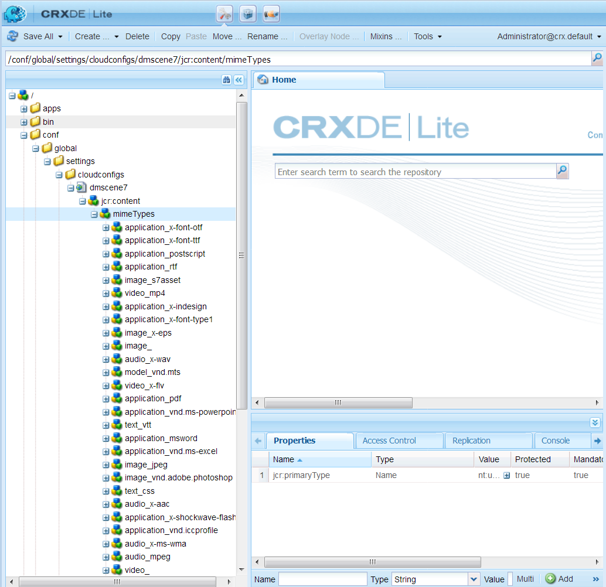

# Configuration de Dynamic Media {#configuring-dynamic-media-scene-mode}

Si Adobe Experience Manager est configuré dans des environnements différents, tels que le développement, l’évaluation et la production, vous devez configurer Dynamic Media Cloud Services pour chacun de ces environnements.

## Schéma de l’architecture de Dynamic Media {#architecture-diagram-of-dynamic-media-scene-mode}

Le schéma d’architecture suivant décrit le fonctionnement de Dynamic Media.

Avec la nouvelle architecture, AEM est responsable des fichiers originaux et des synchronisations avec Dynamic Media pour le traitement et la publication des ressources :

1. Lorsque le fichier original est transféré dans AEM, il est répliqué vers Dynamic Media. À ce stade, Dynamic Media gère l’intégralité du traitement des ressources et de la génération du rendu, comme le codage vidéo et les variantes dynamiques d’une image.
1. Une fois les rendus générés, AEM peut accéder de manière sécurisée aux rendus Dynamic Media distants et en afficher un aperçu (aucune donnée binaire n’est renvoyée à l’instance AEM).
1. Une fois que le contenu est prêt à être publié et approuvé, il déclenche l’envoi du contenu par le service Dynamic Media vers les serveurs de diffusion et la mise en cache du contenu sur le réseau de diffusion de contenu.


<!-- OBSOLETE CONTENT

## (Optional) Migrating Dynamic Media presets and configurations from 6.3 to 6.5 Zero Downtime {#optional-migrating-dynamic-media-presets-and-configurations-from-to-zero-downtime}

If you are upgrading AEM Dynamic Media from 6.3 to 6.4 or 6.5 (which now includes the ability for zero downtime deployments), you are required to run the following curl command to migrate all your presets and configurations from `/etc` to `/conf` in CRXDE Lite.

>[!NOTE]
>
>If you run your AEM instance in compatibility mode--that is, you have the compatibility packaged installed--you do not need to run these commands.

For all upgrades, either with or without the compatibility package, you can copy the default, out-of-the-box viewer presets that originally came with Dynamic Media by running the following Linux curl command:

`curl -u admin:admin -X POST https://<server_address>:<server_port>/libs/settings/dam/dm/presets/viewer.pushviewerpresets.json`

To migrate any custom viewer presets and configurations that you have created from `/etc` to `/conf`, run the following Linux curl command:

`curl -u admin:admin -X POST https://<server_address>:<server_port>/libs/settings/dam/dm/presets.migratedmcontent.json`

-->

## Configuration de Dynamic Media Cloud Service {#configuring-dynamic-media-cloud-services}

**Avant de configurer Dynamic Media Cloud Service** : après réception de l’e-mail de mise en service contenant les informations d’identification Dynamic Media, vous devez [vous connecter](https://www.adobe.com/fr/marketing-cloud/experience-manager/scene7-login.html) à Dynamic Media Classic pour changer votre mot de passe. Le mot de passe fourni dans l’e-mail de mise en service est généré par le système et il est attribué uniquement de manière temporaire. Il est important que vous mettiez à jour le mot de passe afin que Dynamic Media Cloud Service soit configuré avec les informations d’identification correctes.

Pour configurer les Services cloud Dynamic Media :

1. Dans AEM, appuyez sur le logo AEM pour accéder à la console de navigation globale.
1. Sur le côté gauche de la console, sous l’en-tête **[!UICONTROL Outils]**, appuyez sur **[!UICONTROL Cloud Services > Configuration de Dynamic Media]**.
1. Sur la page du navigateur de configuration de Dynamic Media, dans le volet de gauche, appuyez sur **[!UICONTROL global]** (ne sélectionnez ou n’appuyez pas sur l’icône de dossier située à gauche de **[!UICONTROL global]**), puis sur **[!UICONTROL Créer]**.
1. Sur la page Créer une configuration Dynamic Media, saisissez un titre, l’adresse e-mail du compte Dynamic Media et un mot de passe, puis sélectionnez votre région. Ces informations vous sont fournies par Adobe dans l’e-mail de mise en service. Veuillez contacter le support si vous ne l’avez pas reçu.
1. Cliquez sur **[!UICONTROL Connexion à Dynamic Media]**.

   >[!NOTE]
   >
   >Une fois que vous avez reçu l’e-mail de mise en service avec les informations d’identification Dynamic Media, [connectez-vous](https://www.adobe.com/fr/marketing-cloud/experience-manager/scene7-login.html) à Dynamic Media Classic pour modifier votre mot de passe. Le mot de passe fourni dans l’e-mail de mise en service est généré par le système et il est attribué uniquement de manière temporaire. Il est important que vous mettiez à jour le mot de passe afin que le service cloud Dynamic Media soit configuré avec les informations d’identification correctes.

1. Si la connexion est établie, vous pouvez définir les éléments suivants :

   * **[!UICONTROL Société]** : nom du compte Dynamic Media. Il est possible que vous disposiez de plusieurs comptes Dynamic Media pour différentes sous-marques et divisions ou différents environnements d’évaluation/de production.

   * **[!UICONTROL Chemin d’accès au dossier racine de l’entreprise]**

   * **[!UICONTROL Publication de ressources]** : vous pouvez choisir parmi les trois options suivantes :
      * **[!UICONTROL Immédiatement]** signifie que lorsque les ressources sont chargées, le système intègre les ressources et fournit instantanément l’URL/le code intégré. Aucune intervention n’est nécessaire de la part de l’utilisateur pour publier des ressources.
      * **[!UICONTROL Lors de l’activation]** : signifie que vous devez publier explicitement la ressource avant qu’un lien URL/code intégré ne soit fourni.
      * **[!UICONTROL Publication sélective]** signifie que les ressources sont publiées automatiquement pour un aperçu sécurisé uniquement et peuvent être publiées explicitement dans AEM sans publication dans DMS7 pour une diffusion dans le domaine public. À l’avenir, Adobe améliorera cette option pour publier des ressources vers AEM et vers Dynamic Media, qui sont mutuellement exclusifs. En d’autres termes, vous pouvez publier des ressources dans DMS7 afin d’utiliser des fonctionnalités telles que le recadrage intelligent ou les rendus dynamiques. Vous pouvez également publier des ressources exclusivement dans AEM pour un aperçu ; ces mêmes ressources ne sont pas publiées dans DMS7 pour une diffusion dans le domaine public.
   * **[!UICONTROL Serveur d’aperçu sécurisé]** : permet de définir le chemin URL de votre serveur d’aperçu des rendus sécurisé. En d’autres termes, une fois les rendus générés, AEM peut accéder de manière sécurisée aux rendus Dynamic Media distants et en afficher un aperçu (aucune donnée binaire n’est renvoyée à l’instance AEM).
À moins que vous ayez pris des dispositions spéciales pour utiliser le serveur de votre propre société ou un serveur spécial, Adobe Systems vous conseille de conserver ce paramètre tel que spécifié.

   * **[!UICONTROL Synchroniser tout le contenu]** : sélectionné par défaut. Désélectionnez cette option si vous souhaitez inclure ou exclure des ressources de la synchronisation avec Dynamic Media. La désélection de cette option vous permet de choisir l’un des deux modes de synchronisation Dynamic Media :

   * **[!UICONTROL Mode de synchronisation Dynamic Media]**
      * **[!UICONTROL Activé par défaut]** : la configuration s’applique par défaut à tous les dossiers, sauf si vous marquez un dossier spécifique à exclure. <!-- you can then deselect the folders that you do not want the configuration applied to.-->
      * **[!UICONTROL Désactivé par défaut]** : la configuration n’est appliquée à aucun dossier tant que vous ne marquez pas explicitement un dossier sélectionné pour synchronisation avec Dynamic Media.
Pour marquer un dossier sélectionné pour synchronisation avec Dynamic Media, ouvrez la page Propriétés de votre dossier de ressources. Appuyez sur l’onglet **[!UICONTROL Détails]**, puis dans la liste déroulante **[!UICONTROL Mode de synchronisation Dynamic Media]**, choisissez l’une des trois options suivantes, enfin appuyez sur **[!UICONTROL Enregistrer]**.
         * **[!UICONTROL Hérité]** : aucune valeur de synchronisation explicite sur le dossier ; au lieu de cela, le dossier hérite de la valeur de synchronisation de l’un de ses dossiers ancêtres ou du mode par défaut dans la configuration du cloud. Le statut détaillé de l’héritage s’affiche par le biais d’une info-bulle.
         * **[!UICONTROL Activé pour les sous-dossiers]** : incluez tous les éléments de cette sous-arborescence dans la synchronisation avec Dynamic Media. Les paramètres propres au dossier remplacent le mode par défaut dans la configuration du cloud.
         * **[!UICONTROL Désactivé pour les sous-dossiers]** : excluez tous les éléments de cette sous-arborescence de la synchronisation avec Dynamic Media.
   >[!NOTE]
   >
   >Le contrôle de version n’est pas pris en charge dans Dynamic Media. En outre, l’activation différée ne s’applique que si l’option **[!UICONTROL Publier des ressources]** dans la page de configuration de Dynamic Media est définie sur **[!UICONTROL Dès l’activation]**, puis uniquement jusqu’à la première activation de la ressource.
   >
   >
   >Une fois qu’une ressource est activée, toutes les mises à jour sont immédiatement publiées en direct sur la livraison S7.

   

1. Appuyez sur **[!UICONTROL Enregistrer]**.
1. Pour afficher l’aperçu du contenu Dynamic Media en toute sécurité avant qu’il ne soit modifié, vous aurez besoin de placer en liste blanche l’instance d’auteur AEM à connecter à Dynamic Media :

   * Connectez-vous à votre compte Dynamic Media Classic : [http://www.adobe.com/fr/marketing-cloud/experience-manager/scene7-login.html](https://www.adobe.com/fr/marketing-cloud/experience-manager/scene7-login.html). Vos informations d’identification et de connexion vous ont été communiquées par Adobe au moment de la configuration. Si vous ne disposez pas de ces informations, contactez l’assistance technique.
   * Sur la barre de navigation située en haut à droite de la page, cliquez sur **[!UICONTROL Configuration > Configuration de l’application > Configuration de la publication > Image Server]**.

   * Sur la page Publication sur hébergeur d’images, dans la liste déroulante Contexte de publication, sélectionnez **[!UICONTROL Test de l’hébergeur d’images]**.
   * Pour l’option Filtre d’adresse client, appuyez sur **[!UICONTROL Ajouter]**.
   * Cochez la case permettant d’activer l’adresse, puis saisissez l’adresse IP de l’instance d’auteur AEM (et non l’IP du Dispatcher).
   * Cliquez sur **[!UICONTROL Enregistrer]**.

Vous avez à présent terminé la configuration de base ; vous êtes prêt à utiliser Dynamic Media.

Si vous souhaitez personnaliser davantage votre configuration, vous pouvez effectuer l’une des tâches de la rubrique [Configuration des paramètres avancés dans Dynamic Media](#optional-configuring-advanced-settings-in-dynamic-media-scene-mode).

## (Facultatif) Configuration des paramètres avancés dans Dynamic Media{#optional-configuring-advanced-settings-in-dynamic-media-scene-mode}

Si vous souhaitez personnaliser davantage l’installation et la configuration de Dynamic Media, ou en optimiser les performances, vous pouvez effectuer une ou plusieurs des tâches *facultatives* suivantes :

* [Installation et configuration des paramètres Dynamic Media](#optional-setup-and-configuration-of-dynamic-media-scene-mode-settings)
* [(Facultatif) Optimisation des performances de Dynamic Media](#optional-tuning-the-performance-of-dynamic-media-scene-mode)

<!--

* [(Optional) Filtering assets for replication](#optional-filtering-assets-for-replication)

-->

### (Facultatif) Installation et configuration des paramètres Dynamic Media {#optional-setup-and-configuration-of-dynamic-media-scene-mode-settings}

Utilisez l’interface utilisateur de Dynamic Media Classic (Scene7) pour apporter des modifications à vos paramètres Dynamic Media.

Certaines des tâches ci-dessus nécessitent que vous vous connectiez à Dynamic Media Classic (Scene7) à l’adresse suivante : [http://www.adobe.com/fr/marketing-cloud/experience-manager/scene7-login.html](https://www.adobe.com/fr/marketing-cloud/experience-manager/scene7-login.html)

Les tâches d’installation et de configuration incluent :

* [Configuration de la publication pour Image Server](#publishing-setup-for-image-server)
* [Configuration des paramètres généraux de l’application](#configuring-application-general-settings)
* [Configuration de la gestion des couleurs](#configuring-color-management)
* [Configuration du traitement des ressources](#configuring-asset-processing)
* [Ajout de types MIME personnalisés pour les formats non pris en charge](#adding-custom-mime-types-for-unsupported-formats)
* [Création de paramètres prédéfinis d’ensemble par lot pour générer automatiquement des visionneuses d’images et des visionneuses à 360°](#creating-batch-set-presets-to-auto-generate-image-sets-and-spin-sets)

#### Configuration de la publication pour Image Server  {#publishing-setup-for-image-server}

Les paramètres de configuration de la publication déterminent comment les ressources sont diffusées par défaut à partir de Dynamic Media. Si aucun paramètre n’est spécifié, Dynamic Media diffuse une ressource selon les paramètres par défaut définis dans Configuration de la publication. Par exemple, une requête de diffusion d’image qui ne comporte pas d’attribut de résolution produit une image avec le paramètre de résolution d’objet par défaut.

Pour définir la configuration de la publication : dans Dynamic Media Classic, cliquez sur **[!UICONTROL Configuration > Configuration de l’application > Configuration de la publication > Image Server]**.

L’écran Image Server permet de définir les paramètres par défaut pour la diffusion des images. Voir l’écran de l’interface utilisateur pour la description de chaque paramètre.

* **[!UICONTROL Attributs de requête]** : ces paramètres imposent des limites aux images qui peuvent être diffusées à partir du serveur.
* **[!UICONTROL Attributs de requête par défaut]** : ces paramètres concernent l’aspect par défaut des images.
* **[!UICONTROL Attributs de miniature courants]** : ces paramètres concernent l’aspect par défaut des images miniatures.
* **[!UICONTROL Valeurs par défaut des champs de catalogue]** : ces paramètres concernent la résolution et le type de miniature par défaut des images.
* **[!UICONTROL Attributs de gestion des couleurs]** : ces paramètres déterminent les profils de couleurs ICC utilisés.
* **[!UICONTROL Attributs de compatibilité]** : ce paramètre permet aux paragraphes de début et de fin des calques de texte d’être traités tels qu’ils l’étaient dans la version 3.6, ce qui les rend rétrocompatibles.
* **[!UICONTROL Aide à la localisation]** : ces paramètres vous permettent de gérer divers attributs de paramètres régionaux. Ils vous permettent également de définir une chaîne de mappage de paramètres régionaux afin de définir les langues à prendre en charge pour les différentes info-bulles dans les visionneuses. Pour plus d’informations sur la configuration de l’**Aide à la localisation**, voir [Considérations à prendre en compte lors de la configuration de la localisation des ressources](https://help.adobe.com/fr_FR/scene7/using/WS997f1dc4cb0179f034e07dc31412799d19a-8000.html).

#### Configuration des paramètres généraux de l’application {#configuring-application-general-settings}

Pour ouvrir la page Paramètres généraux de l’application, dans la barre de navigation globale de Dynamic Media Classic, cliquez sur **[!UICONTROL Configuration > Configuration de l’application > Paramètres généraux]**.

* **[!UICONTROL Serveurs]** : au moment de la mise en service du compte, Dynamic Media fournit automatiquement les serveurs attribués à votre entreprise. Ces serveurs sont utilisés pour créer des chaînes URL pour votre site web et vos applications. Ces appels d’URL sont spécifiques à votre compte. Ne modifiez le nom d’aucun des serveurs à moins que le support AEM ne vous le demande explicitement.

* **[!UICONTROL Écraser les images]** : Dynamic Media ne permet pas que deux fichiers portent le même nom. L’identifiant de l’URL de chaque élément (le nom de fichier sans l’extension) doit être unique. Ces options spécifient la manière dont les ressources de remplacement sont chargées : elles peuvent remplacer l’original ou devenir un doublon. Les ressources en double sont renommées en ajoutant « -1 » (par exemple, chaise.tif devient chaise-1.tif). Ces options affectent les ressources chargées dans un dossier autre que celui d’origine ou les ressources dont l’extension est différente de celle du fichier d’origine (telle que JPG, TIF ou PNG).

* **[!UICONTROL Écraser dans dossier actuel, même nom/même extension de fichier de base]** : cette option est la règle la plus stricte pour le remplacement. Elle implique que vous chargiez l’image de remplacement dans le même dossier que l’original, et qu’elle ait la même extension que le fichier d’origine. Si ces conditions ne sont pas remplies, un doublon est créé.

   >[!NOTE]
   >
   >Pour préserver la compatibilité avec AEM, sélectionnez toujours ce paramètre : **Écraser dans dossier actuel, même nom/même extension de fichier de base**.

* **[!UICONTROL Écraser dans un dossier, même nom/même extension de fichier de base]** : nécessite que l’image de remplacement ait la même extension que l’image d’origine (par exemple, chaise.jpg peut remplacer uniquement chaise.jpg, et non chaise.tif). Vous pouvez néanmoins télécharger l’image de remplacement dans un dossier différent de celui de l’image d’origine. L’image mise à jour se trouve dans le nouveau dossier ; le fichier d’origine n’est plus disponible à l’emplacement d’origine.
* **[!UICONTROL Écraser dans un dossier, même nom de fichier, extension indépendante]** : cette option est la règle de remplacement la plus inclusive. Elle vous permet de télécharger une image de remplacement dans un dossier autre que celui de l’image d’origine, de télécharger un fichier dont l’extension est différente de celle du fichier d’origine et de remplacer le fichier d’origine. Si le fichier d’origine se trouve dans un dossier différent, l’image de remplacement est enregistrée dans le nouveau dossier où elle a été téléchargée.

* **[!UICONTROL Profils de couleurs par défaut]** : voir [Configuration de la gestion des couleurs](#configuring-color-management) pour plus d’informations.

>[!NOTE]
>
>Par défaut, le système affiche 15 rendus lorsque vous sélectionnez **[!UICONTROL Rendus]** et 15 paramètres prédéfinis de la visionneuse lorsque vous sélectionnez **[!UICONTROL Visionneuses]** dans la vue détaillée de la ressource. Vous pouvez augmenter cette limite. Voir [Augmentation ou diminution du nombre de paramètres d’image prédéfinis qui s’affichent](/help/assets/dynamic-media/managing-image-presets.md#increasing-or-decreasing-the-number-of-image-presets-that-display) ou [Augmentation ou diminution du nombre de paramètres prédéfinis de la visionneuse qui s’affichent](/help/assets/dynamic-media/managing-viewer-presets.md#increasing-the-number-of-viewer-presets-that-display).


#### Configuration de la gestion des couleurs {#configuring-color-management}

La gestion des couleurs de Dynamic Media vous permet de corriger les couleurs des ressources. Avec la correction des couleurs, les ressources intégrées conservent leur espace colorimétrique (RVB, CMJN, gris) et leur profil de couleur intégré. Lorsque vous demandez un rendu dynamique, la couleur de l’image est corrigée dans l’espace colorimétrique cible en utilisant une sortie CMJN, RVB ou grise. Reportez-vous à la section [Configuration des paramètres d’image prédéfinis](/help/assets/dynamic-media/managing-image-presets.md).

Pour configurer les propriétés de couleur par défaut afin d’activer la correction des couleurs lorsque vous demandez des images :

1. [Connectez-vous à Dynamic Media Classic](https://www.adobe.com/fr/marketing-cloud/experience-manager/scene7-login.html) à l’aide des informations d’identification fournies lors de la mise en service. Accédez à **[!UICONTROL Configuration > Configuration de l’application]**.
1. Développez la zone **[!UICONTROL Configuration de la publication]** et sélectionnez **[!UICONTROL Image Server]**. Définissez **[!UICONTROL Contexte de publication]** sur **[!UICONTROL Imager Server]** lors de la définition des paramètres par défaut des instances de publication.
1. Faites défiler l’écran jusqu’à la propriété que vous devez modifier, par exemple, une propriété de la zone **[!UICONTROL Attributs de gestion des couleurs.]**

   Vous pouvez définir les propriétés de correction des couleurs suivantes :

   * **[!UICONTROL Espace colorimétrique CMJN par défaut]** : nom du profil de couleurs CMJN par défaut.
   * **[!UICONTROL Espace colorimétrique de niveaux de gris par défaut]** : nom du profil de niveaux de gris par défaut.
   * **[!UICONTROL Espace colorimétrique RVB par défaut]** : nom du profil de couleurs RVB par défaut.
   * **[!UICONTROL Intention de rendu de conversion de couleurs]** : indique l’intention de rendu. Les valeurs possibles sont les suivantes : **[!UICONTROL perception]**, **[!UICONTROL colorimétrie relative]**, **[!UICONTROL saturation]** et **[!UICONTROL colorimétrie absolue]**. Adobe recommande d’utiliser **[!UICONTROL colorimétrie relative]**comme valeur par défaut.

1. Appuyez sur **[!UICONTROL Enregistrer]**.

Par exemple, vous pouvez définir l’**[!UICONTROL Espace colorimétrique RVB par défaut]** sur *sRVB* et l’**[!UICONTROL Espace colorimétrique CMJN par défaut]** sur *WebCoated*.

Cela aura les effets suivants :

* Active la correction des couleurs pour les images RVB et CMJN.
* Les images RVB qui n’ont pas de profil colorimétrique seront considérées comme se trouvant dans l’espace colorimétrique *sRVB*.
* Les images CMJN qui n’ont pas de profil colorimétrique seront considérées comme se trouvant dans l’espace colorimétrique *WebCoated*.
* Les rendus dynamiques qui renvoient une sortie RVB, la renverront dans l’espace colorimétrique *sRVB*.
* Les rendus dynamiques qui renvoient une sortie CMJN, la renverront dans l’espace colorimétrique *WebCoated*.

#### Configuration du traitement des ressources {#configuring-asset-processing}

Vous pouvez définir les types de ressources qui doivent être traités par Dynamic Media et personnaliser les paramètres de traitement des ressources avancé. Vous pouvez, par exemple, spécifier les paramètres de traitement des ressources de façon à ce qu’ils effectuent les opérations suivantes :

* Conversion d’un PDF Adobe en ressource de catalogue électronique.
* Conversion d’un document Adobe Photoshop (.psd) en ressource de modèle de bannière afin de permettre la personnalisation.
* Pixellisation d’un fichier Adobe Illustrator (.ai) ou d’un fichier PostScript encapsulé Adobe Photoshop (.eps).
* Remarque : des profils vidéo et d’images peuvent être utilisés pour définir le traitement des vidéos et des images, respectivement.

Voir la section [Chargement des ressources](/help/assets/add-assets.md).

**Pour configurer le traitement des ressources**

1. Dans AEM, cliquez sur le logo AEM pour accéder à la console de navigation globale, puis cliquez sur **[!UICONTROL Général > CRXDE Lite]**.
1. Dans le rail de gauche, accédez à ce qui suit :

   `/conf/global/settings/cloudconfigs/dmscene7/jcr:content/mimeTypes`

   

1. Sous le dossier mimeTypes, sélectionnez un type MIME.
1. Sur le côté droit de la page CRXDE Lite, dans la partie inférieure :

   * Cliquez deux fois sur le champ **[!UICONTROL activé]**. Par défaut, tous les types MIME des ressources sont activés (définis sur **[!UICONTROL true]**), ce qui signifie que les ressources seront synchronisées avec Dynamic Media pour le traitement. Si vous souhaitez exclure ce type MIME de ressource du traitement, définissez ce paramètre sur **[!UICONTROL false]**.

   * Cliquez deux fois sur **[!UICONTROL jobParam]** pour ouvrir le champ de texte associé. Voir [Types MIME pris en charge](/help/assets/file-format-support.md) pour connaître la liste des valeurs de paramètres de traitement que vous pouvez utiliser pour un type MIME donné.

1. Utilisez l’une des méthodes suivantes :

   * Répétez les étapes 3 et 4 pour modifier d’autres types MIME.
   * Dans la barre de menus de la page CRXDE Lite, cliquez sur **[!UICONTROL Tout enregistrer]**.

1. Dans le coin supérieur gauche de la page, appuyez sur **[!UICONTROL CRXDE Lite]** pour revenir dans AEM.

#### Ajout de types MIME personnalisés pour les formats non pris en charge {#adding-custom-mime-types-for-unsupported-formats}

Vous pouvez ajouter des types MIME personnalisés pour les formats non pris en charge dans AEM Assets. Pour vous assurer que tout nouveau nœud ajouté dans CRXDE Lite n’est pas supprimé par AEM, vous devez vous assurer que vous déplacez le type MIME avant `image_` et que sa valeur activée est définie sur **[!UICONTROL false]**.

**Pour ajouter des types MIME personnalisés pour des formats non pris en charge**

1. Dans AEM, appuyez sur **[!UICONTROL Outils > Opérations > Console web]**.

   

1. Un nouvel onglet du navigateur s’ouvre sur la page **[!UICONTROL Configuration de la console web Adobe Experience Manager]**.

   

1. Sur la page, faites défiler l’écran jusqu’au nom *Adobe CQ Scene7 Asset MIME type Service*, comme illustré ci-dessous. À droite du nom, appuyez sur **[!UICONTROL Modifier les valeurs de configuration]** (icône en forme de crayon).

   

1. Sur la page **Adobe CQ Scene7 Asset MIME type Service**, cliquez sur n’importe quel icône &lt;+>. Dans le tableau, l’emplacement du signe + sur lequel vous cliquez pour ajouter le nouveau type MIME n’est pas important.

   

1. Entrez `DWG=image/vnd.dwg` dans le champ de texte vide que vous venez d’ajouter.

   Notez que l’exemple `DWG=image/vnd.dwg` est fourni à titre d’illustration uniquement. Le type MIME que vous ajoutez ici peut être tout autre format non pris en charge.

   

1. Dans le coin inférieur droit de la page, appuyez sur **[!UICONTROL Enregistrer]**.

   À ce stade, vous pouvez fermer l’onglet du navigateur dans lequel la page de configuration de la console web d’Adobe Experience Manager est ouverte.

1. Revenez à l’onglet du navigateur dans lequel votre console AEM est ouverte.
1. Dans AEM, appuyez sur **[!UICONTROL Outils > Général > CRXDE Lite]**.

   

1. Dans le rail de gauche, accédez à ce qui suit :

   `conf/global/settings/cloudconfigs/dmscene7/jcr:content/mimeTypes`

1. Faites glisser le type MIME `image_vnd.dwg` et déposez-le directement au-dessus de `image_` de l’arborescence, comme dans la capture d’écran suivante.

   

1. Avec le type MIME `image_vnd.dwg` toujours sélectionné, dans l’onglet **[!UICONTROL Propriétés]**, au niveau de la ligne **[!UICONTROL activé]**, sous l’en-tête de colonne **[!UICONTROL Valeur]**, double-cliquez sur la valeur pour ouvrir la liste déroulante **[!UICONTROL Valeur]**.
1. Tapez `false` dans le champ (ou sélectionnez **[!UICONTROL false]** dans la liste déroulante).

   

1. Dans le coin supérieur gauche de la page CRXDE Lite, cliquez sur **[!UICONTROL Tout enregistrer]**.

#### Création de paramètres prédéfinis d’ensemble par lot pour générer automatiquement des visionneuses d’images et des visionneuses à 360° {#creating-batch-set-presets-to-auto-generate-image-sets-and-spin-sets}

Utilisez les paramètres prédéfinis d’ensemble par lot pour automatiser la création de visionneuses d’images ou de jeux de rotation lorsque des ressources sont téléchargées sur Dynamic Media.

Tout d’abord, définissez les conventions de nommage pour la façon dont les ressources doivent être regroupées dans un ensemble. Vous pouvez ensuite créer un paramètre prédéfini d’ensemble par lot, qui est un ensemble d’instructions indépendant à nom unique, déterminant la création de la visionneuse à l’aide des images correspondant aux conventions de nommage définies dans la recette de paramètre prédéfini.

Lorsque vous téléchargez des fichiers, Dynamic Media crée automatiquement une visionneuse avec tous les fichiers qui correspondent à la convention de nommage définie dans les paramètres prédéfinis actifs.

**Configuration du nommage par défaut**

Créez une convention de nommage par défaut qui est utilisée dans n’importe quelle recette de paramètre prédéfini d’ensemble par lot. La convention de nommage par défaut sélectionnée dans la définition de paramètre prédéfini d’ensemble par lot peut être la seule convention dont votre entreprise a besoin pour générer des visionneuses par lot. Un paramètre prédéfini d’ensemble par lot est créé pour utiliser la convention de nommage par défaut que vous définissez. Vous pouvez créer autant de paramètres prédéfinis d’ensemble par lot que nécessaire avec des conventions de nommage différentes et personnalisées pour une visionneuse de contenu spécifique au cas où il existe une exception dans le nommage par défaut défini par l’entreprise.

Bien que la définition d’une convention de nommage par défaut ne soit pas nécessaire pour utiliser la fonctionnalité de paramètre prédéfini d’ensemble par lot, il est recommandé d’utiliser la convention de nommage par défaut pour définir autant d’éléments de votre convention de nommage que vous souhaitez regrouper dans une visionneuse afin de pouvoir rationaliser la création d’un ensemble par lot.

Vous pouvez également utiliser **[!UICONTROL Afficher le code]** sans champ de formulaire. Cet affichage vous permet de définir vos conventions de nommage en utilisant uniquement des expressions régulières.

Deux éléments sont disponibles pour la définition : correspondance et nom de base. Ces champs vous permettent de définir tous les éléments de la convention de nommage et d’identifier la partie de la convention utilisée pour nommer la visionneuse dans laquelle ils se trouvent. La convention de nommage individuelle d’une entreprise est susceptible d’utiliser une ou plusieurs lignes de définition pour chacun de ces éléments. Vous pouvez utiliser autant de lignes que vous le souhaitez pour votre définition unique et les regrouper dans des éléments distincts, par exemple, pour l’image principale, les éléments Couleur, Affichage secondaire et Échantillon.

**Pour configurer l’affectation de nom par défaut**

1. Connectez-vous à votre compte Dynamic Media Classic (Scene7) : [http://www.adobe.com/fr/marketing-cloud/experience-manager/scene7-login.html](https://www.adobe.com/fr/marketing-cloud/experience-manager/scene7-login.html).

   Vos informations d’identification et de connexion vous ont été communiquées par Adobe au moment de la configuration. Si vous ne disposez pas de ces informations, contactez l’assistance technique.

1. Sur la barre de navigation située en haut de la page, appuyez sur **[!UICONTROL Configuration > Configuration de l’application > Paramètres prédéfinis d’ensemble par lot > Affectation de nom par défaut]**.
1. Sélectionnez **[!UICONTROL Afficher le formulaire]** ou **[!UICONTROL Afficher le code]** pour indiquer le mode de visualisation et de saisie des informations sur chaque élément.

   Vous pouvez cocher la case **[!UICONTROL Afficher le code]** pour afficher la valeur d’expression régulière qui se crée à côté de vos sélections dans le formulaire. Vous pouvez saisir ou modifier ces valeurs pour définir les éléments de la convention de nommage si l’affichage sous forme de formulaire vous limite pour quelque raison que ce soit. Si vos valeurs ne peuvent pas être analysées dans l’affichage de formulaire, les champs de formulaire seront inactifs.

   >[!NOTE]
   >
   >Les champs de formulaire désactivés ne permettent pas de confirmer que vos expressions régulières sont correctes. Vous verrez les résultats de l’expression régulière que vous créez pour chaque élément après la ligne de résultat. L’expression régulière est visible en entier en bas de la page.

1. Développez chaque élément selon vos besoins et indiquez les conventions de nommage que vous souhaitez utiliser.
1. Si nécessaire, effectuez l’une des opérations suivantes :

   * Appuyez sur **[!UICONTROL Ajouter]** afin d’ajouter une autre convention d’affectation de nom pour un élément.
   * Appuyez sur **[!UICONTROL Supprimer]** afin de supprimer une convention d’affectation de nom pour un élément.

1. Utilisez l’une des méthodes suivantes :

   * Appuyez sur **[!UICONTROL Enregistrer sous]** et saisissez un nom pour le paramètre prédéfini.
   * Appuyez sur **[!UICONTROL Enregistrer]** si vous modifiez un paramètre prédéfini existant.

**Création d’un paramètre prédéfini d’ensemble par lot**

Dynamic Media utilise les paramètres prédéfinis d’ensemble par lot pour organiser les ressources en visionneuses d’images (images de remplacement, options de couleur, rotation à 360°) pour l’affichage dans des visionneuses. Les paramètres prédéfinis d’ensemble par lot s’exécutent automatiquement avec les processus de transfert des ressources dans Dynamic Media.

Vous pouvez créer, modifier et gérer vos paramètres prédéfinis d’ensemble par lot. Il existe deux formulaires de définitions de paramètres prédéfinis d’ensemble par lot : un pour une convention de nommage par défaut que vous pouvez avoir configurée, et un autre pour les conventions de nommage personnalisées que vous créez en cas de besoin.

Vous pouvez utiliser la méthode de champ de formulaire pour définir un paramètre prédéfini d’ensemble par lot ou la méthode de code, qui vous permet d’utiliser des expressions régulières. Comme dans le nommage par défaut, vous pouvez sélectionner Afficher le code en même temps que vous définissez la vue Formulaire et utilisez des expressions régulières pour créer vos définitions. Vous pouvez également désélectionner l’une des deux vues pour utiliser uniquement l’une ou l’autre.

**Pour créer un paramètre prédéfini d’ensemble par lot**

1. Connectez-vous à votre compte Dynamic Media Classic (Scene7) : [http://www.adobe.com/fr/marketing-cloud/experience-manager/scene7-login.html](https://www.adobe.com/fr/marketing-cloud/experience-manager/scene7-login.html).

   Vos informations d’identification et de connexion vous ont été communiquées par Adobe au moment de la configuration. Si vous ne disposez pas de ces informations, contactez l’assistance technique.

1. Dans la barre de navigation située en haut de la page, appuyez sur **[!UICONTROL Configuration > Configuration de l’application > Paramètres prédéfinis d’ensemble par lot > Paramètre prédéfini d’ensemble par lot]**.

   Notez que l’option **[!UICONTROL Afficher le formulaire]**, indiquée dans le coin supérieur droit de la page Détails, correspond à la vue par défaut.

1. Dans le panneau Liste des paramètres prédéfinis, appuyez sur **[!UICONTROL Ajouter]** pour activer les champs de définition dans le panneau Détails situé sur la droite de l’écran.
1. Dans le panneau Détails, nommez le paramètre prédéfini dans le champ Nom du paramètre prédéfini.
1. Dans le menu déroulant Type d’ensemble par lot, sélectionnez un type de paramètre prédéfini.
1. Utilisez l’une des méthodes suivantes :

   * Si vous utilisez une convention d’affectation de nom par défaut que vous avez précédemment définie sous **[!UICONTROL Configuration de l’application > Paramètres prédéfinis d’ensemble par lot > Nom par défaut]**, développez **[!UICONTROL Conventions d’affectation de nom]**, puis dans la liste déroulante Affectation de nom de fichier, appuyez sur **[!UICONTROL Par défaut]**.

   * Pour définir une nouvelle convention d’affectation de nom quand vous configurez le paramètre prédéfini, développez **[!UICONTROL Affectation de nom de fichier]**, puis dans la liste déroulante Affectation de nom de fichier, cliquez sur **[!UICONTROL Personnalisé]**.

1. Pour l’ordre de la séquence, définissez l’ordre des images une fois que la visionneuse est regroupée dans Dynamic Media.

   Par défaut, les ressources sont classées par ordre alphanumérique. Cependant, vous pouvez utiliser une liste d’expressions régulières séparées par des virgules pour définir l’ordre.

1. Dans Options de création et d’affectation de nom de l’ensemble, indiquez le suffixe ou le préfixe du nom de base que vous avez défini dans la convention d’affectation de nom. En outre, définissez si la visionneuse sera créée dans la structure de dossiers de Dynamic Media.

   Si vous définissez un grand nombre de visionneuses, vous préférerez sans doute les conserver séparément des dossiers contenant les ressources elles-mêmes. Par exemple, vous pouvez créer un dossier Visionneuses d’images et y placer les visionneuses générées.

1. Dans le panneau Détails, appuyez sur **[!UICONTROL Enregistrer]**.
1. Appuyez sur **[!UICONTROL Actif]** en regard du nom du nouveau paramètre prédéfini.

   L’activation du paramètre prédéfini garantit que, lorsque vous chargez des ressources vers Dynamic Media, le paramètre prédéfini d’ensemble par lot est appliqué pour générer la visionneuse.

**Création d’un paramètre prédéfini d’ensemble par lot pour la génération automatique d’une visionneuse à 360° en 2D**

Vous pouvez utiliser le type d’ensemble par lot **[!UICONTROL Visionneuse à 360° multi-axe]** pour créer une recette qui automatise la génération des visionneuses à 360° en 2D. Le regroupement des images utilise des expressions régulières de ligne et de colonne afin que les ressources d’image soient correctement alignées à l’emplacement correspondant dans le tableau multidimensionnel. Il n’existe aucune limite minimale ou maximale quant au nombre de lignes ou de colonnes nécessaires dans la visionneuse à 360° multi-axe.

Par exemple, supposons que vous souhaitiez créer une visionneuse à 360° multi-axe nommée `spin-2dspin`. Vous disposez d’un ensemble d’images de visionneuse à 360° qui contient trois lignes, avec 12 images par ligne. Les images sont nommées comme suit :

```
spin-01-01
 spin-01-02
 …
 spin-01-12
 spin-02-01
 …
 spin-03-12
```

Avec ces informations, vous pouvez créer votre recette de type d’ensemble par lot comme suit :


Le regroupement de la partie du nom de ressource partagé de la visionneuse à 360° est ajouté au champ **Correspondance** (éléments en surbrillance). La partie variable du nom de ressource contenant la ligne et la colonne est ajoutée respectivement aux champs **Ligne** et **Colonne**.

Lorsque la visionneuse à 360° est téléchargée et publiée, vous activez le nom de la recette de visionneuse à 360° en 2D répertoriée sous **Paramètres prédéfinis d’ensemble par lot** dans la boîte de dialogue **Télécharger les options de la tâche**.

**Pour créer un paramètre prédéfini d’ensemble par lot pour la génération automatique d’une visionneuse à 360° en 2D**

1. Connectez-vous à votre compte Dynamic Media Classic (Scene7) : [http://www.adobe.com/fr/marketing-cloud/experience-manager/scene7-login.html](https://www.adobe.com/fr/marketing-cloud/experience-manager/scene7-login.html).

   Vos informations d’identification et de connexion vous ont été communiquées par Adobe au moment de la configuration. Si vous ne disposez pas de ces informations, contactez l’assistance technique.

1. Dans la barre de navigation située en haut de la page, cliquez sur **[!UICONTROL Configuration > Configuration de l’application > Paramètres prédéfinis d’ensemble par lot > Paramètre prédéfini d’ensemble par lot**.

   Notez que l’option **[!UICONTROL Afficher le formulaire]**, indiquée dans le coin supérieur droit de la page Détails, correspond à la vue par défaut.

1. Dans le panneau Liste des paramètres prédéfinis, cliquez sur **[!UICONTROL Ajouter]** pour activer les champs de définition dans le panneau Détails situé sur la droite de l’écran.
1. Dans le panneau Détails, nommez le paramètre prédéfini dans le champ Nom du paramètre prédéfini.
1. Dans le menu déroulant Type d’ensemble par lot, sélectionnez **[!UICONTROL Visionneuse de ressources]**.
1. Dans la liste déroulante Sous-type, sélectionnez **[!UICONTROL Visionneuse à 360° multi-axe]**.
1. Développez les **[!UICONTROL Conventions d’affectation de nom]**, puis, dans la liste déroulante Affectation de nom de fichier, cliquez sur **[!UICONTROL Personnalisé]**.
1. Utilisez les attributs **[!UICONTROL Correspondance]** et, éventuellement, **[!UICONTROL Nom de base]** pour définir une expression régulière pour nommer les fichiers d’image qui constituent le regroupement.

   Par exemple, votre expression régulière de correspondance littérale peut se présenter comme suit :

   `(w+)-w+-w+`

1. Développez **[!UICONTROL Position des colonnes/lignes]**, puis définissez le format de nom de la position de la ressource image dans le tableau de la visionneuse à 360° en 2D.

   Placez la position de ligne ou de colonne entre parenthèses dans le nom de fichier.

   Par exemple, l’expression régulière de ligne peut se présenter comme suit :

   `\w+-R([0-9]+)-\w+`

   ou

   `\w+-(\d+)-\w+`

   L’expression régulière de colonne peut se présenter comme suit :

   `\w+-\w+-C([0-9]+)`

   ou

   `\w+-\w+-C(\d+)`

   N’oubliez pas qu’il s’agit uniquement d’exemples. Vous pouvez créer votre expression régulière comme bon vous semble, en fonction de vos besoins.

   >[!NOTE]
   >
   >Si la combinaison des expressions régulières de ligne et de colonne ne permet pas de déterminer la position de la ressource dans le tableau de la visionneuse à 360° multidimensionnelle, cette ressource n’est pas ajoutée à la visionneuse, et une erreur est enregistrée.

1. Dans Options de création et d’affectation de nom de l’ensemble, indiquez le suffixe ou le préfixe du nom de base que vous avez défini dans la convention d’affectation de nom.

   Vous pouvez également définir l’emplacement où la visionneuse à 360° sera créée dans la structure de dossiers de Dynamic Media Classic.

   Si vous définissez un grand nombre de visionneuses, vous préférerez sans doute les conserver séparément des dossiers contenant les ressources elles-mêmes. Par exemple, créez un dossier Visionneuses à 360° pour y placer les visionneuses générées.

1. Dans le panneau Détails, cliquez sur **[!UICONTROL Enregistrer]**.
1. Cliquez sur **[!UICONTROL Actif]** en regard du nom du nouveau paramètre prédéfini.

   L’activation du paramètre prédéfini garantit que, lorsque vous chargez des ressources vers Dynamic Media, le paramètre prédéfini d’ensemble par lot est appliqué pour générer la visionneuse.

### (Facultatif) Optimisation des performances de Dynamic Media{#optional-tuning-the-performance-of-dynamic-media-scene-mode}

Pour garantir la bonne exécution de Dynamic Media <!--(with `dynamicmedia_scene7` run mode)-->, Adobe recommande les actions suivantes permettant d’optimiser les performances/l’évolutivité de la synchronisation :

* Mise à jour des paramètres de tâche prédéfinis pour le traitement de différents formats de fichier.
* Mise à jour des threads de travail de file d’attente du processus Granite prédéfini (ressources vidéo).
* Mise à jour des threads de travail en file d’attente du flux de travail transitoire Granite prédéfini (images et ressources non vidéo).
* Mise à jour du nombre maximal de connexions de téléchargement vers le serveur Dynamic Media Classic.

#### Mise à jour des paramètres de tâche prédéfinis pour le traitement de différents formats de fichier

Vous pouvez régler les paramètres de tâche pour accélérer le traitement des fichiers lors du téléchargement. Par exemple, si vous téléchargez des fichiers PSD mais que vous ne souhaitez pas les traiter en tant que modèles, vous pouvez définir l’extraction du calque sur false (désactivé). Dans ce cas, le paramètre de tâche affiné apparaîtra comme `process=None&createTemplate=false`.

Adobe recommande d’utiliser les paramètres de tâche &quot;affinés&quot; suivants pour les fichiers PDF, Postscript et PSD :

| Type de fichier | Paramètres de tâche recommandés |
| ---| ---|
| PDF | `pdfprocess=Rasterize&resolution=150&colorspace=Auto&pdfbrochure=false&keywords=false&links=false` |
| Postscript | `psprocess=Rasterize&psresolution=150&pscolorspace=Auto&psalpha=false&psextractsearchwords=false&aiprocess=Rasterize&airesolution=150&aicolorspace=Auto&aialpha=false` |
| PSD | `process=None&layerNaming=Layername&anchor=Center&createTemplate=false&extractText=false&extendLayers=false` |

Pour mettre à jour l’un de ces paramètres, suivez les étapes de la section [Activation de la prise en charge](#enabling-mime-type-based-assets-scene-upload-job-parameter-support)des paramètres de tâche de téléchargement des fichiers/fichiers dynamiques de type MIME Classic.

#### Mise à jour de la file d’attente de workflows transitoires Granite {#updating-the-granite-transient-workflow-queue}

La file d’attente de workflows Granite est utilisée pour le workflow **[!UICONTROL Ressources de mise à jour de gestion des actifs numériques]**. Dans Dynamic Media, elle est utilisée pour l’intégration et le traitement des images.

**Pour mettre à jour la file d’attente de workflows transitoires Granite**

1. Accédez à [https://&lt;serveur>/system/console/configMgr](https://localhost:4502/system/console/configMgr) et recherchez **Queue: Granite Transient Workflow Queue** (File d’attente : file d’attente de workflows transitoires Granite).

   >[!NOTE]
   >
   >Il est nécessaire d’effectuer une recherche par texte au lieu d’utiliser une URL directe, car le PID OSGi est généré dynamiquement.

1. Dans le champ **[!UICONTROL Nombre maximal de tâches en parallèle]**, modifiez le nombre en fonction de la valeur souhaitée.

   Par défaut, le nombre maximal de tâches en parallèle dépend du nombre de cœurs de processeur disponibles. Par exemple, sur un serveur à 4 cœurs, 2 threads de traitement sont attribués. (Une valeur comprise entre 0,0 et 1,0 est basée sur un ratio, ou tout nombre supérieur à 1 attribuera le nombre de threads de traitement.)

   Adobe recommande de configurer 32 comme **[!UICONTROL nombre maximal de tâches en parallèle]**, de façon à prendre en charge de manière adéquate le transfert massif de fichiers vers Dynamic Media Classic (Scene7).

   

1. Appuyez sur **[!UICONTROL Enregistrer]**.

#### Mise à jour de la file d’attente de workflows Granite {#updating-the-granite-workflow-queue}

La file d’attente de workflows Granite est utilisée pour les workflows non transitoires. Dans Dynamic Media, elle est utilisée pour le traitement de la vidéo avec le workflow **[!UICONTROL Vidéo de codage Dynamic Media]**.

**Pour mettre à jour la file d’attente de workflows Granite**

1. Accédez à `https://<server>/system/console/configMgr` et recherchez **Queue: Granite Workflow Queue** (File d’attente : file d’attente de workflows Granite).

   >[!NOTE]
   >
   >Il est nécessaire d’effectuer une recherche par texte au lieu d’utiliser une URL directe, car le PID OSGi est généré dynamiquement.

1. Dans le champ **[!UICONTROL Nombre maximal de tâches en parallèle]**, modifiez le nombre en fonction de la valeur souhaitée.

   Par défaut, le nombre maximal de tâches en parallèle dépend du nombre de cœurs de processeur disponibles. Par exemple, sur un serveur à 4 cœurs, 2 threads de traitement sont attribués. (Une valeur comprise entre 0,0 et 1,0 est basée sur un ratio, ou tout nombre supérieur à 1 attribuera le nombre de threads de traitement.)

   Dans la plupart des cas d’utilisation, le paramètre par défaut de 0,5 est suffisant.

   

1. Appuyez sur **[!UICONTROL Enregistrer]**.

#### Mise à jour de la connexion de chargement vers Scene7 {#updating-the-scene-upload-connection}

Le paramètre de connexion de chargement vers Scene7 synchronise les ressources AEM avec les serveurs Dynamic Media Classic.

**Pour mettre à jour la connexion de chargement vers Scene7**

1. Accédez à `https://<server>/system/console/configMgr/com.day.cq.dam.scene7.impl.Scene7UploadServiceImpl`.
1. Dans le champ **[!UICONTROL Nombre de connexions]** et/ou **[!UICONTROL Délai d’expiration des tâches actives]**, modifiez le nombre en fonction de vos besoins.

   Le paramètre **[!UICONTROL Nombre de connexions]** contrôle le nombre maximal de connexions HTTP autorisées pour le chargement d’AEM vers Dynamic Media. En règle générale, la valeur prédéfinie de 10 connexions est suffisante.

   Le paramètre **[!UICONTROL Délai d’expiration des tâches actives]** détermine le temps d’attente avant que les ressources Dynamic Media chargées ne soient publiées sur le serveur de diffusion. Cette valeur est de 2 100 secondes ou 35 minutes, par défaut.

   Dans la plupart des cas d’utilisation, le paramètre de 2 100 est suffisant.

   

1. Appuyez sur **[!UICONTROL Enregistrer]**.

<!-- NOTE - OBSOLETE that customisations to replication agents to transform content are no longer used; the following content is obsolete now 

### (Optional) Filtering assets for replication {#optional-filtering-assets-for-replication}

In non-Dynamic Media deployments, you replicate *all* assets (both images and video) from your AEM author environment to the AEM publish node. This workflow is necessary because the AEM publish servers also deliver the assets.

However, in Dynamic Media deployments, because assets are delivered by way of the cloud service, there is no need to replicate those same assets to AEM publish nodes. Such a "hybrid publishing" workflow avoids extra storage costs and longer processing times to replicate assets. Other content, such as Site pages, continue to be served from the AEM publish nodes.

The filters provide a way for you to *exclude* assets from being replicated to the AEM publish node.

#### Using default asset filters for replication {#using-default-asset-filters-for-replication}

If you are using Dynamic Media for imaging and/or video, then you can use the default filters that we provide as-is. The following filters are active by default:

<table>
 <tbody>
  <tr>
   <td> </td>
   <td><strong>Filter</strong></td>
   <td><strong>Mimetype</strong></td>
   <td><strong>Renditions</strong></td>
  </tr>
  <tr>
   <td>Dynamic Media Image Delivery</td>
   <td><p>filter-images</p> <p>filter-sets</p> <p> </p> </td>
   <td><p>Starts with <strong>image/</strong></p> <p>Contains <strong>application/</strong> and ends with <strong>set</strong>.</p> </td>
   <td>The out-of-the-box "filter-images" (applies to single images assets, including interactive images) and "filter-sets" (applies to Spin Sets, Image Sets, Mixed Media Sets, and Carousel Sets) will:
    <ul>
     <li>Exclude from replication the original image and static image renditions.</li>
    </ul> </td>
  </tr>
  <tr>
   <td>Dynamic Media Video Delivery</td>
   <td>filter-video</td>
   <td>Starts with <strong>video/</strong></td>
   <td>The out-of-the-box "filter-video" will:
    <ul>
     <li>Exclude from replication the original video and static thumbnail renditions.<br /> <br /> </li>
    </ul> </td>
  </tr>
 </tbody>
</table>

>[!NOTE]
>
>Filters apply to mime types and cannot be path specific.

#### Customizing asset filters for replication {#customizing-asset-filters-for-replication}

1. In AEM, tap the AEM logo to access the global navigation console and tap the **[!UICONTROL Tools > General > CRXDE Lite]**.
1. In the left folder tree, navigate to `/etc/replication/agents.author/publish/jcr:content/damRenditionFilters` to review the filters.

   

1. To define the Mime Type for the filter, you can locate the Mime Type as follows:

   In the left rail, expand `content > dam > <locate_your_asset> > jcr:content > metadata`, and then in the table, locate `dc:format`.

   The following graphic is an example of an asset's path to `dc:format`.

   

   Notice that the `dc:format` for the asset `Fiji Red.jpg` is `image/jpeg`.

   To have this filter apply to all images, regardless of their format, set the value to `image/*` where `*` is a regular expression that is applied to all images of any format.

   To have the filter apply only to images of the type JPEG, enter a value of `image/jpeg`.

1. Define what renditions you want to include or exclude from replication.

   Characters that you can use to filter for replication include the following:

<table>
 <tbody>
  <tr>
   <td><strong>Character to use</strong></td>
   <td><strong>How it filters assets for replication</strong></td>
  </tr>
  <tr>
   <td>*</td>
   <td>Wildcard character<br /> </td>
  </tr>
  <tr>
   <td>+</td>
   <td>Includes assets for replication.</td>
  </tr>
  <tr>
   <td>-</td>
   <td>Excludes assets from replication.</td>
  </tr>
 </tbody>
</table>

   Navigate to `content/dam/<locate your asset>/jcr:content/renditions`.

   The following graphic is an example of an asset's renditions.

   

   If you only wanted to replicate the original, then you would enter `+original`.

   -->

