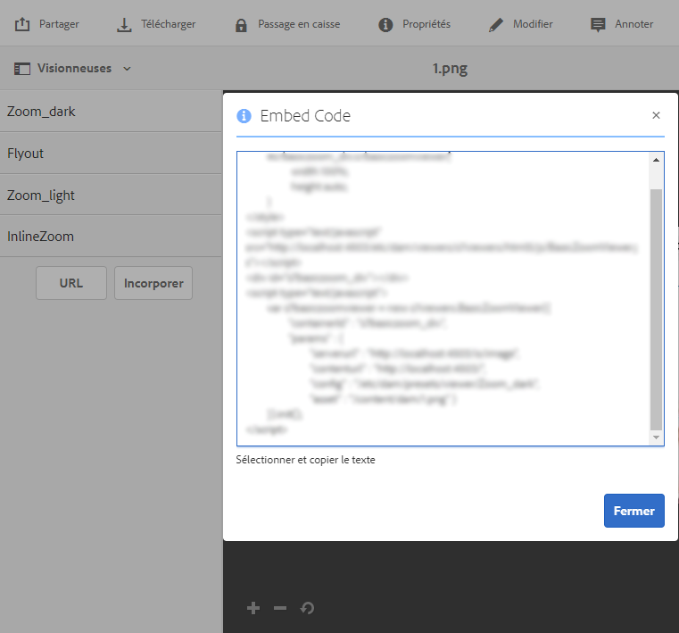

# Utilisation d’aperçus rapides en vue de la création de fenêtres contextuelles {#using-quickviews-to-create-custom-pop-ups}

L’aperçu rapide par défaut est utilisé dans les expériences de commerce électronique où une fenêtre contextuelle s’affiche avec des informations sur le produit afin de générer un achat. Cependant, vous pouvez déclencher le contenu personnalisé à afficher dans les fenêtre contextuelles. Selon la visionneuse que vous utilisez, cette fonctionnalité permet aux utilisateurs de cliquer sur une zone réactive, une image miniature ou une zone cliquable pour afficher des informations ou du contenu connexe.

Les aperçus rapides sont pris en charge par les visionneuses suivantes dans Dynamic Media :

* Images interactives (zones réactives cliquables)
* Vidéo interactive (images miniatures cliquables pendant la lecture vidéo)
* Bannières de carrousel (zones réactives cliquables ou zones cliquables)

Bien que chaque visionneuse ait un mode de fonctionnement distinct, le processus de création d’un aperçu rapide est identique pour les trois visionneuses prises en charge.

**Pour utiliser des aperçus rapides en vue de la création de fenêtres contextuelles**

1. Créez un aperçu rapide pour une ressource téléchargée.

   En général, vous créez un aperçu rapide durant l’édition d’une ressource exploitable avec la visionneuse en cours.

   <table>
    <tbody>
    <tr>
    <td><strong>Visionneuse utilisée</strong></td>
    <td><strong>Procédez comme suit pour créer l’aperçu rapide</strong></td>
    </tr>
    <tr>
    <td>Images interactives</td>
    <td><a href="/help/assets/dynamic-media/interactive-images.md#adding-hotspots-to-an-image-banner" target="_blank">Ajout de zones réactives à une bannière d’image</a>.</td>
    </tr>
    <tr>
    <td>Vidéos interactives</td>
    <td><a href="/help/assets/dynamic-media/interactive-videos.md#adding-interactivity-to-your-video" target="_blank">Ajout d’interactivité à votre vidéo</a>.</td>
    </tr>
    <tr>
    <td>Bannières de carrousel</td>
    <td><a href="/help/assets/dynamic-media/carousel-banners.md#adding-hotspots-or-image-maps-to-an-image-banner" target="_blank">Ajout de zones réactives ou de zones cliquables à une bannière</a>.<br /> </td>
    </tr>
    </tbody>
   </table>

1. Obtenez le code d’intégration de visionneuse afin d’intégrer la visionneuse à votre site web.

   <table>
    <tbody>
    <tr>
    <td><strong>Visionneuse utilisée</strong><br /> </td>
    <td><strong>Procédez comme suit pour intégrer le lecteur de contenu à votre site Web</strong></td>
    </tr>
    <tr>
    <td>Image interactive</td>
    <td><a href="/help/assets/dynamic-media/interactive-images.md#integrating-an-interactive-image-with-your-website" target="_blank">Integrating an interactive image with your website</a>.<br /> </td>
    </tr>
    <tr>
    <td>Vidéo interactive<br /> </td>
    <td><a href="/help/assets/dynamic-media/interactive-videos.md#integrating-an-interactive-video-with-your-website" target="_blank">Intégration d’une vidéo interactive à votre site web</a>.<br /> </td>
    </tr>
    <tr>
    <td>Bannière de carrousel</td>
    <td><a href="/help/assets/dynamic-media/carousel-banners.md#adding-a-carousel-banner-to-your-website-page" target="_blank">Adding a carousel banner to your website page</a>.<br /> </td>
    </tr>
    </tbody>
   </table>

1. La visionneuse que vous utilisez actuellement doit savoir comment prendre en charge l’aperçu rapide.

   Pour ce faire, la visionneuse utilise un gestionnaire appelé `QuickViewActive`.

   **Exemple** Supposons que vous utilisiez le code d’intégration suivant dans votre page web pour une image interactive :

   

   Le gestionnaire est chargé dans la visionneuse à l’aide de `setHandlers` :

   `*viewerInstance*.setHandlers({ *handler 1*, *handler 2*}, ...`

   **L’exemple de code incorporé ci-dessus montre le code suivant :**

   ```xml
   s7interactiveimageviewer.setHandlers({
       quickViewActivate": function(inData) {
           var sku=inData.sku;
           var genericVariable1=inData.genericVariable1;
           var genericVariable2=inData.genericVariable2;
          loadQuickView(sku,genericVariable1,genericVariable2);
       }
   })
   ```

   Learn more about `setHandlers()` method at the following:

   * Visionneuse d’images interactives : [https://marketing.adobe.com/resources/help/en_US/s7/viewers_ref/r_html5_aem_int_image_viewer_javascriptapiref_sethandlers.html](https://marketing.adobe.com/resources/help/en_US/s7/viewers_ref/r_html5_aem_int_image_viewer_javascriptapiref_sethandlers.html)
   * Visionneuse vidéo interactive : [https://marketing.adobe.com/resources/help/en_US/s7/viewers_ref/r_html5_aem_int_video_javascriptapiref_sethandlers.html](https://marketing.adobe.com/resources/help/en_US/s7/viewers_ref/r_html5_aem_int_video_javascriptapiref_sethandlers.html)

1. Vous devez maintenant configurer le gestionnaire `quickViewActivate`.

   The `quickViewActivate` handler controls the Quickviews in the viewer. Le gestionnaire contient les appels de la liste de variables et de fonctions utilisables avec l’aperçu rapide. The embed code provides mapping for the SKU variable set in the Quickview as well as a sample `loadQuickView` function call.

   **Correspondances de variables** Mappez les variables utilisables dans votre page web avec la valeur de SKU et les variables génériques dans l’aperçu rapide :

   `var *variable1*= inData.*quickviewVariable*`

   Le code d’intégration fourni comporte un exemple de mise en correspondance pour la variable SKU :

   `var sku=inData.sku`

   Mappez des variables à partir de l’aperçu rapide également, comme dans ce qui suit :

   ```
   var <i>variable2</i>= inData.<i>quickviewVariable2</i>
    var <i>variable3</i>= inData.<i>quickviewVariable3</i>
   ```

   **Appel de fonction** Le gestionnaire nécessite également un appel de fonction pour que l’aperçu rapide fonctionne. La fonction est supposée être accessible par votre page hôte. Le code d’intégration fournit un exemple d’appel de fonction :

   `loadQuickView(sku)`

   The sample function call assumes the function `loadQuickView()` exists and is accessible.

   Learn more about `quickViewActivate` method at the following:

   * Visionneuse d’images interactives : [https://marketing.adobe.com/resources/help/en_US/s7/viewers_ref/c_html5_aem_interactive_image_event_callbacks.html](https://marketing.adobe.com/resources/help/en_US/s7/viewers_ref/c_html5_aem_interactive_image_event_callbacks.html)
   * Visionneuse de vidéo interactive : [https://marketing.adobe.com/resources/help/en_US/s7/viewers_ref/c_html5_aem_int_video_event_callbacks.html](https://marketing.adobe.com/resources/help/en_US/s7/viewers_ref/c_html5_aem_int_video_event_callbacks.html)
   * Prise en charge des données interactives dans la visionneuse Vidéo interactive :[ https://marketing.adobe.com/resources/help/en_US/s7/viewers_ref/c_html5_aem_int_video_int_data_support.html](https://marketing.adobe.com/resources/help/en_US/s7/viewers_ref/c_html5_aem_int_video_int_data_support.html)

1. Procédez comme suit :

   * Décommentez la section setHandlers du code d’intégration.
   * Mappez toutes les variables supplémentaires contenues dans l’aperçu rapide.

      * Update the `loadQuickView(sku,*var1*,*var2*)` call if you are adding additional variables.
   * Create a simple `loadQuickView` () function on page, outside of the viewer.

      Par exemple, le code suivant écrit la valeur de SKU dans la console du navigateur :

   ```xml
   function loadQuickView(sku){
       console.log ("quickview sku value is " + sku);
   }
   ```

   * Téléchargez une page HTML de test sur un serveur web et ouvrez-la.

      Avec les variables mappées à partir de l’aperçu rapide et l’appel de fonction défini, la console du navigateur affiche la valeur de la variable à l’aide de l’exemple de fonction fourni.


1. Vous pouvez désormais utiliser la fonction pour appeler une fenêtre contextuelle simple dans l’aperçu rapide. L’exemple suivant utilise une balise `DIV` pour une fenêtre contextuelle.
1. Mettez en forme la balise `DIV` de la fenêtre contextuelle comme suit. Ajoutez votre propre style supplémentaire comme vous le souhaitez.

   ```xml
   <style type="text/css">
       #quickview_div{
           position: absolute;
           z-index: 99999999;
           display: none;
       }
   </style>
   ```

1. Placez la balise `DIV` de la fenêtre contextuelle dans le corps de la page HTML.

   L’un des éléments est défini avec un ID qui est mis à jour avec la valeur de SKU lorsque l’utilisateur appelle un aperçu rapide. L’exemple comprend également un bouton unique pour masquer à nouveau la fenêtre contextuelle une fois qu’elle devient visible.

   ```xml
   <div id="quickview_div" >
       <table>
           <tr><td><input id="btnClosePopup" type="button" value="Close"        onclick='document.getElementById("quickview_div").style.display="none"' /><br /></td></tr>
           <tr><td>SKU</td><td><input type="text" id="txtSku" name="txtSku"></td></tr>
       </table>
   </div>
   ```

1. Ajoutez une fonction pour mettre à jour la valeur SKU dans la fenêtre contextuelle ; activez la visibilité de cette dernière en remplaçant la fonction simple créée à l’étape 5 par ce qui suit :

   ```xml
   <script type="text/javascript">
       function loadQuickView(sku){
           document.getElementById("txtSku").setAttribute("value",sku); // write sku value
           document.getElementById("quickview_div").style.display="block"; // show popup
       }
   </script>
   ```

1. Téléchargez une page HTML de test sur votre serveur web et ouvrez-la. La visionneuse affiche le séparateur `DIV` de la fenêtre contextuelle lorsqu’un utilisateur appelle un aperçu rapide.
1. **Affichage de la fenêtre contextuelle personnalisée en mode plein écran**

   Certaines visionneuses, comme la visionneuse de vidéos interactives, prennent en charge l’affichage en mode plein écran. Toutefois, l’utilisation de la fenêtre contextuelle comme décrit dans les étapes précédentes provoque l’affichage de celle-ci derrière la visionneuse en mode plein écran.

   Pour que la fenêtre contextuelle puisse s’afficher dans les modes standard et plein écran, vous devez la joindre au conteneur de la visionneuse. Pour ce faire, vous pouvez utiliser une deuxième méthode de gestionnaire, `initComplete`.

   Le gestionnaire `initComplete` est appelé après l’initialisation de la visionneuse.

   ```xml
   "initComplete":function() { code block }
   ```

   Learn more about `init()` method at the following:

   * Visionneuse d’images interactives : [https://marketing.adobe.com/resources/help/en_US/s7/viewers_ref/r_html5_aem_int_image_viewer_javascriptapiref_init.html](https://marketing.adobe.com/resources/help/en_US/s7/viewers_ref/r_html5_aem_int_image_viewer_javascriptapiref_init.html)
   * Visionneuse vidéo interactive : [https://marketing.adobe.com/resources/help/en_US/s7/viewers_ref/r_html5_aem_int_video_javascriptapiref_init.html](https://marketing.adobe.com/resources/help/en_US/s7/viewers_ref/r_html5_aem_int_video_javascriptapiref_init.html)

1. Pour associer la fenêtre contextuelle (décrite dans les étapes précédentes) à la visionneuse, utilisez le code suivant :

   ```xml
   "initComplete":function() {
       var popup = document.getElementById('quickview_div');
       popup.parentNode.removeChild(popup);
       var sdkContainerId = s7interactivevideoviewer.getComponent("container").getInnerContainerId();
       var inner_container = document.getElementById(sdkContainerId);
       inner_container.appendChild(popup);
   }
   ```

   Dans le code ci-dessus, nous avons effectué ce qui suit :

   * Identification de notre fenêtre contextuelle personnalisée.
   * Suppression de celle-ci du DOM.
   * Identification du conteneur de la visionneuse.
   * Association de la fenêtre contextuelle au conteneur de la visionneuse.

1. Votre code complet de setHandlers doit maintenant ressembler à ceci (la visionneuse de vidéo interactive a été utilisée) :

   ```xml
   s7interactivevideoviewer.setHandlers({
       "quickViewActivate": function(inData) {
           var sku=inData.sku;
           loadQuickView(sku);
   
       },
       "initComplete":function() {
           var popup = document.getElementById('quickview_div'); // get custom quick view container
           popup.parentNode.removeChild(popup); // remove it from current DOM
           var sdkContainerId = s7interactivevideoviewer.getComponent("container").getInnerContainerId();
           var inner_container = document.getElementById(sdkContainerId);
           inner_container.appendChild(popup);
       }
   });
   ```

1. Une fois les gestionnaires chargés, vous initialisez la visionneuse :

   `*viewerInstance.*init()`

   **Exemple** Cet exemple utilise la visionneuse d’images interactives.

   `s7interactiveimageviewer.init()`

   Après avoir intégré la visionneuse dans votre page hôte, assurez-vous que l’instance de la visionneuse est créée et que les gestionnaires sont chargés avant l’appel de celle-ci à l’aide de `init()`.

