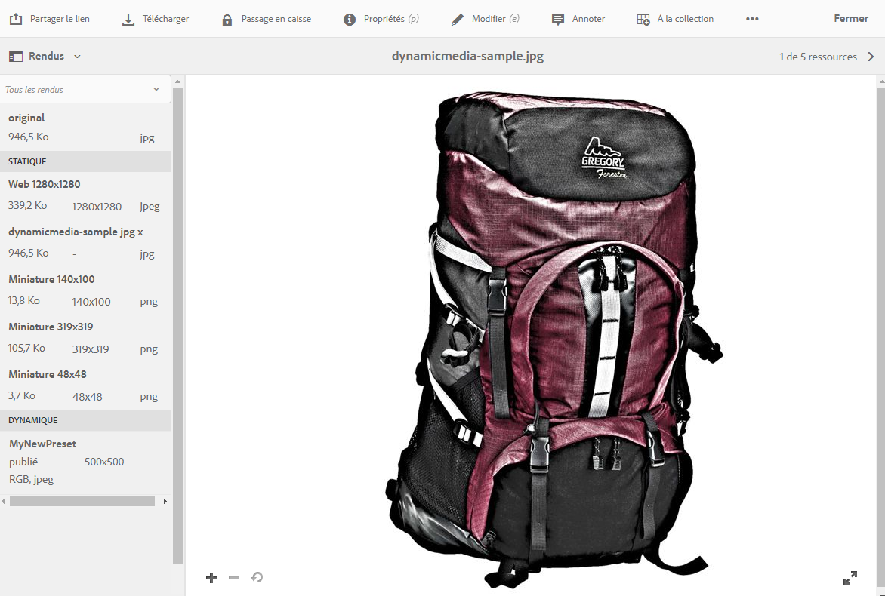
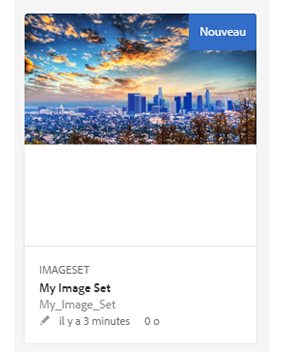

# Utilisation de Dynamic Media   {#working-with-dynamic-media}

[Dynamic Media](https://www.adobe.com/fr/marketing/experience-manager-assets/dynamic-media.html) fournit des ressources visuelles de marchandisage et de marketing à la demande, automatiquement dimensionnées pour une utilisation sur le web, les appareils mobiles et les réseaux sociaux. À partir d’un ensemble de ressources, Dynamic Media génère et diffuse en temps réel plusieurs variantes d’un même contenu enrichi par le biais de son réseau mondial et évolutif, aux performances optimisées.

Dynamic Media permet un affichage interactif, notamment le zoom, la rotation à 360° et la vidéo. Dynamic Media incorpore de manière unique les workflows de la gestion des ressources numériques d’Adobe Experience Manager pour simplifier et rationaliser le processus de gestion des campagnes numériques.

>[!NOTE]
>
>Un article de la communauté (en anglais) intitulé [Working with Adobe Experience Manager and Dynamic Media](https://helpx.adobe.com/fr/experience-manager/using/aem_dynamic_media.html) porte sur l’utilisation d’Adobe Experience Manager et de Dynamic Media.

## Tâches que vous pouvez effectuer avec Dynamic Media   {#what-you-can-do-with-dynamic-media}

Dynamic Media permet de gérer les ressources avant de les publier. L’utilisation générale des ressources est décrite en détail à la rubrique [Utilisation de ressources numériques](/help/assets/manage-digital-assets.md). Les rubriques générales incluent le chargement, le téléchargement, la modification et la publication des ressources, l’affichage et la modification des propriétés et la recherche de ressources.

Les fonctionnalités uniquement incluses dans Dynamic Media sont les suivantes :

* [Bannières de carrousel](carousel-banners.md)
* [Visionneuses d’images](image-sets.md)
* [Images interactives](interactive-images.md)
* [Vidéos interactives](interactive-videos.md)
* [Visionneuses de supports variés](mixed-media-sets.md)
* [Images panoramiques](panoramic-images.md)

* [Visionneuses à 360°](spin-sets.md)
* [Vidéo](video.md)
* [Diffusion de ressources Dynamic Media](delivering-dynamic-media-assets.md)
* [Gestion des ressources](managing-assets.md)
* [Utilisation d’aperçus rapides pour créer des fenêtres contextuelles personnalisées](custom-pop-ups.md)

Voir également [Configuration de Dynamic Media](administering-dynamic-media.md).

<!-- 

OBSOLETE UNTIL INTEGRATING SCENE7 TOPIC GETS A MAJOR UPDATE
>[!NOTE]
>
>To understand the differences between using Dynamic Media and integrating Dynamic Media Classic with AEM, see [Dynamic Media Classic integration versus Dynamic Media](/help/sites-cloud/administering/integrating-scene7.md#aem-scene-integration-versus-dynamic-media).

-->

## Dynamic Media activé ou Dynamic Media désactivé {#dynamic-media-on-versus-dynamic-media-off}

Les caractéristiques suivantes permettent de déterminer si Dynamic Media est activé ou non :

* Des rendus dynamiques sont disponibles lors du téléchargement ou de la prévisualisation des ressources.
* Des visionneuses d’images, à 360° et de supports variés sont disponibles.
* Des rendus PTIFF sont créés.

Lorsque vous cliquez sur une ressource image, l’affichage de la ressource est différent avec Dynamic Media activé. Dynamic Media utilise les visionneuses HTML5 à la demande.

### Rendus dynamiques {#dynamic-renditions}

Des rendus dynamiques, tels que des paramètres d’image et de visionneuse prédéfinis (sous **[!UICONTROL Dynamique]**), sont disponibles lorsque Dynamic Media est activé.

### Visionneuses d’images, à 360° et de supports variés {#image-sets-spins-sets-mixed-media-sets}

Des visionneuses d’images, à 360° et de supports variés sont disponibles lorsque Dynamic Media est activé.

### Rendus PTIFF {#ptiff-renditions}

Les ressources prises en charge par Dynamic Media comprennent `pyramid.tiffs`.

### Modification des vues des ressources {#asset-views-change}

Lorsque Dynamic Media est activé, vous pouvez effectuer un zoom avant et arrière en cliquant sur les boutons `+` et `-`. Vous pouvez également cliquer/appuyer pour effectuer un zoom sur une zone spécifique. L’option Revenir à cette version rétablit la version originale, et vous pouvez afficher l’image en mode plein écran en cliquant sur les flèches diagonales. Lorsque Dynamic Media est activé, cette fonctionnalité ressemble à celle-ci :

Lorsque Dynamic Media est désactivé, vous pouvez effectuer un zoom avant et arrière et revenir à la taille d’origine :

