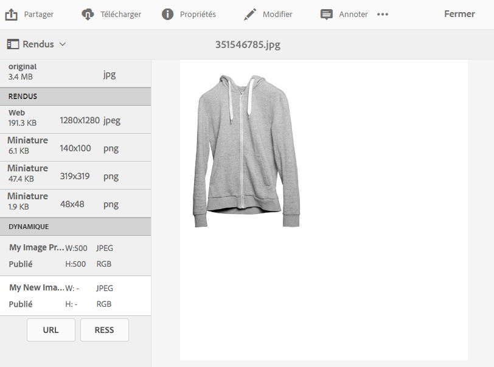

# Application de paramètres d’image prédéfinis Dynamic Media {#applying-image-presets}

Les préréglages d’image permettent aux ressources de fournir dynamiquement des images de différentes tailles, dans différents formats ou avec d’autres propriétés d’image qui sont générées dynamiquement. Vous pouvez choisir un paramètre prédéfini lors de l’exportation afin de reformater les images selon les spécifications définies par votre administrateur.

Vous pouvez en outre sélectionner un paramètre d’image prédéfini qui est réactif (désigné par le bouton **[!UICONTROL RESS]** une fois que vous l’avez sélectionné).

[Les administrateurs peuvent créer et configurer des paramètres d’image prédéfinis](managing-image-presets.md).

>[!NOTE]
>
>L’imagerie dynamique fonctionne avec vos paramètres d’image prédéfinis existants. Elle utilise les informations disponibles à la dernière milliseconde avant la diffusion pour réduire encore la taille du fichier image en fonction de la vitesse de connexion du navigateur ou du réseau. Voir [Imagerie numérique](imaging-faq.md) pour plus d’informations.

Vous pouvez appliquer un paramètre d’image prédéfini à une image lorsque vous la prévisualisez.

**Pour appliquer les paramètres d’image prédéfinis Dynamic Media :**

1. Ouvrez la ressource et, dans le rail de gauche, sélectionnez dans la liste déroulante, puis l’option **[!UICONTROL Rendus]**.

   >[!NOTE]
   >
   >* Les rendus statiques apparaissent dans la moitié supérieure du volet. Les rendus dynamiques apparaissent dans la moitié inférieure. Vous ne pouvez utiliser l’URL pour afficher l’image qu’avec les rendus dynamiques.  Le bouton **[!UICONTROL URL]** n’apparaît que si vous sélectionnez un rendu dynamique. Le bouton **[!UICONTROL RESS]** s’affiche uniquement si vous sélectionnez un paramètre d’image prédéfini réactif.
   >
   >* Le système affiche plusieurs rendus lorsque vous sélectionnez **[!UICONTROL Rendus]** dans l’affichage des détails d’une ressource. Vous pouvez augmenter le nombre de paramètres prédéfinis visibles. Voir [Augmentation du nombre de paramètres d’image prédéfinis affichés](managing-image-presets.md#increasing-or-decreasing-the-number-of-image-presets-that-display).

   

1. Procédez de l’une des manières suivantes :

   * Pour prévisualiser le paramètre d’image prédéfini, sélectionnez un rendu dynamique.
   * Pour afficher la fenêtre pop-up, sélectionnez **[!UICONTROL URL]**, **[!UICONTROL Incorporer]** ou **[!UICONTROL RESS]**.

   >[!NOTE]
   >
   >Si la ressource *et* le paramètre d’image prédéfini ne sont pas encore publiés, le bouton **[!UICONTROL URL]** (ou les boutons URL et RESS, le cas échéant) n’est pas disponible.
   >
   >Notez également que les paramètres prédéfinis de l’image sont automatiquement publiés sur un serveur Dynamic Media S7.
