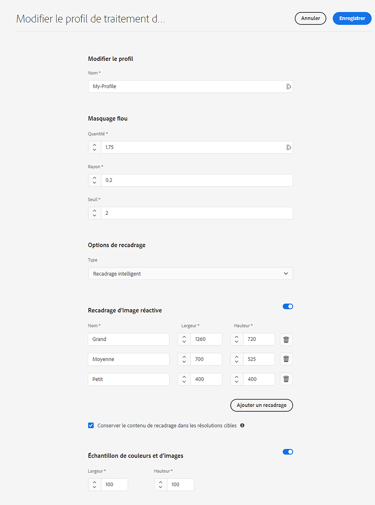
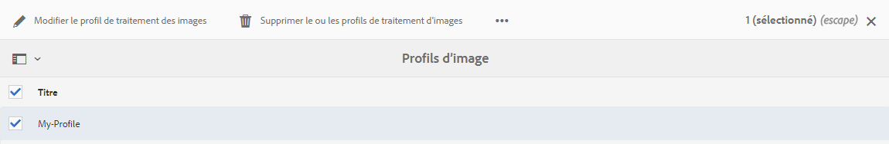
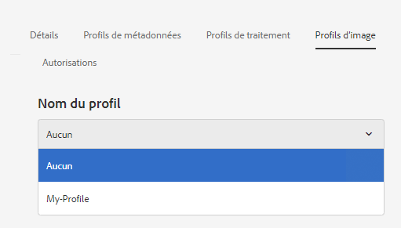
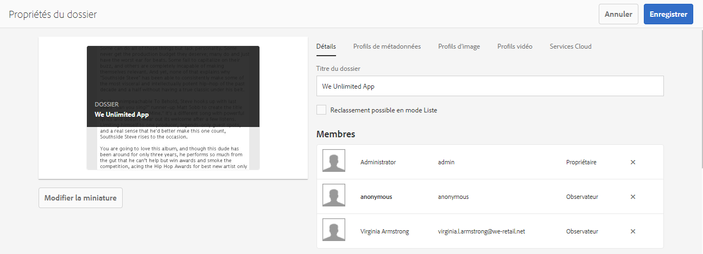
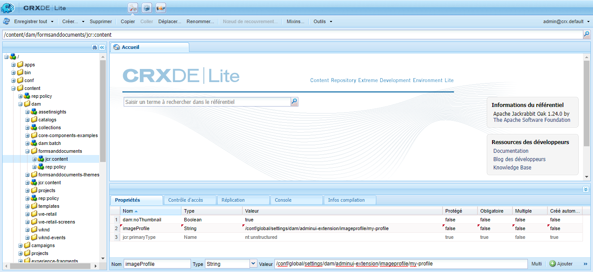
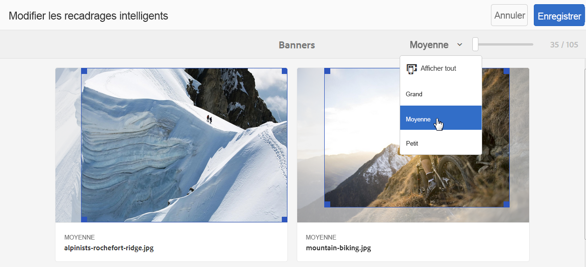
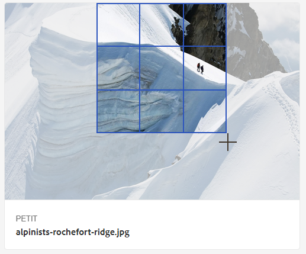
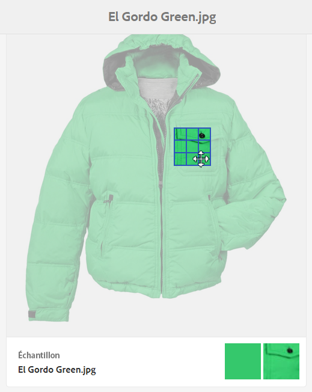
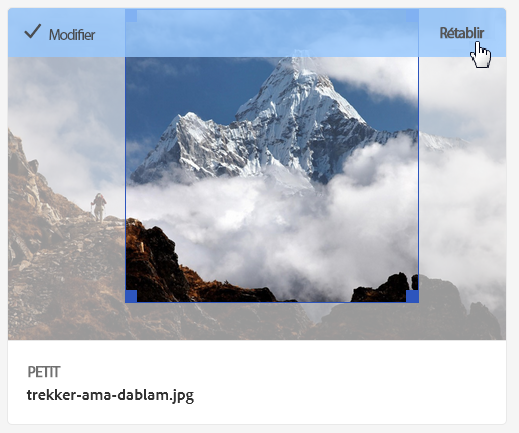

# Profils d’image Dynamic Media {#image-profiles}

Lorsque vous chargez des images, vous pouvez les recadrer automatiquement en appliquant un profil d’image au dossier.

## Options de recadrage {#crop-options}

Vous avez le choix entre deux options de recadrage d’image, ainsi qu’une option permettant d’automatiser la création des échantillons de couleur et d’image.

>[!IMPORTANT]
>
>Gardez à l’esprit que chaque génération de recadrage dynamique créée nécessite un traitement supplémentaire. Par exemple, l’ajout de plus de cinq proportions de recadrage intelligent peut entraîner un taux d’assimilation des ressources lent. Il peut également augmenter la charge sur les systèmes. Etant donné que vous pouvez appliquer une recadrage dynamique au niveau des dossiers, Adobe recommande de l’utiliser *uniquement* dans les dossiers où cela est nécessaire.

<table>
 <tbody>
  <tr>
   <td><strong>Option</strong></td>
   <td><strong>Quand utiliser la personnalisation</strong></td>
   <td><strong>Description</strong></td>
  </tr>
  <tr>
   <td>Recadrage des pixels</td>
   <td>Recadrez des images en masse uniquement en fonction des dimensions.</td>
   <td>
Pour utiliser cette option, sélectionnez <strong>Recadrage des pixels</strong> dans la liste déroulante Options de recadrage.
 
Pour recadrer les bords d’une image, entrez le nombre de pixels à rogner de n’importe quel côté ou de chaque côté de l’image. La proportion du recadrage de l’image dépend du paramètre ppi (pixels par pouce) du fichier image.
 
Le recadrage des pixels d’un profil d’image est rendu de la façon suivante :  

    <ul>
     <li>Les valeurs sont : haut, bas, gauche et droite.</li>
     <li>Le coin supérieur gauche est considéré comme 0,0, et le recadrage des pixels est calculé à partir de cet endroit.</li>
     <li>Point de départ du recadrage : la gauche est X et le haut est Y</li>
     <li>Calcul horizontal : dimension horizontale en pixels de l’image originale moins la gauche puis moins la droite.</li>
     <li>Calcul vertical : hauteur verticale en pixels moins le haut puis moins le bas.</li>
    </ul> 
Prenons l’exemple d’une image de 4 000 x 3 000 pixels. On utilise les valeurs : haut=250 ; bas=500 ; gauche=300 ; droite=700.
 
À partir du coin supérieur gauche (300,250), recadrez l’image en utilisant l’espace de remplissage de (4000-300-700, 3000-250-500 ou 3000,2250).
 </td>
  </tr>
  <tr>
   <td>Recadrage intelligent</td>
   <td>Recadrez des images en masse en fonction de leur point focal visuel.</td>
   <td>
Le recadrage dynamique utilise la puissance de l’intelligence artificielle d’Adobe Sensei afin d’automatiser rapidement le recadrage des images en masse. Il détecte automatiquement le point focal de n’importe quelle image et recadre de façon à capturer le point ciblé prévu, quelle que soit la taille de l’écran.
 
Pour utiliser le recadrage intelligent, sélectionnez <strong>Recadrage intelligent</strong> dans la liste déroulante Options de recadrage, puis à droite de Recadrage d’image réactive, activez la fonction.
 
Les tailles de points d’arrêt par défaut Grand, Moyen et Petit couvrent généralement la gamme de tailles utilisée par la plupart des images sur les appareils mobiles, les tablettes, les ordinateurs de bureau et les bannières. Si vous le souhaitez, vous pouvez modifier les noms par défaut Grand, Moyen et Petit.
 
Pour ajouter d’autres points d’arrêt, cliquez sur <strong>Ajouter un recadrage</strong> ; pour supprimer un recadrage, cliquez sur l’icône de corbeille.
 </td>
  </tr>
  <tr>
   <td>Échantillon de couleurs et d’images</td>
   <td>Générez en masse un échantillon pour chaque image.</td>
   <td>
<strong>Remarque</strong> : Smart Swatch n’est pas pris en charge par Dynamic Media Classic.
 
Localisez et générez automatiquement des échantillons de qualité supérieure des images de produits qui affichent la couleur ou la texture.
 
Pour utiliser l’échantillon de couleurs et d’images, sélectionnez <strong>Recadrage intelligent</strong> dans la liste déroulante Options de recadrage, puis à droite d’Échantillon de couleurs et d’images, activez la fonction. Saisissez une valeur de pixels dans les zones de texte Largeur et Hauteur.
 
Même si tous les recadrages d’images sont fournis par le rail Rendus, les échantillons sont utilisés uniquement par l’intermédiaire de la fonction Copier l’URL. Notez que vous devez utiliser votre propre composant d’affichage pour effectuer le rendu de l’échantillon sur votre site. (Les bannières de carrousel sont une exception. Dynamic Media fournit le composant d’affichage pour l’échantillon utilisé dans les bannières de carrousel.)
 
<strong>Utilisation d’échantillons d’images</strong>
 
L’URL des échantillons d’images est simple. Elle suit ce format :
 
<code>/is/image/company/&lt;asset_name&gt;:Swatch</code>
 
Où <code>:Swatch</code> est ajouté à la demande de ressource.
 
<strong>Utilisation des échantillons de couleurs</strong>
 
Pour utiliser les échantillons de couleurs, vous effectuez une demande <code>req=userdata</code> de la façon suivante :
 
<code>/is/image/&lt;company_name&gt;/&lt;swatch_asset_name&gt;:Swatch?req=userdata</code>
 
Par exemple, voici une ressource d’échantillon dans Dynamic Media Classic (Scene7) :
 
<code>https://my.company.com:8080/is/image/DemoCo/Sleek:Swatch</code>
 
et voici l’URL <code>req=userdata</code> correspondant à la ressource d’échantillon :
 
<code>https://my.company.com:8080/is/image/DemoCo/Sleek:Swatch?req=userdata</code>
 
La réponse <code>req=userdata</code> se présente comme suit :
 
<code class="code">SmartCropDef=Swatch
       SmartCropHeight=200.0
       SmartCropRect=0.421671,0.389815,0.0848564,0.0592593,200,200
       SmartCropType=Swatch
       SmartCropWidth=200.0
       SmartSwatchColor=0xA56DB2</code>
 
Vous pouvez également demander une réponse <code>req=userdata</code> au format XML ou JSON, comme dans les exemples d’URL respectifs suivants :
 
<code>https://my.company.com:8080/is/image/DemoCo/Sleek:Swatch?req=userdata,xml</code>

<code>SmartSwatchColor</code>

</td></tr></tbody></table>

## Accentuation {#unsharp-mask}

Sélectionnez l’option **[!UICONTROL Accentuation]** pour affiner l’effet d’un filtre d’accentuation sur l’image finale à résolution réduite. Vous pouvez contrôler l’intensité de l’effet, son rayon (mesuré en pixels) , et un seuil de contraste qui seront ignorés. Cet effet utilise les mêmes options que le filtre Accentuation d’Adobe Photoshop.

>[!NOTE]
>
>Le masque flou est appliqué uniquement aux rendus réduits au sein du PTIFF (pyramid tiff), dont la résolution est réduite de plus de 50 %. Cela signifie que les rendus de taille plus grande à l’intérieur du ptiff ne sont pas affectés par le masque flou tandis que les rendus de plus petite taille, comme les vignettes, sont altérés (et affichent le masque flou).

L’option **[!UICONTROL Accentuation]** propose les options de filtre suivantes :

<table>
 <tbody>
  <tr>
   <td><strong>Option</strong></td>
   <td><strong>Description</strong></td>
  </tr>
  <tr>
   <td>Quantité</td>
   <td>Contrôle le degré de contraste appliqué aux pixels de contour. La valeur par défaut est 1.75. Pour les images à haute résolution, vous pouvez l’augmenter jusqu’à 5. Considérez la quantité comme une mesure de l’intensité du filtre. La plage est 0 à 5.</td>
  </tr>
  <tr>
   <td>Rayon</td>
   <td>Détermine le nombre de pixels entourant les pixels de contour qui affectent l’accentuation. Pour les images à haute résolution, entrez une valeur comprise entre 1 et 2. Une valeur faible accentue uniquement les pixels de contour ; une valeur élevée accentue une bande plus large de pixels. La valeur appropriée dépend de la taille de l’image. La valeur par défaut est 0,2.    La plage est 0 à 250.</td>
  </tr>
  <tr>
   <td>Seuil</td>
   <td>
Détermine la plage de contraste à ignorer lorsque le filtre de masquage flou est appliqué. En d’autres termes, cette option définit l’écart recherché entre les pixels et la zone environnante avant qu’ils ne soient considérés comme des pixels de contour et ne soient accentués. Pour éviter d’introduire du bruit, essayez des valeurs comprises entre 0 et 255.
 </td>
  </tr>
 </tbody>
</table>

L’accentuation est décrite dans la section [Accentuation des images](/help/assets/dynamic-media/assets/s7_sharpening_images.pdf.

## Création de profils d’image Dynamic Media {#creating-image-profiles}

Pour définir des paramètres de traitement avancés pour d’autres types de ressources, voir [Configuration du traitement des ressources](config-dm.md#configuring-asset-processing).

Voir [Profils de traitement des métadonnées, des images et des vidéos](/help/assets/dynamic-media/processing-profiles.md).

Consultez également la section [Bonnes pratiques pour organiser vos ressources numériques en vue d’utiliser des profils de traitement](/help/assets/dynamic-media/best-practices-for-file-management.md).

**Pour créer des profils d’image Dynamic Media**

1. Appuyez sur le logo AEM et accédez à **[!UICONTROL Outils > Ressources > Profils d’image]**.
1. Appuyez sur **[!UICONTROL Créer]** pour ajouter un nouveau profil d’image.
1. Saisissez un nom de profil et les valeurs pour un masquage flou, un recadrage et/ou un échantillon.

   Il est parfois utile d’utiliser un nom de profil spécifique à sa finalité prévue. Par exemple, si vous souhaitez créer un profil qui génère des échantillons uniquement (en d’autres termes, le recadrage intelligent est désactivé, et l’échantillon de couleurs et d’images est activé), vous pouvez utiliser le nom de profil « Échantillons intelligents ».

   Voir aussi [Options de recadrage intelligent et d’échantillonnage intelligent](#crop-options) et [Accentuation](#unsharp-mask).

   

1. Appuyez sur **[!UICONTROL Enregistrer]**. Le profil nouvellement créé apparaît dans la liste des profils disponibles.

## Modification ou suppression de profils d’image Dynamic Media {#editing-or-deleting-image-profiles}

1. Appuyez sur le logo AEM et accédez à **[!UICONTROL Outils > Ressources > Profils d’image]**.
1. Sélectionnez le profil de l’image que vous souhaitez modifier ou supprimer. Pour le modifier, sélectionnez **[!UICONTROL Modifier le profil de traitement d’image]**. Pour le supprimer, sélectionnez **[!UICONTROL Supprimer le profil de traitement d’image]**.

   

1. En cas de modification, enregistrez les modifications ; en cas de suppression, confirmez la suppression du profil.

## Application d’un profil d’image Dynamic Media aux dossiers {#applying-an-image-profile-to-folders}

Lorsque vous affectez un profil d’image à un dossier, tout sous-dossier hérite automatiquement du profil de son dossier parent. Cela signifie que vous ne pouvez affecter qu’un seul profil d’image à un dossier. Nous vous conseillons donc de choisir avec la plus grande attention la structure du dossier dans lequel vous transférez, stockez, utilisez et archivez des ressources.

Si vous avez affecté un profil d’image différent à un dossier, le nouveau profil remplace le précédent. Les ressources du dossier précédent restent inchangées. Le nouveau profil sera appliqué aux ressources ajoutées ultérieurement au dossier.

Les dossiers auxquels un profil est attribué sont indiqués dans l’interface utilisateur grâce au nom du profil qui apparaît sur la carte.

<!-- When you add smart crop to an existing image profile, you need to re-trigger the [DAM Update Asset workflow](assets-workflow.md) if you want to generate crops for existing assets in your asset repository. -->

Vous pouvez appliquer des profils d’image à des dossiers spécifiques, ou de façon globale à toutes les ressources.

Vous pouvez retraiter des ressources dans un dossier qui comporte déjà un profil d’image que vous avez modifié. Voir [Retraitement des ressources dans un dossier après avoir modifié son profil de traitement](/help/assets/dynamic-media/processing-profiles.md#reprocessing-assets).

### Application de profils d’image Dynamic Media à des dossiers spécifiques {#applying-image-profiles-to-specific-folders}

Vous pouvez appliquer un profil d’image à un dossier à partir du menu **[!UICONTROL Outils]**, ou si vous êtes dans le dossier, via **[!UICONTROL Propriétés]**. Cette section décrit comment appliquer des profils d’image aux dossiers de deux manières.

Dans le cas des dossiers auxquels un profil est déjà affecté, le nom du profil est affiché directement sous celui du dossier.

Vous pouvez retraiter des ressources dans un dossier qui comporte déjà un profil vidéo que vous avez modifié. Voir [Retraitement des ressources dans un dossier après avoir modifié son profil de traitement](/help/assets/dynamic-media/processing-profiles.md#reprocessing-assets).

#### Application de profils d’image Dynamic Media à des dossiers à partir de l’interface utilisateur Profils {#applying-image-profiles-to-folders-from-profiles-user-interface}

1. Appuyez sur le logo AEM et accédez à **[!UICONTROL Outils > Ressources > Profils d’image]**.
1. Sélectionnez le profil d’image à appliquer à un ou plusieurs dossiers.

   

1. Appuyez/cliquez sur **[!UICONTROL Appliquer le profil de traitement au(x) dossier(s)]** et sélectionnez le ou les dossiers que vous souhaitez utiliser pour recevoir les nouvelles ressources chargées, puis appuyez/cliquez sur **[!UICONTROL Appliquer]**. Dans le cas des dossiers auxquels un profil est déjà affecté, le nom du profil est affiché directement sous celui du dossier.

#### Application de profils d’image Dynamic Media aux dossiers à partir des propriétés {#applying-image-profiles-to-folders-from-properties}

1. Appuyez sur le logo AEM et accédez à **[!UICONTROL Ressources]**, puis au dossier auquel vous souhaitez appliquer un profil d’image.
1. Dans le dossier, appuyez sur la coche pour la sélectionner, puis sur **[!UICONTROL Propriétés]**.
1. Appuyez sur l’onglet **[!UICONTROL Profils d’image]**. Dans la liste déroulante **[!UICONTROL Nom du profil]**, sélectionnez le profil, puis appuyez sur **[!UICONTROL Enregistrer et fermer]**. Dans le cas des dossiers auxquels un profil est déjà affecté, le nom du profil est affiché directement sous celui du dossier.

   

### Application globale d’un profil d’image Dynamic Media {#applying-an-image-profile-globally}

En plus d’appliquer un profil à un dossier, vous pouvez en appliquer un de façon globale, de sorte que tout contenu chargé dans AEM Assets soit traité par ce profil, indifféremment du dossier.

Vous pouvez retraiter des ressources dans un dossier qui comporte déjà un profil vidéo que vous avez modifié. Voir [Retraitement des ressources dans un dossier après avoir modifié son profil de traitement](/help/assets/dynamic-media/processing-profiles.md#reprocessing-assets).

**Pour appliquer globalement un profil d’image Dynamic Media** :

1. Utilisez l’une des méthodes suivantes :

   * Accédez à `https://&lt;AEM server&gt;/mnt/overlay/dam/gui/content/assets/foldersharewizard.html/content/dam` et appliquez le profil approprié, puis appuyez sur **[!UICONTROL Enregistrer]**.

      

   * Accédez au nœud suivant de CRXDE Lite : `/content/dam/jcr:content`.

      Ajoutez la propriété `imageProfile:/conf/global/settings/dam/adminui-extension/imageprofile/<name of image profile>` et appuyez sur **[!UICONTROL Tout enregistrer]**.

      

## Modification du recadrage intelligent ou de l’échantillon intelligent d’une seule image {#editing-the-smart-crop-or-smart-swatch-of-a-single-image}

Vous pouvez réaligner ou redimensionner manuellement la fenêtre de recadrage intelligent d’une image pour affiner davantage son point focal.

Une fois que vous avez modifié et enregistré un recadrage intelligent, le changement est propagé partout où vous utilisez le recadrage des images spécifiques.

Vous pouvez exécuter à nouveau le recadrage intelligent pour générer des recadrages supplémentaires, le cas échéant.

Voir aussi [Modification du recadrage intelligent ou de l’échantillon intelligent de plusieurs images](#editing-the-smart-crop-or-smart-swatch-of-multiple-images).

**Pour modifier le recadrage intelligent ou l’échantillon intelligent d’une seule image** :

1. Appuyez sur le logo AEM et accédez à **[!UICONTROL Ressources]**, puis au dossier auquel est appliqué un profil d’image de recadrage intelligent ou d’échantillon intelligent.

1. Appuyez sur le dossier pour ouvrir son contenu.
1. Appuyez sur l’image dont vous voulez ajuster le recadrage intelligent ou l’échantillon intelligent.
1. Dans la barre d’outils, appuyez sur **[!UICONTROL Recadrage intelligent]**.

1. Procédez de l’une des manières suivantes :

   * Près du coin supérieur droit de la page, faites glisser le curseur vers la gauche ou vers la droite pour augmenter ou réduire l’affichage de l’image, respectivement.
   * Dans l’image, faites glisser une poignée d’angle pour régler la taille de la zone visible du recadrage ou de l’échantillon.
   * Dans l’image, faites glisser la zone/l’échantillon vers un nouvel emplacement. Vous pouvez modifier uniquement les échantillons d’images ; les échantillons de couleurs sont statiques.
   * Au-dessus de l’image, appuyez sur **[!UICONTROL Rétablir]** pour annuler toutes les modifications effectuées et restaurer le recadrage ou l’échantillon d’origine.

1. Près du coin supérieur droit de la page, appuyez sur **[!UICONTROL Enregistrer]**, puis appuyez sur **[!UICONTROL Fermer]** pour revenir au dossier des ressources.

## Modification du recadrage intelligent ou de l’échantillon intelligent de plusieurs images {#editing-the-smart-crop-or-smart-swatch-of-multiple-images}

Après avoir appliqué un profil d’image (contenant un recadrage intelligent) sur un dossier, un recadrage est appliqué à toutes les images de ce dossier. Si vous le souhaitez, vous pouvez réaligner ou redimensionner *manuellement* la fenêtre de recadrage intelligent dans plusieurs images pour affiner davantage leur point focal.

Une fois que vous avez modifié et enregistré un recadrage intelligent, le changement est propagé partout où vous utilisez le recadrage des images spécifiques.

Vous pouvez exécuter à nouveau le recadrage intelligent pour générer des recadrages supplémentaires, le cas échéant.

**Pour modifier le recadrage intelligent ou l’échantillon intelligent de plusieurs images** :

1. Appuyez sur le logo AEM et accédez à **[!UICONTROL Ressources]**, puis à un dossier auquel est appliqué un profil d’image de recadrage intelligent ou d’échantillon intelligent.
1. Sur le dossier, appuyez sur l’icône **[!UICONTROL Autres actions]** (...), puis sur **[!UICONTROL Recadrage intelligent]**.

1. Sur la page **[!UICONTROL Modifier les recadrages intelligents]**, utilisez l’une des méthodes suivantes :

   * Ajustez la taille d’affichage des images sur la page.

      À droite de la liste déroulante de noms de points d’arrêt, faites glisser le curseur vers la gauche ou la droite pour modifier la taille de l’affichage d’image visible.

      

   * Vous pouvez filtrer la liste des images visibles en fonction des noms de points d’arrêt. Dans l’exemple ci-dessous, les images sont filtrées en fonction du nom de point d’arrêt « Moyen ».

       Près du coin supérieur droit de la page, dans la liste déroulante, sélectionnez un nom de point d’arrêt pour filtrer les images que vous souhaitez voir (voir l’image ci-dessus).

      

   * Redimensionnez la zone de recadrage intelligent. Effectuez l’une des opérations suivantes :

      * Si l’image comporte un recadrage intelligent ou un échantillon intelligent uniquement, faites glisser sur celle-ci la poignée de l’angle de la zone de recadrage pour ajuster la taille de la zone visible du recadrage.
      * Si l’image comporte à la fois un recadrage intelligent et un échantillon intelligent, faites glisser sur celle-ci la poignée de l’angle de la zone de recadrage pour ajuster la taille de la zone visible du recadrage. Ou, appuyez ou cliquez sur l’échantillon intelligent sous l’image (les échantillons de couleurs sont statiques), puis faites glisser la poignée de l’angle de la zone de recadrage pour ajuster la taille de la zone visible de l’échantillon.
      

   * Déplacez la zone de recadrage intelligent. Effectuez l’une des opérations suivantes :

      * Si l’image comporte un recadrage intelligent ou un échantillon intelligent uniquement, faites glisser sur celle-ci la zone de recadrage vers un nouvel emplacement.
      * Si l’image comporte à la fois un recadrage intelligent et un échantillon intelligent, faites glisser sur celle-ci la zone de recadrage intelligent vers un nouvel emplacement. Vous pouvez également appuyer ou cliquer sur l’échantillon intelligent sous l’image (les échantillons de couleurs sont statiques), puis faire glisser la zone de recadrage intelligent de l’échantillon vers un nouvel emplacement.
      

   * Annulez toutes vos modifications et rétablissez le recadrage intelligent ou l’échantillon intelligent d’origine (s’applique à la session de modification active uniquement).

      Appuyez sur **[!UICONTROL Rétablir]** au-dessus de l’image.

      

1. Dans le coin supérieur droit de la page, appuyez sur **[!UICONTROL Enregistrer]**. Ensuite, appuyez sur **[!UICONTROL Fermer]** pour revenir au dossier des ressources.

## Suppression d’un profil d’image d’un dossier {#removing-an-image-profile-from-folders}

Lorsque vous supprimez un profil d’image d’un dossier, tout sous-dossier hérite automatiquement de la suppression du profil de son dossier parent. Cependant, le traitement des fichiers qui s’est produit dans les dossiers reste intact.

Vous pouvez supprimer un profil d’image appliqué à un dossier dans le menu **[!UICONTROL Outils]**, ou si vous êtes dans le dossier, via **[!UICONTROL Propriétés]**. Cette section décrit comment supprimer des profils d’image appliqués aux dossiers en utilisant les deux procédures.

### Suppression d’un profil d’image Dynamic Media d’un dossier au moyen de l’interface utilisateur Profils {#removing-image-profiles-from-folders-via-profiles-user-interface}

1. Appuyez sur le logo AEM et accédez à **[!UICONTROL Outils > Ressources > Profils d’image]**.
1. Sélectionnez le profil d’image à supprimer d’un ou de plusieurs dossiers.
1. Appuyez sur **[!UICONTROL Supprimer le profil de traitement du ou des dossiers]**, sélectionnez le ou les dossiers desquels vous souhaitez supprimer le profil, et appuyez sur **[!UICONTROL Terminé]**.

   Le fait que le nom du profil n’apparaît plus sous celui du dossier indique que le profil d’image n’est plus appliqué à un dossier.

### Suppression d’un profil d’image Dynamic Media d’un dossier au moyen des propriétés {#removing-image-profiles-from-folders-via-properties}

1. Appuyez sur le logo AEM et accédez à **[!UICONTROL Ressources]**, puis au dossier duquel vous souhaitez supprimer un profil d’image.
1. Dans le dossier, appuyez sur la coche pour le sélectionner, puis sur **[!UICONTROL Propriétés]**.
1. Sélectionnez l’onglet **[!UICONTROL Profils d’image]**.
1. Dans le menu déroulant **[!UICONTROL Nom du profil]**, sélectionnez **[!UICONTROL Aucun]**, puis appuyez sur **[!UICONTROL Enregistrer et fermer]**.

   Dans le cas des dossiers auxquels un profil est déjà affecté, le nom du profil est affiché directement sous celui du dossier.
