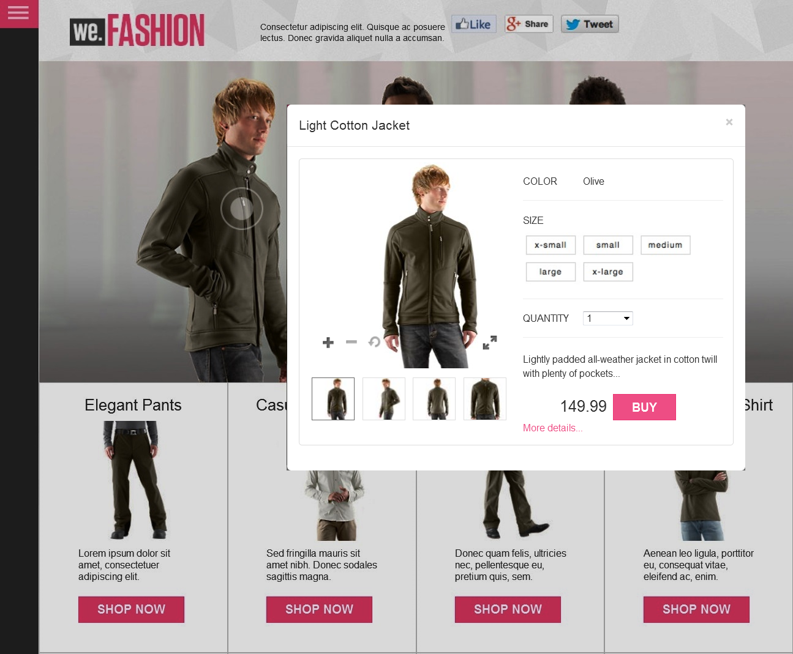

# Images interactives{#interactive-images}

Vous pouvez facilement rendre les images statiques riches et attrayantes pour les clients en faisant glisser des zones réactives &quot;susceptibles d’être visitées&quot; sur une image. Les points d’accès aux boutiques combinent des informations supplémentaires sur un produit ou un service avec une fonctionnalité directe de point de vente &quot;Ajouter au panier&quot; ou &quot;Acheter&quot;. Les clients peuvent appuyer ou cliquer sur ces zones réactives et être directement liés au produit ou au service, l’ajouter à un panier ou être liés à une page Web. Des expériences directes comme celles-ci augmentent l’engagement et la conversion des clients sur votre site Web.

Voici une bannière publicitaire avec une fenêtre contextuelle d’aperçu rapide. L’utilisateur active l’aperçu rapide en appuyant sur le cercle ou la « zone réactive » du modèle.



Voir les images [interactives en action](https://marketing.adobe.com/resources/help/en_US/dm/shoppable-banner/we-fashion-QVzoom/index2-shoppable.html) sur la page Web illustrée ci-dessus.

## Découvrir comment les bannières d’images interactives sont créées {#watch-how-interactive-image-banners-are-created}

Visionnez une présentation vidéo de 10 minutes et 33 secondes sur la [création de bannières d’images interactives](https://s7d5.scene7.com/s7viewers/html5/VideoViewer.html?videoserverurl=https://s7d5.scene7.com/is/content/&emailurl=https://s7d5.scene7.com/s7/emailFriend&serverUrl=https://s7d5.scene7.com/is/image/&config=Scene7SharedAssets/Universal_HTML5_Video_social&contenturl=https://s7d5.scene7.com/skins/&asset=S7tutorials/InteractiveCarouselBanner). Vous apprendrez également à prévisualiser, modifier et diffuser des bannières d’images interactives.

## Démarrage rapide : images interactives {#quick-start-interactive-images}

La description suivante du processus étape par étape est conçue pour vous aider à mettre en route rapidement les images interactives dans AEM Assets.

Recherchez le titre **Exemple** dans certaines tâches de démarrage rapide. It contains a brief tutorial that is based on a [web page example that does not yet have Interactive Images added to it](https://marketing.adobe.com/resources/help/en_US/dm/shoppable-banner/we-fashion/landing-0.html).


Le tutoriel permet d’illustrer les étapes d’intégration d’images interactives à votre site web.

Étapes des images interactives :

1. **(Facultatif) Identification des variables** de zone réactive - Si vous utilisez AEM Assets et Dynamic Media de manière autonome, commencez par identifier les variables dynamiques utilisées dans votre implémentation de visualisation rapide existante afin que vous puissiez saisir des données de zone réactive lors de la création de l’image interactive. Reportez-vous à la section [(Facultatif) Identification des variables de zone réactive](#optional-identifying-hotspot-variables).
Cependant, si vous utilisez AEM Sites ou AEM eCommerce, ou les deux, cette étape n’est pas nécessaire.

1. **(Facultatif) Création d’un paramètre** prédéfini de visionneuse d’images interactives - Personnalisez l’image graphique utilisée pour représenter les zones réactives. Vous n’avez pas besoin de créer votre propre paramètre prédéfini de visionneuse d’images interactives si vous envisagez plutôt d’utiliser le paramètre prédéfini de visionneuse d’images interactives prêt à l’emploi `Shoppable_Banner`.
Reportez-vous à la section [(Facultatif) Création d’un paramètre prédéfini de visionneuse d’images interactives](/help/assets/dynamic-media/managing-viewer-presets.md#creating-a-new-viewer-preset).

1. **Téléchargement d&#39;une bannière** d&#39;image - Téléchargez les bannières d&#39;image que vous souhaitez rendre interactives.
Voir [Téléchargement d’une bannière](#uploading-an-image-banner)d’image.

1. **Ajout de zones réactives à une bannière** d’image - Ajoutez une ou plusieurs zones réactives à une bannière d’image et associez chacune d’elles à une action telle qu’un hyperlien, une vue rapide ou un fragment d’expérience. Après avoir ajouté des zones réactives, vous terminez cette tâche en publiant l’image interactive.
Reportez-vous à la section [Ajout de zones réactives à une bannière d’image](#adding-hotspots-to-an-image-banner).
Reportez-vous à la section [Prévisualisation d’images interactives](#optional-previewing-interactive-images) – Facultatif. Si vous le souhaitez, vous pouvez afficher une représentation de votre bannière publicitaire et tester son interactivité.
Voir [Publication de ressources](/help/assets/dynamic-media/publishing-dynamicmedia-assets.md) pour obtenir des informations sur la publication de ressources d’images interactives.

1. **Ajout d’une image interactive sur votre site web ou sur votre site web dans AEM** Si vous utilisez AEM Sites ou AEM eCommerce, ou les deux, vous pouvez ajouter l’image interactive directement dans une page web dans AEM en faisant glisser le composant Interactive Media dans la page. Reportez-vous à la section [Ajout de ressources Dynamic Media aux pages.](/help/assets/dynamic-media/adding-dynamic-media-assets-to-pages.md)Si vous utilisez des instances autonomes d’AEM Assets et de Dynamic Media, vous devez copier le code intégré sur votre site web, puis l’intégrer à votre aperçu rapide existant. Reportez-vous à la section [Intégration d’une image interactive à votre site web](#integrating-an-interactive-image-with-your-website).
 Si vous utilisez un gestionnaire de contenu web (WCM) tiers, vous devez intégrer la nouvelle vidéo interactive à l’aperçu rapide existant utilisé sur votre site web. Reportez-vous à la section [Intégration d’une image interactive dans un aperçu rapide existant](#integrating-an-interactive-image-with-an-existing-quickview).

## (Optional) Identifying hotspot variables {#optional-identifying-hotspot-variables}

>[!NOTE]
>
>Cette tâche n’est nécessaire que si les conditions ci-dessous sont vraies :
>
>* Vous souhaitez ajouter de l’interactivité à votre image en déclenchant des aperçus rapides.
>* Votre mise en œuvre d’AEM n’utilise *pas* de structure d’intégration de commerce électronique pour extraire des données de produit dans AEM à partir d’une solution de commerce électronique, comme IBM WebSphere Commerce, Elastic Pathe, Hybris ou Intershop.
>
>
Si votre mise en œuvre d’AEM utilise le commerce électronique, vous pouvez ignorer cette tâche et passer à la tâche suivante.

Commencez par identifier les variables dynamiques utilisées par votre mise en œuvre de l’aperçu rapide existant afin de pouvoir entrer les données de zone réactive pour créer l’image interactive.

Lorsque vous ajoutez des zones réactives à une image de bannière dans AEM Assets, vous devez affecter un SKU (Stock Keeping Unit, unité de conservation des stocks) ; un identifiant unique pour chaque produit ou service distinct que vous proposez) et des variables supplémentaires facultatives pour chaque zone réactive. Ces variables de zones réactives sont utilisées ultérieurement pour faire corresponde des zones réactives avec du contenu d’aperçu rapide.

Il est important d’identifier correctement le nombre et le type de variables à associer aux données de zone réactive. Chaque zone réactive ajoutée à une image de bannière doit comporter suffisamment d’informations pour identifier clairement le produit sur le système principal existant.

Il existe différentes manières d’identifier un jeu de variables à utiliser pour les données des zones réactives.

Il peut parfois être nécessaire de consulter les spécialistes informatiques responsables de l’implémentation d’aperçu rapide existante, car ils connaissent probablement le jeu minimum de données nécessaires pour identifier l’aperçu rapide dans le système. Cependant, dans la plupart des cas, il est également possible d’analyser le comportement existant du code frontal.

La majorité des implémentations d’aperçu rapide utilisent le paradigme suivant :

* L’utilisateur active un élément d’interface utilisateur sur le site web. Par exemple, en cliquant sur un bouton « Aperçu rapide ».
* Le site web envoie une demande Ajax au serveur principal afin de charger les données ou le contenu de l’aperçu rapide, le cas échéant.
* Les données de l’aperçu rapide sont traduites en contenu en préparation du rendu sur la page web.
* Enfin, le code frontal effectue le rendu visuel de ce contenu à l’écran.

L’approche consiste alors à visiter différentes zones du site web existant où la fonctionnalité d’aperçu rapide est implémentée, à déclencher l’aperçu rapide et à capturer l’URL Ajax envoyée par la page web pour charger les données ou le contenu de l’aperçu rapide.

Normalement, il n’est pas nécessaire d’utiliser des outils de débogage spécialisés. Les navigateurs web modernes incluent des inspecteurs web qui font un travail adéquat. Vous trouverez ci-dessous quelques exemples de navigateurs web qui incluent des inspecteurs web :

* Pour voir toutes les demandes HTTP sortantes dans Google Chrome, appuyez sur F12 pour ouvrir le panneau Outils de développement, puis cliquez sur l’onglet Réseau.
Sur Mac, appuyez sur Commande+Option+I pour ouvrir le panneau Outils de développement, puis cliquez sur l’onglet Réseau.

* Dans Firefox, vous pouvez activer le plug-in Firebug en appuyant sur F12 et utilisez l’onglet Réseau ou bien, vous pouvez utiliser l’outil Inspecteur intégré et son onglet Réseau.
Sur Mac, appuyez sur Commande+Option+I pour ouvrir le panneau Outils de développement, puis cliquez sur l’onglet Inspecteur.

Lorsque la surveillance de réseau est activée dans le navigateur, déclenchez l’aperçu rapide sur la page.

Vous trouvez maintenant l’URL Ajax d’aperçu rapide dans le journal réseau. Copiez l’URL enregistrée pour l’analyse ultérieure. Dans la plupart des cas, lorsque vous déclenchez l’aperçu rapide, plusieurs requêtes sont envoyées au serveur. En règle générale, l’URL Ajax d’aperçu rapide est l’une des premières dans la liste. It has either a complex query string portion or path, and its response MIME type is either `text/html`, `text/xml`, or `text/javascript`.

Au cours de ce processus, il est important de parcourir différentes zones de votre site Web, avec différentes catégories et types de produits. C’est pourquoi les URL d’aperçu rapide peuvent avoir des parties communes pour une catégorie de site web donnée, mais ne changent que si vous visitez une autre zone du site Web.

Dans le cas le plus simple, la seule partie variable dans l’URL de l’aperçu rapide est le SKU du produit. Dans ce cas, la valeur du SKU est la seule donnée dont vous avez besoin pour ajouter des zones réactives à l’image de bannière.

Cependant, dans les cas complexes, l’URL d’aperçu rapide comporte différents éléments variables en complément du SKU, comme l’identifiant de la catégorie, le code couleur, le code taille, etc. Dans ce cas, chaque élément est une variable distincte dans votre définition de données d’images interactives dans la fonction d’image interactive publicitaire d’AEM Assets.

Consultez les exemples suivants d’URL d’aperçu rapide et les variables de zones réactives résultantes :

<table>
  <tbody>
  <tr>
    <td><p>SKU unique, trouvé dans la chaîne de requête.</p> </td>
    <td><p>Les URL d’aperçu rapide enregistrées incluent ce qui suit :</p>
    <ul>
      <li><p><code>https://server/json?productId=866558&amp;source=100</code></p> </li>
      <li><p><code>https://server/json?productId=1196184&amp;source=100</code></p> </li>
      <li><p><code>https://server/json?productId=1081492&amp;source=100</code></p> </li>
      <li><p><code>https://server/json?productId=1898294&amp;source=100</code></p> </li>
    </ul> <p>La seule partie variable de l’URL est la valeur du paramètre de chaîne de requête productId=. Il s’agit clairement de la valeur d’une unité de gestion des stocks (SKU). Par conséquent, nos zones réactives ne nécessitent que des champs de SKU renseignés avec des valeurs comme <strong><code>866558</code></strong>, <strong><code>1196184</code></strong>, <strong><code>1081492</code></strong>, <strong><code>1898294</code></strong>.</p> </td>
  </tr>
  <tr>
    <td><p>SKU unique, trouvé dans le chemin d’accès à l’URL.</p> </td>
    <td><p>Les URL d’aperçu rapide enregistrées incluent ce qui suit :</p>
    <ul>
      <li><p><code>https://server/product/6422350843</code></p> </li>
      <li><p><code>https://server/product/1607745002</code></p> </li>
      <li><p><code>https://server/product/0086724882</code></p> </li>
    </ul> <p>The variable part is in the last portion of the path, and it becomes the SKU value of the hotspots: <strong><code>6422350843</code></strong>, <strong><code>1607745002</code></strong>, <strong><code>0086724882</code></strong>.</p> </td>
  </tr>
  <tr>
    <td><p>SKU et ID de catégorie dans la chaîne de requête.</p> </td>
    <td><p>Les URL d’aperçu rapide enregistrées incluent ce qui suit :</p>
    <ul>
      <li><p><code>https://server/quickView/product/?category=1100004&amp;prodId=305466</code></p> </li>
      <li><p><code>https://server/quickView/product/?category=1100004&amp;prodId=310181</code></p> </li>
      <li><p><code>https://server/quickView/product/?category=1740148&amp;prodId=308706</code></p> </li>
    </ul> <p>Dans ce cas, l’URL comporte deux parties différentes. The SKU is stored in the <code>prodId</code> parameter and the category ID<code></code> is stored in the <code>category=</code> parameter.</p> <p>C’est pourquoi les définitions des zones réactives sont des paires. C’est-à-dire, une valeur de SKU et une autre variable nommée <code>categoryId</code>. Les paires résultantes sont les suivantes :</p>
    <ul>
      <li><p>SKU is <strong><code>305466</code></strong> and <code>categoryId</code> is <code>1100004</code>.</p> </li>
      <li><p>SKU is <strong><code>310181</code></strong> and <code>categoryId</code> is <strong><code>1100004</code></strong>.</p> </li>
      <li><p>SKU is <strong><code>308706</code></strong> and <code>categoryId</code> is <strong><code>1740148</code></strong>.</p> </li>
    </ul> <p> </p> </td>
  </tr>
  </tbody>
</table>

**Exemple**

You can apply the same approach used in the three examples above to the [demo web page](https://marketing.adobe.com/resources/help/en_US/dm/shoppable-banner/we-fashion/landing-0.html).

La page web de démonstration présente plusieurs vignettes de produit, chacune d’entre elles disposant d’un bouton d’aperçu rapide libellé « Plus ». À l’aide de l’outil de débogage de votre navigateur web toujours activé, cliquez sur chaque bouton et notez les URL d’aperçu rapide enregistrées. Une fois que vous avez activé l’aperçu rapide des quatre produits disponibles sur la page, vous obtenez la liste suivante de demandes d’aperçu rapide exécutées en arrière-plan :

* `/datafeed/Men-Windbreaker.json`
* `/datafeed/Men-SimpleHenley.json`
* `/datafeed/Men-CamoPullover.json`
* `/datafeed/Women-QuiltedDownJacket.json`

Lorsque vous observez ces appels de serveur, vous constatez que les informations spécifiques au produit ne sont présentes que dans le chemin de la requête. Vous notez également que la chaîne de requête n’est pas du tout utilisée et que deux types de données distincts sont impliqués :

* Le premier type correspond au sexe, Homme ou Femme. Vous pouvez l’appeler « catégorie de produits ».
* Le second type correspond au nom du produit, comme « CamoPullover ». Vous pouvez considérer que c’est la SKU du produit.

Compte tenu de ces informations, l’intégralité de l’URL de l’aperçu rapide suit le schéma suivant :

`/datafeed/$categoryId$-$SKU$.json`

Sur la base de cette analyse, vous utiliseriez `categoryId` et `SKU` pour les zones réactives.

Vous êtes à présent prêt à télécharger une bannière d’image et à y ajouter des zones réactives à l’aide de la fonctionnalité d’images interactives Shoppable d’AEM Assets.

## (Facultatif) Création d’un paramètre prédéfini de visionneuse d’images interactives {#optional-creating-an-interactive-image-viewer-preset}

You can choose to use the default, out-of-the-box Interactive Image viewer preset called `Shoppable_Banner` that comes with AEM Assets. Vous pouvez également créer votre propre paramètre prédéfini de visionneuse personnalisée à utiliser avec des images interactives.

Lorsque vous créez un paramètre prédéfini personnalisé de visionneuse d’images interactives, vous pouvez déterminer l’aspect des zones réactives sur la bannière d’image. Dans le cadre de la création du paramètre prédéfini de visionneuse, vous pouvez choisir d’utiliser une image de zone réactive provenant d’une galerie d’images prédéfinies.

Une fois le paramètre prédéfini de visionneuse enregistré, il est automatiquement activé (activé) sur la page de liste Paramètres prédéfinis de la visionneuse dans AEM Assets. Cette fonctionnalité signifie qu’elle est visible dans le composant de média interactif et chaque fois que vous affichez un fichier. Toutefois, pour *diffuser une bannière interactive avec ce paramètre prédéfini de visionneuse, vous devez *publier *votre paramètre prédéfini de visionneuse (c’est également le cas pour les paramètres prédéfinis de visionneuse personnalisés ou prêts à l’emploi).

**Pour créer un paramètre prédéfini de visionneuse d’images interactive**

1. Dans le rail de gauche, appuyez sur **[!UICONTROL Outils > Ressources > Paramètres visionneuse]**.
1. Dans le coin supérieur droit de la page, appuyez sur **[!UICONTROL Créer]**.
1. Dans la boîte de dialogue Nouveau paramètre prédéfini de visionneuse, saisissez un nom pour décrire le paramètre prédéfini de visionneuse de bannières interactives.

   Titre qui apparaîtra dans la page de liste Paramètres prédéfinis de la visionneuse après l’enregistrement.

1. Dans le menu déroulant Type de contenu multimédia enrichi, sélectionnez **[!UICONTROL Image interactive]**.
1. Appuyez sur **[!UICONTROL Créer]**.
1. Sur la page Modifier le paramètre prédéfini de la visionneuse, appuyez sur l’onglet **[!UICONTROL Aspect]**.
1. Utilisez l’une des méthodes suivantes :

   * Pour télécharger votre propre image de zone réactive, appuyez sur l’icône Sélecteur de ressources. Dans la page Sélectionner le contenu, accédez à l’image de zone réactive que vous souhaitez utiliser, sélectionnez-la, puis appuyez sur l’icône en forme de coche dans le coin supérieur droit.
   * Pour sélectionner une image de zone réactive prédéfinie, appuyez sur l’icône Galerie de zones réactives. Dans la palette de la galerie de zones réactives, appuyez sur l’image de zone réactive que vous souhaitez utiliser.

1. Dans le coin supérieur droit de la page, appuyez sur **[!UICONTROL Enregistrer]**.

   Assurez-vous de publier le nouveau paramètre prédéfini de la visionneuse.

   Voir [Publication de paramètres de visionneuse prédéfinis](/help/assets/dynamic-media/managing-viewer-presets.md#publishing-viewer-presets).

   Vous êtes désormais prêt à télécharger une bannière d’image.

## Téléchargement d’une bannière d’image {#uploading-an-image-banner}

If you have already uploaded the images that you want to use, advance to the next step, [Adding hotspots to an image banner](#adding-hotspots-to-an-image-banner).

**Pour télécharger une bannière d’image**

1. Transférez les bannières d’images que vous souhaitez rendre interactives.

   Reportez-vous à la section [Téléchargement des ressources](/help/assets/manage-digital-assets.md#uploading-assets).

   Vous êtes maintenant prêt à ajouter des zones réactives à la bannière d’image. Reportez-vous à la tâche suivante ci-dessous.

## Ajout de zones réactives à une bannière d’image {#adding-hotspots-to-an-image-banner}

Vous pouvez ajouter des zones réactives à une bannière d’image à l’aide de l’éditeur dans la page Gestion des zones réactives.

Lorsque vous ajoutez des zones réactives, vous pouvez les définir comme un écran contextuel d’aperçu rapide, un lien hypertexte ou un fragment d’expérience.

Voir [Fragments d’expérience](/help/sites-cloud/authoring/fundamentals/experience-fragments.md).

>[!NOTE]
>
>N’oubliez pas que les outils de partage de médias sociaux dans l’image interactive ne sont pas pris en charge lorsque vous incorporez la visionneuse dans un fragment d’expérience.
 Pour contourner ce problème, vous pouvez utiliser ou créer des paramètres prédéfinis de visionneuse qui ne disposent pas d’outils de partage sur les réseaux sociaux. Ces paramètres prédéfinis de visionneuse vous permettent de l’incorporer dans des fragments d’expérience.

Les options Annuler et Rétablir, situées dans l’angle supérieur droit de la page, sont prises en charge lors de la session de création/modification en cours.

Lorsque vous avez fini de créer votre image interactive, vous pouvez utiliser la fonction Aperçu pour voir comment votre image interactive apparaîtra aux clients.

Reportez-vous à la section [(Facultatif) Aperçu des images interactives ](#optional-previewing-interactive-images).

>[!NOTE]
>
>Lorsque vous ajoutez des zones réactives à une image dans une image interactive ou une bannière de carrousel, les informations de zone réactive sont stockées au même emplacement de métadonnées (par rapport à l’emplacement de l’image), qu’il s’agisse d’une image interactive ou d’une bannière de carrousel. Cette fonctionnalité signifie que vous pouvez facilement réutiliser la même image (avec ses données de zone réactive définies) dans les visionneuses.

>Notez cependant que les bannières de carrousel prennent en charge les images à zones cliquables, qui peuvent également contenir des zones réactives. Une image interactive n’en comporte pas. Pensez-y si vous envisagez de créer une image interactive ou une bannière de carrousel qui utilise la même image. Vous pouvez créer des images interactives et des bannières de carrousel à l’aide de copies distinctes de la même image.
>
>Voir aussi [Bannières de carrousel](/help/assets/dynamic-media/carousel-banners.md).

>[!NOTE]
>
>Si vous modifiez des images interactives avec des zones réactives et que vous recadrez l’image, les zones réactives sont supprimées.

**Pour ajouter des zones réactives à une bannière d’image**

1. En mode Ressources, accédez à la bannière d’image à laquelle vous souhaitez ajouter de l’interactivité.
1. Utilisez l’une des méthodes suivantes :

   * Hover on the image, then tap **[!UICONTROL Select]** (checkmark icon). Dans la barre d’outils, appuyez sur **[!UICONTROL Modifier]**.

   * Hover on the image, then tap **[!UICONTROL More actions]** (three dots icon) **[!UICONTROL > Edit]**.

   * Appuyez sur l’image pour l’ouvrir dans la page d’affichage des détails. Dans la barre d’outils, appuyez sur **[!UICONTROL Modifier]**.

1. Dans le coin supérieur gauche de la page, appuyez sur **[!UICONTROL Ajouter une zone réactive]**. (Icône « toucher effectué à l’aide d’un doigt ») pour ouvrir la page de gestion des zones réactives.
1. Dans le coin supérieur gauche de la page, appuyez sur **[!UICONTROL Zone réactive]**.

1. Dans le coin supérieur gauche de la page de gestion des zones réactives, appuyez sur **[!UICONTROL Zone réactive]**.
1. Sur l’image, appuyez sur un emplacement où vous souhaitez que la zone réactive apparaisse. Si nécessaire, faites glisser la zone réactive pour régler son emplacement.
1. Ajoutez des zones réactives supplémentaires si nécessaire en répétant les étapes a et b.
1. (Facultatif) Pour supprimer une zone réactive, sélectionnez-la sur l’image, puis appuyez sur **[!UICONTROL Supprimer]**(icône poubelle) sous l’en-tête **[!UICONTROL Zone réactive]**.

1. Dans le champ de texte Nom, entrez le nom de la zone réactive. Ce nom s’affiche également dans la liste déroulante Zone réactive sélectionnée.
1. Utilisez l’une des méthodes suivantes :

   * Appuyez sur **[!UICONTROL Aperçu rapide]**.

      * Si vous êtes un client AEM Sites ou AEM eCommerce, appuyez ou cliquez sur l’icône de sélecteur de produit (loupe) afin d’afficher la page Sélectionner un produit. Appuyez sur ou cliquez sur le produit que vous souhaitez utiliser, puis appuyez sur **Sélectionner **dans le coin supérieur droit de la page pour revenir à la page de gestion des zones réactives.
      * If you are *not* an AEM Sites or eCommerce customer

         * See [Identifying hotspot variables](#optional-identifying-hotspot-variables); you will need to define these variables.
         * Ensuite, saisissez manuellement la valeur SKU. Dans le champ Valeur du SKU, saisissez le SKU (Stock Keeping Unit) du produit, identifiant unique de chaque produit ou service distinct que vous proposez. La valeur SKU saisie renseigne automatiquement la partie variable du modèle Quickview afin que le système sache associer la zone réactive avec la vue rapide d’un SKU particulier.
         * (Optional) If there are other variables within the Quickview that you need to use to further identify a product, tap **[!UICONTROL Add Generic Variable]**.  Dans le champ de texte, spécifiez une variable supplémentaire. Par exemple, `category=Mens` est une variable ajoutée.
   * Appuyez sur **[!UICONTROL Lien hypertexte]**.

      * Si vous êtes un client AEM Sites, appuyez ou cliquez sur l’icône de sélecteur de site (dossier) pour accéder à une URL. Notez que la méthode de liaison basée sur une URL n’est pas possible si votre contenu interactif contient des liens avec des URL relatives, en particulier des liens vers des pages AEM Sites.
      * Si vous êtes un client autonome, dans le champ de texte HREF, spécifiez l’URL complète vers une page web liée.
   Veillez à spécifier si vous souhaitez ouvrir le lien dans un nouvel onglet du navigateur (paramètre par défaut recommandé) ou dans le même onglet.

   Pour plus d’informations, reportez-vous à la section [Utilisation de sélecteurs](/help/assets/dynamic-media/working-with-selectors.md).

   * Appuyez sur **[!UICONTROL Fragment d’expérience]**.

      * Si vous êtes un client AEM Sites, appuyez ou cliquez sur l’icône Rechercher (loupe) afin d’ouvrir la page Fragment d’expérience. Appuyez ou cliquez sur le fragment d’expérience à utiliser, puis appuyez sur Sélectionner dans le coin supérieur droit de la page pour revenir à la page Gestion des zones réactives.
Voir [Fragments d’expérience](/help/sites-cloud/authoring/fundamentals/experience-fragments.md).

      * Indiquez la largeur et la hauteur du fragment d’expérience tel qu’il apparaît dans la bannière.

         >[!NOTE]
         >
         >N’oubliez pas que les outils de partage de médias sociaux dans l’image interactive ne sont pas pris en charge lorsque vous incorporez la visionneuse dans un fragment d’expérience.
 Pour contourner ce problème, vous pouvez utiliser ou créer des paramètres prédéfinis de visionneuse qui ne disposent pas d’outils de partage sur les réseaux sociaux. Ces paramètres prédéfinis de visionneuse vous permettent de l’incorporer dans des fragments d’expérience.


1. Appuyez sur **[!UICONTROL Enregistrer]** pour enregistrer vos modifications et revenir à la page du navigateur.
1. Publiez l’image interactive. La publication permet de fournir la bannière par le biais du cloud et génère également le code intégré si vous devez l’intégrer à un site web tiers.

   Voir [Publication de ressources](/help/assets/manage-digital-assets.md#publish-assets).

   Une fois que vous avez ajouté des zones réactives et publié l’image interactive, vous êtes prêt à l’ajouter à votre site web.

   Reportez-vous à la section [Intégration d’une image interactive à votre site web](#integrating-an-interactive-image-with-your-website).

   >[!NOTE]
   >
   >Si vous modifiez des images interactives avec des zones réactives et que vous recadrez l’image, les zones réactives sont supprimées.

### (Facultatif) Aperçu des images interactives  {#optional-previewing-interactive-images}

Vous pouvez utiliser la fonction Aperçu pour afficher une représentation de l’aspect de votre image interactive pour les clients et pour tester les zones réactives de l’image afin de vous assurer qu’elles se comportent comme prévu.

Lorsque vous êtes satisfait de l’image interactive, vous pouvez la publier.
Reportez-vous à la section [Incorporation de la visionneuse de vidéos ou d’images dans une page web](/help/assets/dynamic-media/embed-code.md).
Voir [Liaison d’URL à une application web](/help/assets/dynamic-media/linking-urls-to-yourwebapplication.md). Notez que la méthode de liaison basée sur une URL n’est pas possible si votre contenu interactif contient des liens avec des URL relatives, en particulier des liens vers des pages AEM Sites.
Reportez-vous à la section [Ajout de ressources Dynamic Media aux pages.](/help/assets/dynamic-media/adding-dynamic-media-assets-to-pages.md)

**Pour prévisualiser des images interactives**

1. En mode Ressources, accédez à une image interactive existante que vous avez créée et appuyez pour la prévisualiser.
1. Near the upper-left corner of the Preview page, in the Content drop-down list, tap **[!UICONTROL Viewers]**.
1. Dans la liste Visionneuse, appuyez sur **[!UICONTROL Shoppable_Banner]** ou sur le nom du paramètre prédéfini de visionneuse d’images interactives que vous avez créé.
1. Appuyez sur les zones réactives de l’image pour tester les actions associées.

## Publication des ressources d’images interactives {#publishing-interactive-image-assets}

Voir [Publication de ressources](/help/assets/dynamic-media/publishing-dynamicmedia-assets.md) pour obtenir des informations sur la publication de ressources d’images interactives.

## Integrating an interactive image with your website {#integrating-an-interactive-image-with-your-website}

Une fois que vous avez transféré une image de bannière, ajouté des zones réactives à l’image et publié l’image interactive, vous êtes prêt à l’ajouter dans une page de votre site web.

Si vous êtes un client AEM Sites, vous pouvez ajouter l’image interactive en faisant glisser le composant Interactive Media dans votre page. Reportez-vous à la section [Ajout de ressources Dynamic Media aux pages.](/help/assets/dynamic-media/adding-dynamic-media-assets-to-pages.md)

Si vous êtes un client AEM Assets autonome, vous pouvez ajouter manuellement l’image interactive à votre site web, comme indiqué dans cette section.

1. Copiez le code intégré de l’image interactive publiée.
Reportez-vous à la section [Incorporation de la visionneuse de vidéos ou d’images dans une page web](/help/assets/dynamic-media/embed-code.md).

1. Ajoutez le code intégré copié à l’emplacement souhaité dans la page web.
Le code intégré copié est défini pour un environnement réactif afin qu’il s’adapte automatiquement à la zone qui lui est affectée.

**Exemple**

En prenant comme exemple [le site de](https://marketing.adobe.com/resources/help/en_US/dm/shoppable-banner/we-fashion/landing-0.html)démonstration, notez que l&#39;image des trois hommes est une `IMG` étiquette statique :

```xml

```

L’intégration est aussi simple que de supprimer la `IMG` balise et de la remplacer par le code incorporé copié des ressources AEM. Vous pouvez voir le résultat [montre l’image interactive pouvant être consultée sur la page avec trois zones réactives](https://marketing.adobe.com/resources/help/en_US/dm/shoppable-banner/we-fashion/landing-1.html)en cercle.

>[!NOTE]
>
>À ce stade, les zones réactives de l’image interactive publicitaire du site web de démonstration sont en mode affichage uniquement ; elles ne sont pas encore intégrées aux aperçus rapides existants.

Pour appliquer un « recadrage » à une image interactive Shoppable pour un environnement réactif, vous pouvez inclure l’attribut de configuration de l’image interactive `ZoomView.iscommand` au chemin d’accès, où `ZoomView` correspond au composant à appeler et `iscommand` correspond à la commande de service d’images « recadrer » que vous appliquez.

Voir l’attribut de configuration [ZoomView.iscommand](https://docs.adobe.com/content/help/en/dynamic-media-developer-resources/library/viewers-for-aem-assets-only/interactive-images/command-reference-configuration-attributes-interactive-images/r-html5-aem-interactive-image-config-attrib-zoomview-iscommand.html).

Voir Commande de service d’images [crop](https://docs.adobe.com/content/help/en/dynamic-media-developer-resources/image-serving-api/image-serving-api/http-protocol-reference/command-reference/r-crop.html)

Vous êtes désormais prêt à intégrer l’image interactive à un aperçu rapide existant de votre site web.

## Intégration d’une image interactive dans un aperçu rapide existant {#integrating-an-interactive-image-with-an-existing-quickview}

>[!NOTE]
>
>Cette tâche ne s’applique que si vous êtes un client AEM Assets autonome.

La dernière étape de cette procédure intègre l’image interactive à un aperçu rapide existant sur votre site web. Pour ce qui est de l’intégration, il n’existe pas de solution qui fonctionne dans tous les cas. Chaque mise en œuvre de l’aperçu rapide est unique, et une approche spécifique est nécessaire, ce qui implique généralement l’assistance d’un informaticien compétent en systèmes frontaux.

L’implémentation d’aperçus rapides existante représente normalement une chaîne d’actions entre-associées qui se produisent sur la page web dans l’ordre suivant :

1. Un utilisateur déclenche un élément dans l’interface utilisateur de votre site web.
1. Le code frontal obtient une URL d’aperçu rapide basée sur l’élément d’interface utilisateur qui a été déclenché à l’étape 1.
1. Le code frontal envoie une demande Ajax en utilisant l’URL obtenue à l’étape 2.
1. La logique du serveur principal renvoie les données ou le contenu de l’aperçu rapide correspondant au code frontal.
1. Le code frontal charge les données ou le contenu de l’aperçu rapide.
1. Le code frontal convertit éventuellement les données téléchargées de l’aperçu rapide en une représentation HTML.
1. Le code frontal affiche une boîte de dialogue ou un panneau modal et effectue le rendu du contenu HTML à l’écran pour l’utilisateur final.

Ces appels peuvent ne pas représenter des appels d’API publiques indépendants qui peuvent être appelés par la logique de la page web depuis une étape arbitraire. À la place, il s’agit d’un appel chaîné où chaque étape suivante est masquée dans la dernière phase (rappel) de l’étape précédente.

En même temps que l’image interactive Shoppable remplace l’étape 1 et partiellement l’étape 2, lorsqu’un utilisateur clique sur une zone réactive dans l’image Shoppable, cette interaction est gérée par la visionneuse. La visionneuse renvoie un événement à la page web qui contient toutes les données des zones réactives ajoutées antérieurement à AEM Assets.

Dans ce type de gestionnaire d’événements, le code frontal effectue les opérations suivantes :

* Il écoute un événement émis par l’image interactive Shoppable.
* Il crée une URL d’aperçu rapide basée sur les données des zones réactives.
* Il déclenche le processus de chargement de l’aperçu rapide depuis le serveur principal et en effectue le rendu à l’écran.

Le code intégré renvoyé par AEM Assets comporte déjà un descripteur d’événement prêt à l’emploi, qui est commenté, comme vous pouvez le constater dans le fragment de code mis en surbrillance ci-dessous :

```xml
        var s7interactiveimageviewer = new s7viewers.InteractiveImage({
            "containerId" : "s7interactiveimage_div",
            "params" : {
                "serverurl" : "https://aodmarketingna.assetsadobe.com/is/image",
                "contenturl" : "https://aodmarketingna.assetsadobe.com/",
                "config" : "/etc/dam/presets/viewer/Shoppable_Media",
                "asset" : "/content/dam/mac/aodmarketingna/shoppable-banner/shoppable-banner.jpg" }
        })
        /* // Example of interactive image event for Quickview.
             s7interactiveimageviewer.setHandlers({
                "quickViewActivate": function(inData) {
                    var sku=inData.sku; //SKU for product ID
                    //To pass other parameter from the hotspot, you will need to add custom parameter during the hotspot setup as parameterName=value
                    loadQuickView(sku); //Replace this call with your Quickview plugin
                    //Please refer to your Quickviewer plugin for the Quickview call
                 },
             });
        */
        s7interactiveimageviewer.init();
```

Il suffit donc de supprimer les commentaires du code et remplacer le corps factice du gestionnaire par le code spécifique à la page web.

Le processus de création de l’URL d’aperçu rapide est presque l’opposé du processus utilisé pour identifier les variables des zones réactives décrit précédemment.

Voir [Identification des variables des zones réactives](#optional-identifying-hotspot-variables).

En utilisant nos exemples précédents d’URL d’aperçu rapide, vous pouvez voir, dans les exemples suivants, comment l’URL est créée dans chaque cas :

<table>
 <tbody>
  <tr>
   <td><p>SKU unique, trouvé dans la chaîne de requête</p> </td>
   <td><code class="code">s7interactiveimageviewer.setHandlers({
      "quickViewActivate": function(inData) {
      var quickViewUrl = "https://server/json?productId=" + inData.sku + "&amp;amp;source=100";
      },
      });</code></td>
  </tr>
  <tr>
   <td><p>SKU unique, trouvé dans le chemin d’accès à l’URL</p> </td>
   <td><code class="code">s7interactiveimageviewer.setHandlers({
      "quickViewActivate": function(inData) {
      var quickViewUrl = "https://server/product/" + inData.sku;
      },
      });</code></td>
  </tr>
  <tr>
   <td><p>SKU et ID de catégorie dans la chaîne de requête</p> </td>
   <td><code class="code">s7interactiveimageviewer.setHandlers({
      "quickViewActivate": function(inData) {
      var quickViewUrl = "https://server/quickView/product/?category=" + inData.categoryId + "&amp;amp;prodId=" + inData.sku;
      },
      });</code></td>
  </tr>
 </tbody>
</table>

La dernière étape pour déclencher l’URL d’aperçu rapide et activer le panneau d’aperçu rapide nécessite probablement l’assistance d’un informaticien compétent de votre service informatique. Celui-ci sait comment déclencher précisément l’implémentation de l’aperçu rapide à partir de l’étape appropriée, avec une URL d’aperçu rapide prête à l’emploi.

Vous pouvez découvrir comment ces étapes sont appliquées au site web de démonstration pour l’intégration complète d’une image interactive publicitaire avec le code d’aperçu rapide. Plus tôt dans cette rubrique, la structure de l’URL de l’aperçu rapide a été identifiée comme suit :

```xml
/datafeed/$categoryId$-$SKU$.json
```

Pour reconstruire cette URL à l’intérieur du descripteur `quickViewActivate`, vous pouvez utiliser les champs `categoryId` et `SKU` disponibles dans l’objet `inData` transmis au gestionnaire par le code de la visionneuse :

```xml
var sku=inData.sku;
var categoryId=inData.categoryId;
var quickViewUrl = "datafeed/" + categoryId + "-" + sku + ".json";
```

The demo website is triggering the Quickview dialog box using a simple `loadQuickView()` function call. Cette fonction n’accepte qu’un seul argument, qui est l’URL des données d’aperçu rapide. Ainsi, la dernière étape nécessaire pour intégrer l’image interactive publicitaire consiste à ajouter la ligne de code ci-dessous au gestionnaire `quickViewActivate` :

```xml
loadQuickView(quickViewUrl);
```

Voici le code source complet :

```xml
 var s7interactiveimageviewer = new s7viewers.InteractiveImage({
  "containerId" : "s7interactiveimage_div",
  "params" : {
   "serverurl" : "https://aodmarketingna.assetsadobe.com/is/image",
   "contenturl" : "https://aodmarketingna.assetsadobe.com/",
   "config" : "/etc/dam/presets/viewer/Shoppable_Media",
   "asset" : "/content/dam/mac/aodmarketingna/shoppable-banner/shoppable-banner.jpg" }
 })
   s7interactiveimageviewer.setHandlers({
   "quickViewActivate": function(inData) {
     var sku=inData.sku;
     var categoryId=inData.categoryId;
    var quickViewUrl = "datafeed/" + categoryId + "-" + sku + ".json";
    loadQuickView(quickViewUrl);
    },
   });
 s7interactiveimageviewer.init();
```

Le site [final de démonstration avec l&#39;image](https://marketing.adobe.com/resources/help/en_US/dm/shoppable-banner/we-fashion/landing-3.html)interactive entièrement intégrée.

## Utilisation d’aperçus rapides pour créer des fenêtres contextuelles personnalisées {#using-quickviews-to-create-custom-pop-ups}

Voir [Utilisation d’aperçus rapides pour créer des fenêtres contextuelles personnalisées](/help/assets/dynamic-media/custom-pop-ups.md).