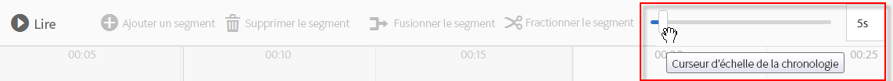
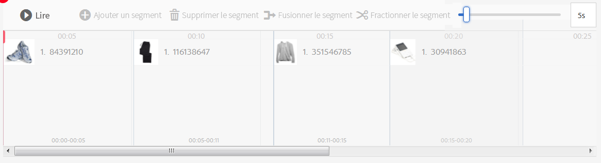
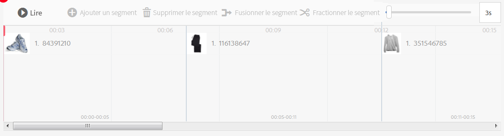
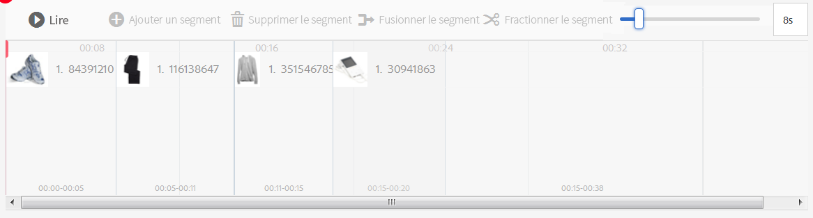
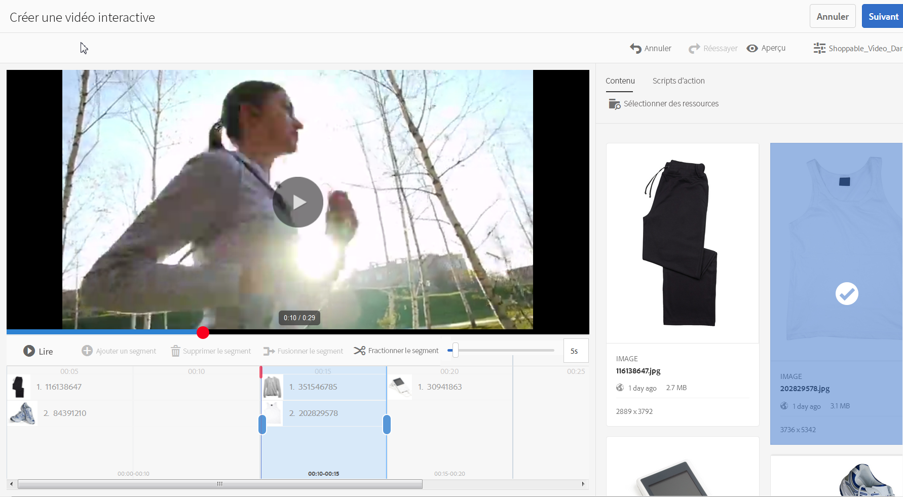
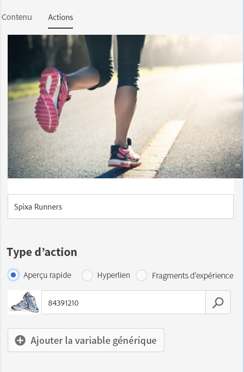
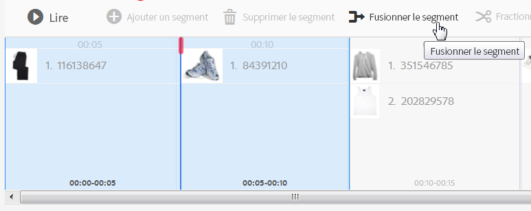

# Vidéos interactives{#interactive-videos}


Vous pouvez facilement créer des vidéos interactives, également appelées vidéos pouvant être achetées, qui génèrent des conversions directement à partir de la vidéo. L’engagement du client avec la vidéo se déroule dans un panneau à côté du lecteur vidéo, où le service associé, les informations ou les miniatures de produit sont défilés dans la vue en fonction de ce qui est présenté dans la vidéo. Les clients peuvent appuyer sur la miniature et être directement liés au service, ou ajouter l’article à un panier pour un achat immédiat, ou être liés à une page Web pour plus d’informations.

Une fois la vidéo terminée, un récapitulatif visuel de toutes les offres s’affiche pour pousser vers un appel à l’action. Les clients disposent d’une autre opportunité d’appuyer sur l’article qu’ils désirent. Des expériences pratiques et spécifiques telles que celles-ci augmentent l’engagement du client ainsi que la conversion.

Voir aussi [Images interactives](/help/assets/dynamic-media/interactive-images.md).

## Vidéos interactives à l’œuvre {#interactive-video-in-action}

Pour visionner une vidéo interactive pouvant faire l’objet d’un achat en action, cliquez sur [Live Demos](https://landing.adobe.com/en/na/dynamic-media/ctir-2755/live-demos.html), faites défiler la page jusqu’à l’en-tête Média **** pouvant faire l’objet d’un achat, puis cliquez sur la vidéo pouvant être lue pour commencer la lecture.

* Pendant la lecture, lorsque les produits sont utilisés dans la vidéo, le produit identique s’affiche à droite sous forme de vignette.

* Cliquez sur la vignette pour suspendre la vidéo et ouvrez l’aperçu rapide du produit. Par exemple, cliquez sur l’image miniature KitchenAid dans la vidéo pour afficher une vue à 360 degrés du mélangeur ou effectuez un zoom avant pour afficher les détails du mélangeur.

Voir aussi [Utilisation de vidéos interactives avec des médias dynamiques](https://docs.adobe.com/content/help/en/experience-manager-learn/assets/dynamic-media/dynamic-media-interactive-video-feature-video-use.html)

<!-- 

There was a link here that showed the video frame of an interactive video and when the reader clicked the frame the video would play https://marketing.adobe.com/resources/help/en_US/dm/shoppable-video/AXIS/index.html. This now needs to call a new interactive video

-->

<!-- 

[A frame from an interactive, shoppable video](assets/chlimage_1-126.png) *A video frame capture from an interactive, shoppable video.*

-->

>[!NOTE]
>
>Si vous créez une vidéo interactive pour lancer une page web lorsqu’un utilisateur clique sur une vignette, certains dispositifs bloquent l’ouverture de la page web contextuelle. Dans ce cas, vous devez modifier le paramètre de blocage des fenêtres contextuelles sur le dispositif. Par exemple, sur un Apple iPhone 6, appuyez sur **[!UICONTROL Paramètres > safari > Bloquer les fenêtres contextuelles]**, puis faites glisser la commande sur **[!UICONTROL Désactivé]**. À présent, lorsque vous visionnez une vidéo interactive et que vous cliquez sur une vignette, vous êtes invité à ouvrir la fenêtre contextuelle. Si vous acceptez, la page web s’affiche.

### Découvrez comment les vidéos interactives sont créées {#watch-how-interactive-videos-are-created}

Visionnez une présentation vidéo de 7 minutes 30 sur la [création des vidéos interactives](https://s7d5.scene7.com/s7viewers/html5/VideoViewer.html?videoserverurl=https://s7d5.scene7.com/is/content/&emailurl=https://s7d5.scene7.com/s7/emailFriend&serverUrl=https://s7d5.scene7.com/is/image/&config=Scene7SharedAssets/Universal_HTML5_Video_social&contenturl=https://s7d5.scene7.com/skins/&asset=S7tutorials/InteractiveVideo) [](https://outv.omniture.com?v=s4NHQ2dzqd7hIqWjeG2sIdyNWsTWyupA).
(Même si la présentation vidéo est personnalisée grâce aux ressources à la demande, les principes et les étapes restent compatibles avec les vidéos interactives dans AEM Assets.)

### Webinaire « Succès des clients Adobe »{#adobe-customer-success-webinar}

The [Using Interactive Video, Link Sharing, and YouTube sharing in AEM Assets](https://adobecustomersuccess.adobeconnect.com/p1yxzdo4aec/) webinar teaches you how to use interactive video and other features to tie conversion driven events into your video marketing content.

## Démarrage rapide : vidéos interactives {#quick-start-interactive-videos}

La description du processus étape par étape qui suit est conçue pour vous aider à démarrer et à utiliser rapidement les vidéos interactives dans Dynamic Media.

Recherchez le titre **Exemple** dans certaines tâches de démarrage rapide. It contains a brief tutorial that is based on this [starting demo web page that *does not* have interactivity added to it yet](https://marketing.adobe.com/resources/help/en_US/dm/shoppable-video/john-lewis/landing-0.html).

Les **exemples** permettent d’illustrer les étapes d’intégration de vidéos interactives à votre site web.

Lorsque vous terminerez le didacticiel dans la dernière section Exemple, [voici à quoi ressemblera](https://marketing.adobe.com/resources/help/en_US/dm/shoppable-video/john-lewis/landing-3.html)votre page Web de démonstration finale avec la vidéo interactive entièrement intégrée.


Étapes de la vidéo interactive :

1. **(Facultatif) Identification de variables d’aperçu rapide** : commencez par identifier les variables dynamiques utilisées par votre mise en œuvre existante de l’aperçu rapide. Vous utilisez des variables pour mapper des vignettes de produit à l’aperçu rapide du produit correspondant lorsque vous créez votre vidéo interactive. Consulter [(Facultatif) Identification des variables d’aperçu rapide](#optional-identifying-quickview-variables).
   **Cette étape n’est requise que si tous les éléments suivants sont vrais**:
・ Vous souhaitez ajouter de l’interactivité à votre vidéo en déclenchant des affichages rapides.
• Votre mise en œuvre d’AEM n’utilise *pas* de structure d’intégration de commerce électronique pour extraire des données de produit dans AEM à partir d’une solution de commerce électronique, comme IBM WebSphere Commerce, Elastic Pathe, Hybris ou Intershop.

1. **(Facultatif) Création d’un paramètre prédéfini de visionneuse de vidéos interactives** : personnalisez l’aspect et le comportement des différents composants qui constituent la visionneuse, comme la barre vidéo et les vignettes interactives.
Creating your own Interactive Video viewer preset is not required if you intend to use the out-of-the-box Interactive Video viewer presets `Shoppable_Video_Light` or `Shoppable_Video_Dark` instead.
Voir [(Facultatif) Création d’un paramètre prédéfini de visionneuse](/help/assets/dynamic-media/managing-viewer-presets.md#creating-a-new-viewer-preset) et [ Aspects spéciaux de la création d’un paramètre prédéfini de visionneuse de vidéos interactives](/help/assets/dynamic-media/managing-viewer-presets.md#special-considerations-for-creating-an-interactive-viewer-preset).

1. **Téléchargement d’une vidéo et des ressources d’image associées** : transférez une vidéo et les images associées auxquelles vous souhaitez ajouter de l’interactivité.
Reportez-vous à la section [Téléchargement d’une vidéo et de ses ressources miniatures associées](#uploading-a-video-and-its-associated-thumbnail-assets).

1. **Ajout d’interactivité à votre vidéo** : ajoutez un ou plusieurs segments temporels à la vidéo. Ensuite, associez les vignettes dans ces segments temporels. Affectez chaque vignette d’image à une action telle qu’un hyperlien, un aperçu rapide ou un fragment d’expérience.
(Notez que la méthode de liaison basée sur une URL n’est pas possible si votre contenu interactif contient des liens avec des URL relatives, en particulier des liens vers des pages AEM Sites.)
Terminez en publiant les ressources vidéo interactives. La publication crée le code ou l’URL intégré que vous allez copier et appliquer à la page de renvoi de votre site web. Voir [Ajout d’interactivité à votre vidéo](#adding-interactivity-to-your-video).
Voir [Publication de ressources](/help/assets/dynamic-media/publishing-dynamicmedia-assets.md).

1. **Ajout d’une vidéo interactive à votre site web ou à votre site web dans AEM** : Si vous utilisez AEM Sites ou AEM eCommerce, ou les deux, vous pouvez ajouter la vidéo interactive directement à une page web dans AEM en faisant glisser le composant Interactive Media dans la page. Reportez-vous à la section [Ajout de ressources Dynamic Media aux pages.](/help/assets/dynamic-media/adding-dynamic-media-assets-to-pages.md)
Utilisez le code intégré ou l’URL pour intégrer votre vidéo interactive aux expériences de votre site web. Reportez-vous à la section [Intégration d’une vidéo interactive à votre site web](#integrating-an-interactive-video-with-your-website).
 Si vous utilisez un gestionnaire de contenu web (WCM) tiers, vous devez intégrer la nouvelle vidéo interactive à l’aperçu rapide existant utilisé sur votre site web. Voir [Intégration d’une vidéo interactive dans un aperçu rapide existant](#integrating-an-interactive-video-with-an-existing-quickview).
   [](/help/assets/dynamic-media/adding-dynamic-media-assets-to-pages.md)

## (Facultatif) Identification de variables de zone interactive {#optional-identifying-quickview-variables}

>[!NOTE]
Cette tâche n’est nécessaire que si les conditions ci-dessous sont vraies :
* Vous souhaitez ajouter de l’interactivité à votre vidéo en déclenchant des aperçus rapides.
* Votre mise en œuvre d’AEM *n’utilise pas* de structure d’intégration de commerce électronique pour extraire des données de produit dans AEM à partir d’une solution de commerce électronique, comme IBM WebSphere Commerce, Elastic Pathe, Hybris ou Intershop. <!-- See [eCommerce concepts in AEM Assets](/help/sites-administering/concepts.md).-->

Si votre mise en œuvre d’AEM utilise le commerce électronique, vous pouvez ignorer cette tâche et passer à la tâche suivante.

Commencez par identifier les variables dynamiques utilisées par votre mise en œuvre existante d’aperçu rapide pour faire correspondre les miniatures de produits à l’aperçu rapide des produits correspondants lors du processus de création de vidéo interactive.

Lorsque vous ajoutez des segments temporels à une vidéo, vous affectez une SKU et toute variable supplémentaire à chaque miniature que vous ajoutez à un segment. Ces variables sont utilisées ultérieurement pour afficher le produit le bon aperçu rapide.

Il est important d’identifier correctement les variables qui sont requises pour déclencher de manière unique l’Aperçu rapide d’un produit.

Il peut parfois être nécessaire de consulter les informaticiens responsables de votre implémentation d’aperçu rapide existante. Ils sont susceptibles de connaître l’ensemble minimal de données nécessaires pour identifier un aperçu rapide dans le système. Cependant, dans la plupart des cas, il est également possible d’analyser le comportement existant du code frontal.

La majorité des implémentations d’aperçu rapide utilisent le paradigme suivant :

* L’utilisateur active un élément d’interface utilisateur sur le site web. Par exemple, en cliquant sur un bouton « Aperçu rapide ».
* Le site web envoie une demande Ajax au serveur principal afin de charger les données ou le contenu de l’aperçu rapide, le cas échéant.
* Les données de l’aperçu rapide sont traduites en contenu en préparation du rendu sur la page web.
* Enfin, le code frontal effectue le rendu visuel de ce contenu à l’écran.

L’approche, par conséquent, consiste à visiter différentes zones de votre site Web existant où l’aperçu rapide est mis en œuvre, de déclencher l’aperçu rapide et de capturer l’URL Ajax envoyée par la page web pour le chargement des données ou du contenu de l’aperçu rapide.

Normalement, il n’est pas nécessaire d’utiliser des outils de débogage spécialisés. Les navigateurs web modernes incluent des inspecteurs web qui font un travail adéquat. Vous trouverez ci-dessous quelques exemples de navigateurs web qui incluent des inspecteurs web :

* Pour voir toutes les demandes HTTP sortantes dans Google Chrome, appuyez sur **F12** (Windows) ou **Contrôle+Options+I** (Mac) pour ouvrir le panneau Outils de développement, puis cliquez sur l’onglet **Réseau**.

* In Firefox, you can either activate the Firebug plug-in by pressing **F12** (Windows) or **Command+Option+I** (Mac) and use its **Net]** tab, or you can use the built-in Inspector tool and its Network tab.

* Dans Internet Explorer, activez l’outil de débogage en appuyant sur **F12**.

Lorsque la surveillance de réseau est activée dans le navigateur, déclenchez l’aperçu rapide sur la page.

Vous trouvez maintenant l’URL Ajax d’aperçu rapide dans le journal réseau. Copiez l’URL enregistrée pour l’analyse ultérieure. Dans la plupart des cas, lorsque vous déclenchez l’aperçu rapide, plusieurs requêtes sont envoyées au serveur. En règle générale, l’URL Ajax d’aperçu rapide est l’une des premières dans la liste. It has either a complex query string portion or path, and its response MIME type is either `text/html`, `text/xml`, or `text/javascript`.

Au cours de ce processus, il est important de parcourir différentes zones de votre site Web, avec différentes catégories et types de produits. C’est pourquoi les URL d’aperçu rapide peuvent avoir des parties communes pour une catégorie de site web donnée, mais ne changent que si vous visitez une autre zone du site Web.

Dans le cas le plus simple, la seule partie variable dans l’URL de l’aperçu rapide est le SKU du produit. Dans ce cas, la valeur de SKU du produit est la seule donnée requise pour ajouter des vignettes sur un segment temporel dans la vidéo interactive dans AEM.

Cependant, dans les cas complexes, l’URL d’aperçu rapide comporte différents éléments variables en complément du SKU du produit, comme l’identifiant de la catégorie, le code couleur, etc. Dans ce cas, chaque élément de ce type est une variable distincte dans la définition des données de vignette dans AEM.

Consultez ci-dessous les exemples d’URL d’aperçu rapide et les variables de miniatures qui en résultent :

<table>
  <tbody>
  <tr>
    <td><p>SKU unique, trouvé dans la chaîne de requête.</p> </td>
    <td><p>Les URL d’aperçu rapide enregistrées incluent ce qui suit :</p>
    <ul>
      <li><p><code>https://server/json?productId=866558&amp;source=100</code></p> </li>
      <li><p><code>https://server/json?productId=1196184&amp;source=100</code></p> </li>
      <li><p><code>https://server/json?productId=1081492&amp;source=100</code></p> </li>
      <li><p><code>https://server/json?productId=1898294&amp;source=100</code></p> </li>
    </ul> <p>The only variable part in the URL is the value of the <code>productId=</code> query string parameter, and it is clearly a SKU value. Par conséquent, seuls les champs de SKU de nos vignettes doivent être renseignés avec des valeurs comme <strong><code>866558</code></strong>, <strong><code>1196184</code></strong>, <strong><code>1081492</code></strong>, <strong><code>1898294</code></strong>.</p> </td>
  </tr>
  <tr>
    <td><p>SKU unique, trouvé dans le chemin d’accès à l’URL.</p> </td>
    <td><p>Les URL d’aperçu rapide enregistrées incluent ce qui suit :</p>
    <ul>
      <li><p><code>https://server/product/6422350843</code></p> </li>
      <li><p><code>https://server/product/1607745002</code></p> </li>
      <li><p><code>https://server/product/0086724882</code></p> </li>
    </ul> <p>The variable part is in the last portion of the path, and it becomes the SKU value of AEM thumbnails: <strong><code>6422350843</code></strong>, <strong><code>1607745002</code></strong>, <strong><code>0086724882</code></strong>.</p> </td>
  </tr>
  <tr>
    <td><p>SKU et ID de catégorie dans la chaîne de requête.</p> </td>
    <td><p>Les URL d’aperçu rapide enregistrées incluent ce qui suit :</p>
    <ul>
      <li><p><code>https://server/quickView/product/?category=1100004&amp;prodId=305466</code></p> </li>
      <li><p><code>https://server/quickView/product/?category=1100004&amp;prodId=310181</code></p> </li>
      <li><p><code>https://server/quickView/product/?category=1740148&amp;prodId=308706</code></p> </li>
    </ul> <p>Dans ce cas, l’URL comporte deux parties différentes. The SKU is stored in the <code>prodId</code> parameter and the category ID is stored in the <code>category=</code> parameter.</p> <p>Par conséquent, les définitions des vignettes sont des paires. Autrement dit, une valeur de SKU et une variable supplémentaires appelée « <code>categoryId</code> ». Les paires obtenues sont les suivantes :</p>
    <ul>
      <li>SKU is <code>305466</code> and <code>categoryId</code> is <code>1100004</code></li>
      <li>SKU is <code>310181</code> and <code>categoryId</code> is <code>1100004</code></li>
      <li>SKU is <code>308706</code> and <code>categoryId</code> is <code>1740148</code></li>
    </ul> <p> </p> </td>
  </tr>
  </tbody>
</table>

**Exemple**

Lorsque l’approche ci-dessus est appliquée à notre exemple de site web, la page web comporte différentes vignettes de produit, auxquelles est associé un bouton « AFFICHER PLUS » :

[https://marketing.adobe.com/resources/help/en_US/dm/shoppable-video/john-lewis/landing-0.html](https://marketing.adobe.com/resources/help/en_US/dm/shoppable-video/john-lewis/landing-0.html)

Une fois que vous avez activé l’aperçu rapide de tous les produits disponibles dans la page, vous obtenez la liste de demandes d’aperçu rapide exécutées en arrière-plan ci-dessous :

* datafeed/candles-233396346.json
* datafeed/candles-233978050.json
* datafeed/candles-234024346.json
* datafeed/candles-234024356.json
* datafeed/candles-234024359.json
* datafeed/cushions-233939848.json
* datafeed/cushions-234019477.json
* datafeed/cushions-234019483.json
* datafeed/furniture-231747479.json
* datafeed/furniture-232625621.json
* datafeed/furniture-232625626.json
* datafeed/furniture-233939810.json
* datafeed/furniture-233939825.json
* datafeed/furniture-233939828.json
* datafeed/furniture-233939853.json
* datafeed/furniture-233940334.json
* datafeed/glassware-000064007.json
* datafeed/glassware-230722193.json
* datafeed/glassware-233916550.json
* datafeed/glassware-233916597.json

Lorsque vous observez ces appels de serveur, vous constatez que les informations spécifiques au produit ne sont présentes que dans le chemin de la requête. Vous notez également que la chaîne de requête n’est pas du tout utilisée et que deux types de données distincts sont impliqués :

* Le premier type concerne les bougies, les coussins, les meubles et la verrerie. Vous pouvez l’appeler « catégorie de produits ».
* Le second type est un code de produit, comme 233916597. Vous pouvez considérer qu’il s’agit de la « SKU du produit ».

Compte tenu de ces informations, l’intégralité de l’URL de l’aperçu rapide suit le schéma suivant :

`/datafeed/$categoryId$-$SKU$.json`

En fonction de cette analyse, vous concluez que vous pouvez utiliser les deux variables ci-dessous pour les vignettes : `categoryId` et `SKU`.

Vous êtes maintenant prêt à transférer une vidéo et les ressources de vignette associées.

## (En option) Création d’un paramètre prédéfini de la visionneuse de vidéo interactive {#optional-creating-an-interactive-video-viewer-preset}

Vous pouvez ignorer cette tâche et passer à la tâche suivante si vous envisagez d’utiliser les types de paramètres prédéfinis de visionneuse de vidéos interactives par défaut, prêtes à l’emploi, `Shoppable_Video_dark` ou `Shoppable_Video_light`.

Lorsqu’une miniature est sélectionnée dans l’environnement de création, un aperçu de la boîte de dialogue Aperçu rapide s’affiche.


Vous avez la possibilité de créer votre propre paramètre prédéfini de visionneuse de vidéos interactives personnalisé. Vous pouvez déterminer, entre autres, le style de la visionneuse de vidéos, les vignettes interactives et l’affichage sous forme de grille des vignettes, qui s’affiche à la fin de la vidéo.

Un paramètre prédéfini de visionneuse de vidéo interactive restitue correctement la vidéo et tous les segments de la chronologie que vous avez ajoutés. Il utilise également un aperçu rapide d’exemple par défaut lorsque vous cliquez sur la miniature d’un produit en mode Aperçu afin de pouvoir tester son interactivité avant la publication.

Une fois le paramètre prédéfini de visionneuse enregistré, son état est automatiquement défini sur **Activé **dans la page Paramètres prédéfinis de la visionneuse. Cet état signifie qu’il est visible dans le composant Contenu multimédia dynamique et chaque fois que vous prévisualisez une vidéo avec. Veillez à également publier manuellement votre nouveau paramètre prédéfini de visionneuse.

Pour créer votre propre paramètre prédéfini de visionneuse de vidéos interactives, reportez-vous à la section [Création d’un paramètre prédéfini de visionneuse](/help/assets/dynamic-media/managing-viewer-presets.md#creating-a-new-viewer-preset).

## Téléchargement d’une vidéo et de ses ressources miniatures associées.{#uploading-a-video-and-its-associated-thumbnail-assets}

If you have already uploaded your video and thumbnail assets, proceed to [Adding interactivity to your video](#adding-interactivity-to-your-video).

Si vous n’avez pas transféré les vidéos ou images appropriées, ou si vous souhaitez supprimer les vidéos ou images transférées dont vous n’avez plus besoin, reportez-vous à la section [Suppression de ressources](/help/assets/manage-digital-assets.md#delete-assets).

Pour télécharger une vidéo et ses ressources miniatures associées :

1. Téléchargez la vidéo et les ressources miniatures associées dans le dossier ou les dossiers de votre choix.

   Voir [Téléchargement de ressources](/help/assets/manage-digital-assets.md).
Voir [Téléchargement de ressources à l’aide de la planification de tâches FTP](/help/assets/manage-digital-assets.md).

   Ajoutez maintenant l’interactivité à votre vidéo.

## Ajout d’interactivité à votre vidéo {#adding-interactivity-to-your-video}

Vous ajoutez des segments de chronologie à une vidéo à l’aide de l’éditeur visuel intégré sur la page Créer une vidéo interactive.

Une fois que vous avez ajouté des segments de montage, vous ajoutez des images de miniatures à chaque segment. Pour chaque miniature que vous ajoutez, vous lui appliquez une action. Par exemple, vous pouvez appliquer un aperçu rapide à la miniature, ou vous pouvez lui affecter un hyperlien ou un fragment d’expérience.

Voir [Fragments d’expérience](/help/sites-cloud/authoring/fundamentals/experience-fragments.md).

>[!NOTE]
Gardez à l’esprit que les outils de partage sur les médias sociaux dans la vidéo interactive ne sont pas pris en charge lorsque vous incorporez la visionneuse dans un fragment d’expérience.
 Pour contourner ce problème, vous pouvez utiliser ou créer des paramètres prédéfinis de visionneuse qui ne disposent pas d’outils de partage sur les réseaux sociaux. Ces paramètres prédéfinis de visionneuse vous permettent de l’incorporer dans des fragments d’expérience.

>[!NOTE]
La méthode de liaison basée sur une URL n’est pas possible si votre contenu interactif contient des liens avec des URL relatives, en particulier des liens vers des pages AEM Sites.

Les options Annuler et Rétablir, situées dans l’angle supérieur droit de la page, sont prises en charge lors de la session de création/modification en cours.

Une fois la vidéo interactive enregistrée, elle s’ouvre immédiatement dans l’aperçu. A partir de là, vous pouvez sélectionner un paramètre prédéfini de visionneuse de vidéos interactives et lire la vidéo pour obtenir une représentation approximative de son aspect pour les clients.

Pour ajouter de l’interactivité à votre vidéo :

1. En mode Ressources, accédez à la vidéo que vous avez téléchargée et que vous souhaitez rendre interactive.
1. Utilisez l’une des méthodes suivantes :

   * Hover on the image, then tap **[!UICONTROL Select]** (checkmark icon). Dans la barre d’outils, appuyez sur **[!UICONTROL Modifier]**.

   * Hover on the image, then tap **[!UICONTROL More actions]** (three dots icon) **[!UICONTROL > Edit]**.

   * Appuyez sur l’image pour l’ouvrir dans la page d’affichage des détails. Dans la barre d’outils, appuyez sur **[!UICONTROL Modifier]**.

1. Dans la page Créer une vidéo interactive, procédez comme suit :

   * Appuyez sur le bouton **[!UICONTROL Lecture]** pour commencer la lecture de la vidéo. Lorsqu’un produit particulier, un service ou un détail que vous souhaitez mettre en surbrillance s’affiche, appuyez sur **[!UICONTROL Ajouter un segment]** dans la barre d’outils. Répétez cette opération jusqu’à atteindre la fin de la vidéo.

      Pour chaque segment à ajouter, vous pouvez affecter une ou plusieurs images miniatures, puis lier ces miniatures à des pages de produit d’aperçu rapide pour que les clients achètent ou à des pages web pour plus d’informations.

   * Appuyez sur le bouton **[!UICONTROL Lecture]** pour commencer à lire la vidéo. Lorsqu’un produit, un service ou un détail particulier que vous souhaitez mettre en évidence apparaît, appuyez sur **[!UICONTROL Pause]**. Appuyez sur **[!UICONTROL Ajouter un segment]**.

      Continuez la lecture et la mise en pause de la vidéo à des points de la chronologie où vous souhaitez ajouter un segment jusqu’à la fin de la vidéo.

1. (Facultatif) Faites glisser la barre du **[!UICONTROL Curseur d’échelle de la chronologie]** vers la gauche pour effectuer un zoom avant ou arrière et contrôler ainsi le niveau de détail des segments que vous avez ajoutés.

   

   En fonction de la durée de votre vidéo, la durée du segment propose par défaut les valeurs suivantes :

   <table>
      <tbody>
        <tr>
        <td><strong>Si la durée de la vidéo est...</strong></td>
        <td><strong>Le paramètre Durée de segment propose par défaut...</strong></td>
        </tr>
        <tr>
        <td>3 minutes ou plus</td>
        <td>60 secondes</td>
        </tr>
        <tr>
        <td>2 à 3 minutes</td>
        <td>30 secondes</td>
        </tr>
        <tr>
        <td>1-2 minutes</td>
        <td>20 secondes<br /> </td>
        </tr>
        <tr>
        <td>30 à 60 secondes</td>
        <td>10 secondes</td>
        </tr>
        <tr>
        <td>30 secondes ou moins</td>
        <td>5 secondes</td>
        </tr>
      </tbody>
    </table>

   La frise chronologique vidéo utilise autant d’espace dans l’écran qu’il y a d’espace disponible. De même, lorsque vous redimensionnez la fenêtre du navigateur, les segments que vous avez ajoutés conservent leur largeur appropriée.

   Pour illustration, les trois écrans ci-dessous utilisent la même vidéo. Notez que la largeur de chaque segment varie en fonction du paramètre Échelle de la chronologie.

   

   Capture d’écran A

   La capture d’écran A ci-dessus présente l’affichage par défaut d’une vidéo de produit de 29 secondes. Le paramètre Échelle de la chronologie est défini sur la valeur par défaut de 5 secondes.

   

   Capture d’écran B

   Sur la capture d’écran B, le curseur d’échelle de la chronologie est passé de la valeur par défaut, 5 secondes, à 3 secondes. Notez que désormais les différents horodatages d’échelle de la chronologie correspondent tous à des intervalles de 3 secondes.

   

   Capture d’écran C

   Sur la capture d’écran C, le paramètre Échelle de la chronologie a été défini sur 8 secondes. Notez la façon dont les segments contenant les vignettes de produit se sont réduits. Le zoom arrière de cette façon s’avère utile si la vidéo est longue et que vous souhaitez pouvoir afficher un aperçu de plus de segments que la largeur de la page ne pourrait en contenir normalement.

1. (En option) Effectuez l’une des actions suivantes :

   * Pour ajuster l’heure de début et l’heure de fin d’un segment.

      Sélectionnez un segment, puis faites glisser l’ovale bleu de début ou de fin pour ajuster respectivement l’heure de début ou l’heure de fin. L’image vidéo affichée se déplace à l’heure appropriée dans la vidéo, en fonction de vos ajustements. Le déplacement du segment de la chronologie est limité en fonction des segments adjacents dans la chronologie. Le temps minimal autorisé pour un segment est d’une seconde.

        Utilisez les raccourcis de navigation ci-dessous pour vérifier et optimiser rapidement les segments de vidéo : 

      * Appuyez sur l’ovale bleu de début pour chercher la vidéo directement au début de ce segment.
      * Appuyez sur l’ovale bleu de fin pour chercher la vidéo directement à la fin de ce segment.
      * Appuyez sur le segment entier pour relancer la lecture de la vidéo à partir du début de ce segment.
   

   Repositionnement de la fin d’un segment de chronologie

   * Pour supprimer un segment

      Select the last segment that is on the timeline, then on the toolbar, tap **[!UICONTROL Delete Segment]**. Si plusieurs segments sont sélectionnés, la fonction Supprimer le segment est désactivée.

      Vous ne pouvez supprimer que le dernier segment. Par exemple, pour supprimer tous les segments de la chronologie, vous devez toujours sélectionner le dernier segment et appuyer ensuite sur **[!UICONTROL Supprimer le segment]**.


1. Sélectionnez un segment de temps auquel vous souhaitez associer une ou plusieurs images miniatures.
1. A la droite de la vidéo, appuyez sur l’onglet **[!UICONTROL Contenu]**.
1. Sous l’onglet Contenu, appuyez sur **[!UICONTROL Sélectionner les ressources]**, puis cherchez et sélectionnez toutes les ressources d’image à utiliser avec votre vidéo. Les ressources sélectionnées sont ajoutées au panneau Sélecteur de ressources dans l’onglet Contenu. 

1. Dans le sélecteur de ressources, sous l’onglet Contenu, effectuez l’une des actions suivantes :

   <table>
      <tbody>
        <tr>
        <td>Pour associer une miniature à un segment de frise chronologique sélectionné</td>
        <td><p>Appuyez sur l’image dans le panneau Sélecteur de ressources dans la partie droite.</p> <p>Vous pouvez ajouter à un segment de frise chronologique autant de miniatures que vous le souhaitez. Pour chaque image que vous sélectionnez, une coche s’affiche au-dessus de l’image dans le sélecteur de ressources.</p> </td>
        </tr>
        <tr>
        <td>Pour supprimer une miniature du segment de frise chronologique sélectionné</td>
        <td><p>Procédez de l’une des manières suivantes :</p>
          <ul>
          <li>Dans le panneau Sélecteur de ressources, appuyez sur une image comportant une coche pour la désélectionner. La ressource d’image est supprimée du segment de la frise chronologique.<br /> </li>
          <li>Dans le segment de frise chronologique sélectionné, appuyez sur une image puis, dans la barre d’outils, appuyez sur <strong>Supprimer le produit</strong>.</li>
          </ul> </td>
        </tr>
      </tbody>
    </table>

   

   Un appui sur une image dans le panneau Sélecteur de ressources permet de l’ajouter dans le segment sélectionné de la chronologie.

1. Sélectionnez une image miniature unique dans l’un des segments de chronologie, puis appuyez sur l’onglet **[!UICONTROL Actions]**.
1. Procédez de l’une des manières suivantes :
   <table> 
    <tbody> 
      <tr> 
      <td>Pour associer l’image miniature sélectionnée à un aperçu rapide</td> 
      <td><p>Sous Type d’action, appuyez sur <strong>Aperçu rapide</strong>.</p> <p>Si vous êtes un client AEM Sites ou AEM eCommerce :</p> 
       <ul> 
       <li>Notez que le champ de texte de valeur de la SKU est prérenseigné avec l’unité de gestion des stocks (SKU) du produit sélectionné, qui est un identifiant unique pour chaque produit ou service distinct que vous proposez. Le champ est renseigné automatiquement lorsque l’image est associée à un produit dans AEM Commerce.</li> 
       <li>Si la SKU prérenseignée est incorrecte, appuyez ou cliquez sur l’icône Sélecteur de produit (loupe) pour afficher la page Sélectionner un produit. Appuyez ou cliquez sur le produit à utiliser, puis appuyez sur la coche dans le coin supérieur droit de la page pour revenir à l’éditeur de vidéos interactives.</li> 
       </ul> <p> If you are <em>not</em> an AEM Sites or Ecommerce customer</p> 
       <ul> 
       <li>Voir <a href="/help/assets/dynamic-media/carousel-banners.md#identifying-hotspot-and-image-map-variables">Identification des variables des zones réactives</a>. Vous devez définir ces variables. </li> 
       <li>Par défaut, ce champ SKU utilise le nom de fichier de la ressource d’image sans l’extension. Pour vos fichiers, si vous suivez une convention de dénomination standard dépendant de la SKU, il n’est généralement pas nécessaire d’apporter des modifications supplémentaires. </li> 
       <li>Sinon, modifiez la valeur par défaut et entrez la valeur de SKU appropriée. Dans le champ Valeur du SKU, saisissez le SKU (Stock Keeping Unit) du produit, identifiant unique de chaque produit ou service distinct que vous proposez. La valeur SKU saisie renseigne automatiquement la partie variable du modèle Quickview de sorte que le système sache associer l’image sur laquelle l’utilisateur appuie à la vue Quickview d’un SKU particulier.</li> 
       </ul> <p>(Optional) If there are other variables within the Quickview that you need to use to further identify a product, tap <strong>Add Generic Variable</strong>.  Dans le champ de texte, spécifiez une variable supplémentaire. Par exemple, <code>category=Womens</code> est une variable ajoutée.</p> <p> </p> </td> 
      </tr> 
      <tr> 
      <td>Pour associer l’image miniature sélectionnée à un lien hypertexte</td> 
      <td><p>Sous Type d’action, appuyez sur <strong>Lien hypertexte</strong>, puis procédez de l’une des manières suivantes :</p> 
       <ul> 
       <li>Si vous êtes un client AEM Sites, appuyez sur l’icône Sélecteur de site (dossier) pour accéder à une page web. Notez que la méthode de liaison basée sur une URL n’est pas possible si votre contenu interactif contient des liens avec des URL relatives, en particulier des liens vers des pages AEM Sites.</li> 
       <li>Si vous êtes un client Dynamic Media autonome, dans le champ de texte HREF, spécifiez le chemin URL complet vers une page web liée.</li> 
       </ul> <p>Veillez à spécifier si vous souhaitez ouvrir le lien dans un nouvel onglet du navigateur ou sur l’onglet actif.</p> </td> 
      </tr> 
      <tr> 
      <td>Pour associer l’image miniature sélectionnée à un fragment d’expérience</td> 
      <td><p>Sous Type d’action, appuyez sur <strong>Fragment d’expérience</strong>, puis effectuez les actions suivantes :<p> 
       <ul> 
       <li>Si vous êtes un client AEM Sites, appuyez ou cliquez sur l’icône Rechercher (loupe) afin d’ouvrir la page Fragment d’expérience. Appuyez ou cliquez sur le fragment d’expérience à utiliser, puis appuyez sur <strong>Sélectionner</strong> dans le coin supérieur droit de la page pour revenir au panneau Actions de la page précédente.<br />Voir <a href="/help/sites-cloud/authoring/fundamentals/experience-fragments.md">Fragments d’expérience</a>.</li> 
      </ul> 
       <ul> 
       <li>Indiquez la largeur et la hauteur du fragment d’expérience tel qu’il apparaît dans la vidéo.</li>
       </ul><strong>Remarque</strong>: Gardez à l’esprit que les outils de partage sur les médias sociaux dans la vidéo interactive ne sont pas pris en charge lorsque vous incorporez la visionneuse dans un fragment d’expérience. Pour contourner ce problème, vous pouvez utiliser ou créer des paramètres prédéfinis de visionneuse qui ne disposent pas d’outils de partage sur les réseaux sociaux. Ces paramètres prédéfinis de visionneuse vous permettent de l’incorporer dans des fragments d’expérience.</p></tr>&lt; 
      <tr> 
      <td>Pour modifier une action déjà affectée à une image miniature</td> 
      <td>Dans un segment de chronologie, appuyez sur une image miniature qui comporte un lien de chaîne à droite de son libellé de texte. Le lien de chaîne indique qu’une action lui est attribuée. Appuyez sur l’onglet <strong>Actions</strong> pour apporter vos modifications.</td> 
      </tr> 
      <tr> 
      <td>Pour modifier le libellé de texte d’une image miniature</td> 
      <td><p>Par défaut, le libellé de texte utilise le champ de <code>Title</code> métadonnées de l’image miniature. S’ <code>Title</code> il n’existe pas, le nom de fichier de l’image miniature est utilisé à la place, mais sans l’extension.</p> <p>Pour modifier le libellé de texte d’une vignette, sous l’onglet <strong>Actions</strong>, directement sous la ressource d’image qui s’affiche, entrez le texte de votre choix. Reportez-vous à l’illustration ci-dessous.</p> <p>Notez que le nouveau libellé n’est utilisé que par la visionneuse vidéo proprement dite et le texte des vignettes affiché dans le segment de la chronologie. La modification du libellé n’affecte pas le champ Titre des métadonnées de la vignette ni son nom de fichier.</p> </td> 
      </tr> 
      <tr> 
      <td>Pour annuler une modification que vous avez effectuée</td> 
      <td>Près de l’angle droit supérieur de la page, appuyez sur <strong>Annuler</strong> ou <strong>Rétablir</strong>.</td> 
      </tr> 
    </tbody> 
   </table>

   

   Un nouveau libellé de texte est ajouté à la miniature.

1. Utilisez l’une des méthodes suivantes :

   * Répétez les étapes 6 à 11 pour ajouter d’autres vignettes aux segments de la chronologie dans votre vidéo.
   * Passez à l’étape 13 (facultative).

1. (Facultatif) Effectuez l’une des opérations suivantes :

   * **[!UICONTROL Fusionner le segment]** : vous pouvez combiner deux segments adjacents (avec ou sans les miniatures de produit qui leur sont affectées) dans un seul segment.

      Dans la chronologie, sélectionnez les segments contigus que vous souhaitez fusionner en un seul. Notez l’absence de poignées de déplacement ovales de couleur bleue sur les deux segments sélectionnés dans l’illustration ci-dessous.

      Appuyez sur **[!UICONTROL Fusionner le segment]** dans la barre d’outils.
   

   Fusion de deux segments de cinq secondes dans un seul segment de dix secondes.

   * **[!UICONTROL Fractionner le segment]** : vous pouvez diviser un seul segment en deux segments de durée identique. Si des vignettes de produit sont déjà affectées au segment, elles sont combinées au sein du segment de gauche.

      On the timeline, tap a segment you want to divide in half, then tap **[!UICONTROL Split Segment]** on the toolbar.

      Selecting two or more segments disables the **[!UICONTROL Split Segment]** feature.
   

   Division d’un segment de dix secondes en deux segments d’une durée de cinq secondes.

1. Near the upper-right corner of the **[!UICONTROL Create Interactive Video]** page, the name of the currently selected viewer preset used with the video is displayed. Appuyez sur le nom pour sélectionner un autre paramètre prédéfini de visionneuse.

   Par exemple, le paramètre prédéfini de visionneuse `Shoppable_Video_light` permet de visionner la vidéo avec une zone d’affichage blanche en regard de la vidéo. C’est dans cette zone d’affichage que s’affichent les vignettes cliquables lors du visionnage. Le paramètre prédéfini de visionneuse `Shoppable_Video_dark` permet de visionner la vidéo avec une zone d’affichage noire en regard de la vidéo.

   Si vous avez créé votre propre paramètre prédéfini de visionneuse de vidéos interactives, vous le verrez également dans la liste des paramètres prédéfinis à partir desquels vous pouvez choisir.

   Lorsque vous avez terminé, appuyez sur **[!UICONTROL Enregistrer]**.

   >[!NOTE]
   Lorsque vous enregistrez votre vidéo interactive, un `.vtt` fichier associé est automatiquement enregistré avec celle-ci. Le `.vtt` fichier est enregistré dans le `_VTT` dossier situé à la racine des **[!UICONTROL ressources]**. Le fichier et le dossier sont nécessaires pour que la lecture de votre vidéo interactive s’effectue correctement sur votre site Web. Ainsi, ne déplacez, ne modifiez pas ou ne supprimez pas le `_VTT` dossier ou son contenu.

1. Publiez la vidéo interactive. La publication crée le code incorporé ou l’URL que vous copiez et collez éventuellement pour enrichir les expériences de votre site Web.

   Si vous avez ajouté l’interactivité avec des aperçus rapides, utilisez uniquement le code incorporé ; si vous avez ajouté l’interactivité grâce à des pages web connectées par liens hypertexte, vous pouvez également utiliser l’URL publiée. Notez toutefois que la méthode de liaison basée sur une URL n’est pas possible si votre contenu interactif contient des liens avec des URL relatives, en particulier des liens vers des pages AEM Sites.

   Voir [Publication de ressources](publishing-dynamicmedia-assets.md).

   >[!NOTE]
   Pour publier une vidéo commerciale avec des aperçus rapides, veillez également à publier séparément chaque ressource d’image liée à la vidéo dans votre espace commercial.

   Une fois les segments de chronologie ajoutés et la vidéo interactive publiée, vous êtes prêt à l’ajouter à la page d’entrée de votre site Web existant. Reportez-vous à la section [Intégration d’une vidéo interactive à votre site web.](#integrating-an-interactive-video-with-your-website)

## Publication de ressources vidéo interactives {#publishing-interactive-video-assets}

Voir [Publication de ressources](/help/assets/dynamic-media/publishing-dynamicmedia-assets.md) pour plus d’informations sur la publication de ressources vidéo interactives.

## Intégration d’une vidéo interactive à votre site web {#integrating-an-interactive-video-with-your-website}

Une fois que vous avez téléchargé une vidéo, que vous lui avez ajouté des segments de chronologie et que vous avez publié la vidéo interactive, vous êtes prêt à l’ajouter à votre site Web existant.

Si vous êtes un client AEM Sites, vous pouvez ajouter la vidéo interactive en faisant glisser le composant Interactive Media dans votre page. Reportez-vous à la section [Ajout de ressources Dynamic Media aux pages.](/help/assets/dynamic-media/adding-dynamic-media-assets-to-pages.md)

Si vous êtes un client AEM Assets autonome, vous pouvez ajouter manuellement la vidéo interactive à votre site web, comme indiqué dans cette section.

1. Copiez le code incorporé de la vidéo interactive publiée ou l’URL.
Voir [Incorporation de la visionneuse de vidéos ou d’images dans une page web](/help/assets/dynamic-media/embed-code.md).
Si vous avez ajouté l’interactivité avec des aperçus rapides, utilisez uniquement le code incorporé ; si vous avez ajouté l’interactivité grâce à des pages web connectées par liens hypertexte, vous pouvez également utiliser l’URL publiée. Notez toutefois que la méthode de liaison basée sur une URL n’est pas possible si votre contenu interactif contient des liens avec des URL relatives, en particulier des liens vers des pages AEM Sites.

1. Dans le code de la page Web cible, identifiez l’emplacement de la vidéo statique.
1. Supprimez la vidéo statique et remplacez le code par le code incorporé ou l’URL que vous avez copiée depuis Ressources AEM, en l’état.

Le code incorporé copié est conçu pour un environnement réactif et devrait donc s’adapter automatiquement à la zone occupée précédemment par la vidéo statique.

>[!NOTE]
A ce point, si vous avez ajouté l’interactivité avec seulement des pages Web connectées par liens hypertexte, votre travail est terminé.
Toutefois, si vous avez ajouté l’interactivité pour déclencher un aperçu rapide, les miniatures adjacentes à la vidéo interactive sont à des fins d’affichage uniquement ; elles ne sont pas encore intégrées à vos aperçus rapides existants. Dans ce cas, vous devez désormais intégrer la vidéo interactive à des aperçus rapides existants sur votre site Web.

**Exemple**

En vous servant du site web de démonstration comme exemple, procédez comme suit :

[https://marketing.adobe.com/resources/help/en_US/dm/shoppable-video/john-lewis/landing-0.html](https://marketing.adobe.com/resources/help/en_US/dm/shoppable-video/john-lewis/landing-0.html)

Notez qu’il s’agit du code intégré d’une vidéo standard :

```xml
<style type="text/css">
 #s7video_div.s7videoviewer{
   width:100%;
   height:auto;
 }
</style>

<script type="text/javascript" src="https://demos-pub.assetsadobe.com/etc/dam/viewers/s7viewers/html5/js/VideoViewer.js"></script>
<div id="s7video_div"></div>
<script type="text/javascript">
 var s7videoviewer = new s7viewers.VideoViewer({
  "containerId" : "s7video_div",
  "params" : {
   "serverurl" : "https://adobedemo62-h.assetsadobe.com/is/image",
   "contenturl" : "https://demos-pub.assetsadobe.com/",
   "config" : "/etc/dam/presets/viewer/Video",
   "config2": "/etc/dam/presets/analytics",
   "videoserverurl": "https://gateway-na.assetsadobe.com/DMGateway/public/demoCo",
   "posterimage": "/content/dam/marketing/shoppable-video/john-lewis/shoppable-video-john-lewis-2014.mp4",
   "asset" : "/content/dam/marketing/shoppable-video/john-lewis/shoppable-video-john-lewis-2014.mp4" }
 }).init();
</script>
```

L’intégration est aussi simple que la suppression du code intégré de la vidéo et son remplacement par le code intégré de la vidéo interactive à partir d’AEM. Vous pouvez afficher le résultat à l’adresse URL suivante : Même si la page contient une vidéo interactive, celle-ci n’est pas encore intégrée aux aperçus rapides existants :

[https://marketing.adobe.com/resources/help/en_US/dm/shoppable-video/john-lewis/landing-1.html](https://marketing.adobe.com/resources/help/en_US/dm/shoppable-video/john-lewis/landing-1.html)

## Intégration d’une vidéo interactive avec un aperçu rapide existant {#integrating-an-interactive-video-with-an-existing-quickview}

>[!NOTE]
Cette tâche ne s’applique que si vous êtes un client AEM Assets autonome.

La dernière étape de cette procédure consiste à intégrer votre vidéo interactive avec une mise en œuvre existante de l’aperçu rapide utilisée sur votre site web. Pour ce qui est de l’intégration, il n’existe pas de solution qui fonctionne dans tous les cas. Chaque implémentation d’aperçu rapide est unique. De ce fait, une approche spécifique, impliquant probablement l’aide d’un informaticien compétent en systèmes frontaux, est nécessaire.

L’implémentation d’aperçus rapides existante représente normalement une chaîne d’actions entre-associées qui se produisent sur la page web dans l’ordre suivant :

1. Un utilisateur déclenche un élément dans l’interface utilisateur de votre site web.
1. Le code frontal obtient une URL d’aperçu rapide basée sur l’élément d’interface utilisateur qui a été déclenché à l’étape 1.
1. Le code frontal envoie une demande Ajax en utilisant l’URL obtenue à l’étape 2.
1. La logique du serveur principal renvoie les données ou le contenu de l’aperçu rapide correspondant au code frontal.
1. Le code frontal charge les données ou le contenu de l’aperçu rapide.
1. Le code frontal convertit éventuellement les données téléchargées de l’aperçu rapide en une représentation HTML.
1. Le code frontal affiche une boîte de dialogue ou un panneau modal et effectue le rendu du contenu HTML à l’écran pour l’utilisateur final.

Ces appels peuvent ne pas représenter des appels d’API publiques indépendants qui peuvent être appelés par la logique de la page web depuis une étape arbitraire. À la place, il s’agit d’un appel chaîné où chaque étape suivante est masquée dans la dernière phase (rappel) de l’étape précédente.

Alors que la vidéo interactive remplace l’étape 1, et partiellement l’étape 2, lorsqu’un utilisateur clique sur une vignette dans la vidéo interactive, cette interaction de l’utilisateur est gérée par la visionneuse. La visionneuse renvoie un événement à la page web qui contient toutes les données des miniatures ajoutées précédemment dans AEM.

Dans ce type de descripteur d’événement, le code frontal permet d’effectuer les opérations suivantes :

* Il écoute un événement émis par la vidéo interactive.
* Il crée une URL d’aperçu rapide basée sur les données de la miniature.
* Il déclenche le processus de chargement de l’aperçu rapide depuis le serveur principal et en effectue le rendu à l’écran.

De plus, la visionneuse de vidéos interactives prend en charge le mode de fonctionnement Plein écran. L’utilisateur final déclenche les aperçus rapides en cliquant sur une miniature sans quitter le mode Plein écran. Pour bénéficier de cette fonctionnalité, vous modifiez le code frontal afin que la boîte de dialogue modale d’aperçu rapide soit associée au conteneur de la visionneuse. N’ajoutez pas l’élément BODY du document ni d’autres éléments de page web qui ne sont pas disponibles lorsque la visionneuse est en mode Plein écran. Le code qui exécute cette tâche doit écouter un autre rappel de visionneuse, envoyé après le chargement de la visionneuse dans la page.

Le code intégré renvoyé par AEM comporte déjà un descripteur d’événement prêt à l’emploi. Il est commenté, comme dans le fragment de code mis en évidence ci-dessous :

```xml
<style type="text/css">
 #s7interactivevideo_div.s7interactivevideoviewer{
   width:100%;
   height:auto;
 }
</style>
<script type="text/javascript" src="https://demos-pub.assetsadobe.com/etc/dam/viewers/s7viewers/html5/js/InteractiveVideoViewer.js"></script>

<div id="s7interactivevideo_div"></div>
<script type="text/javascript">
 var s7interactivevideoviewer = new s7viewers.InteractiveVideoViewer({
  "containerId" : "s7interactivevideo_div",
  "params" : {
   "serverurl" : "https://adobedemo62-h.assetsadobe.com/is/image",
   "contenturl" : "https://demos-pub.assetsadobe.com/",
   "config" : "/etc/dam/presets/viewer/Shoppable_Video_light",
   "config2": "/etc/dam/presets/analytics",
   "videoserverurl": "https://gateway-na.assetsadobe.com/DMGateway/public/demoCo",
   "interactivedata": "content/dam/_VTT/marketing/shoppable-video/john-lewis/shoppable-video-john-lewis-2014.mp4.svideo.vtt",
   "VideoPlayer.contenturl": "https://adobedemo62-h.assetsadobe.com/is/content",
   "asset" : "/content/dam/marketing/shoppable-video/john-lewis/shoppable-video-john-lewis-2014.mp4" }
 })
 /* // Example of interactive video event for quickview.
   s7interactivevideoviewer.setHandlers({
   "quickViewActivate": function(inData) {
     var sku=inData.sku; //SKU for product ID
    //To pass other parameter from the hotspot, you need to add custom parameter during the hotspot setup as parameterName=value
    loadQuickView(sku); //Replace this call with your quickview plugin
    //Please refer to your quickviewer plugin for the quickview call
    },
"initComplete":function() {
    //--- Attach quickview popup to viewer container so popup will work in fullscreen mode ---
    var popup = document.getElementById('quickview_div'); // get custom quickview container
    popup.parentNode.removeChild(popup); // remove it from current DOM
    var sdkContainerId = s7interactivevideoviewer.getComponent("container").getInnerContainerId(); // get viewer container component
    var inner_container = document.getElementById(sdkContainerId);
    inner_container.appendChild(popup); //Attach custom quickview container to viewer
    }
   });
 */
 s7interactivevideoviewer.init();
</script>
```

Il suffit donc de supprimer les commentaires du fragment de code mis en évidence et de remplacer le corps des descripteurs fictifs spécifiques à cette page web.

Le code intégré standard comporte deux descripteurs de rappel par défaut : `quickViewActivate` et `initComplete`. Le descripteur `quickViewActivate` se déclenche lorsqu’un utilisateur clique sur une vignette dans la visionneuse. Utilisez-le pour intégrer la visionneuse à la logique d’activation de l’aperçu rapide. Le descripteur `initComplete` ne se déclenche qu’une seule fois lorsque la visionneuse se charge dans la page. Ce descripteur est utilisé pour modifier l’emplacement de la boîte de dialogue d’aperçu rapide dans le modèle objet de document (DOM) de la page web.

La procédure de construction de l’URL de l’aperçu rapide est la procédure inverse de l’identification des variables de vignette, dont nous avons parlé plus tôt dans cette rubrique. En utilisant les exemples d’URL d’aperçu rapide identifiés, vous pouvez découvrir comment l’URL d’aperçu rapide est construite dans chaque cas :

<table>
  <tbody>
  <tr>
    <td><p>SKU unique, trouvé dans la chaîne de requête</p> </td>
    <td><code class="code">s7interactivevideoviewer.setHandlers({
      "quickViewActivate": function(inData) {
      var quickViewUrl = "https://server/json?productId=" + inData.sku + "&amp;source=100";
      },
      });</code></td>
  </tr>
  <tr>
    <td>SKU unique, trouvé dans le chemin d’accès à l’URL</td>
    <td><code class="code">s7interactivevideoviewer.setHandlers({
      "quickViewActivate": function(inData) {
      var quickViewUrl = "https://server/product/" + inData.sku;
      },
      });</code></td>
  </tr>
  <tr>
    <td><p>SKU et ID de catégorie dans la chaîne de requête</p> </td>
    <td><code class="code">s7interactivevideoviewer.setHandlers({
      "quickViewActivate": function(inData) {
      var quickViewUrl = "https://server/quickView/product/?category=" + inData.categoryId + "&amp;prodId=" + inData.sku;
      },
      });</code></td>
  </tr>
  </tbody>
</table>

La dernière étape pour déclencher l’URL d’aperçu rapide et activer le panneau d’aperçu rapide nécessite probablement l’assistance d’un informaticien compétent de votre service informatique. Celui-ci sait comment déclencher précisément l’implémentation de l’aperçu rapide à partir de l’étape appropriée, avec une URL d’aperçu rapide prête à l’emploi.

Vous pouvez découvrir comment ces étapes sont appliquées au site web de démonstration pour l’intégration complète d’une vidéo interactive avec le code d’aperçu rapide. Plus tôt dans cette rubrique, la structure de l’URL de l’aperçu rapide a été identifiée comme suit :

```xml
/datafeed/$CategoryId$-$SKU$.json
```

Vous pouvez reconstruire facilement cette URL à l’intérieur du descripteur `quickViewActivate` à l’aide des champs `categoryId` et `sku` dans l’objet `inData` transmis au descripteur par le code de la visionneuse, comme dans l’exemple suivant :

```xml
var sku=inData.sku;
var categoryId=inData.categoryId;
var quickViewUrl = "datafeed/" + categoryId + "-" + sku + ".json";
```

The demo website is triggering the Quickview dialog box using a simple `loadQuickView()` function call. Cette fonction n’accepte qu’un seul argument, qui est l’URL des données d’aperçu rapide. La dernière étape nécessaire à l’intégration de la vidéo interactive consiste donc à ajouter la ligne de code ci-dessous au descripteur `quickViewActivate` :

```xml
loadQuickView(quickViewUrl);
```

Enfin, veillez à ce que la boîte de dialogue d’aperçu rapide soit associée à l’élément de conteneur de la visionneuse. Le code intégré par défaut indique les exemples d’étapes à suivre pour bénéficier de cette fonctionnalité. Pour obtenir une référence à l’élément de conteneur de la visionneuse, vous pouvez utiliser les lignes de code ci-dessous :

```xml
var sdkContainerId = s7interactivevideoviewer.getComponent("container").getInnerContainerId(); // get viewer container component
var inner_container = document.getElementById(sdkContainerId);
```

Where `inner_container` is a reference to a `DIV` element managed by the viewer. La boîte de dialogue doit être un enfant de l’élément `DIV`.

La procédure de recherche de l’élément de boîte de dialogue modale et d’association au conteneur ci-dessus dépend de chaque cas. Là encore, vous pouvez obtenir de l’aide auprès du développeur frontal, qui connaît votre mise en œuvre de l’aperçu rapide nécessaire.

Dans le cas de l’exemple du site web, la boîte de dialogue modale de l’aperçu rapide est mise en œuvre sous forme d’élément `DIV`, l’ID quickview-modal étant associé directement à l’élément `BODY` du document. Par conséquent, le code utilisé pour déplacer cette boîte de dialogue dans le conteneur de la visionneuse est aussi simple que ce qui suit :

```xml
var sdkContainerId = s7interactivevideoviewer.getComponent("container").getInnerContainerId(); // get viewer container component
var inner_container = document.getElementById(sdkContainerId);
inner_container.appendChild(document.getElementById("quickview-modal"));
```

Le code source complet se présente comme suit :

```xml
<style type="text/css">
 #s7interactivevideo_div.s7interactivevideoviewer{
   width:100%;
   height:auto;
 }
</style>
<script type="text/javascript" src="https://demos-pub.assetsadobe.com/etc/dam/viewers/s7viewers/html5/js/InteractiveVideoViewer.js"></script>

<div id="s7interactivevideo_div"></div>
<script type="text/javascript">
 var s7interactivevideoviewer = new s7viewers.InteractiveVideoViewer({
  "containerId" : "s7interactivevideo_div",
  "params" : {
   "serverurl" : "https://adobedemo62-h.assetsadobe.com/is/image",
   "contenturl" : "https://demos-pub.assetsadobe.com/",
   "config" : "/etc/dam/presets/viewer/Shoppable_Video_light",
   "videoserverurl": "https://gateway-na.assetsadobe.com/DMGateway/public/demoCo",
   "interactivedata": "content/dam/_VTT/marketing/shoppable-video/john-lewis/shoppable-video-john-lewis-2014.mp4.svideo.vtt",
   "VideoPlayer.contenturl": "https://adobedemo62-h.assetsadobe.com/is/content",
   "asset" : "/content/dam/marketing/shoppable-video/john-lewis/shoppable-video-john-lewis-2014.mp4" }
 })
 // Example of interactive video event for quickview.
   s7interactivevideoviewer.setHandlers({
   "quickViewActivate": function(inData) {
     var sku=inData.sku; //SKU for product ID
     var categoryId=inData.categoryId; //categoryId
    var quickViewUrl = "datafeed/" + categoryId + "-" + sku + ".json";
    loadQuickView(quickViewUrl);
    },
   "initComplete":function() {
    //--- Attach quickview popup to viewer container so popup will work in fullscreen mode ---
    var sdkContainerId = s7interactivevideoviewer.getComponent("container").getInnerContainerId(); // get viewer container component
    var inner_container = document.getElementById(sdkContainerId);
    inner_container.appendChild(document.getElementById("quickview-modal"));
    }
   });
 s7interactivevideoviewer.init();
</script>
```

Le dernier site web de démonstration avec la vidéo interactive totalement intégrée se présente comme suit :

[https://marketing.adobe.com/resources/help/en_US/dm/shoppable-video/john-lewis/landing-3.html](https://marketing.adobe.com/resources/help/en_US/dm/shoppable-video/john-lewis/landing-3.html)

## Utilisation d’aperçus rapides pour créer des fenêtres contextuelles personnalisées {#using-quickviews-to-create-custom-pop-ups}

Voir [Utilisation d’aperçus rapides pour créer des fenêtres contextuelles personnalisées](/help/assets/dynamic-media/custom-pop-ups.md).
-->