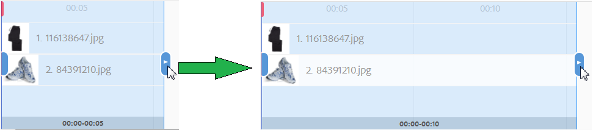

# Vidéos interactives{#interactive-videos}

Vous pouvez facilement créer des vidéos interactives, également appelées vidéos Shoppable, qui génèrent des conversions directement à partir de la vidéo. L’engagement du client avec la vidéo a lieu dans un panneau à côté du lecteur vidéo, où les miniatures des services, informations ou produits associés défilent en fonction de ce qui est présenté dans la vidéo. Les clients peuvent sélectionner la miniature et accéder directement au service, ajouter l’article à un panier pour un achat immédiat ou encore accéder à une page web pour plus d’informations.

Une fois la vidéo terminée, un résumé visuel de toutes les offres s’affiche pour générer un appel à l’action. Les clients ont une autre occasion de sélectionner l’élément qu’ils souhaitent. Ces expériences concrètes et spécifiques augmentent les interactions et les conversions des clients.

Voir aussi [Images interactives](/help/assets/dynamic-media/interactive-images.md).

## Vidéos interactives à l’œuvre {#interactive-video-in-action}

Pour voir une vidéo interactive Shoppable en action, sélectionnez [Live Demos](https://landing.adobe.com/en/na/dynamic-media/ctir-2755/live-demos.html) (démonstrations en direct), faites défiler la page jusqu’à l’en-tête **[!UICONTROL Médias Shoppable]**, puis sélectionnez la vidéo Shoppable pour commencer la lecture.

* Pendant la lecture, lorsque les produits sont utilisés dans la vidéo, le produit identique s’affiche à droite sous forme de miniature.

* Pour mettre la vidéo en pause et ouvrir l’aperçu rapide du produit, sélectionnez la miniature. Par exemple, sélectionnez la miniature du KitchenAid dans la vidéo pour afficher le mixeur avec une option de rotation à 360° ou utilisez le zoom pour afficher les détails du mixeur.

Voir aussi [Utilisation de vidéos interactives avec Dynamic Media](https://experienceleague.adobe.com/docs/experience-manager-learn/assets/dynamic-media/dynamic-media-interactive-video-feature-video-use.html?lang=fr#dynamic-media)

<!-- 

There was a link here that showed the video frame of an interactive video and when the reader selected the frame the video would play https://experienceleague.adobe.com/tools/dynamic-media-demo/shoppable-video/AXIS/index.html. This must now call a new interactive video

-->

<!-- 

[A frame from an interactive, shoppable video](assets/chlimage_1-126.png) *A video frame capture from an interactive, shoppable video.*

-->

>[!NOTE]
>
>Si vous créez une vidéo interactive pour lancer une page web lorsqu’un utilisateur sélectionne une miniature, certains appareils bloquent l’ouverture de la page web contextuelle. Dans ce cas, modifiez le paramètre de blocage des fenêtres contextuelles sur l’appareil. Par exemple, sur un Apple iPhone 6, accédez à **[!UICONTROL Paramètres]** > **[!UICONTROL Safari]** > **[!UICONTROL Bloquer les pop-up]**, puis faites glisser la commande sur **[!UICONTROL Désactivé]**. À présent, lorsque vous visionnez une vidéo interactive et que vous sélectionnez une miniature, vous êtes invité à ouvrir le pop-up. Si vous acceptez, la page web s’ouvre.

### Découvrez comment les vidéos interactives sont créées {#watch-how-interactive-videos-are-created}

Regardez une présentation sur [la manière dont les vidéos interactives sont créées](https://s7d5.scene7.com/s7viewers/html5/VideoViewer.html?videoserverurl=https://s7d5.scene7.com/is/content/&amp;emailurl=https://s7d5.scene7.com/s7/emailFriend&amp;serverUrl=https://s7d5.scene7.com/is/image/&amp;config=Scene7SharedAssets/Universal_HTML5_Video_social&amp;contenturl=https://s7d5.scene7.com/skins/&amp;asset=S7tutorials/InteractiveVideo) (7 minutes et 30 secondes).
(Même si la présentation vidéo est personnalisée grâce à Assets on Demand, les principes et les étapes restent compatibles avec les vidéos interactives dans Adobe Experience Manager Assets.)

### Webinaire « Succès des clients Adobe »  {#adobe-customer-success-webinar}

Le webinaire [Utiliser une vidéo interactive, du partage de liens et du partage sur YouTube dans Experience Manager Assets](https://adobecustomersuccess.adobeconnect.com/p1yxzdo4aec/) explique comment utiliser la vidéo interactive et d’autres fonctionnalités pour lier des événements qui dépendent de la conversion dans votre contenu marketing vidéo.

## Démarrage rapide : vidéos interactives {#quick-start-interactive-videos}

La description du workflow étape par étape qui suit est conçue pour vous aider à démarrer et à utiliser rapidement les vidéos interactives dans Dynamic Media.

Recherchez le titre **Exemple** dans certaines tâches de démarrage rapide. Il contient un court tutoriel reposant sur cette [page web de démonstration de démarrage qui n’est *pas encore* interactive](https://experienceleague.adobe.com/tools/dynamic-media-demo/shoppable-video/john-lewis/landing-0.html?lang=fr).

Les **exemples** permettent d’illustrer les étapes d’intégration de vidéos interactives à votre site web.

Au terme du tutoriel dans la dernière section Exemple, [votre page web de démonstration finale avec la vidéo interactive entièrement intégrée apparaît sous cette forme](https://experienceleague.adobe.com/tools/dynamic-media-demo/shoppable-video/john-lewis/landing-3.html?lang=fr).

Étapes d’ajout de la vidéo interactive :

1. **(Facultatif) Identifier des variables d’aperçu rapide** : commencez par identifier les variables dynamiques utilisées par votre mise en œuvre existante de l’aperçu rapide. Vous utilisez des variables pour mapper des vignettes de produit à l’aperçu rapide du produit correspondant lorsque vous créez votre vidéo interactive. Voir [(Facultatif) Identification des variables d’aperçu rapide](#optional-identifying-quickview-variables).
   **Cette étape n’est nécessaire que si les conditions ci-dessous se vérifient :**
   * Vous souhaitez améliorer l’interactivité de votre vidéo en déclenchant des aperçus rapides.
   * Votre mise en œuvre d’Experience Manager *n’utilise pas* de framework d’intégration d’e-commerce pour extraire des données de produit dans Experience Manager à partir d’une solution d&#39;e-commerce, comme IBM® WebSphere® Commerce, Elastic Path, SAP Hybris ou Intershop.

1. **(Facultatif) Créer un paramètre prédéfini de visionneuse de vidéos interactives** : personnalisez l’aspect et le comportement des différents composants qui constituent la visionneuse, comme la barre vidéo et les miniatures interactives.
Vous n’avez pas besoin de créer votre propre paramètre prédéfini de visionneuse de vidéos interactives si vous envisagez plutôt d’utiliser les paramètres de visionneuse de vidéos interactives prêts à l’emploi `Shoppable_Video_Light` ou `Shoppable_Video_Dark`.
Voir [Création d’un paramètre prédéfini de visionneuse](/help/assets/dynamic-media/managing-viewer-presets.md#creating-a-new-viewer-preset) (facultatif) et [Aspects spéciaux de la création d’un paramètre prédéfini de visionneuse de vidéos interactives](/help/assets/dynamic-media/managing-viewer-presets.md#special-considerations-for-creating-an-interactive-viewer-preset).

1. **Charger une vidéo et les ressources d’image associées** : chargez une vidéo et les images associées auxquelles vous souhaitez ajouter de l’interactivité.
Voir [Chargement d’une vidéo et des ressources miniatures associées](#uploading-a-video-and-its-associated-thumbnail-assets).

   >[!NOTE]
   >
   >Le format vidéo MXF n’est pas encore pris en charge pour l’utilisation de vidéos interactives dans Dynamic Media.

1. **Ajouter de l’interactivité à votre vidéo** : ajoutez un ou plusieurs segments temporels à la vidéo. Ensuite, associez les vignettes dans ces segments temporels. Affectez chaque miniature d’image à une action telle qu’un lien hypertexte, un aperçu rapide ou un fragment d’expérience.
(La méthode de liaison basée sur une URL n’est pas possible si votre contenu interactif contient des liens avec des URL relatives, en particulier des liens vers des pages Experience Manager Sites.)
Terminez en publiant les ressources vidéo interactives. La publication crée le code intégré ou l’URL que vous copiez et appliquez à la fin dans la page de destination de votre site web. Voir [Ajout d’interactivité à votre vidéo](#adding-interactivity-to-your-video).
Voir [Publication de ressources](/help/assets/dynamic-media/publishing-dynamicmedia-assets.md).

1. **Ajouter une vidéo interactive à votre site web ou sur votre site web dans** – Si vous utilisez Experience Manager Sites ou Experience Manager eCommerce, ou les deux, ajoutez la vidéo interactive à une page web dans Experience Manager. Faites glisser le composant Interactive Media sur la page. Voir [Ajout de ressources Dynamic Media à des pages](/help/assets/dynamic-media/adding-dynamic-media-assets-to-pages.md).
Utilisez le code intégré ou l’URL pour intégrer votre vidéo interactive aux expériences de votre site web. Voir [Intégration d’une vidéo interactive à votre site web](#integrating-an-interactive-video-with-your-website).
Si vous utilisez un gestionnaire de contenu web (WCM) tiers, vous devez intégrer la nouvelle vidéo interactive à l’aperçu rapide existant utilisé sur votre site web. Voir [Intégration d’une vidéo interactive dans un aperçu rapide existant](#integrating-an-interactive-video-with-an-existing-quickview).
   [Ajout de ressources Dynamic Media aux pages](/help/assets/dynamic-media/adding-dynamic-media-assets-to-pages.md)

## (Facultatif) Identification de variables de zone interactive {#optional-identifying-quickview-variables}

>[!NOTE]
>
>Cette tâche n’est nécessaire que si les conditions ci-dessous sont remplies :
>
>* Vous souhaitez ajouter de l’interactivité à votre vidéo en déclenchant des aperçus rapides.
>* Votre mise en œuvre d’Experience Manager *n’utilise pas* de framework d’intégration de commerce électronique pour extraire des données de produit dans Experience Manager à partir d’une solution de commerce électronique, comme IBM® WebSphere® Commerce, Elastic Path, SAP Hybris ou Intershop. <!-- See [eCommerce concepts in Experience Manager Assets](/help/sites-administering/concepts.md).-->
>
>Si votre mise en œuvre d’Experience Manager utilise l’e-commerce, vous pouvez ignorer cette tâche et passer à la tâche suivante.

Commencez par identifier les variables dynamiques utilisées par votre mise en œuvre existante d’aperçu rapide pour faire correspondre les miniatures de produits à l’aperçu rapide des produits correspondants lors du processus de création de vidéo interactive.

Lorsque vous ajoutez des segments temporels à une vidéo, vous affectez une SKU (unité de gestion des stocks) et toute variable supplémentaire à chaque miniature que vous ajoutez à un segment. Ces variables sont utilisées ultérieurement pour afficher le bon aperçu rapide de produit.

Il est important d’identifier correctement les variables qui sont requises pour déclencher de manière unique l’aperçu rapide d’un produit.

Il est parfois nécessaire de consulter les informaticiens responsables de votre implémentation d’aperçu rapide existante. Ils sont susceptibles de connaître l’ensemble minimal de données qui identifie l’aperçu rapide dans le système. Cependant, il est possible d’analyser le comportement existant du code en front-end.

La plupart des implémentations d’aperçu rapide utilisent le modèle suivant :

* L’utilisateur active un élément d’interface utilisateur sur le site web. Par exemple, en sélectionnant un bouton « Aperçu rapide ».
* Le site Web envoie une requête Ajax au serveur principal afin de charger les données ou le contenu de l’aperçu rapide, le cas échéant.
* Les données de l’aperçu rapide sont traduites en contenu en préparation du rendu sur la page Web.
* Enfin, le code en front-end effectue le rendu visuel de ce contenu à l’écran.

L’approche consiste donc à visiter différentes zones de votre site web existant où l’aperçu rapide est implémenté. Ensuite, déclenchez l’aperçu rapide et capturez l’URL Ajax envoyée par la page web pour charger les données ou le contenu de cet aperçu.

Normalement, il n’est pas nécessaire d’utiliser des outils de débogage spécialisés. Les navigateurs web modernes incluent des inspecteurs web qui font un travail correct. Vous trouverez ci-dessous quelques exemples de navigateurs web qui incluent des inspecteurs web :

* Pour voir toutes les demandes HTTP sortantes dans Google Chrome, appuyez sur **F12** (Windows®) ou **Contrôle+Options+I** (Mac) pour ouvrir le panneau Outils de développement, puis sélectionnez l’onglet **Réseau**.

* Dans Firefox, vous pouvez activer le plug-in Firebug en appuyant sur **F12** (Windows®) ou **Contrôle+Option+I** (Mac) et utiliser l’onglet **[!UICONTROL Réseau]**. Sinon, vous pouvez utiliser l’outil Inspecteur intégré et son onglet Réseau.

* Dans Internet Explorer, activez l’outil de débogage en appuyant sur **F12**.

Lorsque la surveillance de réseau est activée dans le navigateur, déclenchez l’aperçu rapide sur la page.

Vous trouvez maintenant l’URL Ajax d’aperçu rapide dans le journal réseau. Copiez l’URL enregistrée pour l’analyse ultérieure. Généralement, lorsque vous déclenchez l’aperçu rapide, plusieurs requêtes sont envoyées au serveur. En règle générale, l’URL Ajax d’aperçu rapide est l’une des premières dans la liste. Elle possède une partie de chaîne de requête complexe ou un chemin d’accès, et son type de réponse MIME est `text/html`, `text/xml` ou `text/javascript`.

Au cours de ce processus, il est important de parcourir différentes zones de votre site web, avec différentes catégories et types de produits. C’est pourquoi les URL d’aperçu rapide peuvent avoir des parties communes pour une catégorie de site web donnée, mais ne changent que si vous visitez une autre zone du site web.

Dans le cas le plus simple, la seule partie variable dans l’URL de l’aperçu rapide est le SKU du produit. Dans ce cas, la valeur de SKU du produit est la seule donnée requise pour ajouter des vignettes sur un segment temporel dans la vidéo interactive dans Experience Manager.

Cependant, dans les cas complexes, l’URL d’aperçu rapide comporte différents éléments variables en complément de la valeur de SKU du produit, comme l’identifiant de la catégorie et le code de couleur. Dans ce cas, chaque élément de ce type est une variable distincte dans la définition des données de miniatures dans Experience Manager.

Consultez les exemples d’URL d’aperçu rapide et les variables de miniatures qui en résultent ci-dessous :

<table>
  <tbody>
  <tr>
    <td><p>SKU unique, trouvé dans la chaîne de requête.</p> </td>
    <td><p>Les URL d’aperçu rapide enregistrées incluent ce qui suit :</p>
    <ul>
      <li><p><code>https://server/json?productId=866558&amp;source=100</code></p> </li>
      <li><p><code>https://server/json?productId=1196184&amp;source=100</code></p> </li>
      <li><p><code>https://server/json?productId=1081492&amp;source=100</code></p> </li>
      <li><p><code>https://server/json?productId=1898294&amp;source=100</code></p> </li>
    </ul> <p>La seule partie variable de l’URL est la valeur du paramètre de chaîne de requête <code>productId=</code>, et il s’agit clairement d’une valeur de SKU. Par conséquent, seuls les champs SKU des miniatures doivent être renseignés avec des valeurs comme <strong><code>866558</code></strong>, <strong><code>1196184</code></strong>, <strong><code>1081492</code></strong> et <strong><code>1898294</code></strong>.</p> </td>
  </tr>
  <tr>
    <td><p>SKU unique, trouvé dans le chemin d’accès à l’URL.</p> </td>
    <td><p>Les URL d’aperçu rapide enregistrées incluent ce qui suit :</p>
    <ul>
      <li><p><code>https://server/product/6422350843</code></p> </li>
      <li><p><code>https://server/product/1607745002</code></p> </li>
      <li><p><code>https://server/product/0086724882</code></p> </li>
    </ul> <p>La partie variable se trouve dans la dernière partie du chemin et elle devient la valeur de SKU des miniatures Experience Manager : <strong><code>6422350843</code></strong>, <strong><code>1607745002</code></strong> et <strong><code>0086724882</code></strong>.</p> </td>
  </tr>
  <tr>
    <td><p>SKU et ID de catégorie dans la chaîne de requête.</p> </td>
    <td><p>Les URL d’aperçu rapide enregistrées incluent ce qui suit :</p>
    <ul>
      <li><p><code>https://server/quickView/product/?category=1100004&amp;prodId=305466</code></p> </li>
      <li><p><code>https://server/quickView/product/?category=1100004&amp;prodId=310181</code></p> </li>
      <li><p><code>https://server/quickView/product/?category=1740148&amp;prodId=308706</code></p> </li>
    </ul> <p>Dans ce cas, l’URL comporte deux parties différentes. Le SKU est stocké dans le paramètre <code>prodId</code> et l’ID de catégorie dans le paramètre <code>category=</code>.</p> <p>Par conséquent, les définitions des miniatures sont des paires. Autrement dit, une valeur de SKU et une variable supplémentaire appelée <code>categoryId</code>. Les paires obtenues sont les suivantes :</p>
    <ul>
      <li>Le SKU est <code>305466</code> et <code>categoryId</code> est <code>1100004</code></li>
      <li>Le SKU est <code>310181</code> et <code>categoryId</code> est <code>1100004</code></li>
      <li>Le SKU est <code>308706</code> et <code>categoryId</code> est <code>1740148</code></li>
    </ul> <p> </p> </td>
  </tr>
  </tbody>
</table>

**Exemple**

Lorsque l’approche ci-dessus est appliquée à l’exemple de site web, la page web comporte différentes vignettes de produit, auxquelles est associé un bouton « AFFICHER PLUS » :

[https://experienceleague.adobe.com/tools/dynamic-media-demo/shoppable-video/john-lewis/landing-0.html?lang=fr](https://experienceleague.adobe.com/tools/dynamic-media-demo/shoppable-video/john-lewis/landing-0.html?lang=fr)

Une fois que vous avez activé l’aperçu rapide de tous les produits disponibles dans la page, vous obtenez la liste de demandes d’aperçu rapide exécutées en arrière-plan ci-dessous :

* datafeed/candles-233396346.json
* datafeed/candles-233978050.json
* datafeed/candles-234024346.json
* datafeed/candles-234024356.json
* datafeed/candles-234024359.json
* datafeed/cushions-233939848.json
* datafeed/cushions-234019477.json
* datafeed/cushions-234019483.json
* datafeed/furniture-231747479.json
* datafeed/furniture-232625621.json
* datafeed/furniture-232625626.json
* datafeed/furniture-233939810.json
* datafeed/furniture-233939825.json
* datafeed/furniture-233939828.json
* datafeed/furniture-233939853.json
* datafeed/furniture-233940334.json
* datafeed/glassware-000064007.json
* datafeed/glassware-230722193.json
* datafeed/glassware-233916550.json
* datafeed/glassware-233916597.json

Lorsque vous observez les appels de serveur, vous constatez que les informations spécifiques au produit ne sont présentes que dans le chemin de la requête. Vous notez également que la chaîne de requête n’est pas du tout utilisée et que deux types de données distincts sont impliqués :

* Le premier type concerne les bougies, les coussins, les meubles et la verrerie. Vous pouvez l’appeler « catégorie de produits ».
* Le second type est le code de produit, tel que 233916597. Vous pouvez supposer qu’il s’agit de « SKU du produit ».

Compte tenu de ces informations, l’intégralité de l’URL de l’aperçu rapide suit le schéma suivant :

`/datafeed/$categoryId$-$SKU$.json`

En fonction de cette analyse, vous concluez que vous pouvez utiliser les deux variables ci-dessous pour les miniatures : `categoryId` et `SKU`.

Vous êtes maintenant prêt à charger une vidéo et les ressources de vignette associées.

## (Facultatif) Création d’un paramètre prédéfini de la visionneuse de vidéo interactive {#optional-creating-an-interactive-video-viewer-preset}

Vous pouvez ignorer cette tâche et passer à la tâche suivante si vous envisagez d’utiliser les types de paramètres prédéfinis de visionneuse de vidéos interactives par défaut, prêtes à l’emploi, `Shoppable_Video_dark` ou `Shoppable_Video_light`.

Lorsqu’une miniature est sélectionnée dans l’environnement de création, un aperçu de la boîte de dialogue Aperçu rapide s’affiche.


Vous pouvez éventuellement créer votre propre paramètre prédéfini personnalisé de visionneuse de vidéos interactive. Vous pouvez déterminer, entre autres, le style du lecteur vidéo, les miniatures interactives et l’affichage de la grille de miniatures qui apparaît à la fin de la vidéo.

Un paramètre prédéfini de visionneuse de vidéo interactive restitue correctement la vidéo et tous les segments de la chronologie que vous avez ajoutés. Il utilise également un aperçu rapide d’exemple par défaut lorsque vous sélectionnez la miniature d’un produit en mode Aperçu afin de pouvoir tester son interactivité avant la publication.

Une fois le paramètre prédéfini de la visionneuse enregistré, son état est automatiquement définit sur **On** (Activé) sur la page Paramètres prédéfinis de la visionneuse. Cet état signifie qu’il est visible dans le composant Dynamic Media et chaque fois que vous prévisualisez une vidéo avec ce paramètre prédéfini. Veillez à également publier manuellement votre nouveau paramètre prédéfini de visionneuse.

Pour créer votre propre paramètre prédéfini de visionneuse de vidéos interactives, reportez-vous à la section [Créer un paramètre prédéfini de visionneuse](/help/assets/dynamic-media/managing-viewer-presets.md#creating-a-new-viewer-preset).

## Chargement d’une vidéo et de ses ressources miniatures associées {#uploading-a-video-and-its-associated-thumbnail-assets}

Si vous avez déjà chargé votre vidéo et les ressources miniatures, passez à la section [Ajouter de l’interactivité à votre vidéo](#adding-interactivity-to-your-video).

>[!NOTE]
>
>Le format vidéo MXF n’est pas encore pris en charge pour l’utilisation de vidéos interactives dans Dynamic Media.

Si vous n’avez pas chargé les vidéos ou images appropriées, ou si vous souhaitez supprimer les vidéos ou images chargées dont vous n’avez plus besoin, reportez-vous à la section [Supprimer des ressources](/help/assets/manage-digital-assets.md#delete-assets).

Pour télécharger une vidéo et des ressources miniatures associées :

1. Téléchargez la vidéo et les ressources miniatures associées dans le ou les dossiers de votre choix.

   Consultez [Charger des ressources](/help/assets/manage-digital-assets.md).
Voir [Charger des ressources à l’aide de la planification de tâches FTP](/help/assets/manage-digital-assets.md).

   Ajoutez maintenant l’interactivité à votre vidéo.

## Ajouter de l’interactivité à votre vidéo {#adding-interactivity-to-your-video}

Vous ajoutez des segments de chronologie à une vidéo à l’aide de l’éditeur visuel intégré sur la page Créer une vidéo interactive.

Une fois que vous avez ajouté des segments de montage, vous ajoutez des images de miniatures à chaque segment. Pour chaque miniature que vous ajoutez, vous lui appliquez une action. Par exemple, vous pouvez appliquer un aperçu rapide à la miniature, ou vous pouvez lui affecter un lien hypertexte ou un fragment d’expérience.

Voir [Fragments d’expérience](/help/sites-cloud/authoring/fragments/content-fragments.md).

>[!NOTE]
>
>Les outils de partage sur les médias sociaux ne sont pas pris en charge dans la vidéo interactive lorsque vous incorporez la visionneuse dans un fragment d’expérience. Il est donc plutôt conseillé d’utiliser ou de créer des paramètres prédéfinis de visionneuse qui ne disposent pas d’outils de partage sur les médias sociaux. Ces paramètres prédéfinis de visionneuse vous permettent de l’incorporer dans des fragments d’expérience.

>[!NOTE]
>
>La méthode de liaison basée sur une URL n’est pas possible si votre contenu interactif contient des liens avec des URL relatives, en particulier des liens vers des pages Experience Manager Sites.

Les options Annuler et Rétablir, proches du coin supérieur droit de la page, sont prises en charge au cours de la session de création/modification actuelle.

Une fois la vidéo interactive enregistrée, elle s’ouvre immédiatement dans l’aperçu. À partir de là, vous pouvez sélectionner un paramètre prédéfini de visionneuse de vidéos interactives et lire la vidéo pour voir une représentation approximative de son aspect pour les clients.

**Pour ajouter de l’interactivité à votre vidéo :**

1. Dans la vue Ressources, accédez à la vidéo que vous avez chargée et que vous souhaitez rendre interactive.
1. Utilisez l’une des méthodes suivantes :

   * Pointez sur l’image, puis sélectionnez **[!UICONTROL Sélectionner]** (icône de coche). Dans la barre d’outils, sélectionnez **[!UICONTROL Modifier]**.

   * Pointez sur l’image, puis sélectionnez **[!UICONTROL Autres actions]** (icône représentant des points de suspension) > **[!UICONTROL Modifier]**.

   * Pour l’ouvrir dans la page Affichage des détails, sélectionnez l’image. Dans la barre d’outils, sélectionnez **[!UICONTROL Modifier]**.

1. Dans la page Créer une vidéo interactive, procédez comme suit :

   * Pour commencer à lire la vidéo, sélectionnez le bouton **[!UICONTROL Lecture]**. Lorsqu’un produit, un service ou un détail particulier que vous souhaitez mettre en évidence est affiché, sélectionnez **[!UICONTROL Ajouter un segment]** dans la barre d’outils. Répétez cette opération jusqu’à ce que vous ayez atteint la fin de la vidéo.

     Vous pouvez affecter une ou plusieurs images miniatures à chaque segment de temps ajouté. Vous pouvez ensuite lier ces vignettes avec les pages produit en aperçu rapide destinées aux achats des clients, ou avec les pages web pour accéder à d’autres informations.

   * Pour commencer à lire la vidéo, sélectionnez le bouton **[!UICONTROL Lecture]**. Lorsqu’un produit, un service ou un détail particulier que vous souhaitez mettre en évidence est affiché, sélectionnez **[!UICONTROL Pause]**. Sélectionnez **[!UICONTROL Ajouter un segment]**.

     Continuez la lecture et la mise en pause de la vidéo à des points de la chronologie où vous souhaitez ajouter un segment jusqu’à la fin de la vidéo.

1. (Facultatif) Faites glisser la barre sur le **[!UICONTROL curseur d’échelle de la chronologie]** vers la gauche pour effectuer un zoom avant, ou vers la droite pour effectuer un zoom arrière. Cette action permet de contrôler le niveau de détail des segments que vous avez ajoutés.

   

   En fonction de la durée de votre vidéo, la durée du segment propose par défaut les valeurs suivantes :

   <table>
      <tbody>
        <tr>
        <td><strong>Si la durée de la vidéo est...</strong></td>
        <td><strong>Le paramètre Durée de segment propose par défaut...</strong></td>
        </tr>
        <tr>
        <td>3 minutes ou plus</td>
        <td>60 secondes</td>
        </tr>
        <tr>
        <td>2 à 3 minutes</td>
        <td>30 secondes</td>
        </tr>
        <tr>
        <td>1 à 2 minutes</td>
        <td>20 secondes<br /> </td>
        </tr>
        <tr>
        <td>30 à 60 secondes</td>
        <td>10 secondes</td>
        </tr>
        <tr>
        <td>30 secondes ou moins</td>
        <td>5 secondes</td>
        </tr>
      </tbody>
    </table>

   La chronologie vidéo utilise autant d’espace dans l’écran qu’il y a d’espace disponible. De même, lorsque vous redimensionnez la fenêtre du navigateur, les segments ajoutés conservent leur largeur appropriée.

   Pour illustration, les trois écrans ci-dessous utilisent la même vidéo. Notez que la largeur de chaque segment change en fonction du paramètre Échelle de la chronologie.

   

   Capture d’écran A

   La capture d’écran A ci-dessus présente l’affichage par défaut d’une vidéo de produit de 29 secondes. Le paramètre Échelle de la chronologie est défini sur la valeur par défaut de 5 secondes.

   

   Capture d’écran B

   Dans la capture d’écran B ci-dessus, le curseur d’échelle de la chronologie a été déplacé de la valeur par défaut de 5 secondes à 3 secondes. Notez que désormais les différents horodatages d’échelle de la chronologie correspondent tous à des intervalles de 3 secondes.

   

   Capture d’écran C

   Dans la capture d’écran C ci-dessus, le paramètre Échelle de la chronologie a été modifié à 8 secondes. Notez comment les segments qui contiennent des miniatures de produit ont rétréci. Le zoom arrière de cette manière est utile si vous disposez d’une longue vidéo et que vous souhaitez pouvoir afficher un aperçu de davantage de segments qui s’ajustent normalement à la largeur de la page.

1. (En option) Effectuez l’une des actions suivantes :

   * Pour ajuster l’heure de début et de fin d’un segment.

     Sélectionnez un segment, puis faites glisser l’ovale bleu de début ou de fin pour ajuster respectivement l’heure de début ou de fin. L’image vidéo affichée se déplace à l’heure appropriée dans la vidéo en fonction de vos réglages. Le déplacement du segment de la chronologie est limité en fonction des segments adjacents dans la chronologie. La durée minimale autorisée pour le segment est d’une seconde.

     Utilisez les raccourcis de navigation ci-dessous pour vérifier et optimiser rapidement les segments de vidéo :

      * Pour accéder à la vidéo directement au début de ce segment, sélectionnez l’ovale bleu de début.
      * Pour accéder à la vidéo directement à la fin de ce segment, sélectionnez l’ovale bleu de fin.
      * Pour ramener la lecture de la vidéo au début de ce segment, sélectionnez l’ensemble du segment.

   

   Repositionnement de la fin d’un segment de chronologie

   * Pour supprimer un segment

     Sélectionnez le dernier segment qui se trouve sur la chronologie puis, sur la barre d’outils, sélectionnez **[!UICONTROL Supprimer le segment]**. Si plusieurs segments sont sélectionnés, la fonction Supprimer le segment est désactivée.

     Vous ne pouvez supprimer que le dernier segment. Par exemple, pour supprimer tous les segments de la chronologie, vous devez toujours sélectionner le dernier segment puis **[!UICONTROL Supprimer le segment]**.

1. Sélectionnez un segment de temps auquel vous souhaitez associer une ou plusieurs images miniatures.
1. À la droite de la vidéo, sélectionnez l’onglet **[!UICONTROL Contenu]**.
1. Sous l’onglet Contenu, sélectionnez **[!UICONTROL Sélectionner les ressources]**, puis cherchez et sélectionnez toutes les ressources d’image à utiliser avec votre vidéo. Les ressources sélectionnées sont ajoutées au panneau Sélecteur de ressources dans l’onglet Contenu.

1. Dans le sélecteur de ressources situé sous l’onglet Contenu, effectuez l’une des opérations suivantes :

   <table>
      <tbody>
        <tr>
        <td>Pour associer une miniature à un segment de chronologie sélectionné</td>
        <td><p>Sélectionnez l’image dans le panneau Sélecteur de ressources dans la partie droite.</p> <p>Vous pouvez ajouter à un segment de chronologie autant de miniatures que vous le souhaitez. Pour chaque image que vous sélectionnez, une coche s’affiche au-dessus de l’image dans le sélecteur de ressources.</p> </td>
        </tr>
        <tr>
        <td>Pour supprimer une miniature du segment de chronologie sélectionné</td>
        <td><p>Procédez de l’une des manières suivantes :</p>
          <ul>
          <li>Dans le panneau Sélecteur de ressources, sélectionnez une image comportant une coche pour la désélectionner. La ressource image est supprimée du segment de la chronologie.<br /> </li>
          <li>Dans le segment de chronologie sélectionné, sélectionnez une image puis, dans la barre d’outils, appuyez sur <strong>Supprimer le produit</strong>.</li>
          </ul> </td>
        </tr>
      </tbody>
    </table>

   

   Le fait de sélectionner une image dans le panneau Sélecteur de ressources permet de l’ajouter dans le segment sélectionné de la chronologie.

1. Sélectionnez une image miniature unique dans l’un des segments de chronologie, puis sélectionnez l’onglet **[!UICONTROL Actions]**.
1. Procédez de l’une des manières suivantes :
   <table> 
    <tbody> 
      <tr> 
      <td>Pour associer l’image miniature sélectionnée à un aperçu rapide</td> 
      <td><p>Sous Type d’action, sélectionnez <strong>Aperçu rapide</strong>.</p> <p>Si vous êtes un client Experience Manager Sites ou AEM eCommerce :</p> 
       <ul> 
       <li>Notez que le champ de texte Valeur SKU est prérenseigné avec la SKU du produit sélectionné (unité de gestion des stocks). Le SKU est un identifiant unique associé à chaque produit ou service spécifique que vous proposez. Le champ est renseigné automatiquement lorsque l’image est associée à un produit dans Experience Manager Commerce.</li> 
       <li>Si la SKU prérenseignée est incorrecte, sélectionnez l’icône Sélecteur de produit (loupe) pour afficher la page Sélectionner un produit. Sélectionnez le produit à utiliser, puis la coche située dans l’angle supérieur droit de la page. Vous revenez à l’éditeur vidéo interactif.</li> 
       </ul> <p> Si vous <em>n’êtes pas</em> client Experience Manager Sites ou eCommerce</p> 
       <ul> 
       <li>Voir <a href="/help/assets/dynamic-media/carousel-banners.md#identifying-hotspot-and-image-map-variables">Identification des variables des zones réactives</a>. Ces variables doivent être définies.</li> 
       <li>Par défaut, ce champ SKU utilise le nom de fichier de la ressource image sans l’extension. Pour vos fichiers, si vous suivez une convention de dénomination standard basée sur la valeur de SKU, ce champ ne nécessite généralement pas de modifications supplémentaires. </li> 
       <li>Sinon, modifiez la valeur par défaut et entrez la valeur de SKU appropriée. Dans le champ de texte Valeur de SKU, entrez la SKU, qui est un identifiant unique pour chaque produit ou service que vous proposez. La valeur de SKU entrée est renseignée automatiquement dans la partie variable du modèle d’aperçu rapide afin que le système sache associer l’image sélectionnée à l’aperçu rapide d’un SKU spécifique.</li> 
       </ul> <p>(Facultatif) S’il existe d’autres variables dans l’aperçu rapide que vous devez utiliser pour identifier un produit, sélectionnez <strong>Ajouter la variable générique</strong>. Dans le champ de texte, spécifiez une variable supplémentaire. Par exemple, <code>category=Womens</code> est une variable ajoutée.</p> <p> </p> </td> 
      </tr> 
      <tr> 
      <td>Pour associer l’image miniature sélectionnée à un lien hypertexte</td> 
      <td><p>Sous Type d’action, sélectionnez <strong>Hyperlien</strong>, puis procédez de l’une des manières suivantes :</p> 
       <ul> 
       <li>Si vous êtes client Experience Manager Sites, sélectionnez l’icône Sélecteur de site (dossier) pour accéder à une page web. La méthode de liaison basée sur une URL n’est pas possible si votre contenu interactif contient des liens avec des URL relatives, en particulier des liens vers des pages Experience Manager Sites.</li> 
       <li>Si vous êtes un client ou une cliente autonome de Dynamic Media, dans le champ de texte HREF, spécifiez le chemin URL complet vers une page web liée.</li> 
       </ul> <p>Veillez à spécifier si vous souhaitez ouvrir le lien dans un nouvel onglet du navigateur ou dans le même onglet.</p> </td> 
      </tr> 
      <tr> 
      <td>Pour associer l’image miniature sélectionnée à un fragment d’expérience</td> 
      <td><p>Sous Type d’action, sélectionnez <strong>Fragment d’expérience</strong>, puis effectuez les actions suivantes :<p> 
       <ul> 
       <li>Si vous êtes client Experience Manager Sites, sélectionnez l’icône Rechercher (loupe) afin d’ouvrir la page Fragment d’expérience. Sélectionnez le fragment d’expérience à utiliser, puis sélectionnez <strong>. Pour revenir au panneau Actions de la page précédente, sélectionnez</strong> dans l’angle supérieur droit de la page.<br /> Voir <a href="/help/sites-cloud/authoring/fragments/content-fragments.md">Fragments d’expérience</a>.</li> 
      </ul> 
       <ul> 
       <li>Indiquez la largeur et la hauteur du fragment d’expérience tel qu’il apparaît dans la vidéo.</li>
       </ul><strong>Remarque</strong> : Les outils de partage sur les médias sociaux ne sont pas pris en charge dans la vidéo interactive lorsque vous incorporez la visionneuse dans un fragment d’expérience. Il est donc plutôt conseillé d’utiliser ou de créer des paramètres prédéfinis de visionneuse qui ne disposent pas d’outils de partage sur les médias sociaux. Ces paramètres prédéfinis de visionneuse vous permettent de l’incorporer dans des fragments d’expérience.</p></tr>&lt; 
      <tr> 
      <td>Pour modifier une action déjà attribuée à une image miniature</td> 
      <td>Dans un segment de journal, sélectionnez une miniature présentant un lien de chaîne à la droite de son libellé de texte. Ce maillon de chaîne indique qu’une action lui est attribuée. Pour apporter vos modifications, sélectionnez l’onglet <strong>Actions</strong>.</td> 
      </tr> 
      <tr> 
      <td>Pour modifier le libellé de texte d’une image miniature</td> 
      <td><p>Par défaut, le libellé de texte utilise le champ de métadonnées <code>Title</code> de l’image miniature. En l’absence de <code>Title</code>, le nom de fichier de l’image miniature est utilisé à la place, mais sans l’extension.</p> <p>Pour modifier le libellé de texte d’une vignette, sous l’onglet <strong>Actions</strong>, directement sous la ressource image qui s’affiche, entrez le texte de votre choix. Consultez l’image ci-dessous.</p> <p>Le nouveau libellé n’est utilisé que par la visionneuse vidéo proprement dite et le texte des vignettes affiché dans le segment de la chronologie. La modification du libellé n’affecte pas le champ Titre des métadonnées de la miniature ni son nom de fichier.</p> </td> 
      </tr> 
      <tr> 
      <td>Pour rétablir une modification</td> 
      <td>Près de l’angle droit supérieur de la page, sélectionnez <strong>Annuler</strong> ou <strong>Rétablir</strong>.</td> 
      </tr> 
    </tbody> 
   </table>

   

   Un nouveau libellé de texte est ajouté à l’image miniature.

1. Utilisez l’une des méthodes suivantes :

   * Répétez les étapes 6 à 11 pour ajouter d’autres images miniatures aux segments de chronologie de votre vidéo.
   * Passez à l’étape facultative 13.

1. (Facultatif) Effectuez l’une des opérations suivantes :

   * **[!UICONTROL Fusionner un segment]** - Vous pouvez combiner deux segments adjacents (avec ou sans miniatures de produit qui leur sont affectées) en un seul segment.

     Dans le journal, sélectionnez les segments contigus que vous souhaitez fusionner en un seul. Il n’y a pas de poignées de déplacement ovales de couleur bleue sur les deux segments sélectionnés dans l’image ci-dessous.

     Sélectionnez **[!UICONTROL Fusionner le segment]** dans la barre d’outils.

   

   Fusion de deux segments sélectionnés de cinq secondes en un segment de dix secondes.

   * **[!UICONTROL Fractionner un segment]** - Vous pouvez diviser un seul segment en deux segments à temps égal. Si des miniatures de produit sont déjà affectées au segment, elles sont combinées dans le segment de gauche.

     Dans le journal, sélectionnez le segment que vous voulez diviser en deux, puis sélectionnez **[!UICONTROL Fractionner le segment]** dans la barre d’outils.

     Si plusieurs segments sont sélectionnés, la fonction **[!UICONTROL Fractionner le segment]** est désactivée.

   

   Division d’un segment de dix secondes en deux segments d’une durée de cinq secondes.

1. Dans le coin supérieur droit de la page **[!UICONTROL Créer une vidéo interactive]**, le nom du paramètre prédéfini de visionneuse actuellement sélectionné utilisé par la vidéo s’affiche. Pour sélectionner un autre paramètre prédéfini de visionneuse, sélectionnez son nom.

   Par exemple, le paramètre prédéfini de visionneuse `Shoppable_Video_light` permet de visionner la vidéo avec une zone d’affichage blanche proche de celle-ci. C’est dans cette zone d’affichage que s’affichent les miniatures sélectionnables lors du visionnage. Le paramètre prédéfini de visionneuse `Shoppable_Video_dark` permet de lire la vidéo avec une zone d’affichage noire proche de celle-ci.

   Si vous avez créé votre propre paramètre prédéfini de visionneuse de vidéos interactives, il est possible également de l’afficher dans la liste de paramètres prédéfinis que vous pouvez sélectionner.

   Lorsque vous avez terminé, sélectionnez **[!UICONTROL Enregistrer]**.

   >[!NOTE]
   >
   >Lorsque vous enregistrez votre vidéo interactive, un fichier `.vtt` associé est automatiquement enregistré avec celle-ci. Le fichier `.vtt` est enregistré dans le dossier `_VTT` situé à la racine des **[!UICONTROL ressources]**. Le fichier et le dossier sont nécessaires pour que la lecture de votre vidéo interactive s’effectue correctement sur votre site web. Ainsi, ne déplacez pas, ne modifiez pas et ne supprimez pas le dossier `_VTT` ni son contenu.

1. Publiez la vidéo interactive. La publication crée le code intégré ou l’URL que vous copiez et appliquez à la fin dans les expériences de votre site web.

   Si vous avez ajouté l’interactivité avec des aperçus rapides, utilisez uniquement le code incorporé ; si vous avez ajouté l’interactivité grâce à des pages web connectées par liens hypertexte, vous pouvez également utiliser l’URL publiée. Notez toutefois que la méthode de liaison basée sur une URL n’est pas possible si votre contenu interactif contient des liens avec des URL relatives, en particulier des liens vers des pages Experience Manager Sites.

   Voir [Publication de ressources](publishing-dynamicmedia-assets.md).

   >[!NOTE]
   >
   >Pour publier une vidéo commerciale avec des aperçus rapides, veillez également à publier séparément chaque ressource d’image liée à la vidéo dans votre espace commercial.

   Une fois les segments de chronologie ajoutés et la vidéo interactive publiée, vous êtes prêt à l’ajouter à la page de destination de votre site web existant. Voir [Intégration d’une vidéo interactive à votre site web](#integrating-an-interactive-video-with-your-website).

## Publication de ressources vidéo interactives {#publishing-interactive-video-assets}

Voir [Publication de ressources](/help/assets/dynamic-media/publishing-dynamicmedia-assets.md) pour plus d’informations sur la publication de ressources vidéo interactives.

## Intégration d’une vidéo interactive à votre site web {#integrating-an-interactive-video-with-your-website}

Une fois que vous avez téléchargé une vidéo, que vous lui avez ajouté des segments de chronologie et que vous avez publié la vidéo interactive, vous êtes prêt à l’ajouter à votre site web existant.

Si vous êtes un client Experience Manager Sites, vous pouvez ajouter la vidéo interactive en faisant glisser le composant Interactive Media dans votre page. Voir [Ajout de ressources Dynamic Media à des pages](/help/assets/dynamic-media/adding-dynamic-media-assets-to-pages.md).

Si vous êtes un client Experience Manager Assets autonome, vous pouvez ajouter manuellement la vidéo interactive à votre site web, comme indiqué dans cette section.

1. Copiez le code intégré ou l’URL de la vidéo interactive publiée.
Voir [Incorporer la visionneuse de vidéos ou d’images dans une page web](/help/assets/dynamic-media/embed-code.md).
Si vous avez ajouté l’interactivité avec des aperçus rapides, utilisez uniquement le code incorporé ; si vous avez ajouté l’interactivité grâce à des pages web connectées par liens hypertexte, vous pouvez également utiliser l’URL publiée. Notez toutefois que la méthode de liaison basée sur une URL n’est pas possible si votre contenu interactif contient des liens avec des URL relatives, en particulier des liens vers des pages Experience Manager Sites.

1. Dans le code de la page web cible, identifiez l’emplacement de la vidéo statique.
1. Supprimez la vidéo statique et remplacez le code par celui incorporé ou par l’URL que vous avez copié à partir d’Experience Manager Assets, en l’état.
Le code incorporé copié est défini pour un environnement réactif afin qu’il s’adapte automatiquement à la zone occupée précédemment par la vidéo statique.

>[!NOTE]
>
>À ce stade, si vous avez ajouté l’interactivité avec seulement des pages web connectées par liens hypertexte, votre travail est terminé.
>
>Toutefois, si vous avez ajouté l’interactivité pour déclencher un aperçu rapide, les miniatures proches de la vidéo interactive sont à des fins d’affichage uniquement ; elles ne sont pas encore intégrées à vos aperçus rapides existants. Dans ce cas, vous devez intégrer la vidéo interactive à des aperçus rapides existants sur votre site web.

**Exemple**

Utiliser le site web de démonstration comme exemple :

[https://experienceleague.adobe.com/tools/dynamic-media-demo/shoppable-video/john-lewis/landing-0.html?lang=fr](https://experienceleague.adobe.com/tools/dynamic-media-demo/shoppable-video/john-lewis/landing-0.html?lang=fr)

Notez que le code intégré vidéo est standard :

```js {.line-numbers}
<style type="text/css">
 #s7video_div.s7videoviewer{
   width:100%;
   height:auto;
 }
</style>

<script type="text/javascript" src="https://demos-pub.assetsadobe.com/etc/dam/viewers/s7viewers/html5/js/VideoViewer.js"></script>
<div id="s7video_div"></div>
<script type="text/javascript">
 var s7videoviewer = new s7viewers.VideoViewer({
  "containerId" : "s7video_div",
  "params" : {
   "serverurl" : "https://adobedemo62-h.assetsadobe.com/is/image",
   "contenturl" : "https://demos-pub.assetsadobe.com/",
   "config" : "/etc/dam/presets/viewer/Video",
   "config2": "/etc/dam/presets/analytics",
   "videoserverurl": "https://gateway-na.assetsadobe.com/DMGateway/public/demoCo",
   "posterimage": "/content/dam/marketing/shoppable-video/john-lewis/shoppable-video-john-lewis-2014.mp4",
   "asset" : "/content/dam/marketing/shoppable-video/john-lewis/shoppable-video-john-lewis-2014.mp4" }
 }).init();
</script>
```

L’intégration est aussi simple que la suppression du code intégré de la vidéo et son remplacement par le code intégré de la vidéo interactive à partir d’Experience Manager. Vous pouvez afficher le résultat à l’adresse URL suivante : Même si la page contient une vidéo interactive, celle-ci n’est pas encore intégrée aux aperçus rapides existants :

[https://experienceleague.adobe.com/tools/dynamic-media-demo/shoppable-video/john-lewis/landing-1.html?lang=fr](https://experienceleague.adobe.com/tools/dynamic-media-demo/shoppable-video/john-lewis/landing-1.html?lang=fr)

## Intégration d’une vidéo interactive avec un aperçu rapide existant {#integrating-an-interactive-video-with-an-existing-quickview}

>[!NOTE]
>
>Cette tâche ne s’applique que si vous êtes un client Experience Manager Assets autonome.

La dernière étape de cette procédure consiste à intégrer votre vidéo interactive avec une mise en œuvre existante de l’aperçu rapide utilisée sur votre site web. Pour ce qui est de l’intégration, il n’existe pas de solution qui fonctionne dans tous les cas. Chaque implémentation d’aperçu rapide est unique. De ce fait, une approche spécifique, impliquant l’aide d’une personne spécialisée en systèmes front-end, est nécessaire.

L’implémentation d’aperçus rapides existante représente normalement une chaîne d’actions interdépendantes qui se produisent sur la page web dans l’ordre suivant :

1. Un utilisateur déclenche un élément dans l’interface utilisateur de votre site web.
1. Le code en front-end obtient une URL d’aperçu rapide basée sur l’élément d’interface utilisateur qui a été déclenché à l’étape 1.
1. Le code en front-end envoie une demande Ajax en utilisant l’URL obtenue à l’étape 2.
1. La logique du serveur principal renvoie les données ou le contenu de l’aperçu rapide correspondant au code en front-end.
1. Le code en front-end charge les données ou le contenu de l’aperçu rapide.
1. Facultativement, le code en front-end convertit les données chargées de l’aperçu rapide en une représentation HTML.
1. Le code en front-end affiche une boîte de dialogue ou un panneau modal et effectue le rendu du contenu HTML à l’écran pour l’utilisateur.

Ces appels ne représentent pas des appels d’API publics indépendants qui peuvent être appelés par la logique de page web à partir d’une étape arbitraire. Il s’agit plutôt d’un appel chaîné où chaque étape suivante est masquée dans la dernière phase (rappel) de l’étape précédente.

Alors que la vidéo interactive remplace l’étape 1, et partiellement l’étape 2, lorsqu’un utilisateur sélectionne une vignette dans la vidéo interactive, cette interaction de l’utilisateur est gérée par la visionneuse. La visionneuse renvoie un événement à la page web qui contient toutes les données des miniatures ajoutées précédemment dans Experience Manager.

Dans ce type de gestionnaire d’événements, le code en front-end effectue les opérations suivantes :

* Il écoute un événement émis par la vidéo interactive.
* Il construit une URL d’aperçu rapide en fonction des données de la miniature.
* Il déclenche le processus de chargement de l’aperçu rapide depuis le serveur principal et en effectue le rendu à l’écran.

De plus, la visionneuse de vidéos interactives prend en charge le mode de fonctionnement Plein écran. L’utilisateur déclenche les aperçus rapides en sélectionnant une miniature sans quitter le mode Plein écran. Pour bénéficier de cette fonctionnalité, vous modifiez le code front-end afin que la boîte de dialogue modale d’aperçu rapide soit associée au conteneur de la visionneuse. N’ajoutez pas l’élément BODY du document ni d’autres éléments de page web qui ne sont pas disponibles lorsque la visionneuse est en mode Plein écran. Le code qui exécute cette tâche écoute un autre rappel de visionneuse, envoyé après le chargement de la visionneuse dans la page.

Le code intégré renvoyé par Experience Manager comporte déjà un descripteur d’événement prêt à l’emploi. Il est commenté, comme dans le fragment de code mis en évidence ci-dessous :

```js {.line-numbers}
<style type="text/css">
 #s7interactivevideo_div.s7interactivevideoviewer{
   width:100%;
   height:auto;
 }
</style>
<script type="text/javascript" src="https://demos-pub.assetsadobe.com/etc/dam/viewers/s7viewers/html5/js/InteractiveVideoViewer.js"></script>

<div id="s7interactivevideo_div"></div>
<script type="text/javascript">
 var s7interactivevideoviewer = new s7viewers.InteractiveVideoViewer({
  "containerId" : "s7interactivevideo_div",
  "params" : {
   "serverurl" : "https://adobedemo62-h.assetsadobe.com/is/image",
   "contenturl" : "https://demos-pub.assetsadobe.com/",
   "config" : "/etc/dam/presets/viewer/Shoppable_Video_light",
   "config2": "/etc/dam/presets/analytics",
   "videoserverurl": "https://gateway-na.assetsadobe.com/DMGateway/public/demoCo",
   "interactivedata": "content/dam/_VTT/marketing/shoppable-video/john-lewis/shoppable-video-john-lewis-2014.mp4.svideo.vtt",
   "VideoPlayer.contenturl": "https://adobedemo62-h.assetsadobe.com/is/content",
   "asset" : "/content/dam/marketing/shoppable-video/john-lewis/shoppable-video-john-lewis-2014.mp4" }
 })
 /* // Example of interactive video event for quickview.
   s7interactivevideoviewer.setHandlers({
   "quickViewActivate": function(inData) {
     var sku=inData.sku; //SKU for product ID
    //To pass other parameter from the hotspot, you need to add custom parameter during the hotspot setup as parameterName=value
    loadQuickView(sku); //Replace this call with your quickview plugin
    //See your quickviewer plugin for the quickview call
    },
"initComplete":function() {
    //--- Attach quickview pop-up to viewer container so pop-up works in fullscreen mode ---
    var popup = document.getElementById('quickview_div'); // get custom quickview container
    popup.parentNode.removeChild(popup); // remove it from current DOM
    var sdkContainerId = s7interactivevideoviewer.getComponent("container").getInnerContainerId(); // get viewer container component
    var inner_container = document.getElementById(sdkContainerId);
    inner_container.appendChild(popup); //Attach custom quickview container to viewer
    }
   });
 */
 s7interactivevideoviewer.init();
</script>
```

Il suffit donc de supprimer les commentaires du fragment de code mis en évidence et de remplacer le corps des descripteurs fictifs spécifiques à cette page web.

Le code intégré standard comporte deux gestionnaires de rappel par défaut : `quickViewActivate` et `initComplete`. Le gestionnaire `quickViewActivate` se déclenche lorsqu’un utilisateur sélectionne une miniature dans la visionneuse. Utilisez-le pour intégrer la visionneuse à la logique d’activation de l’aperçu rapide. Le gestionnaire `initComplete` ne se déclenche qu’une seule fois lorsque la visionneuse se charge dans la page. Ce gestionnaire est utilisé pour ajuster l’emplacement de la boîte de dialogue Aperçu rapide dans le modèle objet de document (DOM) de la page web.

La procédure de construction de l’URL de l’aperçu rapide est la procédure inverse de l’identification des variables de vignette, dont nous avons parlé plus tôt dans cette rubrique. En utilisant les exemples d’URL d’aperçu rapide identifiés, vous pouvez découvrir comment l’URL d’aperçu rapide est construite dans chaque cas :

<table>
  <tbody>
  <tr>
    <td><p>SKU unique, trouvé dans la chaîne de requête</p> </td>
    <td><code class="code">s7interactivevideoviewer.setHandlers({
      "quickViewActivate": function(inData) {
      var quickViewUrl = "https://server/json?productId=" + inData.sku + "&amp;source=100";
      },
      });</code></td>
  </tr>
  <tr>
    <td>SKU unique, trouvé dans le chemin d’accès à l’URL</td>
    <td><code class="code">s7interactivevideoviewer.setHandlers({
      "quickViewActivate": function(inData) {
      var quickViewUrl = "https://server/product/" + inData.sku;
      },
      });</code></td>
  </tr>
  <tr>
    <td><p>SKU et ID de catégorie dans la chaîne de requête</p> </td>
    <td><code class="code">s7interactivevideoviewer.setHandlers({
      "quickViewActivate": function(inData) {
      var quickViewUrl = "https://server/quickView/product/?category=" + inData.categoryId + "&amp;prodId=" + inData.sku;
      },
      });</code></td>
  </tr>
  </tbody>
</table>

La dernière étape pour déclencher l’URL d’aperçu rapide et activer le panneau d’aperçu rapide nécessite probablement l’assistance d’une personne spécialisée en systèmes front-end issue de votre équipe informatique. Celui-ci sait comment déclencher précisément l’implémentation de l’aperçu rapide à l’aide de l’étape appropriée, avec une URL d’aperçu rapide prête à l’emploi.

Vous pouvez découvrir comment ces étapes sont appliquées au site web de démonstration pour l’intégration complète d’une vidéo interactive avec le code d’aperçu rapide. Plus tôt dans cette rubrique, la structure de l’URL de l’aperçu rapide a été identifiée comme suit :

```xml {.line-numbers}
/datafeed/$CategoryId$-$SKU$.json
```

Vous pouvez reconstruire facilement cette URL à l’intérieur du gestionnaire `quickViewActivate` à l’aide des champs `categoryId` et `sku` dans l’objet `inData` transmis au gestionnaire par le code de la visionneuse, comme dans l’exemple suivant :

```js {.line-numbers}
var sku=inData.sku;
var categoryId=inData.categoryId;
var quickViewUrl = "datafeed/" + categoryId + "-" + sku + ".json";
```

Le site web de démonstration déclenche la boîte de dialogue d’aperçu rapide si vous utilisez un simple appel de la fonction `loadQuickView()`. Cette fonction n’accepte qu’un seul argument, qui est l’URL des données d’aperçu rapide. La dernière étape nécessaire à l’intégration de la vidéo interactive consiste donc à ajouter la ligne de code ci-dessous au gestionnaire `quickViewActivate` :

```xml {.line-numbers}
loadQuickView(quickViewUrl);
```

Enfin, veillez à ce que la boîte de dialogue d’aperçu rapide soit associée à l’élément de conteneur de la visionneuse. Le code intégré indique par défaut les exemples d’étapes à suivre pour bénéficier de cette fonctionnalité. Pour obtenir une référence à l’élément de conteneur de la visionneuse, vous pouvez utiliser les lignes de code ci-dessous :

```js {.line-numbers}
var sdkContainerId = s7interactivevideoviewer.getComponent("container").getInnerContainerId(); // get viewer container component
var inner_container = document.getElementById(sdkContainerId);
```

Où `inner_container` est une référence à un élément `DIV` géré par la visionneuse. La boîte de dialogue doit être un enfant de l’élément `DIV`.

La procédure de recherche de l’élément de boîte de dialogue modale et d’association au conteneur ci-dessus dépend de chaque cas. Là encore, vous pouvez obtenir de l’aide auprès d’un membre de l’équipe de développement front-end, qui connaît votre implémentation de l’aperçu rapide nécessaire.

Pour l’exemple de site web, la boîte de dialogue modale de l’aperçu rapide est mise en œuvre sous forme d’élément `DIV`, l’ID quickview-modal étant associé directement à l’élément `BODY` du document. Par conséquent, le code permettant de déplacer cette boîte de dialogue vers le conteneur de la visionneuse est aussi simple que le suivant :

```js {.line-numbers}
var sdkContainerId = s7interactivevideoviewer.getComponent("container").getInnerContainerId(); // get viewer container component
var inner_container = document.getElementById(sdkContainerId);
inner_container.appendChild(document.getElementById("quickview-modal"));
```

Le code source complet est le suivant :

```javascript {.line-numbers}
<style type="text/css">
 #s7interactivevideo_div.s7interactivevideoviewer{
   width:100%;
   height:auto;
 }
</style>
<script type="text/javascript" src="https://demos-pub.assetsadobe.com/etc/dam/viewers/s7viewers/html5/js/InteractiveVideoViewer.js"></script>

<div id="s7interactivevideo_div"></div>
<script type="text/javascript">
 var s7interactivevideoviewer = new s7viewers.InteractiveVideoViewer({
  "containerId" : "s7interactivevideo_div",
  "params" : {
   "serverurl" : "https://adobedemo62-h.assetsadobe.com/is/image",
   "contenturl" : "https://demos-pub.assetsadobe.com/",
   "config" : "/etc/dam/presets/viewer/Shoppable_Video_light",
   "videoserverurl": "https://gateway-na.assetsadobe.com/DMGateway/public/demoCo",
   "interactivedata": "content/dam/_VTT/marketing/shoppable-video/john-lewis/shoppable-video-john-lewis-2014.mp4.svideo.vtt",
   "VideoPlayer.contenturl": "https://adobedemo62-h.assetsadobe.com/is/content",
   "asset" : "/content/dam/marketing/shoppable-video/john-lewis/shoppable-video-john-lewis-2014.mp4" }
 })
 // Example of interactive video event for quickview.
   s7interactivevideoviewer.setHandlers({
   "quickViewActivate": function(inData) {
     var sku=inData.sku; //SKU for product ID
     var categoryId=inData.categoryId; //categoryId
    var quickViewUrl = "datafeed/" + categoryId + "-" + sku + ".json";
    loadQuickView(quickViewUrl);
    },
   "initComplete":function() {
    //--- Attach quickview pop-up to viewer container so pop-up works in fullscreen mode ---
    var sdkContainerId = s7interactivevideoviewer.getComponent("container").getInnerContainerId(); // get viewer container component
    var inner_container = document.getElementById(sdkContainerId);
    inner_container.appendChild(document.getElementById("quickview-modal"));
    }
   });
 s7interactivevideoviewer.init();
</script>
```

Le dernier site web de démonstration avec la vidéo interactive totalement intégrée se présente comme suit :

[https://experienceleague.adobe.com/tools/dynamic-media-demo/shoppable-video/john-lewis/landing-3.html?lang=fr](https://experienceleague.adobe.com/tools/dynamic-media-demo/shoppable-video/john-lewis/landing-3.html?lang=fr)

## Création de fenêtres pop-up personnalisées à l’aide de l’aperçu rapide {#using-quickviews-to-create-custom-pop-ups}

Voir [Création de fenêtres pop-up personnalisées à l’aide de l’aperçu rapide](/help/assets/dynamic-media/custom-pop-ups.md).
