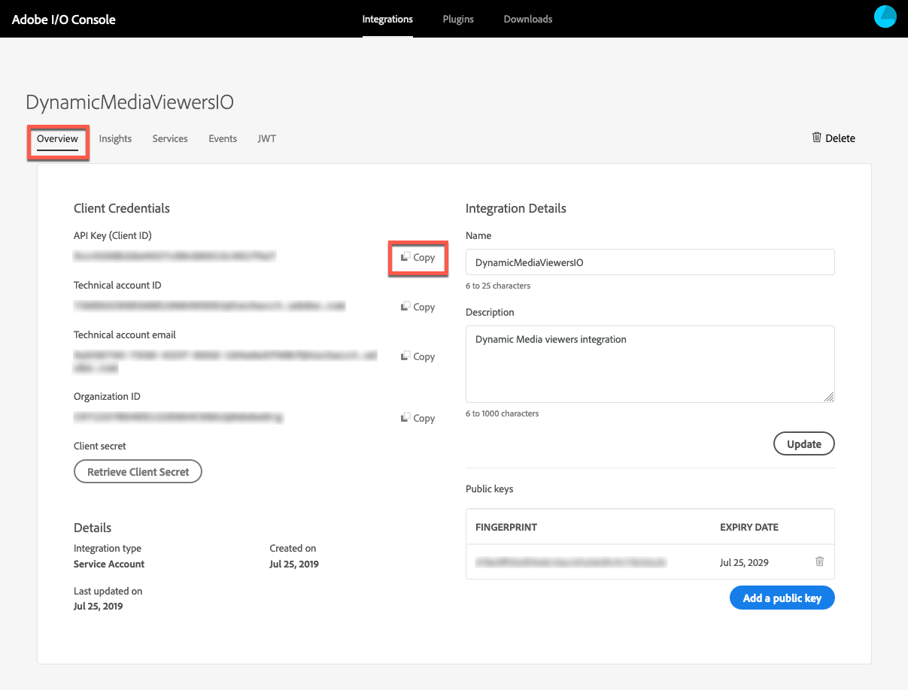

# Intégration des visionneuses Dynamic Media avec Adobe Analytics et l’Experience Platform Launch {#integrating-dynamic-media-viewers-with-adobe-analytics-and-adobe-launch}

## Qu’est-ce que l’intégration de Dynamic Media Viewers avec Adobe Analytics et l’Experience Platform Launch ? {#what-is-dynamic-media-viewers-integration-with-adobe-analytics-and-adobe-launch}

<!-- Leave this hidden path here; it points to the topic source from Sasha https://wiki.corp.adobe.com/pages/viewpage.action?spaceKey=~oufimtse&title=Dynamic+Media+Viewers+integration+with+Adobe+Launch -->

La nouvelle extension *Dynamic Media Viewers* pour les visionneuses de Platform launch et Dynamic Media 5.13 permet aux clients de Adobe Analytics et de Platform launch d’utiliser des événements et des données spécifiques aux visionneuses dans leur configuration de Platform launch.

Cette intégration signifie que vous pouvez suivre l’utilisation des visionneuses Dynamic Media sur votre site web avec Adobe Analytics. En même temps, vous pouvez utiliser les événements et les données exposés par les lecteurs avec toute autre extension de Platform launch provenant d’un Adobe ou d’un tiers.

Pour en savoir plus sur les extensions, voir [Extensions d’Adobe](https://experienceleague.adobe.com/docs/launch/using/extensions-ref/overview.html#adobe-extension) dans le Guide de l’utilisateur Experience Platform Launch.

**Cette rubrique est destinée aux administrateurs de** site, aux développeurs de la plateforme Adobe Experience Manager et aux personnes participant aux opérations.

### Restrictions de l’intégration {#limitations-of-the-integration}

* L’intégration d’Experience Platform Launch pour les visionneuses Dynamic Media ne fonctionne pas dans le noeud d’auteur du Experience Manager. Vous ne pouvez pas afficher de suivi à partir d’une page WCM tant qu’elle n’est pas publiée.
* L’intégration d’Experience Platform Launch pour les visionneuses Dynamic Media n’est pas prise en charge pour le mode de fonctionnement &quot;contextuel&quot;, où l’URL de la visionneuse est obtenue à l’aide du bouton &quot;URL&quot; sur la page Détails du fichier.
* L’intégration de l’Experience Platform Launch ne peut pas être utilisée simultanément avec l’intégration des visionneuses héritées Analytics (au moyen du paramètre `config2=`).
* La prise en charge du suivi vidéo se limite au suivi de la lecture principale uniquement, comme décrit dans [Présentation du suivi](https://experienceleague.adobe.com/docs/media-analytics/using/sdk-implement/track-av-playback/track-core-overview.html#player-events). En particulier, le suivi de la qualité de service, des publicités, des chapitres/segments et des erreurs n’est pas pris en charge.
* La configuration de la durée de stockage n’est pas prise en charge pour les éléments de données à l’aide de l’extension *Visionneuses Dynamic Media*. La durée de stockage doit être définie sur **[!UICONTROL Aucune]**.

### Cas d’utilisation de l’intégration {#use-cases-for-the-integration}

Le cas d’utilisation Principal pour l’intégration avec l’Experience Platform Launch concerne les clients qui utilisent à la fois les ressources des Experience Manager et les sites des Experience Manager. Dans de tels scénarios, vous pouvez configurer une intégration standard entre le noeud d’auteur Experience Manager et l’Experience Platform Launch, puis associer votre instance Sites à la propriété Experience Platform Launch. Ensuite, tout composant WCM Dynamic Media ajouté à une page Sites suit les données et les événements des visiteurs.

Voir [Suivi des visionneuses Dynamic Media sur les sites Experience Manager](#tracking-dynamic-media-viewers-in-aem-sites).

Un autre cas d’utilisation pris en charge par l’intégration est celui des clients qui utilisent uniquement les ressources du Experience Manager ou Dynamic Media Classic. Dans ce cas, vous obtenez le code intégré pour votre visionneuse et vous l’ajoutez à la page du site web. Ensuite, récupérez l’URL de production de la bibliothèque Experience Platform Launch auprès de l’Experience Platform Launch et ajoutez-la manuellement au code de page Web.

Voir [Suivi des visionneuses Dynamic Media à l’aide du code incorporé](#tracking-dynamic-media-viewers-using-embed-code).

## Fonctionnement du suivi des données et des événements dans l’intégration {#how-data-and-event-tracking-works-in-the-integration}

L’intégration tire parti de deux types distincts et indépendants de suivi des visionneuses Dynamic Media : *Adobe Analytics* et *Adobe Analytics for Audio and Video*.

### À propos du suivi à l’aide d’Adobe Analytics {#about-tracking-using-adobe-analytics}

Adobe Analytics vous permet d’effectuer le suivi des actions exécutées par l’utilisateur final lorsqu’il interagit avec les visionneuses Dynamic Media de votre site web. Adobe Analytics vous permet également d’effectuer le suivi des données propres à la visionneuse. Vous pouvez, par exemple, effectuer le suivi et enregistrer des événements de chargement de vue avec le nom de la ressource, les actions de zoom survenues et les actions de lecture vidéo.

En Experience Platform Launch, les concepts *Éléments de données* et *Règles* fonctionnent ensemble pour activer le suivi Adobe Analytics.

#### A propos des éléments de données dans l&#39;Experience Platform Launch {#about-data-elements-in-adobe-launch}

Un élément de données dans l’Experience Platform Launch est une propriété nommée dont la valeur est définie de manière statique ou calculée de manière dynamique en fonction de l’état d’une page Web ou des données des visionneuses Dynamic Media.

Les options disponibles pour une définition d’élément de données dépendent de la liste des extensions installées dans la propriété Experience Platform Launch. L’extension Core est préinstallée et prête à l’emploi dans n’importe quelle configuration. Cette extension &quot;Core&quot; permet de définir un élément de données dont la valeur provient du cookie, du code JavaScript, de la chaîne de requête et de nombreuses autres sources.

Pour le suivi Adobe Analytics, plusieurs autres extensions doivent être installées, comme décrit dans [Installation et configuration des extensions](#installing-and-setup-of-extensions). L’extension Visionneuses Dynamic Media permet de définir un élément de données qui est une valeur d’argument de l’événement Visionneuse dynamique. Par exemple, il est possible de référencer le type de visionneuse, ou le nom de fichier signalé par la visionneuse au chargement, le niveau de zoom signalé lorsque l’utilisateur final effectue un zoom et bien plus encore.

L’extension Dynamic Media Viewer actualise automatiquement les valeurs de ses éléments de données.

Une fois que vous l’avez défini, un élément de données peut être utilisé dans d’autres emplacements de l’interface utilisateur Experience Platform Launch, à l’aide du widget de sélecteur d’éléments de données. En particulier, les éléments de données définis aux fins du suivi des visionneuses Dynamic Media sont référencés par l’action Définir les variables de l’extension Adobe Analytics dans la règle (voir ci-dessous).

Voir [Éléments de données](https://experienceleague.adobe.com/docs/launch/using/reference/manage-resources/data-elements.html#reference) dans le Guide de l&#39;utilisateur Experience Platform Launch.

#### A propos des règles dans l’Experience Platform Launch {#about-rules-in-adobe-launch}

Une règle dans l’Experience Platform Launch est une configuration agnostique qui définit trois zones qui constituent une règle : *Événements*, *Conditions* et *Actions* :

* *Les événements*  (le cas échéant) indiquent à l’Experience Platform Launch quand déclencher une règle.
* *Conditions*  (le cas échéant) indiquent à l&#39;Experience Platform Launch quelles autres restrictions autoriser ou interdire lors du déclenchement d&#39;une règle.
* *Actions* (alors) indiquent à l’Experience Platform Launch ce qu’il faut faire lorsqu’une règle est déclenchée.

Les options disponibles dans la section Événements, conditions et actions dépendent des extensions installées dans la propriété Experience Platform Launch. L’extension *Core* est préinstallée et prête à l’emploi dans n’importe quelle configuration. L’extension propose plusieurs options pour les Événements, telles que les actions de base au niveau du navigateur, qui comprennent le changement de cible d’action, les touches de pression et les envois de formulaires. Elle comprend également des options pour les conditions, telles que la valeur du cookie, le type de navigateur, etc. Pour les actions, seule l’option Code personnalisé est disponible.

Pour le suivi Adobe Analytics, plusieurs autres extensions doivent être installées, comme décrit dans [Installation et configuration des extensions](#installing-and-setup-of-extensions). Plus précisément :

* L’extension Visionneuses Dynamic Media étend la liste des événements pris en charge aux événements spécifiques aux visionneuses Dynamic Media, tels que le chargement de la visionneuse, l’échange de ressources, le zoom avant et la lecture vidéo.
* L’extension Adobe Analytics étend la liste des actions prises en charge avec deux actions requises pour envoyer des données aux serveurs de suivi : *Définir des variables* et *Envoyer une balise*.

Pour effectuer le suivi des visionneuses Dynamic Media, il est possible d’utiliser n’importe quel type de contenu :

* Événements de l’extension Visionneuses Dynamic Media, de l’extension Core ou de toute autre extension.
* Conditions de la définition de règle. Vous pouvez également laisser la zone Conditions vide.

Dans la section Actions, vous devez disposer d’une action *Définir les variables*. Cette action indique à Adobe Analytics comment renseigner les variables de suivi avec des données. Parallèlement, l’action *Définir les variables* n’envoie rien au serveur de suivi.

L’action *Définir les variables* doit être suivie d’une action *Envoyer une balise*. L’action *Envoyer la balise* envoie en fait des données au serveur de suivi Analytics. Les deux actions, *Définir les variables* et *Envoyer une balise*, proviennent de l’extension Adobe Analytics.

Voir [Règles](https://experienceleague.adobe.com/docs/launch/using/reference/manage-resources/rules.html#reference) dans le Guide de l&#39;utilisateur Experience Platform Launch.

#### Exemple de configuration {#sample-configuration}

L’exemple de configuration suivant dans l’Experience Platform Launch montre comment effectuer le suivi d’un nom de fichier au chargement de la visionneuse.

1. Dans l’onglet **[!UICONTROL Éléments de données]**, définissez un élément de données `AssetName` qui référence le paramètre `asset` de l’événement `LOAD` à partir de l’extension Visionneuses Dynamic Media.

   

1. Dans l’onglet **[!UICONTROL Règles]**, définissez une règle *TrackAssetOnLoad*.

   Dans cette règle, le champ **[!UICONTROL Événement]** utilise l’événement **[!UICONTROL LOAD]** de l’extension Visionneuses Dynamic Media.

   

1. La configuration Action comporte deux types d’actions de l’extension Adobe Analytics :

   *Définissez des variables* qui mappent une variable Analytics de votre choix à la valeur de l’élément de données `AssetName`.

   *Envoyer une balise*, qui envoie les informations de suivi à Adobe Analytics.

   

1. La configuration de règle résultante ressemble à ce qui suit :

   

### À propos d’Adobe Analytics for Audio and Video {#about-adobe-analytics-for-audio-and-video}

Lorsqu’un compte Experience Cloud est abonné pour utiliser Adobe Analytics for Audio and Video, il suffit d’activer le suivi vidéo dans les paramètres d’extension *Visionneuses Dynamic Media*. Les mesures vidéo sont alors disponibles dans Adobe Analytics. Le suivi vidéo dépend de la présence de l’extension Adobe Media Analytics for Audio and Video.

Voir [Installation et configuration des extensions](#installing-and-setup-of-extensions).

À l’heure actuelle, la prise en charge du suivi vidéo se limite au suivi de la lecture principale uniquement, comme décrit dans [Présentation du suivi](https://experienceleague.adobe.com/docs/media-analytics/using/sdk-implement/track-av-playback/track-core-overview.html#player-events). En particulier, le suivi de la qualité de service, des publicités, des chapitres/segments et des erreurs n’est pas pris en charge.

## Utilisation de l’extension Visionneuses Dynamic Media {#using-the-dynamic-media-viewers-extension}

Comme mentionné dans [Cas d’utilisation pour l’intégration](#use-cases-for-the-integration), il est possible de suivre les visionneuses Dynamic Media avec la nouvelle intégration Experience Platform Launch dans les sites Experience Manager et en utilisant le code incorporé.

### Suivi des visionneuses Dynamic Media sur les sites Experience Manager {#tracking-dynamic-media-viewers-in-aem-sites}

Pour effectuer le suivi des visionneuses Dynamic Media sur les sites des Experience Manager, toutes les étapes répertoriées sous la section [Configuration de toutes les pièces d’intégration](#configuring-all-the-integration-pieces) doivent être effectuées. Plus précisément, vous devez créer la configuration IMS et la configuration Experience Platform Launch Cloud.

Une fois la configuration appropriée effectuée, toute visionneuse Dynamic Media que vous ajoutez à une page Sites, à l’aide d’un composant WCM pris en charge par Dynamic Media, effectue automatiquement le suivi des données vers Adobe Analytics ou Adobe Analytics for video, ou les deux.

Voir [Ajout de ressources Dynamic Media à des pages à l’aide d’Adobe Sites](/help/assets/dynamic-media/adding-dynamic-media-assets-to-pages.md).

### Suivi des visionneuses Dynamic Media à l’aide du code intégré {#tracking-dynamic-media-viewers-using-embed-code}

Les clients qui n’utilisent pas les sites Experience Manager ou n’incorporent pas les visionneuses Dynamic Media dans des pages Web en dehors des sites Experience Manager, ou les deux, peuvent toujours utiliser l’intégration Experience Platform Launch.

Suivez les étapes de configuration des sections [Configuration d&#39;Adobe Analytics](#configuring-adobe-analytics-for-the-integration) et [Configuration d&#39;Experience Platform Launch](#configuring-adobe-launch-for-the-integration). Toutefois, les étapes de configuration liées aux Experience Manager ne sont pas nécessaires.

Une fois la configuration appropriée effectuée, vous pouvez ajouter la prise en charge des Experience Platform Launch à une page Web à l’aide d’un lecteur Dynamic Media.

Voir [Ajouter le code incorporé Experience Platform Launch](https://experienceleague.adobe.com/docs/launch-learn/implementing-in-websites-with-launch/configure-launch/launch-add-embed.html#configure-launch) pour en savoir plus sur l’utilisation du code incorporé de bibliothèque Experience Platform Launch.

Pour en savoir plus sur l’utilisation de la fonction de code incorporé de Experience Manager Dynamic Media, voir [Incorporation de la visionneuse de vidéos ou d’images sur une page Web](/help/assets/dynamic-media/embed-code.md).

**Pour effectuer le suivi des visionneuses Dynamic Media à l’aide du code intégré**:

1. Préparez une page web sur laquelle vous voulez incorporer une visionneuse Dynamic Media.
1. Obtenez le code incorporé pour la bibliothèque Experience Platform Launch en vous connectant d’abord à l’Experience Platform Launch (voir [Configuration de l’Experience Platform Launch](#configuring-adobe-launch-for-the-integration)).
1. Cliquez sur **[!UICONTROL Propriété]**, puis sur l’onglet **[!UICONTROL Environnements]**.
1. Sélectionnez le niveau Environnement correspondant à l’environnement de la page web. Ensuite, dans la colonne **[!UICONTROL Installer]**, cliquez sur l’icône en forme de boîte.
1. **[!UICONTROL Dans la boîte de dialogue Web Install]** Instructions, copiez le code incorporé complet de la bibliothèque Experience Platform Launch, ainsi que les  `<script/>` balises qui l’entourent.

## Guide de référence de l’extension Visionneuses Dynamic Media {#reference-guide-for-the-dynamic-media-viewers-extension}

### À propos de la configuration des visionneuses Dynamic Media {#about-the-dynamic-media-viewers-configuration}

L’extension Dynamic Media Viewer s’intègre automatiquement à la bibliothèque Experience Platform Launch si les conditions suivantes sont réunies :

* L’objet global de la bibliothèque Experience Platform Launch ( `_satellite`) est présent sur la page.
* La fonction d’extension Visionneuses Dynamic Media `_dmviewers_v001()` est définie sur `_satellite`.

* Le paramètre de visionneuse `config2=` n’est pas spécifié, ce qui signifie qu’elle n’utilise pas l’intégration Analytics héritée.

Il existe également une option permettant de désactiver explicitement l’intégration des Experience Platform Launch dans la visionneuse en spécifiant le paramètre `launch=0` dans la configuration de la visionneuse. La valeur par défaut de ce paramètre est `1`.

### Configuration de l’extension Visionneuses Dynamic Media {#configuring-the-dynamic-media-viewers-extension}

La seule option de configuration de l’extension Visionneuses Dynamic Media est **[!UICONTROL Activer Adobe Media Analytics for Audio and Video]**.

Lorsque vous cochez (activez) cette option et que l’extension Adobes Medium Analytics pour l’audio et la vidéo est installée et configurée, les mesures de lecture vidéo sont envoyées à la solution Adobe Analytics for Audio and Video. La désactivation de cette option désactive le suivi vidéo.

Si vous activez cette option *sans* avoir installé l’extension Adobes Medium Analytics pour l’audio et la vidéo, elle n’a aucun effet.

### À propos des éléments de données dans l’extension Visionneuses Dynamic Media {#about-data-elements-in-the-dynamic-media-viewers-extension}

Le seul type d’élément de données fourni par l’extension Visionneuses Dynamic Media est **[!UICONTROL Événement de visionneuse]** dans la liste déroulante **[!UICONTROL Type d’élément de données]**.

Lorsqu’il est sélectionné, l’éditeur d’éléments de données génère un formulaire avec deux champs :

* **[!UICONTROL Type de données d’événement de visionneuses DM]** : liste déroulante qui identifie tous les événements de visionneuse pris en charge par l’extension Visionneuses Dynamic Media qui comportent des arguments, ainsi qu’un élément **[!UICONTROL COMMON]** spécial. Un élément **[!UICONTROL COMMON]** représente une liste de paramètres d’événement communs à tous les types d’événements envoyés par les visionneuses.
* **[!UICONTROL Paramètre de suivi]** : argument de l’événement de visionneuse Dynamic Media sélectionné.

Consultez le [guide de référence des visionneuses Dynamic Media](https://experienceleague.adobe.com/docs/dynamic-media-developer-resources/library/viewers-aem-assets-dmc/c-html5-s7-aem-asset-viewers.html) pour la liste des événements pris en charge par chaque type de visionneuse ; accédez à la section spécifique du lecteur, puis cliquez sur Prise en charge du suivi Adobe Analytics. À l’heure actuelle, le guide de référence des visionneuses Dynamic Media ne documente pas les arguments d’événement.

Examinons à présent le cycle de vie de l’*élément de données* Visionneuses Dynamic Media. La valeur de cet élément de données est renseignée après que l’événement de visionneuse Dynamic Media correspondant a lieu sur la page. Par exemple, supposons que l’élément de données pointe vers le événement **[!UICONTROL LOAD]** et son argument &quot;asset&quot;. La valeur de cet élément de données reçoit des données valides après la première exécution du événement LOAD par le lecteur. Si l’élément de données pointe vers le événement **[!UICONTROL ZOOM]** et son argument &quot;scale&quot;, la valeur de cet élément de données reste vide jusqu’à ce que le lecteur envoie un événement **[!UICONTROL ZOOM]** pour la première fois.

De même, les valeurs des éléments de données sont automatiquement mises à jour lorsque la visionneuse envoie un événement correspondant sur la page. La mise à jour de la valeur se produit même si l’événement particulier n’est pas spécifié dans la configuration de la règle. Supposons, par exemple, que l’élément de données **[!UICONTROL ZoomScale]** soit défini pour le paramètre &quot;scale&quot; du événement ZOOM. Cependant, la seule règle présente dans la configuration de la règle est déclenchée par le événement **[!UICONTROL LOAD]**. La valeur de **[!UICONTROL ZoomScale]** est toujours mise à jour chaque fois qu’un utilisateur effectue un zoom dans la visionneuse.

Toute visionneuse Dynamic Media possède un identifiant unique sur la page web. L’élément de données effectue le suivi de la valeur elle-même et de la visionneuse qui a renseigné la valeur. Par exemple, supposons qu’il y ait plusieurs visionneuses sur la même page et un élément de données **[!UICONTROL AssetName]** qui pointe vers le événement **[!UICONTROL LOAD]** et son argument &quot;asset&quot;. L’élément de données **[!UICONTROL AssetName]** conserve une collection de noms de fichier associés à chaque visionneuse chargée sur la page.

La valeur exacte renvoyée par l’élément de données dépend du contexte. Si l’élément de données est demandé dans une règle déclenchée par un événement de visionneuse Dynamic Media, la valeur de l’élément de données est renvoyée pour la visionneuse qui a lancé la règle. De plus, l’élément de données est demandé dans une règle qui a été déclenchée par un Événement provenant d’une autre extension de Platform launch. À ce stade, la valeur de l’élément de données provient de la dernière visionneuse à mettre à jour cet élément de données.

**Examinez l’exemple de configuration** suivant :

* Page Web contenant deux visionneuses de zoom Dynamic Media : *viewer1* et *viewer2*.

* L’élément de données **[!UICONTROL ZoomScale]** pointe sur l’événement **[!UICONTROL ZOOM]** et son argument « scale ».
* Règle **[!UICONTROL TrackPan]** avec ce qui suit :

   * Utilise l’événement **[!UICONTROL PAN]** de la visionneuse Dynamic Media comme déclencheur.
   * Envoie la valeur de l’élément de données **[!UICONTROL ZoomScale]** à Adobe Analytics.

* Règle **[!UICONTROL TrackKey]** avec ce qui suit :

   * Utilise le événement de touche de l’extension Core Experience Platform Launch comme déclencheur.
   * Envoie la valeur de l’élément de données **[!UICONTROL ZoomScale]** à Adobe Analytics.

Supposons maintenant que l’utilisateur final charge la page web avec les deux visionneuses. Dans la *visionneuse1*, il effectue un zoom avant à une échelle de 50 % ; ensuite, dans la *visionneuse2*, il effectue un zoom avant à une échelle de 25 %. Dans la *visionneuse1*, il effectue un panoramique sur l’image et appuie sur une touche du clavier.

L’activité de l’utilisateur final génère les deux appels de suivi suivants vers Adobe Analytics :

* Le premier appel se produit, car la règle **[!UICONTROL TrackPan]** est déclenchée lorsque l’utilisateur effectue un panoramique dans la *visionneuse1*. Cet appel envoie 50 % sous la forme d’une valeur **[!UICONTROL Elément de données ZoomScale]** car l’élément de données sait que la règle est déclenchée par *viewer1* et récupère la valeur d’échelle correspondante ;
* Le second appel se produit, car la règle **[!UICONTROL TrackKey]** est déclenchée lorsque l’utilisateur appuie sur une touche du clavier. Cet appel envoie 25 % en tant que valeur de l’élément de données **[!UICONTROL ZoomScale]**, car la règle n’a pas été déclenchée par la visionneuse. L’élément de données renvoie donc la valeur la plus récente.

L’exemple de configuration ci-dessus affecte également la durée de vie de la valeur de l’élément de données. La valeur de l’élément de données géré par Dynamic Media Viewer est stockée dans le code de bibliothèque de l’Experience Platform Launch, même après la suppression du lecteur sur la page Web. Cette fonctionnalité signifie que si une règle est déclenchée par une extension de lecteur non Dynamic Media et qu’elle fait référence à un tel élément de données, l’élément de données renvoie la dernière valeur connue. Même si le lecteur n’est plus présent sur la page Web.

Dans tous les cas, les valeurs des éléments de données pilotées par les visionneuses Dynamic Media ne sont pas stockées sur l’enregistrement local ou sur le serveur ; ils sont conservés uniquement dans la bibliothèque Experience Platform Launch côté client. Les valeurs de cet élément de données disparaissent lors du rechargement de la page web.

En règle générale, l’éditeur d’éléments de données prend en charge la [sélection de la durée de stockage](https://experienceleague.adobe.com/docs/launch/using/reference/manage-resources/data-elements.html?lang=en#create-a-data-element). Cependant, les éléments de données qui utilisent l’extension Dynamic Media Viewers ne prennent en charge que l’option de durée d’enregistrement de **[!UICONTROL Aucun]**. La définition d’une autre valeur est possible dans l’interface utilisateur, mais le comportement de l’élément de données n’est pas défini dans ce cas. L’extension gère elle-même la valeur de l’élément de données qui conserve la valeur de l’argument d’événement de visionneuse pendant tout le cycle de vie de la visionneuse.

### À propos des règles dans l’extension Visionneuses Dynamic Media {#about-rules-in-the-dynamic-media-viewers-extension}

Dans l’éditeur de règles, l’extension ajoute de nouvelles options de configuration pour l’éditeur d’événements. L’éditeur propose également une option permettant de référencer manuellement les paramètres de événement dans l’éditeur d’actions en tant qu’option à main levée au lieu d’utiliser des éléments de données préconfigurés.

#### À propos de l’éditeur d’événements {#about-the-events-editor}

Dans l’éditeur de Événements, l’extension Dynamic Media Viewers ajoute un **[!UICONTROL Type d&#39;événement]** appelé **[!UICONTROL Événement du lecteur]**.

Lorsqu’il est sélectionné, l’éditeur d’événements effectue le rendu du menu déroulant **[!UICONTROL Événements de visionneuse Dynamic Media]**, répertoriant tous les événements disponibles pris en charge par les visionneuses Dynamic Media.

#### À propos de l’éditeur d’actions {#about-the-actions-editor}

L’extension Visionneuses Dynamic Media vous permet d’utiliser les paramètres d’événement des visionneuses Dynamic Media pour mapper les variables Analytics dans l’éditeur Définir les variables de l’extension Adobe Analytics.

La méthode la plus simple consiste à effectuer le processus en deux étapes :

* Tout d’abord, définissez un ou plusieurs éléments de données, où chaque élément de données représente un paramètre d’un événement Visionneuse Dynamic Media.
* Enfin, dans l’éditeur Définir les variables de l’extension Adobe Analytics, cliquez sur l’icône du sélecteur d’éléments de données (sous forme de trois disques empilés) pour ouvrir la boîte de dialogue Sélectionner un élément de données, puis sélectionnez un élément de données à partir de celle-ci.

Il est toutefois possible d’utiliser une autre approche et d’éviter la création d’un élément de données. Vous pouvez référencer directement un argument à partir d’un événement Dynamic Media Viewer. Entrez le nom complet de l’argument événement dans le champ d’entrée **[!UICONTROL value]** de l’affectation de variable Analytics. Veillez à entourer les signes de pourcentage (%). Par exemple :

`%event.detail.dm.LOAD.asset%`

Il existe une différence importante entre l’utilisation des éléments de données et la référence des arguments de événement direct. Pour l’élément de données, peu importe quel événement déclenche l’action Définir des variables. Le événement qui déclenche la règle peut être sans rapport avec la visionneuse dynamique (comme cliquer sur la page Web dans l’extension principale). Cependant, lorsque vous utilisez une référence directe à un argument, il est important de s’assurer que l’événement qui déclenche la règle correspond à l’argument d’événement auquel il fait référence.

Par exemple, la référence à `%event.detail.dm.LOAD.asset%` renvoie le nom de ressource correct si la règle est déclenchée par l’événement **[!UICONTROL LOAD]** de l’extension Visionneuse Dynamic Media. Cependant, elle renvoie une valeur vide pour tout autre événement.

Le tableau suivant répertorie les événements de visionneuse Dynamic Media et leurs arguments pris en charge :

<table>
 <tbody>
  <tr>
   <td>Nom de l’événement de visionneuse</td>
   <td>Référence de l’argument</td>
  </tr>
  <tr>
   <td><code>COMMON</code></td>
   <td><code>%event.detail.dm.objID%</code></td>
  </tr>
  <tr>
   <td> </td>
   <td><code>%event.detail.dm.compClass%</code></td>
  </tr>
  <tr>
   <td> </td>
   <td><code>%event.detail.dm.instName%</code></td>
  </tr>
  <tr>
   <td> </td>
   <td><code>%event.detail.dm.timeStamp%</code></td>
  </tr>
  <tr>
   <td><code>BANNER</code> </td>
   <td><code>%event.detail.dm.BANNER.asset%</code></td>
  </tr>
  <tr>
   <td> </td>
   <td><code>%event.detail.dm.BANNER.frame%</code></td>
  </tr>
  <tr>
   <td> </td>
   <td><code>%event.detail.dm.BANNER.label%</code></td>
  </tr>
  <tr>
   <td><code>HREF</code></td>
   <td><code>%event.detail.dm.HREF.rollover%</code></td>
  </tr>
  <tr>
   <td><code>ITEM</code></td>
   <td><code>%event.detail.dm.ITEM.rollover%</code></td>
  </tr>
  <tr>
   <td><code>LOAD</code></td>
   <td><code>%event.detail.dm.LOAD.applicationname%</code></td>
  </tr>
  <tr>
   <td><strong> </strong></td>
   <td><code>%event.detail.dm.LOAD.asset%</code></td>
  </tr>
  <tr>
   <td><strong> </strong></td>
   <td><code>%event.detail.dm.LOAD.company%</code></td>
  </tr>
  <tr>
   <td><strong> </strong></td>
   <td><code>%event.detail.dm.LOAD.sdkversion%</code></td>
  </tr>
  <tr>
   <td><strong> </strong></td>
   <td><code>%event.detail.dm.LOAD.viewertype%</code></td>
  </tr>
  <tr>
   <td><strong> </strong></td>
   <td><code>%event.detail.dm.LOAD.viewerversion%</code></td>
  </tr>
  <tr>
   <td><code>METADATA</code></td>
   <td><code>%event.detail.dm.METADATA.length%</code></td>
  </tr>
  <tr>
   <td> </td>
   <td><code>%event.detail.dm.METADATA.type%</code></td>
  </tr>
  <tr>
   <td><code>MILESTONE</code></td>
   <td><code>%event.detail.dm.MILESTONE.milestone%</code></td>
  </tr>
  <tr>
   <td><code>PAGE</code></td>
   <td><code>%event.detail.dm.PAGE.frame%</code></td>
  </tr>
  <tr>
   <td> </td>
   <td><code>%event.detail.dm.PAGE.label%</code></td>
  </tr>
  <tr>
   <td><code>PAUSE</code></td>
   <td><code>%event.detail.dm.PAUSE.timestamp%</code></td>
  </tr>
  <tr>
   <td><code>PLAY</code></td>
   <td><code>%event.detail.dm.PLAY.timestamp%</code></td>
  </tr>
  <tr>
   <td><code>SPIN</code></td>
   <td><code>%event.detail.dm.SPIN.framenumber%</code></td>
  </tr>
  <tr>
   <td><code>STOP</code></td>
   <td><code>%event.detail.dm.STOP.timestamp%</code></td>
  </tr>
  <tr>
   <td><code>SWAP</code></td>
   <td><code>%event.detail.dm.SWAP.asset%</code></td>
  </tr>
  <tr>
   <td><code>SWATCH</code></td>
   <td><code>%event.detail.dm.SWATCH.frame%</code></td>
  </tr>
  <tr>
   <td> </td>
   <td><code>%event.detail.dm.SWATCH.label%</code></td>
  </tr>
  <tr>
   <td><code>TARG</code></td>
   <td><code>%event.detail.dm.TARG.frame%</code></td>
  </tr>
  <tr>
   <td> </td>
   <td><code>%event.detail.dm.TARG.label%</code></td>
  </tr>
  <tr>
   <td><code>ZOOM</code></td>
   <td><code>%event.detail.dm.ZOOM.scale%</code></td>
  </tr>
 </tbody>
</table>

## Configuration de tous les composants d’intégration {#configuring-all-the-integration-pieces}

**AVANT DE COMMENCER**

Adobe vous recommande de passer en revue l’ensemble de la documentation avant cette section afin de comprendre l’intégration complète.

Cette section décrit les étapes de configuration nécessaires pour intégrer des visionneuses Dynamic Media à Adobe Analytics et Adobe Analytics for Audio and Video. Bien que l’utilisation de l’extension Dynamic Media Viewers à d’autres fins dans l’Experience Platform Launch soit possible, de tels scénarios ne sont pas abordés dans cette documentation.

Vous allez utiliser les produits d’Adobe suivants pour configurer votre intégration :

* Adobe Analytics - utilisé pour configurer les variables et les rapports de suivi.
* Experience Platform Launch : utilisé pour définir une propriété, une ou plusieurs règles et un ou plusieurs éléments de données pour activer le suivi de la visionneuse.

En outre, si cette solution d&#39;intégration est utilisée avec les sites Experience Manager, la configuration suivante doit être effectuée :

* Adobe I/O Console - l&#39;intégration est créée pour l&#39;Experience Platform Launch.
* Noeud d’auteur Experience Manager - Configuration IMS et configuration de cloud Experience Platform Launch.

Dans le cadre de la configuration, veillez à avoir accès à une société de Adobe Experience Cloud dans laquelle Adobe Analytics et l’Experience Platform Launch sont déjà activés.

## Configuration d’Adobe Analytics pour l’intégration {#configuring-adobe-analytics-for-the-integration}

Une fois Adobe Analytics configuré, les éléments suivants sont configurés pour l’intégration :

* Une suite de rapports est en place et sélectionnée.
* Les variables Analytics sont disponibles pour recevoir les données de suivi.
* Les rapports sont disponibles pour afficher les données collectées dans Adobe Analytics.

Voir aussi le [Guide de mise en œuvre d’Analytics](https://experienceleague.adobe.com/docs/analytics/implementation/home.html).

**Pour configurer Adobe Analytics en vue de l’intégration** :

1. Commencez par accéder à Adobe Analytics à partir de la [page d’accueil](https://exc-home.experiencecloud.adobe.com/exc-home/home.html#/) d’Experience Cloud. Dans la barre de menus, cliquez sur l’icône Solutions (un tableau de trois points par trois) près du coin supérieur droit de la page, puis cliquez sur **[!UICONTROL Analytics]**.

   

   Sélectionnez maintenant une suite de rapports.

### Sélection d’une suite de rapports {#selecting-a-report-suite}

1. Près du coin supérieur droit de la page Adobe Analytics, à droite du champ **[!UICONTROL Rechercher des rapports]**, sélectionnez la suite de rapports appropriée dans la liste déroulante. Si plusieurs suites de rapports sont disponibles et que vous ne savez pas laquelle utiliser, contactez votre administrateur Adobe Analytics qui peut vous aider à sélectionner la suite de rapports adaptée.

   Dans l’illustration ci-dessous, un utilisateur a créé une suite de rapports nommée *DynamicMediaViewersExtensionDoc* et l’a sélectionnée dans la liste déroulante. Le nom de la suite de rapports est fourni à titre indicatif uniquement. Le nom de la suite de rapports que vous sélectionnez en fin de compte dépend de vous.

   Si aucune suite de rapports n’est disponible, votre administrateur Adobe Analytics ou vous-même devez en créer une avant de poursuivre la configuration.

   Voir [Rapports et suites de rapports](https://experienceleague.adobe.com/docs/analytics/admin/manage-report-suites/report-suites-admin.html#manage-report-suites) et [Création d’une suite de rapports](https://experienceleague.adobe.com/docs/analytics/admin/admin-console/create-report-suite.html#admin-console).

   Dans Adobe Analytics, les suites de rapports sont gérées sous **[!UICONTROL Admin > Suites de rapports]**.

   

   Configurez maintenant les variables Adobe Analytics.

### Configuration des variables Adobe Analytics {#setting-up-adobe-analytics-variables}

1. Désignez une ou plusieurs variables Adobe Analytics que vous souhaitez utiliser pour effectuer le suivi du comportement des visionneuses Dynamic Media sur la page Web.

   Il est possible d’utiliser n’importe quel type de variable pris en charge par Adobe Analytics. La décision concernant le type de variable (comme Trafic personnalisé [props], Conversion [eVar]) est fonction des besoins spécifiques de votre implémentation Analytics.

   Voir [Présentation de props et eVar](https://experienceleague.adobe.com/docs/analytics/implementation/vars/page-vars/evar.html#vars).

   Aux fins de cette documentation, seule une variable Trafic personnalisé (props) sera utilisée, car elle sera disponible dans un rapport Analytics quelques minutes après qu’une action a eu lieu sur une page Web.

   Pour activer une nouvelle variable de trafic personnalisé, dans Adobe Analytics, sur la barre d’outils, cliquez sur **[!UICONTROL Admin > Suites de rapports]**.

1. Sur la page **[!UICONTROL Gestionnaire de Report Suites]**, sélectionnez le rapport approprié, puis sur la barre d’outils, cliquez sur **[!UICONTROL Modifier les paramètres > Trafic > Variables de trafic]**.
1. Sélectionnez une variable inutilisée, donnez-lui un nom descriptif ( **[!UICONTROL Fichier de visionneuse (prop 30)]**) et remplacez la zone de liste déroulante par &quot;Activé&quot; dans la colonne Activé.

   La capture d’écran suivante est un exemple de variable Trafic personnalisé ( **[!UICONTROL prop30]**) pour le suivi d’un nom de fichier utilisé par le lecteur de contenu :

   

1. Au bas de la liste des variables, cliquez sur **[!UICONTROL Enregistrer]**.

### Configuration d’un rapport {#setting-up-a-report}

1. En règle générale, la configuration d’un rapport dans Adobe Analytics dépend des besoins spécifiques au projet. La configuration détaillée des rapports dépasse donc le cadre de cette intégration.

   Il suffit toutefois de savoir que les rapports Trafic personnalisé deviennent automatiquement disponibles dans Adobe Analytics après avoir configuré les variables Trafic personnalisé dans **[Configuration des variables Adobe Analytics](#setting-up-adobe-analytics-variables)**.

   Par exemple, le rapport pour la variable **[!UICONTROL Ressource de visionneuse (prop 30)]** est disponible dans le menu Rapports sous **[!UICONTROL Trafic personnalisé > Trafic personnalisé 21-30 > Ressource de visionneuse (prop 30)]**.

   La consultation de ce rapport juste après la création de **[!UICONTROL Ressource de visionneuse (prop 30)]** ne montre aucune donnée ; c’est ce qui est attendu à ce stade de l’intégration.

   

## Configuration de l’Experience Platform Launch pour l’intégration {#configuring-adobe-launch-for-the-integration}

Une fois l’Experience Platform Launch configuré, les éléments suivants seront configurés pour l’intégration :

* Création d’une propriété pour conserver toutes vos configurations ensemble.
* Installation et configuration des extensions. Le code client de toutes les extensions installées dans la propriété est compilé dans une bibliothèque. Cette bibliothèque sera utilisée ultérieurement par la page web.
* Configuration des éléments de données et des règles. Cette configuration définit les données à capturer à partir des visionneuses Dynamic Media, le moment où déclencher la logique de suivi, ainsi que l’endroit où envoyer les données de la visionneuse dans Adobe Analytics.
* Publication de la bibliothèque.

**Pour configurer l’Experience Platform Launch pour l’intégration** :

1. Début en accédant à Experience Platform Launch à partir de l&#39;Experience Cloud [page d&#39;accueil](https://exc-home.experiencecloud.adobe.com/exc-home/home.html#/). Dans la barre de menus, cliquez sur l’icône Solutions (un tableau de trois points par trois) près du coin supérieur droit de la page, puis cliquez sur **[!UICONTROL Launch]**.

   Vous pouvez également [ouvrir directement l’Experience Platform Launch](https://launch.adobe.com/).

   

### Création d’une propriété dans l’Experience Platform Launch {#creating-a-property-in-adobe-launch}

Une propriété dans l’Experience Platform Launch est une configuration nommée qui maintient tous vos paramètres ensemble. Une bibliothèque des paramètres de configuration est générée et publiée à différents niveaux d’environnement (développement, évaluation et production).

Voir aussi [Créer une propriété Launch](https://experienceleague.adobe.com/docs/launch-learn/implementing-in-mobile-android-apps-with-launch/configure-launch/launch-create-a-property.html#configure-launch).

1. Dans l’Experience Platform Launch, cliquez sur **[!UICONTROL Nouvelle propriété]**.
1. Dans la boîte de dialogue **[!UICONTROL Créer une propriété]**, dans le champ **[!UICONTROL Nom]**, saisissez un nom descriptif, tel que le titre de votre site web. Par exemple, `DynamicMediaViewersProp.`
1. Dans le champ **[!UICONTROL Domaines]**, saisissez le domaine de votre site web.
1. Dans la liste déroulante **[!UICONTROL Options avancées]**, activez **[!UICONTROL Configurer pour le développement d’extensions (ne peut pas être modifié plus tard)]** au cas où l’extension que vous souhaitez utiliser (dans ce cas, *Visionneuses Dynamic Media*) n’est pas encore disponible.

   

1. Cliquez sur **[!UICONTROL Enregistrer]**.

   Cliquez sur la propriété nouvellement créée, puis passez à *Installation et configuration des extensions*.

### Installation et configuration des extensions {#installing-and-setup-of-extensions}

Toutes les extensions disponibles dans l’Experience Platform Launch sont répertoriées sous **[!UICONTROL Extensions > Catalogue]**.

Pour installer une extension, cliquez sur **[!UICONTROL Installer]**. Si nécessaire, réalisez une configuration d’extension ponctuelle, puis cliquez sur **[!UICONTROL Enregistrer]**.

Le cas échéant, les extensions suivantes doivent être installées et configurées :

* (Obligatoire) Extension *Experience Cloud ID Service*

Aucune configuration supplémentaire n’est nécessaire, acceptez les valeurs proposées. Lorsque vous avez terminé, veillez à cliquer sur **[!UICONTROL Enregistrer]**.

Voir [Extension Experience Cloud ID Service](https://experienceleague.adobe.com/docs/launch/using/extensions-ref/adobe-extension/id-service-extension/overview.html#extensions-ref).

* (Obligatoire) Extension *Adobe Analytics*

Pour configurer cette extension, vous devez disposer de l’identifiant de suite de rapports présent dans Adobe Analytics, sous **[!UICONTROL Admin > Report Suite]**, sous l’en-tête de colonne **[!UICONTROL Identifiant de suite de rapports]**.

(À des fins de démonstration uniquement, l’identifiant de suite de rapports de la suite de rapports **[!UICONTROL DynamicMediaViewersExtensionDoc]** est utilisé dans les captures d’écran suivantes. Cet identifiant a été créé et utilisé dans [Sélection d’une suite de rapports](#selecting-a-report-suite) précédemment.)

Sur la page Installer l’extension, saisissez l’identifiant de suite de rapports dans le champ **[!UICONTROL Suites de rapports de développement]**, le champ **[!UICONTROL Suites de rapports d’évaluation]** et le champ **[!UICONTROL Suites de rapport de production]**.

*Configurez l’élément suivant uniquement si vous prévoyez d’utiliser le suivi vidéo :*

Sur la page **[!UICONTROL Installer l’extension]**, développez **[!UICONTROL Général]**, puis spécifiez le serveur de suivi. Le serveur de suivi suit le modèle `<trackingNamespace>.sc.omtrdc.net`, où `<trackingNamespace>` représente les informations obtenues dans l’e-mail de mise en service.

Cliquez sur **[!UICONTROL Enregistrer]**.

Voir [Extension Adobe Analytics](https://experienceleague.adobe.com/docs/launch/using/extensions-ref/adobe-extension/analytics-extension/overview.html#extensions-ref).

* (Facultatif ; obligatoire uniquement si le suivi vidéo est nécessaire) *Adobe Media Analytics for Audio and Video*

Renseignez le champ Serveur de suivi. Le serveur de suivi pour l’extension *Adobe Media Analytics for Audio and Video* est différent du serveur de suivi utilisé pour Adobe Analytics. Il suit le modèle `<trackingNamespace>.hb.omtrdc.net`, où `<trackingNamespace>` représente les informations provenant de l’e-mail de mise en service.

Tous les autres champs sont facultatifs.

Voir [Adobe Media Analytics for Audio and Video](https://experienceleague.adobe.com/docs/launch/using/extensions-ref/adobe-extension/media-analytics-extension/overview.html#extensions-ref).

* (Obligatoire) Extension *Visionneuses Dynamic Media*

Sélectionnez **[!UICONTROL Activer Adobe Analytics for Video]** pour activer le suivi Video Heartbeat.

Au moment de la rédaction de cet article, l’extension *Dynamic Media Viewers* n’est disponible que si la propriété Experience Platform Launch est créée pour le développement.

Voir [Création d’une propriété dans Experience Platform Launch](#creating-a-property-in-adobe-launch).

Une fois les extensions installées et configurées, au minimum, les cinq extensions suivantes (quatre si vous n’effectuez pas le suivi vidéo) seront répertoriées dans la zone Extensions > Installées.

### Configuration des éléments de données et des règles {#setting-up-data-elements-and-rules}

Dans l’Experience Platform Launch, créez les éléments de données et les règles nécessaires au suivi des visionneuses Dynamic Media.

Voir [Fonctionnement du suivi des données et des événements dans l’intégration](#how-data-and-event-tracking-works-in-the-integration) pour une présentation du suivi avec l’Experience Platform Launch.

Voir [Exemple de configuration](#sample-configuration) pour un exemple de configuration dans l’Experience Platform Launch qui montre comment effectuer le suivi d’un nom de fichier au chargement de la visionneuse.

Voir [Configuration de l’extension Visionneuses Dynamic Media](#configuring-the-dynamic-media-viewers-extension) pour en savoir plus sur les fonctionnalités de l’extension.

### Publication d’une bibliothèque {#publishing-a-library}

Pour modifier la configuration de l’Experience Platform Launch (y compris la propriété, les extensions, les règles et les éléments de données configurés), vous devez *publier* ces modifications. La publication dans l’Experience Platform Launch est effectuée à partir de l’onglet Publication sous la configuration des propriétés.

Le platform launch peut avoir plusieurs environnements de développement, un environnement intermédiaire et un environnement de production. Par défaut, la configuration de Platform launch Cloud dans le Experience Manager pointe le noeud d’auteur du Experience Manager vers l’environnement d’étape du Platform launch. Le noeud de publication du Experience Manager pointe vers l’environnement de production du Platform launch. Cette disposition signifie qu’avec les paramètres de Experience Manager par défaut, il est nécessaire de publier la bibliothèque de Platform launchs dans l’environnement d’évaluation. Cela vous permet de l’utiliser dans l’auteur Experience Manager. Vous pouvez ensuite le publier dans l’environnement de production afin de pouvoir l’utiliser dans la publication Experience Manager.

Voir [Environnements](https://experienceleague.adobe.com/docs/launch/using/reference/publish/environments/environments.html#environment-types) pour plus d&#39;informations sur les environnements Experience Platform Launch.

La publication d’une bibliothèque implique les deux étapes suivantes :

* Ajout et création d’une bibliothèque en incluant toutes les modifications nécessaires (nouvelles et mises à jour) dans la bibliothèque.
* Déplacement de la bibliothèque vers les différents niveaux d’environnement (du développement à l’évaluation et à la production).

#### Ajout et création d’une bibliothèque {#adding-and-building-a-new-library}

1. La première fois que vous ouvrez l’onglet Publication dans l’Experience Platform Launch, la liste de bibliothèque est vide.

   Dans la colonne de gauche, cliquez sur **[!UICONTROL Ajouter une nouvelle bibliothèque]**.

   

1. Sur la page Créer une bibliothèque, dans le champ **[!UICONTROL Nom]**, saisissez un nom descriptif pour la nouvelle bibliothèque. Par exemple :

   *DynamicMediaViewersLib*

   Dans la liste déroulante Environnement, sélectionnez le niveau Environment. Au départ, seul le niveau Développement est disponible pour la sélection. Près du coin inférieur gauche de la page, cliquez sur **[!UICONTROL Ajouter toutes les ressources modifiées]**.

   

1. Dans le coin supérieur droit de la page, cliquez sur **[!UICONTROL Enregistrer et créer pour développement]**.

   En quelques minutes, la bibliothèque est créée et prête à être utilisée.

   

   >[!NOTE]
   >
   >La prochaine fois que vous changerez la configuration de votre Experience Platform Launch, accédez à l&#39;onglet **[!UICONTROL Publication]** sous la configuration **[!UICONTROL Propriété]**, puis cliquez sur votre bibliothèque créée précédemment.
   >
   >
   >Dans l’écran de publication de la bibliothèque, cliquez sur **[!UICONTROL Ajouter toutes les ressources modifiées]**, puis sur **[!UICONTROL Enregistrer et créer pour développement]**.

#### Déplacement d’une bibliothèque vers les niveaux d’environnement {#moving-a-library-up-through-environment-levels}

1. Une fois une nouvelle bibliothèque ajoutée, elle se trouve dans l’environnement de développement. Pour la déplacer au niveau de l’environnement d’évaluation (qui correspond à la colonne Envoyé), dans le menu déroulant de la bibliothèque, cliquez sur **[!UICONTROL Envoyer pour approbation]**.

   

1. Dans la boîte de dialogue de confirmation, cliquez sur **[!UICONTROL Envoyer]**.

   Une fois la bibliothèque déplacée vers la colonne Envoyé, dans le menu déroulant de la bibliothèque, cliquez sur **[!UICONTROL Créer pour l’évaluation]**.

   

1. Pour déplacer la bibliothèque de l’environnement d’évaluation vers l’environnement de production (c’est-à-dire la colonne Publié), suivez un processus similaire.

   Tout d’abord, dans le menu déroulant, cliquez sur **[!UICONTROL Approuver pour publication]**.

   

1. Dans le menu déroulant, cliquez sur **[!UICONTROL Créer et publier en production]**.

   

   Voir [Publication](https://experienceleague.adobe.com/docs/launch/using/reference/publish/overview.html#reference) pour plus d’informations sur le processus de publication dans l’Experience Platform Launch.

## Configuration d’Adobe Experience Manager pour l’intégration {#configuring-adobe-experience-manager-for-the-integration}

<!-- Prerequisites list below should be verified by Sasha -->

Conditions préalables :

* Le Experience Manager exécute à la fois les instances d’auteur et de publication.
* Le noeud d’auteur Experience Manager est configuré dans Dynamic Media. <!-- Scene7 run mode (dynamicmedia_s7) -->
* Les composants Dynamic Media WCM sont activés dans les sites Experience Manager.

La configuration du Experience Manager comprend les deux étapes principales suivantes :

* Configuration du système IMS Experience Manager.
* Configuration d’Experience Platform Launch Cloud.

### Configuration du Experience Manager IMS {#configuring-aem-ims}

1. Dans l’auteur du Experience Manager, cliquez sur l’icône Outils (marteau), puis sur **[!UICONTROL Sécurité > Configurations IMS de l’Adobe]**.

   

1. Sur la page Configuration d’Adobe IMC, près du coin supérieur gauche, cliquez sur **[!UICONTROL Créer]**.
1. Sur la page **[!UICONTROL Configuration du compte technique IMS Adobe]**, dans la liste déroulante **[!UICONTROL Solution cloud]**, cliquez sur **[!UICONTROL Experience Platform Launch]**.
1. Activez **[!UICONTROL Créer un certificat]**, puis, dans le champ de texte, entrez une valeur pertinente pour votre certificat. Par exemple, *AdobeLaunchIMSCert*. Cliquez sur **[!UICONTROL Créer un certificat]**.

   Le message d’informations suivant s’affiche :

   *Pour récupérer un jeton d&#39;accès valide, la clé publique du nouveau certificat doit être ajoutée au compte technique sur Adobe I/O !*

   Pour fermer la boîte de dialogue Infos, cliquez sur **[!UICONTROL OK]**.

   

1. Cliquez sur **[!UICONTROL Télécharger la clé publique]** pour télécharger un fichier de clé publique (`*.crt`) sur votre système local.

   >[!NOTE]
   >
   >À ce stade, ***laissez ouverte*** la page **[!UICONTROL Configuration du compte technique Adobe IMS]** ; ***ne fermez pas*** la page et ***ne cliquez pas*** sur Suivant. Vous allez revenir à cette page plus loin dans les étapes.

   

1. Dans un nouvel onglet du navigateur, accédez à la [Console Adobe I/O](https://console.adobe.io/integrations).

1. Sur la page **[!UICONTROL Intégrations de la console Adobe I/O]**, près du coin supérieur droit, cliquez sur **[!UICONTROL Nouvelle intégration]**.
1. Dans la boîte de dialogue **[!UICONTROL Créer une intégration]** Créer une intégration, vérifiez que le bouton radio **[!UICONTROL Accès à une API]** est sélectionné, puis cliquez sur **[!UICONTROL Continuer]**.

   

1. Sur la deuxième page **[!UICONTROL Créer une intégration]**, activez le bouton radio **[!UICONTROL API Experience Platform Launch API]**. Dans le coin inférieur droit de la page, cliquez sur **[!UICONTROL Continuer]**.

   

1. Sur la troisième page **[!UICONTROL Créer une intégration]**, procédez comme suit :

   * Dans le champ **[!UICONTROL Nom]**, saisissez un nom explicite. Par exemple, *DynamicMediaViewersIO*.

   * Dans le champ **[!UICONTROL Description]**, saisissez la description de l’intégration.

   * Dans la zone **[!UICONTROL Certificats de clé publique]**, chargez votre fichier de clé publique (`*.crt`) que vous avez précédemment téléchargé au cours de ces étapes.

   * Sous l’en-tête **[!UICONTROL Sélectionner un rôle pour l’API Experience Platform Launch]**, sélectionnez **[!UICONTROL Admin]**.

   * Sous l’en-tête **[!UICONTROL Sélectionner un ou plusieurs profils de produit pour l’API Experience Platform Launch]**, sélectionnez le profil de produit appelé **[!UICONTROL Launch - &lt;nom_de_votre_société>]**.

   

1. Cliquez sur **[!UICONTROL Créer une intégration]**.
1. Sur la page **[!UICONTROL Intégration créée]**, cliquez sur **[!UICONTROL Continuer vers les informations concernant l’intégration]**.

   

1. Une page Informations concernant l’intégration s’affiche, comme suit :

   >[!NOTE]
   >
   >***Laissez ouverte cette page Informations concernant l’intégration***. Vous aurez besoin de divers éléments d&#39;information des onglets **[!UICONTROL Aperçu]** et **[!UICONTROL JWT]** dans un instant.

   
   _Page Informations concernant l’intégration_

1. Revenez à la page **[!UICONTROL Configuration du compte technique Adobe IMS]** que vous avez laissée ouverte précédemment. Dans le coin supérieur droit de la page, cliquez sur **[!UICONTROL Suivant]** pour ouvrir la page **[!UICONTROL Compte]** dans la fenêtre **[!UICONTROL Configuration du compte technique Adobe IMS]**.

   (Si vous avez fermé la page plus tôt, revenez à l’auteur du Experience Manager, puis cliquez sur **[!UICONTROL Outils > Sécurité > Configurations IMS de l’Adobe]**. Cliquez sur **[!UICONTROL Créer]**. Dans la liste déroulante **[!UICONTROL Solution cloud]**, sélectionnez **[!UICONTROL Experience Platform Launch]**. Dans la liste déroulante **[!UICONTROL Certificat]**, sélectionnez le nom du certificat créé précédemment.

   
   _Configuration du compte technique Adobe IMS – page Certificat_

1. La page **[!UICONTROL Compte]** comporte cinq champs qui nécessitent que vous remplissiez à l’aide des informations de la page Détails de l’intégration de l’étape précédente.

   
   _Configuration du compte technique Adobe IMS – page Compte_

1. Sur la page **[!UICONTROL Compte]**, renseignez les champs suivants :

   * **[!UICONTROL Titre]** : entrez un titre de compte descriptif.
   * **[!UICONTROL Serveur d’autorisation]** : revenez à la page Informations concernant l’intégration que vous avez ouverte précédemment. Cliquez sur l’onglet **[!UICONTROL JWT]**. Copiez le nom du serveur (sans le chemin d’accès), comme indiqué ci-dessous.

(l’exemple de nom de serveur est fourni à titre d’illustration uniquement)   Revenez à la page **[!UICONTROL Compte]**, puis collez le nom dans le champ correspondant.
Par exemple, `https://ims-na1.adobelogin.com/`
(l’exemple de nom de serveur est fourni à titre d’illustration uniquement)

   
   _Page Informations concernant l’intégration – onglet JWT_

1. **[!UICONTROL Clé API]** : revenez à la page Informations concernant l’intégration. Cliquez sur l’onglet **[!UICONTROL Aperçu]**, puis sur **[!UICONTROL Copier]** à droite du champ **[!UICONTROL Clé API (ID client)]**.

   Revenez à la page **[!UICONTROL Compte]**, puis collez la clé dans le champ correspondant.

   
   _Page Informations concernant l’intégration_

1. **[!UICONTROL Secret client]** : revenez à la page Informations concernant l’intégration. Dans l’onglet **[!UICONTROL Aperçu]**, cliquez sur **[!UICONTROL Récupérer le secret client]**. À droite du champ **[!UICONTROL Secret client]**, cliquez sur **[!UICONTROL Copier]**.

   Revenez à la page **[!UICONTROL Compte]**, puis collez la clé dans le champ correspondant.

1. **[!UICONTROL Charge utile]** : revenez à la page Informations concernant l’intégration. Dans l’onglet **[!UICONTROL JWT]**, dans le champ Charge utile JWT, copiez le code d’objet JSON entier.

   Revenez à la page **[!UICONTROL Compte]**, puis collez le code dans le champ correspondant.

   
   _Page Informations concernant l’intégration – onglet JWT_

   La page Compte, avec tous les champs remplis, se présente comme suit :

   

1. Dans le coin supérieur droit de la page **[!UICONTROL Compte]**, cliquez sur **[!UICONTROL Créer]**.

   Une fois l&#39;IMS Experience Manager configuré, vous disposez désormais d&#39;un nouveau IMSAccount répertorié sous **[!UICONTROL Configurations IMS d&#39;Adobe]**.

   

## Configuration d’Experience Platform Launch Cloud pour l’intégration {#configuring-adobe-launch-cloud-for-the-integration}

1. Dans l’auteur Experience Manager, près du coin supérieur gauche, cliquez sur l’icône Outils (marteau), puis sur **[!UICONTROL Cloud Services > Configurations Experience Platform Launch]**.

   

1. Sur la page **[!UICONTROL Configurations des Experience Platform Launch]**, dans le panneau de gauche, sélectionnez un site Experience Manager pour lequel appliquer la configuration des Experience Platform Launch.

   À titre d’illustration uniquement, le site **[!UICONTROL We.Retail]** est sélectionné dans la capture d’écran ci-dessous.

   

1. Dans le coin supérieur gauche de la page, cliquez sur **[!UICONTROL Créer]**.
1. Sur la page **[!UICONTROL Général]** (1/3 pages) de la fenêtre **[!UICONTROL Créer une configuration Experience Platform Launch]**, renseignez les champs suivants :

   * **[!UICONTROL Titre]** : entrez un titre de configuration descriptif. Par exemple, `We.Retail Launch cloud configuration`.

   * **[!UICONTROL Configuration]**  IMS de l&#39;Adobe associé - Sélectionnez la configuration IMS que vous avez créée plus tôt dans  [Configuration d&#39;IMS](#configuring-aem-ims) Experience Manager.

   * **[!UICONTROL Société]** : dans la liste déroulante **[!UICONTROL Société]**, sélectionnez votre société Experience Cloud. La liste est renseignée automatiquement.

   * **[!UICONTROL Propriété]**  - Dans la liste déroulante Propriété, sélectionnez la propriété Experience Platform Launch que vous avez créée précédemment. La liste est renseignée automatiquement.
   Après avoir rempli tous les champs, la page **[!UICONTROL Général]** se présente comme suit :

   

1. Près du coin supérieur gauche, cliquez sur **[!UICONTROL Suivant]**.
1. Sur la page **[!UICONTROL Évaluation]** (2/3 pages) de la fenêtre **[!UICONTROL Créer une configuration Experience Platform Launch]**, renseignez le champ suivant :

   Dans le champ **[!UICONTROL URI de bibliothèque]**, vérifiez l’emplacement de la version intermédiaire de votre bibliothèque Experience Platform Launch. Le Experience Manager remplit ce champ automatiquement.

   À titre d’illustration uniquement, cette étape utilise des bibliothèques Experience Platform Launch qui sont déployées sur le réseau de diffusion de contenu Adobe.

   >[!NOTE]
   >
   >Vérifiez que l’URI (Uniform Resource Identifier) de bibliothèque auto-renseigné n’est pas mal formé. Si nécessaire, corrigez-le de sorte qu’il soit relatif au protocole. C’est-à-dire qu’il commence par une double barre oblique.
   >
   >
   >Par exemple : `//assets.adobetm.com/launch-xxxx`.

   Votre page **[!UICONTROL Zone de transit]** apparaît probablement comme suit. Les options **[!UICONTROL Archive]** et **[!UICONTROL Charger la bibliothèque de manière asynchrone]** sont ***non*** définies :

   

1. Près du coin supérieur droit, cliquez sur **[!UICONTROL Suivant]**.
1. Sur la page **[!UICONTROL Production]** (3/3 pages) de la fenêtre **[!UICONTROL Créer une configuration Experience Platform Launch]**, si nécessaire, corrigez l’URI de production auto-renseignée de la même manière que sur la page précédente **[!UICONTROL Évaluation]**.
1. Près du coin supérieur droit, cliquez sur **[!UICONTROL Créer]**.

   Votre nouvelle configuration Experience Platform Launch Cloud est maintenant créée et répertoriée en regard de votre site Web.

1. Sélectionnez votre nouvelle configuration de cloud Experience Platform Launch (une coche s’affiche à gauche du titre de la configuration lorsqu’elle est sélectionnée). Dans la barre d’outils, cliquez sur **[!UICONTROL Publier]**.

   

Actuellement, l’auteur Experience Manager ne prend pas en charge l’intégration des visionneuses Dynamic Media avec l’Experience Platform Launch.

Elle est toutefois prise en charge dans le noeud de publication du Experience Manager. En utilisant les paramètres par défaut de la configuration Experience Platform Launch Cloud, la publication Experience Manager utilise l’environnement de production de l’Experience Platform Launch. Par conséquent, il est nécessaire de transmettre les mises à jour de la bibliothèque Experience Platform Launch de Développement à l’environnement de production chaque fois au cours du test.

Il est possible de contourner cette limitation. Spécifiez l’URL de développement ou d’évaluation de la bibliothèque Experience Platform Launch dans la configuration Experience Platform Launch Cloud pour la publication Experience Manager ci-dessus. Ainsi, le noeud de publication du Experience Manager utilise la version de développement ou d’évaluation de la bibliothèque Experience Platform Launch.

Voir [Intégrer l’Experience Platform Launch et le Experience Manager](https://experienceleague.adobe.com/docs/experience-manager-learn/sites/integrations/experience-platform-launch/overview.html#integrations) pour plus d’informations sur la configuration de la configuration de Cloud Experience Platform Launch.