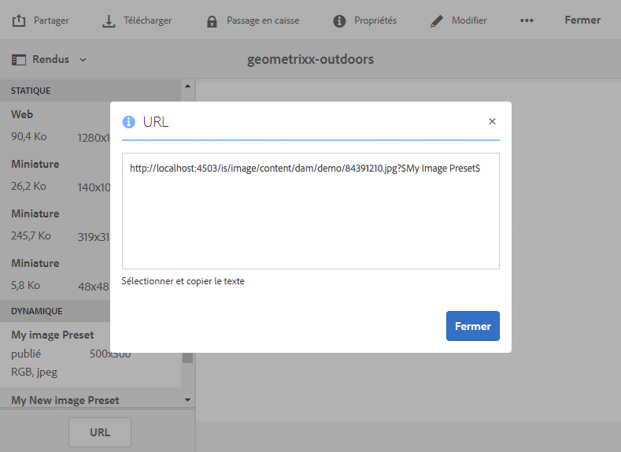
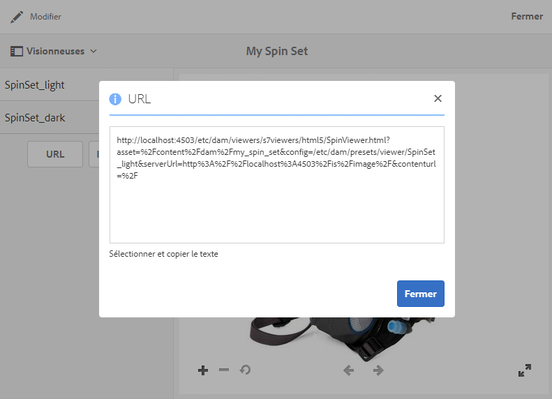

# Liaison d’URL à une application web {#linking-urls-to-your-web-application}

Vos applications et sites web accèdent aux services Dynamic Media par l’intermédiaire d’appels d’URL. Une fois que vous avez publié une ressource, Dynamic Media active une chaîne d’URL qui fait référence à la ressource. Vous pouvez coller ces URL dans un navigateur web à des fins de test.

Vous ne pouvez lier à des URL que si vous *n’utilisez pas* AEM pour la gestion de contenu web. La liaison, à la différence de l’intégration, est utilisée lorsque vous souhaitez présenter un lecteur vidéo dans une fenêtre contextuelle ou modale. Dans le cas contraire, [vous pouvez ajouter les ressources directement à votre page.](adding-dynamic-media-assets-to-pages.md)

Pour placer ces chaînes URL dans vos pages et applications web, copiez-les depuis Dynamic Media.

>[!NOTE]
>
>Les chaînes URL ne sont disponibles que pour les rendus dynamiques des ressources. Elles ne sont actuellement pas disponibles pour les ressources statiques qui résident dans la gestion des ressources numériques et non dans le serveur de média dynamique. Le bouton URL n’apparaît pas pour les rendus statiques.

Voir aussi [Incorporation de la visionneuse de vidéos ou d’images dans une page web](embed-code.md).

Voir aussi [Liaison d’URL YouTube à une application web](video.md).

Voir aussi [Diffusion d’images optimisées pour un site réactif](responsive-site.md).

Voir aussi [Téléchargement de ressources](/help/assets/manage-digital-assets.md#uploading-assets).

## Obtention d’une URL pour une ressource  {#obtaining-a-url-for-an-asset}

Vous pouvez obtenir une chaîne URL qui est générée par un paramètre d’image prédéfini ou un paramètre prédéfini de la visionneuse. Une fois que vous avez copié l’URL, elle se trouve dans le presse-papiers ce qui vous permet de la coller dans les pages de votre site web ou de votre application.

>[!NOTE]
>
>Vous ne pouvez pas copier l’URL tant que la ressource sélectionnée n’a pas été publiée. En outre, vous devez également publier le paramètre de visionneuse prédéfini ou le paramètre d’image prédéfini.
>
>Voir [Publication de ressources](publishing-dynamicmedia-assets.md).
>
>Voir [Publication de paramètres de visionneuse prédéfinis](managing-viewer-presets.md#publishing-viewer-presets).
>
>Voir [Publication de paramètres d’image prédéfinis](managing-image-presets.md#publishing-image-presets).

Il existe différents moyens d’obtenir une chaîne URL. Néanmoins, les étapes ci-dessous ne vous présentent qu’une seule méthode.

**Obtention de l’URL d’une ressource**

1. Accédez à la ressource *publiée* dont vous souhaitez copier l’URL du paramètre d’image ou de visionneuse prédéfini, puis appuyez sur la ressource pour l’ouvrir.

   N’oubliez pas que les URL ne peuvent être copiées qu’*après* la *publication* des ressources. En outre, le paramètre de visionneuse prédéfini ou le paramètre d’image prédéfini doit également être publié.

   Voir [Publication de ressources](publishing-dynamicmedia-assets.md).

   Voir [Publication de paramètres de visionneuse prédéfinis](managing-viewer-presets.md#publishing-viewer-presets).

   Voir [Publication de paramètres d’image prédéfinis](managing-image-presets.md#publishing-image-presets).

1. Selon la ressource sélectionnée, procédez comme suit :

   * Si vous avez sélectionné une image, dans le menu déroulant, appuyez sur **[!UICONTROL Rendus]**.

      Sous l’en-tête **[!UICONTROL Dynamique]**, appuyez sur un nom de paramètre prédéfini afin d’afficher son rendu dans le cadre de droite. Il vous faudra peut-être faire défiler la liste Rendus pour afficher l’en-tête Dynamique.

      Dans la partie inférieure du rail gauche, appuyez sur **[!UICONTROL URL]**.

      

   * Si vous avez sélectionné une visionneuse à 360°, une visionneuse d’images, un ensemble de carrousel ou une vidéo, dans le menu déroulant, appuyez sur **[!UICONTROL Visionneuses]**.

      Dans le rail de gauche, appuyez sur un nom de paramètre prédéfini de la visionneuse. Un aperçu de la visionneuse ou de la vidéo s’ouvre dans une page distincte.

      Dans le rail de gauche, dans la partie inférieure, appuyez sur **[!UICONTROL URL]**.

      

1. Sélectionnez le texte et copiez-le dans le navigateur web pour prévisualiser la ressource ou l’ajouter à la page de contenu web.

   Pour fermer la fenêtre d’URL, appuyez sur **[!UICONTROL X]** ou sur **[!UICONTROL Fermer]**.

## Obtention d’une URL pour une ressource statique {#obtaining-a-url-for-a-static-asset}

Dynamic Media prend en charge le déploiement de ressources statiques, qui sont des ressources supplémentaires au-delà des images et de la vidéo. Les formats de ressources statiques pris en charge pour la diffusion comprennent les formats suivants :

* GIF animé
* Fichiers audio
* CSS
* JavaScript (lorsque votre entreprise est configurée avec son propre domaine)
* PDF
* SVG
* XML
* ZIP

**Obtention de l’URL d’une ressource statique**

1. Accédez à la ressource statique *publiée* dont vous souhaitez copier l’URL et appuyez ensuite dessus pour l’ouvrir.

   N’oubliez pas que les URL ne peuvent être copiées qu’*après* la *publication* de la ressource statique.

   Voir [Publication de ressources](publishing-dynamicmedia-assets.md).

1. Utilisez l’une des méthodes suivantes pour obtenir l’URL de la ressource statique publiée :

   * `The URL of the published static is the following:`

      * `https://*<server_name>*/is/content/*<company_name>*/*<static_asset_filename>*.*<extension>*`

         Par exemple, `https://aem.com/is/content/adobe/image.gif`.
   * Cliquez sur **[!UICONTROL Ressource > Rendu(s) dynamique(s)]**, appuyez sur le rendu dynamique de la ressource statique, puis copiez l’URL.

      Modifiez l’URL copiée afin d’utiliser `is/content` au lieu de `is/image/` dans le chemin d’accès.

## Obtention d’une URL de vidéo pour un rendu vidéo publié {#obtaining-a-video-url-for-a-published-video-rendition}

1. Dans AEM, accédez à **[!UICONTROL Outils > Déploiement > Cloud > Cloud Services]**.
1. Sur la page **[!UICONTROL Cloud Services]**, faites défiler l’écran jusqu’au titre **[!UICONTROL Dynamic Media Cloud Services]**, puis cliquez sur **[!UICONTROL Afficher les configurations]**.
1. Sous **[!UICONTROL Configurations disponibles]**, appuyez sur le nom de la configuration qui vous intéresse.

1. Sur la page **[!UICONTROL Paramètres de cloud Dynamic Media]**, sous **[!UICONTROL URL du service vidéo]**, copiez le chemin URL complet. Vous aurez besoin de l’URL copiée dans les étapes suivantes.

   Par exemple, le chemin URL est similaire au suivant :

   `https://s7athens.macromedia.com:9090/DMGateway/`

   (Le chemin ci-dessus est donné à titre d’illustration uniquement ; il ne s’agit pas de celui que vous allez copier.)

1. Sous **[!UICONTROL ID d’enregistrement]**, copiez le nom du client dans la dernière partie de l’ID.

   Par exemple, si l’ID d’enregistrement est `87654321|MyCompany`, le nom du client est `MyCompany`.

1. Près du coin supérieur gauche de la page, appuyez sur **Cloud Services**, puis sur l’icône d’AEM et accédez à **[!UICONTROL Général > CRXDE Lite]**.
1. Copiez le chemin URL du rendu vidéo à partir du référentiel JCR (Java Content Repository).

   Par exemple, le chemin URL du rendu vidéo est similaire au suivant :

   `/_renditions_/0bd/0bd28743-a616-4fe6-92aa-6eae7c2112f/avs/Momentum_1080-0x720-2600k.mp4`

   (Le chemin ci-dessus est donné à titre d’illustration uniquement ; il ne s’agit pas de celui que vous allez copier.)

1. Organisez les informations copiées dans l’ordre suivant pour former un chemin URL complet :

   `<Video_Service_URL>/public/<Customer_name_from_Registration_ID>/<Video_rendition_path>`

   Si l’on reprend les exemples de chemin et de nom de client ci-dessus, le chemin d’accès complet est le suivant :

   `https://s7athens.macromedia.com:9090/DMGateway/public/MyCompany/_renditions_/0bd/0bd28743-a616-4fe6-92aa-6eae7c2112ff/avs/Momentum_1080-0x720-2600k.mp4`

   Il s’agit de l’URL complète d’un rendu vidéo publié.

## Obtention d’une URL de vidéo pour la diffusion adaptative (HLS)  {#obtaining-a-video-url-for-adaptive-streaming-hls}

1. Dans AEM, accédez à **[!UICONTROL Outils > Déploiement > Cloud > Cloud Services]**.
1. Sur la page **[!UICONTROL Cloud Services]**, faites défiler l’écran jusqu’au titre **[!UICONTROL Dynamic Media Cloud Services]**, puis cliquez sur **[!UICONTROL Afficher les configurations]**.
1. Sous **[!UICONTROL Configurations disponibles]**, appuyez sur le nom de la configuration qui vous intéresse.
1. Sur la page **[!UICONTROL Paramètres Dynamic Media Cloud Services]**, procédez comme suit :

   * Sous **[!UICONTROL URL du service vidéo]**, copiez le chemin d’URL entier. Vous aurez besoin de l’URL copiée dans ces étapes. Par exemple, le chemin URL est similaire au suivant :
   `https://gateway-na.assetsadobe.com/DMGateway/`

   (Le chemin ci-dessus est donné à titre d’illustration uniquement ; il ne s’agit pas de celui que vous allez copier.)

   * Sous **[!UICONTROL ID d’enregistrement]**, copiez le nom du client dans la dernière partie de l’ID. Vous aurez besoin du nom du client copié plus loin dans ces étapes.

      Par exemple, si l’ID d’enregistrement est `87654321|demoCo`, le nom du client est `demoCo`.

1. En fonction du protocole de diffusion vidéo que vous utilisez, copiez le sélecteur de protocole correspondant. Vous aurez besoin du sélecteur de protocole copié plus tard au cours de ces étapes.

   <table>
    <tbody>
      <tr>
      <td><strong>Protocole de diffusion vidéo que vous utilisez</strong></td>
      <td><strong>Sélecteur de protocole à utiliser</strong></td>
      </tr>
      <tr>
      <td>
HTTP
 
Si vous utilisez HTTP (diffusion vidéo non sécurisée), assurez-vous de remplacer <code>https</code> par <code>http</code> dans la valeur URL du service vidéo que vous avez copiée précédemment.
 </td>
      <td><code>public/</code></td>
      </tr>
      <tr>
      <td>HTTPS</td>
      <td><code>public-ssl/</code></td>
      </tr>
    </tbody>
   </table>

1. Copiez le chemin complet de la ressource vidéo dans AEM, tel qu’il est traité par Dynamic Media. Vous aurez besoin de ce chemin d’accès à la ressource vidéo copié dans ces étapes.

   Par exemple :

   `/content/dam/marketing/MyVideo.mp4`

1. Combinez tous les éléments copiés précédemment pour créer une chaîne dans l’ordre suivant :

   &lt; `video service URL`>&lt; `protocol selector`>&lt; `customer name`>&lt; `video asset path`>

   Par exemple, en utilisant les informations copiées à partir des exemples de ces étapes, la chaîne apparaît comme suit :

   `https://gateway-na.assetsadobe.com/DMGateway/public-ssl/demoCo/content/dam/marketing/MyVideo.mp4`

1. Complétez l’URL en ajoutant `.m3u8` à la fin de la chaîne. Par exemple, en ajoutant `.m3u8` à la chaîne de l’étape précédente, le chemin d’accès complet de l’URL se présenterait comme suit :

   `https://gateway-na.assetsadobe.com/DMGateway/public-ssl/demoCo/content/dam/marketing/MyVideo.mp4.m3u8`

## Utilisation de HTTP/2 pour diffuser vos ressources Dynamic Media {#using-http-to-deliver-your-dynamic-media-assets}

HTTP/2 est le nouveau protocole web qui améliore la manière dont les serveurs et les navigateurs communiquent. Il permet un transfert rapide d’informations et réduit la puissance de traitement nécessaire. Les ressources Dynamic Media peuvent désormais être diffusées sur HTTP/2, un protocole qui garantit de meilleurs temps de réponse et de chargement.

Voir [Diffusion du contenu sur HTTP/2](http2faq.md) pour tout savoir sur l’utilisation du protocole HTTP/2 avec votre compte Dynamic Media.
