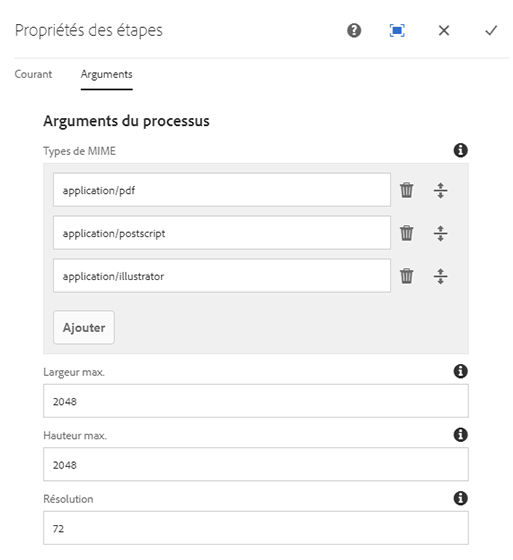
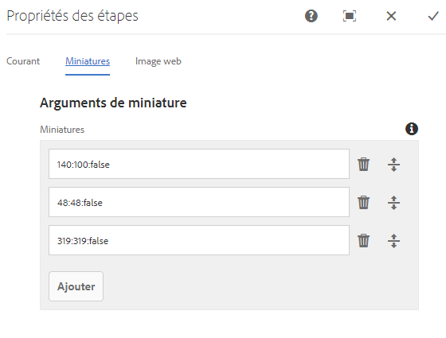
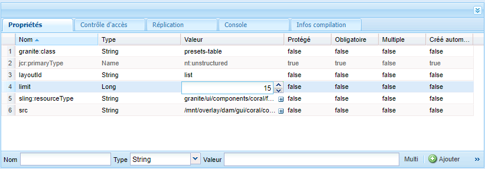
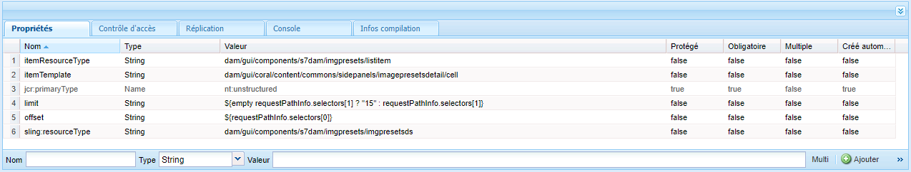
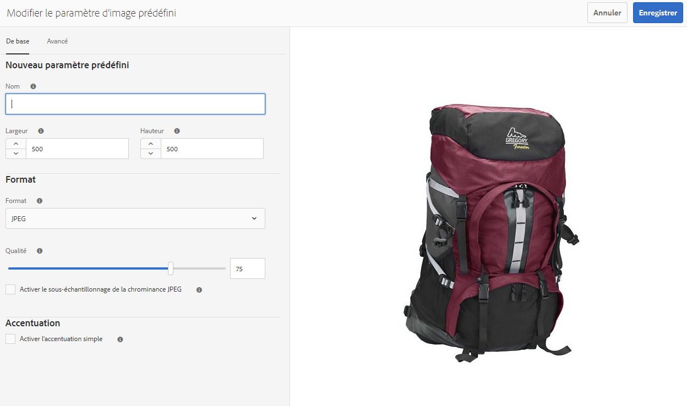
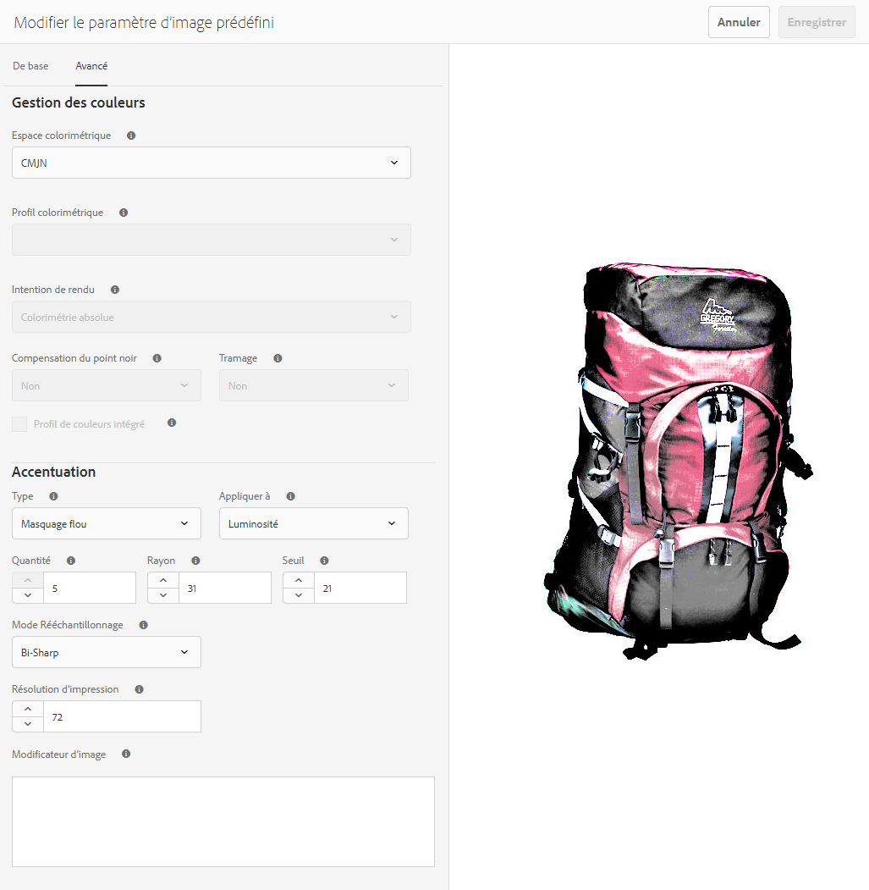

# Gestion des paramètres d’image prédéfinis{#managing-image-presets}

Les paramètres d’image prédéfinis permettent à AEM Assets d’afficher des images selon des tailles et des formats différents, ou avec d’autres propriétés d’image générées dynamiquement. Chaque paramètre d’image prédéfini représente un ensemble prédéfini de commandes de dimensionnement et de mise en forme pour l’affichage des images. Lorsque vous créez un paramètre d’image prédéfini, vous choisissez une taille pour la diffusion de l’image. Vous pouvez également choisir des commandes de mise en forme pour optimiser l’aspect de l’image lors de la diffusion de l’image.

Les administrateurs peuvent créer des paramètres prédéfinis pour l’exportation de ressources. Les utilisateurs peuvent choisir un paramètre prédéfini au moment de l’exportation des images, qui reformate également les images selon les spécifications définies par l’administrateur.

Vous pouvez également créer des paramètres d’image prédéfinis réactifs. Si vous appliquez un paramètre prédéfini d’image réactive aux ressources, elles changent en fonction de l’appareil ou de la taille d’écran utilisée pour les afficher. Vous pouvez configurer des paramètres d’image prédéfinis de manière à utiliser CMJN dans l’espace colorimétrique, en plus de RVB ou Gris.

Cette section explique comment créer, modifier et gérer des paramètres d’image prédéfinis. Vous pouvez appliquer un paramètre d’image prédéfini à une image lorsque vous la prévisualisez. See [Applying Image Presets](/help/assets/dynamic-media/image-presets.md).

>[!NOTE]
>
>L’imagerie dynamique fonctionne avec vos paramètres d’image prédéfinis et utilise des informations à la dernière milliseconde de diffusion pour réduire davantage encore la taille du fichier d’image en fonction de la vitesse de connexion du réseau et du navigateur. Voir [Imagerie numérique](/help/assets/dynamic-media/imaging-faq.md) pour plus d’informations.

## Définition des paramètres d’image prédéfinis {#understanding-image-presets}

À l’instar d’une macro, un paramètre d’image prédéfini est un ensemble prédéfini de commandes de dimensionnement et de formatage enregistrées sous un nom. Pour comprendre le fonctionnement des paramètres d’image prédéfinis, imaginez que votre site web nécessite l’affichage de chaque image d’un produit dans des tailles, des formats et des taux de compression différents pour la diffusion mobile et de bureau.

Vous pouvez créer deux paramètres d’image prédéfinis : une avec 500 x 500 pixels pour la version de bureau et 150 x 150 pixels pour la version mobile. Vous créez deux paramètres d’image prédéfinis, l’un appelé `Enlarge` pour afficher des images de 500 x 500 pixels et l’autre appelé `Thumbnail` pour afficher des images de 150 x 150 pixels. Pour diffuser des images à la `Enlarge` taille et à la taille `Thumbnail` , AEM recherche la définition du paramètre d’image prédéfini agrandi et du paramètre d’image prédéfini de miniature. Ensuite, AEM génère de manière dynamique une image dont la taille et le format correspondent à chaque paramètre d’image prédéfini.

Les images de taille réduite, lorsqu’elles sont diffusées dynamiquement, peuvent perdre en netteté et en détail. C’est la raison pour laquelle chaque paramètre d’image prédéfini contient des commandes de formatage permettant d’optimiser l’image lorsqu’elle est diffusée avec une taille particulière. Ces commandes garantissent une image nette et claire au moment de la diffusion vers le site web ou l’application.

Les administrateurs peuvent créer des paramètres d’image prédéfinis. Vous pouvez créer un paramètre d’image prédéfini ou commencer par un paramètre d’image existant et l’enregistrer sous un nouveau nom.

## Gestion des paramètres d’image prédéfinis {#managing-image-presets-1}

You manage your image presets in AEM by tapping or clicking the AEM logo to access the global navigation console and then tapping or clicking the Tools icon and navigating to **[!UICONTROL Assets > Image Presets]**.


>[!NOTE]
>
>Tous les paramètres d’image prédéfinis que vous créez sont également disponibles en tant que rendus dynamiques lorsque vous prévisualisez ou livrez des ressources.
>
>Vous *n’avez pas* besoin de publier les paramètres d’image prédéfinis, car ils le sont automatiquement.
>
>Voir [Publication de paramètres d’image prédéfinis.](#publishing-image-presets)

>[!NOTE]
>
>Le système affiche une grande variété de rendus lorsque vous sélectionnez **[!UICONTROL Rendus]** dans l’affichage des détails d’une ressource. Vous pouvez augmenter le nombre de paramètres d’image prédéfinis affichés. Voir [Augmentation du nombre de paramètres d’image prédéfinis affichés](#increasing-or-decreasing-the-number-of-image-presets-that-display).

### Formats de fichiers Adobe Illustrator (AI), PostScript (EPS) et PDF {#adobe-illustrator-ai-postscript-eps-and-pdf-file-formats}

Si vous avez l’intention de prendre en charge l’assimilation de fichiers AI, EPS et PDF de manière à pouvoir générer des rendus dynamiques de ces formats de fichiers, vous pouvez consulter les informations suivantes avant de créer des paramètres d’image prédéfinis.

Le format de fichier d’Adobe Illustrator est une variante du format PDF. Les principales différences, dans le cadre d’AEM Assets, sont les suivantes :

* Les documents Adobe Illustrator se composent d’une seule page avec plusieurs calques. Chaque calque est extrait sous la forme d’une sous-ressource PNG sous la ressource Illustrator principale.
* Les documents PDF se composent d’une ou de plusieurs pages. Chaque page est extraite sous la forme d’une sous-ressource PDF d’une seule page sous le document PDF multi-pages principal.

Les sous-ressources sont créées par le `Create Sub Asset process` composant dans le flux de travail global `DAM Update Asset` . Pour voir ce composant de processus dans le processus, appuyez sur **[!UICONTROL Outils > Processus > Modèles > Ressource de mise à jour de gestion des actifs numériques > Modifier]**.

<!-- See also [Viewing pages of a multi-page file](/help/assets/manage-linked-subassets.md#view-pages-of-a-multi-page-file). -->

Vous pouvez afficher les sous-ressources ou les pages lorsque vous ouvrez la ressource, appuyez sur le menu Contenu et sélectionnez **[!UICONTROL Sous-ressources]** ou **[!UICONTROL Pages]**. Les sous-ressources sont de véritables ressources. That is, PDF pages are extracted by the `Create Sub Asset` workflow component. They are then stored as `page1.pdf`, `page2.pdf`, and so on below the main asset. Une fois stockés, le `DAM Update Asset` processus les traite.

  Pour utiliser Dynamic Media afin de prévisualiser et de générer des rendus dynamiques pour des fichiers AI, EPS ou PDF, les étapes de traitement suivantes doivent être exécutées :

1. Dans le `DAM Update Asset` processus, le composant `Rasterize PDF/AI Image Preview Rendition` de processus pixellise la première page de la ressource d’origine (à l’aide de la résolution configurée) dans un `cqdam.preview.png` rendu.

1. Le `cqdam.preview.png` rendu est ensuite optimisé dans un fichier PTIFF par le composant `Dynamic Media Process Image Assets` de processus dans le flux de travail.

>[!NOTE]
>
>L’étape **[!UICONTROL Miniatures EPS]** du processus Ressource de mise à jour de gestion des actifs numériques génère des miniatures pour les fichiers EPS.

#### Propriétés des métadonnées de ressource PDF/AI/EPS {#pdf-ai-eps-asset-metadata-properties}

| **Propriété de métadonnées** | **Description** |
|---|---|
| dam:Physicallargthinches | Largeur du document en pouces. |
| dam:Physicalheightininches | Hauteur du document en pouces. |

Vous accédez aux options des composants `Rasterize PDF/AI Image Preview Rendition` de processus par le biais du `DAM Update Asset` processus.

Tap on Adobe Experience Manager in the upper left, navigate to **[!UICONTROL Tools > Workflow > Models]**. Sur la page Modèles de processus, sélectionnez **[!UICONTROL Ressource de mise à jour de gestion des actifs numériques]**, puis appuyez sur **[!UICONTROL Modifier]**. Dans la page de flux de travaux de mise à jour des actifs de gestion des actifs numériques, double-appuyez sur le composant de `Rasterize PDF/AI Image Preview Rendition` processus pour ouvrir la boîte de dialogue Propriétés de l’étape.

#### Options Pixelliser le rendu d’aperçus d’image PDF/AI {#rasterize-pdf-ai-image-preview-rendition-options}



Arguments pour pixelliser le processus PDF ou AI

<table>
 <tbody>
  <tr>
   <td><strong>Argument de processus</strong></td>
   <td><strong>Paramètre par défaut</strong></td>
   <td><strong>Description</strong></td>
  </tr>
  <tr>
   <td>Types MIME</td>
   <td><p>application/pdf</p> <p>application/postscript</p> <p>application/illustrator<br /> </p> </td>
   <td>Liste des types MIME de documents considérés comme des documents PDF ou Illustrator.<br /> </td>
  </tr>
  <tr>
   <td>Largeur max.</td>
   <td>2048</td>
   <td>Largeur maximale du rendu d’aperçu généré, en pixels.<br /> </td>
  </tr>
  <tr>
   <td>Hauteur max.</td>
   <td>2048</td>
   <td>Hauteur maximale du rendu d’aperçu généré, en pixels.<br /> </td>
  </tr>
  <tr>
   <td>Résolution</td>
   <td>72</td>
   <td>Résolution permettant de pixelliser la première page, en ppp (pixels par pouce).</td>
  </tr>
 </tbody>
</table>

À l’aide des arguments de processus par défaut, la première page d’un document PDF/AI est pixellisée à 72 ppp et l’image de prévisualisation générée est dimensionnée à 2 048 x 2 048 pixels. Pour un déploiement standard, vous pouvez augmenter la résolution sur une valeur minimale de 150 ppp ou plus. Par exemple, un document de format Lettre US à 300 ppp doit avoir une largeur et une hauteur maximales de 2 550 x 3 300 pixels, respectivement.

Largeur max. et Hauteur max. limitent la résolution à laquelle la pixellisation doit être effectuée. Par exemple, si les valeurs maximales restent inchangées, et que la résolution est définie sur 300 ppp, le document Lettre US est pixellisé à 186 ppp. En d’autres termes, la taille du document sera de 1 581 x 2 046 pixels.

The `Rasterize PDF/AI Image Preview Rendition` process component has a maximum defined to ensure that it does not create overly large images in memory. Ces images volumineuses peuvent, en effet, dépasser la capacité de mémoire allouée à la machine virtuelle Java (JVM). Il faut veiller à fournir suffisamment de mémoire à la machine virtuelle Java pour gérer le nombre configuré de processus parallèles, de sorte que chacun d’eux soit en mesure de créer une image à la taille maximale configurée. 

### Format de fichier InDesign (INDD) {#indesign-indd-file-format}

Si vous avez l’intention de prendre en charge l’assimilation de fichiers INDD de manière à pouvoir générer le rendu dynamique de ce format de fichier, vous pouvez consulter les informations suivantes avant de créer des paramètres d’image prédéfinis.

Dans le cas des fichiers InDesign, les sous-ressources ne sont extraites que si Adobe InDesign Server est intégré à AEM. Les ressources référencées sont reliées en fonction de leurs métadonnées. InDesign Server n’est pas requis pour la liaison. Cependant, les ressources référencées doivent être présentes dans AEM avant que les fichiers InDesign soient traités, pour que les liens soient créés entre les fichiers InDesign et les ressources référencées.

<!-- See [Integrating AEM Assets with InDesign Server](/help/assets/indesign.md). -->

The Media Extraction process component in the `DAM Update Asset` workflow runs several pre-configured Extend Scripts to process InDesign files.


Chemins ExtendScript dans les arguments du composant de processus Extraction de médias au sein du processus Ressource de mise à jour de la gestion des actifs numériques.

Les scripts suivants sont utilisés par l’intégration de Dynamic Media :

<table>
 <tbody>
  <tr>
   <td><strong>Etendre le nom du script</strong></td>
   <td><strong>Default</strong></td>
   <td><strong>Description</strong></td>
  </tr>
  <tr>
   <td>ThumbnailExport.jsx</td>
   <td>Oui</td>
   <td>Génère un rendu <code>thumbnail.jpg</code> de 300 ppp optimisé et transformé en rendu PTIFF par composant <code>Dynamic Media Process Image Assets</code> de processus.<br /> </td>
  </tr>
  <tr>
   <td>JPEGPagesExport.jsx</td>
   <td>Oui</td>
   <td>Génère un sous-fichier JPEG de 300 ppp pour chaque page. Une sous-ressource JPEG est une véritable ressource stockée sous la ressource InDesign. Il est également optimisé et transformé en PTIFF par le <code>DAM Update Asset</code> processus.<br /> </td>
  </tr>
  <tr>
   <td>PDFPagesExport.jsx</td>
   <td>Non</td>
   <td>Génère un sous-fichier PDF pour chaque page. La sous-ressource PDF est traitée comme indiqué précédemment. Étant donné que le PDF ne contient qu’une seule page, aucune sous-ressource n’est générée.<br /> </td>
  </tr>
 </tbody>
</table>

### Configuring image thumbnail size {#configuring-image-thumbnail-size}

Vous pouvez définir la taille des miniatures en configurant ces paramètres dans le processus **[!UICONTROL Ressource de mise à jour de gestion des actifs numériques]**. Le processus comprend deux étapes au cours desquelles vous pouvez configurer la taille de miniature des ressources d’images. Bien qu’un composant (**[!UICONTROL Ressources d’image du processus de média dynamique]**) soit utilisé pour les ressources d’images dynamiques et que l’autre (**[!UICONTROL Miniatures des processus]**) soit exécuté pour la génération des miniatures statiques ou lorsqu’aucun autre processus ne parvient à générer des miniatures, *tous deux* doivent posséder les mêmes paramètres.

Avec l’étape **[!UICONTROL Ressources d’image du processus de média dynamique]**, les miniatures sont générées par le serveur d’images et cette configuration est indépendante de celle appliquée à l’étape **[!UICONTROL Miniatures des processus]**. La génération de miniatures en passant par l’étape **[!UICONTROL Miniatures des processus]** constitue la méthode la plus lente et la plus gourmande en mémoire.

Le dimensionnement des miniatures est défini au format suivant : **[!UICONTROL width:height:center]** (largeur:hauteur:centrer), par exemple *80:80:false*. La largeur et la hauteur déterminent la taille en pixels de la miniature. La valeur « centrer » est soit false soit true. Si elle est définie sur true, elle indique que la miniature a exactement la taille spécifiée dans la configuration. Si l’image redimensionnée est plus petite, elle est centrée dans la miniature.

>[!NOTE]
>
>* La taille des miniatures pour les fichiers EPS est configurée à l’étape **[!UICONTROL Miniatures EPS]**, dans l’onglet **[!UICONTROL Arguments]** sous Miniatures.
   >
   >
* La taille des miniatures pour les vidéos est configurée à l’étape **[!UICONTROL Miniatures FFmpeg]**, dans l’onglet **[!UICONTROL Processus]** sous **[!UICONTROL Arguments]**.
>


**Pour configurer la taille des miniatures d’image**

1. Tap **[!UICONTROL Tools > Workflow > Models > DAM Update Asset > Edit]**.
1. Tap the **[!UICONTROL Dynamic Media Process Image Assets]** step and tap the **[!UICONTROL Thumbnails]** tab. Modifiez la taille de la miniature, si nécessaire, puis appuyez sur **[!UICONTROL OK]**.

   

1. Tap the **[!UICONTROL Process Thumbnails]** step, then tap the **[!UICONTROL Thumbnails]** tab. Modifiez la taille de la miniature, si nécessaire, puis appuyez sur **[!UICONTROL OK]**.

   >[!NOTE]
   >
   >Les valeurs définies dans l’argument des miniatures à l’étape **[!UICONTROL Miniatures des processus]** doivent correspondre à celles de l’argument de l’étape **[!UICONTROL Ressources d’image du processus de média dynamique]**.

1. Appuyez sur **[!UICONTROL Enregistrer]** pour enregistrer les modifications apportées au workflow.

### Augmentation ou diminution du nombre de paramètres d’image prédéfinis affichés {#increasing-or-decreasing-the-number-of-image-presets-that-display}

Les paramètres d’image prédéfinis que vous créez sont disponibles sous la forme de rendus dynamiques lorsque vous prévisualisez des ressources. AEM affiche une grande variété de rendus dynamiques lors de l’affichage de ressources à partir de **[!UICONTROL Affichage des détails > Rendus]**. Vous pouvez augmenter ou diminuer la limite des rendus affichés.

**Pour augmenter ou diminuer le nombre de paramètres d’image prédéfinis affichés**

1. Navigate to CRXDE Lite ([https://localhost:4502/crx/de](https://localhost:4502/crx/de)).
1. Accédez au noeud de liste des paramètres d’image prédéfinis à l’adresse `/libs/dam/gui/coral/content/commons/sidepanels/imagepresetsdetail/imgagepresetslist`

   

1. Dans la propriété **[!UICONTROL limit]**, définissez la valeur de votre choix dans la colonne **[!UICONTROL Valeur]** ; par défaut, elle est définie sur 15.
1. Accédez à la source de données des paramètres d’image prédéfinis à l’adresse `/libs/dam/gui/coral/content/commons/sidepanels/imagepresetsdetail/imgagepresetslist/datasource`

   

1. In the limit property, change the number to the desired number, for example `{empty requestPathInfo.selectors[1] ? "20" : requestPathInfo.selectors[1]}`
1. Appuyez sur **[!UICONTROL Enregistrer tout]**.

### Creating an Image Preset {#creating-image-presets}

La création d’un paramètre d’image prédéfini vous permet d’appliquer ce paramètre à n’importe quelle image lors de la prévisualisation ou de la publication.

>[!NOTE]
>
>Si vous utilisez Internet Explorer 9, un paramètre prédéfini nouvellement créé n’apparaît pas immédiatement dans la liste après l’enregistrement. Pour contourner ce problème, désactivez le cache d’Internet Explorer 9.

Si vous avez l’intention de prendre en charge l’assimilation de fichiers AI, PDF et EPS de manière à pouvoir générer un rendu dynamique de ces formats de fichiers, vous pouvez consulter les informations suivantes avant de créer des paramètres d’image prédéfinis.
Voir [Formats de fichiers Adobe Illustrator (AI), PostScript (EPS) et PDF](#adobe-illustrator-ai-postscript-eps-and-pdf-file-formats).

Si vous avez l’intention de prendre en charge l’assimilation de fichiers INDD de manière à pouvoir générer le rendu dynamique de ce format de fichier, vous pouvez consulter les informations suivantes avant de créer des paramètres d’image prédéfinis.
 Voir [Format de fichier InDesign (INDD)](#indesign-indd-file-format).

**Pour créer un paramètre d’image prédéfini**

1. In AEM, tap the AEM logo to access the global navigation console, then tap **[!UICONTROL Tools > Assets > Image Presets]**.
1. Cliquez sur **[!UICONTROL Créer]**. La fenêtre **[!UICONTROL Modifier le paramètre d’image prédéfini]** s’ouvre.

   

   >[!NOTE]
   >
   >Pour rendre ce paramètre d’image prédéfini réactif, effacez les valeurs dans les champs **[!UICONTROL Largeur]** et **[!UICONTROL Hauteur]** et laissez-les vides.

1. Saisissez des valeurs dans les onglets **[!UICONTROL De base]** et **[!UICONTROL Avancé]** suivant les besoins (y compris un nom). Les options sont décrites à la section [Options des paramètres d’image prédéfinis](#image-preset-options). Les paramètres prédéfinis s’affichent dans le volet de gauche et peuvent être utilisés à la volée avec d’autres ressources.

   

1. Cliquez sur **[!UICONTROL Save**.

### Creating a responsive Image Preset {#creating-a-responsive-image-preset}

Pour créer un paramètre d&#39;image prédéfini réactif, suivez la procédure décrite dans la section [Création d&#39;un paramètre d&#39;image prédéfini](#creating-image-presets). Lorsque vous devez saisir la hauteur et la largeur dans la fenêtre **[!UICONTROL Modifier le paramètre d’image prédéfini]**, effacez les valeurs et laissez-les vides.

Lorsque ces valeurs sont vides, AEM détermine que ce paramètre d’image prédéfini est réactif. Vous pouvez ajuster les autres valeurs, le cas échéant.

>[!NOTE]
>
>To see the **[!UICONTROL URL]** and **[!UICONTROL RESS]** buttons when applying an image preset to an asset, the asset must be published.
>
>
>
>Notez que les paramètres d’image prédéfinis et les fichiers d’image sont automatiquement publiés.

### Image Preset options {#image-preset-options}

Lorsque vous créez ou modifiez des paramètres d’image prédéfinis, vous disposez des options décrites dans cette section. En outre, Adobe recommande les options suivantes (correspondant aux « bonnes pratiques ») pour commencer :

* **[!Format** UICONTROL (onglet **[!UICONTROL Simple]** ) - Sélectionnez **[!UICONTROL JPEG]** ou un autre format qui répond à vos besoins. Tous les navigateurs Web prennent en charge le format d’image JPEG ; il offre un bon équilibre entre la taille des petits fichiers et la qualité des images. Toutefois, les images au format JPEG utilisent un modèle de compression avec perte qui peut introduire des artefacts d’image indésirables si le paramètre de compression est trop faible. C’est pourquoi Adobe recommande de définir la qualité de compression sur 75. Ce réglage offre un bon compromis entre la qualité de l’image et la petite taille de fichier.

* **[!UICONTROL Activer l’accentuation]** simple - Ne sélectionnez pas **[!UICONTROL Activer l’accentuation]** simple (ce filtre d’accentuation offre moins de contrôle que les paramètres de masquage flou).

* **[!UICONTROL Accentuation : Mode]** de ré-échantillonnage - Sélectionnez **[!UICONTROL Bi-Cubique]**.

#### Options de l’onglet De base {#basic-tab-options}

<table>
 <tbody>
  <tr>
   <td><strong>Champ</strong></td>
   <td><strong>Description</strong></td>
  </tr>
  <tr>
   <td><strong>Nom</strong></td>
   <td>Saisissez un nom descriptif sans espaces. Ajoutez la spécification de taille de l’image dans le nom pour permettre aux utilisateurs d’identifier ce paramètre d’image prédéfini.</td>
  </tr>
  <tr>
   <td><strong>Largeur et hauteur</strong></td>
   <td>Saisissez la taille (en pixels) à utiliser pour la diffusion de l’image. La largeur et la hauteur doivent être supérieures à 0 pixel. Aucun paramètre prédéfini n’est en effet créé si l’une de ces valeurs est définie sur 0. Si aucune valeur n’est renseignée, un paramètre d’image prédéfini réactif est créé.</td>
  </tr>
  <tr>
   <td><strong>Format</strong></td>
   <td><p>Sélectionnez un format dans le menu.</p> <p>La sélection du format <strong>JPEG</strong> présente les options supplémentaires suivantes :</p>
    <ul>
     <li><strong>Qualité</strong> - Contrôle le niveau de compression JPEG. Ce paramètre affecte à la fois la taille du fichier et la qualité de l’image. L’échelle de qualité JPEG est de 1 à 100. L’échelle est visible lorsque vous faites glisser le curseur.</li>
     <li><strong>Activer le sous-échantillonnage</strong> chromatique JPG - Comme l’oeil est moins sensible aux informations sur les couleurs haute fréquence qu’à la luminance haute fréquence, les images JPEG divisent les informations sur les images en composantes de luminance et de couleur. Lorsqu’une image JPEG est compressée, le composant de luminance reste à pleine résolution, tandis que les composants de couleur sont sous-échantillonnés en calculant la moyenne des groupes de pixels. Le sous-échantillonnage réduit le volume de données d’un demi-tiers ou d’un tiers, sans incidence sur la qualité perçue. Le sous-échantillonnage ne s’applique pas aux images en niveaux de gris. Cette technique permet de réduire la compression utile pour les images à contraste élevé (par exemple, les images avec du texte superposé).</li>
    </ul>
    <div>
      La sélection de l'option <strong>GIF</strong> ou <strong>GIF avec couche alpha</strong> offre les options <strong>Quantification de couleurs GIF</strong> supplémentaires suivantes :
    </div>
    <ul>
     <li><strong>Type </strong>- Sélectionnez <strong>Adaptatif</strong> (valeur par défaut), <strong>Web</strong>ou <strong>Macintosh</strong>. Si vous sélectionnez <strong>GIF avec Alpha</strong>, l’option Macintosh n’est pas disponible.</li>
     <li><strong>Dither</strong> - Sélectionnez <strong>Diffuse</strong> ou <strong>Désactivé</strong>.</li>
     <li><strong>Nombre de couleurs</strong> : saisissez un nombre compris entre 2 et 256.</li>
     <li><strong>Liste de couleurs</strong> : entrez une liste séparée par des virgules. Par exemple, pour le blanc, le gris et le noir, entrez 000000,888888,ffffff.</li>
    </ul>
    <div>
      Lorsque vous sélectionnez les options <strong>PDF</strong>, <strong>TIFF</strong> ou <strong>TIFF avec couche alpha</strong>, les autres options suivantes sont proposées :
    </div>
    <ul>
     <li><strong>Compression</strong> : choisissez un algorithme de compression. Les options d'algorithme pour le format PDF sont <strong>Aucun</strong>, <strong>Zip</strong> et <strong>Jpeg</strong>. Les options pour le format TIFF sont <strong>Aucun</strong>, <strong>LZW</strong>, <strong>Jpeg</strong> et <strong>Zip</strong>. Les options pour le format TIFF avec couche alpha sont <strong>Aucun</strong>, <strong>LZW</strong> et <strong>Zip</strong>.</li>
    </ul> <p>Aucune option supplémentaire n’est fournie si vous sélectionnez <strong>PNG</strong>, <strong>PNG avec couche alpha</strong> ou <strong>EPS</strong>.</p> </td>
  </tr>
  <tr>
   <td><strong>Accentuation</strong></td>
   <td>Sélectionnez l'option <strong>Activer l’accentuation simple</strong> pour appliquer un filtre d’accentuation de base à l’image à l’issue des opérations de mise à l’échelle. L’accentuation peut compenser le flou produit lors de l’affichage d’une image à une taille différente. </td>
  </tr>
 </tbody>
</table>

#### Options de l’onglet Avancé {#advanced-tab-options}

<table>
 <tbody>
  <tr>
   <td><strong>Champ</strong></td>
   <td><strong>Description</strong></td>
  </tr>
  <tr>
   <td><strong>Espace colorimétrique</strong></td>
   <td>Select <strong>RGB, CMYK,</strong> or <strong>Grayscale</strong> for the color space.</td>
  </tr>
  <tr>
   <td><strong>Profil colorimétrique</strong></td>
   <td>Sélectionnez le profil de l’espace colorimétrique de sortie dans lequel doit être convertie la ressource s’il diffère du profil en cours d’utilisation.</td>
  </tr>
  <tr>
   <td><strong>Intention de rendu</strong></td>
   <td>Vous pouvez remplacer l’intention de rendu par défaut. Les intentions de rendu déterminent ce qu’il advient des couleurs qui ne peuvent pas être reproduites dans le profil colorimétrique cible (hors de la gamme des couleurs). L’intention de rendu est ignorée si elle n’est pas compatible avec le profil ICC.
    <ul>
     <li>Sélectionnez <strong>Perception</strong> pour compresser toute la gamme des couleurs d’un espace colorimétrique dans un autre lorsqu’une ou plusieurs couleurs de l’image d’origine se situent en dehors de la gamme de l’espace colorimétrique de destination.</li>
     <li>Sélectionnez <strong>Colorimétrie relative</strong> si une couleur de l’espace colorimétrique actuel se situe hors de la gamme des couleurs dans l’espace cible et si vous souhaitez la faire correspondre à la couleur la plus proche dans la gamme des couleurs de cet espace cible, sans affecter d’autres couleurs. </li>
     <li>Sélectionnez <strong>Saturation</strong> pour reproduire la saturation des couleurs de l’image d’origine lors de sa conversion dans l’espace colorimétrique cible. </li>
     <li>Sélectionnez <strong>Colorimétrie absolue</strong> pour faire correspondre exactement les couleurs sans aucun ajustement pour le point blanc ou noir qui altérerait la luminosité de l’image.</li>
    </ul> </td>
  </tr>
  <tr>
   <td><strong>Compensation du point noir</strong></td>
   <td>Sélectionnez cette option si le profil de sortie prend en charge cette fonction. La compensation du point noir est ignorée si elle n’est pas compatible avec le profil ICC spécifié.</td>
  </tr>
  <tr>
   <td><strong>Tramage</strong></td>
   <td>Sélectionnez cette option pour réduire les artefacts de bandes de couleurs ou éventuellement les éviter. </td>
  </tr>
  <tr>
   <td><strong>Type d’accentuation</strong></td>
   <td><p>Sélectionnez <strong>Aucun</strong>, <strong>Accentuer</strong> ou <strong>Masquage flou</strong>. </p>
    <ul>
     <li>Sélectionnez <strong>Aucun</strong> pour désactiver l’accentuation.</li>
     <li>Sélectionnez l'option <strong>Accentuer</strong> pour appliquer un filtre d’accentuation de base à l’image à l’issue des opérations de mise à l’échelle. L’accentuation peut compenser le flou produit lors de l’affichage d’une image à une taille différente. </li>
     <li>Select<strong> Unsharp mask</strong> to fine-tune a sharpening filter effect on the final downsampled image. You can control intensity of effect, radius of the effect (measured in pixels) and a threshold of contrast that will be ignored. This effect uses the same options as Photoshop’s “Unsharp Mask” filter.</li>
    </ul> <p>L’option <strong>Masquage flou</strong> propose les options suivantes :</p>
    <ul>
     <li><strong>Montant</strong> - Contrôle le degré de contraste appliqué aux pixels de contour. La valeur réelle par défaut est de 1,0. Pour les images à haute résolution, vous pouvez l’augmenter jusqu’à 5,0. Envisagez la quantité comme une mesure de l’intensité du filtre.</li>
     <li><strong>Rayon</strong> - Détermine le nombre de pixels entourant les pixels de contour qui affectent l’accentuation. Pour les images haute résolution, entrez un nombre réel compris entre 1 et 2. Une valeur faible accentue uniquement les pixels de contour ; une valeur élevée accentue une bande plus large de pixels. La valeur appropriée dépend de la taille de l’image.</li>
     <li><strong>Seuil</strong> : détermine la plage de contraste à ignorer lorsque le filtre de masquage flou est appliqué. En d’autres termes, cette option détermine la différence entre les pixels accentués et la zone environnante avant qu’ils ne soient considérés comme des pixels de contour et soient accentués. Pour éviter d’introduire du bruit, testez des valeurs entières comprises entre 2 et 20. </li>
     <li><strong>Appliquer à</strong> : détermine si l'accentuation s'applique à chaque couleur ou à chaque luminosité.</li>
    </ul>
    <div>
      L’accentuation est décrite dans <a href="https://docs.adobe.com/content/help/en/dynamic-media-classic/using/assets/s7_sharpening_images.pdf">Accentuation des images</a>.
    </div> </td>
  </tr>
  <tr>
   <td><strong>Mode Rééchantillonnage</strong></td>
   <td>Sélectionnez une option <strong>Mode Rééchantillonnage</strong>. Ces options accentuent l’image lorsque sa résolution est réduite :
    <ul>
     <li><strong>Bi-Linéaire</strong> - Méthode de rééchantillonnage la plus rapide. Certains artefacts de crénelage sont visibles.</li>
     <li><strong>Bi-cubique</strong> : augmente l’utilisation du processeur, mais produit des images plus nettes avec des artefacts de crénelage moins visibles.</li>
     <li><strong>Sharp2</strong> - Peut produire des résultats légèrement plus nets que Bi-Cubique, mais à un coût CPU encore plus élevé.</li>
     <li><strong>Bi-Sharp</strong> - Sélectionne le rééchantillonneur par défaut de Photoshop pour réduire la taille de l’image, appelé <strong>accentuation</strong> bicubique dans Adobe Photoshop.</li>
     <li><strong>Chaque couleur</strong> et <strong>Luminosité</strong> : chaque méthode peut être basée sur la couleur ou la luminosité. Par défaut, l’option <strong>Chaque couleur</strong> est sélectionnée.</li>
    </ul> </td>
  </tr>
  <tr>
   <td><strong>Résolution d'impression</strong></td>
   <td>Choisissez une résolution d’impression pour cette image ; 72 pixels est la valeur par défaut.</td>
  </tr>
  <tr>
   <td><strong>Modificateur d’image</strong></td>
   <td><p>Beyond the common image settings available in the UI, Dynamic Media supports numerous advanced image modifications that you can specify in the <strong>Image Modifiers</strong> field. These parameters are defined in the <a href="https://marketing.adobe.com/resources/help/en_US/s7/is_ir_api/is_api/http_ref/c_command_reference.html">Image Server Protocol command reference</a>.</p> <p>Important : La fonctionnalité suivante répertoriée dans l’API n’est pas prise en charge :</p>
    <ul>
     <li>Commandes de base de création de modèles et de rendu de texte : <code>text= textAngle= textAttr= textFlowPath= textFlowXPath= textPath=</code> et <code>textPs=</code></li>
     <li>Commandes de localisation : <code>locale=</code> et <code>req=xlate</code></li>
     <li><code>req=set</code> n’est pas disponible pour une utilisation générale.</li>
     <li><code>req=mbrset</code></li>
     <li><code>req=saveToFile</code></li>
     <li><code>req=targets</code></li>
     <li><code>template=</code></li>
     <li>Services Dynamic Media non essentiels : SVG, rendu d’image et impression en ligne</li>
    </ul> </td>
  </tr>
 </tbody>
</table>

### Définition des options de paramètre d&#39;image prédéfini à l&#39;aide des modificateurs d&#39;image {#defining-image-preset-options-with-image-modifiers}

Outre les options disponibles dans les onglets De base et Avancé, vous pouvez définir des modificateurs d’image afin de disposer de davantage d’options lors de la définition de paramètres d’image prédéfinis. Le rendu d’images dépend de l’API Image Rendering de Scene7. Vous en trouverez une description détaillée à la page [Référence du protocole HTTP](https://microsite.omniture.com/t2/help/en_US/s7/is_ir_api/is_api/http_ref/c_http_protocol_reference.html).

Vous trouverez ci-dessous des exemples de tâches que vous pouvez exécuter à l’aide des modificateurs d’image.

>[!NOTE]
>
>Some image modifiers [cannot be used in AEM](#advanced-tab-options).

* [op_invert](https://microsite.omniture.com/t2/help/en_US/s7/is_ir_api/is_api/http_ref/r_op_invert.html) - Inverse chaque composante de couleur pour obtenir un effet d’image négatif.

   ```xml
   &op_invert=1
   ```

   

* [op_blur](https://microsite.omniture.com/t2/help/en_US/s7/is_ir_api/is_api/http_ref/r_op_blur.html) : applique un effet de flou à l’image.

   ```xml
   &op_blur=7
   ```

   

* Commandes combinées : op_blur et op-invert

   ```xml
   &op_invert=1&op_blur=7
   ```

   

* [op_brightness](https://microsite.omniture.com/t2/help/en_US/s7/is_ir_api/is_api/http_ref/r_op_brightness.html) : diminue ou augmente la luminosité.

   ```xml
   &op_brightness=58
   ```

   

* [opac](https://microsite.omniture.com/t2/help/en_US/s7/is_ir_api/is_api/http_ref/r_opac.html) : permet de régler l’opacité de l’image. Cet attribut vous permet de diminuer l’opacité du premier plan.

   ```xml
   opac=29
   ```

   

### Modification des paramètres d’image prédéfinis {#modifying-image-presets}

1. In AEM, tap the AEM logo to access the global navigation console, then tap **[!UICONTROL Tools > Assets > Image Presets]**.

   

1. Select a preset and then click **[!UICONTROL Edit]**. The **[!UICONTROL Edit Image Preset]** window opens.
1. Apportez des modifications, puis cliquez sur **[!UICONTROL Enregistrer]** pour les enregistrer ou sur **[!UICONTROL Annuler]** pour les annuler.

### Publication des paramètres d’image prédéfinis {#publishing-image-presets}

Les paramètres d’image prédéfinis sont automatiquement publiés.

### Suppression de paramètres d’image prédéfinis {#deleting-image-presets}

1. In AEM, tap the AEM logo to access the global navigation console and tap or click the Tools icon and navigate to **[!UICONTROL Assets > Image Presets]**.
1. Select a preset, and then click **[!UICONTROL Delete**. Dynamic Media vous invite à confirmer la suppression. Tap **[!UICONTROL Delete]** to delete or tap **[!UICONTROL Cancel]** to abort.
