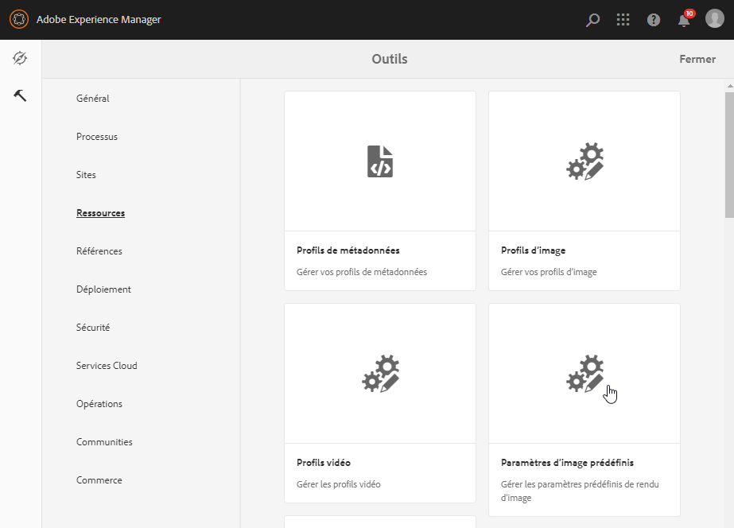
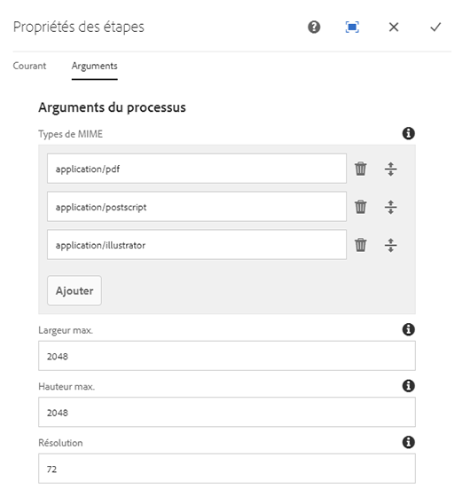
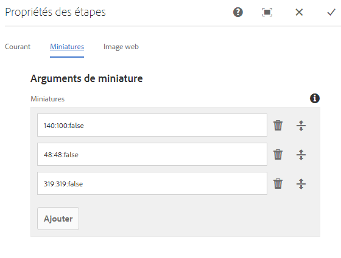
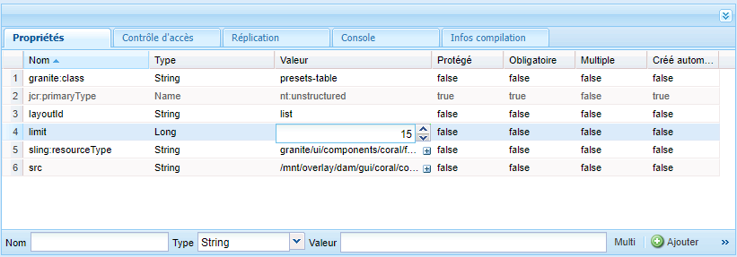
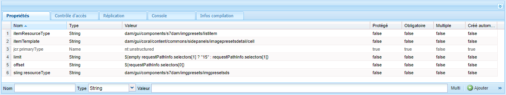
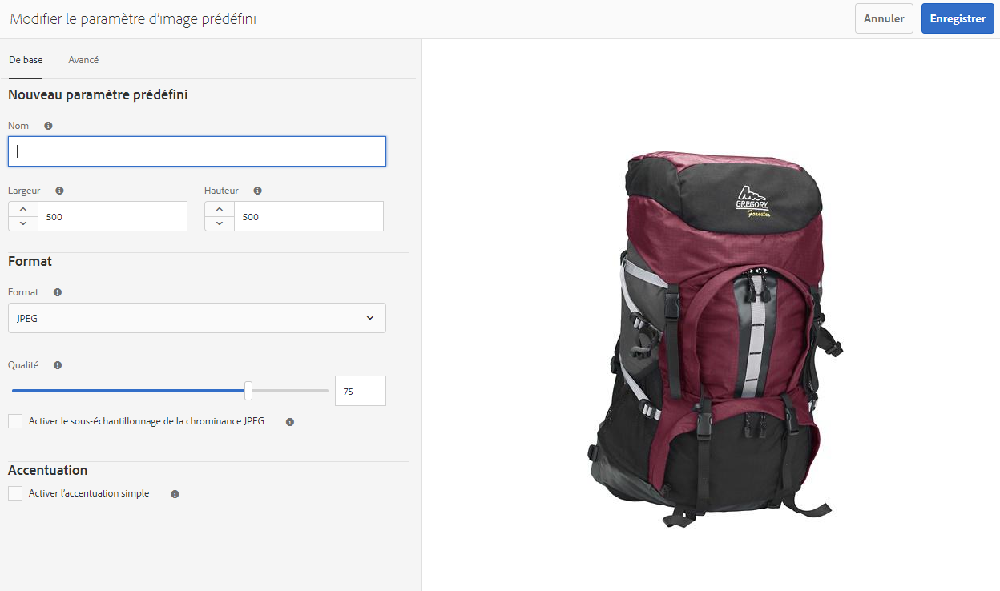
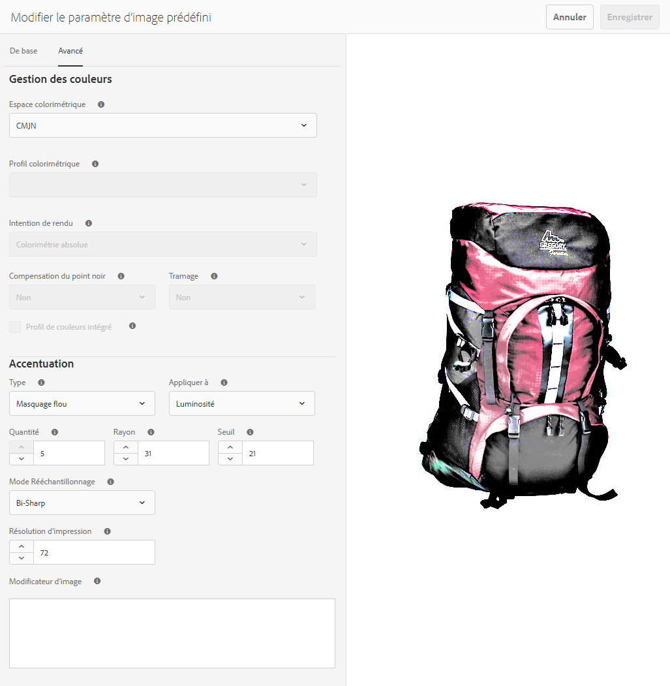
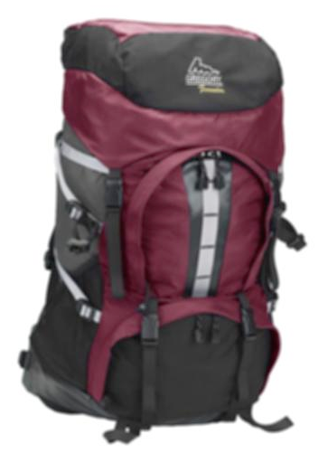
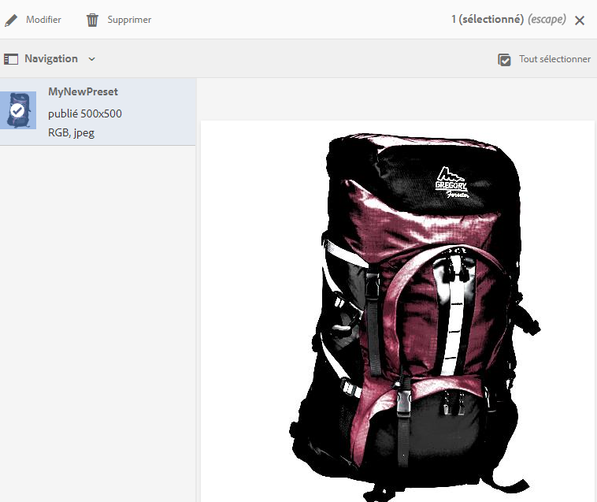

# Gestion des paramètres d’image prédéfinis{#managing-image-presets}

Les paramètres d’image prédéfinis permettent à Adobe Experience Manager Assets de diffuser des images de manière dynamique à différentes tailles, dans différents formats ou avec d’autres propriétés d’image générées dynamiquement. Chaque paramètre d’image prédéfini représente un ensemble prédéfini de commandes de dimensionnement et de mise en forme pour l’affichage des images. Lorsque vous créez un paramètre d’image prédéfini, vous choisissez une taille pour la diffusion de l’image. Vous pouvez également choisir des commandes de mise en forme afin d’optimiser l’apparence de l’image lors de sa diffusion.

Les administrateurs peuvent créer des paramètres prédéfinis pour l’exportation de fichiers. Les utilisateurs peuvent choisir un paramètre prédéfini lors de l’exportation d’images, qui reformate également les images selon les spécifications définies par l’administrateur.

Vous pouvez également créer des paramètres d’image prédéfinis réactifs. Si vous appliquez un paramètre prédéfini réactif d’image à vos ressources, il varie en fonction de l’appareil ou de la taille d’écran sur lequel elles sont affichées. Vous pouvez configurer les paramètres d’image prédéfinis de manière à utiliser CMJN dans l’espace colorimétrique, en plus de RGB ou de Gris.

Cette section décrit comment créer, modifier et généralement gérer les paramètres d’image prédéfinis. Vous pouvez appliquer un paramètre d’image prédéfini à une image à chaque fois que vous la prévisualisez. Voir [Application de paramètres d’image prédéfinis](/help/assets/dynamic-media/image-presets.md).

>[!NOTE]
>
>L’imagerie dynamique fonctionne avec vos paramètres d’image prédéfinis existants et utilise les informations disponibles à la dernière milliseconde de diffusion pour réduire davantage la taille du fichier image en fonction de la vitesse de connexion du navigateur ou du réseau. Voir [Imagerie numérique](/help/assets/dynamic-media/imaging-faq.md) pour plus d’informations.

## En savoir plus sur les paramètres d’image prédéfinis {#understanding-image-presets}

Tout comme une macro, un paramètre d’image prédéfini est un ensemble prédéfini de commandes de dimensionnement et de formatage enregistrées sous un nom. Pour comprendre le fonctionnement des paramètres d’image prédéfinis, supposons que votre site web exige que chaque image du produit s’affiche dans des tailles, des formats et des taux de compression différents pour une diffusion sur les ordinateurs de bureau et les appareils mobiles.

Vous pouvez créer deux paramètres d’image prédéfinis : 500 x 500 pixels pour le bureau et 150 x 150 pixels pour le mobile. Vous créez deux paramètres d’image prédéfinis, l’un appelé `Enlarge` pour afficher des images à 500 x 500 pixels et l’autre appelé `Thumbnail` pour afficher des images à 150 x 150 pixels. Pour diffuser des images au format `Enlarge` et `Thumbnail`, Experience Manager trouve la définition des `Enlarge Image Preset` et des `Thumbnail Image Preset`. Ensuite, Experience Manager génère de manière dynamique une image dont la taille et le format correspondent à chaque paramètre d’image prédéfini.

Les images dont la taille est réduite lorsqu’elles sont diffusées dynamiquement peuvent perdre en netteté et en détail. C’est pourquoi chaque paramètre d’image prédéfini contient des commandes de mise en forme pour optimiser une image lorsqu’elle est diffusée à une taille spécifique. Ces commandes garantissent que vos images sont nettes et claires lorsqu’elles sont diffusées sur votre site web ou dans votre application.

Les administrateurs et administratrices peuvent créer des paramètres d’image prédéfinis. Pour créer un paramètre d’image prédéfini, vous pouvez commencer à partir de zéro ou à partir d’un paramètre existant et l’enregistrer sous un nouveau nom.

## Gestion des paramètres d’image prédéfinis {#managing-image-presets-1}

La gestion des paramètres d’image prédéfinis dans Experience Manager s’effectue en sélectionnant le logo Experience Manager pour accéder à la console de navigation globale, puis en sélectionnant l’icône Outils et en accédant à **[!UICONTROL Assets]** > **[!UICONTROL Paramètres d’image prédéfinis]**.



>[!NOTE]
>
>Tous les paramètres d’image prédéfinis que vous créez sont également disponibles en tant que rendus dynamiques lorsque vous prévisualisez ou diffusez des ressources.
>
>Vous n’avez *besoin* publier les paramètres d’image prédéfinis, car ils sont automatiquement publiés.
>
>Voir [Publication de paramètres d’image prédéfinis](#publishing-image-presets).

>[!NOTE]
>
>Le système affiche différents rendus lorsque vous sélectionnez **[!UICONTROL Rendus]** dans l’affichage des détails d’une ressource. Vous pouvez augmenter ou réduire le nombre de paramètres d’image prédéfinis affichés. Voir [Augmentation du nombre de paramètres d’image prédéfinis affichés](#increasing-or-decreasing-the-number-of-image-presets-that-display).

## Association des paramètres d’image prédéfinis aux rendus {#how-image-presets-relate-to-renditions}

Les paramètres d’image prédéfinis définissent la manière dont Dynamic Media diffuse les images, notamment le dimensionnement, la mise en forme, la compression et d’autres paramètres d’affichage. Les paramètres prédéfinis ne génèrent pas de rendus eux-mêmes. Au lieu de cela, ils s’appuient sur des rendus créés lors du traitement des ressources.

### Génération de rendu dans AEM as a Cloud Service{#rendition-generation-in-aemaacs}

Dans AEM as a Cloud Service, les rendus sont générés à l’aide des **microservices de ressources**. Le workflow Ressource de mise à jour de la gestion des ressources numériques ne peut pas être personnalisé dans Cloud Service.

Les points importants à prendre en compte sont les suivants :

* Les rendus sont générés au moment du chargement.
* Les modifications apportées à un profil de traitement affectent les ressources nouvellement chargées. Les ressources existantes doivent être retraitées si de nouveaux rendus sont requis.
* La personnalisation du modèle de workflow n’est pas prise en charge dans AEM as a Cloud Service pour la génération du rendu.

Les paramètres d’image prédéfinis font référence aux rendus disponibles au moment de la diffusion. Assurez-vous que les rendus requis existent avant de configurer ou d’utiliser des paramètres d’image prédéfinis.

**Pour contrôler les rendus générés, procédez comme suit**

1. Créer ou modifier un [profil de traitement](https://experienceleague.adobe.com/fr/docs/experience-manager-cloud-service/content/assets/manage/asset-microservices-configure-and-use#).
2. Configurez les définitions de rendu requises.
3. Appliquez le profil de traitement au dossier approprié.

Lorsque des ressources sont chargées dans un dossier auquel un profil de traitement est appliqué, les microservices de ressources génèrent automatiquement les rendus définis.

<!--
### Adobe Illustrator (AI), PostScript&reg; (EPS), and PDF file formats {#adobe-illustrator-ai-postscript-eps-and-pdf-file-formats}

If you intend to support the ingestion of AI, EPS, and PDF files so that you can generate dynamic renditions of these file formats, review the following information before you create Image Presets.

Adobe Illustrator's file format is a variant of PDF. The main differences, in the context of Experience Manager Assets, are the following:

* Adobe Illustrator documents consist of a single page with multiple layers. Each layer is extracted as a PNG subasset under the main Illustrator asset.
* PDF documents consist of one or more pages. Each page is extracted as a single page PDF subasset under the main multi-page PDF document.

The `Create Sub Asset process` component creates the subassets within the overall `DAM Update Asset` workflow. To see this process component within the workflow, navigate to **[!UICONTROL Tools]** > **[!UICONTROL Workflow]** > **[!UICONTROL Models]** > **[!UICONTROL DAM Update Asset]** > **[!UICONTROL Edit]**.

See also [Viewing pages of a multi-page file](/help/assets/manage-linked-subassets.md#view-pages-of-a-multi-page-file).

You can view the subassets or the pages when you open the asset, select the Content menu, and select **[!UICONTROL Subassets]** or **[!UICONTROL Pages]**. The subassets are real assets. The `Create Sub Asset` workflow component extracts the PDF pages. They are then stored as `page1.pdf`, `page2.pdf`, and so on, below the main asset. After they are stored, the `DAM Update Asset` workflow processes them.

To use Dynamic Media to preview and generate dynamic renditions for AI, EPS or PDF files, the following processing steps are required:

1. In the `DAM Update Asset` workflow, the `Rasterize PDF/AI Image Preview Rendition` process component rasterizes the first page of the original asset &ndash; using the configured resolution &ndash; into a `cqdam.preview.png` rendition.

1. The `Dynamic Media Process Image Assets` process component within the workflow optimizes the `cqdam.preview.png` rendition into a PTIFF.

>[!NOTE]
>
>In the DAM Update Asset workflow, the **[!UICONTROL EPS thumbnails]** step generates thumbnails for EPS files.

#### PDF/AI/EPS asset metadata properties {#pdf-ai-eps-asset-metadata-properties}

| **Metadata property** |**Description** |
|---|---|
| `dam:Physicalwidthininches` |Document width in inches. |
| `dam:Physicalheightininches` |Document height in inches. |

You access `Rasterize PDF/AI Image Preview Rendition` process component options by way of the `DAM Update Asset` workflow.

Select Adobe Experience Manager in the upper left, the click **[!UICONTROL Tools]** > **[!UICONTROL Workflow]** > **[!UICONTROL Models]**. On the Workflow Models page, select **[!UICONTROL DAM Update Asset]**, then on the toolbar select **[!UICONTROL Edit]**. On the DAM Update Asset workflow page, double-select the `Rasterize PDF/AI Image Preview Rendition` process component to open its Step Properties dialog box.

#### Rasterize PDF/AI Image Preview Rendition options {#rasterize-pdf-ai-image-preview-rendition-options}



Arguments to rasterize PDF or AI workflow

|Process Argument | Default setting | Description |
|---|---|---|
| Mime Types | application/pdf<br>application/postscript<br>application/illustrator| List of document mime-types that are considered to be PDF or Illustrator documents. |
| Max Width | 2048 | Maximum width of the generated preview rendition, in pixels.|
| Max Height | 2048| Maximum height of the generated preview rendition, in pixels. |
| Resolution | 72 | Resolution to rasterize the first page, in ppi (pixels per inch). |

Using the default process arguments, the first page of a PDF/AI document is rasterized at 72 ppi and the generated preview image is sized at 2048 x 2048 pixels. For a typical deployment, you can increase the resolution to a minimum of 150 ppi or more. For example, a US letter size document at 300 ppi requires a maximum width and height of 2550 x 3300 pixels, respectively.

Max Width and Max Height limit the resolution at which to rasterize. For example, if the maximums are unchanged, and Resolution is set to 300 ppi, a US Letter document is rasterized at 186 ppi. That is, the document is 1581 x 2046 pixels.

The `Rasterize PDF/AI Image Preview Rendition` process component has a maximum defined to ensure that it does not create overly large images in memory. Such large images can overflow the memory provided to the JVM (Java&trade; Virtual Machine). Care must be taken to provide the JVM with enough memory to manage the configured number of parallel workflows, with each having the potential to create an image at the maximum configured size. -->

<!--
### InDesign (INDD) file format {#indesign-indd-file-format}

If you intend to support the ingestion of INDD files so that you can generate dynamic rendition of this file format, review the following information before you create Image Presets.

For InDesign files, sub assets are extracted only if the Adobe InDesign Server is integrated with Experience Manager. Referenced assets are linked based on their metadata. InDesign Server is not required for linking. However, the referenced assets must be present within Experience Manager before the InDesign files are processed for the links to be created between the InDesign files and the referenced assets.

See [Integrate Experience Manager Assets with InDesign Server](/help/assets/indesign.md).

The Media Extraction process component in the `DAM Update Asset` workflow runs several pre-configured Extend Scripts to process InDesign files.


The ExtendScript paths in the arguments of the Media Extraction process component in the DAM Update Asset workflow.

The following scripts are used by Dynamic Media integration:


|ExtendScript name | Default | Description |
|---|---|---|
| ThumbnailExport.jsx | Yes  | Generates a 300 PPI `thumbnail.jpg` rendition that is optimized and turned into a PTIFF rendition by `Dynamic Media Process Image Assets` process component.  |
| JPEGPagesExport.jsx | Yes | Generates a 300 PPI JPEG subasset for each page. The JPEG subasset is a real asset stored under the InDesign asset. The `DAM Update Asset` workflow optimizes and converts it into a PTIFF. |
| PDFPagesExport.jsx | No | Generates a PDF subasset for each page. The PDF subasset gets processed as described earlier. Because the PDF contains a single page only, no subassets are generated. |
-->

<!--
### Configure the image thumbnail size {#configuring-image-thumbnail-size}

You can configure the size of thumbnails by configuring those settings in the **[!UICONTROL DAM Update Asset]** workflow. There are two steps in the workflow where you can configure the thumbnail size of image assets. One (**[!UICONTROL Dynamic Media Process Image Assets]**) is used for dynamic image assets. The other (**[!UICONTROL Process Thumbnails]**) is used for static thumbnail generation or when all other processes fail to generate thumbnails. Regardless, *both* must have the same settings.

The **[!UICONTROL Dynamic Media Process Image Assets]** step uses the image server to generate thumbnails, independently of the configuration applied to the **[!UICONTROL Process Thumbnails]** step. Generating thumbnails through the **[!UICONTROL Process Thumbnails]** step is the slowest and most memory intensive way to create thumbnails.

Thumbnail sizing is defined in the following format: **[!UICONTROL width:height:center]**, for example, `80:80:false`. The width and height determine the size in pixels of the thumbnail. The center value is either false or true. If set to true, it indicates that the thumbnail image has exactly the size given in the configuration. If the resized image is smaller, it is centered within the thumbnail.

>[!NOTE]
>
>* Thumbnail sizes for EPS files are configured in the **[!UICONTROL EPS thumbnails]** step, in the **[!UICONTROL Arguments]** tab under Thumbnails.
>
>* Thumbnail sizes for videos are configured in the **[!UICONTROL FFmpeg thumbnails]** step, in the **[!UICONTROL Process]** tab under **[!UICONTROL Arguments]**.
>

**To configure the image thumbnail size:**

1. Navigate to **[!UICONTROL Tools]** > **[!UICONTROL Workflow]** > **[!UICONTROL Models]** > **[!UICONTROL DAM Update Asset]** > **[!UICONTROL Edit]**.
1. Select the **[!UICONTROL Dynamic Media Process Image Assets]** step and select the **[!UICONTROL Thumbnails]** tab. Change the thumbnail size, as needed, then select **[!UICONTROL OK]**.

   

1. Select the **[!UICONTROL Process Thumbnails]** step, then select the **[!UICONTROL Thumbnails]** tab. Change the thumbnail size, as needed, then select **[!UICONTROL OK]**.

   >[!NOTE]
   >
   >The values in the thumbnails argument in the **[!UICONTROL Process Thumbnails]** step must match the thumbnails argument in the **[!UICONTROL Dynamic Media Process Image Assets]** step.

1. Select **[!UICONTROL Save]** to save the changes to the workflow.
-->

### Augmentation du nombre de paramètres d’image prédéfinis affichés {#increasing-or-decreasing-the-number-of-image-presets-that-display}

Les paramètres d’image prédéfinis que vous créez sont disponibles sous la forme de rendus dynamiques lorsque vous prévisualisez des ressources. Experience Manager affiche différents rendus dynamiques lors de l’affichage d’un fichier à partir de **[!UICONTROL Affichage des détails > Rendus]**. Vous pouvez augmenter ou diminuer la limite des rendus affichés.

**Pour augmenter ou diminuer le nombre de paramètres d’image prédéfinis affichés :**

1. Accédez à CRXDE Lite ([https://localhost:4502/crx/de](https://localhost:4502/crx/de)).
1. Accédez au nœud de liste des paramètres d’image prédéfinis à l’adresse `/libs/dam/gui/coral/content/commons/sidepanels/imagepresetsdetail/imgagepresetslist`

   

1. Dans la propriété **[!UICONTROL limit]**, définissez la valeur de votre choix dans la colonne **[!UICONTROL Valeur]** ; par défaut, elle est définie sur 15.
1. Accédez à la source de données des paramètres d’image prédéfinis à l’adresse `/libs/dam/gui/coral/content/commons/sidepanels/imagepresetsdetail/imgagepresetslist/datasource`

   

1. Dans la propriété de limite, remplacez le nombre par le nombre souhaité, par exemple, `{empty requestPathInfo.selectors[1] ? "20" : requestPathInfo.selectors[1]}`.
1. Sélectionnez **[!UICONTROL Enregistrer tout]**.

### Création de paramètres d’image prédéfinis {#creating-image-presets}

Créez des paramètres d’image prédéfinis afin de pouvoir appliquer les paramètres de manière cohérente sur les images lorsque vous prévisualisez ou publiez.

>[!NOTE]
>
>Si vous utilisez Internet Explorer 9, un paramètre prédéfini nouvellement créé n’apparaît pas immédiatement dans la liste après l’enregistrement. Pour contourner ce problème, désactivez le cache d’Internet Explorer 9.

Si vous avez l’intention de prendre en charge l’assimilation de fichiers AI, PDF et EPS afin de pouvoir générer des rendus dynamiques de ces formats de fichiers, consultez les informations suivantes avant de créer des paramètres d’image prédéfinis.

Voir [Formats de fichiers Adobe Illustrator (AI), PostScript® (EPS) et PDF](#adobe-illustrator-ai-postscript-eps-and-pdf-file-formats).

Si vous envisagez de prendre en charge l’assimilation de fichiers INDD de manière à pouvoir générer un rendu dynamique de ce format de fichier, consultez les informations suivantes avant de créer des paramètres d’image prédéfinis.

Voir [Format de fichier InDesign (INDD)](#indesign-indd-file-format).

**Pour créer des paramètres d’image prédéfinis :**

1. Dans Experience Manager, sélectionnez le logo Experience Manager pour accéder à la console de navigation globale, puis accédez à **[!UICONTROL Outils]** > **[!UICONTROL Ressources]** > **[!UICONTROL Paramètres d’image prédéfinis]**.
1. Sélectionnez **[!UICONTROL Créer]**.

   

   >[!NOTE]
   >
   >Pour rendre ce paramètre prédéfini d’image réactif, effacez les valeurs des champs **[!UICONTROL largeur]** et **[!UICONTROL hauteur]** et laissez-les vides.

1. Dans la fenêtre **[!UICONTROL Modifier le paramètre d’image prédéfini]**, saisissez les valeurs adéquates dans les onglets **[!UICONTROL De base]** et **[!UICONTROL Avancé]**, notamment un nom. Les options sont décrites dans [Options d’image prédéfinies](#image-preset-options). Les paramètres prédéfinis s’affichent dans le volet de gauche et peuvent être utilisés à la volée avec d’autres ressources.

   

1. Sélectionnez **[!UICONTROL Enregistrer]**.

### Création d’un paramètre d’image prédéfini réactif {#creating-a-responsive-image-preset}

Pour créer un paramètre prédéfini réactif d’image, suivez la procédure décrite dans la section [Création de paramètres prédéfinis d’image](#creating-image-presets). Lorsque vous saisissez la hauteur et la largeur dans la fenêtre **[!UICONTROL Modifier le paramètre d’image prédéfini]**, effacez les valeurs et laissez-les vides.

Si vous ne les renseignez pas, Experience Manager reçoit un message indiquant que ce paramètre d’image prédéfini est réactif. Vous pouvez, le cas échéant, ajuster les autres valeurs.

>[!NOTE]
>
>Pour que les boutons **[!UICONTROL URL]** et **[!UICONTROL RESS]** s’affichent lors de l’application d’un paramètre prédéfini d’image à une ressource, celle-ci doit être publiée.
>
>
>
>Les paramètres d’image prédéfinis et les ressources d’images sont automatiquement publiés.

### Options des paramètres d’image prédéfinis {#image-preset-options}

Lorsque vous créez ou modifiez des paramètres d’image prédéfinis, vous disposez des options décrites dans cette section. En outre, Adobe recommande les options suivantes (correspondant aux « bonnes pratiques ») pour commencer :

* **[!UICONTROL Format]** (onglet **[!UICONTROL De base]**) : sélectionnez **[!UICONTROL JPEG]** ou un autre format adapté à vos exigences. Tous les navigateurs web prennent en charge le format d’image JPEG ; il offre un bon compromis entre les petites tailles de fichiers et la qualité de l’image. Cependant, les images au format JPEG utilisent un schéma de compression avec perte qui peut introduire des artefacts d’image indésirables si le paramètre de compression est trop bas. C’est pourquoi Adobe recommande de définir la qualité de compression sur 75. Ce paramètre offre un bon équilibre entre la qualité d’image et la taille de fichier réduite.

* **[!UICONTROL Activer l’accentuation simple]** : ne sélectionnez pas l’option **[!UICONTROL Activer l’accentuation simple]** (ce filtre d’accentuation est moins précis que les paramètres Accentuation).

* **[!UICONTROL Accentuation : Mode Rééchantillonnage]** : sélectionnez l’option **[!UICONTROL Sharp2]**.

#### Options de l’onglet De base {#basic-tab-options}

| Champ | Description |
| --- | --- |
| **Nom** | Entrez un nom descriptif sans espaces. Pour aider les utilisateurs à identifier ce paramètre d’image prédéfini, incluez la spécification de taille d’image dans le nom. |
| **Largeur et hauteur** | Saisissez la taille (en pixels) à laquelle l’image est diffusée. La largeur et la hauteur doivent être supérieures à 0 pixel. Si l’une des valeurs est 0, aucun préréglage n’est créé. Si les deux valeurs sont vides, un paramètre d’image prédéfini réactif est créé. |
| **Format** | Sélectionnez un format dans le menu.<br>Choisir **JPEG** offre les autres options suivantes :<br>• **Qualité** - L’échelle de qualité JPEG s’étend de 1 à 100. L’échelle est visible lorsque vous faites glisser le curseur.<br>· **Activer le sous-échantillonnage de la chrominance JPG** - L’œil étant moins sensible aux informations de couleur haute fréquence que la luminance haute fréquence, les images JPEG divisent les informations d’image en luminance et en composants de couleur. Lorsqu’une image JPEG est compressée, la composante de luminance est laissée à la résolution maximale, tandis que les composantes de couleur sont sous-échantillonnées en calculant la moyenne de groupes de pixels. Le sous-échantillonnage réduit le volume de données à la moitié ou au tiers, avec un impact minimal sur la qualité perçue. Le sous-échantillonnage ne s’applique pas aux images en niveaux de gris. Cette technique réduit le taux de compression utile pour les images à fort contraste (par exemple, les images avec texte superposé).<br><br>Choisir **GIF** ou **GIF avec couche alpha** offre les options supplémentaires de **Quantification de couleurs GIF** suivantes :<br>• **Type** : Sélectionnez **Adaptatif** (par défaut), **Web** ou **Macintosh**. Si vous sélectionnez **GIF avec couche alpha**, l’option Macintosh n’est pas disponible.<br>• **Juxtaposition** : sélectionnez **Diffus** ou **Désactivé**.<br>• **Nombre de couleurs** : saisissez un nombre compris entre 2 et 256.<br>· **Liste de couleurs** - Saisissez une liste séparée par des virgules. Par exemple, pour blanc, gris et noir, saisissez `000000,888888,ffffff`.<br><br>Si vous sélectionnez **PDF**, **TIFF** ou **TIFF avec couche alpha**, cette option supplémentaire est proposée :<br>• **Compression** : Sélectionnez un algorithme de compression. Les options d’algorithme pour le format PDF sont **Aucun**, **Zip** et **Jpeg**. Les options pour le format TIFF sont **Aucun**, **LZW**, **Jpeg** et **Zip**. Les options pour le format TIFF avec couche alpha sont **Aucun**, **LZW** et **Zip**.<br><br>Aucune option supplémentaire n’est fournie si vous sélectionnez **PNG**, **PNG avec couche alpha** ou **EPS**. |
| **Accentuation** | Sélectionnez l’option **Activer l’accentuation simple** pour appliquer un filtre d’accentuation de base à l’image à l’issue des opérations de mise à l’échelle. L’accentuation peut compenser le flou produit lors de l’affichage d’une image à une taille différente. |

#### Options de l’onglet Avancé {#advanced-tab-options}

<table>
 <tbody>
  <tr>
   <td><strong>Champ</strong></td>
   <td><strong>Description</strong></td>
  </tr>
  <tr>
   <td><strong>Espace colorimétrique</strong></td>
   <td>Sélectionnez l’espace colorimétrique <strong>RVB, CMJN</strong> ou <strong>Niveaux de gris</strong>.</td>
  </tr>
  <tr>
   <td><strong>Profil colorimétrique</strong></td>
   <td>Sélectionnez le profil de l’espace colorimétrique de sortie dans lequel vous souhaitez que la ressource soit convertie s’il diffère du profil en cours d’utilisation.</td>
  </tr>
  <tr>
   <td><strong>Intention de rendu</strong></td>
   <td>Vous pouvez remplacer l’intention de rendu par défaut. Les intentions de rendu déterminent ce qui arrive aux couleurs qui ne peuvent pas être reproduites dans le profil colorimétrique cible (hors gamme). L’intention de rendu est ignorée si elle n’est pas compatible avec le profil ICC.
    <ul>
     <li>Sélectionnez <strong>Perception</strong> pour compresser la gamme totale d’un espace colorimétrique dans un autre lorsqu’une ou plusieurs couleurs de l’image d’origine se situent en dehors de la gamme de l’espace colorimétrique de destination.</li>
     <li>Sélectionnez <strong>Colorimétrie relative</strong> lorsqu’une couleur de l’espace colorimétrique actuel se situe hors de la gamme des couleurs dans l’espace cible. Vous pouvez également la mapper à la gamme de couleurs cible la plus proche sans modifier les autres couleurs. </li>
     <li>Sélectionnez <strong>Saturation</strong> si vous voulez reproduire la saturation des couleurs de l’image d’origine lors de sa conversion dans l’espace colorimétrique cible. </li>
     <li>Sélectionnez <strong>Colorimétrie absolue</strong> pour faire correspondre exactement les couleurs sans aucun ajustement pour le point blanc ou noir qui altérerait la luminosité de l’image.</li>
    </ul> </td>
  </tr>
  <tr>
   <td><strong>Compensation du point noir</strong></td>
   <td>Sélectionnez cette option si le profil de sortie prend en charge cette fonctionnalité. La compensation du point noir est ignorée si elle n’est pas compatible avec le profil ICC spécifié.</td>
  </tr>
  <tr>
   <td><strong>Tramage</strong></td>
   <td>Sélectionnez cette option pour éviter ou réduire les éventuels artefacts de bandes de couleurs. </td>
  </tr>
  <tr>
   <td><strong>Type d’accentuation</strong></td>
   <td><p>Sélectionnez <strong>Aucun</strong>, <strong>Accentuer</strong> ou <strong>Accentuation</strong>. </p>
    <ul>
     <li>Sélectionnez <strong>Aucun</strong> si vous souhaitez désactiver l’accentuation.</li>
     <li>Sélectionnez l’option <strong>Accentuer</strong> pour appliquer un filtre d’accentuation de base à l’image à l’issue des opérations de mise à l’échelle. L’accentuation peut compenser le flou produit lors de l’affichage d’une image à une taille différente. </li>
     <li>Sélectionnez <strong> Accentuation </strong> si vous souhaitez affiner l’effet d’un filtre d’accentuation sur l’image finale à résolution réduite. Vous pouvez contrôler l’intensité de l’effet, le rayon de l’effet (mesuré en pixels) et un seuil de contraste qui est ignoré. Cet effet utilise les mêmes options que le filtre Photoshop « Accentuation ».</li>
    </ul> <p>L’option <strong>Accentuation</strong> propose les options suivantes :</p>
    <ul>
     <li><strong>Quantité</strong> : contrôle le degré de contraste appliqué aux pixels de contour. La valeur réelle par défaut est de 1,0. Pour les images à haute résolution, vous pouvez l’augmenter jusqu’à 5,0. Envisagez la quantité comme une mesure de l’intensité du filtre.</li>
     <li><strong>Rayon</strong> : détermine le nombre de pixels entourant les pixels de contour qui affectent l’accentuation. Pour les images haute résolution, entrez un nombre réel compris entre 1 et 2. Une valeur faible accentue uniquement les pixels de contour. Une valeur élevée accentue une bande plus large de pixels. La valeur correcte dépend de la taille de l’image.</li>
     <li><strong>Seuil</strong> - Détermine la plage de contraste à ignorer lorsque le filtre d’accentuation est appliqué. En d’autres termes, cette option définit le degré d’accentuation des pixels qui doit différer de la zone environnante pour être considérés comme des pixels de contour et accentués. Pour éviter d’introduire du bruit, essayez des valeurs comprises entre 2 et 20. </li>
     <li><strong>Appliquer à</strong> : détermine si l’accentuation s’applique à chaque couleur ou à la luminosité.</li>
    </ul>
    <div>
      L’accentuation est décrite dans la vidéo
     <a href="https://experienceleague.adobe.com/fr/docs/experience-manager-learn/assets/dynamic-media/images/dynamic-media-image-sharpening-feature-video-use#dynamic-media">Utilisation de l’accentuation des images avec Experience Manager Dynamic Media</a>, dans la rubrique d’aide en ligne <a href="https://experienceleague.adobe.com/fr/docs/dynamic-media-classic/using/master-files/sharpening-image#master-files">Accentuation d’une image</a> et dans le fichier téléchargeable au format PDF <a href="https://experienceleague.adobe.com/docs/dynamic-media-classic/assets/s7_sharpening_images.pdf?lang=fr">Bonnes pratiques pour l’accentuation des images dans Dynamic Media Classic</a>.
    </div> </td>
  </tr>
  <tr>
   <td><strong>Mode Rééchantillonnage</strong></td>
   <td>Sélectionnez une option <strong>Mode Rééchantillonnage</strong>. Ces options accentuent l’image lorsque sa résolution est réduite :
    <ul>
     <li><strong>Bilinéaire</strong> : il s’agit de la méthode de rééchantillonnage la plus rapide. Certains artefacts de crénelage sont visibles.</li>
     <li><strong>Bicubique</strong> : accroît l’utilisation du processeur, mais produit des images plus nettes avec des artefacts de crénelage plus discrets.</li>
     <li><strong>Sharp2</strong> : cette méthode peut produire des images légèrement plus nettes que celles obtenues avec l’option Bicubique, en sollicitant toutefois davantage le processeur.</li>
     <li><strong>Bi-Sharp</strong> : permet de sélectionner le rééchantillonneur Photoshop par défaut utilisé pour réduire la taille de l’image ; cette option se nomme <strong>Bicubique plus net</strong> dans Adobe Photoshop.</li>
     <li><strong>Chaque couleur</strong> et <strong>Luminosité</strong> – Chaque méthode peut être basée sur la couleur ou la luminosité. Par défaut, l’option <strong>Chaque couleur</strong> est sélectionnée.</li>
    </ul> </td>
  </tr>
  <tr>
   <td><strong>Résolution d’impression</strong></td>
   <td>Choisissez une résolution d’impression pour cette image ; 72 pixels est la valeur par défaut.</td>
  </tr>
  <tr>
   <td><strong>Modificateur d’image</strong></td>
   <td><p>Au-delà des paramètres d’image courants disponibles dans l’UI, Dynamic Media prend en charge de nombreuses modifications d’image avancées que vous pouvez spécifier dans le champ <strong>Modificateurs d’images</strong>. Ces paramètres sont définis dans la <a href="https://experienceleague.adobe.com/fr/docs/dynamic-media-developer-resources/image-serving-api/image-serving-api/http-protocol-reference/syntax-and-features/image-serving-http/c-command-overview">référence des commandes du protocole de serveur d’images</a>.</p> <p>Important : La fonctionnalité suivante répertoriée dans l’API n’est pas prise en charge :</p>
    <ul>
     <li>Commandes de base de création de modèles et de rendu de texte : <code>text= textAngle= textAttr= textFlowPath= textFlowXPath= textPath=</code> et <code>textPs=</code></li>
     <li>Commandes de localisation : <code>locale=</code> et <code>req=xlate</code></li>
     <li><code>req=set</code> n’est pas disponible pour l’utilisation générale.</li>
     <li><code>req=mbrset</code></li>
     <li><code>req=saveToFile</code></li>
     <li><code>req=targets</code></li>
     <li><code>template=</code></li>
     <li>Services Dynamic Media non essentiels : SVG, rendu d’image et impression en ligne</li>
    </ul> </td>
  </tr>
 </tbody>
</table>

### Définir des options de paramètre prédéfini d’image à l’aide de modificateurs d’image {#defining-image-preset-options-with-image-modifiers}

Outre les options disponibles dans les onglets Simple et Avancé, vous pouvez définir des modificateurs d’image afin de disposer d’un plus grand nombre d’options lors de la définition de paramètres d’image prédéfinis. Le rendu des images repose sur l’API de rendu d’images de Dynamic Media et est défini en détail dans la [Référence du protocole HTTP](https://experienceleague.adobe.com/fr/docs/dynamic-media-developer-resources/image-serving-api/image-rendering-api/http-protocol-reference/c-ir-introduction#image-rendering-api).

Vous trouverez ci-dessous des exemples de tâches que vous pouvez exécuter à l’aide des modificateurs d’image.

>[!NOTE]
>
>Certains modificateurs d’image [ne peuvent pas être utilisés dans Experience Manager](#advanced-tab-options).

* [op_invert](https://experienceleague.adobe.com/fr/docs/dynamic-media-developer-resources/image-serving-api/image-serving-api/http-protocol-reference/command-reference/r-op-invert) : inverse chaque composant de couleur pour générer un effet d’image négative.

  ```xml {.line-numbers}
  &op_invert=1
  ```

  

* [op_blur](https://experienceleague.adobe.com/fr/docs/dynamic-media-developer-resources/image-serving-api/image-serving-api/http-protocol-reference/command-reference/r-op-blur) : applique un effet de flou à l’image.

  ```xml {.line-numbers}
  &op_blur=7
  ```

  

* Commandes combinées : op_blur et op-invert

  ```xml {.line-numbers}
  &op_invert=1&op_blur=7
  ```

  

* [op_brightness](https://experienceleague.adobe.com/fr/docs/dynamic-media-developer-resources/image-serving-api/image-serving-api/http-protocol-reference/command-reference/r-op-brightness) : augmente ou diminue la luminosité.

  ```xml {.line-numbers}
  &op_brightness=58
  ```

  

* [opac](https://experienceleague.adobe.com/fr/docs/dynamic-media-developer-resources/image-serving-api/image-serving-api/http-protocol-reference/command-reference/r-opac) : permet de régler l’opacité de l’image. Cet attribut vous permet de diminuer l’opacité du premier plan.

  ```xml {.line-numbers}
  opac=29
  ```

  

### Modification des paramètres d’image prédéfinis {#modifying-image-presets}

1. Dans Experience Manager, sélectionnez le logo Experience Manager pour accéder à la console de navigation globale, puis accédez à **[!UICONTROL Outils]** > **[!UICONTROL Ressources]** > **[!UICONTROL Paramètres d’image prédéfinis]**.

   

1. Sélectionnez un paramètre prédéfini, puis **[!UICONTROL Modifier]**. La fenêtre **[!UICONTROL Modifier le paramètre d’image prédéfini]** s’ouvre.
1. Apportez des modifications, puis sélectionnez **[!UICONTROL Enregistrer]** pour les enregistrer ou sur **[!UICONTROL Annuler]** pour les annuler.

### Publication de paramètres d’image prédéfinis {#publishing-image-presets}

Les paramètres d’image prédéfinis sont automatiquement publiés.

### Suppression de paramètres d’image prédéfinis {#deleting-image-presets}

1. Dans Experience Manager, sélectionnez le logo Experience Manager pour accéder à la console de navigation globale, puis sélectionnez l’icône Outils.
1. Accédez à **[!UICONTROL Ressources]** > **[!UICONTROL Paramètres d’image prédéfinis]**.
1. Sélectionnez un paramètre prédéfini, puis sélectionnez **[!UICONTROL Supprimer]**. Dynamic Media vous invite à confirmer la suppression. Sélectionnez **[!UICONTROL Supprimer]** pour supprimer ou sélectionnez **[!UICONTROL Annuler]** pour revenir aux paramètres d’image prédéfinis.
