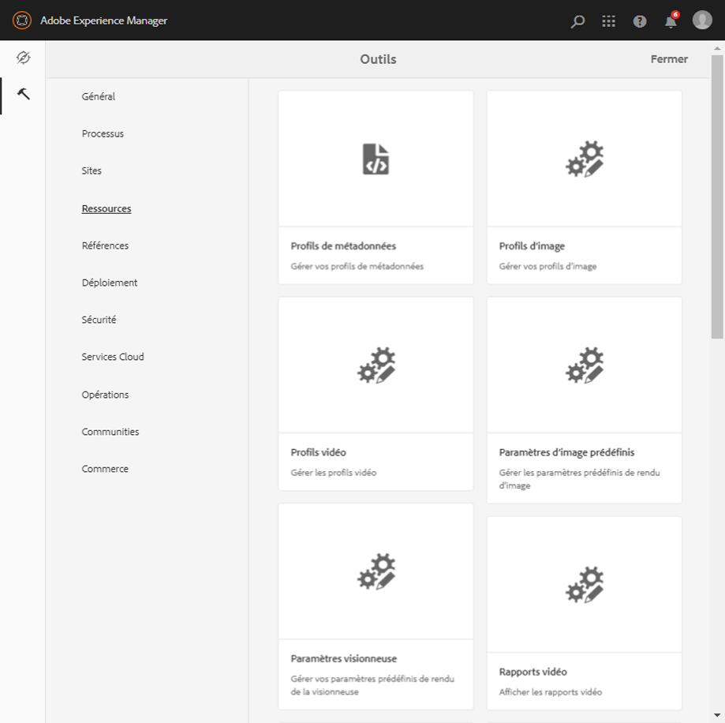
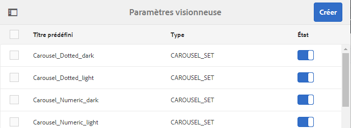

# Gestion des paramètres prédéfinis de visionneuse{#managing-viewer-presets}

Un paramètre prédéfini de visionneuse est un ensemble de paramètres qui déterminent la manière dont les utilisateurs visualisent les fichiers de média enrichi sur leur écran d’ordinateur et leurs périphériques mobiles. Si vous êtes administrateur, vous pouvez créer des paramètres prédéfinis de visionneuse. Les paramètres sont disponibles pour un ensemble d’options de configuration de la visionneuse. Vous pouvez, par exemple, modifier la taille d’affichage ou le comportement de zoom de la visionneuse.

<!-- SDK withdrawn from public view. Available internally only at `http://staging.scene7.com/s7sdk/3.8/docs/jsdoc/symbols/_s7sdk.html` 

For instructions on creating and customizing your own HTML5 viewer presets, see the *Adobe Scene7 HTML5 Viewer SDK*. The SDK is available on the IS publish server embedded in the SDK itself. Each library version has its own SDK documentation included.

Path: `<scene7_domain>/s7sdk/<library_version>/docs/jsdocs/index.html`.
For example, 3.5 SDK: [https://s7d1.scene7.com/s7sdk/3.5/docs/jsdoc/index.html](https://s7d1.scene7.com/s7sdk/3.5/docs/jsdoc/index.html)

-->

Voir aussi le [Guide de référence des visionneuses Adobe](https://docs.adobe.com/content/help/en/dynamic-media-developer-resources/library/home.html).

Cette section décrit comment créer, modifier et gérer les paramètres prédéfinis de visionneuse. Vous pouvez appliquer des paramètres prédéfinis de visionneuse à une image lorsque vous la prévisualisez. Reportez-vous à la section [Application de paramètres de visionneuse prédéfinis](#applying-a-viewer-preset-to-an-asset).

>[!NOTE]
>
>Notez que la modification des *différents paramètres prédéfinis de visionneuse de base* n’est pas un scénario pris en charge. Si vous tentez de modifier un paramètre de visionneuse prédéfini de base, vous serez invité à enregistrer ce paramètre de visionneuse prédéfini en utilisant un nouveau nom.

## Accessibilité clavier pour les visionneuses {#keyboard-accessibility-for-viewers}

Toutes les visionneuses prêtes à l’emploi prennent en charge l’accessibilité clavier.

Voir aussi [Accessibilité clavier et navigation](https://docs.adobe.com/content/help/en/dynamic-media-developer-resources/library/c-keyboard-accessibility.html).

## Gestion des paramètres prédéfinis de visionneuse {#managing-viewer-presets-1}

You can add, edit, delete, publish, unpublish, and preview viewer presets in AEM by tapping **[!UICONTROL Tools** (hammer icon) **[!UICONTROL > Assets > Viewer Presets]**.

>[!NOTE]
>
>Par défaut, le système affiche 15 paramètres de visionneuse prédéfinis lorsque vous sélectionnez Visionneuses dans l’affichage des détails d’une ressource. Vous pouvez augmenter cette limite. Voir [Augmenter le nombre de paramètres de visionneuse prédéfinis affichés](#increasing-the-number-of-viewer-presets-that-display).

### Prise en charge de la visionneuse pour les pages web en responsive design. {#viewer-support-for-responsive-designed-web-pages}

Les diverses pages web ont des besoins différents. Vous aurez parfois besoin d’une page web proposant un lien qui ouvre la visionneuse HTML5 dans une fenêtre de navigateur distincte. Dans d’autres cas, vous aurez peut-être besoin d’intégrer directement la visionneuse HTML5 sur la page d’hébergement. Si c’est le cas, la page web aura peut-être une mise en page statique. Autrement, elle peut être « réactive » et affichée différemment en fonction du périphérique ou de la taille de fenêtre du navigateur. Pour répondre à ces besoins, toutes les visionneuses prédéfinies HTML5 fournies avec Dynamic Media sont compatibles à la fois avec les pages web statiques et les pages web réactives.

Voir [Bibliothèque d’images réactives](https://docs.adobe.com/content/help/en/dynamic-media-developer-resources/image-serving-api/image-serving-api/responsive-static-image-library/c-about-responsive-static-image-library.html) dans l’*aide de l’API de diffusion d’image Scene7* afin d’en savoir plus sur l’intégration des visionneuses réactives sur vos pages web.

>[!NOTE]
>
>Notez que vous devez publier toutes les visionneuses prêtes à l’emploi avant de les utiliser pour la première fois.
>Reportez-vous à la section [Publication de paramètres de visionneuse prédéfinis.](#publishing-viewer-presets)

### Compatibilité du système de paramètres prédéfinis de la visionneuse {#viewer-preset-system-compatibility}

Tous les paramètres de visionneuse prédéfinis fournis avec Dynamic Media sont entièrement compatibles avec les systèmes suivants :

* Ordinateurs de bureau
* iPhone Apple
* iPad Apple
* Smartphone Android
* Tablette Android
* Pour la vidéo, une prise en charge de lecture MP4 supplémentaire est fournie pour [Blackberry](https://developer.blackberry.com/devzone/develop/supported_media/bb_media_support_at_a_glance.html#kba1328730952678) et [Windows Phone](https://msdn.microsoft.com/library/windows/apps/ff462087%28v=vs.105%29.aspx).

### Rich media types for Viewer Presets {#rich-media-types-for-viewer-presets}

Les administrateurs peuvent ajouter et personnaliser les types de contenu multimédia suivants lors de la création de paramètres de visionneuse prédéfinis :

<table>
 <tbody>
  <tr>
   <td><strong>Ensemble de carrousel</strong>  </td>
   <td>
Les zones sensibles ou cliquables, ou les deux, sont ajoutées à une série de deux images ou plus. Un client peut effectuer un panoramique sur les images vers la gauche ou la droite, puis cliquer sur une zone réactive d’une image pour obtenir des détails supplémentaires ou pour effectuer des achats directement depuis la catégorie, la page d’accueil ou les pages d’entrée d’un site Web.
 </td>
  </tr>
  <tr>
   <td><strong>Zoom sur la fenêtre déroulante</strong></td>
   <td>
Affiche une seconde image de la zone agrandie en regard de l’image d’origine. Aucune commande n’est disponible. Il suffit de déplacer la sélection sur la zone à visualiser.
 
Pour déterminer la quantité totale de bande passante allouée à la visionneuse, n’oubliez pas que l’image principale et celle de la fenêtre déroulante sont toutes deux diffusées par la visionneuse. La taille de l’image principale (largeur et hauteur d’affichage) et le facteur de zoom déterminent la taille de la fenêtre déroulante. Pour que la fenêtre déroulante ne devienne pas trop volumineuse, équilibrez ces deux valeurs : si la taille de l’image principale est importante, réduisez la valeur du facteur de zoom. (La largeur et la hauteur de la fenêtre déroulante déterminent la taille de cette dernière, mais pas celle de l’image diffusée par la visionneuse).
 
Par exemple, si la taille de l’image principale est de 350 x 350 pixels et que le facteur de zoom est de 3, la taille d’image de la fenêtre déroulante sera de 1 050 x 1 050 pixels. Si la taille de l’image principale est de 300 x 300 pixels et que le facteur de zoom est de 4, la taille d’image de la fenêtre déroulante sera de 1 200 x 1 200 pixels. Selon la valeur de qualité JPEG sélectionnée (une valeur comprise entre 80 et 90 est recommandée), il est possible de réduire sensiblement la taille du fichier. Selon la taille de l’image principale, un facteur de zoom de 2,5 à 4 est recommandé.
 </td>
  </tr>
  <tr>
   <td><strong>Zoom intégré</strong></td>
   <td>Affiche une image de la zone agrandie dans la visionneuse d’origine. Il n’y a aucune commande à utiliser. Les utilisateurs déplacent simplement la sélection sur la zone à afficher.</td>
  </tr>
  <tr>
   <td><strong>Visionneuse d’images</strong></td>
   <td>Dans la visionneuse d’images, les utilisateurs peuvent voir différentes vues ou variantes de couleur d’un élément en cliquant sur une image miniature. Cette visionneuse propose également des outils de zoom pour examiner les images de plus près.</td>
  </tr>
  <tr>
   <td><strong>Image interactive</strong></td>
   <td>Des zones réactives sont ajoutées à des parties d’une image sur lesquelles un client peut alors cliquer pour obtenir des détails supplémentaires ou pour acheter directement à partir de la catégorie, de la page d’accueil ou des pages d’entrée d’un site Web.</td>
  </tr>
  <tr>
   <td><strong>Vidéo interactive</strong></td>
   <td>Les miniatures sont ajoutées aux segments de la chronologie dans une vidéo sur laquelle un client peut alors cliquer pour obtenir des détails supplémentaires ou pour acheter directement à partir de la catégorie, de la page d’accueil ou des pages d’entrée d’un site Web.</td>
  </tr>
  <tr>
   <td><strong>Supports variés</strong></td>
   <td>Affiche différents types de médias dans une seule visionneuse. Vous pouvez inclure des visionneuses à 360°, des visionneuses d’images, des images et des vidéos.</td>
  </tr>
  <tr>
   <td><strong>Image panoramique</strong></td>
   <td>
Les visionneuses Image panoramique et PanoramicVR effectuent le rendu d’images panoramiques sphériques pour plonger les utilisateurs dans une expérience de visionnage à 360° d’une pièce, d’une propriété, d’un lieu ou d’un paysage.
 
Pour qu’une image téléchargée soit un panorama sphérique, elle doit posséder l’une ou l’autre des propriétés suivantes, ou les deux :

    <ul>
     <li>Un rapport d’aspect de 2:1.</li>
     <li>Avec les mots-clés <code>equirectangular</code>, ou <code>spherical</code> et <code>panorama</code>, ou <code>spherical </code>et <code>panoramic</code>. Voir <a href="/help/sites-cloud/authoring/features/tags.md">Utilisation des balises</a>.</li>
    </ul> 
Les critères de rapport d’aspect et de mots-clés s’appliquent tous deux aux ressources panoramiques pour la page des détails des ressources et le composant WCM « médias panoramiques ».
</td>
  </tr>
  <tr>
   <td><strong>Visionneuse à 360°</strong></td>
   <td>Propose plusieurs vues d’une image afin que les utilisateurs puissent faire pivoter l’objet pour l’examiner sous différents angles.</td>
  </tr>
  <tr>
   <td><strong>Vidéo à 360°</strong></td>
   <td>
Utilisez la visionneuse de vidéos 360/VR afin d’effectuer le rendu de la vidéo équirectangulaire pour une expérience de visionnage immersive d’une pièce, d’une propriété, d’un emplacement, d’un paysage ou d’une procédure médicale.
 
Lors de la lecture sur un écran plat, l’utilisateur contrôle l’angle de vue ; la lecture sur les appareils mobiles utilise généralement les commandes gyroscopiques intégrées.
 
La visionneuse inclut une prise en charge native de la diffusion de ressources vidéo 360. Par défaut, aucune configuration supplémentaire n’est nécessaire pour l’affichage ou la lecture. Vous diffusez une vidéo 360 avec des extensions vidéo standard telles que .mp4, .mkv et .mov. Le codec le plus courant est H.264.
 </td>
  </tr>
  <tr>
   <td><strong>Vidéo</strong></td>
   <td>
Lit la vidéo à l’aide de la diffusion en continu à débit progressif ou adaptatif. La diffusion en continu à débit adaptatif détecte automatiquement l’appareil et la bande passante pour diffuser la vidéo au bon format et dans la qualité correcte.
 </td>
  </tr>
  <tr>
   <td><strong>Zoom vertical</strong></td>
   <td>
La visionneuse Zoom vertical permet d’optimiser l’expérience de visionnage d’une imagerie de produit afin d’offrir aux utilisateurs la meilleure représentation d’un produit. L’emplacement vertical des échantillons présente les avantages suivants :

    <ul>
     <li>Il garantit que les échantillons se trouvent en tête de page. Lorsqu’ils étaient horizontaux, en fonction de la taille de l’écran du poste de travail de l’utilisateur, les échantillons n’étaient pas visibles tant que l’utilisateur ne faisait pas défiler la page vers le bas. Placés verticalement dans la visionneuse, les échantillons sont visibles quelle que soit la taille de l’écran de l’utilisateur.</li>
     <li>Il optimise la taille de l’image principale. Avec les échantillons horizontaux, il est nécessaire de réserver de la place sur la page afin de vous assurer qu’ils sont visibles. Ce positionnement a réduit la taille de l’image principale. Toutefois, avec une disposition verticale des échantillons, vous n’avez pas besoin d’allouer cet espace. Ainsi, vous pouvez agrandir la taille de l’image principale.</li>
    </ul> </td>
  </tr>
  <tr>
   <td><strong>Zoom</strong></td>
   <td>Permet aux utilisateurs d’effectuer un zoom sur la zone en cliquant dessus. Ils peuvent cliquer sur les commandes pour effectuer un zoom avant ou arrière et rétablir la taille par défaut de l’image.</td>
  </tr>
 </tbody>
</table>

### Liste des paramètres de visionneuse prédéfinis de base {#list-of-out-of-the-box-viewer-presets}

Le tableau suivant identifie tous les paramètres de visionneuse prédéfinis prêts à l’emploi fournis avec Dynamic Media.

Voir également [Exemples de bibliothèques de références de visionneuses](https://marketing.adobe.com/resources/help/en_US/s7/vlist/vlist.html) et [Démos en direct](https://landing.adobe.com/en/na/dynamic-media/ctir-2755/live-demos.html).

Pour en savoir plus sur les versions de navigateur web et de système d’exploitation compatibles avec les visionneuses, consultez les notes de mise à jour des visionneuses.

Voir « Notes de mise à jour sur les visionneuses » dans la table des matières du ](https://docs.adobe.com/content/help/en/dynamic-media-developer-resources/library/home.html)Guide de référence des visionneuses[.

>[!NOTE]
>
>Tous les paramètres de visionneuse prédéfinis prêts à l’emploi de Dynamic Media sont déjà activés, mais vous devez les publier.
>Voir [Publication de paramètres de visionneuse prédéfinis](#publishing-viewer-presets).
>
>Les nouveaux paramètres prédéfinis de visionneuse que vous créez et ajoutez doivent être activés *et *publiés.
>Voir [Activation ou désactivation des paramètres de visionneuse prédéfinis](#activating-or-deactivating-viewer-presets) et [Publication de paramètres de visionneuse prédéfinis](#publishing-viewer-presets).

<table>
 <tbody>
  <tr>
   <td><strong>Titre du paramètre prédéfini de la visionneuse</strong></td>
   <td><strong>Type</strong></td>
   <td><strong>Nom de fichier CSS</strong>  </td>
  </tr>
  <tr>
   <td>Carousel_Dotted_dark</td>
   <td>Ensemble_carrousel</td>
   <td><code>html5_carouselviewer_dotted_dark.css</code></td>
  </tr>
  <tr>
   <td>Carousel_Dotted_light</td>
   <td>Ensemble_carrousel</td>
   <td><code>html5_carouselviewer_dotted_light.css</code></td>
  </tr>
  <tr>
   <td>Carousel_Numeric_dark</td>
   <td>Ensemble_carrousel</td>
   <td><code>html5_carouselviewer_numeric_dark.css</code></td>
  </tr>
  <tr>
   <td>Carousel_Numeric_light</td>
   <td>Ensemble_carrousel</td>
   <td><code>html5_carouselviewer_numeric_light.css</code></td>
  </tr>
  <tr>
   <td>Flyout</td>
   <td>Zoom_fenêtre déroulante</td>
   <td><code>html5_flyoutviewer.css</code></td>
  </tr>
  <tr>
   <td>ImageSet_dark</td>
   <td>Visionneuse d’images</td>
   <td><code>html5_zoomviewer_dark.css</code></td>
  </tr>
  <tr>
   <td>ImageSet_light</td>
   <td>Visionneuse d’images</td>
   <td><code>html5_zoomviewer_light.css</code></td>
  </tr>
  <tr>
   <td>InlineMixedMedia_dark</td>
   <td>Supports_variés</td>
   <td><code>html5_inlinemixedmediaviewer_dark.css</code></td>
  </tr>
  <tr>
   <td>InlineMixedMedia_light</td>
   <td>Supports_variés</td>
   <td><code>html5_inlinemixedmediaviewer_light.css</code></td>
  </tr>
  <tr>
   <td>InlineZoom</td>
   <td>Zoom_fenêtre déroulante</td>
   <td><code>html5_inlinezoomviewer.css</code></td>
  </tr>
  <tr>
   <td>MixedMedia_dark</td>
   <td>Supports_variés</td>
   <td><code>html5_mixedmediaviewer_dark.css</code></td>
  </tr>
  <tr>
   <td>MixedMedia_light</td>
   <td>Supports_variés</td>
   <td><code>html5_mixedmediaviewer_light.css</code></td>
  </tr>
  <tr>
   <td>PanoramicImage</td>
   <td>Image_panoramique</td>
   <td><code>html5_panoramicimage.css</code></td>
  </tr>
  <tr>
   <td>PanoramicImageVR</td>
   <td>Image_panoramique</td>
   <td><code>html5_panoramicimage.css</code></td>
  </tr>
  <tr>
   <td>Shoppable_Banner</td>
   <td>Image_interactive</td>
   <td><code>html5_interactiveimage.css</code></td>
  </tr>
  <tr>
   <td>Shoppable_Video_dark</td>
   <td>Vidéo_interactive</td>
   <td><code>html5_interactivevideoviewer_dark.css</code></td>
  </tr>
  <tr>
   <td>Shoppable_Video_light</td>
   <td>Vidéo_interactive</td>
   <td><code>html5_interactivevideovewer_light.css</code></td>
  </tr>
  <tr>
   <td>SpinSet_dark</td>
   <td>Visionneuse_à_360°</td>
   <td><code>html5_spinviewer_dark.css</code></td>
  </tr>
  <tr>
   <td>SpinSet_light</td>
   <td>Visionneuse_à_360°</td>
   <td><code>html5_spinviewer_light.css</code></td>
  </tr>
  <tr>
   <td>
Vidéo
 
(inclut la prise en charge du sous-titrage)
 </td>
   <td>Vidéo</td>
   <td><code>html5_videoviewer.css</code></td>
  </tr>
  <tr>
   <td>
Video360_social
 
(Inclut les commandes de lecture vidéo de base, le rendu vidéo est effectué en mode stéréo, la commande de point de vue manuelle est désactivée mais la commande gyroscopique est activé, et il n’y a pas de fonctions de réseaux sociaux)
 </td>
   <td>Video_360</td>
   <td><code>html5_video360viewersocial.css</code></td>
  </tr>
  <tr>
   <td>
Video360VR
 
(Destiné aux utilisateurs finaux qui utilisent des lunettes de réalité virtuelle. Inclut les commandes de lecture vidéo de base et les fonctions de réseaux sociaux.
 </td>
   <td>Video_360</td>
   <td><code>html5_video360viewer.css</code></td>
  </tr>
  <tr>
   <td>
Video_social
 
(inclut la prise en charge du sous-titrage et des réseaux sociaux)
 </td>
   <td>Vidéo</td>
   <td><code>html5_videoviewersocial.css</code></td>
  </tr>
  <tr>
   <td>Zoom_dark  </td>
   <td>Zoom  </td>
   <td><code>html5_basiczoomviewer_dark.css</code></td>
  </tr>
  <tr>
   <td>Zoom_light  </td>
   <td>Zoom</td>
   <td><code>html5_basiczoomviewer_light.css</code></td>
  </tr>
  <tr>
   <td>ZoomVertical_dark  </td>
   <td>Zoom_vertical</td>
   <td><code>html5_zoomverticalviewer_dark.css</code></td>
  </tr>
  <tr>
   <td>ZoomVertical_light</td>
   <td>Zoom_vertical</td>
   <td><code>html5_zoomverticalviewer_light.css</code></td>
  </tr>
 </tbody>
</table>

### Matrice de gestes pris en charge par les visionneuses mobiles {#supported-mobile-viewers-gestures-matrix}

Le tableau suivant identifie les gestes compatibles avec les visionneuses mobiles pris en charge sur les périphériques iOS, Android 2.x et Android 3.x.

<table>
 <tbody>
  <tr>
   <td><strong>Gestes</strong></td>
   <td><strong>Zoom sur la fenêtre déroulante</strong></td>
   <td><strong>Zoom</strong></td>
   <td><strong>Rotation</strong></td>
  </tr>
  <tr>
   <td>
<strong>Faire glisser</strong>
 </td>
   <td>
Panoramas
 </td>
   <td>
Panoramas
 </td>
   <td>
Panoramas
 </td>
  </tr>
  <tr>
   <td>
<strong>Appuyer</strong>
 </td>
   <td>
Affiche la fenêtre déroulante
 </td>
   <td>
Affiche ou masque l’interface utilisateur
 </td>
   <td>
Affiche ou masque l’interface utilisateur
 </td>
  </tr>
  <tr>
   <td>
<strong>Double pression</strong>
 </td>
   <td>
Ne s’applique pas
 </td>
   <td>
Effectue un zoom avant ou réinitialise
 </td>
   <td>
Effectue un zoom avant ou réinitialise
 </td>
  </tr>
  <tr>
   <td>
<strong>Pincer ouvert</strong>
 </td>
   <td>
Ne s’applique pas
 </td>
   <td>
Zoom avant (iOS et Android 3x uniquement)
 </td>
   <td>
Zoom avant (iOS et Android 3x uniquement)
 </td>
  </tr>
  <tr>
   <td>
<strong>Pincer à proximité</strong>
 </td>
   <td>
Ne s’applique pas
 </td>
   <td>
Zoom arrière (iOS et Android 3x uniquement)
 </td>
   <td>
Zoom arrière (iOS et Android 3x uniquement)
 </td>
  </tr>
  <tr>
   <td>
<strong>Faire glisser</strong>
 </td>
   <td>
Fait défiler la barre d’échantillons
 </td>
   <td>
Fait défiler les images
 </td>
   <td>
Spins
 </td>
  </tr>
  <tr>
   <td>
<strong>Flick</strong>
 </td>
   <td>
Fait défiler la barre d’échantillons
 </td>
   <td>
Fait défiler les images
 </td>
   <td>
Spins
 </td>
  </tr>
 </tbody>
</table>

## Increasing the number of Viewer Presets that display {#increasing-the-number-of-viewer-presets-that-display}

AEM affiche une grande variété de paramètres prédéfinis de visionneuse lors de l’affichage de ressources à partir de **[!UICONTROL Affichage des détails > Visionneuses]**. Vous pouvez augmenter ou diminuer le nombre de visionneuses qui s’affichent.

**Pour augmenter le nombre de paramètres prédéfinis de la visionneuse affichés**

1. Navigate to CRXDE Lite ([https://localhost:4502/crx/de](https://localhost:4502/crx/de)).
1. Accédez au noeud de liste des paramètres prédéfinis de la visionneuse à l’adresse `/libs/dam/gui/coral/content/commons/sidepanels/viewerpresets/viewerpresetslist`

   

1. Dans la propriété **[!UICONTROL limit]**, définissez la valeur de votre choix dans la colonne **[!UICONTROL Valeur]** ; par défaut, elle est définie sur 15.
1. Accédez à la source de données prédéfinies de la visionneuse à l’adresse `/libs/dam/gui/coral/content/commons/sidepanels/viewerpresets/viewerpresetslist/datasource`

   

1. In the limit property, change the number to the desired number, for example `{empty requestPathInfo.selectors[1] ? "20" : requestPathInfo.selectors[1]}`
1. Appuyez sur **[!UICONTROL Enregistrer tout]**.

## Creating a Viewer Preset {#creating-a-new-viewer-preset}

La création de paramètres prédéfinis de visionneuse vous permet d’appliquer divers paramètres afin d’afficher et d’interagir avec les ressources. Toutefois, vous n’avez pas besoin de créer de nouveaux paramètres prédéfinis de visionneuse. Si vous préférez, vous pouvez utiliser les paramètres prédéfinis de visionneuse par défaut fournis avec AEM Assets.

If you choose to create a new viewer preset, after you save it, the viewer&#39;s state is automatically activated (set to **[!UICONTROL On]**) in the Viewer Presets page. Cet état indique qu’elle est visible dans les composants Dynamic Media et Interactive Media, ou dès que vous prévisualisez une image ou une vidéo.

Certains paramètres prédéfinis de la visionneuse bénéficient de paramètres exclusifs qui peuvent affecter l’utilisation et le comportement global de la visionneuse. Selon le paramètre prédéfini de la visionneuse que vous créez, il est souhaitable d’être au fait de ces remarques spéciales.

Voir [Remarques spéciales sur la création d’un paramètre de visionneuse interactive prédéfini](#special-considerations-for-creating-an-interactive-viewer-preset).

Voir [Remarques spéciales sur la création d’un paramètre prédéfini de la visionneuse pour une bannière de carrousel](#special-considerations-for-creating-a-carousel-banner-viewer-preset).

**Pour créer un paramètre prédéfini de visionneuse**

1. In the upper-left corner of AEM, tap the AEM logo, then in the left rail, tap **[!UICONTROL Tools** (hammer icon) **[!UICONTROL > Assets > Viewer Presets**.

   

1. Sur la page Paramètres de visionneuse prédéfinis, dans la barre d’outils, appuyez sur **[!UICONTROL Créer]**.
1. Dans la boîte de dialogue **[!UICONTROL New Viewer Preset** , dans le champ **[!UICONTROL Preset Name]** , saisissez le nom du nouveau paramètre prédéfini. Choisissez un nom avec soin ; il n’est pas modifiable lorsque vous appuyez sur **[!UICONTROL Créer]**.

   Lorsque vous enregistrerez le paramètre prédéfini lors des étapes suivantes, le nom s’affichera sur la page Paramètres de visionneuse prédéfinis sous l’en-tête de colonne « Titre prédéfini ».

1. Dans le menu déroulant Type de Contenu Multimédia enrichi, sélectionnez le type de paramètre de visionneuse prédéfini que vous souhaitez créer puis, dans le coin supérieur droit de la page, appuyez sur **[!UICONTROL Créer]**.

   Voir [Types de contenu multimédia enrichi pour les paramètres de visionneuse prédéfinis](#rich-media-types-for-viewer-presets).

1. Sur la page 	Éditeur de paramètres prédéfinis de la visionneuse, appuyez sur l’onglet **[!UICONTROL Aspect]**.
1. Utilisez l’une des méthodes suivantes :

   * Dans le menu déroulant **[!UICONTROL Type sélectionné]**, sélectionnez un composant dont vous souhaitez personnaliser la conception visuelle. Vous pouvez également appuyer ou cliquer sur n’importe quel élément visuel de la visionneuse afin de le sélectionner pour le configurer.

      L’éditeur visuel vous permet de voir l’effet d’une propriété spécifique sur un style. Il vous suffit de définir ou de modifier une propriété pour immédiatement en visualiser l’effet sur la visionneuse en utilisant l’échantillon à la gauche de l’éditeur.

      The CSS styling properties for each type of viewer preset are described in the any &quot;Customizing *`<viewer name>`* Viewer&quot; Help topic in the [Viewers Reference Guide](https://marketing.adobe.com/resources/help/en_US/s7/viewers_ref/). Par exemple, si vous créez un paramètre de visionneuse prédéfini de type `Mixed_Media`, consultez [Personnalisation des visionneuses de supports variés](https://docs.adobe.com/content/help/en/dynamic-media-developer-resources/library/viewers-aem-assets-dmc/mixed-media/customing-mixed-media/c-html5-mixedmedia-viewer-customizingviewer.html) pour une liste et une description de chaque propriété. 

   * Si vous avez défini des paramètres de style dans un fichier CSS distinct, vous pouvez télécharger le fichier CSS dans AEM Assets. Appuyez sur **[!UICONTROL Importer CSS]** en dessous du menu déroulant du Type sélectionné (vous devrez peut-être faire défiler la page vers le haut pour le voir) afin de trouver le fichier CSS transféré et de l’associer aux paramètres de visionneuse prédéfinis.****

       Lorsque vous importez un fichier CSS, l’éditeur visuel vérifie que le CSS utilise des marqueurs de visionneuse adaptés. For example, if you are creating a Zoom viewer, all the CSS rules you import must be defined using its viewer class name `.s7mixedmediaviewer` defined on a parent viewer element.

        Vous pouvez importer des CSS arbitraires créés manuellement, à condition qu’ils définissent correctement les marqueurs CSS d’une visionneuse donnée. (Les marqueurs CSS sont décrits dans la rubrique d’aide « Personnalisation de la visionneuse *&lt;nom de visionneuse>* » du [Guide de référence des visionneuses](https://marketing.adobe.com/resources/help/en_US/s7/viewers_ref/). Par exemple, pour en savoir plus sur les marqueurs CSS de la visionneuse de zoom, reportez-vous à [Personnalisation de la visionneuse de zoom](https://docs.adobe.com/content/help/en/dynamic-media-developer-resources/library/viewers-aem-assets-dmc/zoom/customizing-zoom/c-html5-20-zoom-viewer-customizingviewer.html).) Il se peut toutefois que l’éditeur visuel ne comprenne pas certaines valeurs CSS. Dans de tels cas, l’éditeur visuel tente d’ignorer les erreurs de sorte à ce que le code CSS reste fonctionnel.
   >[!NOTE]
   >
   >Si vous préférez modifier le code CSS directement sous sa forme brute, appuyez sur **[!UICONTROL Afficher/Masquer le CSS]** sous le menu déroulant du Type sélectionné (vous devrez peut-être faire défiler la page vers le haut pour le voir).
   >Comme pour l’éditeur visuel, lorsque vous modifiez une propriété directement dans le CSS, vous pouvez voir immédiatement l’effet du changement sur l’échantillon de visionneuse. En outre, cette même propriété est automatiquement et simultanément mise à jour dans l’éditeur visuel. Ainsi, vous pouvez utiliser l’éditeur CSS brut, l’éditeur visuel, ou les deux, de façon interchangeable.

   >[!NOTE]
   >
   >Pour une illustration de bouton, sélectionnez l’image x2 puis téléchargez l’illustration haute résolution. Lorsque vous travaillez avec des images interactives et des bannières favorisant les achats, vous pouvez également choisir parmi divers boutons de zone réactive prêts à l’emploi.

1. (Facultatif) Près de la partie supérieure de la page Modification des paramètres de visionneuse prédéfinis, appuyez sur **[!UICONTROL Ordinateur de bureau]**, **[!UICONTROL Tablette]** ou **[!UICONTROL Téléphone]** pour définir de manière unique les styles visuels pour différents types de périphériques et d’écrans.
1. Sur la page Éditeur de paramètres prédéfinis de la visionneuse, appuyez sur l’onglet **[!UICONTROL Comportement.]** Vous pouvez également appuyer ou cliquer sur n’importe quel élément visuel de la visionneuse afin de le sélectionner pour le configurer.
1. Dans le menu déroulant **[!UICONTROL Type sélectionné]**, sélectionnez un composant dont vous souhaitez modifier le comportement.

   De nombreux composants de l’éditeur visuel présentent une description détaillée. Ces descriptions apparaissent dans des boîtes de dialogue bleues lorsque vous développez un composant pour en afficher les paramètres associés.

   Certains types de visionneuse présentent des composants qui vous permettent de spécifier des commandes de diffusion d’images dans un champ de texte **[!UICONTROL Commande IS]**. Pour obtenir une liste des commandes que vous pouvez utiliser, consultez la [Référence de l’API de diffusion d’images](https://marketing.adobe.com/resources/help/en_US/s7/is_ir_api/image_serving_api_ref.html).

   >[!NOTE]
   >
   >**Si vous utilisez un périphérique tactile, tel qu’un téléphone ou une tablette…** 
   >
   >
   >Après avoir saisi une valeur dans le champ de texte, appuyez n’importe où dans l’interface utilisateur pour soumettre la modification et fermer le clavier virtuel. Si vous appuyez sur Entrée, aucune action n’a lieu.

1. Dans le coin supérieur droit de la page, appuyez sur **[!UICONTROL Enregistrer]**.
1. Publiez votre nouveau paramètre de visionneuse prédéfini. Vous devez publier le paramètre prédéfini avant de pouvoir l’utiliser sur votre site web.

   Reportez-vous à la section [Publication de paramètres de visionneuse prédéfinis](#publishing-viewer-presets).

### Remarques spéciales sur la création d’un paramètre de visionneuse interactive prédéfini. {#special-considerations-for-creating-an-interactive-viewer-preset}

**À propos des modes d’affichage des miniatures dans le panneau**

When you create or edit an Interactive Video viewer preset, you have the choice of which Display mode setting to use when you select `InteractiveSwatches` from the **[!UICONTROL Selected Component]** pull-down menu under the **[!UICONTROL Behavior]** tab. Le mode d’affichage choisi affecte le mode d’affichage et le moment où les miniatures apparaissent pendant la lecture de la vidéo. You can choose either a `segment`Display mode (default) or a `continuous` Display mode.

<table>
 <tbody>
  <tr>
   <td><strong>Mode d’affichage</strong></td>
   <td><strong>Description</strong></td>
  </tr>
  <tr>
   <td>Segment</td>
   <td>
<code>Segment </code>est le mode d’affichage par défaut des paramètres prédéfinis de la visionneuse de vidéos interactives prête à l’emploi <code>Shoppable_Video_light</code> et <code>Shoppable_Video_dark</code> ainsi que des paramètres prédéfinis de la visionneuse de vidéos interactives que vous créez vous-même.
 
In this mode, when there are fewer thumbnails assigned to a video segment than the number of visible spots in the display panel, thumbnails from the next or previous sub-segments are <i>not </i>pulled in to fill any empty spots in the panel. En d’autres termes, cela préserve l’affichage des échantillons affectés à ce segment vidéo spécifique.
 </td>
  </tr>
  <tr>
   <td>Continu</td>
   <td>
In <code>continuous </code>display mode, if the number of thumbnails in a segment is less than the number that are visible in the panel, the viewer automatically includes the display of thumbnails from the next segment, or the previous segment, in cases where the last thumbnail is displayed.
 
La <a href="/help/assets/dynamic-media/interactive-videos.md">vidéo de cette rubrique</a> est un exemple du mode d’ <code>continuous </code>affichage.
 </td>
  </tr>
 </tbody>
</table>

**A propos du comportement de défilement automatique dans la visionneuse de vidéos interactives**

Le comportement du défilement automatique des miniatures dans la visionneuse de vidéo interactive est indépendant du mode d’affichage que vous avez sélectionné.

Lorsque vous créez ou modifiez un paramètre de visionneuse prédéfini pour une vidéo interactive, vous pouvez accéder au défilement automatique à partir de l’onglet Comportement. Dans l’onglet Comportement, depuis le menu déroulant **[!UICONTROL Composants sélectionnés]**, appuyez sur **[!UICONTROL InteractiveSwatches]** (Échantillons interactifs). La case à cocher du défilement automatique est répertoriée sous le champ de texte Commande IS. 

If you disable **[!UICONTROL Auto Scroll]** (clear the check box) in the viewer preset, during video playback by the user, the panel only displays the first thumbnail image for the entire length of the video. Toutefois, un utilisateur peut manuellement faire défiler les miniatures à l’aide des flèches haut et bas, le cas échéant.

When you enable (select) **[!UICONTROL Auto Scroll]** in the viewer preset, during video playback, thumbnail images assigned to a video segment scroll into view at the start of a segment. Il existe toutefois des cas où certaines miniatures d’un segment sont deux fois plus longues que les miniatures précédentes ou suivantes. Ce comportement se produit parce que le nombre de miniatures dans un segment est supérieur au nombre de miniatures visibles dans le panneau et n’est pas divisible de façon uniforme.

Prenons l’exemple d’un segment vidéo de 30 secondes. Supposons qu’il existe un total de neuf miniatures à afficher pendant ces 30 secondes. Votre navigateur est dimensionné de sorte qu’il existe quatre emplacements visibles pour les miniatures dans le panneau d’affichage. Le segment vidéo de 30 secondes est divisé en trois sous-segments. Le tableau ci-dessous affiche la répartition des miniatures affichées pour un sous-segment de durée :

| **Sous-segment Vidéo** | **Temps de sous-segment en secondes** | **Miniatures visibles dans le panneau** |
|---|---|---|
| 1 | 0 à 10 | 1, 2, 3, 4 |
| 2 | 10 à 20 | 4, 5, 6, 7 |
| 3 | 20-30 | 6, 7, 8, 9 |

Le sous-segment vidéo 3 ne s’étend pas au-delà des miniatures qui lui sont affectées. Notez également que les miniatures 4, 6 et 7 sont visibles dans le panneau deux fois plus longtemps que les autres miniatures.

La logique utilisée par la visionneuse pour gérer le nombre de miniatures qui s’affichent dans le panneau en fonction du nombre de positions disponibles est la suivante :

* Nombre de sous-segments = arrondi au sous-segment supérieur (nombre de miniatures/nombre d’emplacements visibles dans le panneau des miniatures, en fonction de la taille de la fenêtre du navigateur).
 En reprenant l’exemple du tableau ci-dessus, 9 miniatures/4 emplacements = 2,25 ; la logique de la visionneuse arrondit donc à 3 sous-segments.   

* Nombre de miniatures = arrondi à la miniature supérieure (nombre de miniatures/nombre de sous-segments vidéo).
 En reprenant l’exemple du tableau ci-dessus, 9 miniatures/3 sous-segments vidéo = 3 miniatures.   

* Durée de sous-segment = durée totale de la vidéo/nombre total de sous-segments vidéo.
En reprenant l’exemple du tableau ci-dessus, 30 secondes/3 sous-segments vidéo = 10 secondes d’affichage pour chaque sous-segment vidéo.

#### Special considerations for creating a Carousel Banner Viewer Presets {#special-considerations-for-creating-a-carousel-banner-viewer-preset}

Lors de la création de paramètres de visionneuse prédéfinis pour une bannière de carrousel, le style des zones réactives est modifiable comme suit :

|  | **Description** | **Actions** |
|---|---|---|
| **[!UICONTROL Icône Zone réactive]** | Modification de l’icône utilisée pour la zone réactive | Pour modifier l’image de l’icône de zone réactive, dans l’onglet **[!UICONTROL Aspect]** , dans le composant **** sélectionné, appuyez sur **[!UICONTROL ImageMapEffect]**. Under **[!UICONTROL Icon]**, select **[!UICONTROL Background]** and in the **[!UICONTROL Image]** field navigate to the background image you want. |

## Activating or deactivating Viewer Presets {#activating-or-deactivating-viewer-presets}

Les paramètres de visionneuse prédéfinis qui sont disponibles dans l’interface utilisateur dépendent des paramètres activés dans le mode création. Par défaut, un paramètre de visionneuse prédéfini est réglé sur « Activé » après sa création. Si vous désactivez le paramètre prédéfini, vous ne pourrez pas le voir en mode création. Si le paramètre prédéfini est publié, il sera toujours publié, qu’il soit activé ou désactivé. Vous souhaiterez peut-être désactiver certains paramètres prédéfinis si la liste devient difficile à gérer ou si vous souhaitez empêcher l’utilisation d’un paramètre de visionneuse prédéfini.

**Pour activer ou désactiver les paramètres prédéfinis de la visionneuse**

1. In the upper-left corner of AEM, tap the AEM logo, then in the left rail, tap **[!UICONTROL Tools** (hammer icon) **[!UICONTROL > Assets > Viewer Presets]**.
1. Dans la page Paramètre de visionneuse prédéfini, sous l’en-tête de colonne **[!UICONTROL État]**, appuyez sur le curseur pour activer ou désactiver un paramètre de visionneuse prédéfini.

   Le curseur des paramètres de visionneuse prédéfinis activés se situe à droite, dans une boîte bleue ; le curseur des paramètres de visionneuse prédéfinis désactivés se situe à gauche, dans une boîte gris clair.

## Publication de paramètres de visionneuse prédéfinis {#publishing-viewer-presets}

Lorsqu’un paramètre de visionneuse prédéfini est activé, cela signifie qu’il est visible dans les composants Dynamic Media et Interactive Media, et ce, dès que vous affichez une ressource.

Toutefois, pour diffuser* *un fichier avec un paramètre prédéfini de visionneuse, le paramètre prédéfini de visionneuse doit également être publié. Tous les paramètres prédéfinis de la visionneuse doivent être activés *et *publiés pour obtenir l’URL ou le code incorporé d’un fichier. Vous devez activer et publier tous les paramètres prédéfinis de visionneuse prêts à l’emploi fournis avec Dynamic Media. Les paramètres prédéfinis de visionneuse que vous créez et ajoutez sont activés automatiquement, mais doivent également être publiés.

Voir [Activation ou désactivation des paramètres de visionneuse prédéfinis](#activating-or-deactivating-viewer-presets).

Voir aussi [Prévisualisation de ressources](/help/assets/dynamic-media/previewing-assets.md).

**Publication des paramètres prédéfinis de la visionneuse**

1. In the upper-left corner of AEM, tap the AEM logo, then in the left rail, tap **[!UICONTROL Tools** (hammer icon) **[!UICONTROL > Assets > Viewer Presets]**.
1. Sélectionnez un ou plusieurs paramètres de visionneuse prédéfinis que vous souhaitez publier.
1. Appuyez sur l’icône **[!UICONTROL Publier]** de la barre d’outils.

## Tri des paramètres de visionneuse prédéfinis {#sorting-viewer-presets}

1. In the upper-left corner of AEM, tap the AEM logo, then in the left rail, tap **[!UICONTROL Tools** (hammer icon) **[!UICONTROL > Assets > Viewer Presets]**.
1. Cliquez sur **[!UICONTROL Titre prédéfini]**, **[!UICONTROL Type]**, **[!UICONTROL Publié]** ou **[!UICONTROL État]** afin de trier en fonction de cette colonne. Cliquez par exemple sur **[!UICONTROL Type]** pour trier les types de paramètres de visionneuse prédéfinis dans l’ordre alphabétique ou dans l’ordre alphabétique inversé.

## Modification d’un paramètre prédéfini de visionneuse {#editing-viewer-presets}

Notez que la modification des *paramètres prédéfinis de visionneuse prêts à l’emploi* n’est pas un scénario pris en charge. Si vous modifiez un paramètre de visionneuse prédéfini prêt à l’emploi, vous serez invité à l’enregistrer en utilisant un nouveau nom.

**Pour modifier les paramètres prédéfinis de la visionneuse**

1. In the upper-left corner of AEM, tap the AEM logo, then in the left rail, tap **[!UICONTROL Tools** (hammer icon) **[!UICONTROL > Asset > Viewer Presets]**.
1. Sélectionnez un paramètre prédéfini en cochant la case à gauche du titre du paramètre prédéfini de la visionneuse.
1. Dans la barre d’outils, appuyez sur **[!UICONTROL Modifier]**.
1. Sur la page **[!UICONTROL Éditeur de paramètres prédéfinis de la visionneuse]**, apportez les modifications souhaitées au paramètre de visionneuse prédéfini en utilisant les options disponibles dans les onglets **[!UICONTROL Apparence]** et **[!UICONTROL Comportement]**.

   Dans l’onglet **[!UICONTROL Apparence]**, près du coin supérieur gauche de la page Éditeur de paramètres prédéfinis de la visionneuse, appuyez sur **[!UICONTROL Bureau]**, **[!UICONTROL Tablette]** ou **[!UICONTROL Téléphone]** pour changer le mode de présentation de la ressource.

1. Près du coin supérieur droit de la page, effectuez l’une des opérations suivantes :

   * Tap **[!UICONTROL Save]** to save your changes and return to the Viewer Preset page.
   * Tap **[!UICONTROL Cancel]** to void any changes you made and return to the Viewer Preset page.

## Suppression de paramètres de visionneuse prédéfinis personnalisés {#deleting-custom-viewer-presets}

Vous pouvez supprimer les paramètres de visionneuse prédéfinis que vous avez créés et ajoutés dans Dynamic Media.

**Pour supprimer des paramètres prédéfinis de visionneuse personnalisés**

1. In the upper-left corner of AEM, tap the AEM logo, then in the left rail, tap **[!UICONTROL Tools]** (hammer icon) **[!UICONTROL > Assets > Viewer Presets]**.
1. On the Viewer Presets page, check a Preset Title, and then tap the **[!UICONTROL Trash]** icon.
1. Appuyez sur **[!UICONTROL Supprimer]**.

## Applying a Viewer Presets to an asset {#applying-a-viewer-preset-to-an-asset}

If you have already published both the asset and the selected viewer, the **[!UICONTROL URL]** and **[!UICONTROL Embed]** buttons appear after you select a viewer preset.

**Pour appliquer un paramètre prédéfini de visionneuse à un fichier**

1. Ouvrez la ressource, puis, dans le coin supérieur gauche de la page, appuyez sur le menu déroulant et sélectionnez **[!UICONTROL Visionneuses]**.

   >[!NOTE]
   >
   >If you have already published both the asset and the selected viewer, the **[!UICONTROL URL]** and **[!UICONTROL Embed]** buttons appear after you select a viewer preset.

1. Sélectionnez un Paramètre prédéfini de la visionneuse dans le volet de gauche pour l’appliquer à la ressource.

   Vous pouvez [copier l’URL à partager](/help/assets/dynamic-media/linking-urls-to-yourwebapplication.md) avec d’autres utilisateurs.

## Delivering assets with Viewer Presets {#delivering-assets-with-viewer-presets}

Pour obtenir l’URL d’un paramètre prédéfini de visionneuse, voir [Liaison d’URL à une application web](/help/assets/dynamic-media/linking-urls-to-yourwebapplication.md). Voir aussi [Incorporation de la visionneuse de vidéos dans une page web](/help/assets/dynamic-media/embed-code.md).

Si vous utilisez AEM pour la gestion de contenu web, vous pouvez ajouter des ressources en utilisant des paramètres de visionneuse prédéfinis directement sur la page. Reportez-vous à la section [Ajout de ressources Dynamic Media aux pages](/help/assets/dynamic-media/adding-dynamic-media-assets-to-pages.md).