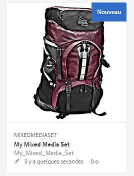
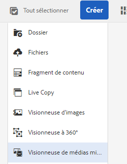
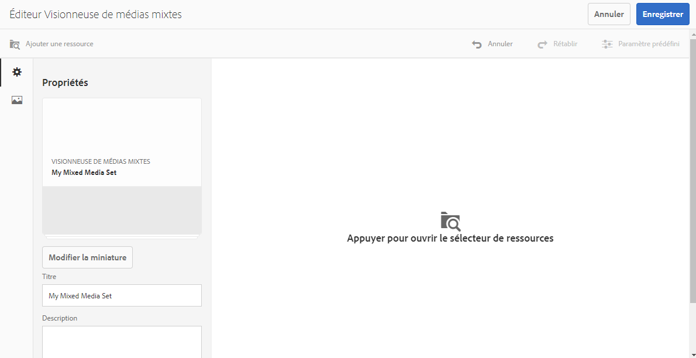
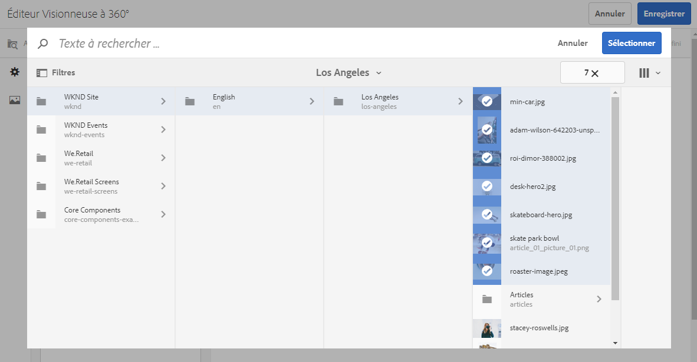
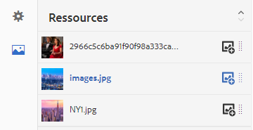

# Visionneuses de supports variés{#mixed-media-sets}

Une visionneuse de supports variés permet d’offrir un mélange d’images, de visionneuses d’images, de visionneuses à 360° et de vidéos dans une même présentation.

Les visionneuses de supports variés sont désignées par une bannière comportant le mot **[!UICONTROL Visionneuse de supports variés]**. En outre, si la visionneuse de médias mixtes est publiée, la date de publication, indiquée par l’icône représentant la **[!UICONTROL Terre]**, figure sur la bannière avec la date de dernière modification, indiquée par l’icône représentant un **[!UICONTROL crayon]**.

>[!NOTE]
>
>Pour plus d’informations sur l’interface utilisateur des ressources, voir [Gestion des ressources avec l’interface utilisateur tactile](/help/assets/manage-digital-assets.md).

## Démarrage rapide : Visionneuses de supports variés {#quick-start-mixed-media-sets}

Pour démarrer rapidement, procédez comme suit :

1. [Chargez vos ressources](#uploading-assets).

   Commencez par télécharger les images et les vidéos pour les visionneuses de supports variés. Le cas échéant, créez les [Visionneuses d’images](/help/assets/dynamic-media/image-sets.md) et [Visionneuse à 360°](/help/assets/dynamic-media/spin-sets.md). Comme les utilisateurs peuvent zoomer sur les images dans la visionneuse de supports variés, tenez compte du zoom lorsque vous sélectionnez des images. Assurez-vous que les images font au moins 2000 pixels dans leur dimension la plus grande.

1. [Créez une visionneuse de supports variés.](#creating-mixed-media-sets)

   To create a Mixed Media Set, from the Assets page, tap **[!UICONTROL Create > Mixed Media Set]** and then name the set, choose the assets, and choose the order the images appear.

   Voir [Utilisation de sélecteurs](/help/assets/dynamic-media/working-with-selectors.md).

1. Set up [Mixed Media Viewer presets](/help/assets/dynamic-media/managing-viewer-presets.md), as needed.

   Les administrateurs peuvent créer ou modifier les paramètres prédéfinis de visionneuse de supports variés. To see your mixed media with a viewer preset, select the mixed media set, and in the left-rail drop-down menu, select **[!UICONTROL Viewers]**.

   See **[!UICONTROL Tools > Assets > Viewer Presets]** to create or edit viewer presets.

   See [Adding and editing viewer presets.](/help/assets/dynamic-media/managing-viewer-presets.md)

1. [Prévisualisez une visionneuse de supports variés.](#previewing-mixed-media-sets)

   Sélectionnez la visionneuse de supports variés pour pouvoir la prévisualiser. Cliquez sur les icônes des miniatures afin d’examiner votre visionneuse de supports variés dans la visionneuse sélectionnée. You can choose different Viewers from the **[!UICONTROL Viewers]** menu, available from the left rail drop-down menu.

1. [Publiez une visionneuse de supports variés.](#publishing-mixed-media-sets)

   La publication d’une visionneuse de supports variés active la chaîne URL et d’incorporation. In addition, you must [publish the viewer preset](/help/assets/dynamic-media/managing-viewer-presets.md#publishing-viewer-presets).

1. [Liez des URL à l’application Web](/help/assets/dynamic-media/linking-urls-to-yourwebapplication.md) ou [incorporez la vidéo ou la visionneuse d’images](/help/assets/dynamic-media/embed-code.md).

   AEM Assets crée des appels URL pour les visionneuses de supports variés et les active une fois que vous avez publié les visionneuses. Vous pouvez copier ces URL lorsque vous prévisualisez les ressources. Vous pouvez également les incorporer à votre site Web.

   Select the Mixed Media Set, then in the left rail drop-down menu, select **[!UICONTROL Viewers]**.

   See [Linking a Mixed Media Set to a web page](/help/assets/dynamic-media/linking-urls-to-yourwebapplication.md) and [Embedding the Video or Image Viewer](/help/assets/dynamic-media/embed-code.md).

Le cas échéant, vous pouvez modifier une [visionneuse de supports variés](#editing-mixed-media-sets). In addition, you can view and modify [Mixed Media Set properties](/help/assets/manage-digital-assets.md#editing-properties).

>[!NOTE]
>
>If you have issues creating sets, see [Troubleshooting Dynamic Media](/help/assets/dynamic-media/troubleshoot-dm.md).

## Téléchargement des ressources {#uploading-assets}

Commencez par télécharger les images et les vidéos pour les visionneuses de supports variés. Comme les utilisateurs peuvent zoomer sur les images dans la visionneuse de supports variés, assurez-vous que vous tenez compte du zoom lorsque vous sélectionnez des images. Assurez-vous que les images font au moins 2000 pixels dans leur dimension la plus grande.

Si vous souhaitez ajouter des visionneuses à 360° ou des visionneuses d’images à la visionneuse de supports variés, créez-les aussi.

## Création d’une visionneuse de supports variés {#creating-mixed-media-sets}

Vous pouvez ajouter des images, des visionneuses d’images, des visionneuses à 360° et des vidéos à votre visionneuse de supports variés. Assurez-vous que les fichiers, visionneuses d’images et visionneuses à 360° sont prêts pour la publication avant de les ajouter à la visionneuse de supports variés.

Lorsque vous ajoutez des ressources à votre visionneuse, elles sont automatiquement ajoutées dans l’ordre alphanumérique. Vous pouvez réorganiser ou trier manuellement les ressources après les avoir ajoutées.

**Pour créer une visionneuse de supports variés**

1. In Assets, navigate to where you want to create a mixed media set, and click **[!UICONTROL Create]**, and select **[!UICONTROL Mixed Media Set]**. Vous pouvez également la créer depuis un dossier qui contient les ressources. L’éditeur de visionneuse de supports variés s’affiche.

   

1. Dans le **[!UICONTROL Titre]** de la visionneuse de supports variés, saisissez un nom pour la visionneuse. Le nom apparaît dans la bannière située sur la visionneuse de médias mixtes. Facultativement, saisissez une description.

   

   >[!NOTE]
   >
   >Lors de la création de la visionneuse de supports mixtes, vous pouvez modifier la miniature de la visionneuse de supports mixtes ou autoriser AEM à sélectionner automatiquement la miniature en fonction des ressources de la visionneuse de supports mixtes. To select a thumbnail, click **[!UICONTROL Change thumbnail]** and select any image (you can navigate to other folders to find images as well). If you have selected a thumbnail and then decide that you want AEM to generate one from the mixed media set, select **[!UICONTROL Switch to Automatic thumbnail]**.

1. Appuyez sur le sélecteur de fichiers pour sélectionner les fichiers à inclure dans votre visionneuse de supports variés. Sélectionnez-les, puis cliquez sur **[!UICONTROL Sélectionner]**.

   With the Asset Selector, you can search for assets by typing in a keyword and tapping **[!UICONTROL Return]**. Vous pouvez également appliquer des filtres pour affiner les résultats de la recherche. Vous pouvez filtrer par chemin d’accès, collection, type de fichier et balise. Select the filter and then tap the **[!UICONTROL Filter]** icon from the toolbar. Change the view by selecting the **[!UICONTROL View]** icon and selecting **[!UICONTROL List View]**, **[!UICONTROL Column View]**, or **[!UICONTROL Card View]**.

   Voir [Utilisation de sélecteurs](/help/assets/dynamic-media/working-with-selectors.md).

   

1. Re-order the assets by dragging them up or down the list (must select the **[!UICONTROL Reorder]** icon), as necessary.

   

   If you want to add thumbnails, click the **+** **[!UICONTROL thumbnail]** icon next to the image and navigate to the thumbnail you want. When done selecting all the thumbnail images click **[!UICONTROL Save]**.

   >[!NOTE]
   >
   >If you want to add assets, tap **[!UICONTROL Add Asset]**.

1. To delete an asset, select the corresponding check box and tap **[!UICONTROL Delete Asset]**.
1. To apply a preset, tap **[!UICONTROL Preset]** in the upper right corner and select a preset to apply to the assets.
1. Cliquez sur **[!UICONTROL Enregistrer]**. La visionneuse de médias mixtes nouvellement créée apparaît dans le dossier dans lequel vous l’avez créée.

## Modification d’une visionneuse de médias mixtes {#editing-mixed-media-sets}

Vous pouvez effectuer diverses tâches de modification sur les ressources dans les visionneuses de supports variés, directement dans l’interface utilisateur, [comme vous le feriez dans AEM Assets](/help/assets/manage-digital-assets.md). Vous pouvez également effectuer les actions suivantes dans les visionneuses de supports variés :

* Ajouter des ressources à la visionneuse de supports variés.
* Réorganiser des ressources de la visionneuse de supports variés.
* Supprimer des ressources de la visionneuse de supports variés.
* Appliquer des paramètres prédéfinis de visionneuse.
* Modifier la vignette par défaut.

**Pour modifier une visionneuse de supports variés**

1. Effectuez l’une des opérations suivantes :

   * Pointez sur une ressource de visionneuse de supports variés, puis appuyez sur **[!UICONTROL Modifier]** (icône crayon).
   * Pointez sur une ressource de visionneuse de supports variés, appuyez sur **[!UICONTROL Sélectionner]** (icône de coche), puis sur **[!UICONTROL Modifier]** dans la barre d’outils.

   * Appuyez sur une ressource de visionneuse de supports variés, puis sur **[!UICONTROL Modifier]** (icône crayon) dans la barre d’outils.

1. Dans l’éditeur de visionneuse de supports variés, effectuez l’une des actions suivantes :

   * Pour réorganiser les éléments : dans le panneau de gauche, appuyez sur **[!UICONTROL Ressources]** (icône image), puis faites glisser une ressource vers un nouvel emplacement.
   * Pour ajouter des ressources : dans la barre d’outils, appuyez sur **[!UICONTROL Ajouter une ressource]**. Accédez aux ressources. Pour chaque élément à ajouter, pointez sur l’image de la ressource (et non sur son nom), puis appuyez sur l’icône de coche. Dans le coin supérieur droit, appuyez sur **[!UICONTROL Sélectionner]**.

   * Pour supprimer une ressource : dans le panneau de gauche, appuyez sur **[!UICONTROL Ressources]**(icône image), puis sélectionnez la ressource. Dans la barre d’outils, appuyez sur **[!UICONTROL Supprimer la ressource]**.

   * Pour trier des ressources selon leur nom par ordre croissant ou décroissant, dans le panneau de gauche, appuyez sur **[!UICONTROL Ressources]** (icône image). À droite de l’en-tête **[!UICONTROL Ressources]**, appuyez sur les icônes lambda vers le haut ou vers le bas.

      >[!NOTE]
      >
      >    * To delete an entire Mixed Media Set, from any viewing mode (such as **[!UICONTROL Card View]** or **[!UICONTROL Column View]**) navigate to the Mixed Media Set. Placez le pointeur de la souris sur l’actif et appuyez sur l’icône de coche pour la sélectionner. Appuyez sur la touche **[!UICONTROL Retour arrière]** du clavier ou sur **[!UICONTROL Plus]** (points de suspension) dans la barre d’outils, puis appuyez sur **[!UICONTROL Supprimer]**.
         >
         >    
      * You can edit the assets in a Mixed Media Set by navigating to the set, clicking **Set Members]** in the left rail, and then tapping the **[!UICONTROL Pencil]** icon on an individual asset to open the editing window.

1. Appuyez sur **[!UICONTROL Enregistrer]** lorsque vous avez terminé la modification.

   >[!NOTE]
   >
   >* Pour modifier les ressources dans une visionneuse de supports variés - Accédez à la visionneuse de supports variés. Appuyez sur (ne sélectionnez pas) la visionneuse pour l’ouvrir dans la page Aperçu de la visionneuse AEM. Dans le rail de gauche, cliquez sur l’icône lambda vers le bas pour ouvrir la liste déroulante, puis appuyez sur **[!UICONTROL Définir les membres]**. Dans la page Définir les membres, placez le pointeur sur une ressource, puis appuyez sur **[!UICONTROL Modifier]** (icône crayon) pour ouvrir la page de modification.
      >
      >
   * Pour supprimer une visionneuse de supports variés dans son ensemble - À partir de n’importe quel mode d’affichage (Mode Carte ou Colonne, par exemple), accédez à la visionneuse de supports variés. Hover on the set, then tap **Select]** (checkmark icon). Appuyez sur la touche **[!UICONTROL Retour arrière]** de votre clavier ou sur **[!UICONTROL Plus]** (trois points de suspension), puis appuyez sur **[!UICONTROL Supprimer]**.

## Aperçu d’une visionneuse de supports variés {#previewing-mixed-media-sets}

Pour obtenir des informations sur l’aperçu d’une visionneuse de supports variés, voir [Aperçu des ressources](/help/assets/dynamic-media/previewing-assets.md).

## Publication d’une visionneuse de supports variés {#publishing-mixed-media-sets}

Pour obtenir des informations sur la publication d’une visionneuse de supports variés, voir [Publication de ressources](/help/assets/dynamic-media/publishing-dynamicmedia-assets.md).

>[!NOTE]
>
>Si la visionneuse de supports variés n’apparaît pas complètement dans le service de diffusion la première fois que vous la publiez, vous devrez peut-être la publier une seconde fois.

