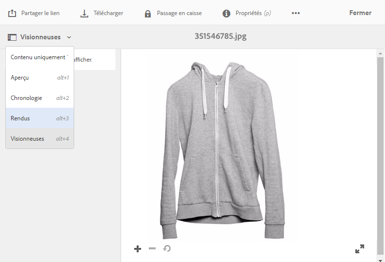
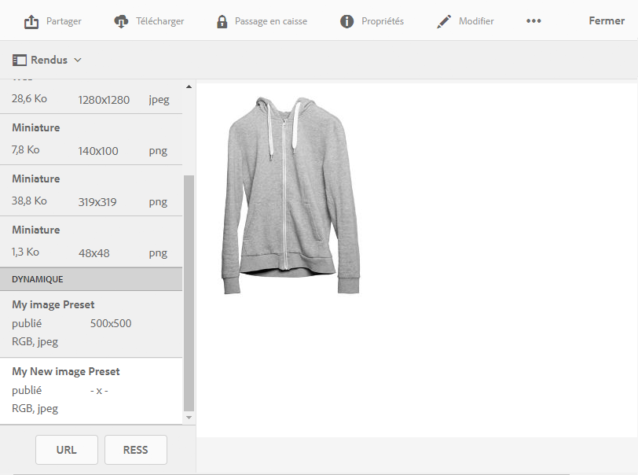
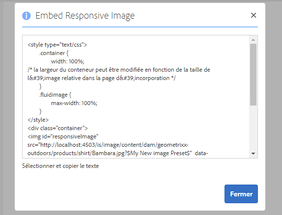

# Diffusion d’images optimisées pour un site réactif {#delivering-optimized-images-for-a-responsive-site}

Utilisez la fonctionnalité de code réactif lorsque vous souhaitez partager le code de diffusion réactive avec votre développeur web. Utilisez la fonctionnalité de code réactif (**[!UICONTROL RESS]**) lorsque vous souhaitez partager le code de diffusion réactive avec votre développeur web.

Cette fonction a un sens si votre site web se trouve sur un composant WCM tiers. Cependant, si votre site web se trouve sur AEM à la place, un serveur d’images hors site effectue le rendu de l’image et le communique à la page web.

Voir aussi [Incorporation de la visionneuse de vidéos dans une page web.](embed-code.md)

Voir aussi [Liaison d’URL à une application web.](linking-urls-to-yourwebapplication.md)

**Pour diffuser des images optimisées pour un site réactif, procédez comme suit** :

1. Accédez à l’image pour laquelle vous voulez fournir du code réactif et, dans le menu déroulant, appuyez sur **[!UICONTROL Rendus]**.

   

1. Sélectionnez un paramètre d’image prédéfini réactif. Les boutons **[!UICONTROL URL]** et **[!UICONTROL RESS]** apparaissent.

   

   >[!NOTE]
   >
   >La ressource sélectionnée *et* le paramètre d’image prédéfini ou le paramètre de visionneuse prédéfini sélectionné doivent être publiés pour que le bouton **[!UICONTROL URL]** ou **[!UICONTROL RESS]** soit disponible.
   >
   >Les paramètres d’image prédéfinis sont automatiquement publiés.

1. Appuyez sur **[!UICONTROL RESS]**.

   

1. Dans la boîte de dialogue **[!UICONTROL Intégrer une image réactive]**, sélectionnez et copiez le texte du code réactif et collez-le dans votre site web pour accéder au fichier réactif.
1. Modifiez les points d’arrêt par défaut dans le code incorporé pour qu’ils correspondent à ceux du site web réactif directement dans le code. Testez en outre les différentes résolutions d’image diffusées à différents points d’arrêt d’une page.

## Utilisation du protocole HTTP/2 pour diffuser vos ressources Dynamic Media {#using-http-to-delivery-your-dynamic-media-assets}

HTTP/2 est le nouveau protocole web qui améliore la manière dont les serveurs et les navigateurs communiquent. Il permet un transfert rapide d’informations et réduit la puissance de traitement nécessaire. La diffusion de ressources Dynamic Media est prise en charge via HTTP/2 pour améliorer les temps de réponse et de chargement.

Voir [Diffusion du contenu sur HTTP/2](http2faq.md) pour tout savoir sur l’utilisation du protocole HTTP/2 avec votre compte Dynamic Media.
