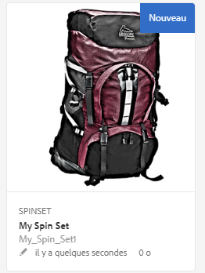
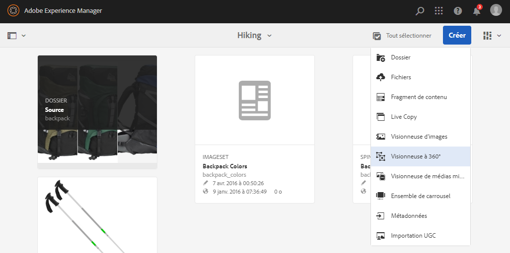
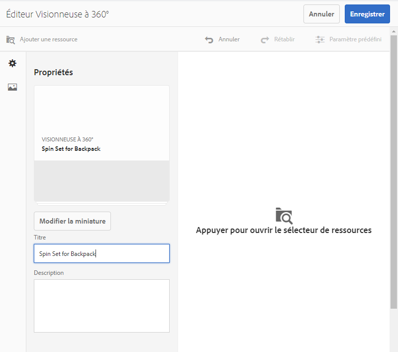
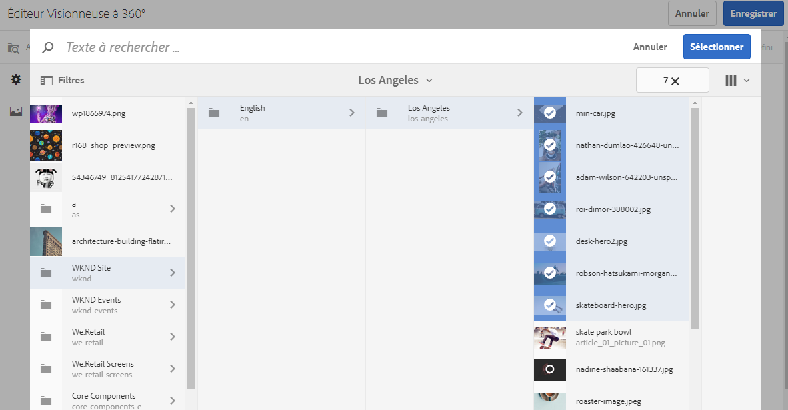
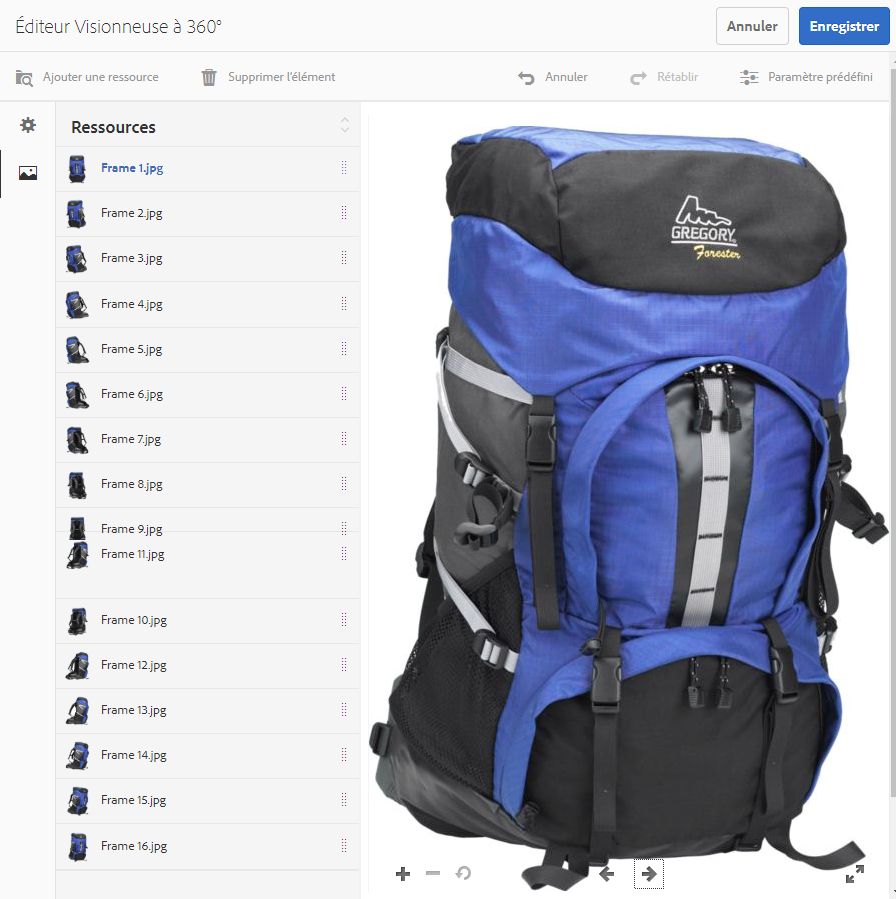
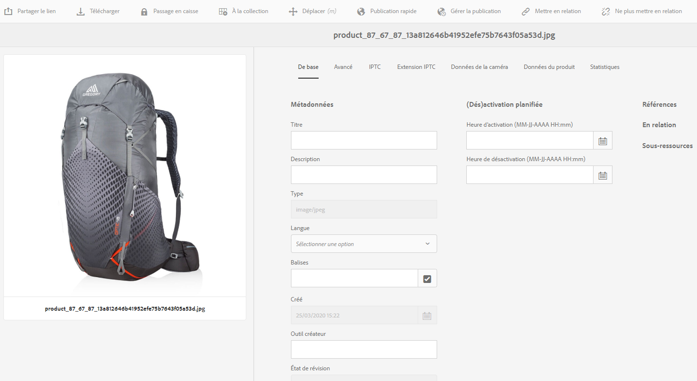
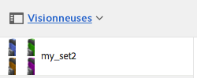
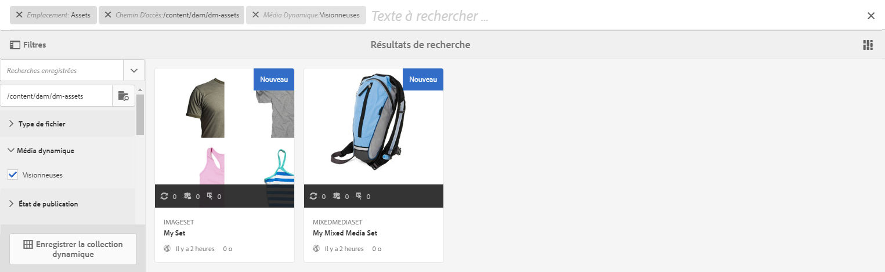

# Visionneuses à 360°{#spin-sets}

Une visionneuse à 360° simule l’action consistant à faire pivoter un objet pour l’examiner. Les visionneuses à 360° permettent de voir des éléments depuis tous les angles, révélant les détails visuels clés depuis chaque angle.

Une visionneuse à 360° simule une expérience de visionnage à 360°. Dynamic Media fournit des visionneuses à 360° à axe unique avec lesquelles les observateurs peuvent faire pivoter un élément. En outre, les utilisateurs peuvent effectuer un zoom et un panoramique de « forme libre » sur n’importe quelle vue en quelques clics de souris. Ainsi, les utilisateurs peuvent examiner un élément de plus près, depuis un point de vue spécifique.

Les visionneuses à 360° sont désignées par une bannière contenant le mot **[!UICONTROL SPINSET]**. En outre, si la visionneuse à 360° est publiée, la date de publication, indiquée par l’icône représentant la **[!UICONTROL Terre]**, figure sur la bannière avec la date de la dernière modification, indiquée par l’icône représentant un **[!UICONTROL crayon]**.

>[!NOTE]
>
>Pour plus d’informations sur l’interface utilisateur d’Assets, voir [Gestion des ressources avec l’interface utilisateur tactile](/help/assets/manage-digital-assets.md).

## Démarrage rapide : Visionneuse à 360°   {#quick-start-spin-sets}

Pour démarrer rapidement, procédez comme suit :

1. [Chargez les images pour plusieurs vues.](#uploading-assets-for-spin-sets)

   Vous avez besoin au minimum de 8 à 12 prises de vue d’un élément pour pouvoir utiliser une visionneuse à 360° unidimensionnelle et de 16 à 24 prises de vue pour pouvoir utiliser une visionneuse à 360° bidimensionnelle. Les prises de vue doivent être réalisées à intervalles réguliers pour donner l’impression que l’objet est en rotation et retourné. Par exemple, si une visionneuse unidimensionnelle comprend 12 prises de vue, faites pivoter l’objet de 30 degrés (360/12) pour chaque prise de vue.

1. [Créez une visionneuse à 360°.](#creating-spin-sets)

   Pour créer une visionneuse à 360°, sélectionnez **[!UICONTROL Créer > Visionneuse à 360°]**. Attribuez ensuite un nom à la visionneuse, sélectionnez des ressources et choisissez l’ordre dans lequel doivent apparaître les images.

   Voir [Utilisation de sélecteurs](/help/assets/dynamic-media/working-with-selectors.md).

   >[!NOTE]
   >
   >Vous pouvez également créer des visionneuses à 360° automatiquement par l’intermédiaire des [paramètres prédéfinis d’ensemble par lot](/help/assets/dynamic-media/config-dm.md#creating-batch-set-presets-to-auto-generate-image-sets-and-spin-sets). **Important** : les ensembles par lot sont créés par le système IPS (Image Production System) dans le cadre de l’ingestion des ressources.

1. Configurez des [paramètres prédéfinis de visionneuse à 360°](/help/assets/dynamic-media/managing-viewer-presets.md), selon les besoins.

   Les administrateurs peuvent créer ou modifier les paramètres prédéfinis de visionneuse à 360°. Pour afficher votre visionneuse à 360° avec un paramètre prédéfini, sélectionnez la visionneuse puis, dans le menu contextuel du rail gauche, sélectionnez **Visionneuses**.

   Accédez à **[!UICONTROL Outils > Ressources > Paramètres visionneuse]** pour créer ou modifier les paramètres prédéfinis de la visionneuse.

   Voir [Ajout et modification de paramètres prédéfinis de la visionneuse](/help/assets/dynamic-media/managing-viewer-presets.md).

   Vous pouvez afficher les visionneuses créées par le biais des paramètres prédéfinis d’ensemble par lot et y accéder de trois manières différentes. Les visionneuses créées à l’aide de paramètres prédéfinis d’ensemble par lot ne s’affichent *pas* dans l’interface utilisateur.

1. [Prévisualisez une visionneuse à 360°.](/help/assets/dynamic-media/previewing-assets.md)

   Sélectionnez la visionneuse à 360° pour pouvoir la prévisualiser. Faites pivoter la visionneuse à 360°. Vous pouvez choisir différentes visionneuses dans le menu **[!UICONTROL Visionneuses]** disponible dans le menu déroulant du rail gauche.

1. [Publiez une visionneuse à 360°.](/help/assets/dynamic-media/publishing-dynamicmedia-assets.md)

   La publication d’une visionneuse à 360° active la chaîne d’URL et d’incorporation. Vous devez, en outre, [publier le paramètre prédéfini de la visionneuse](/help/assets/dynamic-media/managing-viewer-presets.md).

1. [Liez des URL à l’application web](/help/assets/dynamic-media/linking-urls-to-yourwebapplication.md) ou [incorporez la vidéo ou la visionneuse d’images](/help/assets/dynamic-media/embed-code.md).

   AEM Assets crée des appels URL pour les visionneuses à 360° et les active une fois que vous avez publié la visionneuse à 360°. Vous pouvez copier ces URL lorsque vous prévisualisez les ressources. Vous pouvez également les incorporer à votre site web.

   Sélectionnez la visionneuse à 360° puis, dans le menu déroulant du rail gauche, sélectionnez **[!UICONTROL Visionneuses]**.

   Voir [Liaison d’une visionneuse à 360° à une page web](/help/assets/dynamic-media/linking-urls-to-yourwebapplication.md) et [Incorporation d’une vidéo ou d’une visionneuse d’images](/help/assets/dynamic-media/embed-code.md).

Le cas échéant, vous pouvez [modifier les visionneuses à 360°](#editing-spin-sets). Vous pouvez, en outre, afficher et modifier les [propriétés de la visionneuse à 360°](/help/assets/manage-digital-assets.md#editing-properties).

## Chargement de ressources pour les visionneuses à 360° {#uploading-assets-for-spin-sets}

Vous avez besoin au minimum de 8 à 12 prises de vue d’un élément pour pouvoir utiliser une visionneuse à 360° unidimensionnelle et de 16 à 24 prises de vue pour pouvoir utiliser une visionneuse à 360° bidimensionnelle. Les prises de vue doivent être réalisées à intervalles réguliers pour donner l’impression que l’objet est en rotation et retourné. Par exemple, si une visionneuse unidimensionnelle comprend 12 prises de vue, faites pivoter l’objet de 30 degrés (360/12) pour chaque prise de vue.

Vous pouvez charger des images pour les visionneuses à 360° comme vous le [feriez pour n’importe quelle autre ressource dans AEM Assets](/help/assets/manage-digital-assets.md).

### Instructions relatives à la capture d’images pour la visionneuse à 360° {#guidelines-for-shooting-spin-set-images}

Vous trouverez ci-dessous des pratiques recommandées relatives aux images de la visionneuse à 360°. En général, plus vous avez d’images dans la visionneuse à 360°, plus l’effet de rotation est réussi. Néanmoins, l’inclusion de nombreuses images dans la visionneuse augmente également la durée de chargement de ces dernières. AEM recommande de suivre les instructions suivantes pour les prises de vue à utiliser dans les visionneuses à 360° :

* Au minimum, utilisez 8 à 12 images dans une visionneuse à 360° unidimensionnelle et 16 à 24 images dans une visionneuse à 360° bidimensionnelle. 8 images au minimum sont nécessaires pour effectuer une rotation de 360 degrés. Les visionneuses à 360° unidimensionnelles sont plus courantes que les visionneuses à 360° bidimensionnelles, car la création de ces dernières demande beaucoup de travail.
* Utilisez un format d’image sans perte (formats TIFF et PNG recommandés).
* Masquez toutes les images pour faire apparaître l’objet sur un fond blanc ou fortement contrasté. Ajoutez éventuellement des ombres.
* Assurez-vous que les détails du produit sont bien éclairés et que leur mise au point est nette.
* Utilisez un mannequin ou un modèle pour la prise de vue d’articles de mode. Souvent, le mannequin est complètement masqué (en utilisant un mannequin transparent) ou bien un mannequin stylisé est présenté dans l’image. Vous pouvez créer une visionneuse à 360° « sur modèle » en définissant le nombre d’angles. Marquez chaque angle avec du ruban adhésif sur le sol afin de guider le modèle à regarder dans la direction de chaque prise de vue.

## Création d’une visionneuse à 360°   {#creating-spin-sets}

Cette section décrit comment créer des visionneuses à 360°.

>[!NOTE]
>
>Vous pouvez également créer des visionneuses à 360° automatiquement par l’intermédiaire des [paramètres prédéfinis d’ensemble par lot](/help/assets/dynamic-media/config-dm.md). **Important** : les ensembles par lot sont créés par le système IPS (Image Production System) dans le cadre de l’ingestion des ressources.
>
>Voir « Création de paramètres prédéfinis d’ensemble par lot pour générer automatiquement des visionneuses d’images et des visionneuses à 360° » dans [Configuration de Dynamic Media](/help/assets/dynamic-media/config-dm.md).

>[!NOTE]
>
>L’ordre dans lequel les images apparaissent dans une visionneuse à 360° a une importance. Veillez à les mettre dans le bon ordre afin que la rotation soit une vue à 360° parfaite.

**Pour créer des visionneuses à 360°**

1. Dans Assets, accédez à l’emplacement où vous souhaitez créer une visionneuse à 360°, cliquez sur **[!UICONTROL Créer]**, puis sélectionnez **[!UICONTROL Visionneuse à 360°]**. Vous pouvez également la créer depuis un dossier qui contient les ressources. L’éditeur de visionneuse à 360° s’affiche.

   

1. Dans le champ **[!UICONTROL Titre]** de l’éditeur de visionneuse à 360°, entrez un nom pour la visionneuse à 360°. Le nom apparaît dans la bannière située sur la visionneuse à 360°. Vous pouvez aussi saisir une description.

   

   >[!NOTE]
   >
   >Lors de la création de la visionneuse à 360°, vous pouvez modifier la miniature de la visionneuse ou autoriser AEM à sélectionner la miniature automatiquement en fonction des ressources de la visionneuse à 360°. Pour sélectionner une miniature, cliquez sur **[!UICONTROL Modifier la miniature]** et sélectionnez une image (vous pouvez également accéder à d’autres dossiers pour trouver des images). Si vous avez sélectionné une miniature, puis décidez que vous souhaitez qu’AEM en génère une depuis la visionneuse à 360°, sélectionnez **[!UICONTROL Basculer vers les miniatures automatiques]**.

1. Effectuez l’une des opérations suivantes :

   * Dans le coin supérieur gauche de la page de l’éditeur de visionneuse à 360°, appuyez sur **[!UICONTROL Ajouter une ressource]**.

   * Au milieu de la page de l’éditeur de visionneuse à 360°, appuyez sur **[!UICONTROL Appuyer pour ouvrir le sélecteur de ressources]**.
   Appuyez pour sélectionner les ressources que vous souhaitez inclure dans la visionneuse à 360°. Les ressources sélectionnées sont cochées. Lorsque vous avez terminé, en haut à droite de la page, appuyez sur **[!UICONTROL Sélectionner]**.

   Le sélecteur de ressources vous permet de rechercher des ressources en saisissant un mot-clé, puis en appuyant sur **[!UICONTROL Retour**. Vous pouvez également appliquer des filtres pour affiner les résultats de la recherche. Vous pouvez filtrer par chemin d’accès, collection, type de fichier et balise. Sélectionnez le filtre, puis appuyez sur l’icône **[!UICONTROL Filtre]** dans la barre d’outils. Pour modifier l’affichage, appuyez sur l’icône Affichage et sélectionnez **[!UICONTROL Mode Colonne]**, **[!UICONTROL Mode Carte]** ou **[!UICONTROL Mode Liste]**.

   Voir [Utilisation de sélecteurs](/help/assets/dynamic-media/working-with-selectors.md).

   

1. Lorsque vous ajoutez des ressources à votre visionneuse, elles sont automatiquement ajoutées dans l’ordre alphanumérique. Vous pouvez réorganiser ou trier manuellement les ressources après les avoir ajoutées.

   Si nécessaire, faites glisser l’icône Réorganiser d’une ressource vers la droite du nom de fichier de la ressource pour réorganiser les images vers le haut ou le bas de la liste définie.

   

   Réorganisation de l’image 11 dans la visionneuse à 360° en la faisant glisser vers un nouvel emplacement.

1. (En option) Effectuez l’une des actions suivantes :

   * Pour supprimer une image, sélectionnez-la et appuyez sur **[!UICONTROL Supprimer la ressource]**.

   * Pour appliquer un paramètre prédéfini, en haut à droite de la page, appuyez sur **[!UICONTROL Paramètre prédéfini]**, puis sélectionnez un paramètre prédéfini à appliquer en une seule fois à toutes les ressources.

1. Cliquez sur **[!UICONTROL Enregistrer]**. La visionneuse à 360° nouvellement créée apparaît dans le dossier dans lequel vous l’avez créée.

## Affichage de visionneuses à 360°   {#viewing-spin-sets}

Vous pouvez créer des visionneuses à 360° dans l’interface utilisateur ou automatiquement à l’aide des [paramètres prédéfinis d’ensemble par lot](/help/assets/dynamic-media/config-dm.md). (Notez toutefois que les visionneuses créées à l’aide de paramètres prédéfinis d’ensemble par lot *ne s’affichent pas* dans l’interface utilisateur.) Vous pouvez accéder aux visionneuses créées au moyen de paramètres prédéfinis d’ensemble par lot de trois manières différentes. (Ces méthodes sont disponibles même si vous avez créé les visionneuses à 360° dans l’interface utilisateur.)

>[!NOTE]
>
>Vous pouvez également afficher les visionneuses par le biais de l’interface utilisateur, comme indiqué dans [Modification d’une visionneuse à 360°](#editing-spin-sets).

**Pour afficher des visionneuses à 360°**.

1. Lors de l’ouverture des propriétés d’une ressource individuelle. Les propriétés indiquent les jeux dont la ressource sélectionnée fait partie (sous **[!UICONTROL Membre des visionneuses]**). Cliquez sur le nom de la visionneuse pour l’afficher intégralement.

   

1. À partir de l’image membre d’une visionneuse, sélectionnez le menu **[!UICONTROL Visionneuses]** pour afficher les visionneuses dont la ressource fait partie.

   

1. Dans la recherche, vous pouvez sélectionner **[!UICONTROL Filtres]**, puis développer **[!UICONTROL Média dynamique]** et sélectionner ensuite **[!UICONTROL Visionneuses]**.

   La recherche renvoie les visionneuses correspondantes qui ont soit été créées manuellement dans l’interface utilisateur, soit automatiquement au moyen de paramètres prédéfinis d’ensemble par lot. Dans le cas des visionneuses automatisées, la requête de recherche est effectuée à l’aide du critère `Starts with`, à la différence de la recherche AEM qui repose sur l’utilisation du critère `Contains`. La définition du filtre sur **[!UICONTROL Visionneuses]** constitue la seule méthode de recherche dans des visionneuses automatisées.

   

## Modification d’une visionneuse à 360°{#editing-spin-sets}

Vous pouvez effectuer diverses tâches de modification sur les visionneuses à 360°, notamment :

* Ajouter des images à la visionneuse à 360°.
* Réorganiser des images dans la visionneuse à 360°.
* Supprimer les ressources de la visionneuse à 360°.
* Appliquer des paramètres prédéfinis de visionneuse.
* Supprimer la visionneuse à 360°.

**Pour modifier une visionneuse à 360°**

1. Effectuez l’une des opérations suivantes :

   * Pointez sur une ressource de visionneuse à 360°, puis appuyez sur **[!UICONTROL Modifier]** (icône de crayon).
   * Pointez sur une ressource de visionneuse à 360°, appuyez sur **[!UICONTROL Sélectionner]** (icône de coche), puis sur **[!UICONTROL Modifier]** sur la barre d’outils.

   * Appuyez sur une ressource de visionneuse à 360°, puis sur **[!UICONTROL Modifier]** (icône de crayon) sur la barre d’outils.

1. Pour modifier la visionneuse à 360°, effectuez l’une des opérations suivantes :

   * Pour réorganiser les images, faites glisser une image vers son nouvel emplacement (sélectionnez l’icône de réorganisation pour déplacer les éléments).
   * Pour trier les éléments dans l’ordre ascendant ou descendant, cliquez sur l’en-tête de colonne.
   * Pour ajouter une ressource ou mettre à jour une ressource existante, cliquez sur **[!UICONTROL Ajouter une ressource]**. Accédez à une ressource, sélectionnez-la, puis appuyez sur **[!UICONTROL Sélectionner]** en haut à droite.
Si vous supprimez l’image qu’AEM utilise pour la miniature en la remplaçant par une autre image, la ressource d’origine s’affiche toujours.
   * Pour supprimer une ressource, sélectionnez-la et cliquez ou appuyez sur **[!UICONTROL Supprimer la ressource]**.
   * Pour appliquer un paramètre prédéfini, appuyez ou cliquez sur l’icône Paramètre prédéfini et sélectionnez-en un.
   * Pour supprimer une visionneuse à 360°, accédez à cette dernière, sélectionnez-la, puis choisissez **[!UICONTROL Supprimer]**
   >[!NOTE]
   >
   >Vous pouvez modifier les images d’une visionneuse à 360° en y accédant, en appuyant sur **[!UICONTROL Définir les membres]** dans le rail gauche, puis en appuyant sur l’icône en forme de crayon d’une ressource pour ouvrir la fenêtre de modification.

1. Lorsque vous avez terminé les modifications, cliquez sur **[!UICONTROL Enregistrer]**.

## Aperçu d’une visionneuse à 360°   {#previewing-spin-sets}

Voir aussi [Aperçu des ressources](/help/assets/dynamic-media/previewing-assets.md).

## Publication d’une visionneuse à 360°   {#publishing-spin-sets}

Voir [Publication de ressources](/help/assets/dynamic-media/publishing-dynamicmedia-assets.md).