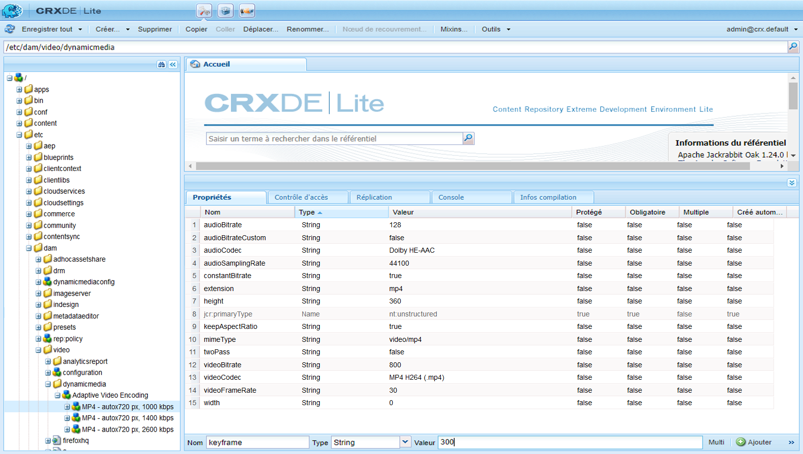
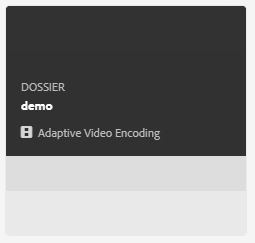
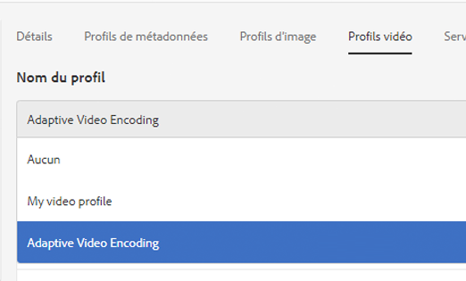
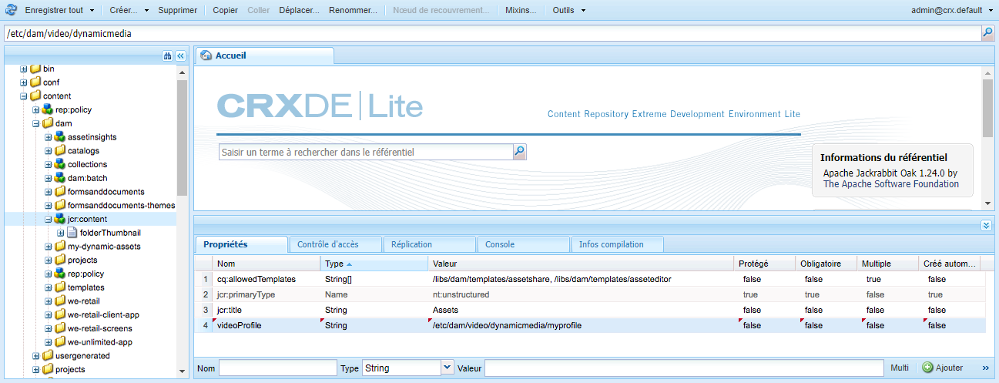

# Profils vidéo{#video-profiles}

Dynamic Media est fourni avec un profil prédéfini de codage vidéo adaptatif. Les paramètres de ce profil prêt à l’emploi sont optimisés pour offrir à vos clients la meilleure expérience de visionnage possible. Lorsque vous codez vos vidéos originales à l’aide du profil de codage vidéo adaptatif, au cours de la lecture, le lecteur vidéo ajuste automatiquement la qualité du flux vidéo en fonction de la vitesse de la connexion Internet de vos clients. Ce processus est appelé diffusion en continu adaptative.

Voici d’autres facteurs qui déterminent la qualité des vidéos :

* **Résolution de la vidéo originale téléchargée**

   Si la vidéo MP4 a été enregistrée à une résolution inférieure, telle que 240p ou 360p, elle ne peut pas être diffusée en haute définition.

* **Taille du lecteur vidéo**

   Par défaut, la largeur du profil de codage de vidéo adaptative est définie sur Auto. Encore une fois, lors de la lecture, la meilleure qualité est utilisée en fonction de la taille du lecteur.

See [Best Practices for Video Encoding](/help/assets/dynamic-media/video.md#best-practices-for-encoding-videos).

Consultez également la section [Pratiques recommandées pour organiser vos ressources numériques en vue d’utiliser des profils de traitement](/help/assets/dynamic-media/best-practices-for-file-management.md).

>[!NOTE]
>
>Pour générer les métadonnées d’une vidéo et les miniatures d’image vidéo associées, la vidéo elle-même doit passer par le processus de codage dans Contenu multimédia dynamique. In AEM, the **[!UICONTROL Dynamic Media Encode Video]** workflow encodes video if you have enabled dynamic media and set up video cloud services. Ce processus capture l’historique de traitement des processus et les informations d’échec. Voir [Surveillance du codage vidéo et de la progression de la publication sur YouTube](/help/assets/dynamic-media/video.md#monitoring-video-encoding-and-youtube-publishing-progress). Si vous avez activé Dynamic Media et configuré les services cloud vidéo, le processus **[!UICONTROL vidéo d’encodage Dynamic Media]** prend automatiquement effet lorsque vous chargez une vidéo. (Si vous n’utilisez pas Dynamic Media, le processus **[!UICONTROL Ressource de mise à jour DAM]** prend effet.)
>
>Les métadonnées sont utiles lorsque vous recherchez des ressources. Les miniatures sont des images vidéo statiques générées pendant le codage. Elles sont requises par le système AEM et utilisées dans l’interface utilisateur pour vous aider à identifier visuellement les vidéos dans les vues Cartes, Résultats de la recherche et Liste des fichiers. Vous pouvez voir les miniatures générées lorsque vous appuyez sur l’icône Rendus (palette d’un peintre) d’une vidéo codée.

Une fois le profil vidéo créé, vous l’appliquez à un ou plusieurs dossiers. See [Applying a video profile to folders.](#applying-a-video-profile-to-folders)

Pour définir les paramètres de traitement avancés pour les autres types de ressources, consultez [Configuration du traitement des ressources](/help/assets/dynamic-media/config-dm.md#configuring-asset-processing).

See also [Profiles for Processing Metadata, Images, and Videos](/help/assets/dynamic-media/processing-profiles.md).

## Adaptive video encoding presets {#adaptive-video-encoding-presets}

Le tableau ci-après identifie les profils de codage recommandés pour la diffusion en continu de vidéo adaptative sur les appareils mobiles, les tablettes et les postes de travail. Vous pouvez utiliser ces paramètres prédéfinis pour n’importe quel rapport largeur/hauteur.

<table>
 <tbody>
  <tr>
   <td><strong>Codec du format vidéo</strong></td>
   <td><strong>Taille de la vidéo - Largeur (px)</strong></td>
   <td><strong>Taille de la vidéo - Hauteur (px)</strong></td>
   <td><strong>Conserver les proportions ?</strong></td>
   <td><strong>Débit vidéo (Kbits/s)</strong></td>
   <td><strong>Taux de rafraîchissement vidéo (i/s)</strong></td>
   <td><strong>Codec audio</strong></td>
   <td><strong>Débit audio (Kbit/s)</strong></td>
  </tr>
  <tr>
   <td>
MP4 H.264 (mp4)
 </td>
   <td>auto</td>
   <td>360</td>
   <td>Oui</td>
   <td>730</td>
   <td>30</td>
   <td>Dolby HE-AAC</td>
   <td>128</td>
  </tr>
  <tr>
   <td>
MP4 H.264 (mp4)
 </td>
   <td>auto</td>
   <td>540</td>
   <td>Oui</td>
   <td>2000  </td>
   <td>30</td>
   <td>Dolby HE-AAC</td>
   <td>128</td>
  </tr>
  <tr>
   <td>
MP4 H.264 (mp4)
 </td>
   <td>auto</td>
   <td>720  </td>
   <td>Oui</td>
   <td>3000  </td>
   <td>30</td>
   <td>Dolby HE-AAC</td>
   <td>128</td>
  </tr>
 </tbody>
</table>

## A propos de l’utilisation du recadrage intelligent dans les profils vidéo {#about-smart-crop-video}

Le recadrage intelligent pour la vidéo (une fonctionnalité en option disponible dans les profils vidéo) est un outil qui utilise la puissance de l’intelligence artificielle dans Adobe Sensei pour détecter et rogner automatiquement le point focal dans toute vidéo adaptative ou vidéo progressive que vous avez téléchargée, quelle que soit sa taille.

Les formats vidéo pris en charge pour le recadrage intelligent sont MP4, MKV, MOV, AVI, FLV et WMV.

La taille maximale de fichier vidéo prise en charge pour le recadrage intelligent est la suivante :

* Durée de cinq minutes.
* 30 images par seconde (i/s).
* Taille de fichier de 300 Mo.

Notez qu’Adobe Sensei est actuellement limité à 9 000 images. C&#39;est-à-dire cinq minutes à 30 i/s. Si votre vidéo a une fréquence d’images supérieure, la durée vidéo maximale prise en charge diminue. Par exemple, une vidéo de 60 i/s doit durer deux minutes et demie pour être prise en charge par Adobe Sensai et par le recadrage intelligent.

>[!IMPORTANT]
>
>Pour que le recadrage dynamique vidéo fonctionne, vous devez inclure un ou plusieurs paramètres prédéfinis de codage vidéo dans votre profil vidéo.

Pour utiliser le recadrage intelligent pour la vidéo, vous créez un profil de codage vidéo adaptatif ou progressif. Dans le cadre de votre profil, utilisez l’outil **[!UICONTROL Smart Crop Ratio]** pour sélectionner des proportions prédéfinies. Par exemple, après avoir défini vos paramètres prédéfinis de codage vidéo, vous pouvez ajouter une définition &quot;Paysage mobile&quot; avec un rapport L/H de 16x9 et une définition &quot;Portrait mobile&quot; avec un rapport L/H de 9x16. Les autres proportions ou formats de recadrage que vous pouvez choisir sont 1x1, 4x3 et 4x5.

Notez que vous pouvez activer ou désactiver le recadrage dynamique vidéo dans le profil vidéo à l’aide du curseur à l’extrémité droite du rapport **[!UICONTROL Recadrage]** dynamique dans l’interface utilisateur.

Après avoir créé et enregistré votre profil vidéo, vous pouvez l’appliquer aux dossiers de votre choix.

Voir [Application de profils vidéo à des dossiers](#applying-video-profiles-to-specific-folders) spécifiques ou [Application d’un profil vidéo globalement](#applying-a-video-profile-globally).

Voir aussi Recadrage [dynamique pour les images](image-profiles.md).

## Creating a video profile for adaptive streaming {#creating-a-video-encoding-profile-for-adaptive-streaming}

Contenu multimédia dynamique fourni avec un profil de codage de vidéo adaptative prédéfini (un groupe de paramètres de téléchargement vidéo pour MP4 H.264) optimisé pour une meilleure expérience de visionnage. Vous pouvez utiliser ce profil lorsque vous téléchargez vos vidéos.

Cependant, si ce profil prédéfini ne répond pas à vos besoins, vous pouvez choisir de créer votre propre profil de codage vidéo adaptatif. Lorsque vous utilisez le paramètre **[!UICONTROL Encode pour la diffusion]** adaptative en flux continu (il est recommandé), tous les paramètres prédéfinis de codage que vous ajoutez au profil sont validés afin de vous assurer que toutes les vidéos ont les mêmes proportions. En outre, les vidéos codées sont traitées comme un ensemble à débit multiple pour la diffusion en flux continu.

Lors de la création du profil de codage vidéo, vous pouvez remarquer que la plupart des options sont préremplies avec les paramètres par défaut recommandés. Si vous sélectionnez une valeur autre que celle par défaut recommandée, vous risquez d’obtenir une qualité vidéo médiocre pendant la lecture et de rencontrer d’autres problèmes de performances.

Pour tous les paramètres prédéfinis de codage vidéo MP4 H.264 du profil, les valeurs suivantes sont donc validées pour s’assurer qu’elles sont identiques dans chaque paramètre prédéfini, rendant ainsi possible la diffusion en continu adaptative :

* Codec de format vidéo - MP4 H.264 (.mp4)
* Codec audio
* Débit audio
* Conserver les proportions
* Codage à deux passages
* Débit constant
* Profil H264
* Taux d’échantillonnage audio

Si les valeurs ne sont pas identiques, vous pouvez continuer à créer le profil tel quel. Sachez toutefois que la diffusion en continu adaptative ne sera pas possible. Les utilisateurs vivront à la place une expérience de diffusion en continu à un seul débit. Il est recommandé de modifier les paramètres de codage afin d’utiliser les mêmes valeurs dans chaque paramètre prédéfini de codage du profil. (Notez que l’éditeur de profil vidéo/paramètre prédéfini doit appliquer la parité des paramètres de codage de vidéo adaptative si l’option « Coder pour la diffusion en continu adaptative » est activée.)

Voir aussi [Création d’un profil de codage vidéo pour la diffusion en continu progressive](#creating-a-video-encoding-profile-for-progressive-streaming).

Consultez également la section [Pratiques recommandées pour le codage vidéo](/help/assets/dynamic-media/video.md#best-practices-for-encoding-videos).

Pour définir des paramètres de traitement avancés pour d’autres types de ressources, consultez la section [Configuration du traitement des ressources](/help/assets/dynamic-media/config-dm.md#configuring-asset-processing).

**Pour créer un profil vidéo pour la diffusion** adaptative en flux continu, procédez comme suit :

1. Tap the AEM logo and navigate to **[!UICONTROL Tools]** > **[!UICONTROL Assets]** > **[!UICONTROL Video Profiles]**.
1. Click or tap **[!UICONTROL Create]** to add a new video profile.

1. Saisissez un nom et une description pour le profil.
1. Sur la page Créer/Modifier des paramètres prédéfinis de codage vidéo, appuyez sur **[!UICONTROL Ajouter un paramètre prédéfini]** de codage vidéo.
1. Définissez les options audio et vidéo dans l’onglet **[!UICONTROL De base.]**
Appuyez sur l’icône d’information en regard de chaque option pour accéder à des descriptions supplémentaires ou des paramètres recommandés en fonction du codec vidéo sélectionné.
1. Dans la section Taille de la vidéo, assurez-vous que la case **[!UICONTROL Conserver les proportions]** est cochée.
1. Définissez la résolution de l’image vidéo en pixels. Utilisez la valeur **[!UICONTROL Auto]** pour la mettre automatiquement à l’échelle en fonction des proportions de la source (rapport largeur/hauteur). Par exemple, Auto x 480 ou 640 x Auto.

1. Utilisez l’une des méthodes suivantes :

   * Dans le champ **[!UICONTROL Largeur]**, saisissez **[!UICONTROL auto]**. Dans le champ **[!UICONTROL Hauteur]**, saisissez une valeur en pixels.

   * Pour visualiser plus facilement la taille de la vidéo, appuyez sur l’icône Informations (i) située à droite de **[!UICONTROL Hauteur]** afin d’ouvrir la page Calcul de la taille. Utilisez la page **[!UICONTROL Calcul de la taille]** pour définir les dimensions vidéo (représentées par la zone bleue) souhaitées. Appuyez sur **[!UICONTROL X]** dans le coin supérieur droit lorsque vous avez terminé.

1. (Optional) Tap the **[!UICONTROL Advanced]** tab and ensure the **[!UICONTROL Use Default Values]** check box is selected (recommended). Vous pouvez également modifier les paramètres vidéo et audio avancés.
1. Dans le coin supérieur droit de la page, appuyez sur **[!UICONTROL Enregistrer]** pour enregistrer le paramètre prédéfini.
1. Utilisez l’une des méthodes suivantes :
   * Répétez les étapes 4 à 10 pour créer d’autres paramètres prédéfinis de codage. (La diffusion vidéo en continu adaptative nécessite plusieurs paramètres prédéfinis vidéo.)
   * Passez à l’étape suivante.

1. (Facultatif) Pour ajouter un recadrage dynamique vidéo aux vidéos auxquelles ce profil sera appliqué, procédez comme suit :
   * Sur la page Modifier le profil vidéo, à droite de l’en-tête Rapport de recadrage dynamique, appuyez sur **[!UICONTROL Ajouter nouveau]**.
   * Dans le champ Nom, entrez le nom du taux de recadrage qui vous aidera à l’identifier facilement.
   * Dans la liste déroulante **[!UICONTROL Rotation]** de recadrage, sélectionnez le ratio à utiliser.

1. Utilisez l’une des méthodes suivantes :

   * Continuez à ajouter de nouveaux ratios de recadrage si nécessaire.
   * Passez à l’étape suivante.

1. Dans le coin supérieur droit de la page, appuyez à nouveau sur **[!UICONTROL Enregistrer]** pour enregistrer le profil.

Vous pouvez maintenant appliquer le profil aux dossiers contenant des vidéos. Voir [Application d’un profil vidéo à des dossiers](#applying-a-video-profile-to-folders) ou [Application d’un profil vidéo globalement](#applying-a-video-profile-globally).

## Creating a video profile for progressive streaming {#creating-a-video-encoding-profile-for-progressive-streaming}

Si vous choisissez de ne pas utiliser l’option **[!UICONTROL Coder pour la diffusion en continu adaptative]**, sachez que tous les paramètres prédéfinis de codage que vous ajoutez au profil sont traités comme des rendus vidéo séparés pour la diffusion en continu à un seul débit ou progressive. De plus, aucune validation n’est effectuée pour s’assurer que tous les rendus vidéo ont le même rapport largeur/hauteur.

Les codecs de format vidéo pris en charge sont H.264 (.mp4) et WebM.

Voir aussi [Création d’un profil de codage vidéo pour la diffusion en continu adaptative](#creating-a-video-encoding-profile-for-adaptive-streaming).

Consultez également la section [Pratiques recommandées pour le codage vidéo](/help/assets/dynamic-media/video.md#best-practices-for-encoding-videos).

Pour définir des paramètres de traitement avancés pour d’autres types de ressources, consultez la section [Configuration du traitement des ressources](/help/assets/dynamic-media/config-dm.md#configuring-asset-processing).

**Pour créer un profil vidéo pour la diffusion en flux continu progressif :**

1. Tap the AEM logo and navigate to **[!UICONTROL Tools]** > **[!UICONTROL Assets]** > **[!UICONTROL Video Profiles]**.
1. Tap **[!UICONTROL Create]** to add a new video profile.
1. Saisissez un nom et une description pour le profil.
1. Sur la page Créer/Modifier des paramètres prédéfinis de codage vidéo, appuyez sur **[!UICONTROL Ajouter un paramètre prédéfini]** de codage vidéo.
1. Définissez les options audio et vidéo dans l’onglet **[!UICONTROL De base.]**
Appuyez sur l’icône d’information en regard de chaque option pour accéder à des descriptions supplémentaires ou des paramètres recommandés en fonction du codec vidéo sélectionné.
1. (Facultatif) Dans la section Taille de la vidéo, décochez la case **[!UICONTROL Conserver les proportions]**.
1. Procédez comme suit :
   * Dans le champ **[!UICONTROL Largeur]**, saisissez **[!UICONTROL auto]**.
   * Dans le champ **[!UICONTROL Hauteur]**, saisissez une valeur en pixels.
Pour vous aider à visualiser la taille de la vidéo, appuyez sur l’icône d’informations de Hauteur pour ouvrir la page du calculateur **[!UICONTROL de]** taille. Utilisez la page **[!UICONTROL Calcul de la taille]** pour définir les dimensions de votre choix pour la vidéo (encadré bleu). Lorsque vous avez terminé, dans le coin supérieur droit de la boîte de dialogue, appuyez sur **[!UICONTROL X]**.
1. (Facultatif) Effectuez l’une des opérations suivantes :

   * Tap the **[!UICONTROL Advanced]** tab, and make sure the **[!UICONTROL Use Default Values]** check box is selected (recommended).

   * Clear the **[!UICONTROL Use Default Values]** check box and specify the video settings and audio settings you want.
Appuyez sur l’icône d’information en regard de chaque option pour accéder à des descriptions supplémentaires ou des paramètres recommandés en fonction du codec vidéo sélectionné.

1. Dans le coin supérieur droit de la page, appuyez sur **[!UICONTROL Enregistrer]** pour enregistrer le paramètre prédéfini.
1. Utilisez l’une des méthodes suivantes :

   * Répétez les étapes 4 à 9 pour créer d’autres paramètres prédéfinis de codage.
   * Passez à l’étape suivante.

1. (Facultatif) Pour ajouter un recadrage dynamique vidéo aux vidéos auxquelles ce profil sera appliqué, procédez comme suit :

   * Sur la page Modifier le profil vidéo, à droite de l’en-tête Rapport de recadrage dynamique, appuyez sur **[!UICONTROL Ajouter nouveau]**.
   * Dans le champ Nom, entrez le nom du taux de recadrage qui vous aidera à l’identifier facilement.
   * Dans la liste déroulante **[!UICONTROL Rotation]** de recadrage, sélectionnez le ratio à utiliser.

1. Utilisez l’une des méthodes suivantes :

   * Continuez à ajouter de nouveaux ratios de recadrage si nécessaire.
   * Passez à l’étape suivante.

1. Dans le coin supérieur droit de la page, appuyez sur **[!UICONTROL Enregistrer]** pour enregistrer le profil.

Vous pouvez maintenant appliquer le profil aux dossiers contenant des vidéos. Voir [Application d’un profil vidéo à des dossiers](#applying-a-video-profile-to-folders) ou [Application d’un profil vidéo globalement](#applying-a-video-profile-globally).

## Utilisation de paramètres de codage vidéo personnalisés {#using-custom-added-video-encoding-parameters}

Vous pouvez modifier un profil de codage vidéo existant pour tirer parti de paramètres de codage vidéo avancés qui ne figurent pas dans l’interface utilisateur lors de la création ou de la modification d’un profil vidéo dans AEM. Vous pouvez ajouter un ou plusieurs paramètres avancés personnalisés à votre profil existant, comme minBitrate et maxBitrate.

**Pour utiliser des paramètres de codage vidéo personnalisés, procédez comme suit** :

1. Tap the AEM logo, then navigate to **[!UICONTROL Tools]** > **[!UICONTROL General]** > **[!UICONTROL CRXDE Lite]**.
1. À partir de la page CRXDE Lite, dans le panneau Explorateur à gauche, accédez au répertoire suivant :

   `/conf/global/settings/dam/dm/presets/video/*name_of_video_encoding_profile_to_edit`

1. Dans le panneau situé en bas à droite de la page, accédez à l’onglet Propriétés et spécifiez les champs **[!UICONTROL Nom]**, **[!UICONTROL Type]** et **[!UICONTROL Valeur]** du paramètre à utiliser.

   Les paramètres avancés suivants sont disponibles : 

<table>
 <tbody>
  <tr>
   <td><strong>Nom</strong></td>
   <td><strong>Description</strong>  </td>
   <td><strong>Type</strong>  </td>
   <td><strong>Valeur</strong></td>
  </tr>
  <tr>
   <td><code>h264Level</code></td>
   <td>Niveau H.264 à utiliser pour le codage. Normalement, cette valeur est automatiquement déterminée en fonction des paramètres de codage que vous utilisez.</td>
   <td><code>String</code></td>
   <td>
10 * niveau h264
 
Par exemple, 3.0 = 30, 1.3 = 13)
 
Pas de valeur par défaut.
 </td>
  </tr>
  <tr>
   <td><code>keyframe</code></td>
   <td>Nombre cible d’images entre les images clés. Calculez cette valeur pour générer une image clé toutes les 2 à 10 secondes. Par exemple, à 30 images par seconde, l’intervalle d’images clé doit être compris entre 60 et 300.    Les intervalles d’images clé moindres améliorent le comportement de recherche de flux et de changement de flux pour les codages vidéo adaptatifs et peut également améliorer la qualité des vidéos avec beaucoup de mouvement. Cependant, puisque les images clés augmentent la taille d’un fichier, un intervalle d’images clés moindre entraîne généralement une qualité de vidéo globalement moins bonne à un débit donné.</td>
   <td><code>String</code></td>
   <td>
Numéro positif.
 
La valeur par défaut est 300.
 
La valeur recommandée pour HLS (HTTP Live Streaming) est comprise entre 60 et 90.
 </td>
  </tr>
  <tr>
   <td><code>minBitrate</code></td>
   <td>
Débit minimal pour permettre des encodages à débit variable, en Kbit/s (kilobits par seconde).
 
This parameter only applies when<strong> Use Constant Bitrate</strong> is deselected in the Advanced tab when you create or edit a video encoding profile.
 
Voir aussi <a href="/help/assets/dynamic-media/video.md#bitrate">Débit</a>.
 </td>
   <td><code>String</code></td>
   <td>
Nombre positif, en Kbit/s.
 
Pas de valeur par défaut.
 </td>
  </tr>
  <tr>
   <td><code>maxBitrate</code></td>
   <td>
Débit maximal pour permettre des encodages à débit variable, en Kbit/s.
 
This parameter only applies when<strong> Use Constant Bitrate</strong> is deselected in the Advanced tab when you create or edit a video encoding profile.
 
Voir aussi <a href="/help/assets/dynamic-media/video.md#bitrate">Débit</a>.
 </td>
   <td><code>String</code></td>
   <td>
Nombre positif, en Kbit/s.
 
Pas de valeur par défaut. Cependant, la valeur recommandée peut atteindre le double du débit de codage.
 </td>
  </tr>
  <tr>
   <td><code>audioBitrateCustom</code></td>
   <td>Définissez la valeur sur <code>true</code> pour forcer un débit constant pour le flux audio, si le codec audio le permet.</td>
   <td><code>String</code></td>
   <td>
<code>true</code>/<code>false</code>
 
La valeur par défaut est <code>false</code>.
 
Recommended value for HLS (HTTP Live Streaming) is <code>false</code>.
 
 
 </td>
  </tr>
 </tbody>
</table>

1. Dans le coin inférieur droit de la page, appuyez sur **[!UICONTROL Ajouter]**.
1. Utilisez l’une des méthodes suivantes :

   * Répétez les étapes 3 et 4 pour ajouter un autre paramètre à votre profil de codage vidéo.
   * Dans le coin supérieur gauche de la page, appuyez sur **[!UICONTROL Tout enregistrer]**.

1. Dans le coin supérieur gauche de la page CRXDE Lite, appuyez sur l’icône **[!UICONTROL Retour à l’accueil]** pour revenir à AEM.

### Editing a video profile {#editing-a-video-encoding-profile}

Vous pouvez modifier tout profil vidéo que vous avez créé pour ajouter, modifier ou supprimer des paramètres vidéo prédéfinis dans ce profil.

Par défaut, vous ne pouvez pas modifier le profil **[!UICONTROL Codage vidéo adaptatif]** prédéfini prêt à l’emploi fourni avec Dynamic Media. Vous pouvez à la place facilement copier le profil et l’enregistrer sous un nouveau nom. Vous pouvez ensuite modifier les paramètres prédéfinis souhaités dans le profil copié.

Consultez également la section [Pratiques recommandées pour le codage vidéo](/help/assets/dynamic-media/video.md#best-practices-for-encoding-videos).

Pour définir des paramètres de traitement avancés pour d’autres types de ressources, consultez la section [Configuration du traitement des ressources](/help/assets/dynamic-media/config-dm.md#configuring-asset-processing).

**Pour modifier un profil** vidéo :

1. Tap the AEM logo and navigate to **[!UICONTROL Tools]** > **[!UICONTROL Assets]** > **[!UICONTROL Video Profiles]**.
1. Sur la page Profils vidéo, cochez un nom de profil vidéo.
1. Dans la barre d’outils, appuyez sur **[!UICONTROL Modifier]**.
1. Sur la page Profil de codage vidéo, modifiez le nom et la description, le cas échéant.
1. As a best practice, ensure that the **[!UICONTROL Encode for adaptive streaming]** check box is selected.
Appuyez sur l’icône d’informations pour obtenir une description de la diffusion adaptative en flux continu. (Si vous modifiez un profil de vidéo progressive, ne cochez pas cette case.)
1. Sous le titre Paramètres prédéfinis de codage vidéo, ajoutez, modifiez ou supprimez des paramètres prédéfinis de codage vidéo qui constituent le profil.

   Tap the information icon next to each option on the **[!UICONTROL Basic]** and **[!UICONTROL Advanced]** tabs for additional descriptions or recommended settings based on the selected video format codec.

1. Dans le coin supérieur droit de la page, appuyez sur **[!UICONTROL Enregistrer]**.

### Copying a video profile {#copying-a-video-encoding-profile}

1. Tap the AEM logo and navigate to **[!UICONTROL Tools]** > **[!UICONTROL Assets]** > **[!UICONTROL Video Profiles]**.
1. Sur la page Profils vidéo, cochez un nom de profil vidéo.
1. On the toolbar, tap **[!UICONTROL Copy]**.
1. Sur la page Profil de codage vidéo, saisissez un nouveau nom pour le profil.
1. As a best practice, ensure that the **[!UICONTROL Encode for adaptive streaming]** check box is selected. Appuyez sur l’icône d’informations pour obtenir une description de la diffusion adaptative en flux continu. (Si vous copiez un profil de vidéo progressive, ne cochez pas cette case.)

    Dans le mode hybride de Dynamic Media, si un paramètre prédéfini vidéo WebM fait partie du profil vidéo, l’option **[!UICONTROL Coder pour la diffusion en continu adaptative]** n’est pas disponible car tous les paramètres prédéfinis doivent être des paramètres MP4.
1. Sous le titre Paramètres prédéfinis de codage vidéo, ajoutez, modifiez ou supprimez des paramètres prédéfinis de codage vidéo qui constituent le profil.

   Appuyez sur l’icône d’informations en regard de chaque option dans les onglets Standard et Avancé pour afficher les paramètres et descriptions recommandés.

1. Dans le coin supérieur droit de la page, appuyez sur **[!UICONTROL Enregistrer]**.

### Deleting a video profile {#deleting-a-video-encoding-profile}

1. Tap the AEM logo and navigate to **[!UICONTROL Tools]** > **[!UICONTROL Assets]** > **[!UICONTROL Video Profiles]**.
1. Sur la page Profils vidéo, cochez un ou plusieurs noms de profil vidéo.
1. Dans la barre d’outils, appuyez sur **[!UICONTROL Supprimer]**.
1. Appuyez sur **[!UICONTROL OK]**.

## Application d’un profil vidéo à des dossiers {#applying-a-video-profile-to-folders}

Lorsque vous affectez un profil vidéo à un dossier, tout sous-dossier hérite automatiquement du profil de son dossier parent. Cela signifie que vous ne pouvez affecter qu’un seul profil vidéo à un dossier. Nous vous conseillons donc de choisir avec la plus grande attention la structure du dossier dans lequel vous transférez, stockez, utilisez et archivez des ressources.

Si vous avez affecté un profil vidéo différent à un dossier, le nouveau profil remplace le précédent. Les ressources du dossier précédent restent inchangées. Le nouveau profil sera appliqué aux ressources ajoutées ultérieurement au dossier.

Les dossiers auxquels un profil est affecté sont indiqués dans l’interface utilisateur par le nom du profil apparaissant dans le nom de la carte.

Vous pouvez appliquer des profils vidéo à des dossiers spécifiques ou à l’ensemble des ressources.

Vous pouvez retraiter des fichiers dans un dossier contenant déjà un profil vidéo existant que vous avez modifié ultérieurement. Voir [Retraitement des fichiers dans un dossier](/help/assets/dynamic-media/processing-profiles.md#reprocessing-assets).

### Applying a video profile to specific folders {#applying-video-profiles-to-specific-folders}

Vous pouvez appliquer un profil vidéo à un dossier à partir du menu **[!UICONTROL Outils]** ou, si vous êtes dans le dossier, à partir de **[!UICONTROL Propriétés]**. Cette section explique comment appliquer des profils vidéo à des dossiers de deux manières différentes.

Dans le cas des dossiers auxquels un profil est déjà affecté, le nom du profil est affiché directement sous celui du dossier.

See also [Reprocessing assets in a folder after you have edited its processing profile](/help/assets/dynamic-media/processing-profiles.md#reprocessing-assets).

#### Applying a video profile to folders by way of the Profiles user interface {#applying-video-profiles-to-folders-by-way-of-the-profiles-user-interface}

1. Tap the AEM logo and navigate to **[!UICONTROL Tools]** > **[!UICONTROL Assets]** > **[!UICONTROL Video Profiles]**.
1. Sélectionnez le profil vidéo à appliquer à un ou à plusieurs dossiers.
1. Tap **[!UICONTROL Apply Profile to Folder(s)]** and select the folder or multiple folders you want use to receive the newly uploaded assets and tap **[!UICONTROL Apply]**. Folders that have a profile already assigned to it are indicated by the display of the profile&#39;s name directly below the folder name while in **[!UICONTROL Card View]**.
Vous pouvez [surveiller la progression d’une tâche](#monitoring-the-progress-of-an-encoding-job)de traitement de profil vidéo.

#### Application d’un profil vidéo aux dossiers à partir des propriétés {#applying-video-profiles-to-folders-from-properties}

1. Tap or click the AEM logo and navigate to **[!UICONTROL Assets]** and then to the folder that you want to apply a video profile to.
1. On the folder, tap the check mark to select it and then tap **[!UICONTROL Properties]**.
1. Accédez à l’onglet **[!UICONTROL Profils vidéo]**, sélectionnez le profil dans le menu déroulant, puis cliquez sur **[!UICONTROL Enregistrer et fermer]**. Dans le cas des dossiers auxquels un profil est déjà affecté, le nom du profil est affiché directement sous celui du dossier.

   Vous pouvez [surveiller la progression d’une tâche](#monitoring-the-progress-of-an-encoding-job)de traitement de profil vidéo.

### Application d’un profil vidéo à l’ensemble des ressources {#applying-a-video-profile-globally}

En plus d’appliquer un profil à un dossier, vous pouvez également en appliquer un de façon globale, de sorte que tout contenu transféré dans AEM Assets soit traité par ce profil, indifféremment du dossier.

Voir aussi [Retraitement des fichiers dans un dossier](/help/assets/dynamic-media/processing-profiles.md#reprocessing-assets).

**Pour appliquer un profil vidéo globalement**, procédez comme suit :

* Navigate to CRXDE Lite to the following node: `/content/dam/jcr:content`. Ajoutez la propriété `videoProfile:/libs/settings/dam/video/dynamicmedia/<name of video encoding profile>` et appuyez sur **[!UICONTROL Enregistrer tout]**.

   
* Vous pouvez [surveiller la progression d’une tâche](#monitoring-the-progress-of-an-encoding-job)de traitement de profil vidéo.

## Surveillance de la progression d’une tâche de traitement de profil vidéo {#monitoring-the-progress-of-an-encoding-job}

Un indicateur de traitement (ou barre de progression) s’affiche pour vous permettre de surveiller visuellement la progression d’une tâche de traitement de profil vidéo.

You can also view the `error.log` file to monitor the progress of an encoding job, to see if encoding is finished, or to see any job errors. The `error.log` is found in the `logs` folder where your instance of AEM is installed.

## Suppression d’un profil vidéo des dossiers {#removing-a-video-profile-from-folders}

Lorsque vous supprimez un profil vidéo d’un dossier, tout sous-dossier hérite automatiquement de la suppression du profil de son dossier parent. Cependant, le traitement des fichiers qui s’est produit dans les dossiers reste intact.

You can remove a video profile from a folder from within the **[!UICONTROL Tools]** menu or if you are in the folder, from the **[!UICONTROL Folder Settings]**. This section describes how to remove video profiles from folders both ways.

### Removing a video profile from folders by way of the Profiles user interface {#removing-video-profiles-from-folders-by-way-of-the-profiles-user-interface}

1. Tap the AEM logo and navigate to **[!UICONTROL Tools]** > **[!UICONTROL Assets]** > **[!UICONTROL Video Profiles]**.
1. Sélectionnez le profil vidéo à supprimer d’un ou de plusieurs dossiers.
1. Tap **[!UICONTROL Remove Profile from Folders]** and select the folder or multiple folders you want use to remove the profile from and tap **[!UICONTROL Remove]**.

   Le fait que le nom du profil n’apparaît plus sous celui du dossier indique que le profil vidéo n’est plus appliqué à un dossier.

### Removing a video profile from folders by way of Properties {#removing-video-profiles-from-folders-by-way-of-properties}

1. Tap or click the AEM logo and navigate to **[!UICONTROL Assets]** and then to the folder that you want to remove a video profile from.
1. On the folder, tap or click the check mark to select it and then tap or click **Properties]**.
1. Sélectionnez l’onglet **[!UICONTROL Profils vidéo]**, choisissez **[!UICONTROL Aucun]** dans le menu déroulant, puis cliquez sur **[!UICONTROL Enregistrer et fermer]**. Dans le cas des dossiers auxquels un profil est déjà affecté, le nom du profil est affiché directement sous celui du dossier.

