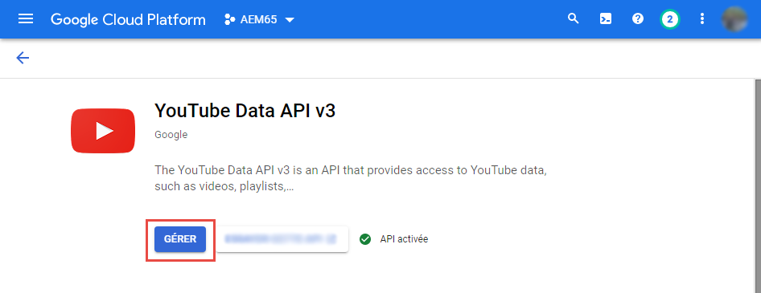
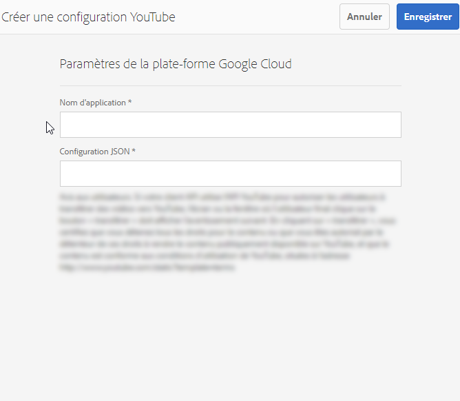
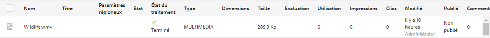
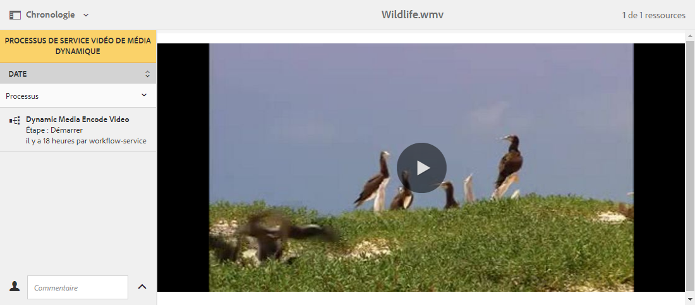
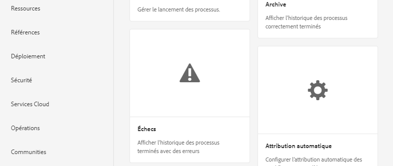
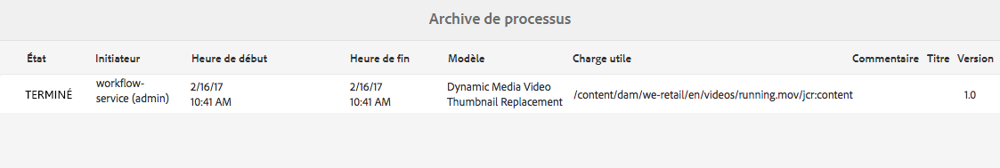

# Vidéo {#video}

Cette section décrit l’utilisation de vidéos dans Dynamic Media.

## Démarrage rapide : vidéos {#quick-start-videos}

Le workflow décrit en détail ci-après vise à vous aider à maîtriser rapidement les opérations liées aux visionneuses de vidéos adaptatives dans Dynamic Media. Chaque étape comporte des renvois à des rubriques contenant de plus amples informations.

>[!NOTE]
>
>Avant d’utiliser des vidéos dans Dynamic Media, vérifiez que l’administrateur Adobe Experience Manager a activé et configuré les Cloud Services Dynamic Media.
>
>* Voir [Configuration des Cloud Services Dynamic Media](/help/assets/dynamic-media/config-dm.md#configuring-dynamic-media-cloud-services) dans Configuration de Dynamic Media et [Dépannage de Dynamic Media](/help/assets/dynamic-media/troubleshoot-dm.md).
>


1. **Chargez les vidéos Dynamic Media** en procédant comme suit :

   * Créez votre propre profil de codage vidéo. Vous pouvez également utiliser le profil _Codage vidéo adaptatif_ prédéfini fourni avec Dynamic Media.

      * [Création d’un profil de codage vidéo](/help/assets/dynamic-media/video-profiles.md#creating-a-video-encoding-profile-for-adaptive-streaming).
      * En savoir plus sur les [bonnes pratiques relatives au codage vidéo](#best-practices-for-encoding-videos).
   * Associez le profil de traitement vidéo à un ou plusieurs dossiers dans lequel vous allez charger les vidéos issues de sources originales.

      * [Application d’un profil vidéo à des dossiers](/help/assets/dynamic-media/video-profiles.md#applying-a-video-profile-to-folders).
      * En savoir plus sur l’[organisation des ressources numériques](/help/assets/organize-assets.md).
   * Chargez les vidéos issues de sources originales dans les dossiers. Lorsque vous ajoutez des vidéos au dossier, elles sont codées selon le profil de traitement vidéo affecté au dossier.

      * Dynamic Media prend principalement en charge les vidéos de forme courte avec une durée maximale de 30 minutes et une résolution minimale supérieure à 25 x 25.
      * Vous pouvez charger des fichiers vidéo d’une taille de 15 Go chacun au maximum.
      * [Chargement des vidéos](/help/assets/manage-video-assets.md#upload-and-preview-video-assets).
      * En savoir plus sur les [formats de fichiers d’entrée pris en charge](/help/assets/file-format-support.md).
   * Contrôle la façon dont l’[encodage vidéo progresse](#monitoring-video-encoding-and-youtube-publishing-progress) du point de vue de la ressource ou du processus.


1. **Gérez les vidéos Dynamic Media** en effectuant les opérations suivantes :

   * Organisez, parcourez et recherchez des ressources vidéo

      * [Organisation des ressources numériques](/help/assets/organize-assets.md)
      * [Recherche de ressources vidéo](/help/assets/search-assets.md#custompredicates) ou [Recherche de ressources](/help/assets/manage-digital-assets.md#search-assets)
   * Prévisualisez et publiez des ressources vidéo

      * Affichez la vidéo source et les rendus codés de la vidéo avec les miniatures associées :
         [Prévisualisation de vidéos](/help/assets/manage-video-assets.md#upload-and-preview-video-assets) ou [Prévisualisation de ressources](/help/assets/dynamic-media/previewing-assets.md)
         [Gestion des rendus vidéo](/help/assets/manage-digital-assets.md#managing-renditions)

      * [Gestion des paramètres prédéfinis de visionneuse](/help/assets/dynamic-media/managing-viewer-presets.md)
      * [Publier les ressources](/help/assets/dynamic-media/publishing-dynamicmedia-assets.md)
   * Utilisation des métadonnées vidéo

      * Modifiez les propriétés vidéo telles que le titre, la description, les balises et les champs de métadonnées personnalisées :
         [Modification des propriétés vidéo](/help/assets/manage-digital-assets.md#editing-properties)

      * [Gestion des métadonnées des ressources numériques](/help/assets/manage-metadata.md)
      * [Schémas de métadonnées](/help/assets/metadata-schemas.md)
   * Examen, approbation et annotation des vidéos, et conservation le contrôle total des versions

      * [Annotation de vidéos](/help/assets/manage-video-assets.md#annotate-video-assets) ou [Annotation de ressources](/help/assets/manage-digital-assets.md#annotating)

      * [Création d’une version](/help/assets/manage-digital-assets.md#asset-versioning)
      * [Démarrage d’un workflow sur une ressource](/help/assets/manage-digital-assets.md#starting-a-workflow-on-an-asset)

      * [Examen des ressources des dossiers](/help/assets/bulk-approval.md)
      * [Projets](/help/sites-cloud/authoring/projects/overview.md)


1. Pour **publier les vidéos Dynamic Media**, effectuez l’une des opérations suivantes :

   * Si vous utilisez Experience Manager en tant que système de gestion de contenu web (WCM), vous pouvez ajouter directement des vidéos à vos pages web.

      * [Ajout de vidéos à des pages web](/help/assets/dynamic-media/adding-dynamic-media-assets-to-pages.md).
   * Si vous utilisez un système de gestion de contenu web tiers, vous pouvez lier ou incorporer des vidéos dans vos pages web.

      * Intégrez une vidéo à l’aide d’une URL :
         [Liaison d’URL à votre application web](/help/assets/dynamic-media/linking-urls-to-yourwebapplication.md).

      * Intégrez une vidéo à l’aide du code intégré dans la page web :
         [Incorporation de la visionneuse de vidéos dans une page web](/help/assets/dynamic-media/embed-code.md).
   * [Publication de vidéos sur YouTube](#publishing-videos-to-youtube).
   * [Génération de rapports vidéo](#viewing-video-reports).

   * [Ajout de sous-titres à une vidéo](#adding-captions-to-video).


## Utilisation de vidéo dans Dynamic Media {#working-with-video-in-dynamic-media}

Video in Dynamic Media est une solution complète qui facilite la publication de vidéos adaptatives haute qualité pour la diffusion sur plusieurs écrans, notamment les postes de travail, les tablettes et les appareils mobiles. Une visionneuse de vidéos adaptative regroupe les versions d’une même vidéo codées dans des débits et des formats différents, par exemple 400 kbit/s, 800 kbit/s et 1 000 kbit/s. Le poste de travail ou l’appareil mobile détecte la bande passante disponible.

Par exemple, sur un appareil mobile iOS, il détecte une bande passante telle que 3G, 4G ou une connexion Wi-Fi, puis sélectionne automatiquement la vidéo codée selon le débit correspondant parmi ceux disponibles dans la visionneuse de vidéos adaptative. La vidéo est diffusée en continu sur les postes de travail, les appareils mobiles ou les tablettes.

En outre, la qualité de la vidéo est automatiquement adaptée en temps réel selon les conditions réseau sur le poste de travail ou l’appareil mobile. En outre, si un client passe en mode Plein écran sur un bureau, la visionneuse de vidéos adaptative répond en utilisant une meilleure résolution, améliorant ainsi l’expérience de visionnage du client. L’utilisation des visionneuses de vidéos adaptatives offre une lecture optimale aux clients qui lisent des vidéos Dynamic Media sur plusieurs écrans et appareils.

La logique appliquée par un lecteur vidéo pour déterminer quelles sont les vidéos encodées à lire ou à sélectionner au cours de la lecture repose sur l’algorithme suivant :

1. Le lecteur vidéo charge le fragment vidéo initial basé sur le débit le plus proche de la valeur définie pour le « débit initial » dans le lecteur lui-même.
1. Le lecteur vidéo est adapté en fonction des modifications de la vitesse de bande passante d’après les critères suivants :

   1. Le lecteur sélectionne le flux de bande passante le plus élevé qui est inférieur ou égal à la bande passante estimée.
   1. Le lecteur prend uniquement en compte 80 % de la bande passante disponible. Cependant, s’il change, il est préférable que ce taux soit seulement de 70 % pour éviter toute surestimation et que le lecteur ne repasse au taux précédent.

Pour obtenir des informations techniques détaillées sur l’algorithme, consultez la page [https://android.googlesource.com/platform/frameworks/av/+/master/media/libstagefright/httplive/LiveSession.cpp](https://android.googlesource.com/platform/frameworks/av/+/master/media/libstagefright/httplive/LiveSession.cpp)

Pour la gestion des visionneuses de vidéos adaptative et unique, les fonctions suivantes sont prises en charge :

* Chargement de vidéos dans de nombreux formats vidéo et audio pris en charge et codage vidéo au format MP4 H.264 pour lecture sur plusieurs écrans. Vous pouvez utiliser les paramètres prédéfinis de vidéo adaptative ou de codage unique ou personnaliser le codage pour contrôler la qualité et la taille de la vidéo.

   * Lorsqu’une visionneuse de vidéos adaptative est générée, elle comprend des vidéos MP4.
   * **Remarque** : Les vidéos originales/sources ne sont pas ajoutées à la visionneuse de vidéos adaptative.

* Sous-titrage des vidéos dans toutes les visionneuses de vidéo HTML5.
* Organiser, parcourir et effectuer des recherches dans la vidéo avec une prise en charge complète des métadonnées pour une gestion efficace des ressources vidéo.
* Diffuser des visionneuses de vidéos adaptatives sur le web et sur les postes de travail, les tablettes et les appareils mobiles.

La diffusion de vidéo adaptative en continu est prise en charge sur différentes plateformes iOS. Voir [Guide de référence des visionneuses de médias dynamiques](https://experienceleague.adobe.com/docs/dynamic-media-developer-resources/library/viewers-aem-assets-dmc/video/c-html5-video-reference.html?lang=fr).

<!-- OUTDATED 2/28/22 BASED ON CQDOC-18692 Dynamic Media supports mobile video playback for MP4 H.264 video. You can find BlackBerry&reg; devices that support this video format at the following: [Supported video formats on BlackBerry&reg;](https://support.blackberry.com/kb/articleDetail?ArticleNumber=000005482).

OUTDATED 2/28/22 BASED ON CQDOC-18692 You can find Windows&reg; devices that support this video format at the following [Supported video formats on Windows&reg; Phone](https://docs.microsoft.com/en-us/windows/uwp/audio-video-camera/supported-codecs). -->

* Lecture de la vidéo à l’aide des paramètres prédéfinis de la visionneuse Dynamic Media Video, tels que :

   * des visionneuses de vidéos uniques ;
   * des visionneuses de médias mixtes combinant du contenu vidéo et des images.

* Configurer des lecteurs vidéo pour répondre à vos besoins de stratégie de marque.
* Intégrer la vidéo à votre site web, site mobile ou application mobile grâce à une simple URL ou à du code intégré.

Voir l’exemple [Lecture de vidéo dynamique](https://s7d9.scene7.com/s7/uvideo.jsp?asset=GeoRetail/Mop_AVS&amp;config=GeoRetail/Universal_Video1&amp;stageSize=640,480).

Voir aussi [Visionneuses pour Experience Manager Assets et Dynamic Media Classic](https://experienceleague.adobe.com/docs/dynamic-media-developer-resources/library/viewers-aem-assets-dmc/c-html5-s7-aem-asset-viewers.html?lang=fr#viewers-aem-assets-dmc) et [Visionneuses pour Experience Manager Assets uniquement](https://experienceleague.adobe.com/docs/dynamic-media-developer-resources/library/viewers-for-aem-assets-only/c-html5-aem-asset-viewers.html?lang=fr#viewers-for-aem-assets-only) dans le [Guide de référence des visionneuses de médias dynamiques](https://experienceleague.adobe.com/docs/dynamic-media-developer-resources.html?lang=fr).

## Bonne pratique : Utilisation de la visionneuse de vidéos HTML5 {#best-practice-using-the-html-video-viewer}

Les paramètres prédéfinis de la visionneuse de vidéos HTML5 Dynamic Media sont des lecteurs vidéo fiables. Utilisez-les pour éviter la plupart des problèmes courants liés à la lecture de vidéos HTML5, ainsi que les problèmes liés aux appareils mobiles. Par exemple, une limitation de la diffusion en continu adaptative et de la portée du navigateur de bureau.

Du côté de la conception du lecteur, vous pouvez concevoir la fonctionnalité du lecteur vidéo à l’aide d’outils de développement web standard. Vous pouvez, par exemple, concevoir les boutons, les commandes et les affiches personnalisées en arrière-plan au moyen du code HTML5 et CSS afin de mieux cibler les utilisateurs avec un aspect personnalisé.

Du côté lecture de la visionneuse, elle détecte automatiquement les fonctionnalités vidéo du navigateur. Il diffuse ensuite la vidéo à l’aide de HLS ou DASH, également appelé diffusion en continu de vidéo adaptative. Si ces méthodes de distribution n’existent pas, la diffusion progressive HTML5 est utilisée à la place.

>[!NOTE]
>
>Pour utiliser DASH pour vos vidéos, il doit d’abord être activé par le support technique d’Adobe sur votre compte. Voir [Activation de DASH sur votre compte](#enable-dash).)

Vous pouvez combiner dans un unique lecteur la possibilité de concevoir les composants de lecture à l’aide de HTML5 et CSS. Il peut comporter une lecture incorporée et utiliser la diffusion en continu adaptative et progressive selon les fonctionnalités du navigateur. Grâce à cette fonctionnalité, vous pouvez étendre la portée de votre contenu multimédia aux utilisateurs d’ordinateur et de mobile et garantir une expérience vidéo fluide.

Consultez également [Visionneuses pour Experience Manager Assets uniquement](https://experienceleague.adobe.com/docs/dynamic-media-developer-resources/library/viewers-for-aem-assets-only/c-html5-aem-asset-viewers.html?lang=fr#viewers-for-aem-assets-only) dans le [Guide de référence des visionneuses de médias dynamiques](https://experienceleague.adobe.com/docs/dynamic-media-developer-resources.html?lang=fr).


### Lecture vidéo sur les ordinateurs de bureau et les appareils mobiles à l’aide de la visionneuse de vidéos HTML5 {#playback-of-video-on-desktop-computers-and-mobile-devices-using-the-html-video-viewer}

Pour la diffusion en flux continu de la vidéo adaptative sur un poste de travail et un appareil mobile, les vidéos utilisées pour le changement de débit reposent sur toutes les vidéos MP4 dans la visionneuse de vidéos adaptative.

La lecture vidéo se produit à l’aide du téléchargement vidéo HLS, DASH ou progressif. Dans les versions antérieures d’Experience Manager, telles que 6.0, 6.1 et 6.2, les vidéos étaient diffusées via HTTP.

Toutefois, dans Experience Manager 6.3 et versions ultérieures, les vidéos sont désormais diffusées en continu via HTTPS (c’est-à-dire, HLS ou DASH), car l’URL du service de passerelle DM utilise toujours HTTPS également. Il n’y a aucun impact pour le client dans ce comportement par défaut. Autrement dit, la diffusion en continu de vidéo s’effectuera tout de même via HTTPS, à moins qu’elle ne soit pas prise en charge par le navigateur (voir le tableau ci-dessous).

>[!NOTE]
>
>Pour utiliser DASH pour vos vidéos, il doit d’abord être activé par le support technique d’Adobe sur votre compte. Voir [Activation de DASH sur votre compte](#enable-dash).)

Par conséquent,

* Si vous avez un site web HTTPS avec une diffusion vidéo en continu via HTTPS, la diffusion en continu est de qualité.
* Si vous avez un site web HTTP avec une diffusion vidéo en flux continu via HTTPS, la diffusion en continu est de qualité et il n’y a aucun problème de contenu mixte du navigateur web.

HLS est une norme d’Apple pour la diffusion de vidéo adaptative en continu qui ajuste automatiquement la lecture en fonction de la capacité de bande passante du réseau. Elle permet aussi au client ou à la cliente de « rechercher » n’importe quel point de la vidéo sans avoir à attendre que le reste de la vidéo soit téléchargé.

La vidéo progressive est diffusée en téléchargeant et en stockant la vidéo localement sur le système de bureau ou l’appareil mobile d’un utilisateur.

Le tableau ci-dessous décrit l’appareil, le navigateur et la méthode de lecture des vidéos sur les ordinateurs de bureau et les appareils mobiles à l’aide de la [visionneuse de vidéos HTML5 Dynamic Media](https://experienceleague.adobe.com/docs/dynamic-media-developer-resources/library/viewers-for-aem-assets-only/interactive-video/c-html5-aem-int-video.html?lang=fr#interactive-video).

<table>
 <tbody>
  <tr>
   <td><strong>Appareil</strong></td>
   <td><strong>Navigateur</strong></td>
   <td><strong>Mode lecture vidéo</strong></td>
  </tr>
  <tr>
   <td>Poste de travail</td>
   <td>Internet Explorer 9 et 10</td>
   <td>Téléchargement progressif.</td>
  </tr>
  <tr>
   <td>Poste de travail</td>
   <td>Internet Explorer 11+</td>
   <td>Sous Windows® 8 et Windows® 10 – Forcer l’utilisation de HTTPS chaque fois que HLS est demandé. Limites connues : HTTP sur HLS ne fonctionne pas avec cette combinaison de navigateur/système d’exploitation<br /> <br /> Sous Windows® 7 – Téléchargement progressif. Utilise la logique standard pour sélectionner le protocole HTTP ou HTTPS.</td>
  </tr>
  <tr>
   <td>Poste de travail</td>
   <td>Firefox 23 à 44</td>
   <td>Téléchargement progressif.</td>
  </tr>
  <tr>
   <td>Poste de travail</td>
   <td>Firefox 45 ou version ultérieure</td>
   <td>HLS ou diffusion en continu adaptative DASH*</td>
  </tr>
  <tr>
   <td>Poste de travail</td>
   <td>Chrome</td>
   <td>Diffusion en continu adaptative HLS ou DASH*</td>
  </tr>
  <tr>
   <td>Poste de travail</td>
   <td>Safari (Mac)</td>
   <td>HLS ou diffusion en continu adaptative DASH*</td>
  </tr>
  <tr>
   <td>Mobile</td>
   <td>Chrome (Android™ 6 ou version antérieure)</td>
   <td>Téléchargement progressif.</td>
  </tr>
  <tr>
   <td>Mobile</td>
   <td>Chrome (Android™ 7 ou version ultérieure)</td>
   <td>HLS ou DASH* diffusion en continu adaptative/td&gt;
  </tr>
  <tr>
   <td>Mobile</td>
   <td>Android™ (navigateur par défaut)</td>
   <td>Téléchargement progressif.</td>
  </tr>
  <tr>
   <td>Mobile</td>
   <td>Safari (iOS)</td>
   <td>HLS ou diffusion en continu adaptative DASH*</td>
  </tr>
  <tr>
   <td>Mobile</td>
   <td>Chrome (iOS)</td>
   <td>HLS ou diffusion en continu adaptative DASH*</td>
  </tr>
 </tbody>
</table>

>[!IMPORTANT]
>
>*Pour utiliser le DASH pour vos vidéos, il doit d’abord être activé par le support technique d’Adobe sur votre compte. Voir [Activation de DASH sur votre compte](#enable-dash).)

<!--  THIS LINE WAS REMOVED FROM THE TABLE ABOVE ON FEB 28, 2022 BASED ON CQDOC 18692 -RSB <tr>
   <td>Mobile</td>
   <td>BlackBerry&reg;</td>
   <td>HLS or DASH</td>
  </tr>
 -->

## Architecture de la solution vidéo Dynamic Media {#architecture-of-dynamic-media-video-solution}

Le graphique suivant montre le workflow global de création de vidéos qui sont chargées et codées par le biais de DMGateway (dans le mode Hybride Dynamic Media) et mises à disposition pour une consommation publique.


## Architecture de publication hybride des vidéos {#hybrid-publishing-architecture-for-videos}


## Bonnes pratiques en matière de codage de vidéos {#best-practices-for-encoding-videos}

Le processus **Vidéo de codage de média dynamique** encode la vidéo si vous avez activé Dynamic Media et configuré les Cloud Services vidéo. Ce workflow capture l’historique de traitement des workflows et les informations d’échec. Voir [Surveillance du codage vidéo et de la progression de la publication sur YouTube](#monitoring-video-encoding-and-youtube-publishing-progress). Si vous avez activé Dynamic Media et configuré les services cloud vidéo, le workflow **[!UICONTROL Vidéo de codage de média dynamique]** prend automatiquement effet lorsque vous chargez une vidéo. (Si vous n’utilisez pas Dynamic Media, le workflow **[!UICONTROL Ressource de mise à jour DAM]** prend effet.)

Vous trouverez ci-dessous quelques conseils sur les bonnes pratiques de codage des fichiers source vidéo.

<!-- For advice about video encoding, see the following:

* [Streaming 101: The Basics — Codecs, Bandwidth, Data Rate, and Resolution](https://www.adobe.com/go/learn_s7_streaming101_en).
* [Video Encoding Basics](https://www.adobe.com/go/learn_s7_encoding_en). -->

### Fichiers vidéo source {#source-video-files}

Lorsque vous codez un fichier vidéo, utilisez un fichier vidéo source ayant la plus haute qualité possible. Évitez d’utiliser des fichiers vidéo précédemment codés, car ces fichiers sont déjà compressés, et un codage supplémentaire crée une vidéo de qualité inférieure.

* Dynamic Media prend principalement en charge les vidéos de forme courte avec une durée maximale de 30 minutes et une résolution minimale supérieure à 25 x 25.
* Vous pouvez charger des fichiers vidéo de source principale d’une taille de 15 Go chacun au maximum.

Le tableau ci-dessous décrit la taille recommandée, le format et le débit minimal requis pour vos fichiers vidéo sources au moment de leur codage :

| Taille | Format | Débit minimal |
|--- |--- |--- |
| 1024 x 768 | 4:3 | 4 500 Kbit/s pour la plupart des vidéos. |
| 1280 x 720 | 16:9 | 3 000 à 6 000 Kbit/s, selon la quantité de mouvement dans la vidéo. |
| 1 920 x 1 080 | 16:9 | 6 000 à 8 000 kbit/s en fonction de la quantité de mouvement sur la vidéo. |

### Obtention des métadonnées d’un fichier {#obtaining-a-file-s-metadata}

Vous pouvez obtenir les métadonnées d’un fichier en les affichant à l’aide d’un outil de modification pour les vidéos ou en utilisant une application conçue pour obtenir les métadonnées. Vous trouverez ci-dessous des instructions sur l’utilisation de MediaInfo, une application tierce, pour obtenir les métadonnées d’un fichier vidéo :

1. Accédez à [Téléchargement MediaInfo](https://mediaarea.net/fr/MediaInfo/Download).
1. Sélectionnez et téléchargez le programme d’installation pour la version avec l’interface graphique utilisateur, puis suivez les instructions d’installation.
1. Après l’installation, cliquez avec le bouton droit sur le fichier vidéo (Windows® uniquement) et sélectionnez MediaInfo, ou bien ouvrez MediaInfo et faites glisser votre fichier vidéo dans l’application. Toutes les métadonnées de votre fichier vidéo, telles que sa largeur, sa hauteur et le nombre d’images par seconde, sont alors visibles à l’écran.

### Format {#aspect-ratio}

Lorsque vous choisissez ou créez un paramètre prédéfini de codage vidéo pour votre fichier vidéo issu de sources originales, assurez-vous que le paramètre prédéfini indique le même format que le fichier vidéo issu de sources originales. Le format fait référence au rapport largeur/hauteur de la vidéo.

Pour déterminer les proportions d’un fichier vidéo, obtenez les métadonnées du fichier et notez la largeur et la hauteur du fichier (voir Obtention des métadonnées d’un fichier ci-dessus). Utilisez ensuite cette formule pour déterminer le format :

largeur/hauteur = format

Ce tableau décrit la façon dont les résultats de la formule se traduisent en choix de formats :

| Résultat de la formule | Format |
|--- |--- |
| 1.33 | 4:3 |
| 0,75 | 3:4 |
| 1,78 | 16:9 |
| 0.56 | 9:16 |

Par exemple, une vidéo qui a une largeur de 1440 pour une hauteur de 1080 a un format de 1440/1080, soit 1,33. Dans ce cas, vous choisissez un paramètre prédéfini de codage vidéo avec un format de 4:3 pour le codage du fichier vidéo.

### Débit binaire {#bitrate}

Le débit correspond à la quantité de données encodées pour produire une seule seconde de lecture vidéo. Le débit de données est mesuré en kilobits par seconde (kbit/s).

>[!NOTE]
>
>Du fait que tous les codecs utilisent la compression avec perte, le débit de données est le facteur le plus important de la qualité vidéo. Quand vous utilisez la compression avec perte, plus vous compressez la vidéo, plus la qualité de l’image se dégrade. Toutes les autres caractéristiques étant égales (résolution, taux de rafraîchissement et codec), plus le débit de données est faible, moins la qualité du fichier compressé est bonne.

Lorsque vous sélectionnez l’encodage du débit, vous avez le choix entre deux types :

* **[!UICONTROL Encodage à débit constant]** (CBR) : pendant l’encodage CBR, le débit ou le nombre de bits par seconde est conservé pendant tout le processus d’encodage. L’encodage CBR maintient le débit défini selon votre configuration sur l’intégralité de la vidéo. En outre, le codage CBR n’optimise pas la qualité des fichiers multimédias, mais économise de l’espace de stockage.
Utilisez le codage CBR si votre vidéo présente globalement un niveau de mouvement similaire. Le codage CBR est le plus souvent utilisé pour diffuser le contenu vidéo en continu. Voir également [Utilisation de paramètres de codage vidéo personnalisés](/help/assets/dynamic-media/video-profiles.md#using-custom-added-video-encoding-parameters).

* **[!UICONTROL Codage à débit variable]** (VBR) : l’encodage VBR ajuste le débit de données vers le bas et la limite supérieure que vous définissez, en fonction des données requises par le compresseur. Cette fonctionnalité implique que lors d’un processus de codage VBR, le débit du fichier multimédia augmente ou diminue de manière dynamique en fonction des besoins du débit de fichiers multimédias.
Le VBR prend plus de temps au codage, mais garantit de meilleurs résultats, avec une qualité de fichier multimédia supérieure. Le codage VBR est couramment utilisé pour la diffusion http progressive de contenu vidéo.

Dans quels cas utilisez-vous le VBR ou le CBR ?
Lorsque vous devez choisir entre VBR et CBR, il est presque toujours recommandé d’utiliser le VBR pour vos fichiers multimédias. Le VBR vous garantit des fichiers de meilleure qualité à des débits compétitifs. Lorsque vous utilisez le VBR, assurez-vous d’utiliser le codage à deux passages, et définissez le débit maximal afin qu’il soit 1,5 fois supérieur au débit vidéo cible.

Lorsque vous choisissez un paramètre prédéfini de codage vidéo, veillez à tenir compte de la vitesse de connexion de l’utilisateur final cible. Choisissez un paramètre prédéfini avec un débit de données correspondant à 80 % de cette vitesse. Par exemple, si la vitesse de connexion de l’utilisateur final est de 1 000 Kbit/s, le meilleur paramètre prédéfini est celui avec un débit de données vidéo de 800 Kbit/s.

Ce tableau décrit le débit de données associé à des vitesses de connexion courantes.

| Vitesse (kbit/s) | Type de connexion |
|--- |--- |
| 256 | Connexion d’accès à distance. |
| 800 | Connexion mobile standard. Pour cette connexion, visez un débit de données de 400 à 800 kbit/s pour les expériences 3G. |
| 2000 | Connexion haut débit standard de bureau. Pour cette connexion, visez un débit de données de 800 à 2 000 kbit/s, bien qu’un débit de 1 200 à 1 500 kbit/s convienne à la plupart des cibles. |
| 5000 | Connexion haut débit standard. Il est déconseillé de coder dans cette plage supérieure, car la diffusion de la vidéo à cette vitesse n’est pas possible pour la plupart des consommateurs. |

### Résolution {#resolution}

**Résolution** décrit la hauteur et la largeur d’un fichier vidéo, en pixels. La plupart des vidéos sources sont stockées à une résolution élevée (par exemple, 1 920 x 1 080). Pour la diffusion en continu, la vidéo source est compressée à une résolution inférieure (640 x 480 ou moins).

La résolution et le débit de données sont deux facteurs étroitement liés qui déterminent la qualité de la vidéo. Pour maintenir la même qualité vidéo, plus le nombre de pixels (c’est-à-dire la résolution) est élevé dans un fichier vidéo, plus le débit de données doit l’être également. Par exemple, considérez le nombre de pixels par image dans un fichier vidéo d’une résolution de 320 x 240 pixels et dans un fichier vidéo d’une résolution de 640 x 480 pixels :

| Résolution | Pixels par image |
|--- |--- |
| 320 x 240 | 76 800 |
| 640 x 480 | 307 200 |

Le fichier de 640 x 480 possède quatre fois plus de pixels par image. Pour atteindre le même débit de données avec ces deux résolutions, vous appliquez une compression de 4 au fichier d’une résolution de 640 x 480 pixels, ce qui peut réduire la qualité de la vidéo. Par conséquent, un débit de données vidéo de 250 kbit/s produit un affichage de haute qualité à une résolution de 320 x 240 pixels, mais pas à une résolution de 640 x 480 pixels.

En général, plus le débit de données que vous utilisez est élevé, plus la qualité de votre vidéo est bonne, et plus vous utilisez une résolution élevée, plus de débit de données dont vous avez besoin est élevé pour conserver la qualité de visionnage (en comparaison avec des résolutions plus basses).

Du fait que la résolution et le débit de données sont liés, vous avez le choix entre deux options lors du codage vidéo :

* Choisir un débit de données puis, en fonction de ce paramètre, coder à la résolution la plus haute pour obtenir une vidéo de bonne qualité.
* Choisir une résolution, puis coder au débit de données nécessaire pour que la qualité vidéo soit optimale à la résolution choisie.

Lorsque vous choisissez (ou créez) un paramètre prédéfini de codage vidéo pour votre fichier vidéo source original, utilisez ce tableau pour choisir la résolution cible appropriée :

| Résolution | Hauteur (pixels) | Taille d’écran |
|--- |--- |--- |
| 240p | 240 | Écran de très petite taille |
| 300p | 300 | Petit écran équipant généralement les appareils mobiles |
| 360p | 360 | Petit écran |
| 480p | 480 | Écran de taille moyenne |
| 720p | 720 | Grand écran |
| 1 080p | 1080 | Grand écran haute définition |

### Images par seconde  {#fps-frames-per-second}

Aux États-Unis et au Japon, la plupart des vidéos sont tournées à 29,97 ips (images par seconde) ; en Europe, la plupart des vidéos le sont à 25 ips. Un film est tourné à 24 ips.

Choisissez un paramètre prédéfini de codage vidéo correspondant au nombre d’images par seconde de votre vidéo issue de sources originales. Par exemple, si le débit est de 25 ips pour la vidéo issue de sources originales, choisissez un paramètre prédéfini de 25 ips pour le codage. Par défaut, tous les codages personnalisés utilisent le nombre d’images par seconde du fichier vidéo source Principal. C’est pourquoi il est inutile d’indiquer le nombre d’images par seconde lorsque vous créez un paramètre prédéfini de codage vidéo.

### Dimensions du codage vidéo {#video-encoding-dimensions}

Pour obtenir des résultats optimaux, sélectionnez les dimensions de codage de façon à ce que la vidéo source corresponde à un multiple entier de toutes vos vidéos codées.

Pour ce faire, il suffit de diviser la largeur de la source par la largeur codée pour obtenir le rapport de largeur, puis de diviser la hauteur de la source par la hauteur codée pour obtenir le rapport de hauteur.

Si le résultat est un nombre entier, cela signifie que la mise à l’échelle de la vidéo est parfaite. Si le résultat n’est pas un nombre entier, la qualité vidéo s’en ressentira en raison de la présence d’artefacts vidéo (pixels résiduels). Cet effet est plus visible lorsque la vidéo contient du texte.

Supposons, par exemple, que la résolution de votre vidéo source soit équivalente à 1920 x 1080 pixels. Dans le tableau ci-après, les trois vidéos codées indiquent les paramètres de codage optimaux à appliquer.

| Type de vidéo | Largeur x hauteur | Rapport de largeur | Rapport de hauteur |
|--- |--- |--- |--- |
| Source | 1 920 x 1 080 | 1 | 1 |
| Codée | 960 x 540 | 2 | 2 |
| Codée | 640 x 360 | 3 | 3 |
| Codée | 480 x 270 | 4 | 4 |

### Format de fichier vidéo codé {#encoded-video-file-format}

Dynamic Media recommande d’utiliser les paramètres prédéfinis MP4 H.264 de codage vidéo. Comme les fichiers MP4 utilisent le codec vidéo H.264, la vidéo est de haute qualité mais dans un fichier au volume compressé.

### Activation de DASH sur votre compte {#enable-dash}

DASH (Digital Adaptive Streaming over HTTP) est la norme internationale pour la diffusion en continu de vidéos, largement adoptée par les différentes visionneuses de vidéos. Lorsque vous activez DASH, vous avez la possibilité de choisir entre HLS ou DASH pour la diffusion en continu de vidéo adaptative. Vous pouvez également opter pour les deux avec basculement automatique entre les lecteurs.

Voici quelques avantages clés de l’activation du DASH sur votre compte :

* Regroupez la vidéo de flux DASH pour la diffusion en continu adaptative. Cette méthode permet d&#39;accroître l&#39;efficacité de la diffusion. La diffusion en continu adaptative garantit la meilleure expérience d’affichage à vos clients.
* La diffusion en continu optimisée par le navigateur avec les lecteurs Dynamic Media bascule entre la diffusion en continu HLS et DASH pour garantir la meilleure qualité de service. Le lecteur vidéo passe automatiquement à HLS lorsqu’un navigateur Safari est utilisé.
* Vous pouvez configurer votre méthode de diffusion en continu préférée (HLS ou DASH) en modifiant le paramètre prédéfini de la visionneuse de vidéos.
* Le codage vidéo optimisé garantit qu’aucun stockage supplémentaire n’est utilisé lors de l’activation de la fonctionnalité DASH. Un seul ensemble de codes vidéo est créé pour HLS et DASH afin d’optimiser les coûts de stockage vidéo.
* Permet à vos clients de rendre la diffusion vidéo plus accessible.
* Vous pouvez également obtenir l’URL de diffusion en continu au moyen des API.

Vous lancez une demande d’utilisation de DASH ; il n’est pas activé automatiquement sur votre compte.

>[!IMPORTANT]
>
>L’activation de DASH sur votre compte est actuellement disponible uniquement en Amérique du Nord.

Créez un dossier de support, comme décrit ci-dessous. Dans votre cas de prise en charge, veillez à indiquer que vous souhaitez que le DASH soit activé sur votre compte.

**Pour activer DASH sur votre compte :**

1. [Utilisez l’Admin Console pour commencer la création d’un nouveau dossier de support.](https://helpx.adobe.com/fr/enterprise/using/support-for-experience-cloud.html).
1. Suivez les instructions pour créer un cas d’assistance tout en vous assurant de fournir les informations suivantes :

   * nom, adresse électronique et numéro de téléphone du contact principal.
   * Vous souhaitez activer DASH sur votre compte Dynamic Media.

1. Le service clientèle d’Adobe vous ajoute à la liste d’attente des clients de DASH en fonction de l’ordre dans lequel les demandes sont envoyées.
1. Lorsque Adobe est prêt à traiter votre demande, le service clientèle vous contacte pour coordonner et définir une date cible pour l’activation DASH.
1. Une fois la procédure achevée, vous en serez informé par l’équipe du service clientèle.
1. Créez votre [paramètre prédéfini de visionneuse vidéo](#creating-a-new-viewer-preset) comme d&#39;habitude.


## Publication de vidéos sur YouTube {#publishing-videos-to-youtube}

Vous pouvez publier des ressources vidéo gérées dans Experience Manager Assets directement sur une chaîne YouTube que vous avez précédemment créée.

Pour publier des ressources vidéo sur YouTube, vous devez les baliser dans Experience Manager Assets avec des balises. Vous associez ces balises à une chaîne YouTube. Si la balise d’une ressource vidéo correspond à la balise d’une chaîne YouTube, la vidéo est publiée sur YouTube. La publication sur YouTube se produit avec une publication normale de la vidéo à condition qu’une balise associée soit utilisée.

YouTube procède à son propre codage. Ainsi, le fichier vidéo d’origine qui a été chargé dans Experience Manager est publié sur YouTube au lieu de tout rendu vidéo créé par le codage Dynamic Media. Même s’il n’est pas nécessaire de traiter les vidéos à l’aide de Dynamic Media, il est supposé qu’elles le sont si un paramètre prédéfini de visionneuse est nécessaire pour la lecture.

Lorsque vous ignorez le profil de traitement vidéo et que vous effectuez directement la publication sur YouTube, votre ressource vidéo ne dispose pas de miniature visible dans Experience Manager Assets. Cela signifie également que les vidéos qui ne sont pas codées ne fonctionneront avec aucun type de ressource Dynamic Media.

Pour garantir une vérification serveur à serveur sécurisée avec YouTube, la publication des vidéos sur les serveurs YouTube implique les tâches suivantes :

1. [Configuration des paramètres de Google Cloud](#configuring-google-cloud-settings)
1. [Création d’une chaîne YouTube](#creating-a-youtube-channel)
1. [Ajout de balises pour la publication](#adding-tags-for-publishing)
1. [Configuration de YouTube dans Experience Manager](#setting-up-youtube-in-aem)
1. [(Facultatif) Automatisation de la définition des propriétés YouTube par défaut pour vos vidéos chargées](#optional-automating-the-setting-of-default-youtube-properties-for-your-uploaded-videos)
1. [Publication de vidéos sur votre chaîne YouTube](#publishing-videos-to-your-youtube-channel)
1. [(Facultatif) Vérification de la vidéo publiée sur YouTube](/help/assets/dynamic-media/video.md#optional-verifying-the-published-video-on-youtube)
1. [Liaison d’URL YouTube à votre application web](#linking-youtube-urls-to-your-web-application)

Vous pouvez également [annuler la publication de vidéos pour les supprimer de YouTube](#unpublishing-videos-to-remove-them-from-youtube).

### Configuration des paramètres de Google Cloud {#configuring-google-cloud-settings}

Pour effectuer une publication sur YouTube, vous avez besoin d’un compte Google. Si vous disposez d’un compte GMAIL, alors vous disposez déjà d’un compte Google ; si vous ne disposez pas d’un compte Google, vous pouvez facilement en créer un. Un compte est nécessaire, car vous avez besoin des informations d’identification pour publier des ressources vidéo sur YouTube. <!-- hidden March 3 2022 If you have an account already created, then skip this task and proceed directly to [Create a YouTube channel](#creating-a-youtube-channel). -->

Il n’est pas nécessaire que le compte utilisé avec Google Cloud et le compte Google utilisé pour YouTube soient les mêmes.

Google modifie régulièrement son interface utilisateur. De ce fait, les étapes de publication des vidéos sur YouTube peuvent varier légèrement des étapes présentées ci-dessous. Cet avertissement s’applique également à YouTube lorsque vous tentez de vérifier si des vidéos y sont téléchargées.

>[!NOTE]
>
>Les étapes suivantes étaient exactes au moment de leur rédaction. Cependant, Google met régulièrement à jour ses pages web cloud sans préavis. Par conséquent, certaines options de configuration peuvent être nommées légèrement différemment dans l’interface utilisateur de Google par rapport au nom utilisé dans les étapes.

**Pour configurer les paramètres de Google Cloud, procédez comme suit :**

1. Créez un compte Google.
   [https://accounts.google.com/signup/v2?service=mail&amp;flowName=GlifWebSignIn&amp;flowEntry=SignUp](https://accounts.google.com/signup/v2?service=mail&amp;flowName=GlifWebSignIn&amp;flowEntry=SignUp)

   Si vous disposez déjà d’un compte Google, vous pouvez passer à l’étape suivante.

1. Accédez à [https://cloud.google.com/](https://cloud.google.com/).
1. Dans la page **[!UICONTROL Google Cloud]**, près du coin supérieur droit, sélectionnez **[!UICONTROL Console]**.

   Vous devrez peut-être vous **[!UICONTROL connecter]** à l’aide des informations d’identification de votre compte Google pour voir l’option **[!UICONTROL Console]**.

1. Sur la page **[!UICONTROL Tableau de bord]**, à droite de **[!UICONTROL Google Cloud Platform]**, sélectionnez la liste déroulante **[!UICONTROL Projet]** pour ouvrir la boîte de dialogue **[!UICONTROL Sélectionner un projet]**.
1. Dans la boîte de dialogue **[!UICONTROL Sélectionner un projet]**, sélectionnez **[!UICONTROL Nouveau projet]**.
1. Dans la boîte de dialogue **[!UICONTROL Nouveau projet]**, saisissez le nom de votre nouveau projet dans le champ **[!UICONTROL Nom du projet]**.

   Votre ID de projet est basé sur le nom du projet. Par conséquent, choisissez soigneusement le nom du projet ; il ne peut pas être modifié une fois créé. Vous devez également le saisir lors de la configuration ultérieure de YouTube dans Experience Manager. Par conséquent, prenez-le en note.

1. Sélectionnez **[!UICONTROL Créer]**.

1. Effectuez l’une des opérations suivantes :

   * Dans le tableau de bord de votre projet, dans la variable **[!UICONTROL Prise en main]** carte, sélectionnez **[!UICONTROL Exploration et activation des API]**.
   * Dans le tableau de bord de votre projet, dans la carte **[!UICONTROL API]**, sélectionnez **[!UICONTROL Accéder à l’aperçu des API]**.

1. En haut de la page **[!UICONTROL API &amp; services]**, sélectionnez **[!UICONTROL Activer les API et les services]**.<!-- NEXT STEP BELOW IS STEP 10 -->
1. Sur la page **[!UICONTROL Bibliothèque d’API]**, dans la partie gauche, sous **[!UICONTROL Catégorie]**, sélectionnez **[!UICONTROL YouTube]**. Sur le côté droit de la page, sélectionnez **[!UICONTROL YouTube]**.
1. Sur la page **[!UICONTROL YouTube]**, sélectionnez **[!UICONTROL API de données YouTube v3]**.
1. Sur la page **[!UICONTROL YouTube Data API v3]**, sélectionnez **[!UICONTROL GÉRER]**.

   

1. Pour utiliser l’API, vous avez besoin d’identifiants. Si nécessaire, sur le côté gauche de la page **[!UICONTROL API et services]**, sélectionnez **[!UICONTROL Informations d’identification]**.
1. Sur la page **[!UICONTROL Informations d’identification]**, en haut, sélectionnez **[!UICONTROL CRÉER DES INFORMATIONS D’IDENTIFICATION]**, puis sélectionnez **[!UICONTROL Identifiant client OAuth]**.
1. Sur la page **[!UICONTROL Créer un identifiant client OAuth]**, dans la liste déroulante **[!UICONTROL Type d’application]**, sélectionnez **[!UICONTROL application web]**.

   

1. Utilisez l’une des méthodes suivantes :

   * Dans le champ **[!UICONTROL Nom]**, saisissez un nom unique pour votre client OAuth 2.0.
   * Utilisez le nom par défaut que Google a déjà fourni dans le champ **[!UICONTROL Nom]**.

1. Sous l’en-tête **[!UICONTROL Origines JavaScript autorisées]**, sélectionnez **[!UICONTROL AJOUTER UN URI]**.

   

1. Dans le champ de texte **[!UICONTROL URI]**, saisissez le chemin suivant, en substituant vos propres domaine et numéro de port dans le chemin, puis appuyez sur **[!UICONTROL Entrée]** pour ajouter le chemin à la liste :

   `https://<servername.domain>:<port_number>`

   Par exemple, `https://1a2b3c.mycompany.com:4321`

   >[!NOTE]
   >
   >L’exemple de chemin d’URI ci-dessus est hypothétique et à titre d’explication uniquement.

1. Sous l’en-tête **[!UICONTROL URI de redirection autorisés]**, sélectionnez AJOUTER UN URI.
1. Dans le champ de texte **[!UICONTROL URI]**, saisissez le chemin suivant, en substituant vos propres domaine et numéro de port dans le chemin, puis appuyez sur **[!UICONTROL Entrée]** pour ajouter le chemin à la liste :

   `https://<servername.domain>:<port_number>/etc/cloudservices/youtube.youtubecredentialcallback.json`

   Par exemple, `https://1a2b3c.mycompany.com:4321/etc/cloudservices/youtube.youtubecredentialcallback.json`

   >[!NOTE]
   >
   >L’exemple de chemin d’URI ci-dessus est hypothétique et à titre d’explication uniquement.

1. En bas de la page **[!UICONTROL Créer un identifiant client OAuth]**, sélectionnez **[!UICONTROL Créer]**.
1. Dans la boîte de dialogue **[!UICONTROL Client OAuth créé]**, procédez comme suit :

   * (Facultatif) Copiez les valeurs dans les champs **[!UICONTROL Votre identifiant client]** et **[!UICONTROL Votre clé secrète client]** et enregistrez.
   * Sélectionnez **[!UICONTROL TÉLÉCHARGER JSON]**, puis enregistrez le fichier JSON.

   Vous en avez besoin lors de la configuration ultérieure de YouTube dans Adobe Experience Manager.

   

1. Dans la boîte de dialogue **[!UICONTROL Client OAuth créé]**, cliquez sur **[!UICONTROL OK]**.
1. Déconnectez-vous de votre compte Google. Créez maintenant une chaîne YouTube.

### Création d’une chaîne YouTube {#creating-a-youtube-channel}

Pour publier des vidéos sur YouTube, vous devez disposer d’une ou de plusieurs chaînes. Si vous avez déjà créé une chaîne YouTube, vous pouvez ignorer cette étape et passer à la tâche [Ajout de balises pour la publication](/help/assets/dynamic-media/video.md#adding-tags-for-publishing).

>[!CAUTION]
>
>Vous devez avoir configuré une ou plusieurs chaînes dans YouTube *avant* d’ajouter des chaînes sous Paramètres YouTube dans Experience Manager (voir la section [Configuration de YouTube dans Experience Manager](#setting-up-youtube-in-aem) ci-dessous). Si vous ne parvenez pas à configurer le canal, vous n’êtes pas averti qu’aucun canal n’existe. La vérification Google a lieu lorsque vous ajoutez une chaîne mais il n’existe pas d’option permettant de choisir la chaîne vers laquelle la vidéo est envoyée.

**Pour créer une chaîne YouTube :**

1. Accédez à [https://www.youtube.com](https://www.youtube.com/), puis connectez-vous à l’aide des informations d’identification de votre compte Google.
1. Dans l’angle supérieur droit de la page YouTube, sélectionnez l’image de votre profil (peut également s’afficher sous la forme d’une lettre dans un cercle coloré uni), puis sélectionnez **[!UICONTROL Paramètres YouTube]** (icône sous forme d’engrenage rond).
1. Sur la page Présentation, sous l’en-tête Fonctionnalités supplémentaires, sélectionnez **[!UICONTROL Voir toutes mes chaînes ou créer une chaîne]**.
1. Depuis la page Chaînes, sélectionnez **[!UICONTROL Créer une chaîne]**.
1. Sur la page Compte de marque, dans le champ nom du compte de marque, saisissez un nom de société ou tout autre nom de canal de votre choix sous lequel vous souhaitez publier vos ressources vidéo, puis sélectionnez **[!UICONTROL Créer]**.

   Mémorisez le nom que vous entrez ici ; vous devrez le saisir à nouveau lorsque vous devrez configurer YouTube dans Experience Manager.

1. (Facultatif) Si nécessaire, ajoutez d’autres chaînes.

   Vous allez à présent ajouter des balises pour la publication.

### Ajout de balises pour la publication {#adding-tags-for-publishing}

Pour publier vos vidéos sur YouTube, Experience Manager associe des balises à une ou plusieurs chaînes YouTube. Pour ajouter des balises pour publication, voir [Administration des balises](/help/sites-cloud/authoring/features/tags.md).

Ou, si vous prévoyez d’utiliser les balises par défaut dans Experience Manager, vous pouvez ignorer cette tâche et accéder à [Configuration de YouTube dans Experience Manager](#setting-up-youtube-in-aem).

>[!NOTE]
>
>Une fois le Cloud Service configuré, aucune configuration supplémentaire n’est nécessaire pour activer l’agent de réplication de publication YouTube à ce stade. La raison en est qu’elle a été activée lors de l’enregistrement de la configuration du Cloud Service.

<!-- ### Enabling the YouTube Publish replication agent {#enabling-the-youtube-publish-replication-agent}

After you enable the YouTube Publish replication agent, if you want to test the connection to the Google Cloud account, select **[!UICONTROL Test Connection]**. A browser tab displays the connection results. If you have added YouTube Channels, then a listing of those is displayed as part of the test.

1. In the upper-left corner of Experience Manager, select the Experience Manager logo, then in the left rail, navigate to **[!UICONTROL Tools]** > **[!UICONTROL Deployment]** > **[!UICONTROL Replication]** > **[!UICONTROL Agents on Author]**.
1. On the Agents of Author page, select **[!UICONTROL YouTube Publish (youtube)]**.
1. On the toolbar, to the right of Settings, select **[!UICONTROL Edit]**.
1. Select the **[!UICONTROL Enabled]** checkbox to turn on the replication agent.
1. Select **[!UICONTROL OK]**. -->

### Configuration de YouTube dans Experience Manager {#setting-up-youtube-in-aem}

À partir d’Experience Manager 6.4, une nouvelle méthode d’interface utilisateur tactile a été ajoutée pour configurer la publication YouTube dans Experience Manager. Selon l’instance d’Experience Manager que vous utilisez, effectuez l’une des opérations suivantes :

* Pour configurer YouTube dans une version d’Experience Manager antérieure à la version 6.4, consultez [Configuration de YouTube dans une version d’Experience Manager antérieure à la version 6.4](/help/assets/dynamic-media/video.md#setting-up-youtube-in-aem-before).
* Pour configurer YouTube dans Experience Manager 6.4 ou dans des versions ultérieures, reportez-vous à [Configuration de YouTube dans Experience Manager 6.4 et dans ses versions ultérieures](#setting-up-youtube-in-aem-and-later).

#### Configuration de YouTube dans Experience Manager 6.4 et dans ses versions ultérieures {#setting-up-youtube-in-aem-and-later}

1. Veillez à vous connecter à votre instance Dynamic Media en tant qu’administrateur.
1. Dans le coin supérieur gauche d’Experience Manager, sélectionnez le logo Experience Manager, puis, dans le rail de gauche, accédez à **[!UICONTROL Outils]** (icône Marteau) > **[!UICONTROL Services cloud]** > **[!UICONTROL Configuration de la publication sur YouTube]**.
1. Sélectionnez **[!UICONTROL global]** (sans sélectionner cette option).

1. Dans le coin supérieur droit de la page Global, sélectionnez **[!UICONTROL Créer]**.
1. Sur la page Créer une configuration YouTube, sous Paramètres de plateforme Google Cloud, dans le champ **[!UICONTROL Nom de l’application]**, saisissez l’ID de projet Google.

   Vous avez spécifié l’ID de projet lorsque vous avez précédemment configuré les paramètres de Google Cloud.
Laissez la boîte de dialogue Créer une configuration YouTube ouverte car vous y reviendrez dans quelques instants.

   

1. À l’aide d’un éditeur de texte brut, ouvrez le fichier JSON que vous avez téléchargé et enregistré au cours de la tâche [Configuration des paramètres de Google Cloud](/help/assets/dynamic-media/video.md#configuring-google-cloud-settings).
1. Sélectionnez l’intégralité du texte JSON et copiez-le.
1. Revenez à la boîte de dialogue Paramètres du compte YouTube. Dans le champ **[!UICONTROL Configuration JSON]**, collez le texte JSON.
1. Dans le coin supérieur droit de la page, sélectionnez **[!UICONTROL Enregistrer]**.

   Configurez maintenant les canaux YouTube dans Experience Manager.

1. Sélectionnez **[!UICONTROL Ajouter un canal]**.
1. Dans la boîte de dialogue Paramètres de chaîne, saisissez le nom de la chaîne que vous avez créée lors de la tâche **[!UICONTROL Ajout d’une ou plusieurs chaînes YouTube]** précédemment.

   Vous pouvez éventuellement ajouter une description.

1. Sélectionnez **[!UICONTROL Ajouter]**.
1. La vérification YouTube/Google s’affiche. Si vous n’êtes pas déjà connecté à un compte Google Cloud, ignorez cette étape.

   * Saisissez le nom d’utilisateur Google et le mot de passe associés à l’ID de projet Google et au texte JSON ci-dessus.
   * Selon le nombre de chaînes associées à votre compte, deux éléments au moins sont affichés. Sélectionnez une chaîne. Ne sélectionnez pas l’adresse e-mail, car il ne s’agit pas d’une chaîne.
   * Dans la page suivante, sélectionnez **[!UICONTROL Accepter]** pour autoriser l’accès à ce canal.

1. Sélectionnez **[!UICONTROL Autoriser]**.

   Configurez maintenant des balises pour publication.

1. **[!UICONTROL Configuration de balises pour publication]** : sur la page Services cloud > YouTube, sélectionnez l’icône en forme de crayon pour modifier la liste des balises que vous souhaitez utiliser.
1. Pour afficher la liste des balises disponibles dans Experience Manager, sélectionnez l’icône de liste déroulante (flèche pointant vers le bas).
1. Pour les ajouter, sélectionnez une ou plusieurs balises.

   Pour supprimer une balise que vous avez ajoutée, sélectionnez-la, puis **[!UICONTROL X]**.

1. Lorsque vous avez terminé d’ajouter les balises souhaitées, sélectionnez **[!UICONTROL Enregistrer]**.

   Vous allez à présent publier des vidéos sur votre chaîne YouTube.

#### Configuration de YouTube dans une version d’Experience Manager antérieure à la version 6.4 {#setting-up-youtube-in-aem-before}

1. Veillez à vous connecter à votre instance Dynamic Media en tant qu’administrateur.

1. Dans le coin supérieur gauche d’Experience Manager, sélectionnez le logo Experience Manager, puis, dans le rail de gauche, accédez à **[!UICONTROL Outils]** (icône Marteau) > **[!UICONTROL Déploiement]** > **[!UICONTROL Cloud Services]**.
1. Sous le titre Services tiers, sélectionnez **[!UICONTROL Configurer maintenant]** sous YouTube.
1. Dans la boîte de dialogue Créer une configuration, saisissez un titre (obligatoire) et un nom (facultatif) dans les champs correspondants.
1. Sélectionnez **[!UICONTROL Créer]**.
1. Dans la boîte de dialogue Paramètres du compte YouTube, dans le champ **[!UICONTROL Nom de l’application]**, saisissez l’ID de projet Google.

   Vous avez spécifié l’ID de projet lorsque vous avez précédemment [configuré les paramètres de Google Cloud](/help/assets/dynamic-media/video.md#configuring-google-cloud-settings).
Laissez cette boîte de dialogue ouverte. Vous y retournerez dans quelques instants.

1. À l’aide d’un éditeur de texte brut, ouvrez le fichier JSON que vous avez téléchargé et enregistré au cours de la tâche Configuration des paramètres de Google Cloud.
1. Sélectionnez l’intégralité du texte JSON et copiez-le.
1. Revenez à la boîte de dialogue Paramètres du compte YouTube. Dans le champ **[!UICONTROL Configuration JSON]**, collez le texte JSON.
1. **[!UICONTROL Cliquez sur OK]**.

   Configurez maintenant les canaux YouTube dans Experience Manager.

1. À droite des **[!UICONTROL Chaînes disponibles]**, sélectionnez **+** (icône représentant un signe plus).
1. Dans la boîte de dialogue Paramètres de chaîne YouTube, dans le champ Titre, saisissez le nom de la chaîne que vous avez créée lors de la tâche **[!UICONTROL Ajout d’une ou plusieurs chaînes YouTube]** précédemment.

   Vous pouvez éventuellement ajouter une description.

1. **[!UICONTROL Cliquez sur OK]**.
1. La vérification YouTube/Google s’affiche. Si vous n’êtes pas déjà connecté à un compte Google Cloud, ignorez cette étape.

   * Saisissez le nom d’utilisateur Google et le mot de passe associés à l’ID de projet Google et au texte JSON ci-dessus.
   * Selon le nombre de chaînes associées à votre compte, deux éléments au moins sont affichés. Sélectionnez une chaîne. Ne sélectionnez pas l’adresse e-mail, car il ne s’agit pas d’une chaîne.
   * Dans la page suivante, sélectionnez **[!UICONTROL Accepter]** pour autoriser l’accès à ce canal.

1. Sélectionnez **[!UICONTROL Autoriser]**.

   Configurez maintenant des balises pour publication.

1. **[!UICONTROL Configuration de balises pour publication]** : sur la page Services cloud > YouTube, sélectionnez l’icône en forme de crayon pour modifier la liste des balises que vous souhaitez utiliser.
1. Pour afficher la liste des balises disponibles dans Experience Manager, sélectionnez l’icône de liste déroulante (flèche pointant vers le bas).
1. Pour les ajouter, sélectionnez une ou plusieurs balises.

   Pour supprimer une balise que vous avez ajoutée, sélectionnez-la, puis **X**.

1. Lorsque vous avez terminé d’ajouter les balises souhaitées, sélectionnez **[!UICONTROL OK]**.

   Vous allez à présent publier des vidéos sur votre chaîne YouTube.

### (Facultatif) Automatisation de la définition des propriétés YouTube par défaut pour vos vidéos chargées {#optional-automating-the-setting-of-default-youtube-properties-for-your-uploaded-videos}

Vous pouvez si vous le souhaitez automatiser la définition des propriétés YouTube lors du transfert de vos vidéos. Créez un profil de traitement des métadonnées dans Experience Manager.

Pour créer le profil de traitement des métadonnées, vous allez d’abord copier les valeurs des champs **[!UICONTROL Étiquette de champ]**, **[!UICONTROL Associer à la propriété]** et **[!UICONTROL Choix]**, tous situés dans les schémas de métadonnées pour la vidéo. Ensuite, vous allez créer votre propre profil de traitement des métadonnées vidéo YouTube en y ajoutant ces valeurs.

**Pour automatiser la définition des propriétés YouTube par défaut pour vos vidéos transférées :**

1. Dans le coin supérieur gauche d’Experience Manager, sélectionnez le logo Experience Manager, puis, dans le rail de gauche, accédez à **[!UICONTROL Outils]** (icône Marteau) > **[!UICONTROL Ressources]** > **[!UICONTROL Schémas de métadonnées]**.
1. Sélectionnez **[!UICONTROL default]**. (Ne cochez pas la case de sélection à gauche de l’option « Par défaut ».)
1. Sur la page **[!UICONTROL par défaut]**, cochez la case à gauche de **[!UICONTROL vidéo]**, puis sélectionnez **[!UICONTROL Modifier]**.
1. Sur la page Éditeur de schéma de métadonnées, sélectionnez l’onglet **[!UICONTROL Avancé]**.
1. Sous l’en-tête Publication YouTube, sélectionnez **[!UICONTROL Catégorie YouTube]**.
1. Dans la partie droite de la page, sous l’onglet **[!UICONTROL Paramètres]**, procédez comme suit :

   * Dans le champ de texte **[!UICONTROL Associer à la propriété]**, sélectionnez la valeur et copiez-la.
Collez la valeur copiée dans l’éditeur de texte ouvert. Par la suite, vous aurez besoin de cette valeur lorsque vous créez le profil de traitement des métadonnées. Laissez l’éditeur de texte ouvert.

   * Sous **[!UICONTROL Choix]**, sélectionnez la valeur par défaut à utiliser (comme « Personnes et blogs » ou « Science et technologie ») et copiez-la.
Collez la valeur copiée dans l’éditeur de texte ouvert. Par la suite, vous aurez besoin de cette valeur lorsque vous créez le profil de traitement des métadonnées. Laissez l’éditeur de texte ouvert.

1. Sous l’en-tête Publication YouTube, sélectionnez **[!UICONTROL Confidentialité YouTube]**.
1. Dans la partie droite de la page, sous l’onglet **[!UICONTROL Paramètres]**, procédez comme suit :

   * Dans le champ de texte **[!UICONTROL Associer à la propriété]**, sélectionnez la valeur et copiez-la.
Collez la valeur copiée dans l’éditeur de texte ouvert. Par la suite, vous aurez besoin de cette valeur lorsque vous créez le profil de traitement des métadonnées. Laissez l’éditeur de texte ouvert.

   * Sous **[!UICONTROL Choix]**, sélectionnez la valeur par défaut à utiliser et copiez-la. Notez que les choix sont regroupés par paires. Le champ inférieur de la paire correspond à la valeur par défaut que vous souhaitez copier, comme valeur publique, non répertoriée ou privée.
Collez la valeur copiée dans l’éditeur de texte ouvert. Par la suite, vous aurez besoin de cette valeur lorsque vous créez le profil de traitement des métadonnées. Laissez l’éditeur de texte ouvert.

1. Près du coin supérieur droit de la page Éditeur de schéma de métadonnées, sélectionnez **[!UICONTROL Annuler]**.
1. Dans le coin supérieur gauche d’Experience Manager, sélectionnez le logo Experience Manager, puis, dans le rail de gauche, sélectionnez **[!UICONTROL Outils]** (icône Marteau) > **[!UICONTROL Ressources]** > **[!UICONTROL Profils de métadonnées]**.

1. Sur la page Profils de métadonnées, près du coin supérieur droit de la page, sélectionnez **[!UICONTROL Créer]**.
1. Dans la boîte de dialogue Ajouter un profil de métadonnées, dans le champ de texte **[!UICONTROL Titre du profil]**, saisissez le nom `YouTube Video`, puis sélectionnez **[!UICONTROL Créer]**.
1. Sur la page Éditeur de profil de métadonnées, sélectionnez l’onglet **[!UICONTROL Avancé]**.
1. Ajoutez les valeurs de publication YouTube copiées au profil en procédant comme suit :

   * Dans la partie droite de la page, sélectionnez l’onglet **[!UICONTROL Créer le formulaire]**.
   * (Facultatif) Faites glisser le composant appelé **[!UICONTROL En-tête de section]** vers la gauche et déposez-le dans la zone de formulaire.
   * (Facultatif) Sélectionnez **[!UICONTROL Libellé du champ]** pour sélectionner le composant.
   * (Facultatif) Dans la partie droite de la page, sous l’onglet Paramètres, dans le champ de texte Libellé du champ, saisissez `YouTube Publishing`.
   * Sélectionnez l’onglet **[!UICONTROL Créer le formulaire]**, puis faites glisser le composant appelé **[!UICONTROL Texte à plusieurs valeurs]** et déposez-le sous l’en-tête **[!UICONTROL Publication YouTube]** que vous avez créé.

   * Pour sélectionner le composant, sélectionnez **[!UICONTROL Libellé du champ]**.
   * Dans la partie droite de la page, sous l’onglet Paramètres, collez les valeurs de publication YouTube (valeur Libellé du champ et Associer à la propriété) copiées précédemment, dans les champs respectifs du formulaire. Collez la valeur Choix dans le champ Valeur par défaut.

1. Ajoutez les valeurs de confidentialité YouTube copiées au profil en procédant comme suit :

   * Dans la partie droite de la page, sélectionnez l’onglet **[!UICONTROL Créer le formulaire]**.
   * (Facultatif) Faites glisser le composant appelé **[!UICONTROL En-tête de section]** vers la gauche et déposez-le dans la zone de formulaire.
   * (Facultatif) Sélectionnez **[!UICONTROL Libellé du champ]** pour sélectionner le composant.
   * (Facultatif) Dans la partie droite de la page, sous l’onglet Paramètres, dans le champ de texte Libellé du champ, saisissez `YouTube Privacy`.
   * Sélectionnez l’onglet **[!UICONTROL Créer le formulaire]**, puis faites glisser le composant appelé **[!UICONTROL Texte à plusieurs valeurs]** et déposez-le sous l’en-tête **[!UICONTROL Confidentialité YouTube]** que vous avez créé.

   * Pour sélectionner le composant, sélectionnez **[!UICONTROL Libellé du champ]**.
   * Dans la partie droite de la page, sous l’onglet Paramètres, collez les valeurs de publication YouTube (valeur Libellé du champ et Associer à la propriété) copiées précédemment, dans les champs respectifs du formulaire. Collez la valeur Choix dans le champ Valeur par défaut.

1. Dans le coin supérieur droit de la page, sélectionnez **[!UICONTROL Enregistrer]**.
1. Appliquez le profil des métadonnées de publication YouTube aux dossiers dans lesquels vous allez transférer des vidéos. Vous devez avoir configuré le profil des métadonnées et le profil vidéo.

   Voir [Profils de métadonnées](/help/assets/metadata-profiles.md) et [Profils vidéo](/help/assets/dynamic-media/video-profiles.md).

### Publication de vidéos sur votre chaîne YouTube {#publishing-videos-to-your-youtube-channel}

Vous devez maintenant associer les balises que vous avez précédemment ajoutées aux ressources vidéo. Ce processus permet à Experience Manager de déterminer les ressources à publier sur votre chaîne YouTube.

>[!NOTE]
>
>Publier « Immédiatement » ne publie pas automatiquement les ressources sur YouTube. Lorsque Dynamic Media est configuré, il existe deux options de publication parmi lesquelles choisir : **[!UICONTROL Immédiatement]** ou **[!UICONTROL Lors de l’activation]**.
>
>Dans le mode de publication **[!UICONTROL Immédiatement]**, la ressource chargée (une fois synchronisée avec IPS) est automatiquement publiée sur le système de diffusion. Cela vaut pour Dynamic Media, mais pas pour YouTube. Pour publier sur YouTube, vous devez publier par le biais d’Experience Manager Author.

>[!NOTE]
Pour publier du contenu depuis YouTube, Experience Manager utilise le workflow **[!UICONTROL Publier sur YouTube]**, qui vous permet de surveiller la progression et de consulter toutes les informations d’échec.
Voir [Surveillance du codage vidéo et de la progression de la publication sur YouTube](#monitoring-video-encoding-and-youtube-publishing-progress).
Pour obtenir des informations de progression plus détaillées, vous pouvez surveiller le journal YouTube sous la réplication. Sachez toutefois que ce type de surveillance nécessite un accès administrateur.

**Pour publier des vidéos sur votre chaîne YouTube, procédez comme suit :**

1. Dans Experience Manager, accédez à la ressource vidéo que vous souhaitez publier sur votre chaîne YouTube.
1. Sélectionnez la ressource vidéo (visionneuse de vidéos adaptative).
1. Dans la barre d’outils, sélectionnez **[!UICONTROL Propriétés]**.
1. Dans l’onglet De base, sous l’en-tête Métadonnées, sélectionnez **[!UICONTROL Boîte de dialogue Ouvrir la sélection]** à droite du champ Balises.
1. Sur la page Sélectionner des balises, accédez aux balises que vous souhaitez utiliser, puis sélectionnez-en une ou plusieurs.

   N’oubliez pas que les balises doivent être associées à la chaîne YouTube.

1. Dans le coin supérieur droit de la page, sélectionnez **[!UICONTROL Sélectionner]**.
1. Dans le coin supérieur droit de la page des propriétés de la vidéo, sélectionnez **[!UICONTROL Enregistrer et fermer]**.
1. Dans la barre d’outils, sélectionnez **[!UICONTROL Publication rapide]**.

   Consultez également [Utilisation de la gestion de la publication avec Experience Manager Sites](https://experienceleague.adobe.com/docs/experience-manager-learn/sites/page-authoring/publication-management-feature-video-use.html?lang=fr#page-authoring).

   Vous avez la possibilité de vérifier la vidéo publiée sur votre chaîne YouTube.

### (Facultatif) Vérification de la vidéo publiée sur YouTube {#optional-verifying-the-published-video-on-youtube}

Vous pouvez si vous le souhaitez surveiller la progression de votre publication YouTube (ou de l’annulation de celle-ci).

Voir [Surveillance du codage vidéo et de la progression de la publication sur YouTube](#monitoring-video-encoding-and-youtube-publishing-progress).

Le délai de publication peut varier considérablement en fonction de nombreux facteurs, comme le format de la vidéo source originale, la taille du fichier et le trafic de chargement. La publication peut prendre de quelques minutes à plusieurs heures. En outre, les formats de haute résolution sont rendus beaucoup plus lentement. Par exemple, les vidéos en 720p et en 1 080p prennent plus de temps à s’afficher que les vidéos en 480p.

Au bout de huit heures, si un message de statut indiquant **[!UICONTROL Téléchargé (en cours de traitement, veuillez patienter)]** s’affiche toujours, essayez de supprimer la vidéo de votre site et chargez-la à nouveau.

### Liaison d’URL YouTube à votre application web {#linking-youtube-urls-to-your-web-application}

Une fois que vous avez publié la vidéo, une chaîne URL YouTube est générée par Dynamic Media. Lorsque vous copiez l’URL YouTube, elle est envoyée au Presse-Papiers dont vous pouvez coller le contenu, le cas échéant, sur les pages de votre site web ou de votre application.

>[!NOTE]
L’URL YouTube ne peut pas être copiée tant que vous n’avez pas publié la ressource vidéo sur YouTube.

Pour lier des URL YouTube à votre application web, procédez comme suit :

1. Accédez au *YouTube publié* ressource vidéo dont vous souhaitez copier l’URL, puis sélectionnez-la.

   N’oubliez pas que les URL YouTube peuvent être copiées uniquement *après* la *publication* des ressources vidéo sur YouTube.

1. Dans la barre d’outils, sélectionnez **[!UICONTROL Propriétés]**.
1. Sélectionnez l’onglet **[!UICONTROL Avancé]**.
1. Sous l’en-tête Publication YouTube, dans la liste des URL YouTube, sélectionnez le texte de l’URL et copiez-le dans votre navigateur web pour prévisualiser la ressource ou l’ajouter à votre page de contenu web.

### Annulation de la publication de vidéos afin de les supprimer de YouTube {#unpublishing-videos-to-remove-them-from-youtube}

Lorsque vous annulez la publication d’une ressource vidéo dans Experience Manager, la vidéo est supprimée de YouTube.

>[!CAUTION]
Si vous supprimez une vidéo directement sur YouTube, Experience Manager l’ignore et continue de se comporter comme si la vidéo était toujours publiée sur YouTube. Veillez toujours à annuler la publication d’une ressource vidéo sur YouTube via Experience Manager.

>[!NOTE]
Pour supprimer du contenu depuis YouTube, Experience Manager utilise le processus **[!UICONTROL Annuler la publication sur YouTube]**, qui vous permet de surveiller la progression et de consulter toutes les informations d’échec.
Voir [Surveillance du codage vidéo et de la progression de la publication sur YouTube](#monitoring-video-encoding-and-youtube-publishing-progress).

**Pour annuler la publication de vidéos afin de les supprimer de YouTube, procédez comme suit :**

1. Accédez à la ressource vidéo que vous souhaitez publier sur votre chaîne YouTube.
1. Dans un mode de sélection de ressource, sélectionnez une ou plusieurs ressources vidéo publiées.
1. Dans la barre d’outils, sélectionnez **[!UICONTROL Gérer la publication]**. Si nécessaire, sélectionnez l’icône des trois petits points (`. . .`) dans la barre d’outils pour afficher **[!UICONTROL Gérer la publication]**.
1. Sur la page Gérer la publication, sélectionnez **[!UICONTROL Annuler la publication]**.
1. Dans le coin supérieur droit de la page, sélectionnez **[!UICONTROL Suivant]**.
1. Dans le coin supérieur droit de la page, sélectionnez **[!UICONTROL Annuler la publication]**.

## Surveillance du codage vidéo et de la progression de la publication sur YouTube {#monitoring-video-encoding-and-youtube-publishing-progress}

Lorsque vous téléchargez une nouvelle vidéo vers un dossier auquel un codage vidéo a été appliqué ou que vous publiez votre vidéo sur YouTube, contrôlez la manière dont votre codage vidéo/publication YouTube progresse (ou échoue). La progression réelle de la publication YouTube n’est disponible que dans les journaux. Cependant, qu’elle échoue ou qu’elle réussisse, elle est répertoriée d’autres manières décrites dans la procédure suivante. En outre, vous recevez des notifications par e-mail lorsqu’un workflow de publication YouTube ou un codage vidéo est terminé ou interrompu.

### Surveillance de la progression {#monitoring-progress}

Il est possible de surveiller la progression, notamment l’échec du codage ou de la publication YouTube.

1. Afficher la progression du codage vidéo dans votre dossier de ressources :

   * En mode Carte, la progression du codage vidéo s’affiche sur la ressource en pourcentage. Si une erreur se produit, ces informations s’affichent également sur cette ressource.

   

   * En mode Liste, la progression du codage vidéo s’affiche dans la colonne **[!UICONTROL État du traitement]**. Si une erreur se produit, le message suivant s’affiche dans la même colonne.

   

   Cette colonne ne s’affiche pas par défaut. Pour activer la colonne, sélectionnez l’option **[!UICONTROL Paramètres d’affichage]** dans le menu contextuel des affichages et ajoutez la colonne **[!UICONTROL État du traitement]** et sélectionnez **[!UICONTROL Mettre à jour]**.

   

1. Consultez la progression dans les détails de la ressource. Lorsque vous sélectionnez une ressource, ouvrez le menu contextuel et sélectionnez **[!UICONTROL Chronologie]**. Pour le réduire à des activités de processus comme le codage ou la publication YouTube, sélectionnez **[!UICONTROL Processus]**.

   

   Toutes les informations de workflow, telles que le codage, s’affichent dans la chronologie. Pour la publication YouTube, la chronologie du workflow comprend également le nom de la chaîne YouTube et l’URL de la vidéo YouTube. En outre, une fois la publication terminée, les notifications d’échec s’affichent dans la chronologie du workflow.

   >[!NOTE]
   L’enregistrement des messages d’erreur ou d’échec peut prendre un certain temps en raison des différentes configurations de workflows pour les **[!UICONTROL nouvelles tentatives]**, l’**[!UICONTROL intervalle entre deux tentatives]** et le **[!UICONTROL délai d’attente]** de [https://localhost:4502/system/console/configMgr](https://localhost:4502/system/console/configMgr), par exemple :
   * Configuration de la file d’attente des tâches Apache Sling
   * Gestionnaire des tâches du processus externe de processus Adobe Granite
   * File d’attente des délais d’attente des processus Granite

   Vous pouvez ajuster les propriétés **[!UICONTROL reprises]**, **[!UICONTROL délai de reprise]** et **[!UICONTROL délai d’expiration]** dans ces configurations.

1. Pour les workflows en cours, consultez les instances de workflow disponibles sous **[!UICONTROL Outils]** > **[!UICONTROL Processus]** > **[!UICONTROL Instances]**.

   >[!NOTE]
   Vous aurez peut-être besoin de droits administratifs pour accéder au menu **[!UICONTROL Outils]**.

   

   Sélectionnez l’instance et sélectionnez **[!UICONTROL Ouvrir l’historique]**.

   

   Depuis la section instances de workflow, vous pouvez également suspendre, arrêter ou renommer les workflows. Voir [Administration des workflows](/help/sites-cloud/authoring/workflows/overview.md) pour plus d’informations.

1. Pour les tâches qui ont échoué, consultez la section Échecs des processus disponible sous **[!UICONTROL Outils]** > **[!UICONTROL Processus]** > **[!UICONTROL Échecs]**. L’**[!UICONTROL échec du processus]** répertorie toutes les activités du processus ayant échoué.

   >[!NOTE]
   Vous aurez peut-être besoin de droits administratifs pour accéder au menu **[!UICONTROL Outils]**.

   

   >[!NOTE]
   L’enregistrement du message d’erreur peut prendre un certain temps en raison des différentes configurations de workflows pour les **[!UICONTROL nouvelles tentatives]**, l’**[!UICONTROL intervalle entre deux tentatives]** et le **[!UICONTROL délai d’attente]** de [https://localhost:4502/system/console/configMgr](https://localhost:4502/system/console/configMgr), par exemple :
   * Configuration de la file d’attente des tâches Apache Sling
   * Gestionnaire des tâches du processus externe de processus Adobe Granite
   * File d’attente des délais d’attente des processus Granite

   Vous pouvez ajuster les propriétés **[!UICONTROL reprises]**, **[!UICONTROL délai de reprise]** et **[!UICONTROL délai d’expiration]** dans ces configurations.

1. Pour les workflows terminés, consultez l’archive de workflow sous **[!UICONTROL Outils]** > **[!UICONTROL Processus]** > **[!UICONTROL Archive]**. La liste **[!UICONTROL Archive de workflow]** répertorie toutes les activités de workflow qui ont réussi.

   >[!NOTE]
   Vous aurez peut-être besoin de droits administratifs pour accéder au menu **[!UICONTROL Outils]**.

   

1. Vous recevez des notifications par courrier électronique sur les tâches de processus annulées ou qui ont échoué. Ces notifications peuvent être configurées par un administrateur. Voir [Configuration des notifications par e-mail](#configuring-e-mail-notifications).

<!-- EMAIL NOT AVAILABLE IN SKYLINE

#### Configuring e-mail notifications {#configuring-e-mail-notifications}

>[!NOTE]
>
>You may need administrative rights to access the **[!UICONTROL Tools]** menu.

How you configure notification depends on whether you want notifications for YouTube publishing jobs.

* For encoding jobs, you can access the configuration page for all Experience Manager workflow email notifications at **[!UICONTROL Tools]** > **[!UICONTROL Operations]** > **[!UICONTROL Web Console]** and by searching for **[!UICONTROL Day CQ Workflow Email Notification Service]**. You can select or clear the check boxes for **[!UICONTROL Notify on Abort]** or **[!UICONTROL Notify on Complete]** accordingly.

For YouTube publishing jobs, do the following:

1. In Experience Manager, navigate to **[!UICONTROL Tools]** > **[!UICONTROL Workflow]** > **[!UICONTROL Models]**.
1. On the Workflow Models page, select **[!UICONTROL Publish to YouTube]**, then select **[!UICONTROL Edit]** on the toolbar.
1. Near the upper-right corner of the Publish to YouTube workflow page, select **[!UICONTROL Edit]**.
1. Hover the mouse pointer on the YouTube Upload component, then select once to display the inline toolbar.

   

1. On the inline toolbar, select the Configuration icon (wrench). Select the **[!UICONTROL Arguments]** tab.

   

1. In the YouTube Upload Process - Step Properties dialog box, select the **[!UICONTROL Arguments]** tab.

   

1. You can select or clear the following check boxes:

    * Publish Start
    * Publish Failure
    * Publish Completion - includes information on channels and URLs

   Clearing a check box means that you will not receive the specified email notification from the YouTube Publish workflow.

   >[!NOTE]
   >
   >These emails are specific to YouTube and are in addition to the generic workflow email notifications. As a result, you may receive two sets of email notification - the generic notification available in the **[!UICONTROL Day CQ Workflow Email Notification Service]** and one specific to YouTube depending on your configuration settings.

1. When you are finished, near the upper-right corner of the dialog box, select the **[!UICONTROL Done]** icon (check mark).
1. On the Publish to YouTube workflow page, near the upper-right corner, select **[!UICONTROL Sync]**.

-->

## Affichage des rapports vidéo {#viewing-video-reports}

>[!NOTE]
Les rapports vidéo sont disponibles uniquement lorsque vous exécutez Dynamic Media en mode Hybride.

Les rapports vidéo affichent plusieurs mesures agrégées sur une période spécifiée pour vous permettre de vérifier que les vidéos individuelles et agrégées *publiées* ont les performances attendues. Les données des mesures principales suivantes sont agrégées pour toutes les vidéos publiées sur l’ensemble de votre site web :

* Lancements de vidéo
* Taux d’achèvement
* Temps moyen sur la vidéo
* Durée totale sur la vidéo
* Vidéos par visite

Un tableau de toutes les vidéos *publiées* est également fourni pour vous permettre de suivre les vidéos les plus visionnées sur votre site web en fonction du total des lancements de vidéo.

Lorsque vous sélectionnez un nom de vidéo dans la liste, le rapport sur la rétention de l’audience (taux de déperdition) de la vidéo s’affiche sous la forme d’un graphique en courbes. Le graphique affiche le nombre de visionnages à tout moment de la lecture vidéo. Lorsque vous lisez la vidéo, la barre verticale effectue un suivi en synchronisation avec l’indicateur temporel du lecteur. Des baisses dans les données du graphique en courbes indiquent où le désintérêt de votre audience augmente.

Si la vidéo a été codée en dehors d&#39;Adobe Experience Manager Dynamic Media, le graphique sur la rétention de l&#39;audience (taux de déperdition) et les données de pourcentage de lecture du tableau ne sont pas disponibles.

>[!NOTE]
Le suivi et les données de création de rapports reposent exclusivement sur l’utilisation du lecteur vidéo de Dynamic Media et du paramètre prédéfini du lecteur vidéo associé. Par conséquent, vous ne pouvez pas effectuer le suivi et créer de rapports sur les vidéos lues par d’autres lecteurs vidéo.

Par défaut, la première fois que vous utilisez l’option Rapports vidéo, le rapport affiche des données vidéo du premier jour du mois en cours jusqu’à la date du mois en cours. Vous pouvez toutefois remplacer la période par défaut par la vôtre. La prochaine fois que vous utiliserez l’option Rapports vidéo, la période que vous avez spécifiée sera utilisée.

Pour que les rapports vidéo fonctionnent correctement, un identifiant de suite de rapports est automatiquement créé lors de la configuration des Cloud Services Dynamic Media. Dans le même temps, l’identifiant de suite de rapports est transmis au serveur de publication pour qu’il soit disponible pour la fonctionnalité de copie d’URL lors de la prévisualisation de ressources. Cette fonctionnalité nécessite toutefois que le serveur de publication soit déjà configuré. Si le serveur de publication n’est pas configuré, vous pouvez tout de même lancer la publication pour afficher le rapport vidéo. Cependant, vous devez revenir à la configuration du cloud Dynamic Media et sélectionner **[!UICONTROL OK]**.

**Pour afficher un rapport vidéo, procédez comme suit :**

1. Dans le coin supérieur gauche d’Experience Manager, sélectionnez le logo Experience Manager, puis, dans le rail de gauche, accédez à **[!UICONTROL Outils]** (icône Marteau) > **[!UICONTROL Ressources]** > **[!UICONTROL Rapports vidéo]**.
1. Dans la page Rapport vidéo, effectuez l’une des opérations suivantes :

   * Dans le coin supérieur droit, sélectionnez l’icône **[!UICONTROL Actualiser le rapport vidéo]**.
N’utilisez la commande d’actualisation que si la date de fin du rapport correspond à la date du jour. Cette exigence vous garantit de voir le suivi vidéo qui a eu lieu depuis la dernière exécution du rapport.

   * Dans le coin supérieur droit, sélectionnez l’icône **[!UICONTROL Sélecteur de date]**.
Indiquez la période de début et de fin pour laquelle vous souhaitez obtenir les données vidéo, puis sélectionnez **[!UICONTROL Exécuter le rapport]**.

   Le groupe Mesures principales identifie diverses mesures agrégées pour toutes les vidéos *publiées* sur votre site.

1. Dans le tableau qui répertorie les vidéos les plus publiées, sélectionnez un nom de vidéo pour lire la vidéo et affichez également le rapport sur la rétention de l’audience (taux de déperdition) de la vidéo.

<!-- OBSOLETE CONTENT OBSOLETE CONTENT - SDK ONLY AVAILABLE INTERNALLY NOW 
### Viewing video reports based on a video viewer that you created using the Dynamic Media HTML5 Viewer SDK {#viewing-video-reports-based-on-a-video-viewer-that-you-created-using-the-scene-hmtl-viewer-sdk}

If you are using an out-of-box video viewer provided by Dynamic Media, or if you created a custom viewer preset based off of an out-of-box video viewer, then no additional steps are required to view video reports. However, if you have created your own video viewer based off the Dynamic Media HTML5 Viewer SDK, then use the following steps to ensure the your video viewer is sending tracking events to Dynamic Media Video Reports.

Use the Dynamic Media Viewers Reference and the Dynamic Media HTML5 Viewers SDK to create your own video viewers.

See [Dynamic Media Viewers Reference Guide](https://experienceleague.adobe.com/docs/dynamic-media-developer-resources/library/home.html).

Download the Scene7 HTML Viewer SDK from Adobe Developer Connection.

See [Adobe Developer Connection](https://help.adobe.com/en_US/scene7/using/WSef8d5860223939e2-43dedf7012b792fc1d5-8000.html).

**To view Video Reports based on a video viewer that you created using the Dynamic Media HTML5 Viewer SDK:**

1. Navigate to any published video asset.
1. Near the upper-left corner of the asset's page, from the drop-down list, select **[!UICONTROL Viewers]**.
1. Select any video viewer preset and copy the embed code.
1. In the embed code, find the line with the following:

   `videoViewer.setParam("config2", "<value>");`

   The `config2` parameter enables tracking in HTML5 Viewers. It is also a company-specific preset that contains the configuration information for Video Reporting, and for customer-specific Adobe Analytics configurations.

   The correct value for the config2 parameter is found in both the **[!UICONTROL Embed Code]** and in the copy **[!UICONTROL URL]** function. In the URL from the copy **[!UICONTROL URL]** command, the parameter to look for is `&config2=<value>` . The value is almost always `companypreset`, but in some instances it can also be `companypreset-1`, `companypreset-2`, and so forth.

1. In your custom video viewer code, add AppMeasurementBridge .jsp to the viewer page by doing the following:

    * First, determine if you need the `&preset` parameter.
      If the `config2` parameter is `companypreset`, you do *not *need `&preset=parameter`.
      If `config2` is anything else, set the preset parameter the same as the `config2` parameter. For example, if `config2=companypreset-2`, add `&param2=companypreset-2` to the AppMeasurmentBridge.jsp URL.

    * Then, add the AppMeasurementBridge.jsp script:
      `<script language="javascript" type="text/javascript" src="https://s7d1.scene7.com/s7viewers/AppMeasurementBridge.jsp?company=robindallas&preset=companypreset-2"></script>`

1. Create the TrackingManager component by doing the following:

    * After calling `s7sdk.Utils.init();` create a TrackingManager instance to track events by adding the following:
      `var trackingManager = new s7sdk.TrackingManager();`

    * Connect components to TrackingManager by doing the following:
      In the `s7sdk.Event.SDK_READY` event handler, attach the component you want to track to the TrackingManager.
      For example, if the component is `videoPlayer`, add
      `trackingManager.attach(videoPlayer);`
      to attach the component to the trackingManager. To track multiple viewers on a page, use multiple tracking mangaer components.

    * Create the AppMeasurementBridge object by adding the following:

      ```
      var appMeasurementBridge = new AppMeasurementBridge(); appMeasurementBridge.setVideoPlayer(videoPlayer);
      ```

    * Add the tracking function by adding the following:

      ```
      trackingManager.setCallback(appMeasurementBridge.track,
       appMeasurementBridge);
      ```

   The appMeasurementBridge object has a built-in track function. OBSOLETE However, you can provide your own to support multiple tracking systems or other functionality.

   For more information, see *Using the TrackingManager Component* in the *Scene7 HTML5 Viewer SDK User Guide* available for download from [Adobe Developer Connection](https://help.adobe.com/en_US/scene7/using/WSef8d5860223939e2-43dedf7012b792fc1d5-8000.html).
 -->

## Ajout de légendes ou de sous-titres à la vidéo {#adding-captions-to-video}

Vous pouvez étendre la portée de vos vidéos aux marchés mondiaux en ajoutant des légendes aux vidéos ou aux visionneuses de vidéos adaptatives. L’ajout de sous-titres codés vous évite d’avoir à dupliquer l’audio ou d’utiliser des locuteurs natifs pour enregistrer le son dans chaque langue. La vidéo est lue dans la langue dans laquelle elle a été enregistrée. Les sous-titres en langue étrangère s’affichent pour que les personnes parlant d’autres langues puissent néanmoins comprendre la partie audio.

Les légendes permettent également une plus grande accessibilité pour les personnes sourdes ou malentendantes.

>[!NOTE]
Le lecteur vidéo utilisé doit prendre en charge l’affichage des légendes.

Voir aussi [Accessibilité dans Dynamic Media](/help/assets/dynamic-media/accessibility-dm.md).

Dynamic Media peut convertir les fichiers de légende au format JSON (JavaScript Object Notation). Cette conversion signifie que vous pouvez intégrer le texte JSON dans une page web sous forme de transcription masquée complète de la vidéo. Les moteurs de recherche peuvent ensuite analyser et indexer le contenu pour permettre de trouver plus facilement les vidéos et fournir aux utilisateurs des informations supplémentaires sur le contenu des vidéos.

Voir [Diffusion de contenu statique (sans image)](https://experienceleague.adobe.com/docs/dynamic-media-developer-resources/image-serving-api/image-serving-api/c-serving-static-nonimage-contents.html?lang=fr#image-serving-api) pour plus d’informations sur l’utilisation de la fonction JSON dans une URL.

**Pour ajouter des sous-titres à une vidéo :**

1. Utilisez une application tierce ou un service de création de fichiers de sous-titres de vidéo.

   Assurez-vous que le fichier que vous créez est conforme à la norme WebVTT (Web Video Text Tracks). L’extension de nom de fichier pour les sous-titres est .VTT. D’autres informations sur la norme de sous-titrage WebVTT sont disponibles.

   Reportez-vous à la section [WebVTT : The web video text tracks format](https://w3c.github.io/webvtt/).

   Il existe des outils et des services gratuits et payants que vous pouvez utiliser pour créer les fichiers de sous-titres en dehors de Dynamic Media. Par exemple, pour créer un fichier de sous-titres vidéo simple sans style, vous pouvez utiliser l’outil de création et de modification de sous-titres en ligne gratuit suivant :

   [WebVTT Caption Maker](https://testdrive-archive.azurewebsites.net/Graphics/CaptionMaker/Default.html)

   Pour de meilleurs résultats, utilisez cet outil dans Internet Explorer 9 ou version ultérieure, dans Google Chrome ou Safari.

   Dans l’outil, dans le champ **[!UICONTROL Saisir l’URL du fichier vidéo]**, collez l’URL copiée de votre fichier vidéo, puis sélectionnez **[!UICONTROL Charger]**. Voir [Obtention d’une URL pour une ressource](/help/assets/dynamic-media/linking-urls-to-yourwebapplication.md#obtaining-a-url-for-an-asset) pour obtenir l’URL du fichier vidéo proprement dit, que vous pouvez coller ensuite dans le champ **[!UICONTROL Saisir l’URL du fichier vidéo]**. Internet Explorer, Chrome ou Safari peuvent alors lire la vidéo en mode natif.

   À présent, suivez les instructions à l’écran du site pour créer et enregistrer votre fichier WebVTT. Lorsque vous avez terminé, copiez le contenu du fichier de sous-titres et collez-le dans un éditeur de texte brut, puis enregistrez-le avec une extension de fichier VTT.

   >[!NOTE]
   Pour la bonne prise en charge internationale des sous-titres vidéo dans différentes langues, la norme WebVTT implique de créer des fichiers .vtt distincts et des appels pour chaque langue à prendre en charge.

   En règle générale, vous devez attribuer au fichier de sous-titres VTT le même nom qu’au fichier vidéo et vous lui ajoutez l’indicateur de paramètres régionaux, comme -EN, -FR ou -DE. Ainsi, vous pouvez automatiser aisément la génération des URL de vidéo avec le système de gestion de contenu web existant.

1. Dans Experience Manager, chargez votre fichier de sous-titres WebVTT dans le DAM.
1. Accédez à la ressource vidéo *publiée* à associer au fichier de sous-titres que vous avez chargé.

   N’oubliez pas que les URL ne peuvent être copiées qu’*après* la *publication* des ressources.

   Voir [Publication de ressources](/help/assets/dynamic-media/publishing-dynamicmedia-assets.md).

1. Utilisez l’une des méthodes suivantes :

   * Pour une expérience de visionneuse de vidéos pop-up, sélectionnez **[!UICONTROL URL]**. Dans la boîte de dialogue URL, sélectionnez l’URL et copiez-la dans le Presse-papiers, puis collez-la dans un éditeur de texte simple. Ajoutez l’URL copiée de la vidéo avec la syntaxe suivante :

      `&caption=<server_path>/is/content/<path_to_caption.vtt_file,1>`

      Notez le « `,1` » à la fin du chemin du fichier de sous-titres. Juste après l’extension de fichier VTT dans le chemin d’accès, vous avez la possibilité d’activer ou de désactiver le bouton de sous-titres dans la barre de lecteur vidéo en définissant la valeur respectivement sur « `,1` » ou « `,0` ».

   * Pour une expérience de visionneuse de vidéos intégrée, sélectionnez **[!UICONTROL Code intégré]**. Dans la boîte de dialogue Code intégré, sélectionnez le code intégré et copiez-le dans le Presse-papiers, puis collez-le dans un simple éditeur de texte. Ajoutez le code intégré copié avec la syntaxe suivante :

      `videoViewer.setParam("caption","<path_to_caption.vtt_file,1>");`

      Notez le « `,1` » à la fin du chemin du fichier de sous-titres. Juste après l’extension de fichier VTT dans le chemin d’accès, vous avez la possibilité d’activer ou de désactiver le bouton de sous-titres dans la barre de lecteur vidéo en définissant la valeur respectivement sur « `,1` » ou « `,0` ».

## Ajout de marqueurs de chapitre à la vidéo {#adding-chapter-markers-to-video}

Vous pouvez faciliter la lecture et le parcours de vos vidéos les plus longues en ajoutant des marqueurs de chapitre aux vidéos uniques ou aux visionneuses de vidéos adaptatives. Lorsqu’un utilisateur lit la vidéo, il peut sélectionner les marqueurs de chapitre dans la chronologie de la vidéo (également appelée barre vidéo). Ils peuvent facilement accéder au passage qui les intéresse ou accéder immédiatement à de nouveaux contenus et de nouvelles formations et démonstrations.

>[!NOTE]
Le lecteur vidéo utilisé doit prendre en charge l’utilisation des marqueurs de chapitre. Les lecteurs vidéo Dynamic Media prennent en charge les marqueurs de chapitre, mais l’utilisation de lecteurs vidéo tiers ne le permet pas.

<!-- OBSOLETE CONTENT OBSOLETE CONTENT If desired, you can create and brand your own custom video viewer with chapters instead of using a video viewer preset. For instructions on creating your own HTML5 viewer with chapter navigation, in the Adobe Scene7 Viewer SDK for HTML5 guide, reference the heading "Customizing Behavior Using Modifiers" under the classes `s7sdk.video.VideoPlayer` and `s7sdk.video.VideoScrubber`. The Adobe Scene7 Viewer SDK is available as a download from [Adobe Developer Connection](https://help.adobe.com/en_US/scene7/using/WSef8d5860223939e2-43dedf7012b792fc1d5-8000.html). -->

Vous créez une liste de chapitres pour votre vidéo un peu de la même façon que vous créez des sous-titres. Autrement dit, vous créez un fichier WebVTT. Notez toutefois que ce fichier doit être distinct de tout fichier de sous-titrage WebVTT. Vous ne pouvez pas combiner les sous-titres et les chapitres dans un fichier WebVTT.

Vous pouvez utiliser l’exemple suivant comme un exemple du format que vous pouvez utiliser pour créer un fichier WebVTT avec une navigation par chapitre :

### Fichier WebVTT avec navigation par chapitre vidéo {#webvtt-file-with-video-chapter-navigation}

```xml {.line-numbers}
WEBVTT
Chapter 1
00:00.000 --> 01:04.364
The bicycle store behind it all.
Chapter 2
01:04.364 --> 02:00.944
Creative Cloud.
Chapter 3
02:00.944 --> 03:02.937
Ease of management for a working solution.
Chapter 4
03:02.937 --> 03:35.000
Cost-efficient access to rapidly evolving technology.
```

Dans l’exemple ci-dessus, le `Chapter 1` est l’identifiant de repère et il est facultatif. La période de repère `00:00:000 --> 01:04:364` indique l’heure de début et l’heure de fin du chapitre au format `00:00:000`. Les trois derniers chiffres sont les millisecondes et peuvent être laissés sur `000`, selon vos préférences. Le titre du chapitre de `The bicycle store behind it all` est la description réelle du contenu du chapitre. L’identifiant de repère, l’heure de départ du repère, ainsi que le titre du chapitre apparaissent tous dans une fenêtre contextuelle du lecteur un utilisateur pointe la souris sur un point de repère visuel dans la chronologie.

Étant donné que vous utilisez une visionneuse de vidéos HTML5, assurez-vous que le fichier de chapitres que vous créez est conforme à la norme WebVTT (Web Video Text Tracks). L’extension de nom de fichier de chapitres est .VTT. D’autres informations sur la norme de sous-titrage WebVTT sont disponibles.

Reportez-vous à la section [WebVTT : The web video text tracks format](https://w3c.github.io/webvtt/).

**Pour ajouter des marqueurs de chapitre à la vidéo :**

1. Enregistrez le fichier VTT en codage UTF8 pour éviter tout problème de rendu des caractères dans le texte des titres de chapitres.

   En règle générale, vous attribuez au fichier de chapitres VTT le même nom que celui du fichier vidéo et lui ajoutez le mot « chapitres ». Ainsi, vous pouvez automatiser aisément la génération des URL de vidéo avec le système de gestion de contenu web existant.
1. Dans Experience Manager, chargez votre fichier de chapitres WebVTT.

   Consultez [Chargement de ressources](/help/assets/manage-digital-assets.md#uploading-assets).

1. Utilisez l’une des méthodes suivantes :

   <table>
     <tbody>
      <tr>
       <td>Pour une expérience de visionneuse de vidéos pop-up</td>
       <td>
       <ol>
       <li>Accédez à la ressource vidéo <i>publiée</i> à associer au fichier de chapitres que vous avez chargé. N’oubliez pas que les URL ne peuvent être copiées qu’<i>après</i> la <i>publication</i> des ressources. Voir <a href="/help/assets/dynamic-media/publishing-dynamicmedia-assets.md">Publication de ressources</a>.</li>
       <li>Dans le menu déroulant, sélectionnez <strong>Visionneuses</strong>.</li>
       <li>Dans le rail de gauche, sélectionnez le nom du paramètre prédéfini de la visionneuse de vidéos. Un aperçu de la vidéo s’ouvre dans une page distincte.</li>
       <li>Dans le rail de gauche, dans la partie inférieure, sélectionnez <strong>URL</strong>.</li>
       <li>Dans la boîte de dialogue URL, sélectionnez l’URL et copiez-la dans le Presse-papiers, puis collez-la dans un simple éditeur de texte.</li>
       <li>Ajoutez l’URL copiée de la vidéo avec la syntaxe suivante pour l’associer à l’URL copiée dans votre fichier de chapitres :<br /> <br /> <code>&navigation=<<i>full_copied_URL_path_to_chapter_file</i>.vtt></code><br /> </li>
       </ol> </td>
      </tr>
      <tr>
       <td>Pour une expérience de visionneuse de vidéos incorporée<br /> </td>
       <td>
       <ol>
       <li>Accédez à la ressource vidéo <i>publiée</i> à associer au fichier de chapitres que vous avez chargé. N’oubliez pas que les URL ne peuvent être copiées qu’<i>après</i> la <i>publication</i> des ressources. Voir <a href="/help/assets/dynamic-media/publishing-dynamicmedia-assets.md">Publication de ressources</a>.</li>
       <li>Dans le menu déroulant, sélectionnez <strong>Visionneuses</strong>.</li>
       <li>Dans le rail de gauche, sélectionnez le nom du paramètre prédéfini de la visionneuse de vidéos. Un aperçu de la vidéo s’ouvre dans une page distincte.</li>
       <li>Dans le rail de gauche, dans la partie inférieure, sélectionnez <strong>Intégrer</strong>.</li>
       <li>Dans la boîte de dialogue Code intégré, sélectionnez et copiez le code entier dans le Presse-papiers, puis collez-le dans un simple éditeur de texte.</li>
       <li>Ajoutez le code intégré de la vidéo avec la syntaxe suivante pour l’associer à l’URL copiée dans votre fichier de chapitres :<br /> <br /> <code>videoViewer.setParam("navigation","&lt;<i>full_copied_URL_path_to_chapter_file</i>.vtt>"</code></li>
       </ol> </td>
      </tr>
     </tbody>
   </table>

<!--

## About video thumbnails {#about-video-thumbnails}

A video thumbnail is a reduced-size version of a video frame or an image asset representing the video to the customer. The thumbnail should serve to encourage a customer to select the video.

All videos in Experience Manager must have an associated thumbnail; you cannot delete a thumbnail without replacing it. By default, when you upload a video to Experience Manager, the first frame is used as the thumbnail. However, you can customize the thumbnail for branding purposes or visual search, for example. When you customize a video thumbnail, you can either play the video and pause on the frame you want to use, or you can select an image asset that you have already uploaded and *published* in your digital asset manager.

Note that a custom video thumbnail image that you select from a video is not extracted and saved in the DAM as a separate and distinct asset. However, a custom video thumbnail that you select from an existing image asset is saved to the JCR. The path of the selected asset gets stored under the video asset's node as in the following example path:

`/content/dam/*<folder_name*>/<*video_name*>/jcr:content/manualThumbnail`

The ability to customize a video thumbnail is only available after you have applied a video profile to the folder where the video is located.

### Adding a custom video thumbnail {#adding-a-custom-video-thumbnail}

1. Be sure you have already done the following:

    * Created a folder for your video assets.
    * [Applied a video profile to the folder](/help/assets/dynamic-media/video-profiles.md#applying-a-video-profile-to-folders).

    * [Uploaded your videos to the folder](/help/assets/manage-video-assets.md#upload-and-preview-video-assets).

1. Navigate to an uploaded video asset whose thumbnail image you want to change.
1. In asset selection mode either from **[!UICONTROL List View]** or **[!UICONTROL Card View]**, select the video asset.
1. On the toolbar, select the **[!UICONTROL Properties** icon (a circle with an "i" in it).
1. On the video's Properties page, select **[!UICONTROL Change Thumbnail]**.
1. On the Change Thumbnail page, do one of the following:

    * To use a frame from the video as the new thumbnail:

        * On the toolbar, select **[!UICONTROL Select Frame from video]**.
        * Select the Play button, then select the Pause button on the frame you want to capture as the video's new thumbnail.

    * To use an image asset as the new thumbnail:

        * On the toolbar, select **[!UICONTROL Select Thumbnail from Assets]**.
        * Select **[!UICONTROL Select Thumbnail]**.
        * Navigate to a previously uploaded and published image asset you want to use. Note that the asset will automatically be resized to serve as a thumbnail image for the video.
        * Select the image asset, then select **[!UICONTROL Select]**.

1. On the Change Thumbnail page, select **[!UICONTROL Save Change]**.
1. On the video's Properties page, in the upper-right corner, select **[!UICONTROL Save & Close]**.

-->

<!--

## About video thumbnails in Dynamic Media Hybrid mode{#about-video-thumbnails-in-dynamic-media-hybrid-mode}

You can choose from one of ten thumbnail images automatically generated by Dynamic Media to add to your video. The video player displays your selected thumbnail when a video asset is used with the Dynamic Media component in the authoring environment of Experience Manager Sites, Experience Manager Mobile, or Experience Manager Screens. The thumbnail serves as a static picture that best represents the contents of your entire video and further encourages users to select the Play button.

Based on the total time of the video, Dynamic Media captures ten (default) thumbnail images at 1%, 11%, 21%, 31%, 41%, 51%, 61%, 71%, 81%, and 91% into the video. The ten thumbnails persist meaning that if you decide to choose a different thumbnail later on, you do not need to regenerate the series. You preview the ten thumbnail images and then select the one you want to use with your video. If you want to change to default you can use CRXDE Lite to configure the time interval that thumbnail images are generated. For example, if you only wanted to generate a series of four evenly spaced thumbnail images from your video, you can configure the interval time at 24%, 49%, 74%, and 99%.

Ideally, you can add a video thumbnail anytime after you upload your video but before you publish the video on your website.

If you prefer, you can choose to upload a custom thumbnail to represent your video instead of using a thumbnail generated by Dynamic Media. For example, you could create a custom thumbnail image that has the title of your video, an eye-catching opening image, or a very specific image captured from your video. The custom video thumbnail image that you upload should have a maximum resolution of 1280 x 720 pixels (minimum width of 640 pixels) and be no larger than 2MB.

See also [About video thumbnails](/help/assets/dynamic-media/video.md#about-video-thumbnails-in-dynamic-media-scene-mode).

-->

<!--

### Adding a video thumbnail {#adding-a-video-thumbnail}

1. Navigate to an uploaded video asset that you want to add a video thumbnail.
1. In asset selection mode either from the List View or the Card View, select the video asset.
1. On the toolbar, select the **[!UICONTROL View Properties]** icon (a circle with an "i" in it).
1. On the video's Properties page, select **[!UICONTROL Change Thumbnail]**.
1. On the Change Thumbnail page, on the toolbar, select **[!UICONTROL Select Frame]**.

   Dynamic Media generates a series thumbnail images from your video, based on the default time interval or time interval you customized.

1. Preview the generated thumbnail images, then select the one you want to add to your video.
1. Select **[!UICONTROL Save Change]**.

   The video's thumbnail image is updated to use the thumbnail you selected. If you later decide to change the thumbnail image, you can return to the **[!UICONTROL Change Thumbnail]** page and select a new one.

   If you configured new default time intervals, or you uploaded a new video to replace the existing video, you will need to have Dynamic Media regenerate the thumbnails.

   See [Configuring the default time interval that video thumbnails are generated](#configuring-the-default-time-interval-that-video-thumbnails-are-generated).

-->

<!--

#### Configuring the default time interval that video thumbnails are generated {#configuring-the-default-time-interval-that-video-thumbnails-are-generated}

When you configure and save the new default time interval, your change automatically applies only to videos that you upload in the future. It does not automatically apply the new default to videos that you previously uploaded. For existing videos, you must regenerate the thumbnails.

See [Adding a video thumbnail](#adding-a-video-thumbnail).

**To configure the default time interval that video thumbnails are generated,**

1. In Experience Manager, navigate to **[!UICONTROL Tools]** > **[!UICONTROL General]** > **[!UICONTROL CRXDE Lite]**.

1. In the CRXDE Lite page, in the directory panel on the left, navigate t `o etc/dam/imageserver/configuration/jcr:content/settings.`

   if the directory panel is not visible, you may need to select the >> icon to the left of the Home tab.

1. On the lower-right panel, in the Properties tab, double-tap `thumbnailtime`.
1. In the Edit thumbnailtime dialog box, use the text fields to enter interval values as percentages.

    * Select the plus sign (+) icon to add one or more interval value fields. You may need to scroll to the bottom of the dialog box to see the icon.
    * Select the minus sign (-) icon to the right of an interval value field to delete it from the list.
    * Select the up arrow icon and the down arrow icon to reorder the interval values.

1. Select **[!UICONTROL OK]** to return to the Properties tab.
1. Near the upper-left corner of the CRXDE Lite page, select **[!UICONTROL Save All]**, then select the Back Home icon in the upper-left corner to return to Experience Manager.

   See [Adding a video thumbnail](#adding-a-video-thumbnail).

-->

<!--

### Adding a custom video thumbnail {#adding-a-custom-video-thumbnail-1}

These steps apply only to Dynamic Media running in Hybrid mode.

T**o add a custom video thumbnail**,

1. Navigate to an uploaded video asset that you want to add a custom video thumbnail.
1. In asset selection mode either from the List View or the Card View, select the video asset.
1. On the toolbar, select the **[!UICONTROL View Properties]** icon (a circle with an "i" in it).
1. On the video's Properties page, select **[!UICONTROL Change Thumbnail]**.
1. On the Change Thumbnail page, on the toolbar, select **[!UICONTROL Upload New Thumbnail]**.
1. Navigate to a thumbnail image you want to use, select it, then select **[!UICONTROL Open]** to begin uploading the image into Experience Manager. Following the upload, be sure you publish the image.
1. After you have successfully uploaded and published the image, in the Change Thumbnail page, select **[!UICONTROL Save Changes]**.

   The custom thumbnail is added to your video.

-->

## Modification de l’URL Dynamic Media pour les ressources Dynamic Media

Les vidéos traitées dans Dynamic Media peuvent être utilisées par le biais de visionneuses prêtes à l’emploi, mais aussi en accédant directement aux URL de manifeste et en les lisant via vos propres visionneuses personnalisées. Voici l’API pour récupérer les URL de manifeste d’une vidéo.

### À propos de l’API getVideoManifestURI

Le `getVideoManifestURI`L’API est exposée via c`q-scene7-api:com.day.cq.dam.scene7.api` et peut être utilisé pour générer les URL de manifeste suivantes :

```java
/**   
* Returns the manifest url for videos 
* @param resource video resource 
* @param manifestType type of video streaming manifest being requested 
* @param onlyIfPublished return a manifest only if the video is published 
* @return the manifest url for videos 
* 
* @throws Exception 
*/
@Nullable 
String getVideoManifestURI(Resource resource, ManifestType manifestType, boolean onlyIfPublished) throws Exception;
```

#### Paramètres de l’API getVideoManifestURI

Cette API utilise les trois paramètres suivants :

| Paramètre | Description |
| --- | --- |
| `resource` | Ressource correspondant à la vidéo ingérée par Dynamic Media. |
| `manifestType` | Peut être `ManifestType.DASH` ou `ManifestType.HLS` |
| `onlyIfPublished` | Définissez cette variable sur true au cas où l’uri de manifeste n’est générée que si elle est publiée et disponible au niveau de la diffusion. |

Pour récupérer les URL de manifeste des vidéos à l’aide de la méthode ci-dessus, ajoutez une [profil de codage vidéo](/help/assets/dynamic-media/video-profiles.md#creating-a-video-encoding-profile-for-adaptive-streaming) dans un dossier &quot;télécharger des vidéos&quot;. Dynamic Media traite ces vidéos en fonction des encodages trouvés dans le fichier de codage vidéo qui a été affecté au dossier. Vous pouvez maintenant appeler l’API ci-dessus pour récupérer les URL de manifeste pour les vidéos chargées.

### Scénarios d’erreur

L’API renvoie null en cas d’erreur. Les exceptions sont consignées dans les journaux des erreurs du Experience Manager. Toutes ces erreurs journalisées commencent par `Could not generate Video Manifest URI`. Les scénarios suivants peuvent provoquer de telles erreurs :

* Un `IllegalArgumentException` est consigné pour l’un des éléments suivants :

   * Le `resource` paramètre transmis est nul.
   * Le `resource` n’est pas une vidéo.
   * Le `manifestType` paramètre transmis est nul.
   * Le `onlyIfPublished` est transmis comme true, mais la vidéo n’est pas publiée.
   * La vidéo n’a pas été ingérée à l’aide d’un ensemble de vidéos adaptatives provenant de Dynamic Media.

* `IOException` est consigné lorsqu’un problème de connexion à Dynamic Media se produit.
* `UnsupportedOperationException` est consigné lorsqu’un événement `manifestType` paramètre transmis `ManifestType.DASH`, alors que la vidéo n’a pas été traitée au format DASH.

Voici un exemple de l’API ci-dessus utilisant des servlets écrits dans *HTTPWhiteBoard* spécification. Sélectionnez chaque onglet pour la syntaxe du code.

>[!BEGINTABS]

>[!TAB Ajouter une dépendance dans pom.xml]

+++**Ajouter une dépendance dans pom.xml**

```java
dependency> 
     <groupId>com.day.cq.dam</groupId> 
     <artifactId>cq-scene7-api</artifactId> 
     <version>5.12.64</version> 
     <scope>provided</scope> 
</dependency> 
```

+++

>[!TAB Exemple de servlet]

+++**Exemple de servlet**

```java
@Component
        service = Servlet.class 
) 
@HttpWhiteboardServletPattern(value = ManifestServlet.SERVLET_PATTERN) 
@HttpWhiteboardContextSelect(value = Constants.SERVLET_CONTEXT_SELECTOR) 
public class ManifestServlet extends HttpServlet { 

   private static final Logger LOGGER = LoggerFactory.getLogger(ManifestServlet.class); 

   private final ObjectMapper objectMapper; 

    @Reference 
    private Scene7Service scene7Service; 

   public static final String SERVLET_PATTERN = Constants.VIDEO_API_PREFIX + "/manifestUrl"; 

   public ManifestServlet() {
         this.objectMapper = new ObjectMapper(); 
         objectMapper.setSerializationInclusion(JsonInclude.Include.NON_NULL); 
   }

   @Override 

   protected void doGet(HttpServletRequest request, HttpServletResponse response) throws IOException {
        final ResourceResolver resolver = getResourceResolver(request); 
        String assetPath = request.getParameter("assetPath"); 
        String manifest = request.getParameter("manifestType"); 
        String onlyIfPublished = request.getParameter("onlyIfPublished"); 
        Resource resource = resolver.getResource(assetPath); 
        response.setCharacterEncoding(StandardCharsets.UTF_8.toString()); 
        response.setContentType("application/json"); 
        if(resource == null) { 
            LOGGER.info("could not retrieve the resource from JCR"); 
            error("could not retrieve the resource from JCR", response); 
            return; 
        }

        String manifestUri = null; 

        try{ 
            ManifestType manifestType =  ManifestType.DASH; 
            if(manifest != null) { 
                manifestType = ManifestType.valueOf(manifest); 
            } 
            manifestUri = scene7Service.getVideoManifestURI(resource, manifestType, onlyIfPublished != null); 
            objectMapper.writeValue(response.getWriter(), new ManifestUrl(manifestUri)); 
            response.setContentType("application/json"); 
        } catch (Exception e) { 
            LOGGER.error(e.getMessage(), e); 
            error(String.format("Unable to get the manifest url for %s. %s", assetPath, e.getMessage()), response); 
        } 
    } 

    private ResourceResolver getResourceResolver(HttpServletRequest request) { 
        Object rr = request.getAttribute(AuthenticationSupport.REQUEST_ATTRIBUTE_RESOLVER); 
        if (!(rr instanceof ResourceResolver)) { 
            throw new IllegalStateException( 
                    "The request does not seem to have been created via Apache Sling's authentication mechanism."); 
        } else { 
            return (ResourceResolver) rr; 
        } 
    } 

    private void error(String errorMessage, HttpServletResponse response) throws IOException { 
        ManifestUrl errorManifest = new ManifestUrl(null); 
        errorManifest.setErrorMessage(errorMessage); 
        response.setStatus(HttpServletResponse.SC_INTERNAL_SERVER_ERROR); 
        objectMapper.writeValue(response.getWriter(), errorManifest); 
    } 
} 
```

+++

>[!TAB Classe de réponse pour le servlet]

+++**Classe de réponse pour le servlet**

```java
public class ManifestUrl extends VideoResponse { 
     String manifestUrl; 
     public ManifestUrl(String manifestUrl) { 
         this.manifestUrl = manifestUrl; 
     } 
     public String getManifestUrl() { 
         return manifestUrl; 
     } 
} 

public abstract class VideoResponse { 
     String errorString; 

     public String getErrorString() { 
         return errorString; 
     } 

     public void setErrorMessage(String errorString) { 
         this.errorString = errorString; 
     } 
} 
```

+++

>[!TAB Fichier de constantes référencé dans le servlet]

+++**Fichier de constantes référencé dans le servlet**

```java
public final class Constants { 

     private Constants() { 
     } 

     public static final String VIDEO_API_PREFIX = "/dynamicmedia/video"; 
     public static final String SERVLET_CONTEXT_SELECTOR = "(" + HttpWhiteboardConstants.HTTP_WHITEBOARD_CONTEXT_NAME + "=" + 
             DMSampleApiHttpContext.CONTEXT_NAME + ")"; 

 } 
```

+++

>[!TAB ServletContext]

+++**ServletContext**

Montez le servlet ci-dessus à l’aide d’une `servletContext`. Voici un exemple de `servletContext`.

```java
public class DMSampleApiHttpContext extends ServletContextHelper { 

 public static final String CONTEXT_NAME = "com.adobe.dmSample"; 
 public static final String CONTEXT_PATH = "/dmSample"; 

 private final MimeTypeService mimeTypeService; 

 private final AuthenticationSupport authenticationSupport; 

 /** 
  * Constructs a new context that will use the given dependencies. 
  * 
  * @param mimeTypeService Used when providing mime type of requests. 
  * @param authenticationSupport Used to authenticate requests with sling. 
  */ 
 @Activate 
 public DMSampleApiHttpContext(@Reference final MimeTypeService mimeTypeService, 
                               @Reference final AuthenticationSupport authenticationSupport) { 
     this.mimeTypeService = mimeTypeService; 
     this.authenticationSupport = authenticationSupport; 
 } 

 // ---------- HttpContext interface ---------------------------------------- 
 /** 
  * Returns the MIME type as resolved by the <code>MimeTypeService</code> or 
  * <code>null</code> if the service is not available. 
  */ 
 @Override 
 public String getMimeType(String name) { 
     MimeTypeService mtservice = mimeTypeService; 
     if (mtservice != null) { 
         return mtservice.getMimeType(name); 
     } 
     return null; 
 } 

 /** 
  * Returns the real context path that is used to mount this context. 
  * @param req servlet request 
  * @return the context path 
  */ 
 public static String getRealContextPath(HttpServletRequest req) { 
     final String path = req.getContextPath(); 
     if (path.equals(CONTEXT_PATH)) { 
         return ""; 
     } 
     return path.substring(CONTEXT_PATH.length()); 
 } 

 /** 
  * Returns a request wrapper that transforms the context path back to the original one 
  * @param req request 
  * @return the request wrapper 
  */ 
 public static HttpServletRequest createContextPathAdapterRequest(HttpServletRequest req) { 
     return new HttpServletRequestWrapper(req) { 

         @Override 
         public String getContextPath() { 
             return getRealContextPath((HttpServletRequest) getRequest()); 
         } 

     }; 

 } 

 /** 
  * Always returns <code>null</code> because resources are all provided 
  * through individual endpoint implementations. 
  */ 
 @Override 
 public URL getResource(String name) { 
     return null; 
 } 

 /** 
  * Tries to authenticate the request using the 
  * <code>SlingAuthenticator</code>. If the authenticator or the Repository 
  * is missing this method returns <code>false</code> and sends a 503/SERVICE 
  * UNAVAILABLE status back to the client. 
  */ 
 @Override 
 public boolean handleSecurity(HttpServletRequest request, 
                               HttpServletResponse response) throws IOException { 

     final AuthenticationSupport authenticator = this.authenticationSupport; 
     if (authenticator != null) { 
         return authenticator.handleSecurity(createContextPathAdapterRequest(request), response); 
     } 

     // send 503/SERVICE UNAVAILABLE, flush to ensure delivery 
     response.sendError(HttpServletResponse.SC_SERVICE_UNAVAILABLE, 
             "AuthenticationSupport service missing. Cannot authenticate request."); 
     response.flushBuffer(); 

     // terminate this request now 
     return false; 
 } 
}
```

+++

>[!ENDTABS]

+++**Ajouter une dépendance dans pom.xml**

```java
dependency> 
     <groupId>com.day.cq.dam</groupId> 
     <artifactId>cq-scene7-api</artifactId> 
     <version>5.12.64</version> 
     <scope>provided</scope> 
</dependency> 
```

+++

+++**Exemple de servlet**

```java
@Component
        service = Servlet.class 
) 
@HttpWhiteboardServletPattern(value = ManifestServlet.SERVLET_PATTERN) 
@HttpWhiteboardContextSelect(value = Constants.SERVLET_CONTEXT_SELECTOR) 
public class ManifestServlet extends HttpServlet { 

   private static final Logger LOGGER = LoggerFactory.getLogger(ManifestServlet.class); 

   private final ObjectMapper objectMapper; 

    @Reference 
    private Scene7Service scene7Service; 

   public static final String SERVLET_PATTERN = Constants.VIDEO_API_PREFIX + "/manifestUrl"; 

   public ManifestServlet() {
         this.objectMapper = new ObjectMapper(); 
         objectMapper.setSerializationInclusion(JsonInclude.Include.NON_NULL); 
   }

   @Override 

   protected void doGet(HttpServletRequest request, HttpServletResponse response) throws IOException {
        final ResourceResolver resolver = getResourceResolver(request); 
        String assetPath = request.getParameter("assetPath"); 
        String manifest = request.getParameter("manifestType"); 
        String onlyIfPublished = request.getParameter("onlyIfPublished"); 
        Resource resource = resolver.getResource(assetPath); 
        response.setCharacterEncoding(StandardCharsets.UTF_8.toString()); 
        response.setContentType("application/json"); 
        if(resource == null) { 
            LOGGER.info("could not retrieve the resource from JCR"); 
            error("could not retrieve the resource from JCR", response); 
            return; 
        }

        String manifestUri = null; 

        try{ 
            ManifestType manifestType =  ManifestType.DASH; 
            if(manifest != null) { 
                manifestType = ManifestType.valueOf(manifest); 
            } 
            manifestUri = scene7Service.getVideoManifestURI(resource, manifestType, onlyIfPublished != null); 
            objectMapper.writeValue(response.getWriter(), new ManifestUrl(manifestUri)); 
            response.setContentType("application/json"); 
        } catch (Exception e) { 
            LOGGER.error(e.getMessage(), e); 
            error(String.format("Unable to get the manifest url for %s. %s", assetPath, e.getMessage()), response); 
        } 
    } 

    private ResourceResolver getResourceResolver(HttpServletRequest request) { 
        Object rr = request.getAttribute(AuthenticationSupport.REQUEST_ATTRIBUTE_RESOLVER); 
        if (!(rr instanceof ResourceResolver)) { 
            throw new IllegalStateException( 
                    "The request does not seem to have been created via Apache Sling's authentication mechanism."); 
        } else { 
            return (ResourceResolver) rr; 
        } 
    } 

    private void error(String errorMessage, HttpServletResponse response) throws IOException { 
        ManifestUrl errorManifest = new ManifestUrl(null); 
        errorManifest.setErrorMessage(errorMessage); 
        response.setStatus(HttpServletResponse.SC_INTERNAL_SERVER_ERROR); 
        objectMapper.writeValue(response.getWriter(), errorManifest); 
    } 
} 
```

+++

+++**Classe de réponse pour le servlet**

```java
public class ManifestUrl extends VideoResponse { 
     String manifestUrl; 
     public ManifestUrl(String manifestUrl) { 
         this.manifestUrl = manifestUrl; 
     } 
     public String getManifestUrl() { 
         return manifestUrl; 
     } 
} 

public abstract class VideoResponse { 
     String errorString; 

     public String getErrorString() { 
         return errorString; 
     } 

     public void setErrorMessage(String errorString) { 
         this.errorString = errorString; 
     } 
} 
```

+++

+++**Fichier de constantes référencé dans le servlet**

```java
public final class Constants { 

     private Constants() { 
     } 

     public static final String VIDEO_API_PREFIX = "/dynamicmedia/video"; 
     public static final String SERVLET_CONTEXT_SELECTOR = "(" + HttpWhiteboardConstants.HTTP_WHITEBOARD_CONTEXT_NAME + "=" + 
             DMSampleApiHttpContext.CONTEXT_NAME + ")"; 

 } 
```

+++

+++**ServletContext**

Montez le servlet ci-dessus à l’aide d’une `servletContext`. Voici un exemple de `servletContext`.

```java
public class DMSampleApiHttpContext extends ServletContextHelper { 

 public static final String CONTEXT_NAME = "com.adobe.dmSample"; 
 public static final String CONTEXT_PATH = "/dmSample"; 

 private final MimeTypeService mimeTypeService; 

 private final AuthenticationSupport authenticationSupport; 

 /** 
  * Constructs a new context that will use the given dependencies. 
  * 
  * @param mimeTypeService Used when providing mime type of requests. 
  * @param authenticationSupport Used to authenticate requests with sling. 
  */ 
 @Activate 
 public DMSampleApiHttpContext(@Reference final MimeTypeService mimeTypeService, 
                               @Reference final AuthenticationSupport authenticationSupport) { 
     this.mimeTypeService = mimeTypeService; 
     this.authenticationSupport = authenticationSupport; 
 } 

 // ---------- HttpContext interface ---------------------------------------- 
 /** 
  * Returns the MIME type as resolved by the <code>MimeTypeService</code> or 
  * <code>null</code> if the service is not available. 
  */ 
 @Override 
 public String getMimeType(String name) { 
     MimeTypeService mtservice = mimeTypeService; 
     if (mtservice != null) { 
         return mtservice.getMimeType(name); 
     } 
     return null; 
 } 

 /** 
  * Returns the real context path that is used to mount this context. 
  * @param req servlet request 
  * @return the context path 
  */ 
 public static String getRealContextPath(HttpServletRequest req) { 
     final String path = req.getContextPath(); 
     if (path.equals(CONTEXT_PATH)) { 
         return ""; 
     } 
     return path.substring(CONTEXT_PATH.length()); 
 } 

 /** 
  * Returns a request wrapper that transforms the context path back to the original one 
  * @param req request 
  * @return the request wrapper 
  */ 
 public static HttpServletRequest createContextPathAdapterRequest(HttpServletRequest req) { 
     return new HttpServletRequestWrapper(req) { 

         @Override 
         public String getContextPath() { 
             return getRealContextPath((HttpServletRequest) getRequest()); 
         } 

     }; 

 } 

 /** 
  * Always returns <code>null</code> because resources are all provided 
  * through individual endpoint implementations. 
  */ 
 @Override 
 public URL getResource(String name) { 
     return null; 
 } 

 /** 
  * Tries to authenticate the request using the 
  * <code>SlingAuthenticator</code>. If the authenticator or the Repository 
  * is missing this method returns <code>false</code> and sends a 503/SERVICE 
  * UNAVAILABLE status back to the client. 
  */ 
 @Override 
 public boolean handleSecurity(HttpServletRequest request, 
                               HttpServletResponse response) throws IOException { 

     final AuthenticationSupport authenticator = this.authenticationSupport; 
     if (authenticator != null) { 
         return authenticator.handleSecurity(createContextPathAdapterRequest(request), response); 
     } 

     // send 503/SERVICE UNAVAILABLE, flush to ensure delivery 
     response.sendError(HttpServletResponse.SC_SERVICE_UNAVAILABLE, 
             "AuthenticationSupport service missing. Cannot authenticate request."); 
     response.flushBuffer(); 

     // terminate this request now 
     return false; 
 } 
}
```

+++

### Utilisation de l’exemple de servlet

Vous appelez le servlet en effectuant une `GET` operation `/dmSample/dynamicmedia/video/manifestUrl`. Les paramètres de requête suivants sont transmis :

| Paramètre de requête | Description |
| --- | --- |
| `assetPath` | Obligatoire. Chemin d’accès à la vidéo pour laquelle `manifestUrl` est généré. |
| `manifestType` | Facultatif. Le paramètre peut être DASH ou HLS. S’il n’est pas transmis, la valeur par défaut est DASH. |
| `onlyIfPublished` | Facultatif. Si elle est transmise, la variable `manifestUrl` est renvoyée uniquement si la vidéo est publiée. |

Dans cet exemple, supposons la configuration suivante :

* La société est `samplecompany`.
* L’instance de création est `http://sample-aem-author.com`.
* Le dossier `/content/dam/video-example` est associé à un profil de codage vidéo.
* La vidéo `scenery.mp4` est chargé dans le dossier `/content/dam/video-example`.

Vous pouvez appeler le servlet de la manière suivante :

| Type | Description |
| :--- | --- |
| HLS | `http://sample-aem-author.com/dmSample/dynamicmedia/video/manifestUrl?manifestType=HLS&assetPath=/content/dam/video-example/scenery.mp4`<br><br>Si la diffusion DASH est activée :<br>`{"manifestUrl":"https://s7d1.scene7.com/is/content/samplecompany/scenery-AVS.m3u8?packagedStreaming=true"}`<br><br>Si la diffusion DASH est désactivée :<br>`{"manifestUrl":"https://s7d1.scene7.com/is/content/samplecompany/scenery-AVS.m3u8"}` |
| DASH | `http://sample-aem-author.com/dmSample/dynamicmedia/video/manifestUrl?manifestType=DASH&assetPath=/content/dam/video-example/scenery.mp4`<br><br>Si la diffusion DASH est activée :<br>`{"manifestUrl":"https://s7d1.scene7.com/is/content/samplecompany/scenery-AVS.mpd"}`<br><br>Si la diffusion DASH est désactivée :<br>`{}` |
| Erreur : chemin d’accès à la ressource incorrect | `http://sample-aem-author.com/dmSample/dynamicmedia/video/manifestUrl?manifestType=DASH&assetPath=/content/dam/video-example/scennnnnnery.mp4`<br><br>`{"errorString":"could not retrieve the resource from JCR"}` |


