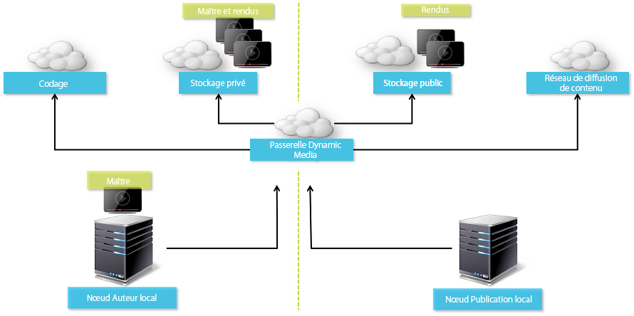

# Vidéo {#video}

Cette section décrit l’utilisation de vidéos dans Dynamic Media.

## Démarrage rapide : vidéos {#quick-start-videos}

Le processus détaillé décrit ci-après vise à vous aider à maîtriser rapidement les opérations liées aux visionneuses de vidéos adaptatives dans Dynamic Media. Chaque étape comporte des renvois à des rubriques contenant de plus amples informations.

>[!NOTE]
>
>Avant d’utiliser des vidéos dans Dynamic Media, vérifiez que l’administrateur ou l’administratrice Adobe Experience Manager a activé et configuré les Cloud Services Dynamic Media.
>
>* Voir [Configuration des Cloud Services Dynamic Media](/help/assets/dynamic-media/config-dm.md#configuring-dynamic-media-cloud-services) dans Configuration de Dynamic Media et [Dépannage de Dynamic Media](/help/assets/dynamic-media/troubleshoot-dm.md).
>

1. **Chargez les vidéos Dynamic Media** en procédant comme suit :

   * Créez votre propre profil de codage vidéo. Vous pouvez également utiliser le profil _Codage vidéo adaptif_ prédéfini fourni avec Dynamic Media.

      * [Création d’un profil de codage vidéo](/help/assets/dynamic-media/video-profiles.md#creating-a-video-encoding-profile-for-adaptive-streaming).
      * La résolution maximale du codage vidéo de sortie est de 8 192 × 4 320 ou de 4 320 × 8 192.md.
      * En savoir plus sur les [bonnes pratiques relatives au codage vidéo](#best-practices-for-encoding-videos).

   * Associez le profil de traitement vidéo à un ou plusieurs dossiers dans lequel vous allez charger les vidéos issues de sources originales.

      * [Application d’un profil vidéo à des dossiers](/help/assets/dynamic-media/video-profiles.md#applying-a-video-profile-to-folders).
      * En savoir plus sur l’[organisation des ressources numériques](/help/assets/organize-assets.md).

   * Chargez les vidéos issues de sources originales dans les dossiers désignés. Une fois ajoutées, les vidéos sont codées en fonction du profil de traitement vidéo affecté au dossier.

      * Dynamic Media prend principalement en charge les vidéos courtes avec une durée maximale de 30 minutes et une résolution minimale supérieure à 25 x 25.
      * La résolution vidéo d’entrée maximale prise en charge est de 16 384 × 16 384.
      * Vous pouvez charger des fichiers vidéo d’une taille de 15 Go chacun au maximum.
      * [Chargement des vidéos](/help/assets/manage-video-assets.md#upload-and-preview-video-assets).
      * En savoir plus sur les [formats de fichiers d’entrée pris en charge](/help/assets/file-format-support.md).

   * Surveillez [la progression du codage vidéo](#monitoring-video-encoding-and-youtube-publishing-progress) depuis la vue de la ressource ou du workflow.

1. Pour **gérer les vidéos Dynamic Media**, effectuez l’une des opérations suivantes :

   * Organisez, parcourez et recherchez des ressources vidéo

      * [Organisation des ressources numériques](/help/assets/organize-assets.md)
      * [Recherche de ressources vidéo](/help/assets/search-assets.md#custompredicates) ou [Recherche de ressources](/help/assets/manage-digital-assets.md#search-assets)

   * Prévisualisez et publiez des ressources vidéo

      * Affichez la vidéo source et les rendus codés de la vidéo avec les miniatures associées :

        [Prévisualisation de vidéos](/help/assets/manage-video-assets.md#upload-and-preview-video-assets) ou [Prévisualisation de ressources](/help/assets/dynamic-media/previewing-assets.md)
        [Gestion des rendus vidéo](/help/assets/manage-digital-assets.md#managing-renditions)

      * [Gestion des paramètres prédéfinis de visionneuse](/help/assets/dynamic-media/managing-viewer-presets.md)
      * [Publier les ressources](/help/assets/dynamic-media/publishing-dynamicmedia-assets.md)

   * Utilisation des métadonnées vidéo

      * Modifiez les propriétés vidéo telles que le titre, la description, les balises et les champs de métadonnées personnalisées :

        [Modification des propriétés vidéo](/help/assets/manage-digital-assets.md#editing-properties)

      * [Gestion des métadonnées des ressources numériques](/help/assets/manage-metadata.md)
      * [Schémas de métadonnées](/help/assets/metadata-schemas.md)

   * Examen, approbation et annotation des vidéos, et conservation le contrôle total des versions

      * [Annotation de vidéos](/help/assets/manage-video-assets.md#annotate-video-assets) ou [Annotation de ressources](/help/assets/manage-digital-assets.md#annotating)

      * [Créer une version](/help/assets/manage-digital-assets.md#asset-versioning)
      * [Démarrage d’un workflow sur une ressource](/help/assets/manage-digital-assets.md#starting-a-workflow-on-an-asset)

      * [Examen des ressources des dossiers](/help/assets/bulk-approval.md)
      * [Projets](/help/sites-cloud/authoring/projects/overview.md)

1. Pour **publier les vidéos Dynamic Media**, effectuez l’une des opérations suivantes :

   * Si vous utilisez Experience Manager en tant que système de gestion de contenu web (WCM), vous pouvez ajouter directement des vidéos à vos pages web.

      * [Ajout de vidéos à des pages web](/help/assets/dynamic-media/adding-dynamic-media-assets-to-pages.md).

   * Si vous utilisez un système de gestion de contenu web tiers, vous pouvez lier ou incorporer des vidéos à vos pages web.

      * Intégrez une vidéo à l’aide d’une URL :

        [Liaison d’URL à votre application web](/help/assets/dynamic-media/linking-urls-to-yourwebapplication.md).

      * Intégrez une vidéo à l’aide du code intégré dans la page web :

        [Incorporation de la visionneuse de vidéos dans une page web](/help/assets/dynamic-media/embed-code.md).

   * [Génération de rapports vidéo](#viewing-video-reports).

   * [Ajoutez plusieurs légendes et pistes audio à une vidéo](#about-msma).

## Utilisation de vidéo dans Dynamic Media {#working-with-video-in-dynamic-media}

Video in Dynamic Media est une solution de bout en bout qui facilite la publication de vidéos adaptatives haute qualité pour la diffusion sur plusieurs écrans, notamment les postes de travail, les tablettes et les appareils mobiles. Une visionneuse de vidéos adaptative regroupe les versions d’une même vidéo codées dans des débits et des formats différents, par exemple 400 kbit/s, 800 kbit/s et 1 000 kbit/s. Le poste de travail ou l’appareil mobile détecte la bande passante disponible.

Par exemple, sur un appareil mobile iOS, il détecte une bande passante telle que 3G, 4G ou une connexion Wi-Fi, puis sélectionne automatiquement la vidéo codée selon le débit correspondant parmi ceux disponibles dans la visionneuse de vidéos adaptative. La vidéo est diffusée en continu sur les postes de travail, les appareils mobiles ou les tablettes.

En outre, la qualité de la vidéo s’adapte de manière automatique et dynamique aux fluctuations des conditions du réseau sur le poste de travail ou sur l’appareil mobile. De même, si un client ou une cliente passe en mode plein écran sur un bureau, la visionneuse de vidéos adaptative réagit en utilisant une meilleure résolution, améliorant ainsi l’expérience de visionnage. L’utilisation des visionneuses de vidéos adaptatives offre la meilleure expérience de visionnage possible aux clients et clientes qui lisent des vidéos Dynamic Media sur plusieurs écrans et appareils.

La logique utilisée par un lecteur vidéo pour déterminer la vidéo codée à lire ou à sélectionner au cours de la lecture repose sur l’algorithme suivant :

1. Le lecteur vidéo charge le fragment vidéo initial en fonction du débit le plus proche de la valeur définie pour le « débit initial » dans le lecteur.
1. Le lecteur vidéo change en fonction des modifications de la vitesse de bande passante à l’aide des critères suivants :

   1. Le lecteur sélectionne la bande passante la plus élevée, inférieure ou égale à la bande passante estimée.
   1. Le lecteur ne prend en compte que 80 % de la bande passante disponible. Cependant, s’il change, il est préférable que ce taux soit seulement de 70 % pour éviter toute surestimation et que le lecteur ne repasse au taux précédent.

Pour obtenir des informations techniques détaillées sur l’algorithme, consultez la page [https://android.googlesource.com/platform/frameworks/av/+/master/media/libstagefright/httplive/LiveSession.cpp](https://android.googlesource.com/platform/frameworks/av/+/master/media/libstagefright/httplive/LiveSession.cpp)

La gestion des visionneuses de vidéos adaptatives et uniques prend en charge les fonctions suivantes :

* Chargement de vidéos à partir de nombreux formats vidéo et audio pris en charge. Codage de la vidéo au format MP4 H.264 pour la lecture sur plusieurs écrans. Vous pouvez utiliser des paramètres prédéfinis de vidéo adaptative, des paramètres prédéfinis de codage vidéo unique ou personnaliser votre propre codage pour contrôler la qualité et la taille de la vidéo.

   * Lorsqu’une visionneuse de vidéos adaptative est générée, elle comprend des vidéos MP4.
   * **Remarque** : Les vidéos originales/sources ne sont pas ajoutées à la visionneuse de vidéos adaptative.

* Sous-titrage vidéo dans toutes les visionneuses de vidéos HTML5.
* Organisez, parcourez et recherchez des vidéos avec une prise en charge complète des métadonnées pour une gestion efficace des ressources vidéo.
* Diffuser des visionneuses de vidéos adaptatives sur le web et sur les postes de travail, les tablettes et les appareils mobiles.

La diffusion de vidéo adaptative en continu est prise en charge sur différentes plateformes iOS. Voir [Guide de référence des visionneuses de médias dynamiques](https://experienceleague.adobe.com/en/docs/dynamic-media-developer-resources/library/viewers-aem-assets-dmc/video/c-html5-video-reference).

<!-- OUTDATED 2/28/22 BASED ON CQDOC-18692 Dynamic Media supports mobile video playback for MP4 H.264 video. You can find BlackBerry&reg; devices that support this video format at the following: [Supported video formats on BlackBerry&reg;](https://support.blackberry.com/kb/articleDetail?ArticleNumber=000005482).

OUTDATED 2/28/22 BASED ON CQDOC-18692 You can find Windows&reg; devices that support this video format at the following [Supported video formats on Windows&reg; Phone](https://docs.microsoft.com/en-us/windows/uwp/audio-video-camera/supported-codecs). -->

* Lecture de la vidéo à l’aide des paramètres prédéfinis de la visionneuse Dynamic Media Video, tels que :

   * Visionneuses de vidéos uniques.
   * des visionneuses de médias mixtes combinant du contenu vidéo et des images.

* Configurez les lecteurs vidéo pour répondre à vos besoins en matière de branding.
* Intégrez la vidéo à votre site Web, site mobile ou application mobile à l’aide d’une simple URL ou d’un code intégré.

<!-- GIVES a 404 See [Dynamic video playback](https://s7d9.scene7.com/s7/uvideo.jsp?asset=GeoRetail/Mop_AVS&config=GeoRetail/Universal_Video1&stageSize=640,480) sample. -->

Voir aussi [Visionneuses pour Experience Manager Assets et Dynamic Media Classic](https://experienceleague.adobe.com/fr/docs/dynamic-media-developer-resources/library/viewers-aem-assets-dmc/c-html5-s7-aem-asset-viewers#viewers-aem-assets-dmc) et [Visionneuses pour Experience Manager Assets uniquement](https://experienceleague.adobe.com/fr/docs/dynamic-media-developer-resources/library/viewers-for-aem-assets-only/c-html5-aem-asset-viewers#viewers-for-aem-assets-only) dans le [Guide de référence des visionneuses de médias dynamiques](https://experienceleague.adobe.com/fr/docs/dynamic-media-developer-resources).

## Bonne pratique : Utilisation de la visionneuse de vidéos HTML5 {#best-practice-using-the-html-video-viewer}

Les paramètres prédéfinis de la visionneuse de vidéos Dynamic Media HTML5 sont des lecteurs vidéo fiables. Vous pouvez les utiliser pour éviter de nombreux problèmes courants liés à la lecture vidéo HTML5 et les problèmes associés aux appareils mobiles. Par exemple, une absence de diffusion en continu à débit adaptatif et une limitation de la portée du navigateur de bureau.

En ce qui concerne la conception du lecteur, vous pouvez concevoir les fonctionnalités du lecteur vidéo à l’aide d’outils de développement web standard. Par exemple, vous pouvez concevoir les boutons, les commandes et l’arrière-plan personnalisé de l’image d’affiche en utilisant HTML5 et CSS pour vous aider à atteindre vos clients et vos clientes à l’aide d’une apparence personnalisée.

En ce qui concerne la relecture, la visionneuse détecte automatiquement les fonctionnalités vidéo du navigateur. Elle traite ensuite la vidéo en utilisant HLS ou DASH, également connus sous le nom de diffusion en continu de vidéo adaptative. Si ces méthodes de distribution n’existent pas, la diffusion progressive HTML5 est utilisée à la place.

Vous pouvez combiner dans un unique lecteur la possibilité de concevoir les composants de lecture à l’aide de HTML5 et CSS. Il peut disposer de la relecture incorporée et utiliser la diffusion en continu adaptative et progressive en fonction des fonctionnalités du navigateur. Grâce à toutes ces fonctionnalités, vous pouvez étendre la portée de votre contenu multimédia aux utilisateurs d’ordinateurs de bureau et d’appareils mobiles, et garantir ainsi une expérience vidéo fluide.

Consultez également [Visionneuses pour Experience Manager Assets uniquement](https://experienceleague.adobe.com/fr/docs/dynamic-media-developer-resources/library/viewers-for-aem-assets-only/c-html5-aem-asset-viewers#viewers-for-aem-assets-only) dans le [Guide de référence des visionneuses de médias dynamiques](https://experienceleague.adobe.com/fr/docs/dynamic-media-developer-resources).


### Lecture vidéo sur les ordinateurs de bureau et les appareils mobiles à l’aide de la visionneuse de vidéos HTML5 {#playback-of-video-on-desktop-computers-and-mobile-devices-using-the-html-video-viewer}

Pour la diffusion en continu de la vidéo adaptative sur un poste de travail et un appareil mobile, les vidéos utilisées pour le changement de débit reposent sur toutes les vidéos MP4 dans la visionneuse de vidéo adaptative.

La lecture vidéo se produit à l’aide d’un téléchargement vidéo HLS, DASH ou progressive. Dans les versions antérieures d’Experience Manager, telles que 6.0, 6.1 et 6.2, les vidéos étaient diffusées via HTTP.

Toutefois, dans la version 6.3 et les versions ultérieures d’Experience Manager, les vidéos sont diffusées en continu via HTTPS (c’est-à-dire, HLS ou DASH), car l’URL du service de la passerelle DM utilise toujours HTTPS également. Il n’y a aucun impact pour le client ou la cliente dans ce comportement par défaut. La diffusion vidéo en continu a toujours lieu via HTTPS si le navigateur la prend en charge. Voir le tableau suivant.

Par conséquent :

* Si vous disposez d’un site Web HTTPS avec streaming vidéo HTTPS, le streaming est correct.
* Si vous disposez d’un site Web HTTP avec streaming vidéo HTTPS, le streaming est correct et il n’y a aucun problème de contenu mixte à partir du navigateur Web.

DASH est la norme internationale et HLS est une norme Apple. Les deux sont utilisés pour la diffusion en continu de vidéo adaptative. De plus, les deux technologies ajustent automatiquement la relecture en fonction de la capacité de bande passante du réseau. Elle permet aussi au client ou à la cliente de « rechercher » n’importe quel point de la vidéo sans avoir à attendre que le reste de la vidéo soit téléchargé.

La vidéo progressive est fournie grâce au téléchargement et à l’enregistrement de la vidéo en local sur le système du poste de travail ou de l’appareil mobile de l’utilisateur ou de l’utilisatrice.

Le tableau ci-dessous décrit l’appareil, le navigateur et la méthode de lecture des vidéos sur les ordinateurs de bureau et les appareils mobiles à l’aide de la [visionneuse de vidéos HTML5 Dynamic Media](https://experienceleague.adobe.com/en/docs/dynamic-media-developer-resources/library/viewers-for-aem-assets-only/interactive-video/c-html5-aem-int-video#interactive-video).

<table>
 <tbody>
  <tr>
   <td><strong>Appareil</strong></td>
   <td><strong>Navigateur</strong></td>
   <td><strong>Mode lecture vidéo</strong></td>
  </tr>
  <tr>
   <td>Poste de travail</td>
   <td>Internet Explorer 9 et 10</td>
   <td>Téléchargement progressif.</td>
  </tr>
  <tr>
   <td>Poste de travail</td>
   <td>Internet Explorer 11+</td>
   <td>Sous Windows® 8 et Windows® 10 – Forcer l’utilisation de HTTPS chaque fois que DASH ou HLS est demandé. Limites connues : HTTP sur DASH ou HLS ne fonctionne pas avec cette combinaison de navigateur/système d’exploitation<br /> <br /> Sous Windows® 7 – Téléchargement progressif. Utilise la logique standard pour le protocole HTTP ou HTTPS.</td>
  </tr>
  <tr>
   <td>Poste de travail</td>
   <td>Firefox 23-44</td>
   <td>Téléchargement progressif.</td>
  </tr>
  <tr>
   <td>Poste de travail</td>
   <td>Firefox 45 ou version ultérieure</td>
   <td>Diffusion en continu à débit adaptatif HLS ou DASH*</td>
  </tr>
  <tr>
   <td>Poste de travail</td>
   <td>Chrome</td>
   <td>Diffusion en continu à débit adaptatif HLS ou DASH*</td>
  </tr>
  <tr>
   <td>Poste de travail</td>
   <td>Safari (Mac)</td>
   <td>Streaming à débit adaptatif HLS</td>
  </tr>
  <tr>
   <td>Mobile</td>
   <td>Chrome (Android™ 6 ou version antérieure)</td>
   <td>Téléchargement progressif.</td>
  </tr>
  <tr>
   <td>Mobile</td>
   <td>Chrome (Android™ 7 ou version ultérieure)</td>
   <td>Diffusion en continu à débit adaptatif HLS ou DASH*/td&gt;
  </tr>
  <tr>
   <td>Mobile</td>
   <td>Android™ (navigateur par défaut)</td>
   <td>Téléchargement progressif.</td>
  </tr>
  <tr>
   <td>Mobile</td>
   <td>Safari (iOS)</td>
   <td>Streaming à débit adaptatif HLS</td>
  </tr>
  <tr>
   <td>Mobile</td>
   <td>Chrome (iOS)</td>
   <td>Streaming à débit adaptatif HLS</td>
  </tr>
 </tbody>
</table>

<!--  THIS LINE WAS REMOVED FROM THE TABLE ABOVE ON FEB 28, 2022 BASED ON CQDOC 18692 -RSB <tr>
   <td>Mobile</td>
   <td>BlackBerry&reg;</td>
   <td>HLS or DASH</td>
  </tr>
 -->

## Architecture de la solution vidéo Dynamic Media {#architecture-of-dynamic-media-video-solution}

Le graphique suivant montre le workflow global de création de vidéos qui sont chargées et codées par le biais de DMGateway (dans le mode Hybride Dynamic Media) et mises à disposition pour une consommation publique.


## Architecture de publication hybride des vidéos {#hybrid-publishing-architecture-for-videos}



## Bonnes pratiques en matière de codage de vidéos {#best-practices-for-encoding-videos}

Le workflow **Vidéo de codage de média dynamique** code la vidéo si vous avez activé Dynamic Media et configuré les services cloud vidéo. Ce workflow capture l’historique de traitement des workflows et les informations d’échec. Si vous avez activé Dynamic Media et configuré les services cloud vidéo, le workflow **[!UICONTROL Vidéo d’encodage Dynamic Media]** prend automatiquement effet lorsque vous chargez une vidéo. (Si vous n’utilisez pas Dynamic Media, le workflow **[!UICONTROL Ressource de mise à jour DAM]** prend effet.)

Vous trouverez ci-dessous quelques conseils sur les bonnes pratiques de codage des fichiers source vidéo.

<!-- For advice about video encoding, see the following:

* [Streaming 101: The Basics — Codecs, Bandwidth, Data Rate, and Resolution](https://www.adobe.com/go/learn_s7_streaming101_en).
* [Video Encoding Basics](https://www.adobe.com/go/learn_s7_encoding_en). -->

### Fichiers vidéo source {#source-video-files}

Lorsque vous codez un fichier vidéo, utilisez un fichier vidéo source de la plus haute qualité possible. Évitez d’utiliser des fichiers vidéo déjà codés, car ces fichiers sont déjà compressés, et un codage supplémentaire crée une vidéo de qualité inférieure.

* Dynamic Media prend principalement en charge les vidéos courtes avec une durée maximale de 30 minutes et une résolution minimale supérieure à 25 x 25.
* Vous pouvez charger des fichiers vidéo de source principale d’une taille de 15 Go chacun au maximum.

Le tableau ci-dessous décrit la taille recommandée, le format et le débit minimal requis pour vos fichiers vidéo sources au moment de leur codage :

| Taille | Format | Débit minimal |
|--- |--- |--- |
| 1 024 × 768 | 4:3 | 4 500 Kbit/s pour la plupart des vidéos. |
| 1 280 × 720 | 16:9 | 3 000 à 6 000 Kbit/s, selon la quantité de mouvement dans la vidéo. |
| 1 920 × 1 080 | 16:9 | 6 000 à 8 000 kbit/s, selon la quantité de mouvement dans la vidéo. |

### Obtention des métadonnées d’un fichier {#obtaining-a-file-s-metadata}

Vous pouvez obtenir les métadonnées d’un fichier en les affichant à l’aide d’un outil d’édition pour vidéos ou d’une application d’extraction de métadonnées. Vous trouverez ci-après les instructions d’utilisation de MediaInfo, une application tierce permettant d’extraire les métadonnées d’un fichier vidéo :

1. Accédez à [Téléchargement MediaInfo](https://mediaarea.net/fr/MediaInfo/Download).
1. Sélectionnez et téléchargez le programme d’installation pour la version avec l’interface graphique utilisateur, puis suivez les instructions d’installation.
1. Après l’installation, cliquez avec le bouton droit sur le fichier vidéo (Windows® uniquement) et sélectionnez MediaInfo, ou bien ouvrez MediaInfo et faites glisser votre fichier vidéo dans l’application. Toutes les métadonnées de votre fichier vidéo, telles que sa largeur, sa hauteur et le nombre d’images par seconde, sont alors visibles à l’écran.

### Format {#aspect-ratio}

Lorsque vous choisissez ou créez un paramètre prédéfini de codage vidéo pour votre fichier vidéo source principal, assurez-vous que ce paramètre présente les mêmes proportions. Cette approche garantit la cohérence avec le fichier vidéo source principal. Le format fait référence au rapport largeur/hauteur de la vidéo.

Pour déterminer les proportions d’un fichier vidéo, récupérez ses métadonnées. Notez la largeur et la hauteur du fichier (voir Obtention des métadonnées d’un fichier ci-dessus). Utilisez ensuite cette formule pour déterminer le format :

largeur/hauteur = format

Le tableau suivant décrit comment les résultats de la formule se traduisent par des choix de format courants :

| Résultat de la formule | Format |
|--- |--- |
| 1,33 | 4:3 |
| 0,75 | 3:4 |
| 1,78 | 16:9 |
| 0,56 | 9:16 |

Par exemple, une vidéo qui a une largeur de 1 440 pour une hauteur de 1 080 a un format de 1 440/1 080, soit 1,33. Dans ce cas, vous choisissez un paramètre prédéfini de codage vidéo avec un format de 4:3 pour le codage du fichier vidéo.

### Débit binaire {#bitrate}

Le débit est la quantité de données codées pour constituer une seule seconde de lecture vidéo. Le débit de données est mesuré en kilobits par seconde (kbit/s).

>[!NOTE]
>
>Du fait que tous les codecs utilisent la compression avec perte, le débit de données est le facteur le plus important de la qualité vidéo. Quand vous utilisez la compression avec perte, plus vous compressez la vidéo, plus la qualité de l’image se dégrade. Pour cette raison, toutes les autres caractéristiques étant égales (résolution, débit d’image et codec), plus le débit est faible, plus la qualité du fichier compressé est faible.

Lors de la sélection d’une vitesse de transmission, vous pouvez choisir deux types :

* **[!UICONTROL Encodage à débit constant]** (CBR) : pendant l’encodage CBR, le débit ou le nombre de bits par seconde est conservé pendant tout le processus d’encodage. L’encodage CBR maintient le débit défini selon votre configuration sur l’intégralité de la vidéo. En outre, le codage CBR n’optimise pas la qualité des fichiers multimédias, mais économise de l’espace de stockage.
Utilisez le codage CBR si votre vidéo présente globalement un niveau de mouvement similaire. Le codage CBR est le plus souvent utilisé pour diffuser le contenu vidéo en continu. Voir également [Utilisation de paramètres de codage vidéo personnalisés](/help/assets/dynamic-media/video-profiles.md#using-custom-added-video-encoding-parameters).

* **[!UICONTROL Codage à débit variable]** (VBR) - le codage VBR règle le débit en le diminuant et en l’augmentant selon la limite supérieure que vous avez définie, en fonction des données demandées par le compresseur. Cette fonctionnalité implique que lors d’un processus de codage VBR, le débit du fichier multimédia augmente ou diminue de manière dynamique en fonction des besoins du débit de fichiers multimédias.
Le VBR prend plus de temps au codage, mais garantit de meilleurs résultats, avec une qualité de fichier multimédia supérieure. Le codage VBR est couramment utilisé pour la diffusion http progressive de contenu vidéo.

Dans quels cas utilisez-vous le VBR ou le CBR ?
Lorsque vous devez choisir entre VBR et CBR, il est presque toujours recommandé d’utiliser le VBR pour vos fichiers multimédias. Le VBR vous garantit des fichiers de meilleure qualité à des débits compétitifs. Lorsque vous utilisez le VBR, assurez-vous d’utiliser le codage à deux passages, et définissez le débit maximal afin qu’il soit 1,5 fois supérieur au débit vidéo cible.

Lorsque vous choisissez un paramètre prédéfini de codage vidéo, veillez à tenir compte de la vitesse de connexion de l’utilisateur cible. Choisissez un paramètre prédéfini avec un débit de données correspondant à 80 % de cette vitesse. Par exemple, si la vitesse de connexion de l’utilisateur ou de l’utilisatrice cible est de 1 000 Kbit/s, le meilleur paramètre prédéfini est celui qui comprend un débit vidéo de 800 Kbit/s.

Ce tableau décrit le débit de données associé à des vitesses de connexion courantes.

| Vitesse (kbit/s) | Type de connexion |
|--- |--- |
| 256 | Connexion d’accès à distance. |
| 800 | Connexion mobile standard. Pour cette connexion, visez un débit de données de 400 à 800 kbit/s pour les expériences 3G. |
| 2000 | Connexion haut débit standard de bureau. Pour cette connexion, visez un débit de données de 800 à 2 000 kbit/s, bien qu’un débit de 1 200 à 1 500 kbit/s convienne à la plupart des cibles. |
| 5000 | Connexion haut débit standard. Il est déconseillé de coder dans la plage supérieure, car la diffusion vidéo à cette vitesse n’est pas disponible pour la plupart des consommateurs et des consommatrices. |

### Résolution {#resolution}

La **résolution** décrit la hauteur et la largeur d’un fichier vidéo, exprimée en pixels. La plupart des vidéos sources sont stockées en haute résolution (par exemple, 1 920 × 1 080). À des fins de diffusion en continu, la vidéo source est compressée à une résolution inférieure (640 × 480 ou moins).

La résolution et le débit de données sont deux facteurs étroitement liés qui déterminent la qualité de la vidéo. Pour maintenir la même qualité vidéo, plus il y a de pixels dans un fichier vidéo (plus la résolution est élevée), plus le débit de données doit être élevé. Prenons l’exemple du nombre de pixels par image dans un fichier vidéo de résolution 320 x 240 et de résolution 640 x 480 :

| Résolution | Pixels par image |
|--- |--- |
| 320 x 240 | 76 800 |
| 640 × 480 | 307 200 |

Le fichier 640 x 480 a quatre fois plus de pixels par image. Pour obtenir le même débit de données pour ces deux exemples de résolution, vous compressez quatre fois le fichier 640 x 480, ce qui peut réduire la qualité de la vidéo. Par conséquent, un débit de données vidéo de 250 kbit/s produit un affichage de haute qualité à une résolution de 320 x 240 pixels, mais pas à une résolution de 640 x 480 pixels.

En général, plus le débit de données que vous utilisez est élevé, plus la qualité de votre vidéo est bonne, et plus vous utilisez une résolution élevée, plus de débit de données dont vous avez besoin est élevé pour conserver la qualité de visionnage (en comparaison avec des résolutions plus basses).

Du fait que la résolution et le débit de données sont liés, vous avez le choix entre deux options lors du codage vidéo :

* Choisir un débit de données puis, en fonction de ce paramètre, coder à la résolution la plus haute pour obtenir une vidéo de bonne qualité.
* Choisir une résolution, puis coder au débit de données nécessaire pour que la qualité vidéo soit optimale à la résolution choisie.

Lorsque vous choisissez (ou créez) un paramètre prédéfini de codage vidéo pour votre fichier vidéo source original, utilisez ce tableau pour choisir la résolution cible appropriée :

| Résolution | Hauteur (pixels) | Taille de l’écran |
|--- |--- |--- |
| 240p | 240 | Tout petit écran |
| 300p | 300 | Petit écran (appareils mobiles, le plus souvent) |
| 360p | 360 | Petit écran |
| 480p | 480 | Écran moyen |
| 720p | 720 | Grand écran |
| 1 080p | 1080 | Grand écran haute définition |

La résolution vidéo d’entrée maximale prise en charge est de 16 384 × 16 384. La résolution maximale du codage vidéo de sortie est de 8 192 × 4 320 ou de 4 320 × 8 192.

### Images par seconde {#fps-frames-per-second}

Aux États-Unis et au Japon, la plupart des vidéos sont tournées à 29,97 i/s ; en Europe, la plupart des vidéos sont tournées à 25 i/s. Un film est tourné à 24 i/s.

Choisissez un paramètre prédéfini de codage vidéo correspondant au nombre d’images par seconde de votre vidéo issue de sources originales. Par exemple, si le débit est de 25 ips pour la vidéo issue de sources originales, choisissez un paramètre prédéfini de 25 ips pour le codage. Par défaut, tous les codages personnalisés utilisent le nombre d’images par seconde de la vidéo issue de sources originales. C’est pourquoi il est inutile d’indiquer le nombre d’images par seconde lorsque vous créez un paramètre prédéfini de codage vidéo.

### Dimensions du codage vidéo {#video-encoding-dimensions}

Pour des résultats optimaux, sélectionnez des dimensions de codage de manière à ce que la vidéo source soit un multiple entier de toutes vos vidéos codées.

Pour ce faire, il suffit de diviser la largeur de la source par la largeur codée pour obtenir le rapport de largeur, Ensuite, vous divisez la hauteur source par la hauteur codée pour obtenir le rapport de hauteur.

Si le résultat est un nombre entier, cela signifie que la mise à l’échelle de la vidéo est optimale. Si le résultat n’est pas un nombre entier, la qualité vidéo s’en ressentira en raison de la présence d’artefacts vidéo (pixels résiduels). Cet effet est plus visible lorsque la vidéo comporte du texte.

Par exemple, supposons que la vidéo source soit en 1 920 x 1 080. Dans le tableau suivant, les trois vidéos codées fournissent les paramètres de codage optimaux à utiliser.

| Type de vidéo | Largeur/Hauteur | Rapport largeur | Rapport de hauteur |
|--- |--- |--- |--- |
| Source | 1 920 × 1 080 | 1 | 1 |
| Codé | 960 × 540 | 2 | 2 |
| Codé | 640 × 360 | 3 | 3 |
| Codé | 480 × 270 | 4 | 4 |

### Format de fichier vidéo codé {#encoded-video-file-format}

Dynamic Media recommande d’utiliser les paramètres prédéfinis MP4 H.264 de codage vidéo. Comme les fichiers MP4 utilisent le codec vidéo H.264, une vidéo de haute qualité est obtenue, mais avec une taille de fichier compressée.

## Affichage des rapports vidéo {#viewing-video-reports}

>[!NOTE]
>
>Les rapports vidéo sont disponibles uniquement lorsque vous exécutez Dynamic Media en mode Hybride.

Les rapports vidéo affichent plusieurs mesures agrégées sur une période spécifiée pour vous permettre de vérifier que les vidéos individuelles et agrégées *publiées* ont les performances attendues. Les données des mesures principales suivantes sont agrégées pour toutes les vidéos publiées sur l’ensemble de votre site web :

* Lancements de vidéo
* Taux d’achèvement
* Durée moyenne de visionnage
* Durée totale de visionnage
* Vidéos par visite

Un tableau de toutes les vidéos *publiées* est également fourni pour vous permettre de suivre les vidéos les plus visionnées sur votre site web en fonction du total des lancements de vidéo.

Lorsque vous sélectionnez le nom d’une vidéo dans la liste, le rapport sur la rétention de l’audience (taux de déperdition) de la vidéo s’affiche sous la forme d’un graphique linéaire. Le graphique présente le nombre de vues à un moment donné de la lecture vidéo. Lorsque vous lisez la vidéo, la barre verticale effectue un suivi en synchronisation avec l’indicateur temporel du lecteur. Les baisses des données du graphique linéaire indiquent le moment où votre audience perd son intérêt.

Si la vidéo a été codée en dehors d’Adobe Experience Manager Dynamic Media, le graphique sur la rétention de l’audience (taux de déperdition) et les données de pourcentage de lecture du tableau ne sont pas disponibles.

>[!NOTE]
>
>Le suivi et les données de rapport reposent exclusivement sur l’utilisation du lecteur vidéo Dynamic Media et du paramètre prédéfini du lecteur vidéo associé. Par conséquent, vous ne pouvez pas effectuer le suivi et créer de rapports sur les vidéos que d’autres lecteurs vidéo lisent.

Par défaut, la première fois que vous saisissez des rapports vidéo, le rapport affiche les données vidéo à partir du premier jour du mois en cours et se termine par la date du mois en cours. Cependant, vous pouvez remplacer la période par défaut en spécifiant votre propre période. La prochaine fois que vous utiliserez les rapports vidéo, la période que vous avez spécifiée sera utilisée.

Pour que les rapports vidéo fonctionnent correctement, un identifiant de suite de rapports est automatiquement créé lors de la configuration des services cloud Dynamic Media. Dans le même temps, l’identifiant de suite de rapports est transmis au serveur de publication pour qu’il soit disponible pour la fonctionnalité de copie d’URL lors de la prévisualisation de ressources. Cette fonctionnalité nécessite toutefois que le serveur de publication soit déjà configuré. Si le serveur de publication n’est pas configuré, vous pouvez tout de même lancer la publication pour afficher le rapport vidéo. Cependant, vous devez revenir à la configuration du cloud Dynamic Media et sélectionner **[!UICONTROL OK]**.

**Pour afficher un rapport vidéo, procédez comme suit :**

1. Dans le coin supérieur gauche d’Experience Manager, sélectionnez le logo Experience Manager. Dans le rail de gauche, cliquez sur  > **[!UICONTROL Assets]** > **[!UICONTROL Rapports vidéo]**.
1. Dans la page Rapport vidéo, effectuez l’une des opérations suivantes :

   * Dans le coin supérieur droit, sélectionnez l’icône **[!UICONTROL Actualiser le rapport vidéo]**.
Vous ne pouvez utiliser l’option Actualiser que si la date de fin du rapport correspond à la date du jour. Cette fonctionnalité vous permet de voir le suivi vidéo qui s’est produit depuis la dernière exécution du rapport.

   * Dans le coin supérieur droit, sélectionnez l’icône **[!UICONTROL Sélecteur de date]**.
Indiquez la période de début et de fin pour laquelle vous souhaitez obtenir les données vidéo, puis sélectionnez **[!UICONTROL Exécuter le rapport]**.

   Le groupe Mesures principales identifie diverses mesures agrégées pour toutes les vidéos *publiées* sur votre site.

1. Dans le tableau qui répertorie les principales vidéos publiées, sélectionnez le nom d’une vidéo pour la lire et afficher également le rapport sur la rétention de l’audience (taux de déperdition) de celle-ci.

<!-- OBSOLETE CONTENT OBSOLETE CONTENT - SDK ONLY AVAILABLE INTERNALLY NOW 
### Viewing video reports based on a video viewer that you created using the Dynamic Media HTML5 Viewer SDK {#viewing-video-reports-based-on-a-video-viewer-that-you-created-using-the-scene-hmtl-viewer-sdk}

If you are using an out-of-box video viewer provided by Dynamic Media, or if you created a custom viewer preset based off of an out-of-box video viewer, then no additional steps are required to view video reports. However, if you have created your own video viewer based off the Dynamic Media HTML5 Viewer SDK, then use the following steps to ensure the your video viewer is sending tracking events to Dynamic Media Video Reports.

Use the Dynamic Media Viewers Reference and the Dynamic Media HTML5 Viewers SDK to create your own video viewers.

See [Dynamic Media Viewers Reference Guide](https://experienceleague.adobe.com/docs/dynamic-media-developer-resources/library/home.html).

Download the Scene7 HTML Viewer SDK from Adobe Developer Connection.

See [Adobe Developer Connection](https://help.adobe.com/en_US/scene7/using/WSef8d5860223939e2-43dedf7012b792fc1d5-8000.html).

**To view Video Reports based on a video viewer that you created using the Dynamic Media HTML5 Viewer SDK:**

1. Navigate to any published video asset.
1. Near the upper-left corner of the asset's page, from the drop-down list, select **[!UICONTROL Viewers]**.
1. Select any video viewer preset and copy the embed code.
1. In the embed code, find the line with the following:

   `videoViewer.setParam("config2", "<value>");`

   The `config2` parameter enables tracking in HTML5 Viewers. It is also a company-specific preset that contains the configuration information for Video Reporting, and for customer-specific Adobe Analytics configurations.

   The correct value for the config2 parameter is found in both the **[!UICONTROL Embed Code]** and in the copy **[!UICONTROL URL]** function. In the URL from the copy **[!UICONTROL URL]** command, the parameter to look for is `&config2=<value>` . The value is almost always `companypreset`, but in some instances it can also be `companypreset-1`, `companypreset-2`, and so forth.

1. In your custom video viewer code, add AppMeasurementBridge .jsp to the viewer page by doing the following:

    * First, determine if you need the `&preset` parameter.
      If the `config2` parameter is `companypreset`, you do *not *need `&preset=parameter`.
      If `config2` is anything else, set the preset parameter the same as the `config2` parameter. For example, if `config2=companypreset-2`, add `&param2=companypreset-2` to the AppMeasurmentBridge.jsp URL.

    * Then, add the AppMeasurementBridge.jsp script:
      `<script language="javascript" type="text/javascript" src="https://s7d1.scene7.com/s7viewers/AppMeasurementBridge.jsp?company=robindallas&preset=companypreset-2"></script>`

1. Create the TrackingManager component by doing the following:

    * After calling `s7sdk.Utils.init();` create a TrackingManager instance to track events by adding the following:
      `var trackingManager = new s7sdk.TrackingManager();`

    * Connect components to TrackingManager by doing the following:
      In the `s7sdk.Event.SDK_READY` event handler, attach the component you want to track to the TrackingManager.
      For example, if the component is `videoPlayer`, add
      `trackingManager.attach(videoPlayer);`
      to attach the component to the trackingManager. To track multiple viewers on a page, use multiple tracking mangaer components.

    * Create the AppMeasurementBridge object by adding the following:

      ```
      var appMeasurementBridge = new AppMeasurementBridge(); appMeasurementBridge.setVideoPlayer(videoPlayer);
      ```

    * Add the tracking function by adding the following:

      ```
      trackingManager.setCallback(appMeasurementBridge.track,
       appMeasurementBridge);
      ```

   The appMeasurementBridge object has a built-in track function. OBSOLETE However, you can provide your own to support multiple tracking systems or other functionality.

   For more information, see *Using the TrackingManager Component* in the *Scene7 HTML5 Viewer SDK User Guide* available for download from [Adobe Developer Connection](https://help.adobe.com/en_US/scene7/using/WSef8d5860223939e2-43dedf7012b792fc1d5-8000.html).
 -->

## À propos de la prise en charge de plusieurs sous-titres et pistes audio pour les vidéos dans Dynamic Media{#about-msma}

Grâce aux fonctionnalités de sous-titres et de pistes audio multiples de Dynamic Media, vous pouvez facilement ajouter plusieurs pistes audio. Vous pouvez également ajouter plusieurs fichiers de sous-titres à l’aide de vos propres fichiers de `.vtt` (suivi de texte vidéo) ou de fichiers de sous-titres générés par l’IA. Les sous-titres générés par l’IA dans Dynamic Media sont conçus pour améliorer l’accessibilité et l’engagement de la vidéo en générant automatiquement des sous-titres précis et synchronisés. Cette technologie utilise des algorithmes d’IA avancés pour transcrire du contenu parlé dans du texte, qui est ensuite affiché sous forme de légendes sur la vidéo. Les principales fonctionnalités de cette technologie sont les suivantes :

* **Transcription automatique :** le système d’IA transcrit les mots prononcés en texte en temps réel, ce qui permet de générer des sous-titres rapidement et avec précision.
* **Prise en charge multilingue :** les sous-titres peuvent être automatiquement diffusés dans plus de 60 langues, ce qui facilite la diffusion auprès d’une audience mondiale.
* **Accessibilité améliorée :** en fournissant des sous-titres, les vidéos sont plus accessibles aux personnes sourdes ou malentendantes, ou à celles qui préfèrent regarder des vidéos sans son.
* **Engagement amélioré :** les sous-titres peuvent vous aider à retenir l’attention du spectateur et à améliorer votre compréhension, en particulier dans les environnements bruyants ou lorsque la langue maternelle du spectateur est différente de la langue de la vidéo.

Grâce à ces fonctionnalités, les sous-titres optimisés par l’IA constituent un outil précieux pour les créateurs et créatrices de contenu cherchant à améliorer l’accessibilité et l’engagement de leur contenu vidéo.


Voici quelques cas d’utilisation à prendre en compte pour ajouter plusieurs légendes et pistes audio à votre vidéo principale :

| Type | Cas d’utilisation |
|--- |--- |
| **Sous-titres** | Prise en charge de plusieurs langues |
|  | Texte descriptif pour l’accessibilité |
| **Pistes audio** | Prise en charge de plusieurs langues |
|  | Pistes de commentaires |
|  | Audio descriptif |

Tous les formats vidéo [pris en charge dans Dynamic Media](/help/assets/file-format-support.md) et toutes les visionneuses de vidéos Dynamic Media, à l’exception de la visionneuse Dynamic Media *Video_360*, sont pris en charge pour une utilisation avec plusieurs légendes et pistes audio.

### Ajout de plusieurs légendes et pistes audio à votre vidéo {#add-msma}

Avant d’ajouter plusieurs sous-titres et plusieurs pistes audio à votre vidéo, assurez-vous que vous disposez déjà des éléments suivants :

* Dynamic Media est configuré dans un environnement AEM.
* Un [profil vidéo Dynamic Media est appliqué au dossier dans lequel vos vidéos sont ingérées](/help/assets/dynamic-media/video-profiles.md#applying-a-video-profile-to-folders).

Les sous-titres ajoutés sont pris en charge avec les formats WebVTT et Adobe VTT. Les fichiers des pistes audio ajoutés sont pris en charge au format MP3.

>[!IMPORTANT]
>
>Pour les vidéos chargées *avant* l’activation de la prise en charge de plusieurs sous-titres/pistes audio ou sous-titres générés par l’IA sur votre compte Dynamic Media, [vous devez les retraiter](/help/assets/dynamic-media/about-image-video-profiles.md#reprocessing-assets). Cette étape de retraitement garantit que ces vidéos peuvent utiliser les différentes fonctionnalités de sous-titrage/piste audio et de sous-titrage généré par l’IA. Après le retraitement, les URL des vidéos continuent à fonctionner et à être lues comme d’habitude.

**Pour ajouter plusieurs légendes et pistes audio à votre vidéo, procédez comme suit :**

1. [Chargez la vidéo principale dans un dossier](/help/assets/manage-video-assets.md#upload-and-preview-video-assets) qui comporte déjà un profil vidéo qui lui est affecté.
1. Accédez à la ressource vidéo chargée à laquelle ajouter plusieurs sous-titres et pistes audio.
1. En mode de sélection de ressources, sélectionnez la ressource vidéo à partir de l’icône  (Vue Carte) ou de l’icône  (Vue Liste).
1. Dans la barre d’outils, cliquez sur  Propriétés.
   *Ressource vidéo sélectionnée en vue Carte.*
1. Sur la page Propriétés de la vidéo, sélectionnez l’onglet **[!UICONTROL Légendes et pistes audio]**.

   >[!TIP]
   >Si vous ne voyez pas l’onglet **[!UICONTROL Légendes et pistes audio]**, cela signifie l’une des deux choses suivantes :
   >
   >* Aucun profil vidéo n’est affecté au dossier dans lequel se trouve la vidéo sélectionnée. Dans ce cas, voir [Application d’un profil vidéo au dossier](/help/assets/dynamic-media/video-profiles.md#applying-video-profiles-to-specific-folders)
   >* Sinon, Dynamic Media doit retraiter la vidéo. Dans ce cas, voir [Retraitement des ressources Dynamic Media dans un dossier](/help/assets/dynamic-media/about-image-video-profiles.md#reprocessing-assets).
   >
   >Une fois l’une des tâches ci-dessus terminée, reprenez cette procédure.

   
   *Onglet Légendes et pistes audio de la page Propriétés de la vidéo.*

1. Pour ajouter une ou plusieurs pistes audio à une vidéo, procédez comme suit :
   1. Sélectionnez **[!UICONTROL Charger des pistes audio]**.
   1. Accédez à un ou plusieurs fichiers .mp3 et sélectionnez-les, puis ouvrez-les.
   1. Pour que les pistes audio soient visibles dans la liste pop-up **[!UICONTROL Sélectionner une piste audio ou une légende]** du lecteur multimédia, vous devez ajouter les détails requis sur chaque fichier de piste audio. Cela permet de s’assurer que toutes les pistes audio sont correctement répertoriées et accessibles. Cliquez sur  à droite d’un nom de fichier de piste audio. Dans la boîte de dialogue **Modifier la piste audio**, saisissez les informations requises suivantes :

      | Métadonnées de piste audio | Description |
      |--- |--- |
      | Nom de fichier | Le nom de fichier par défaut est dérivé du nom de fichier d’origine. Le nom du fichier ne peut être modifié que lors du chargement et ne peut pas l’être plus tard. Les exigences relatives aux caractères de nom de fichier sont les mêmes que pour AEM Assets.<br>Le même nom de fichier ne peut pas être utilisé pour des fichiers de piste audio ou de sous-titres supplémentaires. |
      | Langue | Sélectionnez la langue correcte de la piste audio. |
      | Type | Sélectionnez le type de piste audio que vous utilisez.<br>**Original** - La piste audio initialement associée à la vidéo et représentée sous forme de `[Original]` dans le libellé avec `English` langue sélectionnée par défaut. Bien que **[!UICONTROL Libellé]** et **[!UICONTROL Langue]** peuvent être modifiés dans la boîte de dialogue **[!UICONTROL Modifier la piste audio]**, les valeurs d’origine sont utilisées par défaut si la vidéo principale est retraitée.<br>**Standard** - Piste audio supplémentaire pour une langue autre que l’originale.<br>**Audio-description** - Une piste audio qui comprend également une narration descriptive des actions et des gestes non verbaux dans la vidéo, rendant le contenu plus accessible aux personnes malvoyantes. |
      | Libellé | Texte affiché comme nom de la piste audio dans la liste déroulante **[!UICONTROL Sélectionner l’audio ou la légende]** du lecteur multimédia. Le libellé correspond à ce qu’un client ou une cliente voit et à une piste audio. Par exemple, `English [Original]`. Le libellé de l’audio associé à une vidéo est défini sur `[Original]` par défaut. |

      Vous pouvez modifier ces métadonnées de piste audio ultérieurement, si nécessaire. Lorsque la vidéo est publiée, ces informations sont reflétées dans les URL publiques des vidéos publiées.

   1. Dans le coin supérieur droit de la page, dans le menu déroulant **[!UICONTROL Enregistrer et fermer]**, cliquez sur **[!UICONTROL Enregistrer]**.
   1. Utilisez l’une des méthodes suivantes :
      * Répétez ce processus pour chaque fichier de piste audio que vous chargez.
      * Passez à l’étape suivante pour ajouter des sous-titres à une vidéo.

1. Pour ajouter un ou plusieurs fichiers de sous-titres à une vidéo, choisissez l’un des cas d’utilisation suivants qui correspond le mieux à votre scénario :

   |  | Cas d’utilisation | Option Créer une légende à utiliser |
   | --- | --- | --- |
   | **Option 1** | J’ai mes propres fichiers de sous-titres préexistants, dans les langues que je souhaite utiliser.<br>Voir **Option 1** ci-dessous. | **[!UICONTROL Charger des fichiers]** |
   | **Option 2** | Je souhaite que l’IA génère mes fichiers de sous-titres dans plusieurs langues.<br>Voir **Option 2** ci-dessous. | **[!UICONTROL Convertir les pistes audio]** |
   | **Option 3** | Le texte d’un fichier de sous-titres (`.vtt`) doit être corrigé, téléchargé à nouveau pour remplacer l’ancien fichier de `.vtt`, puis laisser l’IA traduire le fichier corrigé.<br>Voir **Option 3** ci-dessous. | **[!UICONTROL Traduire la légende]** |

   
   *Le menu déroulant Créer une légende vous propose trois options : Télécharger des fichiers, Convertir des pistes audio et Traduire la légende.*

+++**Option 1 :** *J’ai mes propres fichiers de sous-titres préexistants dans les langues que je souhaite utiliser* (**[!UICONTROL option Télécharger des fichiers]**)

   1. Près du coin supérieur droit de la page, cliquez sur **[!UICONTROL Créer une légende]** > **[!UICONTROL Télécharger des fichiers]**.
   1. Accédez à un ou plusieurs de vos fichiers `.vtt` préexistants, sélectionnez-les et ouvrez-les.
   1. Pour que les sous-titres soient visibles sur le lecteur multimédia, vous *devez* ajouter les détails requis sur *chaque* fichier de sous-titres que vous chargez. Cliquez sur  à droite du nom d’un fichier de légende. Dans la boîte de dialogue **Modifier la légende**, saisissez les informations requises suivantes sur le fichier :

      | Métadonnées de sous-titres | Description |
      |--- |--- |
      | Nom de fichier | Le nom de fichier par défaut est dérivé du nom de fichier d’origine. Le nom du fichier ne peut être modifié que lors du chargement et ne peut pas l’être plus tard. Les exigences relatives aux caractères de nom de fichier sont les mêmes que pour AEM Assets.<br>Le même nom de fichier ne peut pas être utilisé pour des fichiers de sous-titres et de pistes audio supplémentaires. |
      | Langue | Sélectionnez la langue de la légende. Une fois le fichier de sous-titres traité, ce champ de langue devient non modifiable (grisé) |
      | Type | Sélectionnez le type de sous-titres que vous utilisez.<br>**Sous-titre** - Texte de légende affiché dans la vidéo pour traduire ou transcrire la boîte de dialogue.<br>**Légende** - Le texte de la légende comprend des bruits de fond, la différenciation des locuteurs et d’autres détails pertinents, ainsi que la traduction ou la transcription des dialogues, ce qui améliore l’accessibilité pour les personnes sourdes ou malentendantes. |
      | Libellé | Texte affiché pour le nom du sous-titre dans la liste de fenêtres contextuelles **[!UICONTROL Sélectionner l’audio ou les sous-titres]** du lecteur multimédia. Le libellé correspond à ce qu’un client ou une cliente voit et à une piste de sous-titre ou de légende. Par exemple, `English (CC)`. |

      Vous pouvez modifier les métadonnées de sous-titres ultérieurement, si nécessaire. Lorsque la vidéo est publiée, ces informations sont reflétées dans les URL publiques des vidéos publiées.

   1. Dans le coin supérieur droit de la page, dans le menu déroulant **[!UICONTROL Enregistrer et fermer]**, cliquez sur **[!UICONTROL Enregistrer]**. Les fichiers sont chargés et le traitement des métadonnées commence, comme le montre la colonne **Statut** de l’interface.

      >[!NOTE]
      >
      >Selon les paramètres de mise en cache de votre instance, le traitement des métadonnées peut prendre plusieurs minutes avant qu’elles ne soient reflétées dans l’aperçu et dans les URL publiées.

   1. Si vous avez sélectionné **[!UICONTROL Enregistrer et fermer]** à l’étape précédente, au lieu de sélectionner **[!UICONTROL Enregistrer]**, vous pouvez toujours consulter l’état du traitement des fichiers chargés. Consultez [Afficher le statut du cycle de vie des fichiers de sous-titres et de pistes audio chargés](#lifecycle-status-video).
   1. Passez à l’étape 8.

+++

+++**Option 2 :** *Je souhaite que l’IA génère mes fichiers de sous-titres dans plusieurs langues* (**[!UICONTROL option Convertir les pistes audio]**)

   1. Dans le coin supérieur droit de la page, cliquez sur **[!UICONTROL Créer une légende]** > **[!UICONTROL Convertir les pistes audio]**.

      
      *La boîte de dialogue Convertir les pistes audio utilise l’IA pour générer des fichiers de sous-titres dans plusieurs langues.*

   1. Dans la boîte de dialogue **Convertir les pistes audio**, définissez les options suivantes :

      | Option | Description |
      |--- |--- |
      | Piste audio à convertir | Cliquez sur , puis sélectionnez le fichier de piste audio chargé à partir duquel vous souhaitez que les sous-titres soient générés à l’aide de l’IA. |
      | Langues de sortie | Cliquez sur , puis sélectionnez une ou plusieurs langues dans lesquelles vous souhaitez que le fichier de sous-titres apparaisse.<br>Pour supprimer une langue sélectionnée, cliquez sur .<br>Pendant la lecture vidéo, la liste des langues s’affiche dans le lecteur multimédia dans l’ordre dans lequel vous les sélectionnez ici. |

   1. Cliquez sur **[!UICONTROL Terminé]**.
   1. Dans le coin supérieur droit de la page, dans le menu déroulant **[!UICONTROL Enregistrer et fermer]**, cliquez sur **[!UICONTROL Enregistrer]**.
   1. Cliquez de nouveau sur l’onglet **[!UICONTROL Légendes et pistes audio]**. Un ou plusieurs fichiers de sous-titres sont créés et le traitement commence, comme indiqué dans la colonne **Statut** de l’interface. Voir aussi [Affichage de l’état du cycle de vie des fichiers de légendes et de pistes audio chargés](#lifecycle-status-video).

      >[!NOTE]
      >
      >Selon les paramètres de mise en cache de votre instance, le traitement des métadonnées peut prendre plusieurs minutes avant qu’elles ne soient reflétées dans l’aperçu et dans les URL publiées.

   1. (Facultatif) Cliquez sur  à droite d’un nom de fichier de légende. Dans la boîte de dialogue **Modifier la légende**, vous pouvez modifier les détails suivants du fichier :

      | Métadonnées de sous-titres | Description |
      | --- | --- |
      | Type | Sélectionnez le type de sous-titres que vous utilisez.<br>**Sous-titre** - Texte de légende affiché dans la vidéo pour traduire ou transcrire la boîte de dialogue.<br>**Légende** - Le texte de la légende comprend les bruits de fond et la différenciation des locuteurs. Il comprend également d’autres informations pertinentes, ainsi que la traduction ou la transcription du dialogue. Cette approche rend le contenu plus accessible aux personnes sourdes ou malentendantes. |
      | Libellé | Texte affiché pour le nom du sous-titre dans la liste de fenêtres contextuelles **[!UICONTROL Sélectionner l’audio ou les sous-titres]** du lecteur multimédia. Le libellé correspond à ce qu’un client ou une cliente voit et à une piste de sous-titre ou de légende. Par exemple, `English (CC)`. |

      Vous pouvez modifier certaines métadonnées de légende ultérieurement, si nécessaire. Lorsque la vidéo est publiée, ces détails de métadonnées sont répercutés sur les URL publiques dans les vidéos publiées.
   1. Passez à l’étape 8.

+++

+++**Option 3 :** *Le texte d’un fichier de sous-titres (`.vtt`) doit être corrigé, rechargé pour remplacer l’ancien fichier de `.vtt`, puis demandez à l’IA de traduire le fichier corrigé* (**[!UICONTROL Option Traduire les sous-titres]**)

   1. Cliquez sur **[!UICONTROL Créer une légende]** > **[!UICONTROL Traduire les légendes]**. Cette option est disponible si un ou plusieurs fichiers de sous-titres ont déjà été ajoutés et traités.

      
      *La boîte de dialogue Traduire les légendes vous permet d’utiliser un fichier de légendes existant afin que l’IA génère de nouveaux fichiers de légendes dans plusieurs langues.*

   1. Dans la boîte de dialogue **Traduire les légendes**, définissez les options suivantes :

      | Option | Description |
      |--- |--- |
      | Légende à traduire | Cliquez sur , puis choisissez un fichier de sous-titres à partir duquel vous souhaitez que les sous-titres soient générés à l’aide de l’IA. |
      | Langues de sortie | Cliquez sur , puis sélectionnez une ou plusieurs langues dans lesquelles vous souhaitez que le fichier de sous-titres apparaisse.<br>Pour supprimer une langue sélectionnée, cliquez sur .<br>Pendant la lecture vidéo, la liste des langues s’affiche dans le lecteur multimédia dans l’ordre dans lequel vous les sélectionnez ici. |

   1. Cliquez sur **[!UICONTROL Terminé]**.
   1. Dans le coin supérieur droit de la page, dans le menu déroulant **[!UICONTROL Enregistrer et fermer]**, cliquez sur **[!UICONTROL Enregistrer]**.
   1. Cliquez de nouveau sur l’onglet **[!UICONTROL Légendes et pistes audio]**. Un ou plusieurs fichiers de sous-titres sont créés et le traitement commence, comme indiqué dans la colonne **Statut** de l’interface. Voir aussi [Affichage de l’état du cycle de vie des fichiers de légendes et de pistes audio chargés](#lifecycle-status-video).

      >[!NOTE]
      >
      >Selon les paramètres de mise en cache de votre instance, le traitement des métadonnées peut prendre plusieurs minutes avant qu’elles ne soient reflétées dans l’aperçu et dans les URL publiées.

   1. (Facultatif) Cliquez sur  à droite d’un nom de fichier de légende. Dans la boîte de dialogue **Modifier la légende**, vous pouvez modifier les détails suivants du fichier :

      | Métadonnées de sous-titres | Description |
      | --- | --- |
      | Type | Sélectionnez le type de sous-titres que vous utilisez.<br>**Sous-titre** - Texte de légende affiché dans la vidéo pour traduire ou transcrire la boîte de dialogue.<br>**Légende** - Le texte de la légende comprend également les bruits de fond, la différenciation des locuteurs. Il comprend également d’autres informations pertinentes, ainsi que la traduction ou la transcription du dialogue. Cette approche rend le contenu plus accessible aux personnes sourdes ou malentendantes. |
      | Libellé | Texte affiché pour le nom du sous-titre dans la liste de fenêtres contextuelles **[!UICONTROL Sélectionner l’audio ou les sous-titres]** du lecteur multimédia. Le libellé correspond à ce qu’un client ou une cliente voit et à une piste de sous-titre ou de légende. Par exemple, `English (CC)`. |

      Vous pouvez modifier certaines métadonnées de légende ultérieurement, si nécessaire. Lorsque la vidéo est publiée, ces détails de métadonnées sont répercutés sur les URL publiques dans les vidéos publiées.

   1. Passez à l’étape 8.

+++

1. (Facultatif) Prévisualisez la vidéo avant de la publier pour vous assurer que les sous-titres et le son fonctionnent comme prévu. Voir [Prévisualisation d’une vidéo qui comporte plusieurs légendes et pistes audio](#preview-video-audio-subtitle).
1. Publiez la vidéo. Consultez la section [Publication de ressources](publishing-dynamicmedia-assets.md).

#### À propos de l’ajout de fichiers de sous-titres et de pistes audio à une vidéo déjà publiée

Une fois que vous avez chargé des fichiers de légende ou de piste audio supplémentaires dans une vidéo publiée, ces fichiers ont un statut `Processed` après avoir été préparés. Vous pouvez ensuite prévisualiser la vidéo dans Dynamic Media pour voir ou entendre les nouveaux fichiers.

Toutefois, après l’aperçu, vous devez *publier* la vidéo à nouveau pour que les fichiers de sous-titres ou de pistes audio nouvellement ajoutés soit également publiés. Après la publication, les sous-titres ou le contenu audio sont disponibles avec l’URL Dynamic Media publique.

>[!NOTE]
>
>En fonction des paramètres de mise en cache de votre instance, les mises à jour de métadonnées peuvent prendre plusieurs minutes avant d’être répercutées dans la prévisualisation et dans les URL publiées.

Dans le cas où vous avez configuré Dynamic Media pour une publication immédiate, le chargement des fichiers de sous-titres ou de pistes audio supplémentaires déclenche immédiatement la publication de la vidéo une fois le chargement terminé.

>[!CAUTION]
>
>Lorsque vous chargez des fichiers de sous-titres ou de pistes audio sur une vidéo publiée ou non, les fichiers sont supprimés si vous [*retraitez*](/help/assets/dynamic-media/about-image-video-profiles.md#reprocessing-assets) la vidéo. Seul l’audio d’origine de la vidéo reste intact. Dans ce cas, vous devez recharger les fichiers de sous-titres et de pistes audio dans la vidéo.

#### Ajouter plusieurs sous-titres à une vidéo ayant une URL existante avec le modificateur de sous-titres

Dynamic Media prend en charge l’ajout de sous-titres uniques à une vidéo au moyen d’un modificateur d’URL. Consultez [Ajouter des légendes à une vidéo](#adding-captions-to-video).

Plusieurs modifications de légende ont la priorité sur une légende ajoutée par l’intermédiaire d’un modificateur d’URL pour les vidéos publiées.

**Pour ajouter plusieurs légendes à une vidéo ayant une URL existante avec le modificateur de légende :**

1. Chargez le fichier de légende déjà ajouté comme modificateur à la vidéo afin de pouvoir le gérer explicitement.
1. Chargez d’autres fichiers de sous-titres, si nécessaire.
1. Publiez la vidéo comme vous le faites habituellement.
L’URL existante avec le modificateur de légende peut désormais charger plusieurs légendes.


### Modifier les sous-titres vidéo

Vous pouvez modifier les sous-titres (légendes) des ressources vidéo directement dans l’interface utilisateur de Dynamic Media. Cette fonctionnalité vous permet de modifier `.vtt` fichiers de sous-titres, de prévisualiser les mises à jour et de publier les modifications en toute simplicité.

* Lorsque les sous-titres sont publiés, toutes les modifications sont synchronisées et publiées automatiquement.
* Si des erreurs d’édition se produisent et que vous devez régénérer les sous-titres :
   * Supprimez le fichier de sous-titres existant.
   * Utilisez l’option 2 (Convertir les pistes audio) à l’étape 7 de l’[Ajout de plusieurs légendes et pistes audio à votre vidéo](#add-msma).
   * Cliquez sur **Enregistrer** ou **Enregistrer et fermer** pour générer un nouveau fichier de sous-titres.
* L’aperçu des sous-titres dans l’éditeur est en édition uniquement et ne reflète pas la manière dont les sous-titres apparaissent dans l’interface utilisateur de lecture vidéo finale.

**Pour modifier des sous-titres vidéo, procédez comme suit**

1. Accédez à la ressource vidéo dont vous souhaitez modifier les sous-titres.
1. En mode de sélection de ressources, sélectionnez la ressource vidéo à partir de l’icône  (Vue Carte) ou de l’icône  (Vue Liste).
1. Dans la barre d’outils, cliquez sur  Propriétés.
1. Sur la page Propriétés , sélectionnez l’onglet **[!UICONTROL Légendes et pistes audio]**.
1. Sous l’en-tête **Légendes**, cliquez sur  à droite d’un nom de fichier de légendes.

   

1. Dans la boîte de dialogue **Modifier le sous-titre**, modifiez le texte du fichier WebVTT selon les besoins.

   

1. Dans l’angle inférieur droit de la boîte de dialogue, cliquez sur **Enregistrer**.


### Afficher le statut du cycle de vie des fichiers de sous-titres et de pistes audio chargés {#lifecycle-status-video}

Vous pouvez observer le statut du cycle de vie des sous-titres ou des fichiers de piste audio chargés sur votre vidéo principale. Vous pouvez le faire à partir de l’onglet **Légendes et pistes audio** de **Propriétés**.

**Pour afficher le statut du cycle de vie d’une vidéo :**

1. Accédez à la ressource vidéo dont vous souhaitez afficher le statut du cycle de vie.
1. En mode de sélection de ressources, sélectionnez la ressource vidéo à partir de l’icône  (Vue Carte) ou de l’icône  (Vue Liste).
1. Dans la barre d’outils, cliquez sur  Propriétés.
1. Sur la page **Propriétés**, sélectionnez l’onglet **[!UICONTROL Légendes et pistes audio]**.
1. Dans la colonne **[!UICONTROL Statut]**, notez l’état de chaque sous-titre ou fichier audio.

| Statut des légendes et des pistes audio | Description |
| --- | --- |
| Traitement | Lorsqu’un nouveau fichier de sous-titres ou de pistes audio est ajouté et enregistré, il passe à l’état « Traitement ». Dynamic Media traite le fichier en joignant le manifeste de streaming à la vidéo principale. |
| Traité | Une fois le traitement terminé, le fichier de sous-titres ou de pistes audio, ou la piste audio d’origine associée à la vidéo principale, s’affiche à l’état « Traité ». Vous pouvez prévisualiser les fichiers de sous-titres et de pistes audio qui apparaissent à l’état « Traité » *avant* de publier la vidéo en direct. |
| Publié | Un état « Publié » représente un état similaire à « Publié » pour une vidéo principale. Les ressources sont publiées lorsque la vidéo principale est publiée et sont disponibles sur l’URL Dynamic Media publique. |
| Échec | Un état « Échec » signifie que le traitement d’un fichier de sous-titre ou de pistes audio n’a pas été terminé. Supprimez le fichier de sous-titres ou de pistes audio, puis chargez-le à nouveau. |
| Dépublié | Lorsqu’une vidéo principale publiée est explicitement dépubliée, tout fichier de sous-titres ou de piste audio que vous avez ajouté à la vidéo est également dépublié. |


### Définir l’audio par défaut pour une vidéo comportant plusieurs pistes audio

Par défaut, l’audio d’origine d’une vidéo est défini comme l’audio par défaut à lire.

Cependant, tout fichier de piste audio chargé peut être défini comme l’audio par défaut à lire après le chargement d’une vidéo dans la visionneuse. Dans l’interface utilisateur Propriétés, sous l’onglet **Légendes et pistes audio**, le libellé `Default` est appliqué à droite du fichier de piste audio pour la lecture vidéo.

>[!NOTE]
>
>La lecture du contenu audio par défaut peut également dépendre de ce qui est défini dans les navigateurs suivants :
>
>* Chrome : le contenu audio par défaut défini dans la vidéo est lu.
>* Safari : si la langue par défaut est définie dans Safari, l’audio est lu avec la langue par défaut définie si elle est disponible avec le manifeste de la vidéo. Sinon, le contenu audio par défaut défini dans les propriétés d’une vidéo est lu.

**Pour définir l’audio par défaut d’une vidéo comportant plusieurs pistes audio :**

1. Accédez à la ressource vidéo dont vous souhaitez définir la piste audio par défaut.
1. En mode de sélection de ressources, sélectionnez la ressource vidéo à partir de l’icône  (Vue Carte) ou de l’icône  (Vue Liste).
1. Dans la barre d’outils, cliquez sur  Propriétés.
1. Sur la page Propriétés , sélectionnez l’onglet **[!UICONTROL Légendes et pistes audio]**.
1. Sous l’en-tête **Pistes audio**, sélectionnez le fichier de piste audio à définir comme fichier par défaut pour la vidéo.
1. Cliquez sur  **[!UICONTROL Définir par défaut]**.
1. Dans la boîte de dialogue **Définir par défaut**, cliquez sur **[!UICONTROL Remplacer]**.

   *Définition de la piste audio par défaut pour une vidéo.*

1. Dans le coin supérieur droit, cliquez sur **[!UICONTROL Enregistrer et fermer]**.
1. Publiez la vidéo. Consultez la section [Publication de ressources](publishing-dynamicmedia-assets.md).

### Prévisualiser une vidéo qui comporte plusieurs légendes et pistes audio {#preview-video-audio-subtitle}

Une fois les fichiers de sous-titres et de pistes audio chargés dans une vidéo et traités, vous pouvez utiliser la visionneuse de vidéos Dynamic Media pour prévisualiser toutes les différentes pistes. Cela vous permet de voir à quoi ressemble votre vidéo pour les clients et de vous assurer qu’elle se comporte comme prévu.

Lorsque la vidéo vous satisfait, vous pouvez [la publier](publishing-dynamicmedia-assets.md) en utilisant l’une des méthodes suivantes.

Consultez [Incorporation de la visionneuse de vidéos ou d’images dans une page web](/help/assets/dynamic-media/embed-code.md).
Consultez [Liaison d’URL à une application web](/help/assets/dynamic-media/linking-urls-to-yourwebapplication.md). La méthode de liaison basée sur une URL n’est pas possible si votre contenu interactif contient des liens avec des URL relatives, en particulier des liens vers des pages Experience Manager Sites.
Voir [Ajout de ressources Dynamic Media aux pages](/help/assets/dynamic-media/adding-dynamic-media-assets-to-pages.md).

>[!NOTE]
>
>L’onglet Prévisualisation par défaut d’Experience Manager n’affiche pas plusieurs pistes audio et sous-titres. Cela est dû au fait que ces pistes sont associées à Dynamic Media et ne peuvent être affichées qu’à l’aide de la prévisualisation de la visionneuse Dynamic Media.

**Pour prévisualiser une vidéo comportant plusieurs sous-titres et pistes audio, procédez comme suit :**

1. Dans **[!UICONTROL Ressources]**, accédez à une vidéo existante à laquelle vous avez ajouté plusieurs sous-titres et pistes audio.
1. Cliquez sur la ressource vidéo pour l’ouvrir en mode Aperçu.
1. Dans la page d’aperçu, dans le coin supérieur gauche de la page, cliquez sur  , puis sélectionnez **[!UICONTROL Visionneuses]**.

   

1. Près du coin supérieur gauche de la page, cliquez sur  Visionneuses , puis sélectionnez une visionneuse à utiliser pour l’aperçu vidéo.

1. Près du coin inférieur droit de la page, cliquez sur l’icône de bulle de parole, puis sélectionnez l’audio ou le sous-titre/la légende que vous souhaitez entendre ou voir, ou les deux.

   *Simulation d’un utilisateur ou d’une utilisatrice sélectionnant le contenu audio et les sous-titres pour la lecture vidéo.*

1. Pour commencer la lecture, cliquez sur .
Si vous le souhaitez, cliquez sur  pour agrandir la fenêtre de visualisation.
Remarquez les boutons **[!UICONTROL URL]** et **[!UICONTROL Incorporer]** près du coin inférieur gauche de la page. Utilisez ces boutons pour [lier l’URL de la vidéo à votre application web](/help/assets/dynamic-media/linking-urls-to-yourwebapplication.md) ou [incorporer la vidéo dans une page web](/help/assets/dynamic-media/embed-code.md), respectivement.
1. Dans le coin supérieur droit de la page, cliquez sur **[!UICONTROL Fermer]**.

### Supprimer des fichiers de sous-titres ou de pistes audio d’une vidéo

Vous pouvez supprimer des fichiers de sous-titres ou de pistes audio d’une vidéo. La suppression de fichiers de sous-titres ou de pistes audio publiés est automatiquement répercutée dans l’URL publiée de la vidéo.

La piste audio d’origine extraite d’une vidéo principale ne peut pas être supprimée.

**Pour supprimer des fichiers de sous-titres ou de pistes audio d’une vidéo, procédez comme suit :**

1. Accédez à la ressource vidéo dont vous souhaitez définir la piste audio par défaut.
1. En mode de sélection de ressources, sélectionnez la ressource vidéo à partir de l’icône  (Vue Carte) ou de l’icône  (Vue Liste).
1. Dans la barre d’outils, cliquez sur  Propriétés.
1. Sur la page Propriétés , sélectionnez l’onglet **[!UICONTROL Légendes et pistes audio]**.
1. Effectuez l’une des opérations suivantes :

   * Sous-titres : sous l’en-tête **Sous-titres**, sélectionnez un ou plusieurs fichiers de sous-titres à supprimer de la vidéo, puis cliquez sur  **[!UICONTROL Supprimer]**.
   * Pistes audio : sous l’en-tête **Pistes audio**, sélectionnez un ou plusieurs fichiers de piste audio à supprimer de la vidéo, puis cliquez sur  **[!UICONTROL Supprimer]**.

1. Dans la boîte de dialogue Supprimer, cliquez sur **[!UICONTROL OK]**.
1. Publiez la vidéo.

### Téléchargez des fichiers de sous-titres ou de pistes audio chargés dans une vidéo.

Vous pouvez télécharger n’importe quel fichier de légende ou de piste audio que vous avez chargé pour une vidéo. Vous avez la possibilité de télécharger tous les fichiers sélectionnés sous forme de `.zip` ou de créer un dossier de téléchargement distinct pour chaque fichier.

La piste audio d’origine extraite d’un fichier vidéo principal ne peut pas être téléchargée.

**Cas d’utilisation :** le téléchargement d’un fichier de sous-titres peut être nécessaire si vous trouvez une erreur dans un fichier `.vtt`. Il vous suffit de télécharger le fichier `.vtt` incorrect, de l’ouvrir dans un éditeur de texte brut et d’apporter vos corrections. Après avoir enregistré le fichier `.vtt`, chargez-le à nouveau. Ensuite, utilisez l’option **[!UICONTROL Traduire les légendes]** pour retraduire le fichier `.vtt` corrigé.

**Pour télécharger des fichiers de légende ou de piste audio chargés dans une vidéo, procédez comme suit**

1. Accédez à la ressource vidéo dont vous souhaitez définir la piste audio par défaut.
1. En mode de sélection de ressources, sélectionnez la ressource vidéo à partir de l’icône  (Vue Carte) ou de l’icône  (Vue Liste).
1. Dans la barre d’outils, cliquez sur  Propriétés.
1. Sur la page **Propriétés**, sélectionnez l’onglet **[!UICONTROL Légendes et pistes audio]**.
1. Effectuez l’une des opérations suivantes :

   * Sous-titres : sous l’en-tête **Sous-titres**, sélectionnez un ou plusieurs fichiers de sous-titres à télécharger à partir de la vidéo, puis cliquez sur  **[!UICONTROL Télécharger]**.
   * Pistes audio : sous l’en-tête **Pistes audio**, sélectionnez un ou plusieurs fichiers de piste audio à télécharger à partir de la vidéo, puis cliquez sur  **[!UICONTROL Télécharger]**.

1. Dans la boîte de dialogue Télécharger, définissez les options suivantes :

   | Option de téléchargement | Description |
   |--- |--- |
   | Enregistrer sous | Utilisez le nom de fichier par défaut, spécifié dans le champ de texte Enregistrer sous ou indiquez votre propre nom. |
   | Créer un dossier distinct pour chaque ressource | Créez un dossier pour chaque fichier de sous-titres ou de pistes audio que vous avez sélectionné pour téléchargement. |
   | E-mail | Utilisez votre programme de messagerie par défaut pour envoyer le fichier .zip à une adresse e-mail spécifique. |
   | Ressources | Indique le nombre de fichiers à télécharger et la taille totale combinée de tous les fichiers sélectionnés. La désélection de cette option ternit (désactive) le bouton **[!UICONTROL Télécharger]** et vous empêche de télécharger un fichier. |
   | Rendus | Un rendu fait référence à une version alternative ou à un aperçu du fichier d’origine, généralement une version plus petite ou à résolution inférieure. S’il s’affiche avec la valeur 0 B, cela signifie probablement qu’aucune autre version n’est disponible ou qu’il est trop petit pour enregistrer une taille. |

1. Sélectionnez **[!UICONTROL Télécharger]**.
1. Publiez la vidéo. Consultez la section [Publication de ressources](publishing-dynamicmedia-assets.md).

<!-- ## About AI-generated captions for videos in Dynamic Media

AI-powered captions in Dynamic Media are designed to enhance video accessibility and engagement by automatically generating accurate and synchronized subtitles. This technology uses advanced AI algorithms to transcribe spoken content into text, which is then displayed as captions on the video. Here are some key features.

* **Automatic Transcription:** The AI system transcribes spoken words from an existing audio file into text in real-time, ensuring that captions are generated quickly and accurately.
* **Multilingual Support:** It supports more than 60 languages, making it easier to reach a global audience. You can even translate your existing captions to different languages.
* **Enhanced Accessibility:** By providing captions, videos become more accessible to viewers who are deaf or hard of hearing, as well as those who prefer to watch videos with the sound off.
* **Improved Engagement:** Captions can help retain viewer attention and improve comprehension, especially in noisy environments or when the viewer's native language is different from the video's language.

These features in Dynamic Media make AI-powered video aptions a valuable tool for content creators looking to enhance their video content's accessibility and engagement. -->

## Ajout de sous-titres à une vidéo {#adding-captions-to-video}

Vous pouvez étendre la portée de vos vidéos aux marchés mondiaux en ajoutant des sous-titres aux vidéos uniques ou aux ensembles de vidéos adaptatives. En ajoutant des sous-titrages, vous évitez d’avoir à réenregistrer le son ou de recourir à des locuteurs natifs pour réenregistrer la partie audio dans les différentes langues. La lecture de la vidéo s’effectue dans la langue dans laquelle elle a été enregistrée. Les sous-titres en langues étrangères s’affichent afin que les personnes de différentes nationalités puissent comprendre la partie audio.

Les légendes permettent également une plus grande accessibilité pour les personnes sourdes ou malentendantes.

>[!NOTE]
>
>Le lecteur vidéo utilisé doit prendre en charge l’affichage des légendes.

Voir aussi [Accessibilité dans Dynamic Media](/help/assets/dynamic-media/accessibility-dm.md).

Dynamic Media peut convertir les fichiers de légende au format JSON (JavaScript Object Notation). Cette conversion signifie que vous pouvez incorporer le texte JSON dans une page web sous forme de transcription masquée complète de la vidéo. Les moteurs de recherche peuvent ensuite analyser et indexer le contenu pour permettre de trouver plus facilement les vidéos et fournir aux utilisateurs des informations supplémentaires sur le contenu des vidéos.

Voir [Diffusion de contenu statique (sans image)](https://experienceleague.adobe.com/fr/docs/dynamic-media-developer-resources/image-serving-api/image-serving-api/c-serving-static-nonimage-contents#image-serving-api) pour plus d’informations sur l’utilisation de la fonction JSON dans une URL.

**Pour ajouter des sous-titres à une vidéo, procédez comme suit**

1. Utilisez une application ou un service tiers pour créer votre fichier de sous-titres vidéo.

   Assurez-vous que le fichier que vous créez est conforme à la norme WebVTT (Web Video Text Track). L’extension de nom de fichier pour les sous-titres est `.vtt`. D’autres informations sur la norme de sous-titrage WebVTT sont disponibles.

   Reportez-vous à la section [WebVTT : The web video text tracks format](https://w3c.github.io/webvtt/).

   De nombreux sites web proposent des outils et des services gratuits et payants que vous pouvez utiliser pour créer des fichiers de sous-titres WebVTT en dehors de Dynamic Media.

Suivez maintenant les instructions à l’écran pour créer et enregistrer votre fichier WebVTT. Lorsque vous avez terminé, copiez le contenu du fichier de sous-titres et collez-le dans un éditeur de texte brut, puis enregistrez-le avec une extension de fichier VTT.

>[!NOTE]
>
>Pour la bonne prise en charge internationale des sous-titres vidéo dans différentes langues, la norme WebVTT implique de créer des fichiers `.vtt` distincts et des appels pour chaque langue à prendre en charge.

En règle générale, vous souhaitez attribuer au fichier de sous-titres `.vtt` même nom qu’au fichier vidéo et vous lui ajoutez des paramètres régionaux de langue, tels que -EN, -FR ou -DE. Ce faisant, il peut vous aider à automatiser la génération des URL de vidéo à l’aide de votre système de gestion de contenu web existant.

1. Dans Experience Manager, chargez votre fichier de sous-titres WebVTT dans le DAM.
1. Accédez à la ressource vidéo *publiée* pour l’associer au fichier de sous-titres que vous avez chargé.

   N’oubliez pas que les URL ne peuvent être copiées qu’*après* la *publication* des ressources.

   Voir [Publication de ressources](/help/assets/dynamic-media/publishing-dynamicmedia-assets.md).

1. Utilisez l’une des méthodes suivantes :

   * Pour une expérience de visionneuse de vidéos pop-up, cliquez sur le bouton **[!UICONTROL URL]**. Dans la boîte de dialogue URL, sélectionnez l’URL et copiez-la dans le Presse-papiers, puis collez-la dans un éditeur de texte simple. Ajoutez l’URL copiée de la vidéo avec la syntaxe suivante :

     `&caption=<server_path>/is/content/<path_to_caption.vtt_file,1>`

     Notez le « `,1` » à la fin du chemin du fichier de sous-titres. Juste après l’extension de fichier VTT dans le chemin d’accès, vous avez la possibilité d’activer ou de désactiver le bouton de sous-titres dans la barre de lecteur vidéo en définissant la valeur respectivement sur « `,1` » ou « `,0` ».

   * Pour une expérience de visionneuse de vidéos intégrée, cliquez sur **[!UICONTROL Code intégré]**. Dans la boîte de dialogue Code intégré, sélectionnez le code intégré et copiez-le dans le Presse-papiers, puis collez-le dans un simple éditeur de texte. Ajoutez le code intégré copié avec la syntaxe suivante :

     `videoViewer.setParam("caption","<path_to_caption.vtt_file,1>");`

     Remarquez le `,1` à la fin du chemin des sous-titres. Juste après l’extension de fichier VTT dans le chemin d’accès, vous avez la possibilité d’activer ou de désactiver le bouton de sous-titres dans la barre de lecteur vidéo en définissant la valeur respectivement sur « `,1` » ou « `,0` ».

## Ajout de marques de chapitre à la vidéo {#adding-chapter-markers-to-video}

Vous pouvez faciliter la lecture et la consultation de vos vidéos les plus longues en ajoutant des marques de chapitre aux vidéos uniques ou aux ensembles de vidéos adaptatives. Lorsqu’un utilisateur lit la vidéo, il peut sélectionner les marqueurs de chapitre dans la chronologie de la vidéo (également appelée barre vidéo). Ils peuvent facilement accéder au passage qui les intéresse ou accéder immédiatement à de nouveaux contenus et de nouvelles formations et démonstrations.

>[!NOTE]
>
>Le lecteur vidéo utilisé doit prendre en charge l’utilisation des marqueurs de chapitre. Les lecteurs vidéo Dynamic Media prennent en charge les marqueurs de chapitre, mais l’utilisation de lecteurs vidéo tiers ne le permet pas.

<!-- OBSOLETE CONTENT OBSOLETE CONTENT If desired, you can create and brand your own custom video viewer with chapters instead of using a video viewer preset. For instructions on creating your own HTML5 viewer with chapter navigation, in the Adobe Scene7 Viewer SDK for HTML5 guide, reference the heading "Customizing Behavior Using Modifiers" under the classes `s7sdk.video.VideoPlayer` and `s7sdk.video.VideoScrubber`. The Adobe Scene7 Viewer SDK is available as a download from [Adobe Developer Connection](https://help.adobe.com/en_US/scene7/using/WSef8d5860223939e2-43dedf7012b792fc1d5-8000.html). -->

Vous créez une liste de chapitres pour votre vidéo un peu de la même façon que vous créez des sous-titres. Autrement dit, vous créez un fichier WebVTT. Notez toutefois que ce fichier doit être distinct de tout fichier de sous-titrage WebVTT. Vous ne pouvez pas combiner les sous-titres et les chapitres dans un fichier WebVTT.

Vous pouvez utiliser l’exemple suivant comme un exemple du format que vous pouvez utiliser pour créer un fichier WebVTT avec une navigation par chapitre :

### Fichier WebVTT avec navigation par chapitre vidéo {#webvtt-file-with-video-chapter-navigation}

```xml {.line-numbers}
WEBVTT
Chapter 1
00:00.000 --> 01:04.364
The bicycle store behind it all.
Chapter 2
01:04.364 --> 02:00.944
Creative Cloud.
Chapter 3
02:00.944 --> 03:02.937
Ease of management for a working solution.
Chapter 4
03:02.937 --> 03:35.000
Cost-efficient access to rapidly evolving technology.
```

Dans l’exemple ci-dessus, le `Chapter 1` est l’identifiant de repère et il est facultatif. La période de repère `00:00:000 --> 01:04:364` indique l’heure de début et l’heure de fin du chapitre au format `00:00:000`. Les trois derniers chiffres sont les millisecondes et peuvent être laissés sur `000`, selon vos préférences. Le titre du chapitre de `The bicycle store behind it all` est la description réelle du contenu du chapitre. L’identifiant de repère, l’heure de départ du repère, ainsi que le titre du chapitre apparaissent tous dans un pop-up du lecteur quand un utilisateur pointe la souris sur un point de repère visuel dans la chronologie.

Étant donné que vous utilisez une visionneuse de vidéos HTML5, assurez-vous que le fichier de chapitres que vous créez est conforme à la norme WebVTT (Web Video Text Tracks). L’extension de nom de fichier de chapitres est `.vtt`. D’autres informations sur la norme de sous-titrage WebVTT sont disponibles.

Reportez-vous à la section [WebVTT : The web video text tracks format](https://w3c.github.io/webvtt/).

**Pour ajouter des marqueurs de chapitre à une vidéo, procédez comme suit**

1. Enregistrez le fichier `.vtt` en codage UTF8 pour éviter tout problème de rendu des caractères dans le texte des titres de chapitres.

   En règle générale, vous attribuez au fichier de chapitres VTT le même nom que celui du fichier vidéo et lui ajoutez le mot « chapitres ». Ce faisant, il peut vous aider à automatiser la génération des URL de vidéo à l’aide de votre système de gestion de contenu web existant.
1. Dans Experience Manager, chargez votre fichier de chapitres WebVTT.

   Consultez [Chargement de ressources](/help/assets/manage-digital-assets.md#uploading-assets).

1. Utilisez l’une des méthodes suivantes :

   <table>
     <tbody>
      <tr>
       <td>Pour une expérience de visionneuse de vidéos pop-up</td>
       <td>
       <ol>
       <li>Accédez à la ressource vidéo <i>publiée</i> pour l’associer au fichier de chapitres que vous avez chargé. N’oubliez pas que les URL ne peuvent être copiées qu’<i>après</i> la <i>publication</i> des ressources. Voir <a href="/help/assets/dynamic-media/publishing-dynamicmedia-assets.md">Publication de ressources</a>.</li>
       <li>Dans le menu déroulant, sélectionnez <strong>Visionneuses</strong>.</li>
       <li>Dans le rail de gauche, sélectionnez le nom du paramètre prédéfini de la visionneuse de vidéos. Un aperçu de la vidéo s’ouvre dans une page distincte.</li>
       <li>Dans le rail de gauche, dans la partie inférieure, cliquez sur le bouton <strong>URL</strong>.</li>
       <li>Dans la boîte de dialogue URL, sélectionnez l’URL et copiez-la dans le Presse-papiers, puis collez-la dans un simple éditeur de texte.</li>
       <li>Ajoutez l’URL copiée de la vidéo avec la syntaxe suivante pour l’associer à l’URL copiée dans votre fichier de chapitres :<br /> <br /> <code>&navigation=<<i>full_copied_URL_path_to_chapter_file</i>.vtt></code><br /> </li>
       </ol> </td>
      </tr>
      <tr>
       <td>Pour une expérience de visionneuse de vidéos incorporée<br /> </td>
       <td>
       <ol>
       <li>Accédez à la ressource vidéo <i>publiée</i> pour l’associer au fichier de chapitres que vous avez chargé. N’oubliez pas que les URL ne peuvent être copiées qu’<i>après</i> la <i>publication</i> des ressources. Voir <a href="/help/assets/dynamic-media/publishing-dynamicmedia-assets.md">Publication de ressources</a>.</li>
       <li>Dans le menu déroulant, sélectionnez <strong>Visionneuses</strong>.</li>
       <li>Dans le rail de gauche, sélectionnez le nom du paramètre prédéfini de la visionneuse de vidéos. Un aperçu de la vidéo s’ouvre dans une page distincte.</li>
       <li>Dans le rail de gauche, dans la partie inférieure, sélectionnez <strong>Incorporer</strong>.</li>
       <li>Dans la boîte de dialogue Code intégré, sélectionnez et copiez le code entier dans le Presse-papiers, puis collez-le dans un simple éditeur de texte.</li>
       <li>Ajoutez le code intégré de la vidéo avec la syntaxe suivante pour l’associer à l’URL copiée dans votre fichier de chapitres :<br /> <br /> <code>videoViewer.setParam("navigation","&lt;<i>full_copied_URL_path_to_chapter_file</i>.vtt>"</code></li>
       </ol> </td>
      </tr>
     </tbody>
   </table>


## À propos des miniatures vidéo {#about-video-thumbnails}

Une miniature vidéo est une version en taille réduite d’une image vidéo ou d’une ressource d’image présentant la vidéo au client. La miniature doit encourager le client à sélectionner la vidéo.

Toutes les vidéos dans Experience Manager doivent être associées à une miniature. Par défaut, lorsque vous chargez une vidéo sur Experience Manager, la première image est utilisée comme miniature. Cependant, vous pouvez personnaliser la miniature à des fins de valorisation de marque ou de recherche visuelle. Lorsque vous personnalisez une miniature vidéo, vous pouvez lire la vidéo et la mettre en pause sur l’image que vous souhaitez utiliser. Vous pouvez également sélectionner une ressource d’image que vous avez déjà chargée et *publiée* dans votre gestionnaire de ressources numériques.

Lorsque la miniature est modifiée pour une vidéo, la génération de miniature par le biais du service Asset Compute lors du retraitement de la vidéo est ignorée.

La possibilité de personnaliser une miniature vidéo n’est disponible qu’après avoir appliqué un profil vidéo au dossier où se trouve la vidéo.

### Ajout d’une miniature vidéo personnalisée {#adding-a-custom-video-thumbnail}

1. Assurez-vous que vous avez déjà :

   * Créé un dossier pour vos ressources vidéo.
   * [Application d’un profil vidéo au dossier](/help/assets/dynamic-media/video-profiles.md#applying-a-video-profile-to-folders).

   * [Téléchargé vos vidéos dans le dossier](/help/assets/manage-video-assets.md#upload-and-preview-video-assets).


1. Accédez à une ressource vidéo chargée pour laquelle vous souhaitez modifier l’image miniature.
1. En mode de sélection de ressources, sélectionnez la ressource vidéo à partir de l’icône  (Vue Carte) ou de l’icône  (Vue Liste).
1. Dans la barre d’outils, cliquez sur  Propriétés.
1. Sur la page Propriétés de la vidéo, cliquez sur **[!UICONTROL Modifier la miniature]**.
1. Dans la boîte de dialogue Modifier la miniature, effectuez l’une des opérations suivantes :

   * Pour utiliser une image de la vidéo comme nouvelle miniature :

      * Dans la barre d’outils, cliquez sur l’onglet **[!UICONTROL Sélectionner une image dans la vidéo]**.
      * Cliquez sur .
      * Cliquez sur  sur l’image à capturer en tant que nouvelle miniature de la vidéo.

   * Pour utiliser une ressource image comme nouvelle miniature :

      * Dans la barre d’outils, cliquez sur l’onglet **[!UICONTROL Sélectionner une miniature dans Assets]**.
      * Cliquez sur le bouton **[!UICONTROL Sélectionner une miniature]**.
      * Accédez à une ressource d’image téléchargée et publiée précédemment que vous souhaitez utiliser. La ressource est automatiquement redimensionnée afin de servir d’image miniature pour la vidéo.
      * Sélectionnez la ressource image, puis cliquez sur **[!UICONTROL Sélectionner]**.

1. Dans la boîte de dialogue Modifier la miniature, cliquez sur **[!UICONTROL Enregistrer la modification]**.
1. Sur la page Propriétés de la vidéo, dans le coin supérieur droit, cliquez sur **[!UICONTROL Enregistrer et fermer]** ou **[!UICONTROL Enregistrer]**.


<!--

## About video thumbnails in Dynamic Media Hybrid mode{#about-video-thumbnails-in-dynamic-media-hybrid-mode}

You can choose from one of ten thumbnail images automatically generated by Dynamic Media to add to your video. The video player displays your selected thumbnail when a video asset is used with the Dynamic Media component in the authoring environment of Experience Manager Sites, Experience Manager Mobile, or Experience Manager Screens. The thumbnail serves as a static picture that best represents the contents of your entire video and further encourages users to select the Play button.

Based on the total time of the video, Dynamic Media captures ten (default) thumbnail images at 1%, 11%, 21%, 31%, 41%, 51%, 61%, 71%, 81%, and 91% into the video. The ten thumbnails persist meaning that if you decide to choose a different thumbnail later on, you do not need to regenerate the series. You preview the ten thumbnail images and then select the one you want to use with your video. If you want to change to default you can use CRXDE Lite to configure the time interval that thumbnail images are generated. For example, if you only wanted to generate a series of four evenly spaced thumbnail images from your video, you can configure the interval time at 24%, 49%, 74%, and 99%.

Ideally, you can add a video thumbnail anytime after you upload your video but before you publish the video on your website.

If you prefer, you can choose to upload a custom thumbnail to represent your video instead of using a thumbnail generated by Dynamic Media. For example, you could create a custom thumbnail image that has the title of your video, an eye-catching opening image, or a very specific image captured from your video. The custom video thumbnail image that you upload should have a maximum resolution of 1280 &times; 720 pixels (minimum width of 640 pixels) and be no larger than 2MB.

See also [About video thumbnails](/help/assets/dynamic-media/video.md#about-video-thumbnails-in-dynamic-media-scene-mode).

-->

<!--

### Adding a video thumbnail {#adding-a-video-thumbnail}

1. Navigate to an uploaded video asset that you want to add a video thumbnail.
1. In asset selection mode either from the List View or the Card View, select the video asset.
1. On the toolbar, select the **[!UICONTROL View Properties]** icon (a circle with an "i" in it).
1. On the video's Properties page, select **[!UICONTROL Change Thumbnail]**.
1. On the Change Thumbnail page, on the toolbar, select **[!UICONTROL Select Frame]**.

   Dynamic Media generates a series thumbnail images from your video, based on the default time interval or time interval you customized.

1. Preview the generated thumbnail images, then select the one you want to add to your video.
1. Select **[!UICONTROL Save Change]**.

   The video's thumbnail image is updated to use the thumbnail you selected. If you later decide to change the thumbnail image, you can return to the **[!UICONTROL Change Thumbnail]** page and select a new one.

   If you configured new default time intervals, or you uploaded a new video to replace the existing video, you need to have Dynamic Media regenerate the thumbnails.

   See [Configuring the default time interval that video thumbnails are generated](#configuring-the-default-time-interval-that-video-thumbnails-are-generated).

-->

<!--

#### Configuring the default time interval that video thumbnails are generated {#configuring-the-default-time-interval-that-video-thumbnails-are-generated}

When you configure and save the new default time interval, your change automatically applies only to videos that you upload in the future. It does not automatically apply the new default to videos that you previously uploaded. For existing videos, you must regenerate the thumbnails.

See [Adding a video thumbnail](#adding-a-video-thumbnail).

**To configure the default time interval that video thumbnails are generated,**

1. In Experience Manager, navigate to **[!UICONTROL Tools]** > **[!UICONTROL General]** > **[!UICONTROL CRXDE Lite]**.

1. In the CRXDE Lite page, in the directory panel on the left, navigate t `o etc/dam/imageserver/configuration/jcr:content/settings.`

   if the directory panel is not visible, you may need to select the >> icon to the left of the Home tab.

1. On the lower-right panel, in the Properties tab, double-select `thumbnailtime`.
1. In the Edit thumbnailtime dialog box, use the text fields to enter interval values as percentages.

    * Select the plus sign (+) icon to add one or more interval value fields. You may need to scroll to the bottom of the dialog box to see the icon.
    * Select the minus sign (-) icon to the right of an interval value field to delete it from the list.
    * Select the up arrow icon and the down arrow icon to reorder the interval values.

1. Select **[!UICONTROL OK]** to return to the Properties tab.
1. Near the upper-left corner of the CRXDE Lite page, select **[!UICONTROL Save All]**, then select the Back Home icon in the upper-left corner to return to Experience Manager.

   See [Adding a video thumbnail](#adding-a-video-thumbnail).

-->

<!--

### Adding a custom video thumbnail {#adding-a-custom-video-thumbnail-1}

These steps apply only to Dynamic Media running in Hybrid mode.

T**o add a custom video thumbnail**,

1. Navigate to an uploaded video asset that you want to add a custom video thumbnail.
1. In asset selection mode either from the List View or the Card View, select the video asset.
1. On the toolbar, select the **[!UICONTROL View Properties]** icon (a circle with an "i" in it).
1. On the video's Properties page, select **[!UICONTROL Change Thumbnail]**.
1. On the Change Thumbnail page, on the toolbar, select **[!UICONTROL Upload New Thumbnail]**.
1. Navigate to a thumbnail image you want to use, select it, then select **[!UICONTROL Open]** to begin uploading the image into Experience Manager. Following the upload, be sure you publish the image.
1. After you have successfully uploaded and published the image, in the Change Thumbnail page, select **[!UICONTROL Save Changes]**.

   The custom thumbnail is added to your video.

-->

## Modifier l’URL Dynamic Media pour les ressources Dynamic Media

Les visionneuses prêtes à l’emploi peuvent lire les vidéos traitées dans Dynamic Media. Vous pouvez également les lire en accédant directement aux URL de manifeste et en utilisant vos propres visionneuses personnalisées. Voici l’API permettant de récupérer les URL de manifeste d’une vidéo.

### À propos de l’API getVideoManifestURI

L’API `getVideoManifestURI` est exposée via c`q-scene7-api:com.day.cq.dam.scene7.api` et peut être utilisée pour générer les URL de manifeste suivantes :

```java
/**   
* Returns the manifest url for videos 
* @param resource video resource 
* @param manifestType type of video streaming manifest being requested 
* @param onlyIfPublished return a manifest only if the video is published 
* @return the manifest url for videos 
* 
* @throws Exception 
*/
@Nullable 
String getVideoManifestURI(Resource resource, ManifestType manifestType, boolean onlyIfPublished) throws Exception;
```

#### Paramètres de l’API getVideoManifestURI

Cette API utilise les trois paramètres suivants :

| Paramètre | Description |
| --- | --- |
| `resource` | Ressource correspondant à la vidéo ingérée par Dynamic Media. |
| `manifestType` | Peut être `ManifestType.DASH` ou `ManifestType.HLS` |
| `onlyIfPublished` | Définissez cette variable sur true au cas où l’uri de manifeste n’est générée que si elle est publiée et disponible au niveau de la diffusion. |

Pour récupérer les URL de manifeste des vidéos à l’aide de la méthode ci-dessus, ajoutez un [profil de codage vidéo](/help/assets/dynamic-media/video-profiles.md#creating-a-video-encoding-profile-for-adaptive-streaming) dans un dossier « charger des vidéos ». Dynamic Media traite ces vidéos en fonction des encodages trouvés dans le fichier de codage vidéo qui a été affecté au dossier. Vous pouvez maintenant appeler l’API ci-dessus pour récupérer les URL de manifeste pour les vidéos chargées.

### Scénarios d’erreur

L’API renvoie la valeur null en cas d’erreur. Les exceptions sont consignées dans les journaux d’erreurs d’Experience Manager. Toutes ces erreurs consignées commencent par `Could not generate Video Manifest URI`. Les scénarios suivants peuvent provoquer de telles erreurs :

* Une `IllegalArgumentException` est consignée pour l’un des éléments suivants :

   * Le paramètre `resource` transmis est une valeur null.
   * Le paramètre `resource` transmis n’est pas une vidéo.
   * Le paramètre `manifestType` transmis est une valeur null.
   * Le paramètre `onlyIfPublished` transmis est réel, mais la vidéo n’est pas publiée.
   * La vidéo n’a pas été ingérée à l’aide d’une visionneuse de vidéos adaptative provenant de Dynamic Media.

* `IOException` est consignée lorsqu’un problème de connexion à Dynamic Media se produit.
* `UnsupportedOperationException` est consignée lorsqu’un paramètre `manifestType` transmis est `ManifestType.DASH`, alors que la vidéo n’a pas été traitée au format DASH.

<!-- THE REMAINING SECTION IS FOR 6.5 ONLY 

The following is an example of the above API using servlets written in *HTTPWhiteBoard* specification. Select each tab for the code syntax.

>[!BEGINTABS]

>[!TAB Add dependency in pom.xml]

+++**Add dependency in pom.xml** 

```java
dependency> 
     <groupId>com.day.cq.dam</groupId> 
     <artifactId>cq-scene7-api</artifactId> 
     <version>5.12.64</version> 
     <scope>provided</scope> 
</dependency> 
```

+++

>[!TAB Sample servlet]

+++**Sample servlet** 

```java
@Component
        service = Servlet.class 
) 
@HttpWhiteboardServletPattern(value = ManifestServlet.SERVLET_PATTERN) 
@HttpWhiteboardContextSelect(value = Constants.SERVLET_CONTEXT_SELECTOR) 
public class ManifestServlet extends HttpServlet { 

   private static final Logger LOGGER = LoggerFactory.getLogger(ManifestServlet.class); 

   private final ObjectMapper objectMapper; 

    @Reference 
    private Scene7Service scene7Service; 

   public static final String SERVLET_PATTERN = Constants.VIDEO_API_PREFIX + "/manifestUrl"; 

   public ManifestServlet() {
         this.objectMapper = new ObjectMapper(); 
         objectMapper.setSerializationInclusion(JsonInclude.Include.NON_NULL); 
   }

   @Override 

   protected void doGet(HttpServletRequest request, HttpServletResponse response) throws IOException {
        final ResourceResolver resolver = getResourceResolver(request); 
        String assetPath = request.getParameter("assetPath"); 
        String manifest = request.getParameter("manifestType"); 
        String onlyIfPublished = request.getParameter("onlyIfPublished"); 
        Resource resource = resolver.getResource(assetPath); 
        response.setCharacterEncoding(StandardCharsets.UTF_8.toString()); 
        response.setContentType("application/json"); 
        if(resource == null) { 
            LOGGER.info("could not retrieve the resource from JCR"); 
            error("could not retrieve the resource from JCR", response); 
            return; 
        }

        String manifestUri = null; 

        try{ 
            ManifestType manifestType =  ManifestType.DASH; 
            if(manifest != null) { 
                manifestType = ManifestType.valueOf(manifest); 
            } 
            manifestUri = scene7Service.getVideoManifestURI(resource, manifestType, onlyIfPublished != null); 
            objectMapper.writeValue(response.getWriter(), new ManifestUrl(manifestUri)); 
            response.setContentType("application/json"); 
        } catch (Exception e) { 
            LOGGER.error(e.getMessage(), e); 
            error(String.format("Unable to get the manifest url for %s. %s", assetPath, e.getMessage()), response); 
        } 
    } 

    private ResourceResolver getResourceResolver(HttpServletRequest request) { 
        Object rr = request.getAttribute(AuthenticationSupport.REQUEST_ATTRIBUTE_RESOLVER); 
        if (!(rr instanceof ResourceResolver)) { 
            throw new IllegalStateException( 
                    "The request does not seem to have been created via Apache Sling's authentication mechanism."); 
        } else { 
            return (ResourceResolver) rr; 
        } 
    } 

    private void error(String errorMessage, HttpServletResponse response) throws IOException { 
        ManifestUrl errorManifest = new ManifestUrl(null); 
        errorManifest.setErrorMessage(errorMessage); 
        response.setStatus(HttpServletResponse.SC_INTERNAL_SERVER_ERROR); 
        objectMapper.writeValue(response.getWriter(), errorManifest); 
    } 
} 
```

+++

>[!TAB Response Class for servlet]

+++**Response Class for servlet** 

```java
public class ManifestUrl extends VideoResponse { 
     String manifestUrl; 
     public ManifestUrl(String manifestUrl) { 
         this.manifestUrl = manifestUrl; 
     } 
     public String getManifestUrl() { 
         return manifestUrl; 
     } 
} 

public abstract class VideoResponse { 
     String errorString; 

     public String getErrorString() { 
         return errorString; 
     } 

     public void setErrorMessage(String errorString) { 
         this.errorString = errorString; 
     } 
} 
```

+++

>[!TAB Constants file referenced in servlet]

+++**Constants file referenced in servlet** 

```java
public final class Constants { 

     private Constants() { 
     } 

     public static final String VIDEO_API_PREFIX = "/dynamicmedia/video"; 
     public static final String SERVLET_CONTEXT_SELECTOR = "(" + HttpWhiteboardConstants.HTTP_WHITEBOARD_CONTEXT_NAME + "=" + 
             DMSampleApiHttpContext.CONTEXT_NAME + ")"; 

 } 
```

+++

>[!TAB ServletContext]

+++**ServletContext** 

Mount the above servlet using a `servletContext`. The following is an example of `servletContext`. 

```java
public class DMSampleApiHttpContext extends ServletContextHelper { 

 public static final String CONTEXT_NAME = "com.adobe.dmSample"; 
 public static final String CONTEXT_PATH = "/dmSample"; 

 private final MimeTypeService mimeTypeService; 

 private final AuthenticationSupport authenticationSupport; 

 /** 
  * Constructs a new context that will use the given dependencies. 
  * 
  * @param mimeTypeService Used when providing mime type of requests. 
  * @param authenticationSupport Used to authenticate requests with sling. 
  */ 
 @Activate 
 public DMSampleApiHttpContext(@Reference final MimeTypeService mimeTypeService, 
                               @Reference final AuthenticationSupport authenticationSupport) { 
     this.mimeTypeService = mimeTypeService; 
     this.authenticationSupport = authenticationSupport; 
 } 

 // ---------- HttpContext interface ---------------------------------------- 
 /** 
  * Returns the MIME type as resolved by the <code>MimeTypeService</code> or 
  * <code>null</code> if the service is not available. 
  */ 
 @Override 
 public String getMimeType(String name) { 
     MimeTypeService mtservice = mimeTypeService; 
     if (mtservice != null) { 
         return mtservice.getMimeType(name); 
     } 
     return null; 
 } 

 /** 
  * Returns the real context path that is used to mount this context. 
  * @param req servlet request 
  * @return the context path 
  */ 
 public static String getRealContextPath(HttpServletRequest req) { 
     final String path = req.getContextPath(); 
     if (path.equals(CONTEXT_PATH)) { 
         return ""; 
     } 
     return path.substring(CONTEXT_PATH.length()); 
 } 

 /** 
  * Returns a request wrapper that transforms the context path back to the original one 
  * @param req request 
  * @return the request wrapper 
  */ 
 public static HttpServletRequest createContextPathAdapterRequest(HttpServletRequest req) { 
     return new HttpServletRequestWrapper(req) { 

         @Override 
         public String getContextPath() { 
             return getRealContextPath((HttpServletRequest) getRequest()); 
         } 

     }; 

 } 

 /** 
  * Always returns <code>null</code> because resources are all provided 
  * through individual endpoint implementations. 
  */ 
 @Override 
 public URL getResource(String name) { 
     return null; 
 } 

 /** 
  * Tries to authenticate the request using the 
  * <code>SlingAuthenticator</code>. If the authenticator or the Repository 
  * is missing this method returns <code>false</code> and sends a 503/SERVICE 
  * UNAVAILABLE status back to the client. 
  */ 
 @Override 
 public boolean handleSecurity(HttpServletRequest request, 
                               HttpServletResponse response) throws IOException { 

     final AuthenticationSupport authenticator = this.authenticationSupport; 
     if (authenticator != null) { 
         return authenticator.handleSecurity(createContextPathAdapterRequest(request), response); 
     } 

     // send 503/SERVICE UNAVAILABLE, flush to ensure delivery 
     response.sendError(HttpServletResponse.SC_SERVICE_UNAVAILABLE, 
             "AuthenticationSupport service missing. Cannot authenticate request."); 
     response.flushBuffer(); 

     // terminate this request now 
     return false; 
 } 
}
```

+++

>[!ENDTABS]


### Use the sample servlet

You invoke the servlet by performing a `GET` operation at `/dmSample/dynamicmedia/video/manifestUrl`. The following query parameters are passed: 

| Query parameter | Description |
| --- | --- |
| `assetPath` | Mandatory. The path to the video for which `manifestUrl` is generated. |
| `manifestType` | Optional. Parameter can be DASH or HLS. If it is not passed, it defaults to DASH. |
| `onlyIfPublished` | Optional. If passed, the `manifestUrl` is returned only if the video is published.  |

In this example, let us assume the following setup: 

* The company is `samplecompany`.
* The authoring instance is `http://sample-aem-author.com`.
* The folder `/content/dam/video-example` has a video encoding profile applied to it. 
* The video `scenery.mp4` is uploaded to the folder `/content/dam/video-example`.

You can invoke the servlet in following ways: 
     
| Type | Description |
| :--- | --- |
| HLS | `http://sample-aem-author.com/dmSample/dynamicmedia/video/manifestUrl?manifestType=HLS&assetPath=/content/dam/video-example/scenery.mp4`<br><br>In case DASH delivery is enabled:<br>`{"manifestUrl":"https://s7d1.scene7.com/is/content/samplecompany/scenery-AVS.m3u8?packagedStreaming=true"}`<br><br>In case DASH delivery is disabled:<br>`{"manifestUrl":"https://s7d1.scene7.com/is/content/samplecompany/scenery-AVS.m3u8"}` |
| DASH | `http://sample-aem-author.com/dmSample/dynamicmedia/video/manifestUrl?manifestType=DASH&assetPath=/content/dam/video-example/scenery.mp4`<br><br>In case DASH delivery is enabled:<br>`{"manifestUrl":"https://s7d1.scene7.com/is/content/samplecompany/scenery-AVS.mpd"}`<br><br>In case DASH delivery is disabled:<br>`{}` |
| Error: asset path is wrong | `http://sample-aem-author.com/dmSample/dynamicmedia/video/manifestUrl?manifestType=DASH&assetPath=/content/dam/video-example/scennnnnnery.mp4`<br><br>`{"errorString":"could not retrieve the resource from JCR"}` |

-->


<!-- REMOVED THE FOLLOWING TOPIC AS PER EMAIL FROM RIYA MIDHA, WEDNESDAY, MARCH 5, 2025; TOPIC IS OBSOLETE/NO LONGER NEEDED BECAUSE THE FEATURES IT DESCRIBES ARE NOW GA WITHIN THE SOFTWARE

## Enable DASH, multi-captions and multi-audio tracks, and AI-generated captions support on your Dynamic Media account {#enable-dash}

You can enable support in Dynamic Media for:

* DASH
* Multi-captions and audio tracks
* AI-generated captions (Limited Availability)

By creating and submitting an Adobe Customer Support case. 

Enabling any of the above three capabilities, enables all of them. So, if you only want DASH enabled, you are actually enabling all three capabilities listed above.  

| Capability | Description |
| --- | --- |
| DASH | DASH (Digital Adaptive Streaming over HTTP) is the international standard for video streaming and is widely adopted across different video viewers. When DASH is enabled on your account, you get the option to choose from either DASH or HLS for adaptive video streaming. Or, you can opt for both with automatic switching between players when **[!UICONTROL auto]** is selected as the playback type in the Viewer preset.<br>Some key benefits from enabling DASH on your account include the following:<ul><li>Package DASH stream video for adaptive bitrate streaming. This method leads to higher efficiency of delivery. Adaptive streaming ensures the best viewing experience for your customers.</li><li>Browser optimized streaming with Dynamic Media players switches between HLS and DASH streaming to ensure the best quality of service. The video player auto-switches to HLS when a Safari browser is used.</li><li>You can configure your preferred streaming method (HLS or DASH) by editing the video viewer preset.</li><li>Optimized video encoding ensures that no additional storage is used while enabling DASH capability. A single set of video encodings is created for both HLS and DASH to optimize video storage costs.</li><li>Helps make video delivery more accessible for your customers.</li><li>Get the streaming URL by way of APIs, too.</li></ul>|
| Multi-captions and audio tracks | You can benefit from having multiple caption and audio track support automatically enabled. After enablement, all subsequent videos that you upload are processed with a new backend architecture that includes support for adding multiple caption and audio tracks to your videos. |
| AI-generated captions (Limited Availability) | Create captions for your videos powered by AI. Using AI, it creates the transcript of the video and converts it into captions. Even the timeline is defined, too. |

>[!IMPORTANT]
>
>Any videos that you uploaded *before* enabling multiple caption and audio track support on your Dynamic Media account, [must be reprocessed](/help/assets/dynamic-media/about-image-video-profiles.md#reprocessing-assets). This video reprocessing step is necessary so that multiple caption and audio track capability is available to them. The video URLs continue to work and play as usual, after reprocessing.

**To enable DASH, multi-captions and multi-audio tracks, and AI-generated captions support on your Dynamic Media account:** 

1. [Use the Admin Console to start the creation of a new support case](https://helpx.adobe.com/enterprise/using/support-for-experience-cloud.html).
1. To create a support case, follow the instructions while ensuring you provide the following information:

    * Primary contact name, email, phone.
    * Your Cloud Services environment (program ID and environment ID).
    * Your Dynamic Media company account name.
    * Your Dynamic Media region: North America (NA), Asia-Pacific (APAC), or Europe-Middle East-Asia (EMEA).
    * Specify that you want DASH, multi-captions and multi-audio tracks, and AI-generated captions (Limited Availability) support enabled on your Dynamic Media account, on AEM as a Cloud Service.
   
1. Adobe Customer Support adds you to the Customer Wait List based on the order in which requests are submitted.
1. When Adobe is ready to handle your request, Customer Support contacts you to coordinate and set a target date for enablement.
1. Adobe Customer Support notifies you after completion.
1. Now, do one or more of the following:

    * Create your [video viewer preset](/help/assets/dynamic-media/managing-viewer-presets.md#creating-a-new-viewer-preset) as usual.
    * Create your [video profile](/help/assets/dynamic-media/video-profiles.md) as usual.
    * [Add multiple captions and audio tracks](#add-msma) to your video. -->


<!-- 
## About multiple caption and audio track support for videos in Dynamic Media{#about-msma}

With multiple caption and audio track capability in Dynamic Media, you can easily add multiple captions and audio tracks to a primary video. This capability means that your videos are accessible to a global audience. You can customize a single, published primary video to a global audience in multiple languages and adhere with accessibility guidelines for different geographical regions. Authors can also manage the captions and audio tracks from a single tab in the user interface.

   


Some of the use cases to consider for adding multiple captions and audio tracks to your primary video include the following:

| Type | Use case | 
| --- | --- |
| Captions | Multiple language support<br>Descriptive text for accessibility |
| Audio tracks | Multiple language support<br>Commentary tracks<br>Descriptive audio |


All [video formats supported in Dynamic Media](/help/assets/file-format-support.md) and all Dynamic Media video viewers-except the Dynamic Media Video_360 viewer-are supported for use with multiple captions and audio tracks.

Multi-caption and multi-audio track capability is available for your Dynamic Media account by way of a feature toggle that must be enabled (turned on) by Adobe Customer Support.

### Add multiple captions and audio tracks to your video {#add-msma}

Before you add multiple caption and audio tracks to your video, be sure you already have the following in-place:

* Dynamic Media is set up in an AEM environment.
* A [Dynamic Media Video profile is applied to the folder where your videos are ingested](/help/assets/dynamic-media/video-profiles.md#applying-a-video-profile-to-folders).
* [Multi-caption, and multi-audio track is enabled on your Dynamic Media account](/help/assets/dynamic-media/video.md#enable-dash).

Added captions and captions are supported with WebVTT and Adobe VTT formats. And, added audio track files are supported with MP3 format.

>[!IMPORTANT]
>
>Any videos that you uploaded before enabling multiple caption and audio track support on your Dynamic Media account, [must be reprocessed](/help/assets/dynamic-media/about-image-video-profiles.md#reprocessing-assets). This video reprocessing step is necessary so that multiple caption and audio track capability is available to them. The video URLs continue to work and play as usual, after reprocessing.

**To add multiple captions and audio tracks to your video:**

1. [Upload your primary video to a folder](/help/assets/manage-video-assets.md#upload-and-preview-video-assets) that already has a video profile assigned to it.
1. Navigate to the uploaded video asset that you want to add multiple caption and audio tracks.
1. In asset selection mode, either from the List View or the Card View, select the video asset.
1. On the toolbar, select the Properties icon (a circle with an "i" in it). 

   *Selected video asset in Card View.*

1. On the video's Properties page, select the **[!UICONTROL Captions & Audio tracks]** tab.


   >[!TIP]
   >If you do not see the [!UICONTROL Captions & Audio tracks] tab, it means either one of two things:
   >* The folder in which the selected video resides does not have a video profile assigned to it. In which case, see [Apply a video profile to the folder](/help/assets/dynamic-media/video-profiles.md#applying-video-profiles-to-specific-folders)
   >* Or, Dynamic Media must reprocess the video. In which case, see [Reprocess Dynamic Media assets in a folder](/help/assets/dynamic-media/about-image-video-profiles.md#reprocessing-assets).

    When you have completed either one of the above tasks, return to these steps.

   *Captions and audio tracks tab on the video's Properties page.*

1. (Optional) To add one or more caption files to a video, do the following:

    * Select **[!UICONTROL Upload Captions]**.
    * Navigate to, and select, one or more `.vtt` (Video Text Tracks) files and open them.
    * For captions to be visible on the media player, you must add required details (metadata) about each caption file that you uploaded. Select the pencil icon to the right of a caption file name. In the Edit Caption dialog box, enter the following required details about the file, then select **[!UICONTROL Save]**. Repeat this process for each caption file that you uploaded:


    | Caption metadata | Description | 
    | --- | --- | 
    Filename | The default filename is derived from the original filename. The filename can be changed only while uploading and cannot be changed later. Filename character requirements are the same as for AEM Assets.<br>The same filename cannot be used for additional caption files and audio track files. |
    | Language | Select the language of the caption. |
    | Type | Select the type of caption that you are using.<br>**Subtitle** - The caption text displayed with the video that translates or transcribes the dialogue.<br>**Caption** - The caption text includes background noises and speaker identification. It also includes other relevant details alongside the translation or transcription of dialogue. This functionality makes the content more accessible to individuals who are deaf or hard of hearing. |
    | Label | The text that is displayed for the caption's name in the **[!UICONTROL Select audio or caption]** pop-up list in the media player. The label is what a customer sees that corresponds to a subtitle or caption track. For example, English (CC). |

    You can change or edit caption metadata later, if necessary. When the video is published, these details are reflected on public URLs in published videos.

1. (Optional) To add one or more audio tracks to a video, do the following:

    * Select **[!UICONTROL Upload Audio Tracks]**.
    * Navigate to, and select, one or more .mp3 files and open them.
    * To make audio tracks visible in the **[!UICONTROL Select audio or caption]** pop-up list on the media player, add the required details for each audio track file. Ensure you include all necessary information for proper display. Select the pencil icon to the right of an audio track file name. In the Edit Audio Track dialog box, enter the following required details, then select **[!UICONTROL Save]**. Repeat this process for each audio track file that you uploaded.

    | Audio Track metadata | Description |
    | --- | --- |
    | Filename | The default filename is derived from the original filename. The filename can be changed only while uploading and cannot be changed later. Filename character requirements are the same as for AEM Assets.<br>The same filename cannot be used for additional audio track files or caption files.| 
    | Language | Select the language of the audio track. |
    | Type | Select the type of audio track that you are using.<br>**Original** - The audio track originally attached to the video and represented as `[Original]` in the label with English language selected by default. While **[!UICONTROL Label]** and **[!UICONTROL Language]** can be changed in the **[!UICONTROL Edit Audio Track]** dialog box, it defaults to the original values if the primary video is reprocessed.<br>**Standard** - An add-on audio track for a language other than the original.<br>**Audio description** - An audio track that also includes a descriptive narration of non-verbal actions and gestures in the video, making content more accessible for individuals who are visually impaired. |
    | Label | The text that is displayed as the audio track's name in the **[!UICONTROL Select audio or caption]** pop-up list in the media player. The label is what a customer sees that corresponds to an audio track. For example, `English [Original]`. The label of audio attached to a video is set to `[Original]` by default. |

    You can change or edit this audio track metadata later, if necessary. When the video is published, these details are reflected on public URLs in published videos.

1. In the upper-right corner of the page, from the **[!UICONTROL Save & Close]** drop-down list, select **[!UICONTROL Save]**. The files are uploaded and metadata processing begins, as seen in the Status column of the interface.

    >[!NOTE]
    >
    >Based on the caching settings of your instance, the metadata processing can take several minutes before it is reflected in preview and in published URLs.

1. (Optional) If you selected **[!UICONTROL Save & Close]** in the previous step, instead of selecting **[!UICONTROL Save]**, you can still view the processing status of the uploaded files. See [View the lifecycle status of uploaded caption and audio track files](/help/assets/dynamic-media/video.md#lifecycle-status-video).

1. (Optional) Preview the video before publishing to ensure the captions and audio work as expected. See [Preview a video that has multiple captions and audio tracks](/help/assets/dynamic-media/video.md#preview-video-audio-subtitle).

1. Publish the video. See [Publish assets](/help/assets/dynamic-media/publishing-dynamicmedia-assets.md). -->


