# Utilisation de sélecteurs dans Dynamic Media {#working-with-selectors}

Lorsque vous utilisez une image interactive, une vidéo interactive ou une bannière de carrousel, vous sélectionnez des ressources, ainsi que des sites et des produits auxquels relier les zones réactives et les zones cliquables. Lorsque vous travaillez avec des visionneuses d’images, des visionneuses à 360° et de contenu multimédia, vous devez également sélectionner les ressources à l’aide du sélecteur de ressources.

Cette rubrique décrit comment utiliser les sélecteurs de produits, de sites et de ressources, y compris comment naviguer, filtrer et trier dans les sélecteurs.

Vous accédez aux sélecteurs lorsque vous créez des ensembles de carrousels, vous ajoutez des zones réactives et des zones cliquables et vous créez des vidéos et des images interactives.

Par exemple, dans cette bannière de carrousel, vous utilisez le sélecteur de produits si vous liez une zone réactive ou une zone cliquable à une page d’aperçu rapide. Utilisez le sélecteur de sites si vous liez une zone réactive ou une zone cliquable à un lien hypertexte ; utilisez le sélecteur de ressources lorsque vous créez une diapositive.

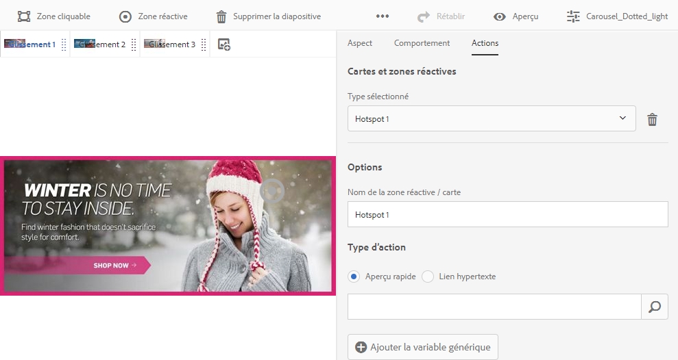

Lorsque vous sélectionnez (au lieu de saisir manuellement) l’emplacement des zones réactives ou des zones cliquables, vous utilisez le sélecteur. Le sélecteur de sites ne fonctionne que si vous êtes un client [!DNL Adobe Experience Manager Sites]. Le sélecteur de produits nécessite également [!DNL Experience Manager Commerce].

## Sélection de produits dans Dynamic Media {#selecting-products}

Utilisez le sélecteur de produits pour choisir un produit lorsque vous souhaitez qu’une zone réactive ou une zone cliquable fournisse un aperçu rapide d’un produit spécifique de votre catalogue de produits.

1. Accédez à l’ensemble de carrousels, à l’image interactive ou à la vidéo interactive, puis appuyez sur l’onglet **[!UICONTROL Actions]** (disponible uniquement si vous avez défini une zone réactive ou une zone cliquable).

   Le sélecteur de produits se trouve dans la zone **[!UICONTROL Type d’action]**.

   

1. Appuyez sur l’icône du **[!UICONTROL sélecteur de produits]** (loupe) et accédez à un produit dans le catalogue.

   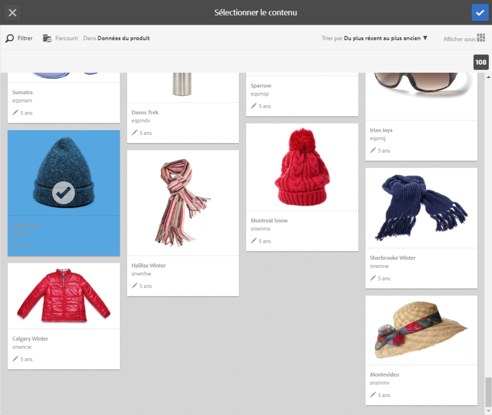

   Vous pouvez filtrer par mot-clé ou balise en appuyant sur **[!UICONTROL Filtrer]** et en entrant des mots-clés, en sélectionnant des balises, ou les deux.

   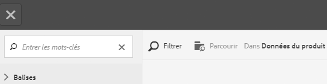

   Vous pouvez modifier l’emplacement où [!DNL Experience Manager] recherche les données de produit en appuyant sur **[!UICONTROL Parcourir]** et en accédant à un autre dossier.

   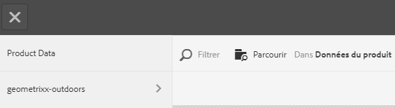

   Appuyez sur **** Trier pour indiquer si trie du plus récent au plus ancien ou du plus ancien au plus récent.[!DNL Experience Manager]

   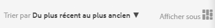

   Appuyez sur **[!UICONTROL Afficher sous]** pour changer l’affichage des produits (mode **[!UICONTROL Liste]** ou mode **[!UICONTROL Carte]**).

   

1. Une fois le produit sélectionné, le champ reçoit la miniature et le nom du produit.

   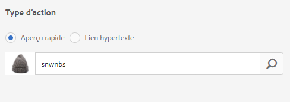

1. En mode **[!UICONTROL Aperçu]**, vous pouvez appuyer sur la zone réactive ou la zone cliquable et voir comment l’aperçu rapide s’affiche.

   

## Sélection de sites dans Dynamic Media {#selecting-sites}

Utilisez le sélecteur de site pour choisir une page web lorsque vous souhaitez qu’une zone réactive ou une zone cliquable pointe vers une page web gérée sur [!DNL Experience Manager] sites.

1. Accédez à l’ensemble de carrousels, à l’image interactive ou à la vidéo interactive, puis appuyez sur l’onglet **[!UICONTROL Actions]** (disponible uniquement si vous avez défini une zone réactive ou une zone cliquable).

   Le sélecteur de sites se trouve dans la zone **[!UICONTROL Type d’action]**.

   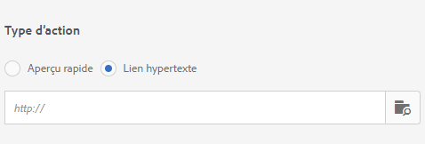

1. Appuyez sur l’icône **[!UICONTROL Sélecteur de sites]** (dossier avec loupe) et accédez à une page parmi vos sites à laquelle vous voulez relier la zone réactive ou la zone cliquable.[!DNL Experience Manager]

   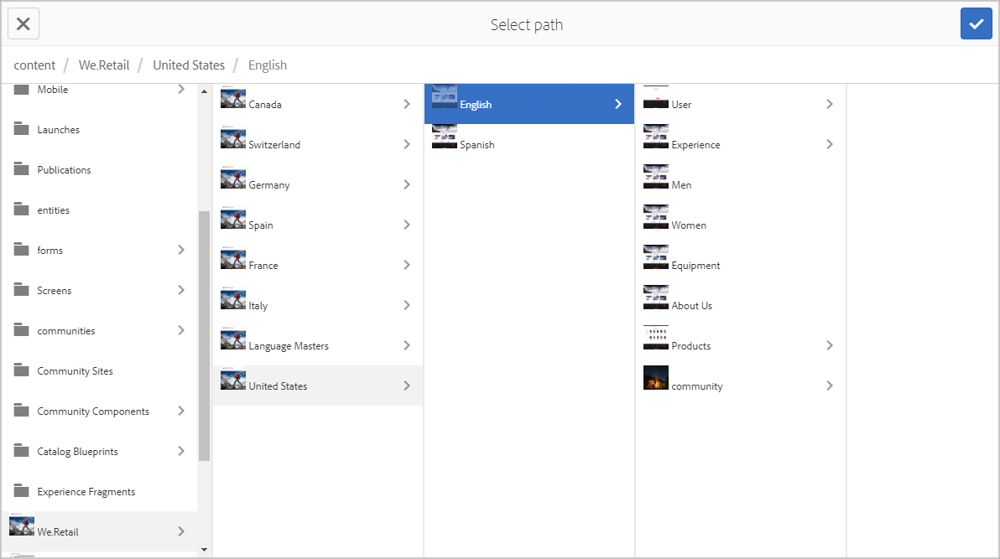

1. Une fois le site sélectionné, le champ reçoit le chemin d’accès.

   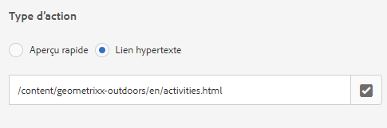

1. En mode **[!UICONTROL Aperçu]**, si vous appuyez sur la zone réactive ou la zone cliquable, vous accédez à la page  Site que vous avez spécifiée.[!DNL Experience Manager]

## Sélection de ressources dans Dynamic Media {#selecting-assets}

Utilisez ce sélecteur pour sélectionner les images à utiliser dans une bannière de carrousel, une vidéo interactive, des visionneuses d’images, de contenus multimédia variés et à 360°. Dans la vidéo interactive, le sélecteur de ressources est disponible lorsque vous tapez sur **[!UICONTROL Sélectionner des ressources]** dans l’onglet **[!UICONTROL Contenu]**. Dans les ensembles de carrousels, le sélecteur de ressources est disponible lorsque vous créez une diapositive. Dans les visionneuses d’images, de supports variés et à 360°, le sélecteur de ressources est disponible lorsque vous créez une visionneuse d’images, de supports variés ou à 360°, respectivement.

Reportez-vous également à la section [Sélecteur de ressources](/help/assets/search-assets.md#asset-selector) pour plus d’informations.

1. Accédez à l’ensemble de carrousel et créez une diapositive. Ou accédez à la vidéo interactive, accédez à l’onglet **[!UICONTROL Contenu]**, puis sélectionnez des ressources. Vous pouvez également créer des visionneuses de contenu multimédia varié, d’images ou à 360°.
1. Tapez sur l’icône **[!UICONTROL Sélecteur de ressources]** (dossier avec loupe) et accédez à une ressource.

   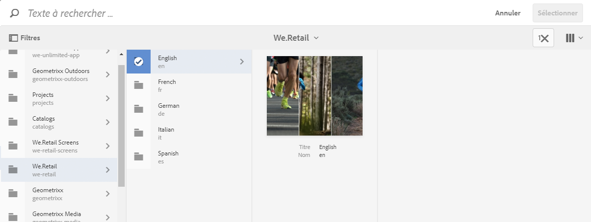

   Filtrez par mot-clé ou balise en appuyant sur **[!UICONTROL Filtrer]** et en entrant des mots-clés, ou en ajoutant des critères, ou les deux.

   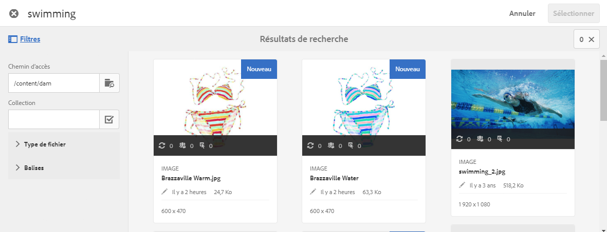

   Vous pouvez modifier l’emplacement où [!DNL Experience Manager] recherche les ressources en accédant à un autre dossier dans le champ **[!UICONTROL Chemin]**.

   Appuyez sur **[!UICONTROL Collection]** pour rechercher uniquement des ressources dans les collections.

   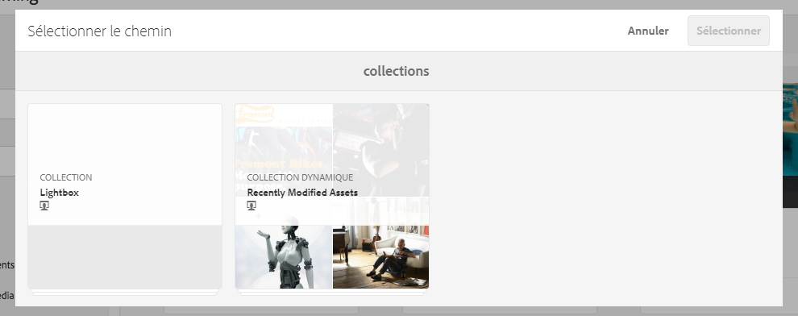

   Appuyez sur **[!UICONTROL Afficher sous]** pour changer l’affichage des produits (en mode **[!UICONTROL Liste]**, en mode **[!UICONTROL Colonne]** ou en mode **[!UICONTROL Carte]**).

   

1. Pour sélectionner la ressource, appuyez sur la coche. La ressource s’affiche.

   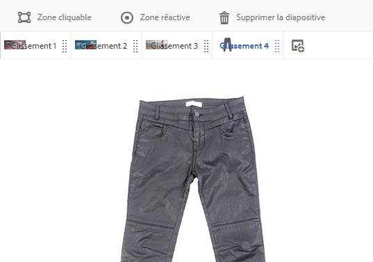
-->
