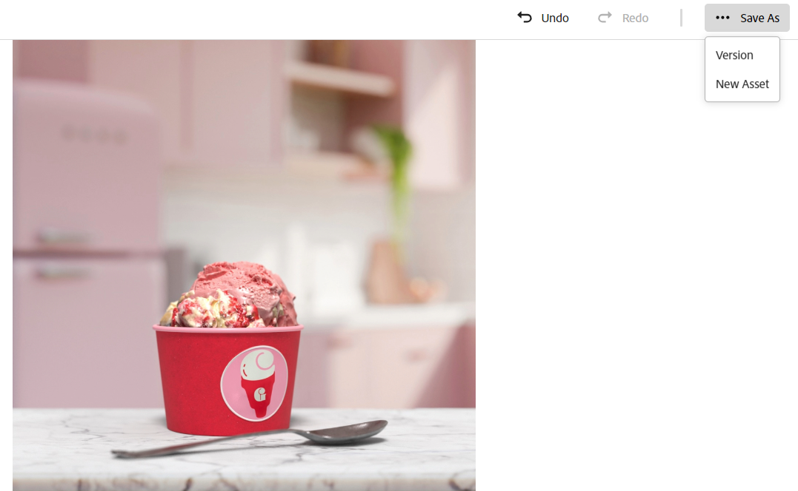
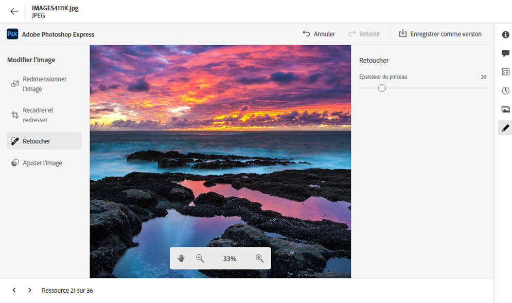
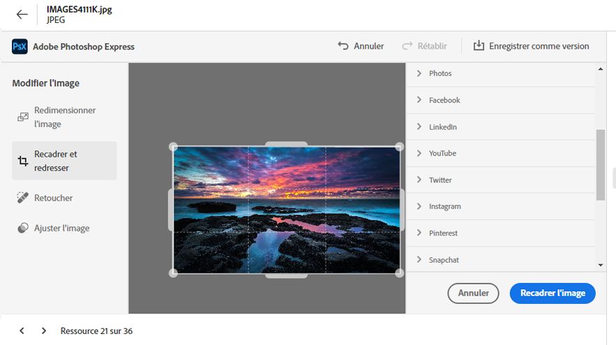
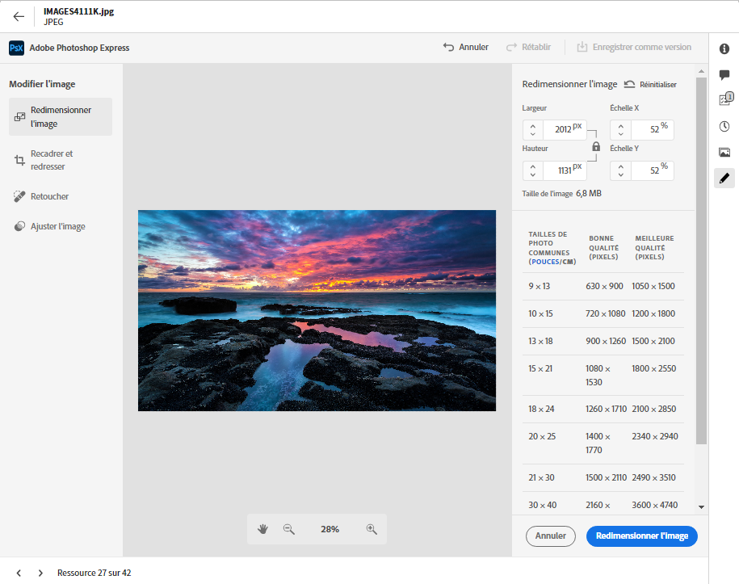
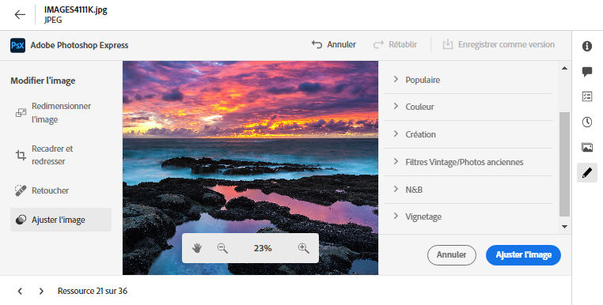

# Modifier des images dans [!DNL Assets view] {#edit-images-in-assets-view}

L’interface utilisateur Vue Assets permet une modification d’image de base optimisée par Adobe Express et intégrée à l’interface utilisateur. Cette modification inclut le redimensionnement, la suppression en arrière-plan, le recadrage et la conversion entre les formats JPEG et PNG. En outre, il permet une modification avancée via l’interface d’Adobe Express intégrée à l’interface utilisateur de la vue Assets.

Après avoir modifié une image, vous pouvez enregistrer la nouvelle image en tant que nouvelle version de cette image. Le contrôle de version vous permet de revenir ultérieurement à la ressource d’origine, si nécessaire. Pour modifier une image, [ouvrez sa prévisualisation](https://experienceleague.adobe.com/fr/docs/experience-manager-assets-essentials/help/navigate-view#preview-assets) et cliquez sur **Modifier l’image**.

>[!NOTE]
>
>Vous pouvez modifier les images des types de fichiers PNG et JPEG à l’aide d’[!DNL Adobe Express].

<!--The editing actions that are available are Spot healing, Crop and straighten, Resize image, and Adjust image.-->

## Modifier l’image {#edit-image}

Accédez à l’interface utilisateur de la vue Assets, en utilisant le lien [Vue Assets](https://experience.adobe.com/#/assets) et en sélectionnant le référentiel approprié. Pour recevoir un accès, contactez l’équipe d’administration de votre entreprise.
Pour toute information de référence supplémentaire, reportez-vous aux sections [Prise en main de la vue Adobe Experience Manager Assets](https://experienceleague.adobe.com/en/docs/experience-manager-cloud-service/content/assets/assets-view/get-started-assets-view), [Comprendre l’interface utilisateur de la vue Assets](https://experienceleague.adobe.com/en/docs/experience-manager-cloud-service/content/assets/assets-view/navigate-assets-view#understand-interface-navigation) et [Cas d’utilisation de la vue Assets](https://experienceleague.adobe.com/en/docs/experience-manager-cloud-service/content/assets/assets-view/get-started-assets-view#use-cases).
<!--
>[!CONTEXTUALHELP]
>id="assets_express_integration"
>title="Adobe Express Integration"
>abstract="Easy and intuitive image-editing tools powered by Adobe Express available directly within AEM Assets to increase content reuse and accelerate content velocity."-->

### Modifier l’image dans la vue Assets à l’aide d’Adobe Express {#edit-image-on-assets-view-using-adobe-express}

Après avoir accédé à la vue Assets, cliquez sur **Assets**, sélectionnez une image, puis cliquez sur **Modifier** dans le rail supérieur. Le nouvel écran affiche les options de modification disponibles optimisées par Adobe Express, notamment le redimensionnement, la suppression de l’arrière-plan, le recadrage et la conversion entre les formats JPEG et PNG.

#### Redimensionnement de l’image {#resize-image-using-express}

Le redimensionnement d’une image à une taille spécifique est un cas d’utilisation courant. La vue Assets vous permet de redimensionner rapidement les images pour les adapter aux tailles de photo courantes en fournissant de nouvelles résolutions précalculées pour des tailles de photo spécifiques. Pour redimensionner l’image dans la vue Assets, procédez comme suit :

1. Cliquez sur **Redimensionner l’image** dans le volet de gauche. Une boîte de dialogue affiche les fonctionnalités de redimensionnement d’image optimisées par Adobe Express.
1. Sélectionnez la plateforme de médias sociaux appropriée dans la liste déroulante Redimensionner et sélectionnez la taille de l’image parmi les options qui s’affichent.
1. Mettez l’image à l’échelle, le cas échéant, à l’aide du champ **Échelle d’image**.
1. Cliquez sur **[!UICONTROL Appliquer]** pour appliquer vos modifications.
   

   Votre image modifiée peut être téléchargée. Vous pouvez enregistrer la ressource modifiée en tant que nouvelle version de la même ressource ou l’enregistrer en tant que nouvelle ressource.
   

#### Supprimer l’arrière-plan {#remove-background-using-express}

Vous pouvez supprimer l’arrière-plan d’une image en quelques étapes simples, comme indiqué ci-dessous :

1. Cliquez sur **Supprimer l’arrière-plan** dans le volet de gauche. Experience Manager Assets affiche l’image sans arrière-plan.
1. Cliquez sur **[!UICONTROL Appliquer]** pour appliquer vos modifications.
   

   Votre image modifiée peut être téléchargée. Vous pouvez enregistrer la ressource modifiée en tant que nouvelle version de la même ressource ou l’enregistrer en tant que nouvelle ressource.

#### Recadrer l’image {#crop-image-using-express}

La transformation d’une image en taille parfaite est facile à l’aide des actions rapides intégrées d’[!DNL Adobe Express].

1. Cliquez sur **[!UICONTROL Recadrer l’image]** dans le volet de gauche.
2. Faites glisser les poignées sur les coins de l’image pour créer le recadrage souhaité.
3. Cliquez sur **[!UICONTROL Appliquer]**.
   
L’image recadrée peut être téléchargée. Vous pouvez enregistrer la ressource modifiée en tant que nouvelle version de la même ressource ou l’enregistrer en tant que nouvelle ressource.

#### Convertir le JPEG en PNG {#convert-image-types-using-express}

Vous pouvez rapidement convertir les formats d’image JPEG et PNG à l’aide d’Adobe Express. Procédez comme suit :

1. Cliquez sur **JPEG en PNG** ou **PNG en JPEG** dans le volet de gauche.
   <!---->
1. Cliquez sur **[!UICONTROL Télécharger]**.

#### Limites {#limitations-adobe-express}

* Résolution d’image prise en charge : minimum de 50 pixels, maximum de 6 000 pixels par dimension.
* Taille de fichier maximale prise en charge : 17 Mo.

### Modifier des images à l’aide de l’éditeur intégré d’Adobe Express {#edit-images-in-adobe-express-embedded-editor}

Les utilisateurs disposant de droits Express peuvent utiliser l’éditeur Express intégré à partir de la vue Assets pour modifier facilement le contenu et en créer de nouveaux à l’aide de GenAI à partir d’Adobe Firefly. Cette fonctionnalité améliore la réutilisation du contenu et accélère la vitesse du contenu. Vous pouvez également utiliser des éléments prédéfinis pour optimiser l’aspect de vos ressources ou exécuter des actions rapides pour modifier vos images en quelques clics seulement.

Pour modifier des images à l’aide de [!DNL Adobe Express]’éditeur incorporé, procédez comme suit :

1. Accédez à la vue AEM Assets à l’aide du lien [Vue AEM Assets](https://experience.adobe.com/#/assets) et sélectionnez le référentiel approprié.
1. Cliquez sur **Ressources**, saisissez un dossier et sélectionnez une image.
1. Cliquez sur **Ouvrir dans Adobe Express**. L’image s’ouvre sur une zone de travail Express.
1. Apportez les modifications requises à l’image.
1. Si votre projet nécessite l’ajout de pages supplémentaires, cliquez sur **Ajouter**, sélectionnez Ressources, saisissez un dossier, sélectionnez une image à importer sur la page de zone de travail, puis apportez les modifications requises à l’image.
1. Pour enregistrer une ou plusieurs ressources, cliquez sur **Enregistrer**. La boîte de dialogue d’enregistrement affiche les options d’enregistrement. Pour choisir parmi les options d’enregistrement, suivez l’une des instructions ci-dessous qui correspond à vos besoins :
   1. Pour enregistrer une seule page, cliquez sur **Enregistrer en tant que version** pour exporter l’image en tant que nouvelle version (en conservant le format d’origine), puis enregistrez-la dans le même dossier.

   1. Pour enregistrer une seule page, cliquez sur **Enregistrer en tant que nouvelle ressource** pour exporter la ressource dans un autre format et l’enregistrer dans un dossier en tant que nouvelle ressource.

   1. Si vous souhaitez enregistrer une seule page à partir de plusieurs pages, cliquez sur **Enregistrer en tant que version** pour enregistrer la ressource dans son format et son emplacement d’origine.

   1. Pour enregistrer plusieurs pages ou une seule page parmi plusieurs pages, cliquez sur **Enregistrer en tant que nouvelle ressource**. Cette action exporte les ressources uniques ou multiples dans n’importe quel dossier et les enregistre en tant que nouvelles ressources ou ressources dans le format d’origine ou dans un autre format.

1. Dans la boîte de dialogue Enregistrer, procédez comme suit :
   1. Saisissez un nom pour le fichier dans le champ **Enregistrer sous**.
   1. Sélectionnez un dossier de destination.
   1. Facultatif : fournissez des détails tels que le nom du projet ou de la campagne, les mots-clés, les canaux, la période et la région.
1. Cliquez sur **Enregistrer en tant que version** ou **Enregistrer en tant que nouvelle ressource** pour enregistrer les ressources.

#### Limites de la modification des images dans l’éditeur Express {#limitations-of-editing-images-in-the-express-editor}

* Type de fichier pris en charge : JPEG ou PNG.
* Taille de fichier maximale prise en charge : 40 Mo.
* Largeur et hauteur prises en charge : entre 50 et 8 000 pixels.
* Rechargez la page pour afficher la dernière ressource enregistrée dans le dossier source.

### Créer des ressources à l’aide d’Adobe Express {#create-new-embedded-editor}

[!DNL Assets view] vous permet de créer un modèle entièrement nouveau à l’aide de l’éditeur intégré [!DNL Adobe Express]. Pour créer une ressource à l’aide d’[!DNL Adobe Express], exécutez les étapes suivantes :

1. Accédez à **[!UICONTROL Mon Workspace]** et cliquez sur **[!UICONTROL Créer]** dans la bannière Adobe Express qui s’affiche en haut. La zone de travail vierge d’[!DNL Adobe Express] s’affiche dans l’interface utilisateur d’[!DNL Assets view].
1. Créez votre contenu à l’aide de [modèles](https://helpx.adobe.com/fr/express/using/work-with-templates.html). Sinon, accédez à **[!UICONTROL Vos créations]** pour modifier le contenu existant.
1. Une fois les modifications terminées, cliquez sur **[!UICONTROL Enregistrer]**.
1. Spécifiez le chemin de destination de la ressource créée et cliquez sur **[!UICONTROL Enregistrer en tant que nouvelle ressource]**.

#### Limites {#limitations}

* Vous ne pouvez modifier que les images dont les types de format sont `JPEG` et `PNG`.
* La taille de la ressource doit être inférieure à 40 Mo.
* Vous pouvez enregistrer une image aux formats `PDF`, `JPEG` ou `PNG`.

<!--
## Edit images using [!DNL Adobe Photoshop Express] {#edit-using-photoshop-express}

<!--
After editing an image, you can save the new image as a new version. Versioning helps you to revert to the original asset later, if needed. To edit an image, [open its preview](navigate-assets-view.md#preview-assets) and click **[!UICONTROL Edit Image]**  from the rail on the right.

*Figure: The options to edit images are powered by [!DNL Adobe Photoshop Express].*
-->
<!--
### Touch up images {#spot-heal-images-using-photoshop-express}

If there are minor spots or small objects on an image, you can edit and remove the spots using the spot healing feature provided by Adobe Photoshop.

The brush samples the retouched area and makes the repaired pixels blend seamlessly into the rest of the image. Use a brush size that is only slightly larger than the spot you want to fix.

<!-- 
TBD: See if we should give backlinks to PS docs for these concepts.
For more information about how Spot Healing works in Photoshop, see [retouching and repairing photos](https://helpx.adobe.com/photoshop/using/retouching-repairing-images.html). 
-->
<!-- 
### Crop and straighten images {#crop-straighten-images-using-photoshop-express}

Using the crop and straighten option that you can do basic cropping, rotate image, flip it horizontally or vertically, and crop it to dimensions suitable for popular social media websites.

To save your edits, click **[!UICONTROL Crop Image]**. After editing, you can save the new image as a version.

Many default options let you crop your image to the best proportions that fit various social media profiles and posts.

### Resize image {#resize-image-using-photoshop-express}

You can view the common photo sizes in centimeters or inches to know the dimensions. By default, the resizing method retains the aspect ratio. To manually override the aspect ratio, click .

Enter the dimensions and click **[!UICONTROL Resize Image]** to resize the image. Before you save the changes as a version, you can either undo all the changes done before saving by clicking [!UICONTROL Undo] or you can change the specific step in the editing process by clicking [!UICONTROL Revert].

### Adjust image {#adjust-image-using-photoshop-express}

[!DNL Assets view] lets you adjust the color, tone, contrast, and more, with just a few clicks. Click **[!UICONTROL Adjust image]** in the edit window. The following options are available in the right sidebar:

* **Popular**: [!UICONTROL High Contrast & Detail], [!UICONTROL Desaturated Contrast], [!UICONTROL Aged Photo], [!UICONTROL B&W Soft], and [!UICONTROL B&W Sepia Tone].
* **Color**: [!UICONTROL Natural], [!UICONTROL Bright], [!UICONTROL High Contrast], [!UICONTROL High Contrast & Detail], [!UICONTROL Vivid], and [!UICONTROL Matte].
* **Creative**: [!UICONTROL Desaturated Contrast], [!UICONTROL Cool Light], [!UICONTROL Turquoise & Red], [!UICONTROL Soft Mist], [!UICONTROL Vintage Instant], [!UICONTROL Warm Contrast], [!UICONTROL Flat & Green], [!UICONTROL Red Lift Matte], [!UICONTROL Warm Shadows], and [!UICONTROL Aged Photo].
* **B&W**: [!UICONTROL B&W Landscape], [!UICONTROL B&W High Contrast], [!UICONTROL B&W Punch], [!UICONTROL B&W Low Contrast], [!UICONTROL B&W Flat], [!UICONTROL B&W Soft], [!UICONTROL B&W Infrared], [!UICONTROL B&W Selenium Tone], [!UICONTROL B&W Sepia Tone], and [!UICONTROL B&W Split Tone].
* **Vignetting**: [!UICONTROL None], [!UICONTROL Light], [!UICONTROL Medium], and [!UICONTROL Heavy].

<!--
TBD: Insert a video of the available social media options.
-->

### Étapes suivantes {#next-steps}

* Faites des commentaires sur le produit en utilisant l’option [!UICONTROL  Commentaires ] disponible dans l’interface utilisateur de l’affichage d’Assets.

* Faites des commentaires sur la documentation en utilisant les options [!UICONTROL Modifier cette page]  ou [!UICONTROL Enregistrer un problème]  disponibles dans la barre latérale de droite.

* Contacter l’[assistance clientèle](https://experienceleague.adobe.com/fr?support-solution=General#support)

>[!MORELIKETHIS]
>
>* [ Actions rapides dans Adobe Express ](https://helpx.adobe.com/fr/express/using/resize-image.html)
>* [Affichage de l’historique des versions d’une ressource](navigate-assets-view.md)
